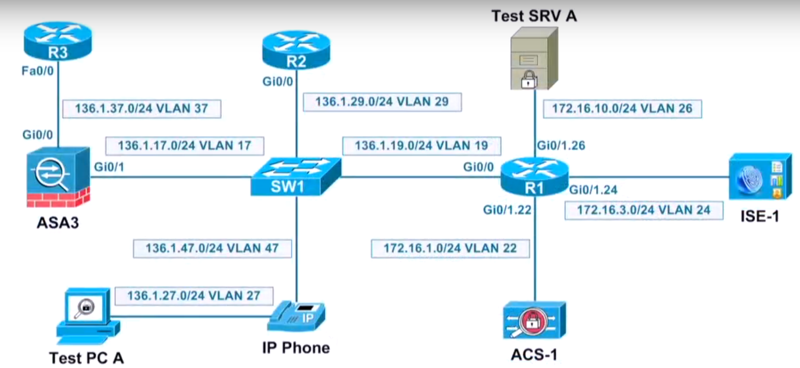
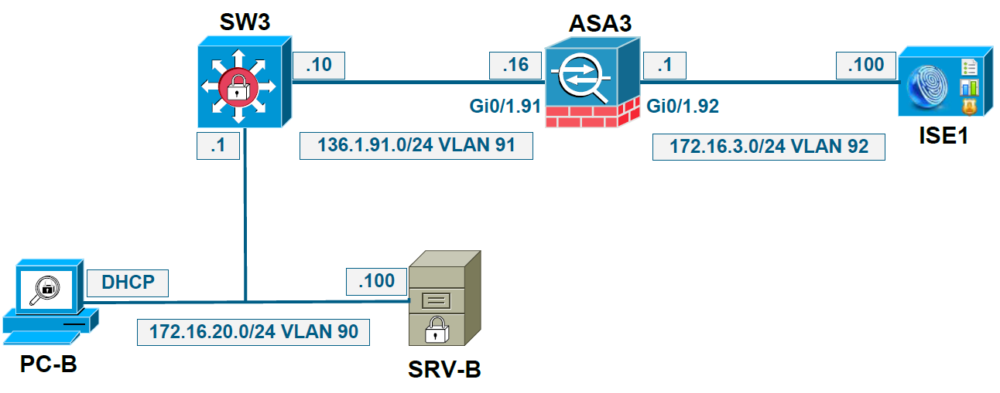
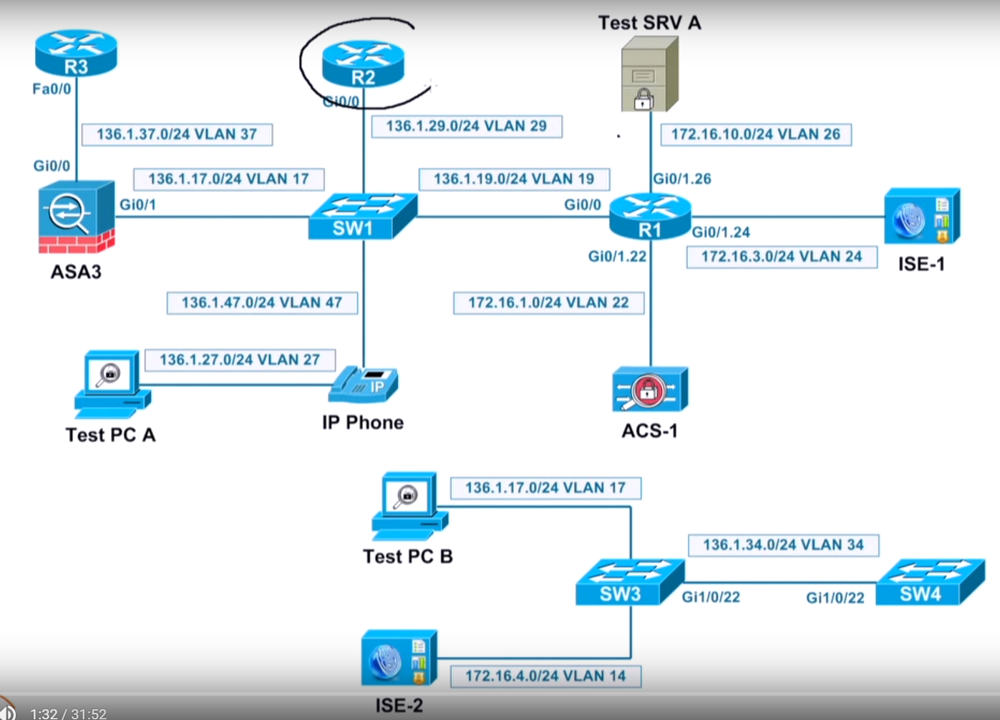
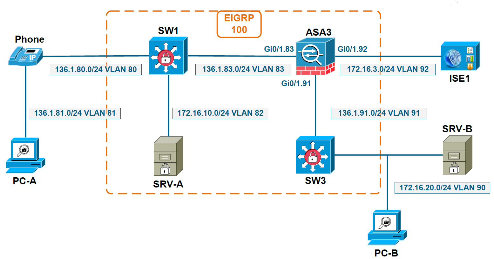

# Authentication & Authorization - MAB

## 802.1X, MAB, and EAP Overview

+ 802.1x vs MAB
    + 802.1x:
        + a flexible L2 authentication method
        + using EAP protocols, tunneled by the switch inside RADIUS pkts
        + client and switch perform EAP negotiation
        + happen before being assigned an IP addr via DHCP
    + MAB (MAC Authentication Bypass)
        + authenticate non-802.1x capable devices
        + trigger CWA (Central Web Authentication), CPP (Client Provisioning), and BYOD enrollment
        + Simple L2 authentication method
            + no negotiation btw client and switch
            + switch takes each newly learned MAC addr & sends to RADIUS for authentication
        + client no capable of negotiation w/ switch or wireless controller for RADIUS validation
        + RADIUS pkts contains:
            + RADIUS Username: MAC
            + RADIUS Password: MAC
            + Calling Station ID: MAC (substitute username & password)
            + Server Type: CALL-CHECK
        + Depending on RADIUS server config, MAB authentication
            + done based on the Call-Station-Id value -> no fake username/password in ISE db
            + otherwise, username/password authentication via PAP/MD5 performed

+ Network Topology
    <br/>
    + Devices
        + Supplicant: Test PC A
        + Authenticator (NAD): SW1
        + Authentication Server: ISE-1
        + Non-802.1x device: IP Phone
    + Protocols: 
        + Supplicant <-> NAD: EAP
        + NAD <-> Authentication Server: RADIUS
        + IP Phone <-> SW1: MAB

+ EAP Types (Extensible Authentication Protocol)
    + EAP-TLS
        + One phase protocol
        + Mutual authentication based on certificates
        + Client & server certificates required
        + No identity protection - clear text
    + PEAP (Protected EAP)
        + Two phase protocol
            + Phase 1: outer method, authenticate server and form the TLS channel
            + Phase 2: inner method, authenticate client and protect client identity
        + Mutual authentication
            + Server always authenticated by certificate
            + Client authentication: certificate (EAP-TLS)
            + Theoretically, inner authentication method could be any EAP type
        + Identity protection only in TLS channel negotiation -> phase 2, after TLS channel negotiated
        + Windows IEEE 802.1x feature: NIC > Properties > Authentication > enable IEEE 802.1x authentication: PEAP Settings (Outer method), Configuration (Inner method)
    + EAP-FAST (Flexible Authentication via Secure Tunneling)
        + Cisco proprietary
            + Allow fast re-authentication and wireless roaming
            + Windows NOT supported
        + Based on PAC file (Protected Access Credentials)
            + Seen as a cookie locally on the client after authentication
            + Generated by RADIUS server from a master key known by itself only
        + Three-phases process
            + Phase 0: optional, provisioning the client w/ a PAC file
                + Using EAP-MSCHAPv2 or EAP-GTC
                + Once successful, client not yet authenticated
            + Phase 1: establish TLS tunnel based on the PAC file
            + Phase 2: authenticate the client within the TLS tunnel (EAP-TLS, EAP-MSCHAPv2, EAP-GTC)
    + EAP-FASTv2 (EAP-Chaining)
        + Tie machine authentication to user authentication
            + Scalable alternative to MAR (Machine Access Restriction)
            + Relies on machine PAC and user PAC
            + Perform double authentication within single EAP transaction (both Machine & User AuthN)
        + Flow: PC -Supplicant, SW - Authenticator, ISE - Authentication Server
            1. Request: PC - EAP (Machine) -> SW <- RADIUS [EAP (Machine)] -> ISE
            2. Accept: PC <- PAC (Machine) - SW <- RADIUS [EAP (Machine)] -> ISE
            3. AuthN: PC - EAP (User) [PAC(Machine) + PAC(User)] <- RADIUS [EAP - [PAC(Machine) + PAC(User)] -> ISE
        + Will become standard, known as EAP-TEAP
    + EAP-TTLS (Tunnel TLS)
        + Very similar with PEAP: two-phases protocol
        + Not supported by Windows
        + Not widely implemented
        + Major advantage: inner method uses any authentication mechanism, including non-EAP such as PAP and CHAP
    + EAP-MD5
        + Only user authentication based on username/password
        + Challenge-response through MD5
    + EAP-LEAP (Light EAP)
        + Cisco proprietary
        + Used only for wireless (WEP or TKip keys)
        + Weak mutual authentication based on shared secrete (client's password)
        + Modified version of MS-CHAP -> challenge-response based
        + Client authentication based on username/password

<a href="https://www.youtube.com/watch?v=HcsVXH9RXZQrl" alt="069 802 1x, MAB, EAP Overview" target="_blank">
   
</a>

## Network Access Authentication

+ Layer 2
    + Supplicant does not need an IP address
    + MAB and 802.1x (EAP methods)
+ Layer 3
    + Supplicant requires an IP address
    + Local Web Authentication (LWA, web portal on the NAD)
    + Central Web Authentication (CWA, web portal on the authentication server)

+ Authentication Flowchart
    <br/>

+ Port-Based Authentication Methods - [802.1x Features](https://www.cisco.com/c/en/us/td/docs/switches/lan/catalyst2960x/software/15-0_2_EX/security/configuration_guide/b_sec_152ex_2960-x_cg/b_sec_152ex_2960-x_cg_chapter_010000.html)

| 802.1x Features | Single Host | Multiple host | MDA | Multiple Authentication |
|-----------------|-------------|---------------|-----|-------------------------|
| 802.1x | VLAN assignment <br/> Per-user ACL <br/> Filter-ID attribute <br/> Downloadable ACL  <br/> Redirect URL | VLAN assignment | VLAN assignment <br/> Per-user ACL <br/> Filter-ID attribute <br/> Downloadable ACL  <br/> Redirect URL | VLAN assignment <br/> Per-user ACL <br/> Filter-ID attribute <br/> Downloadable ACL  <br/> Redirect URL |
| MAC authentication <br/>bypass | VLAN assignment <br/> Per-user ACL <br/> Filter-ID attribute <br/> Downloadable ACL  <br/> Redirect URL | VLAN assignment | VLAN assignment <br/> Per-user ACL <br/> Filter-ID attribute <br/> Downloadable ACL  <br/> Redirect URL | VLAN assignment <br/> Per-user ACL <br/> Filter-ID attribute <br/> Downloadable ACL  <br/> Redirect URL |
| Standalone web<br/> authentication | Proxy ACL <br/> Filter-Id attribute <br/> downloadable ACL |Proxy ACL <br/> Filter-Id attribute <br/> downloadable ACL | Proxy ACL <br/> Filter-Id attribute <br/> downloadable ACL | Proxy ACL <br/> Filter-Id attribute <br/> downloadable ACL |
| NAC Layer 2 IP<br/> validation | Filter-Id attribute <br/> Downloadable ACL <br/> Redirect URL | Filter-Id attribute <br/> Downloadable ACL <br/> Redirect URL | Filter-Id attribute <br/> Downloadable ACL <br/> Redirect URL | Filter-Id attribute <br/> Downloadable ACL <br/> Redirect URL | 
| Web authentication<br/> as fallback method | Proxy ACL <br/> Filter-Id attribute <br/> Downloadable ACL | Proxy ACL <br/> Filter-Id attribute <br/> Downloadable ACL | Proxy ACL <br/> Filter-Id attribute <br/> Downloadable ACL | Proxy ACL <br/> Filter-Id attribute <br/> Downloadable ACL |

## MAB – MAC Authentication Bypass

+ MAB (MAC Authentication Bypass) is used to…
    + Authenticate non 802.1x capable devices
    + Trigger CWA and BYOD enrollment
    + Technically is NOT an authentication method…just bypasses authentication
+ If MAB is enabled on the switch interface: Switch takes each new MAC address and sends it to RADIUS for authentication
    + RADIUS User-Name and RADIUS User-Password: MAC address
    + RADIUS Calling-Station-ID: MAC address
    + RADIUS Service Type: Call-Check (10) for MAB
+ If “Process Host Lookup” is enabled on RADIUS server: Authentication is done based on the RADIUS Calling-Station-ID attribute value
+ If “Process Host Lookup” is disabled on RADIUS server: Authentication is done based on the RADIUS User-Name and User-Password attributes value

+ High-Level MAB Sequence
    <br/>

## MAB Configuration Steps on Supplicant

+ No Configuration Required, due to MAB
    + Not an authentication protocol
    + Authentication bypass
    + No negotiation between supplicant and NAD

## MAB Configuration Steps on NAD

+ Enable AAA (global): `aaa new-model`
+ Configure dot1x default authentication list (global): `aaa authentication dot1x default group <grp>`
+ Enable MAB on switch port facing the supplicant (interface): `mab [eap]`
+ Enforce authentication on switch port facing the supplicant (interface): `authentication port-control auto`
+ Define RADIUS server settings (global): `radius-server host <IP> key <radius_key>`
+ Optionally configure other global/interface level settings (global/interface): `radius-server attribute 31 mac format`

## MAB Configuration Steps on ISE

+ Configure MAB authentication policy
    + Optionally use a default one
+ Configure authorization policy
    + Optionally use a default one
+ Add supplicant’s MAC address into Internal Endpoints Store
    + Authentication performed based on RADIUS Calling-Station-ID attribute value

## MAB Verification and Troubleshooting

+ Verification
    + `show mab all`
    + `show authentication sessions`
    + `show aaa servers`

+ Troubleshooting
    + `show authentication sessions interface <if>`
    + `debug mab all`
    + `debug radius authentication`

+ TRBL Steps:
    1. MAB NAD Authentication enabled
    2. Radius config correct
    3. ISE Config

+ TRBL Reference: [Cisco Identity Service Engine Troubleshooting Guide](https://www.cisco.com/c/en/us/support/security/identity-services-engine/products-troubleshooting-guides-list.html)

+ Demo: 
    + Topology:
        <br/>
        + Supplicant: PC-B
        + Authenticator / NAD: SW3
        + Authentication Server: ISE1
    + SW3 Config Verification
        ```cfg
        show tun all | i radius-server attribute
        show mab all
        show authentication int gi1/0/5
        show aaa servers
        show radius authentication
        ```
    + TRBL Procedure: 
        1. PC-B <--> SW3: supplicant & NAD - no negotiation: physical port up and running
        2. Radius config on NAD: NAD properly provisioned w/ authentication server, UDP 1635/1812
        3. ISE Config: authentication & authorization
    
    + Sw3 config:
        ```cfg
        conf t
        int gi1/0/5
          no mab
          do show mab all
          mab
          authentication port-control force-authorized
          do show authentication sessions int gi1/0/5   ! client list empty
          do show mac address-table init gi1/0/5
          auth port-control auto
          do show aaa server        ! state= current up
        exit
        test add group radius <user> <pwd> legacy  ! rejected by server
        ```

## ISE MAB Authentication

+ MAB Config
    + Enable AAA (global): `aaa new-model`
    + Define RADIUS server settings: IP addr/hostname, port, etc.
    + Config dot1x default authentication list (interface): `aaa authentication dot1x default group`
    + Enable  MAB on the port (interface): `mab [eap]`
    + Enforce port authentication (interface): `authentication port-control auto`
    + Optionally config other global/port settings

+ Lab topology
    <br/>
    + Client: R2
    + Authenticator/NAD: SW1
    + Authentication Server: ISE-1

+ Authetication Process: Default by using Radius Calling-Station-ID Attribute
    + Authenticator, NAD: SW1 config
        ```cfg
        config terminal
        inf f1/0/2
          switchport access vlan29
          switchport mode access
          spanning-tree portfast
        exit

        aaa new-mo0del
        aaa group server radius ISE_RADIUS
          server private 172.16.1.100 key cisco
          ip radius source-interface loopback 0
        exit

        aaa authentication dot1x default group ISE_RADIUS

        do show cdp neighbor    ! R2 f1/0/2
        do show mac address-table dynamic int f1/0/2    ! get MAC addr d867.d9e0.bbc0
        ```
    + ISE Config
        + Adminstration > Network Resources / Network Devices > manually/default
        + Default mechanism: ISE received inbound radius request
            + lookup  network device session to authenticate
            + otherwise, fallback to default device
        + Manually add: Network Devices > Add: Name=sw1; ip addr=150.1.9.1/32; authentication settings=shared secret: cisco
        + Administration > Identity Management > Identities > Endpoints > Add: MAC Addr=d8:67:d9:e0:bb:c0
        + Policy > Authentication: MAB, Wired_MAB
            + Allowed Protocols: None (802.1x EAP use)
            + New Rule: Authentication > Allowed Protocols > Add: Name=MAB; check the followings: Process Host Lookup only (using Calling-Station-ID); Allowed Protocols=MAB; use=Internal Endpoints
        + Policy > Authorization > Authorization Policy
            + Wired Black List Default=Black List AND Wireless 802.1x
            + Profiled Cisco IP Phones=Cisco IP-Phone
            + Permissions=PermitAccess
    + Verification on SW1
        ```cfg
        show mac address-table dynamic int f1/0/2   ! nothing shown
        show mac address-table int f1/0/2           ! d867.d9e0.bbc0 STATIC
        show authentication sessions                ! Summary w/ SID
        show authentication sessions int f1/0/2
        ! messages for MAC addr, user-Name, Status, Authorized by, Method, State
        show mab all
        ```
    + Verification on ISE-1: Operations > Authentications > Entry (for detail)

+ Authentication with Username & Password
    + ISE-1: using MAC address as username
        + Administration > Identity Management / Identities > Users > Add: Name=d867d9e0bbc0 (not allowed by default)
        + Adminstration > Settings > User Password Policy:
            + disable username & password not the same
            + disable contain uppercase Alphabetic characters
    + ISE-1 Policy Results > Authentication > Allowed Protocols > MAB: 
        + disable Process Host Lookup
        + enable Allow:PAP/ASCII
    + SW1: `clear authentication sessions session-id <sid>`
    + ISE-1 Verification: Operations > Authentications - failed entry shown
    + ISE-1: Policy > Authentication > MAB Entry: use=Internal Users
    + SW1: 
        ```cfg
        show authentication sessions                        ! failed
        clear authentication sessions session-id <sid>      ! trigger to re-authenticate
        show authentication session int f1/0/2
        ```
    + ISE Verification: Operations > Authentication > Entry details

+ Authentication with Frame (Previous Call Check)
    + ISE-1: Policy > Results > Authentication > MAB: 
        + enable Allow WAP MD5
        + disable Allow EAP-MD5 as Host Lookup
        + Calling Station ID & EAP-MD5 both working
    + SW1:
        ```cfg 
        show authentication sessions     ! get <sid>
        clear authentication sessions session-id <sid>  ! success but not what we want
        conf t
        int f1/0/2
          mab eap
        exit

        do show authentication sessions ! get <sid>
        do clear authetication sessions session-id <sid>
        do show mab all     ! mab eap used
        ```
    + Verification from ISE-1: 
        + Operations > Authentications > Entry detail selected: EAP-MD5 (use service type of frame, not service type of call check)
        + Policy > Authentications: 1st rule - Wired_MAB: use=Internal Users
        + Policy > Conditions > Authentications > Compound Conditions > Wired_802.1x: Service Type=Framed NAS-Port-Type=Ethernet

<a href="https://youtu.be/nazpNmmU2Ys" alt="CCIE Security v4 ATC : ISE MAB Authentication" target="_blank">
   
</a>

+ Simple Authentication Policy Flow & Rule-Based Authentication Policies
    <br/>
    

## MAB and 802.1x Common Authorizations

+ VLAN
    + Data VLAN (by name or number)
    + Optional, it overrides the VLAN locally configured on NAD switch port
    + Voice VLAN permission
    + Mandatory for voice domain, allows Phone to join the voice VLAN as configured locally on NAD

+ Demo Topology
    <br/>

+ Demo: DATA VLAN
    1. SW3 interface gi1/0/5 facing SRV-B w/ VLAN90
    2. Authentication (Data VLAN 41 from ISE1 to SW3)
    3. Override VLAN90 by VLAN41 on SW3

+ Demo: Voice VLAN
    + PC-A on Vlan 81 w/ DHCP for 136.1.81.0/24
    + Phone on VLAN 80 w/ DHCP for 136.1.80.0/24
    + Get voice domain permission from ISE1 to SW1


## MAB and EAP Common Authorizations

+ Access-Lists
    + dACL (Cisco Proprietary, uses AV pairs)
        + Before 12.2(55)SE code, switch port required a pre-auth ACL to be applied
        + ACL configured on ISE
    + Filter-ID ACL (IETF standard)
        + ACL configured on NAD
    + Per-user ACL (Cisco proprietary, uses AV pairs)
        + ACL configured on ISE and ACE’s pushed through authorization by ISE
        + ACL configured on NAD and ACL name pushed through authorization by ISE

+ ACL Common configuration requirements on NAD
    + `aaa authorization network default group <grp>`
        + network: The server must return permission to use network-related services.
        + default: Uses the listed authorization methods that follow this argument as the default list of methods for authorization.
        + group: Uses a subset of RADIUS or TACACS+ servers for authentication as defined by the aaa group server radius or aaa group server tacacs+ command.
    + `radius-server vsa send authentication`
        + Limits the set of recognized vendor-specific attributes to only authentication attributes
        + required by dACL only
    + `ip device tracking`
        + For the switch to obtain and maintain a list of devices that are connected to the switch via an IP address
        + The main IPDT task is to keep track of connected hosts (association of MAC and IP address).
        + Send unicast Address Resolution Protocol (ARP) probes with a default interval of 30 seconds
        + Sent probes to the MAC address of the host connected on the other side of the link
        + Use Layer 2 (L2) as the default source the MAC address of the physical interface out of which the ARP goes and a sender IP address of 0.0.0.0,

+ Demo: SW3 Config
    ```ini
    conf t
      aaa authorization network default group radius
      ip device tracking
      ip device tracing probe interval 30
    exit

    show ip device tracking all    ! all msgs
    ```
+ Message Flow:
    1. SW3 w/ `ip device tracking`
    2. ISE config ACL: a) permission; b) source=any; c) destination=any/specific; e.g., `permit ip ant host 10.10.10.10`
    3. push ACL to SW3


## Authorization Verification Troubleshooting

+ Verification
    + `show ip access-list interface <if_number>`
    + `show ip interface <if_number>`
    + `show epm session interface <if_number>`
    + `show authentication interface <if_number>`
    + `show authentication session interface <if_number>`
+ Troubleshooting
    + `show ip device tracking all`
    + `show aaa method-lists authorization`
    + `debug radius authentication`
    + `debug ip device tracking events`

+ Demo:
    + SW3 Config
        ```cfg
        conf t
        vlan 10
        exit

        int gi1/0/5
          switchport access vlan 10
        exit

        epm logging     ! 1. when sw learn client ip; 2. sw applies ACL on port
        exit

        show authentication sessions int gi/1/0/5   ! VLAN policy=N/A
        show vlan brief                             ! 10 ... Gi1/0/5
        show spanning-tree int gi1/0/5              ! VLAN10
        ```
    + ISE Config
        + Profile: Policy > Results > Authorization > Authorization Profiles > Add: Name=DATA_VLAN_90; VLAN ID/Name=90 (ID = vlan id, Name = user name) > Submit
        + Policy Rule: Policy > Authorization > Profiled Non-Cisco IP Phones > Edit (Insert New Rule Below):
            + Name=MAB_DATA_VLAN
            + Condition=(Select Existing Condition from Library > Condition Name=Compound conditions >) Wired_MAB
            + Authorization Profile: Permissions=(Standard >) Data_VLAN_90
    + SW3 Verification: 
        ```cfg
        debug radius authentication
        show authentication sessions        ! get <sid>
        clear authentication sessions session-id <sid>
        show debugging
        show logging

        conf t
        int gi/10/5
          shut
          no shut
        ^Z
        ! ...
        undebug all
        ```
        +<br/>Debugging messages: send Access-Request; Service Type=call check; Access-Accept; Tunnel Type=01:VLAN; Tunnel-Private-Group=01:"90" -> ISE config issue
        ```cfg
        show aaa method-lists authorization
        ! author queue=AAA_ML_AUTHOR_NET, name=default, valid=TRUE, id=0, state=ALIVE:SERVER_GROUP radius
        show run                                ! gi 1/0/5 VALN 10
        show spanning-tree gi 1/0/5             ! VLAN 90
        show authentication sessions int gi1/0/5    ! Authorized By=Authentication Server; VLAN Policy=90

        conf t
        no ip device tracking 
        int gi1/0/5
          shut
          no shut
        exit
        ! msg: Authorization succeeded for client
        ```

## ISE 802.1x & MAB Authorization

+ Topology: PC A (Supplicant) -- IP Phone (Supplicant) -- SW1 (Authenticator/NAD) -- R1 -- ISE-1 (Authentication Server)
+ Demo: Authorize SW1 Data VLAN
    <br/>
    + SW1 Config
        ```cfg
        show run | b aaa
        ! aaa new-model
        ! ! ISE server
        ! aaa group server radius ISE_RADIUS
        !   server-private 172.16.3.100 auth-port 1645 acct-port 1646 key cisco
        !   server-private 172.16.1.100 auth-port 1645 acct-port 1646 key cisco ! remove
        !   ip radius source-interface Loopback0
        ! ! global authentication
        ! aaa authentication dot1x default group ISE_RADIUS
        ! aaa session-id common
        ! ! Ensures that all session ID information sent out for a given call identical

        ! switch 1 provisioning WS-C3750-24p
        ! System mtu routing 1500
        ! vtp file vlan.dat
        ! ip routing
        ! no ip domain-lookup
        ! ip domain-name ine.com

        show run int f1/0/2
        ! switchport access vlan 29
        ! switchport mode access
        ! authentication port-control auto  ! enable
        ! mab eap                           ! method
        ! spanning-tree portfast
        
        ! Change MAB
        conf t
        int f1/0/2
            mab
        do show authentication sessions  ! status
        
        show spanning-tree int f1/0/2   ! VLAN0029
        ```

+ Demo: Config ISE-1 for Data VLAN
    + Verification: Policy > Authorization > Default entry
    + Profile: Policy > Results > Authorization > Authorization Profiles > Add: 
        + Name = MAB_WIRED_PROFILE
        + VLAN Tag/Name = 17
    + Rule: Policy > Authorization > Standard > edit (Insert an entry above `Default.Called`): 
        + Result Name = MAB_WIRED
        + Condition = Wired_MAB (within compound)

+ Demo: Config SW1 - 802.1x Network
    + Config: `conf t; aaa authorization network default group ISE_RADIUS`
    + Verification:
        ```cfg
        no logging console
        do debug radius authentication
        clear authentication sessions session-id <sid>
        ! wait for msgs
        do undebug radius authentication

        show authentication sessions int f1/0/2 ! VLAN policy: 17
        show run int f1/0/2                     ! VLAN 29
        ```

+ Demo: Change to VLAN 29 w/ ISE
    + Profile: Action: Policy > Authorization > Results > Authorization > Authorization Profiles 
        + MAB_WIRED_PROFILE: ID/Name=29
        + downloadable ACL: Name=WIRED_MAB_DACL, Content= permit ip any any
    + Apply dACL to Authorization Profile: MAB_WIRED_PROFILE
        + Access Type = ACCESS_ACCEPT
        + dACL Name = WIRED_MAB_DACL
    + Verification: Operations > Authentication: Entry detail of WIRED_MAB_PROFILE

+ Demo: debug on SW1
    + Observe messages:
        ```cfg
        conf t
          logging console debugging
        exit
        show authentication sessions session-id <sid>   ! observe displayed msgs
        ! ...
        undebug all
        
        ! Authorization Successful: got access message from RADIUS server
        ! Authorization failed: authorization msg from RADIUS not able to apply switch on the client
        ```
        ==> dACL not working: <br/>
        dACL works when rx dACL name from RADIUS needs to request and download dACL contents -> password required
    + Config:
        ```cfg
        conf t
          radius-server vsa send authentication     ! observe debugging msgs again
        exit

        show authentication sessions int f1/0/2 ! ACS ACL =  xACSACLx-IP-WIRED_MAB_PROFILE-xxxx
        show ip access-lists xACSACLx-IP-WIRED_MAB_PROFILE-xxxx     ! 10 permit ip any any
        show ip access-lists int f1/0/2                             ! None
        ! Last two verification: ACL downloaded from ISE, not local config
        ```

+ Demo: IP Device Tracking - R2 connected w/ VLAN 29
    + SW1 Config:
        ```cfg
        show run int vlan 29
        ! interface val 29 
        !  ip address 126.1.29.9 255.255.255.0
        ! end
        ```
    + R2: `ping 126.1.29.9` -> no access; switch unable apply access-list to client's
    + SW1: IP device tracking not enabled on SW
        + `show ip device tracking` -> None, disabled
        + Device tracking used for 1) `dot1x authentication`; 2) `ip source guard`
        + Switch needs to learn IP address of client, Radius w/ permit IP, TCP, UDP, ICMP, ... -> IP or other protocols must be src=any, dst=any or something, but src needs to be IP address of client similar to IP source guard.  Therefore, `ip device tracking` required to learn IP of client
    + `ip device tracking`utilize ARP
        ```cfg
        conf t
        ip device tracking
        do show ip device tracking all  ! enabled but none shown , all traffic trop
        ```
    + TRBL on SW1:
        ```cfg
        show authentication sessions        ! None
        conf t
        epm logging                         ! apply ACL on port
        exit
        show authentication sessions        ! get <sid>
        clear authentication sessions session-id <dis>
        ! msgs: EPM-6-POLICY, EPM-6-IPEVENT
        show ip device tracking             ! enabled not None
        ```
    + SW1 Config:
        ```cfg
        show run int f1/0/2
        ! interface FastEthernet1/0/2
        !   switchport access vlan 29
        !   switchport mode access
        !   logging event spanning-tree
        !   authentication port-control auto
        !   mab
        !   spanning-tree portfast
        ! end

        conf t
        int f1/0/2
          shut
          no shut
        exit
        ! Observe msgs: EPM-6-AAA, EPM-6-IPEVENT, EPM-7-POLICY_APP_SUCCESS

        show ip device tracking                     ! enabled, IP/MAC/VLAN/show
        show authentication sessions int f1/0/2 ! ACS ACL=downloaded, VLAN=29, status=Authz Success
        show access-lists int f1/0/2                ! permit ip any any
        show epm session ip <ip>                    ! Success
        ```
    + R2 Verification: `ping 126.1.29.9` - ok <br/>
        ==> Client needs to config `ip device tracking` for dACL, filter-id ACL, or per-suer ACL
    + ISE Verification: Operations > Authentication: 2 entries w/ DACL: Authentication & Authorization

+ Demo: Filter-ID ACL
    + ISE Profile: Policy > Authorization > Results > Authorization Profiles > MAB_WIRED_PROFILE: disable dACL; enable Filter-ID w/ VLAN29.in (in=inbound)
    + R2 Config: 
        ```cfg
        conf t
        ip access-lists extended VALN29
          permit icmp any any
          permit tcp any any
          permit ip any any
        exit
        show authentication sessions
        ```
    + SW1 Config:
        ```cfg
        conf t
        ip access-lists extended VLAN29
          permit icmp any any
          permit tcp any any
          permit ip any any
        exit
        show authentication sessions        ! get <sid>
        clear authentication sessions session-id <sid>
        ! Observer msgs: EMP-6-POLICY_REQ
        show ip access-lists int f1/0/2     ! status=filter-id
        show epm session <ip>               ! Filter-ID
        ```
    + R2 Verification: `ping 136.1.29.2` - ok
    + SW1 Verification: `sow ip access-lists VLAN29`

+ Demo: Per-User ACL
    + ISE Config: 
        + ACL: Policy > Authorization > Advanced Attribute Settings > Dictionaries > Cisco: cisco-av-pair=ip:inacl#1=permit ip any any
        + Profile: Policy > Authorization > Results > Authorization Profiles > MAB_WIRED_PROFILE: enable button field for the configured filter-id
    + SW1 Config: 
        ```cfg
        show authentication sessions
        clear authentication sessions session-id <sid>
        ! msgs: EPM-6-POLICY_REQ, EPM-6-POLICY_EVENT
        show ip device tracking                     ! enabled
        show authentication sessions                ! Authz Success
        show authentication sessions int f1/0/2     ! per-user ACL
        show epm session ip <ip>                    ! per-user ACL
        ```
    + R2 Verification: `ping 136.1.29.9` - ok <br/>
        Through `permit ip any any` not other ip subnet allowed -> get restriction from ISE


<a href="https://www.youtube.com/watch?v=VzBlhdLGWt4" alt="CCIE Security v4 ATC : ISE 802.1x & MAB Authorization" target="_blank">
   
</a>

## ACL Authorization: dACL

+ Typical Client Authorization Flow
    <br/>

+ Demo: Basic Config
    + Pre-requirement:
        1. ISE Authorization properly configured
        2. Switch can apply authorization: `aaa authorization network` properly configured
    + Push authorization from ISE1 to SW3
    + SW3 Config Verification:
        ```cfg
        show run | i aaa
        ! aaa new-model
        ! aaa authentication dot1x default group radius
        ! aaa authorization network default group radius
        ! aaa session-id common

        conf t
        no aaa authentication network default group radius
        exit
        debug radius authentication
        conf t
        int gi1/0/5
          shut
          no shut
        exit
        ```
        + Debug msgs: 
            + Tunnel-Medium-Type=01:AALL_802; Tunnel-Type=01:VLAN; Tunnel-Private-Group=01:"90"
            + Authentication result 'success' from 'mab' for client
            + Authentication succeeded for client -> misleading: not mean sw able to enforce authorization rx from ISE; not indicate authorization applied to sw or not; only msg rx
    + SW3 Verification & TRBL:
        ```cfg
        show authentication sessions int gi1/0/5 
        ! Authorized BY=Authentication Server; VLAN Policy=N/A
        show spanning-tree int gi1/0/5              ! VLAN 10
        conf t
        aaa authentication network default group radius
        int gi1/0/5
          shut
          no shut
        exit
        show authentication sessions int gi1/0/5
        ! Authorized BY=Authentication Server; VLAN Policy=90
        undebug all
        ```
+ Demo: dACL Config
    + SW3 Config:
        ```cfg
        show run | i aaa
        conf t
        ip device tracking
        ip device tracking probe interval 30
        radius-server vsa send authentication
        ```
    + ISE: 
        + Action: Policy > Policy Elements > Results > Authentication > downloadable ACK > Add: Name=DACL_DATA_VLAN90; DACL Contents=(permit tcp __any__ any; permit icmp __any__ any) [__any__: must be, otherwise, sw won't work] > enable DACL Syntax > Submit
        + Condition: Policy > Policy Elements > Results > Authorization > Authorization Profiles > Add: Name=DACL_DATA_VLAN90; Common tasks= (DACL NAME=DACL_DATA_VLAN90) > Save
    + SW1 Verification:
        ```cfg
        show authentication sessions int gi1/0/5
        show run int gi1/0/5
        ! interface gigabitEthernet1/0/5
        !   switchport access vlan 10
        !   switchport mode access
        !   logging event spanning-tree
        !   authentication port-control auto
        !   mab
        !   spanning-tree portfast
        ! end

        conf t
        int gi1/0/5
          switchport vlan 90
          shut
          no shut
        exit
        ! ...
        undebug all
        ```
        + msgs: send Access-Request to 172.16.3.100:164; Access-Accept; Cisco AV Pair=...DACL_DATA...__#ACSACL#-IP__-DACL_DATA_VLAN90-569e75d1 (#ACSACL#-IP: inherit from ACL; 569e75d1: random ID); Send Access-Request to ... (New Access Request); User-Name: #ACSACL#-IP-DACL_DATA_VLAN90-569e75d1; Vendor, Cisco: Cisco AV Pair="aaa: event=acl-downloadable"; Access-Accept; Cisco AVPair="ip:inacl#1=permit icmp any any"
        + Msg flow: 
            1. Access-Request from SW3 to ISE1
            2. Access-Accept (DACL) from ISE to SW3
    + SW3 Verification
        ```cfg
        show run | i radius
        ! aaa authentication dot1x
        ! aaa authorization network default group radius (apply for dACL content)
        ! ip radius source-interface Loopback0
        ! radius-server host 172.16.3.100 key radiuskey
        ! radius vsa send authentication (allow sw to send 2nd authentication request)
        
        show authentication sessions        ! Authz Success Gi1/0/5
        show authentication sessions int gi1/0/5
        ! VLAN Policy=N/A; ACSACL=xACSACKx-IP-DACL_DATA_VLAN90-569e75d1
        
        show ip access-lists Auth-Default-ACL
        ! Extended IP access list Auth-Default-ACL
        !   10 permit udp any range bootps 65347 any range bootpc 65348
        !   20 permit udp any any range bootps 65347
        !   30 deny ip any any
        ! Extended IP access list xACSACKx-IP-DACL_DATA_VLAN90-569e75d1
        !   10 permit icmp any any
        
        show ip access-list int gi1/0/5     ! permit icmp any any
        show ip int gi1/0/5                 ! Auth_Default=ACL
        show epm int gi1/0/5
        show epm session ip 172.16.20.101
        ! ACS ACL=xACSACKx-IP-DACL_DATA_VLAN90-569e75d1
        ```
        + msg flow:
            1. Access-Request (DACL download)
            2. Access-Accept (DACL content)
    + PC-B Verification: `ping 172.16.20.1` - ok; `telnet172.16.20.1` - timeout

+ Demo: Disable Radius
    + SW3 Config & Verification: 
        ```cfg
        conf t
        no radius-server vsa send authentication
        exit
        debug radius authentication
        conf t
        int gi1/0/5
          shut
          no shut
        exit
        ! ...
        undebug all
        show authentication sessions                ! get <sid>
        shwo authentication sessions int gi1/0/5
        ! Authenticated By=Authentication Server
        show ip access-list                         ! None
        ```
        + msgs: Send Access-Request; Calling-Station-ID = MAC; Service-Type=Call check; Access-Accept; Cisco AVPair= "ACS:CiscoSecure-Defined-ACL=xACSACKx-IP-DACL_DATA_VLAN90-569e75d1"; Vendor, Cisco=""; EVENT DOWNLOAD -FAIL
    + PC-B Verification: `ping 172.16.20.1` - failed


## ACL Authorization: Filter-ID ACL

+ Demo
    + SW3 Config Verification:
        ```cfg
        show run | i radius-server|aaa|ip device
        ! aaa new model
        ! aaa authentication dot1x default group radius
        ! aaa authorization network default group radius
        ! aaa session-id common
        ! ip device tracking
        ! radius-server host 172.16.3.100 key radiuskey
        ! radius-server send authentication  (dACL only)

        conf t
        no radius-server send authentication
        int gi1/0/5
          ip access-list extended FILTER_ID_ACL
            permit ip any any
        exit
    + ISE: 
        + Profile: Policy > Policy Elements > Results > Authorization > Authorization Profiles > Add: Name=FILTER_ID_ACL_VLAN90; common task=(FILTER_ID, FILTER_ID_ACL.in)
        + Policy: Policy > Authorization > MAB_DATA_VLAN: edit > Permission > Standard > FILTER_ID_ACL_VLAN90 > Save
    + SW3 Config:
        ```cfg
        conf t
        radius-server attribute 11 default direction inbound        ! not required
        do show run all | i radius-server attribute
        ! radius-server attribute 11 default direction inbound
        do debug radius authentication
        int gi1/0/5
          shut
          no shut
        exit

        show authentication sessions int gi1/0/5    ! FILTER ID=FILTER_ID_ACL
        show ip access-list FILTER_ID_ACL           ! 10 permit ip any any
        show ip access-list int gi1/0/5             ! None
        show epm session ip 172.16.20.101           ! FILTER-Id=FILTER_ID_ACL
        show ip int gi1/0/5                         ! Inbound ACL is FILTER_ID_ACL
        ```
        + msgs: Send Access-Request; Access-Accept; Filter ID=FILTER_ID_ACL.in

    + PC-B Verification: `ping 172.16.20.1` - ok; `telnet 172.16.20.1` - username=cisco, pwd=Cisco123!
    + SW3 Verification:
        ```cfg
        show run all | i radius-server attribute
        ! radius-server attribute 77 include-in-acct-req
        ! radius-server attribute 77 include-in-access-req
        ! radius-server attribute 11 default direction out
        ! radius-server attribute nas-port format a
        ! radius-server attribute 31 mac format default lower-case
        ```

## ACL Authorization: Per-User ACL

+ Demo
    + SW3 Config
        ```cfg
        show run all | i aaa|ip device
        ! aaa authorization network default group radius
        ! ip device tracking
        ```
    + ISE:
        + Profile Verification: Policy > Policy Elements > Results > Authorization > Authorization Profiles > DACL_DATA_VLAN90
        + Format: `ip:inacl#1=permit icmp any any`
        + Profile: Policy > Policy Elements > Results > Authorization > Authorization Profiles > Add: Name=PER_USER_ACL; Advanced Attribute Settings=(Cisco:cisco-av-pair=ip:inacl#1 tcp any any; Cisco:cisco-av-pair=ip:inacl#2 permit ip any any) > Submit
        + Policy: Policy > Authorization > Authorization Policy > MAB_DATA_VLAN > edit: permission=( Standard > )PER_USER_ACL > Save
    + SW3 Config:
        ```cfg
        debug radius authentication
        cont t
        int gi1/0/5
          shut
          no shut
        exit

        show authentication sessions int gi1/0/5
        ! Per_User ACL: permit tcp any any
        ! Per_User ACL: permit ip any any
        show ip access-lists int gi1/0/5        ! None
        show ip int gi1/0/5                     ! Inbound ACL is Gi1/0/5#IP#77158D4
        show ip access-lists Gi1/0/5#IP#77158D4
        ! 10 permit tcp any any
        ! 20 permit ip any any
        ```
        + msgs: Send Access-Request; Access-Accept; Vendor, Cisco; Cisco AVPair="ip:inacl#1 permit tcp any any"; Cisco AVPair="ip:inacl#2 permit ip any any"

    + PC-B Verification: `ping 172.16.20.1` - failed

+ Demo: Troubleshooting
    + SW3 Verification:
        ```cfg
        show authentication sessions    ! Authz Success
        show ip device tracking all     ! IP Addr=169.254.28.55
        conf t
        int gi1/0/5
          shut
          no shut
        exit
    + ISE:
        + Profile: Policy > Policy Elements > Results > Authorization > Authorization Profiles > PER_USER_ACL: Cisco:cisco-av-pair=ip:inacl#1=permit udp any any
    + SW3 & PC-B Trigger:
        ```cfg
        conf t
        int gi1/0/5
          shut
          no shut
        exit
        ```
    + PC-B: 
        + NIC > Disable > Enable
        + `ifconfig /all`; Back to DHCP Config
    + SW3 Config:
        ```cfg
        conf t
        authentication port-control force-authorized
        authentication port-control auto
        do show authentication sessions             ! Authz Success
        show authentication sessions int gi1/0/5    ! Per-User ACL = permit tcp any any
    + PC-B Verification: `ping 172.16.20.1` - ok
    + SW3 Config: 
        ```cfg
        show ip access-lists Auth-Default-ACL
        ! Extended IP access list Auth-Default-ACL
        !   10 permit udp any range bootps 65347 any range bootpc 65348
        !   20 permit udp any any range bootps 65347
        !   30 deny ip any any
        ```

+ Filter-ID ACL
    + non-Cisco SW, not support Cisco VSA (Vendor Specific Attribute)
    + general, not-scalable - Don't use
    + Mandatory if sw not support Cisco radius vsa

+ dACL/Per-User ACL preferred
    + dACL: best practice
    + different supplicants with same dACL on same NAD, dACL downloaded once
    + different supplicants with same per-user ACL on same NAD, per-user ACL downloaded individually, e.g., `show ip int gi1/0/5` -> Inbound ACL is GigabitEthernet1/0/5#IP#77158D, where 77158D is port based
    + dACL with less memory usage

+ Demo: 2 Authorization Policies
    + Policies: 1) DATA VLAN; 2) DACL
    + PC-B Unable to connect to ISE
    + SW3 Config Verification
        ```cfg
        show run | sec ip dhcp
        ! ip dhcp pool VLAN90-PC-B
        ! network 172.16.20.0 255.255.255.0
        ! default-router 136.16.20.1

        conf t
        ip dhcp pool VLAN90-PC-B
        no default-router136.16.20.1
        default-router 172.16.20.1
        ```
    + ISE Config
        + Profile: Policy > Policy Elements > Results > Authorization > Authorization Profiles > Add: Name=DATA_DACL_VLAN; Common Tasks=(DACL Name=DACL_DATA_VLAN90; VLAN-ID/Name=90) > Submit
        + Policy: Policy > Authorization > MAB_DATA_VLAN > edit: Permission=standard > DACL_DATA_VLAN
    + SW3 Config:
        ```cfg
        conf t
        int gi1/0/5
          authentication port-control auto  ! EPM-6-IPEVENT: IP 0.0.0.0
          do show ip device tracking all    ! no info
          no ip device tracing 
          no ip device tracking probe interval 30
          ip device tracking
          ip device tracking probe interval 30
          shut
          no shut
        exit
        ```
    + ISE dACL: Policy > Policy Elements > Results > Authentication > downloadable ACLs > DACL_DATA_VLAN90: Name=DACL_DATA_VLAN90; DACL content=1 permit icmp any any > Save
    + SW3 Trigger:
        ``` cfg
        conf t
        int gi1/0/5
          shut 
          no shut
        exit
        ```
        + debug msgs: EMP-4-POLICY_APP_FAILURE: IP 0.0.0.0 ...; SPANTREE-7-PORTDEL_SUCCESS: gi1/0/5 delete from vlan 90
    + SW3 TRBL:
        ```cfg
         conf t
         int gi1/0/5
           authentication port-control force-authorized
           shut
           no shut
        ```
    + PC-B Verification: `ipconfig` -> IPv4 Addr=172.16.20.101
    + SW3 TRBL (cont.)
        ```cfg
          authentication port-control auto
        exit
        show ip device tracking all
        show authentication sessions
        ! Authz Failed, cannot apply dACL to port due to waiting request from client
        conf t
        ip device tracking probe use-svi
        int gi1/0/5
          shut
          no shut
        exit
        show ip access-list
        ! Auth-Default-ACL
        !   10 permit udp any range bootps 65347 any range bootpc 65348
        !   20 permit udp any any range bootps 65347
        !   30 deny any any
        ! FILTER_ID_ACL
        !   10 permit ip any any

        conf t
        radius-server vsa send authentication
        int gi1/0/5
          shut
          no shut
        exit
        show ip access-lists
        ! Auth-Default-ACL
        !   10 permit udp any range bootps 65347 any range bootpc 65348
        !   20 permit udp any any range bootps 65347
        !   30 deny any any
        ! FILTER_ID_ACL
        !   10 permit ip any any
        ! xACSACLx-IP-D_DATA_VLAN90-569e977b
        !   10 permit ip any any
        show authentication sessions                ! Authz Success
        show authentication sessions int gi1/0/5    
        ! ACS ACL-xACSSCLx-IP-DACL_DATA_VLAN90-569e977b; vlan Policy=90
    + ISE Config:
        + Rules: Policy > Authentication > __Multiple Matched Rule Applies__ > Save
        + e.g., 1) VAD user; 2) AD user; 3) IP Phone; 4) All devices -> NAD User: 1 & 4; AD user: 2 & 4
        + Policy: Policy > Authorization > MAB_DATA_VLAN > edit: Permission=DATA_VLAN_90
        + Policy: Policy > Authorization > DACL_DATA_VLAN90 > edit: permission=DACL_DATA_VLAN90
        ```cfg
        Rule Name         Condition     Permission
        MAB_DATA_VLAN     Wired_MAB     DAT_VLAN_90
        MAB_DATA_VLAN90   Wired_MAB     DACL_DATA_VLAN90
        ```
    + SW3 Verification:
        ```cfg
        show authentication session     ! Authz Success
        show authentication sessions int gi1/0/5
        ! VLAN Policy=90; ACS ACL=xACSACLx-IP-DACL_DATA_VLAN90-569e977b
    + ISE Verification: Operations < Authentication > Select successful entry w/ Identity=Authentication Profiles=DATA_VLAN_90, DACL_DATA_VLAN90
        
## [MAC Authentication Bypass Deployment Guide](https://www.cisco.com/c/en/us/td/docs/solutions/Enterprise/Security/TrustSec_1-99/MAB/MAB_Dep_Guide.html)

### MAB Overview

+ What is MAB?
    + __MAC Authentication Bypass (MAB)__ uses the MAC address of a device to determine the level of network access to provide.
    + MAB offers visibility and identity-based access control at the network edge for endpoints that do not support IEEE 802.1X. 
    + [MAB solution-level uses cases, design, and a phased deployment methodology](http://www.cisco.com/en/US/prod/collateral/iosswrel/ps6537/ps6586/ps6638/whitepaper_C11-530469.html)
    + [MAB step-by-step configuration guidance](http://www.cisco.com/en/US/prod/collateral/iosswrel/ps6537/ps6586/ps6638/Whitepaper_c11-532065.html)

+ How MAB Works
    + MAB enables port-based access control using the MAC address of the endpoint.
    + A MAB-enabled port can be dynamically enabled or disabled based on the MAC address of the device to which it connects.
    + Default behavior of a MAB-enabled port
        <br/>
    + The switch examines a single packet to learn and authenticate the source MAC address. After MAB succeeds, the identity of the endpoint is known and all traffic from that endpoint is allowed.
    + The switch performs source MAC address filtering to help ensure that only the MAB-authenticated endpoint is allowed to send traffic.
    + MAB validates addresses stored on a centralized, and thus more easily managed, repository that can be queried using the standard RADIUS protocol.

+ MAB Benefits and Limitations
    + Advantages:
        + __Visibility__—MAB provides network visibility because the authentication process provides a way to link the IP address, MAC address, switch, and port of a device.
        + __Identity-based services__—MAB enables you to dynamically deliver customized services based on the MAC address of an endpoint.
        + __Access control at the edge__—MAB acts at Layer 2, allowing you to control network access at the access edge.
        + __Fallback or standalone authentication__—In a network that includes both devices that support and devices that do not support IEEE 802.1X, MAB can be deployed as a fallback, or complementary, mechanism to IEEE 802.1X.
        + __Device authentication__—MAB can be used to authenticate devices that are not capable of IEEE 802.1X or that do not have a user.
    + Limitations:
        + __MAC database__—Must have a pre-existing database of MAC addresses of the devices that are allowed on the network. Creating and maintaining an up-to-date MAC address database is one of the primary challenges of deploying MAB.
        + __Delay__—When used as a fallback mechanism to IEEE 802.1X, MAB waits for IEEE 802.1X to time out before validating the MAC address. 
        + __No user authentication__—MAB can be used to authenticate only devices, not users.
        + __Strength of authentication__—Unlike IEEE 802.1X, MAB is not a strong authentication method. MAB can be defeated by spoofing the MAC address of a valid device.

### MAB Sequence of Operations

+ High Level Functional Sequence
    <br/>

+ Session Initiation
    + The switch initiates authentication by sending an Extensible Authentication Protocol (EAP) Request-Identity message to the endpoint. 
    + No response: retransmit the request at periodic intervals
    + No response after the maximum number of retries: EEE 802.1X times out and proceeds to MAB.

+ MAC Address Learning
    + The switch begins MAB by opening the port to accept a single packet from which it learns the source MAC address of the endpoint.
    + By default, the Access-Request message is a Password Authentication Protocol (PAP) authentication request, The request includes the source MAC address in the following three attributes:
        + Attribute 1 (Username): 12 hexadecimal digits
        + Attribute 2 (Password): Same as the username but encrypted
        + Attribute 31 (Calling-Station-Id): 6 groups of 2 hexadecimal digits, all uppercase, and separated by hyphens
    + MAB using the MAC address as a username and password, make sure that the RADIUS server can differentiate MAB requests from other types of requests for network access.

+ Session Authorization
    + Valid MAC address: the RADIUS server returns a RADIUS `Access-Accept` message.
    + The RADIUS server may include dynamic network access policy instructions, such as a _dynamic VLAN_ or _access control list (ACL)_ in the Access-Accept message.
    + Not valid or allowed: the RADIUS server returns a RADIUS Access-Reject message.
    + If alternative authentication or authorization methods are configured, the switch may attempt IEEE 802.1X or web authentication, or deploy the guest VLAN.
    + If no fallback authentication or authorization methods are configured, the switch stops the authentication process and the port remains unauthorized.

+ Session Accounting
    + If the switch can successfully apply the authorization policy, the switch can send a RADIUS Accounting-Request message to the RADIUS server with details about the authorized session.

+ Session Termination
    + Sessions must be cleared when the authenticated endpoint disconnects from the network.
    + Mechanisms:
        + Line down: single endpoint per port, no IP phone
        + CDP enhancement for 2nd port disconnect: Cisco phone
        + Inactivity timer: endpoints connected via hub (physical/bridged Virtual)

+ Re-authentication and Absolute Session Timeout
    + Re-authentication cannot be used to terminate MAB-authenticated endpoints. 
    + Absolute session timeout should be used only with caution.


+ RADIUS Change of Authorization (CoA)
    + Allow a RADIUS server to dynamically instruct the switch to alter an existing session.
    + Four actions for CoA: re-authenticate, terminate, port shutdown, and port bounce
        + re-authenticate and terminate: terminate the authenticated session in the same way as the reauthentication and session timeout
        + port down and port bounce: clear the session immediately, because these actions result in link-down events.

### Design Considerations

+ MAC Address Discovery: approaches to collecting the MAC addresses
    + find preexisting inventories of MAC addresses
    + use information from the network to discover the MAC addresses that exist in  network today.
    + use MAC address prefixes or wildcards instead of actual MAC addresses

+ MAB Databases and RADIUS Servers
    + Internal Databases
        + Some simply enter the MAC addresses in the local user database, setting both the username and password to the MAC address.
        + Some others more MAB aware, e.g. Cisco Secure Access Control Server (ACS) 5.0
        + Concerns:
            + internal hosts database supported?
            + capacity of RADIUS server?
            + how to manage MAC addresses?
    + LDAP Databases
        + Lightweight Directory Access Protocol (LDAP) server widely used protocol for storing and retrieving information on the network
        + Concerns:
            + whether RADIUS server can query an external LDAP database?
            + availability
    + Microsoft Active Directory
        + widely deployed directory service that many organizations use to store user and domain computer identities.
        + Concerns:
            + unnecessary attributes and objects to the users group and not work in an Active Directory forest in which a password complexity policy is enabled.
            + RADIUS server can access account information in Active Directory

### MAB Feature Interaction

+ Using MAB in IEEE 802.1X Environments (Non-IEEE 802.1X Endpoints & Failed IEEE Endpoints)
    <br/> &nbsp;&nbsp;
    

+ Timers and Variables <br/>
    $$ \text{Timeout} = \text(max-reauth-req} +1) * \text{tx-period}$$
    <br/>

+ Using MAB with Web Authentication & Guest VLAN
    <br/> &nbsp;&nbsp;
    

+ Authentication Failure VLAN
    <br/>

+ Dynamic Guest and Authentication Failure VLAN
    + Dynamic Guest and AuthFail VLANs: rely on the RADIUS server to assign a VLAN when an unknown MAC address attempts to access the port after IEEE 802.1X times out or fails
    + RADIUS server configured to send an Access-Accept message with a dynamic VLAN assignment for unknown MAC addresses

+ Inaccessible RADIUS Server
    + RADIUS server failed: either through periodic probes or as the result of a previous authentication attempt, a port can be deployed in a configurable VLAN (sometimes called the critical VLAN) as soon as the link comes up
    + RADIUS server return: the switch can be configured to reinitialize any endpoints in the critical VLAN.
    + Potential problem after return: If the device is assigned a different VLAN as a result of the re-initialization, it continues to use the old IP address, which is now invalid on the new VLAN.
    + Ways to work around the re-initialization problem:
        + disable re-initialization
        + set the critical VLAN to the data VLAN
        + setting the DHCP lease time in the critical VLAN scope to a short time

+ Dynamic ACL Assignment: MAB is compatible with ACLs that are dynamically assigned by the RADIUS server as the result of successful authentication.

+ Dynamic VLAN Assignment: 
    + MAB is compatible with VLANs that are dynamically assigned by the RADIUS server as the result of successful authentication. 
    + If a MAB endpoint initially has an IP address in VLAN A and is later assigned to VLAN B without an intervening link-down or link-up event, the unsuspecting MAB endpoint continues to use the IP address from the old VLAN and is thus unable to get access on the new VLAN.

+ Wake on LAN (WoL)
    + WoL: an industry-standard power management feature that allows you to remotely wake up a hibernating endpoint by sending a magic packet over the network
    + Most WoL endpoints flap the link when going into hibernation or standby mode, thus clearing any existing MAB-authenticated sessions.
    + To support WoL in a MAB environment, configure a Cisco Catalyst switch to modify the control direction of the port, allowing traffic to the endpoint while still controlling traffic from the endpoint.
    + After it is awakened, the endpoint can authenticate and gain full access to the network. Control direction works the same with MAB as it does with IEEE 802.1X.

+ Open Access
    + closed mode: (default) the port drops all traffic prior to successful MAB (or IEEE 802.1X) authentication
    + Best Practice Recommendation—Do not assign dynamic VLANs to MAB endpoints in open access mode.
    + open access: allow all traffic while still enabling MAB.

+ Multiple Endpoints per Port
    + By default, a MAB-enabled port allows only a single endpoint per port.
    + Best Practice Recommendation: Use the most restrictive host mode that addresses your use cases. Limiting the number of MAC addresses allowed on the port helps ensure the validity of the authenticated session and discourages casual port piggybacking.

    + Single-Host Mode: 
        + only a single MAC or IP address can be authenticated by any method on a port. 
        + different MAC address is detected on the port after a endpoint has authenticated with MAB, a security violation is triggered on the port.
        + default behavior

    + Multidomain Authentication Host Mode
        + specifically designed to address the requirements of IP telephony
        + two endpoints are allowed on the port: one in the voice VLAN and one in the data VLAN.
        + Either, both, or none of the endpoints can be authenticated with MAB. 

    + Multi-Authentication Host Mode
        + multiple endpoints can be authenticated in the data VLAN. 
        + Each new MAC address that appears on the port is separately authenticated.
        + Multi-auth host mode can be used for bridged virtual environments or to support hubs.

    + Multihost Mode
        + multihost mode authenticates the first MAC address and then allows an unlimited number of other MAC addresses.
        + Security choice: multi-auth host mode typically is a better choice than multihost mode.

+ [IP Telephony](http://www.cisco.com/en/US/prod/collateral/iosswrel/ps6537/ps6586/ps6638/config_guide_c17-605524.html)

+ Cisco Catalyst integrated security features with MAB.
    + Port Security
    + DHCP Snooping
    + Dynamic Address Resolution Protocol Inspection
    + IP Source Guard

+ RADIUS Accounting
    + fully compatible with MAB and should be enabled as a best practice
    + provides detailed information about the authenticated session and enables you to correlate MAC address, IP address, switch, port, and use statistics


### Deployment Scenarios

+ Monitor Mode
    + MAB is fully supported and recommended in monitor mode.
    + Goal: to enable authentication without imposing any form of access control.
    + get the highest level of visibility into devices that do not support IEEE 802.1X
    <a href="https://guides.co/g/cisco-trustsec-phased-deployment-overview/11101">
        <br/>
    </a>

+ Low Impact Mode
    + MAB is fully supported in low impact mode.
    + Based on the ideas of monitor mode, gradually introducing access control in a completely configurable way
    + Allow to use ACLs to selectively allow traffic before authentication
    + enable to permit time-sensitive traffic before MAB, enabling these devices to function effectively in an IEEE 802.1X-enabled environment
    <a href="https://guides.co/g/cisco-trustsec-phased-deployment-overview/11102">
        <br/>
    </a>

+ High Security Mode - Closed Mode
    + MAB is fully supported in high security mode.
    + a more traditional deployment model for port-based access control, which denies all access before authentication
    + Consideration for MAB endpoints: the lack of immediate network access if IEEE 802.1X is also configured
    <a href="https://guides.co/g/cisco-trustsec-phased-deployment-overview/11103">
        <br/>
    </a>

+ Deployment Summary for MAB - MAB Deployment Decisions

| Design Consideration | Relevant Section of Guide |
|----------------------|---------------------------|
| Evaluate your MAB design as part of a larger deployment scenario | [Deployment Scenarios][001] |
| Collect MAC addresses of allowed endpoints | [MAC Address Discovery][002] |
| Store MAC addresses in a database that can be queried by your RADIUS server | [MAB Databases and RADIUS Servers][003] |
| Modify timers, use low impact mode, or perform MAB before IEEE 802.1X authentication to enable MAB endpoints to get time-critical network access when MAB is used as a fallback to IEEE 802.1X | [Using MAB in IEEE 802.1X Environments][004] |
| Use an unknown MAC address policy for the dynamic Guest or AuthFail VLAN | [Dynamic Guest and Authentication Failure VLAN][005] |
| Do not enable reauthentication | [Reauthentication and Absolute Session Timeout][006] |
| Disable reinitialization on RADIUS server recovery if the static data VLAN is not the same as the critical VLAN | [Inaccessible RADIUS Server][007] |
| Leave the restart timer disabled | [Session Authorization][008] |
| Decide how many endpoints per port you must support and configure the most restrictive host mode | [Multiple Endpoints per Port][009] |
| Eliminate the potential for VLAN changes for MAB endpoints | [Dynamic VLAN Assignment][010] and [Open Access][011] |
| Identify the session termination method for indirectly connected endpoints: <br/> &nbsp;&nbsp;&nbsp;&nbsp;• Cisco Discovery Protocol enhancement for second-port disconnect (Cisco IP Phones) <br/>&nbsp;&nbsp;&nbsp;&nbsp;• Inactivity timer with IP device tracking (physical or virtual hub and third-party phones) | [Session Termination][012] |
| Enable RADIUS accounting | [RADIUS Accounting][013] |
| Disable port security | [Cisco Catalyst Integrated Security Features][014] |

[001]: https://www.cisco.com/c/en/us/td/docs/solutions/Enterprise/Security/TrustSec_1-99/MAB/MAB_Dep_Guide.html#wp392716
[002]: https://www.cisco.com/c/en/us/td/docs/solutions/Enterprise/Security/TrustSec_1-99/MAB/MAB_Dep_Guide.html#wp392415
[003]: https://www.cisco.com/c/en/us/td/docs/solutions/Enterprise/Security/TrustSec_1-99/MAB/MAB_Dep_Guide.html#wp392425
[004]: https://www.cisco.com/c/en/us/td/docs/solutions/Enterprise/Security/TrustSec_1-99/MAB/MAB_Dep_Guide.html#wp392522
[005]: https://www.cisco.com/c/en/us/td/docs/solutions/Enterprise/Security/TrustSec_1-99/MAB/MAB_Dep_Guide.html#wp392637
[006]: https://www.cisco.com/c/en/us/td/docs/solutions/Enterprise/Security/TrustSec_1-99/MAB/MAB_Dep_Guide.html#wp392390
[007]: https://www.cisco.com/c/en/us/td/docs/solutions/Enterprise/Security/TrustSec_1-99/MAB/MAB_Dep_Guide.html#wp392640
[008]: https://www.cisco.com/c/en/us/td/docs/solutions/Enterprise/Security/TrustSec_1-99/MAB/MAB_Dep_Guide.html#wp392304
[009]: https://www.cisco.com/c/en/us/td/docs/solutions/Enterprise/Security/TrustSec_1-99/MAB/MAB_Dep_Guide.html#wp392665
[010]: https://www.cisco.com/c/en/us/td/docs/solutions/Enterprise/Security/TrustSec_1-99/MAB/MAB_Dep_Guide.html#wp392649
[011]: https://www.cisco.com/c/en/us/td/docs/solutions/Enterprise/Security/TrustSec_1-99/MAB/MAB_Dep_Guide.html#wp392657
[012]: https://www.cisco.com/c/en/us/td/docs/solutions/Enterprise/Security/TrustSec_1-99/MAB/MAB_Dep_Guide.html#wp392315
[013]: https://www.cisco.com/c/en/us/td/docs/solutions/Enterprise/Security/TrustSec_1-99/MAB/MAB_Dep_Guide.html#wp392713
[014]: https://www.cisco.com/c/en/us/td/docs/solutions/Enterprise/Security/TrustSec_1-99/MAB/MAB_Dep_Guide.html#wp392702

