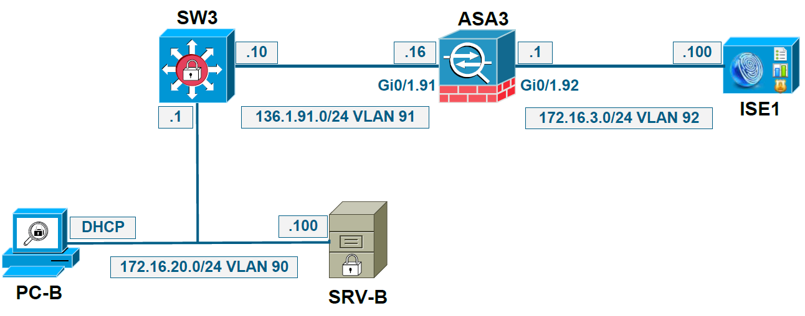

# Authentication & Authorization - EAP

## Extensible Authentication Protocol (EAP)

+ EAP is an authentication framework
    + Mainly used in Wi-Fi and wired
+ 802.1x defines the encapsulation of EAP over IEEE 802, namely EAP over LAN (EAPOL)
+ 802.1x is a flexible layer 2 authentication mechanism
    + Makes use of EAP methods, tunneled inside RADIUS packets
    + Currently there are about 40 different methods defined
+ EAP method types
    + Tunneled (protects the supplicant’s identity and credentials)
    + Non-tunneled (does not protect supplicant’s credentials)

+ 802.1X w/ EAP
    <br/>

+ <a name="EAP-FASTv1">Tunneled EAP</a>
    <br/>

+ 802.1x authentication components
    <br/>

## Common EAP Tunneled Methods

+ PEAP - Protected EAP (developed by Microsoft, Cisco, RSA)
    + Two phase method
        + Phase 1, called outer method, used to authenticate server and form the TLS channel
        + Phase 2, called inner method, used to authenticate supplicant and protect its EAP identity
    + Theoretically, inner authentication method can be any EAP type
    + Mutual authentication
        + Server is always authenticated by certificate
        + Supplicant is authenticated by certificate (EAP-TLS), username/password (EAPMSCHAPv2), or OTP (EAP-GTC)
        + Requires server certificates, on client is optional
    + Identity protection available only in PEAPv1 and PEAPv2
    + Data Flow
        <br/>

+ EAP-FASTv1 (Flexible Authentication via Secure Tunneling)
    + Cisco proprietary, similar with PEAP in scope but very different in functionality
        + Developed to allow faster re-authentication and wireless roaming
    + Based on PAC files (Protected Access Credentials)
        + Can be seen as a cookie locally stored on the supplicant
        + Generated by the RADIUS server from a master key known by itself only
    + Three-phase method
        + Phase 0 is optional and used to provision the supplicant with a PAC file
        + Phase 1 is used to establish the TLS tunnel based on the PAC file
        + Phase 2 is used to authenticate the supplicant within the TLS tunnel
    + [Data Flow - Tunneled EAP](#EAP-FASTv1)

+ EAP-FASTv2 (EAP Chaining)
    + Ties machine authentication to user authentication
        + Relies on machine PAC and user PAC
        + Performs double authentication within single EAP transaction
    + Will become standard, known as EAP-TEAP (RFC draft)
    + Data Flow
        <br/>

+ EAP-TTLS - Tunneled TLS (RFC 5281)
    + Very similar with PEAP
        + 2-phase method
        + requires server side certificate
    + Major difference as compare to PEAP is that inner method can use any authentication
        + Non-EAP methods such as PAP and CHAP supported
    + Not widely implemented: Two versions
        + EAP-TTLSv0
        + EAP-TTLSv1

+ EAP-TLS (RFC 5216)
    + Single phase protocol
    + Mutual authentication based on certificates
    + Requires client and server certificates
        + TLS tunneled created based on certificates
        + The RFC requires only server side certificates
    + No supplicant identity protection
    + Passed in EAP-Identity and in certificate exchange
    + Message Flow
        <br/>

## Common EAP Non-Tunneled Methods

+ EAP-based authentication procedure flow 
    <br/>

+ EAP-MD5 (RFC2284)
    + The only EAP method defined in original EAP RFC
    + Only supplicant authentication based on username/password
    + Challenge-response through MD5

+ EAP-GTC (RFC3748)
    + Developed by Cisco as alternative to PEAP
    + Supports OTP through challenge-response based authentication of supplicant

+ EAP-LEAP (Light EAP)
    + Cisco proprietary used only for wireless (WEP or TKIP keys)
    + Mutual authentication based on shared secret which is client’s password
    + Uses modified version of MS-CHAP, thus is challenge-response based
    + Supplicant authenticated based on username/password

## 802.1x Configuration Steps

+ 802.1x Configuration Steps on Supplicant
    + Configure the supplicant to use appropriate EAP method
        + It cannot be negotiated
    + Two types of supplicants
        + Built-in operating system supplicant
        + Cisco AnyConnect NAM module
    + Ideally do not let both supplicants configured

+ 802.1x Configuration Steps on NAD
    + Enable AAA: `aaa new-model`
    + Configure dot1x default authentication list: `aaa authentication dot1x default group`
    + Globally enable 802.1x: `dot1x system-auth-control`
    + Enable 802.1x on switch port facing the supplicant: `dot1x pae authenticator`
    + Enforce authentication on switch port facing the supplicant: `authentication port-control auto`
    + Define RADIUS server settings: `radius-server host <IP> key <radius key>`
    + Optionally configure other global/interface level settings

+ 802.1x Configuration Steps on ISE
    + Configure 802.1x authentication policy
        + Optionally use a default one
        + Enable same EAP method as on supplicant
    + Configure authorization policy
        + Optionally use a default one
    + Enroll ISE into PKI infrastructure
        + Only if tunneled EAP methods are used by supplicant
    + Enroll ISE into Active Directory
        + Only if EAP-TLS or EAP-MSCHAPv2 is the authentication method of supplicant

+ 802.1x Verification and Troubleshooting
    + Verification
        + `show dot1x all`
        + `show authentication session`
        + `show authentication interface <if_number>`
        + `show aaa servers`
    + Troubleshooting
        + `show authentication session interface <if_number>`
        + `debug dot1x all` (on the port of Authenticator facing supplicant)
        + `debug radius authentication` (on the port of Authenticator facing Authentication Server)

## Deploying EAP

+ Demo: PEAP (EAP-MSCHAPv2)
    + PC-B Config - Supplicant: Network Adaptor > Properties > Authentication:
        + No Authentication tab: service disabled, to enable by running `services.mcs` > WiredAutoConfig: (stop then) start
        + Enable IEEE 802.1X authentication
        + Enable supplicant
        + Pull down menu: EAP Method
        + Additional settings > Additional EAP Settings > RAP Method=EAP-TLS & PEAP
        + Additional mode: specify authentication mode w/ computer authentication, user authentication, or both
        + Network authentication method settings > validating the certificate: supplicant needs to trust CA that issue the Radius server certificate & Root certificate
        + Select authentication method= inner method
    + SW3 - NAD
        ```cfg
        show dot1x all  ! Sysauthcontrol Disabled
        conf t
        dot1x system-auth-control   ! Enable
        exit
        show run int gi1/0/5        ! mab
        conf t
        int gi1/0/5
          no mab
          dot1x pae authentication
        exit
        show run int gi/10/5
        ! dot1x pae authenticator
        ! authentication port-control auto
    + ISE Settings:
        + Rule: Policy > Authentication: Name=Dot1x; Condition= if wired_802.1x OR wireless_802.1X; Allow Protocols=Default Network Access [PEAP (EAP-MSCHAPv2)] > edit: Use=Internal Users (user/pwd)
        + Conditions: Policy > Policy Elements > Conditions > Authentication > Compound Conditions > Wired_802.1X > Expression=(Radius:service_type=frame), (Radius:NAS-Port-Type=Ethernet)
        + Protocol: Policy > Policy Elements > Results > Authentication > Allow Protocols > Default Network Access: Allow PEAP, Allow PEAP-MSCHAPv2 (inner method)
        + Identity: Administration > Identity Manageemnt > Identity > User > Add: Name=peap-user, pwd=Cisco123! > Submit
        + Rule: Policy > Authorization > First Matched Rule Applied & Default entry: Condition=PermitAccess

+ Demo: EAPOL (PC-B <-- SW3)
    + PC-B: Network Adaptor Settings > Properties > Authentication > Settings:  
        + Additional settings = ...
        + Authentication method=EAP_MSCHAPv2
        + Network adaptor: disable then enable
    + SW3: 
        + msgs for PC-B logon: AUTHMGR-5-SUCCESS: Authorization succeeded for client
        ```cfg
        show authentication sessions    ! Gi1/0/5 Authz Success
        show authentication sessions int gi1/0/5
        ! IP addr=172.16.20.101; User-Name=peap-user, Authorized By=Authentication Server; dot1x=Authz Success
    + PC-B Verification: `ping172.16.2.100` - ok, `telent 172.16.20.1` - ok
    + ISE Verification: <br/> Operations > Authorization Identity=peap-user, Authorization Profiles=PermitAccess > details: Event=5200 Authentication succeeded; Authentication method=dot1X
    + PC-B Validation: Network Adaptor > Properties > Authentication > Settings > Validate server certificate > ok > disable/enable: user=peap-user, pwd=Cisco123! [Could not validate=Supplicant could not trust CA certificate issued] > terminate connection > disable > enable
    + SW3: shutdown port switch
        ```cfg
        conf t
        int gi1/0/5
          shut
          no shut
        exit
        ```
    + PC-B still fail: Network Adaptor > Peroperties > Authentication > disable connect to this server > ok -> user/pwd > Connect
    + SW3 Config: 
        ```cfg
        conf t
        authentication port-control force-authorized
        ```
    + PC-B Verification: 
        + Network Adaptor > disable > enable
        + Browser > http://ISE > login prompt

+ Demo: Export ISE self-signed Certificate & Import to Supplicant
    + ISE generate Certificate: Administration > Certificates > Local Certificate > enable self-signed server certificate > Edit: protocols=EAP + HTTP > Export: Certificate only > Save on Desktop as ISE-selfsigned.pem
    + PC-B: 
        + run `mmc` > file > Add/Remove snap-in > Add Certificates: my user account > Finish > ok > Certificates-Current User > Trusted Root Certification Authorities > Certificates > Al task (right click) > Import > Next > Browse Desktop w/ ISE-selfsigned.pem > ok
        + Validate server certificate -> Trust Root Certification Authorities -> ISE-selfsigned.pem > ok
    + SW3 Config:
        ```cfg
        conf t
        int gi1/0/5
        authentication port-control auto
        ```
    + PC-B: Networ adaptor > disable > enable > user/pwd prompt > ok
    + SW3 Verification" `show authentication sessions` -> Authz Success


## EAP-FASTv1 Implementation

+ Config Procedure:
    1. Supplicant: PC-B
    2. Authenticator: SW3
    3. Authentication Server: ISE

+ Demo: 
    + PC-B: 
        + Network Adaptor > Properties > Authentication > disable IEEE 802.1X Certificate > ok
        + run `services.msc` > Cisco AnyConnect Network Access Manager > properties > Startup Type=Automatic > Apply
    + SW3: `show run int gi1/0/5    ! dot1x pae authenticator`
    + Radius/ISE: 
        + Condition: Policy > Authentication > Dot1X: Allow protocol=EAP-FAST (MSCHAPv2), use=user/pwd
        + Action: Policy > Policy Elements > Results > Authentication > Allow Protocols > Default Network Access: Allow EAP-FAST + MSCHAPv2; Allow EAP-TLS, use PACs -> Anonymous(=unauthenticated) & Authentication
        + Condition: Policy > Authorization > Default: conditions=PermitAccess
    + PC-B: 
        + AnyConnect > user/pwd > Trust
        + `ping 172.163.3.100` - ok; `telnet 172.16.3.100` - ok
    + SW3 Verification
        ```cfg
        show authentication int gi1/0/5     ~ Authz Success
        show authentication sessions int gi1/0/5
        ! Status=Authz Success; Authorized By=Authentication Server;  dot1x=Authc Success; username=pacp-user
    + ISE Verification: Operations > Authentication: Identity=peap-user, Authorization Profiles=PermitAccess > details: Authentication Method=dot1x; Authentication protocol=EAP-FAST (EAP-MSCHAPv2)

## ISE Identity Sources

+ ISE Identity Sources
    + To authenticate and authorize machines/users, ISE can validate their credentials in two ways
        + Internally
        + Externally
    + Internal Store has two types of entries
        + Endpoints (MAC database), organized into groups
            + Blacklist, GuestEndPoints, RegisteredDevices, Profiled
        + Users, organized into groups
        + Guest, ActivatedGuest, Employee, SponsorGroups 
    + Can be used as conditions in Authorization policies
        + Additional groups can be created

+ External Authentication Support
    + ISE can authenticate/proxy against several external sources
        + RADIUS - less likely implemented
        + LDAP
        + Active Directory
        + PKI (ISE CA server support was added in ISE 1.3)
    + Active Directory (AD) integration is the most common one
        + ISE 1.2 supports a single AD integration
            + Multiple AD supports if all within same forest and trust is configured
        + ISE 1.3 supports up to 50 AD domains to be joined
        + Tree structure: Forest (.local) - Domain (x.local, y.local) - Sub-domain (reno.x.local, bushes.x.local)
    + ISE joins AD just like a regular computer
        + Requires administrative rights just for join process
        + Afterwards join, it needs _READ ALL_ rights at the top of the AD/forest schema

+ Active Directory Integration
    + ISE (main controller) and Domain Controller (DC) need to be NTP synchronized
        + Maximum time skew can be _5 minutes_
        + In order to validate supplicant certificates
    + Connectivity requirements between ISE and DC
        + Global Catalog ( TCP 3268/3269)
        + LDAP (UDP/TCP 389)
        + LDAPS (TCP 636)
        + SMB (TCP 445)
        + KDC (TCP 88)
        + KPASS (TCP 466)
    + ASA - stateful FW: config ACL for ISE -> Domain Controller, but not reversed


## Authentication Against AD

+ Authentication against AD
    + Supported authentication options
        + EAP-TLS
        + EAP-MSCHAPv2
    + EAP-TLS
        + Supplicant certificate can be stored in Active Directory schema
        + ISE can be configured to validate supplicant certificate against AD
            + Verify the identity of the machine or user
        + By default in EAP-TLS, ISE just checks if certificate is valid
            + Not expired (certificate validity time compared with ISE clock)
            + Not revoked (uses CRL published by the supplicant’s CA issuer)
    + Example: 
        + CA sever: SRV-B
        + CRL = Certificate Revocation List
        + Msg flow: PC-B -- EAPOL (CERT) --> SW3; SW3 -- RADIUS (CERT) --> ISE1
        + CA server publishes CRL periodically; ISE download CRL list

+ Authorization based on AD
    + Users and computers are objects in the AD schema
        + Identified by their attributes
        + Attributes examples: username, hostname, group membership
    + ISE can use there _attributes_ in authorization policies
        + Allows for authorization policy scalability
        + Example: different authorization can be applied for different groups
    + __Contextual Access__: Authorization done based on multiple inputs/conditions
        + User and computer membership
        + Type of device (identified via profiling)
        + Method and time of network access

+ ISE Configuration for AD Integration
    + Synchronize clock between AD DC and ISE
    + Configure ISE with appropriate DNS server
        + It has to be a Domain Controller
    + Configure ISE with the AD domain name
        + Test connectivity with AD DC
        + Join ISE into AD
    + Define object attributes to be used in authorization policies
        + This step is optional but recommended

## AD Integration

+ Demo Topology
    <br/>

+ Demo: ISE & PC-B in inelab.local
    + PC-B Config: <br/>
        Computer > Properties > Advanced System Settings > Computer Name > Change: (Retrieved info: DNS server=172.16.20.100) Member of Domain=inelab.local > ok > restart
    + ISE Config
        + Main Functions
            + __Operations__: Monitoring & Troubleshooting
            + __Policy__: Authentication & Authorization settings, including profiling and posture
            + __Administration__: External AD integration
        + Define Store: Admin > Identity Management > External Identity Sources > Active Directory: Domain Name=inelab.local, Identity Store Name=INEAD > Save Configureaiton
        + Connection Functions
            + Test Connection (Basic/Detail): verify connectivity btw ISE and DC
            + Join: join ISE into Domain
            + Leave: remove ISE from Domain
            + Refresh: refresh schema, such as changes on AD
        + : `ISE1-12-inelab.local`: TestConnection > Basic Test: Failed to authenticate use <userName>, Reason: LDAP: "Cannot resolve LDAP Service providers for 'INELAB.LOCAL'" --> check DNS

## ISE Application Server

+ Demo: TRBL
    + Due to privilege issue, using ISE2 istead
    + Logon to ICE2 & with CLI
        ```cfg
        show run 
        ! ip domain-name inelab.loca
        ! ip name-server 172.16.20.100
        conf t
        no ip name-server
        ip name-server 172.16.20.100
        ! restart ISE
        ! ...
        show application status ise
        ```
    + Test Connection > Basic Test > user/pwd -> Success
    + Join: /use/pwd - completed -> close
    + Advanced settings: pwd change, Machine Authentication (using hostname & ticker from DC, diff from User Authentication), Machine Access Restriction (MAR)
    + PC-B <-- SW3: Machine & User Authentication - Machine connected & no user logon -> no network access? background tasks? => Machine mus be authenticated
    + Scenarios
        + Machine Authentication (MA): Authorization Policy A
        + User Authentication (UA): Authorization Policy B
        + MA + UA: Authorization Policy C (MAR), i.e., tie MA to UA for corporate user using corporate device
    + MAR not useful
        + Once machine gets authenticated, ISE will keep the status for 6 hrs (default).
        + The authentication is based on MAC address of the machine - not secure enough
        + e.g., SW3 will keep PC-B's MAC addr for 6 hrs.  Attacker connects to SW3. It can spoof MAC addr of PC-B.


## Identity Prefix & Suffix Strip

+ Demo: ISE for Domain Mark up or down
    + Administration > External Identity Sources > Active Directory > INEAD >
    + Advanced Settings: User: PC-B@inelab.local - change @ with other character
    + Groups: Add (Select Group from Dictionary) > Retrieve Groups > enable the application names: e.g., inelab.local/CCIELAB/CCIELAB, inelab.local/FINANCIAL/TECHNICAL, inelab.local/Users Domain Admins, inelab.local/Users, Domain Computers > ok > Save Config
    + Attributes: Add (select Attributes from Directory): Example Subject = user1 >  Retrieve attributes = sAMAcountName > ok; Example Subject = test-pc-b > Retrieve Attributes = dNAHostName > ok > Save Configuration
    + SRV-B: run `dsm.msc` >
        + Users > <username> > Properties: Member of = Domain User
        + Computers > Test-PC-B > Properties: Member of = Domain Computers

+ Config Procedure for Demo
    + Supplicant: depend on OS and version
        + both machine and user authentications
        + protocol: PEAP (EAP-MSCHAPv2)
    + NAD/Authenticator: port facing supplicant - 802.1x
    + ISE: 2 types of polices
        + Machine Authentication -> Author X
        + User Authentication -> Author Y

+ Demo: 
    + PC-B: Logon with inelab.local\ldapuser
    + SW3:
        ```cfg
        show run int gi1/0/5
        ! interface GigabitEthernet1/0/5
        !   switchport access vlan 90
        !   switchport mode access
        !   logging event spanning-tree
        !   authentication port-control auto
        !   dot1x pae authenticator
        !   spanning-tree portfast
        ! end

        conf t
        int gi1/0/5
        authentication port-control force-authorized
        ```
    + PC-B: logoff > logon prompt: username=inelab.local\ldapuser
    + ISE:
        + Conditions: Policy > Authentication > Dor1X, Wired_802.1X > edit (duplicate above): Name=WIRED_AD_PEAP_AUTH, Conditions=Wired_802.1X, Allowed Protocol=Default, use=INEAD > Save
        + Define Action: Policy > Policy Elements > Results > Authentication > Allowed Protocols > Add: Name=PEAP_EAP_MSCHAPv2, disable - Process Host Lookup, PAP/ASCII, EAP-MD5, EAP-TLS, EAP-FAST, PEAP-(EAP-TLS) > Save > Submit
        + Create authentication policy: Policy > Authentication > WIRED_AD_PEAP_AUTH: Allowed Protocols=PEAP_EAP_MSCHAPv2


## User & Machine Authorization Policies

+ Demo: Authorization Policies
    + Purpose: 
        + Machine authentication: TCP traffic only -> required for multi-management AD machine
        + User authentication: full access
        + both with dACl
        
    + ISE Config:
        + ACL define: Policy > Policy Elements > Results > Authorization > Downloadable ACLs > 
            + Add: Name=MMACHINE_DACL, contents=(permit tcp any any)
            + Add: Name=USER_DACL, Contents=(permit ip any any)
        + Profile: Policy > Policy Elements > Results > Authorization > Authorization Profiles > Add: Name=MACHINE_PROFILE, DACL Name=MACHINE_DACL > submit
        + Policy: Policy > Authorization > entries (top down in order) > Edit (insert new Rule below MAB_DATA_DACL): Name=PEAP_MACHINE_AUTH, Conditions=(INEAD:ExternalGroups [PC] EQUAL inelab.local/Users/Domain Computers [group of computers in the domain], Network Access:EapAuthentication EQUAL EAP_MSCHAPv2), Permission=MACHINE_PROFILE
        + Policy: Policy > Authentication > PEAP_MACHINE_AUTH > edit (duplicate below): Name=PEAP_USER_AUTH, Conditions=(INEAD:ExternalGroups EQUAL inelab.local/Users/Domain Admins, Network Access: EapAuthentication EQUAL EAP_MSCHAPv2), Permission=USER_PROFILE
    + PC-B: 
        + NIC > Properties > Authentication tab:
            + enable IEEE 802.1X authentication
            + method: PEAP
            + Additional Setting: Authentication mode=User or Computer authentication
            + PEAP Settings: 
                + Validate server certificate
                + Trusted Root Certification Authorities = ?, Browse
                + Authentication Method=EAP-MSCHAPv2, Configure=Automatically use checked (802.1X will pickup login credentials)
        + logoff
    + SW3:
        ```cfg
        show run | i aaa
        ! aaa new-model
        ! aaa authentication dot1x default group radius
        ! aaa authorization network default group radius
        show ip tracking all    ! enabled
        
        conf t
        ip device tracking probe interval 30
        ip device tracking probe use-svi
        radius-server vsa send authentication
        do show run int gi/1/0/5        ! dot1x pae authenticator
        authentication port-control auto
        ! msgs: 'fail' from 'dot1x' for client
    + TRBL:
        + SW3: `authentication port-control force-authorized`
        + ISE Provisioning - entry detail: failing to negotiate EAP because EAP-FAST not allowed
        + PC-B: AnyConnect > Network: wired
            + disable: run `services.msc` > AnyConnect > Properties > stop > Disable
            + Logoff
        + SW3: 
        ]   ```authentication port-control auto     ! Success 
            ! AUTHHMGR-7-RSULT: Authentication result 'success' from 'dot1x' for client 
            ! EPM-6-AAA: POLICY xACSACLx-IP-MACHINE_DACL-56a11fb6
            ! ... Result SUCCESS

            show authentication int gi1/0/5
            ! Uer-Name=host/test-pc-b.inelab.local, Status=Authz SUCCESS, 
            ! Authorized By=Authentication Server, ASC ACL=xACSACLx-IP-MACHINE_DACL-56a11fb6
            shwo ip access-lists int gi1/0/5        ! permit tcp any any
            ```
        + ISE Provisioning: Operations > Authentications: Identity=host/test-pc-b.inelab.local, Authorization Profiles=MACHINE_PROFILE, Endpoint Profile=Linksys-Device, Identity Group=Profiled
    + Verification:
        + PC-B: Login (User_Profile)
        + SW3 messages:
            ```cfg
            ! DOT1X-5-SUCCESS: Authentication successful for client
            ! AUTHMGR-7-RESULT: Authentication result 'Success' issued from 'dot1x' for client
            ! EPM-6-AAA: POLICY xACSACLx-IP-MACHINE_DACL-56a11fb6

            show authentication session in tgi1/0/5
            ! User Name=INELAB\ldapuser, Status=Authz Success; Authorized By=Authentication server
            ! ACS ACL=xACSACLx-IP-MACHINE_DACL-56a11fb6, dot1x=Authc Success

            show epm session ip 172.16.20.101       ! ACS ACL=xACSACLx-IP-MACHINE_DACL-56a11fb6
            show ip access-lists xACSACLx-IP-MACHINE_DACL-56a11fb6
            ! 10 permit ip any any
            show ip access-lists int gi1/0/5    ! permit ip any any
            ```
    + Verification - Machine Authentication
        + PC-B: `ping 172.16.20.1` - ok; `telnet 172.16.20.1` - ok
        + ISE: Operations > Authentication: Identity=host/test-pc-b.inelab.local, Authentication Profile=MACHINE_PROFILE > details: Username=host/test-pc-b.inelab.local, Authorization Profile=MACHINE_PROFILE, AuthorizationPolicyMatchedRule=PEAP_MACHINE_AUTH, Authorization Protocol=PEAP(EAP-MSCHAPv2)
    + Verification - User Authentication
        + PC-B: Logoff > Logon
        ISE: Operations > Authentication: Identity=INELAB\ldapuser, Authentication Profile=USER_PROFILE > details: Username=inelab\ldapuser, Authorization Profile=USER_PROFILE, AuthorizationPolicyMatchedRule=PEAP_USER_AUTH, Authorization Protocol=PEAP(EAP-MSCHAPv2)

+ Demo: MAR
    + Order of Authentication Rules: 1) Machine Authentication (MA); 2) Machine & User Authentication(MA + UA); 3) User Authentication (UA)
    + Requirements: MA - TCP; MA + UA - full access; UA - TCP
    + ISE Config: Policy > Authorization > PEAP_USER_AUTH > edit (duplicate above): Name=PEAP_MACHINE_USER_AUTH, Condition=(INELAB:ExternalGroups EQUAL inelab.local/Users/Domain Admin, Network Access:WasMachineAuthenticated EQUAL True), Permission=PermitAccess
    + Verification
        + PC-B: logon
        + SW3:
            ```cfg
            ! Authentication result 'Success', Authorization succeeded -> w/o DACL
            show authentication sessions int gi1/0/5
            ! User Name=INELAB\ldapuser, status=Authz Success, Authorized By=Authentication Server
            ! Vlan Policy=N/A, dot1x=Authc Success
            show ip access-list int gi1/0/5
            ! permit ip any any, cmd only show network access for the port but not part of dACL
            show epm session ip 172.16.20.101   ! Admission feature=dot1x
            ```
        + PCB: `ping 172.16.20.1` - ok, `telnet 172.16.20.1` - ok
        + ISE: Operations > Authorization: Identiyt=INELAB\ldapuser, Authorization Profiles=PermitAccess, AuthorizationPolicyMatchedRule=PEAP_MACHINE_USER_AUTH


## Deploying EAP TLS

+ Scenarios
    + One KPI/CA Server (SRV-B): PC-B enroll User Certificate w/ SRV-B; ISE enroll Certificates w/ SRV-B
    + Two KPI/CA Servers (SRV-A & SRV-B): PC-B enrolls w/ SRV-A, ISE enrolls w/ SRV-B, ISE trusts Supplicant's CA, PC-B trusts ISE's CA 

+ Supplicant Enrollment:
    + Manually
    + Automatically - preferred
        + client's certificates provisioning not only transfer to users but also create policy
        + re-enrollment before expired

+ EAP-TLS
    + using certificate
    + better solution where certificate cannot be spoofed

+ Automatic Enrollment
    + AD Certificate Service (CS) - CA server within Domain
    + Group Policy (GTP) -> DC: CA installed in DC

+ NAD/Authenticator: No chhange required
+ Procedure to Config EAp-TLS: 
    + Enroll PC-B & ISE w/ SRV-B
    + Supplicant: change from PEAP(EAP-MSCHAPv2) to PEAP(EAP-TLS)
    + Authentication server (ISE): change Authentication & Authorization Policies from EAP_MSCHAPv2 specific to EAP-TLS ones

+ Demo: Implementing EAP-TLS
    + Steps to enroll a user/machine to a client's certificate
        1. install CA certificate - public key of VA
        2. request a client's cert to identify itself

    + Analogy: passport = certificate, stamp of certificate = CA's signature
    + AD CS (172.16.20.100) - Generate Certificate
        + Tasks: Download a CA certificate, certificate chain, or CRL
        + Encoding method: Base 64
        + Download certificate > Save As: ca-certificate.cer (on local host)
    + ISE Import: 
        + Administration > System - Certificate > Certificate Storec> Import: Certificate File=ca-certificate.cer, Firendly Nmae=INE_PKI_Infrastructure, enable `Trust for client authentication or Secure Syslog service' (using this cert on ISE for any EAPOL authentication required server side cert.)
        + 'Validation of Certificate Extensions (accept only valid certificate)': (Not Enabled)
            + Check ISE version, requirements may change in 1.2, 1.3, 1.4, and 2.0
            + Extension tell certificate for which use case is valid, e.g., passport - global, SIN - within Canada

## Issuing Certificates on ISE

+ Demo: Issuing Certificate on ISE
    + Message flow:
        + Config CSR info on ISE
        + Issue requiest to CA (SRV-B)
        + CA responses signed CSR w/ CA's private key
    + ISE:
        + Administration > System Certificate > Local Certificate > Add (Generate Certificate Signing Request): Certificate subkject=(CN=ISE1-12.inelab.local, OU=ENGINEERING, C=RO), Digest to sign with=SHA 256 > Submit
        + Administration > System Certificate > Certificate Signing Request: select ISE1-12.inelab.local > Export > Open > copy text
    + CA - SRV-B:
        + Request a Certificate > Advanced certificate request > paste to saved request (ensure no space before or after pasted text) > Submit
        + Certificate Issued > Base 64 encoded > Download certificate > Save as: ise-certificate.cer
    + ISE: Administration > System Certificate > Local certificates > Add (Bind CA Signed Certificate): Certificate File=ise-certificate.cer, Protocol=(EAP: use certificate for EAP protocol that use SSL/TLS tunneling) > Submit


## Enrolling Users on a Certificate

+ Demo: 
    + CertSrv: IE (http://172.16.20.100/certsrv)
        + Tasks: Request a certificate > Web Browser Certificate: Name, Email, company, Department, key strength (no visible) -> Browser not supported ?
        + Trying IE Compatibility View Settings & Firfox w/ the same issue
    + SRV-B: Certificate Authority > inelab-CA > Pending Request: (empty)

+ Demo RBL:
    + SRV-B: Windows Desktop Connection (AD) or IE (http://172.16.20.100/certsrv) > Vertificate Server
        + Event Viewer > Windows Logs > Application: Active Directory Certificate Service Denial request because the request subject name is invalid or too long
        + Change IE Security Settings: IE > Settings > Internet Options
            + Advanced tab: Enable Integrated Windows Authentication
            + Security tab: Trusted sites > Add: http://172.16.20.100, security level of trust site = low
            + Restart IE
        + IE: Request a Certificate > Advanced Request Certificate: Name=Chistian Matei, email=cmatei@ine.com, Company=INE, Dept=Instructor, City=Bucharest, Country/Region=RO, Type of certificate need=Client Authentication Certificate > Submit
        + run `mmc` (MS Management Console) > File > Add/Remove Snap-in > Certificate > Add: My user account > Finish > ok
        + run `mmc` > Console Root > Certificate - Current User > Personal > Certificates > Christian Matei entry > Certificate: Christian Matei (User cert.)
    + PC-B: 
        + run `mmc` > File > Add/Remove Snap-in > Certificates > 
            + Add: My User account > Finish
            + Add: Computer account > Finish
            + 2 certificates shown: Console Root > Certificates - Current User & Certificate (Local Computer)
        + Console Root > Certificates (Local Computer) > Personal > All Tasks (rc) > Request New Certificate > Certificate Enrollment: Active Directory Enrollment Policy > Next > Certificate Types are not available
        + NIC > Properties > Authentication > 
            + PEAP Settings: Authentication Method=smart card or other certificate, valid server certificate Trusted Root Certificate Authority=inelab-CA
            + Additional setting: authentication mode=User authentication
    + ISE:
        + Policy > Policy Elements > Results > Authentication > Allowed Protocols > Add: Name=PEAP_EAP_TLS, only enable PEAP(EAP-TLS) > Submit
        + Policy > Authentication > WIRED_AD_PEAP_AUTH: (Condition=Wired_802.1X, Allowed Protocol=PEAP_EAP_TLS, use=Certifcate) [inner method]
        + Administration > Identity Management > External Identity Sources > Certificate Authentication Profile > Add: Name=INE_PKI_STORE, Principle username X509 Attribute=Subject-CommonName > Submit
        + Perform Binary Certificate Comparison retrieced from LDAP or Active Directory
            + CA server is also an AD member
            + Deploy AD cert service -> cert auto deploy to users
            + CA server stores a copy of client's cert as an attribute to the object of the domain
            + binary comparison against what stored in AD schema
        + Policy > Authentication > WIRED_PEAP_AUTH > edit: Allowed Protocol=PEAP_EAP_TLS, use=INE_PKI_STORE
        + Policy > Authorization > PEAP_USER_AUTH: move to above of PEAP_MACHINE_AUTH > edit: Consitions=(Network Access:EapAuthentication EQUAL EAP_TLS) > Save
    + SW3: 
        ```cfg
        show run int gi1/0/5
        ! authentication port-control auto
        ! dot1x pae authenticator
        ```
    + Verification:
        + PC-B: Longoff > Logon
        + SW3: message = AUTHMGR-5-START: Starting 'dot1x' for client, no further msgs
        + NIC - failed
    + TRBL: 
        + ISE: Operations > Authentications > Identity=Christian Matei > details: Failure Reason: unexpectedly received TLS alert message: treating as a rejection by the client
        + PC-B: ensure trust
            + NIC > Prperties > Authentication > Settings: validate server certificate - Root Trust Authority: inelan-CA --> looks ok
            + run `mmc` > File > Add/Remove Snap-in > Certificates > Add: my user account > Finish > 
                + Console Root > Certificates - Current Users > Trusted Root Certificates > Certificates > remove inelab-CA
                + Console Root > Certificates - Current users > Personal > Certificates > Christian Matei (entry): the cert cannot be verified up to a trusted cert. authority


## Importing CA Certificates

+ Demo: Importing CA Certificates
    + SW3: 
        ```cfg
        conf t
        int gi1/0/5
          authentication port-control force-authorized
        end
        ```
    + PC-B: IE (http://172.16.20.100/certsrv)
        + Download a CA Certificate, certificate chain, or CRL > Base 64 > Download CACertificate > Asve As: ca-certificate.cer
        + Open downloaded ca-certificate.cer > install certificates in the following store: certificate store=(Browse > show phy store) > Trusted Root Certification Authorities > Registry > ok > Next > Finish
        + Console (`mmc`) > Personal > Certificates: Christian Matei > ok
        + NIC > Properties > Authentication > Enable IEEE 802.1X authentication 
            + Additional Settings: authentication mode=User Authentication
            + Settings: Validate server certificate, Trust Root Certification Authorities=inelab-CA
    + ISE: Administration > Certificates > Protocol=EAP: ISE1-12.inelab.local#inelab-CA#00001
    + SW3: 
        ```cfg
        authentication port-contro auto
        shut
        no shut
        ! AUTHMGR-7-RESULT: Authentication result 'fail' from 'dot1x' for client
        ```
    + ISE: Log message -> TLBR
        + Operations > Authentication > latest log msg > detail: Event=Endpoint conducted several failed authentications of the same scenario; Failure Reason=Failed to negotiate EAP for inner method becasue EAP-TLS not allowed under PEAP configuration in the Allowed Protocols; AllowedPrtotocolMatchedRule=WIRED_AD_PEAP_AUTH
        + Policy > Authentication > WIRED_AD_PEAP_AUTH: Allowed Protocol=PEAP_EAP_TLS; use=INE_PKI_STORE > Save
        + Policy > Authorization > PEAP_USER_AUTH: Conditions=(Network ccess:EapAuthentication EQUAL EAP-TLS), permisssion=USER_PROFILE
    + SW3:
        ```cfg
        shut
        no shut
        ! AUTHMGR-5-START: starting 'dot1x' for client
        ```
    + PC-B: NIC > disable > enable
        + The server 'ISE1-12.inelab.local' presented a valid certificate issued by 'inelab-CA', but 'inelab-CA' is not configured as a valid trust anchor for the profile
        + NIC > Properties > Authentication > Settings > 
            + Connect to these servers=ISE1-12.inelab.local > failed
            + disable 'validate server certificate' 
        + Msg on SW3: AUTHMGR-5-FAIl: Authorization failed or unapplied for client
    + ISE: Operations > Authentications > Last log msgs > details: Event=Authentication Failed, Failed Reason=Unexpectedly received TLS alert message: treating as a rejection by the cleint
    + PC-B: NIC > Properties > Authentication > Settings: disable 'connect to these servers', Authentication method=Smart card or other certifcate > Config > Trusted Root Certificate Authority='inelab-CA' > ok
    + SW3: msgs
        ```cfg
        ! AUTHMGR-5-SUCCESS: Authorization Succeeded for client
        ! EPM-6-IPEVENT: ... | EVENT IP ASSIGNMENT
        ! EPM-6-POLICY_APP_SUCCESS: ... | POLICY_TYPE Normal ACL | POLICY NAME xACSACLx-IP-USER_DACL-56a11fc
        ```
    + Problem Expmaination: PC-B w/ NIC > Properties > Authentication
        1. Config PEAP
        2. Additional Settings: Authentication mode=PEAP w/ 2-phase
        3. Settings fro PEAP
            + Validate server certificate
            + Trusted Root Certification Authorties = inelab-CA (PEAP outer method)
            + Authentication Mode=smart card or other certificate > Configure: Use a certificate on this computer, use simple certificate selection, Validate servercertificate, Trusted Root certification Authorties=inelab-CA
    + Verifications:
        + ISE: Operations > Authentications > Authorization Profile=USER_PROFILE, Identity=Christian Matei > details: ...
        + PC-B: `ping 172.16.20.100` - ok, `telnet 172.16.20.100` - ok
        + SW3
            ```cfg
            show authentication sessions int gi1/0/5
            ! status=Authz Success, User Name=Christian Matei, Authhorized By=Authentication Server, 
            ! ACS ACL=xACSACLx-IP-USER-DACL-56a11f6
            show epm session ip 272.16.200.101      ! ACS ACL=xACSACLx-IP-USER-DACL-56a11f6
            show ip access-lists ACS ACL=xACSACLx-IP-USER-DACL-56a11f6
            ! 10 permission tcp any any
            ```
        + ISE: Operations > Authentication > details: Event=Endpoint authentication problem was fixed, Authentication Protocol=PEAP(EAP-TLS), Authorization Progfile=USER_PROFILE

+ Summary:
    + Authenticator / NAD: no change
        + Changes made on supplicant and authentication server
        + SW only relay query/response
    + Supplicant & Authentication Server should be with same EAP method


## EAP-FASTv2 Chaining

+ EAP-FASTv2 (EAP Chaining)
    + Ties machine authentication to user authentication
        + Relies on machine PAC and user PAC
        + Performs double authentication within single EAP transaction
    + Will become standard, known as EAP-TEAP (RFC draft)
        + TEAP = FASTv2 + TTLS + PEAP

+ Config Procedure:
    + Supplicant: EAP-FASTv2 via AnyConnect
        1. No user login - Machine Authentication
        2. If user login & supplicant config w/ EAP-Chaining, NAD requests supplicants credentials, then supplicant replies Machine & User Authenticaion in one transaction (chaining Machine & User credentials within one transaction) --> more secure
    + EAP Chaining: Policies
        + Machine authentication passed & User authentication passed: corporate devices - full access
        + Machine authentication failed & User authentication passed: restrict access A
        + No chaining, i.e., supplicant not support machine + user authenntiocation: restricted access B
    + Authenticator/NAD: no config required
    + Supplicant: EAP-FASTv2
    + Authetication Server (ISE): Authentication & Authorization Policies

+ Demo:
    + SW3 Config:
        ```cfg
        show run int gi1/0/5
        ! interface GigabitEthernet1/0/5
        !   switchport access vlan 90
        !   switchport mode access
        !   logging event spanning-tree
        !   authentication port-control auto
        !   dot1x pae authenticator
        !   spanning-tree portfast
        ! end

        conf t
        int gi1/0/5
        authentication port-control force-authorized
        ```
    + PC-B
        + NIC > Properties > Authentication > disable IEEE 802.1X authentication > ok
        + run `services.msc` > Cisco AnyConnect Network Access Manager > Properties > General: Startup Type=Automatic > Apply > Start > ok
        + AnyConnect: VPN module & NAM module
        + AnyConnect Profile Editor for full supplicant config: 
            + Network Access Managaer Profile > 
            + Client Policy: Service Operation=enable, Media=(WiFi Media with WPA & WPA2, wired), User control=(display client, user group, auto connect)
            + Networks: Name=EAP_CHAINING, Network Media=wired, Security level=Authenticating Network > 802.1X settings=(authPeriod=30, startPeriod=30, heldPeriod=60, maxStart=3)
            + Connection Types: Machine connection (Author A), User connection (Author B), User & Machine connection (Author C = A + B)
            + Profile: Machine Authentication, EAP method=EAP-FAST
                + EAP-FAST Settings=(Validate server identity, Enable fast reconnect)
                + Inner Method=(password w/ EAP-MSCHAPv2)
                + Use PAC
            + Certificate: Certificate Trusted Server Rules, Certificate Trusted Authority=Trust any Root Certificate Authority (CA) installed on the OS
            + Machine Credentials
            + User Auth: EAP-FAST > Settings > inner method=(EAP_MSACHAPv2); if using PACs, allowed authenticated PAC provisioing (only if ISE cert. is not trusted)
            + Certificates: Trust any Root CA in OS
            + PAC Files: Add
            + Credentils: User credential=Sib=ngle Sign On
            + MUST __SAVE FILE__: cpnfiguration.xml
        + AnyConnect > Network Repair (ensure configuration.xml used)
        + AnyConnect > Remove unnecessary entries
    + ISE:
        + Policy > Policy Elements > Results > Authentication > Alloed Protocols > Add: Name=EAP-FAST, Allowed Protocols=(EAP-FAST w/ inner method=EAP-MSCHAPv2, EAP-TGC, use PACs, allow anonymous In-Band PAC Provisioning, Allow Authentication In-Band PAV Provisioning, EAp-Chaining) > Save
        + Policy > Authentication > WIRED_AD_PEAP_AUTH > edit: Name=WIRED_EAP_FAST, Conditions=Wired_802.1X, Allowed Protocl=EAP_FAST, use=INEAD > Save
        + Policy > Authentication > PEAP_MACHINE_AUTH: Condition=(INEAD:ExternalGroups EQUAL inelab.local/User Domain Computers, Network Access:EapAuthentication EQUAL EAP-MSACHAv2), Permission=MACHINE_PROFILE [not scalable, large set of conditions, but convenit to see what conditions are]
        + Policy > Policy Elements > Conditions > Authorization > Compound Conditions > 
            + Add (create a new condition): Name=EAP_FAST_MAP_UAP (Both Machine & User Authentication Passed), Expression=(Network Access:EapTunnel EQUAL EAP-FAST [Outer Method], Network Access:EapAuthentication EQUAL EAP-MSCHAPv2 [Inner Method], Network Access:EapChainingResult EQUAL User and Machine both Succeeded) > Submit
            + Add (create a new condition): Name=EAP_FAST_MAF_UAP (not corporate device), Expression=(Network Access:EapTunnel EQUAL EAP-FAST [Outer Method], Network Access:EapAuthentication EQUAL EAP-MSCHAPv2 [Inner Method], Network Access:EapChainingResult EQUAL Machine Failed but User Succeeded) > Submit
            + Add (create a new condition): Name=EAP_FAST_UAP, Expression=(Network Access:EapTunnel EQUAL EAP-FAST [Outer Method], Network Access:EapAuthentication EQUAL EAP-MSCHAPv2 [Inner Method], Network Access:EapChainingResult EQUAL No Chaining) > Submit
            + Add (create a new condition): Name=EAP_FAST_MAP, Expression=(Network Access:EapTunnel EQUAL EAP-FAST [Outer Method], Network Access:EapAuthentication EQUAL EAP-MSCHAPv2 [Inner Method], Network Access:EapChainingResult EQUAL User Failed and Machine Succeeded) > Submit
        + Scenarios
            + Machine Authentication Failed + User Authentication Passed: Author A
            + Machine Authentication Passed + User Authentication Failed: Author B
            + Machine Authentication Passed + User Authentication Passed: Author C
        + Only demo Author C while production environment requires them all
        + List of entries:
            + PEAP_USER_AUTH: EAP-TLS
            + PEAP_MACHINE_AUTH: EAP-MSCHAPv2
            + PEAP_MACHINE_USER_AUTH: EAP-MSCHAPv2
        + Policy > Authorization > PEAP_MACHINE_AUTH & PEAP_MACHINE_USER_AUTH > disable
        + Policy > Authorization > PEAP_MACHINE_USER_AUTH > add (below): Name=EAP_CHAINING, Conditions=(select from library > EAP_FAST_MAP_UAP), Allowed Protocol=PermitAccess > Save
    + SW3: 
        ```cfg
        authentication port-control auto
        do show run int gi1/0/5
        int gi1/0/5
          shut
          no shut
        end
        ! AUTHMGR-5-START: Starting 'dot1x' for client; but no further mesg
        ```
    + TRBL:
        +  PC-B: 
            + Opern AnyConnect - Acquiring IP address
            + Ensure `configuration.xml` in proper localtion, `Systems\Progrram Data\Cisco\Cisco AnyConnect Secure Mobility Client\Network Access Manager\NewConfigFiles\`(empty) - not saving properly (actually clearned by runing `Network Repair`)
            + AnyConnect Progile Editor > Networks > EAP_CHAINING > edit: USER_AUTH:EAP-GTC > Done > File > Save As: `configuration.xml`
            + AnyConnect > Networks=wired
            + AnyConnect > Network Repaired (configuration.xml deleted)
        + SW3: msg=AUTHMGR-7-RESULT: Authentication Result 'no-response' from 'dot1x' for client
        + PC-B: logoff > logon -> same issue
            + check AnyConnect version: 3.0.11042
            + AnyConnect Profile Editor Networks > EAP_CHAINING removed
    + PC-B: AnyConnect Profile Editor > Networks > wired:
        + Media Type: in all groups, wired 802.3
        + Security Level: Authentication networks
        + Connection Type: Machine & User Connection
        + Machine Auth: EAP-FAST (activate settings)
            + EAP-FAST Settings: validate server identity, Fast Reconnect
            + Inner Method based on Credential Sources: Authentication using a password=(EAP-CHAPv2, EAP-GTC, if using PACs, allow unauthenticated PAC Provisioning), use PACs
        + Certificates: Trust any Root Certificate Authority (CA) installed on the OS
        + PAC Files:
        + Credentials: Use machine credentials
        + User Auth: EAP-FAST (activate settings)
            + EAP-FAST Settings: validate server identity, Fast Reconnect
            + Inner Method based on Credential Sources: Authentication using a password=(EAP-CHAPv2, EAP-GTC, if using PACs, allow unauthenticated PAC Provisioning), use PACs
        + Certificates: Trust any Root Certificate Authority (CA) installed on the OS
        + PAC Files:
        + Credentials: Use Single Sign ON credentials
    + PC-B: AnyConnect > Network Repair -> still failed


