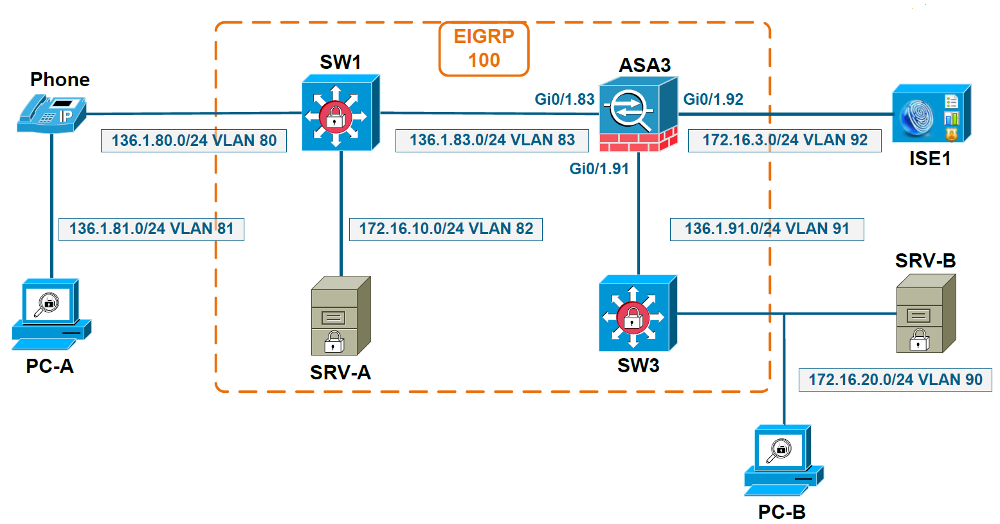

# Endpoint Profiling

## EndPoint Profiling

+ What is Profiling ?
    + Profiling
        + Allows ISE to learn attributes about network connected endpoints
        + Based on the profile, it will assign endpoint to appropriate identity groups
        + Groups can be used in authorization policy for smarter network access control decisions
        + Especially useful for devices that perform MAB, but not only
    + Two types of profiling
        + Static profiling, where endpoint is manually assigned to a group
        + Dynamic profiling, where endpoint attributes are dynamically learned through the use of probes
    + By default, dynamic profiling is turned off
        + Endpoints are still automatically profiled based on MAC address
        + However, only device vendor can be detected, so it’s not very specific
    + Demo: ISE - Administration > Idenitity Management > Identities > Endpoints > Add: 
        + MAC Address=48:f8:3b:2e:25:32
        + Static Assignment (Specific group addigned, but not shown in Authorization policy): Policy Assignment=Apple-iPad, ...
        + Static Group Assignment (Able to be used in Authorization Policy): Identity Group Assignment=Cisco-IP-Phone
        + If both selected, device auto detected

+ Dynamic Profiling
    + Automatic fingerprinting of the endpoint based on several probes
        + ISE needs to be configured to listen for probes
        + NAD needs to be configured to send probes
    + RADIUS, highly recommended
        + Inspects RADIUS attributes from the authentication Request
        + Inspects RADIUS accounting for IP-MAC binding, required for NMAP scanning or DNS resolution of endpoint
        + Used also for IOS Device sensor feature, supported starting with 15.0(2) on switches and 7.2.110.0 on WLC

+ Most Commonly Used Probes
    + HTTP
        + ISE interprets HTTP messages from CWA or SPAN
        + Gathers User-Agent from HTTP packet, used to identify the operating system on the device
            + Crucial for mobile device profiling 
    + DHCP
        + ISE interprets DHCP messages from DHCP-Relay or SPAN
        + Gathers User-Agent from DHCP packet, used to identify the operating system on the device
        + Gathers DHCP hostname
            + Important for mobile device profiling
        + Useful only in DHCP environments

+ Less Commonly Used Probes
    + NMAP
        + TCP/UDP port scanning for operating system detection
    + SNMP query send by ISE
        + Used only in case NAD does not support device sensor
        + Triggered by RADIUS accounting or SNMP trap
        + Reads CDP/LLDP/ARP/MAC data
    + DNS resolution performed by ISE
        + Reverse DNS query for PTR records to get the FQDN of the endpoint
        + Query initiated only if device profiles through other probes: RADIUS, DHCP, HTTP, SNMP
        + Not primary tool
    + Netflow samples
        + Detects abnormal traffic (profiled printer making skype calls on the Internet)


## Profiling Policies

+ Profiling Policies
    + ISE has a large database of built-in profiling policies
        + Can profile many devices out-of-the-box, given that enough data is received from probes
        + Additional policies can be manually configured, or you can edit the built-in ones
        + Logical profile is a container with associated profiling policies
    + ISE has a built-in hierarchy for device profiling, in the form of parentchild, for example
        + Parent policy is named Apple-Device
        + Child policy attached to the parent policy can be Apple-iPad or Apple-iPhone
    + Profiling policies are built on a set of conditions for device identification
        + In order to be profiled as Apple-iPad, conditions for both parent and child policy need to be satisfied

+ Profiling Policies Settings
    + Minimum Certainty Factor
        + How sure is ISE about endpoint being identified
        + Integer value which needs to be met in order for endpoint to be assigned to be profile policy
    + Associated CoA type
        + When endpoint is profiled and assigned to a specific group, do you want CoA to be performed
    + Rules
        + Each rule is a condition matching on collected endpoint attributes
        + Each rule ahs an associated action, most commonly being to increase the Certainty Factor
            + NMAP SCAN is an alternative action
    + Demo: ISE - Policy > Profiling > Profiling Policies > Apple Device: Name=Apple Device, Minumum Certainty Factor = 10, Exception Action = None
    + Demo CoA?
        + Procedure: 1) Creating profile; 2) Implement 802.1x for IP Phone
        + Conditions: 1) Phone connected to SW; 2) Profiling data sends to ISE
    + Demo: Rules - Policy > Profiling Policies > Apple-Device: 
        + Rule=(if Apple-DeviceRule1-SCAN then Take Network Scan Action, if Apple-DeviceRule1Check1 then Certainty Factor Increases 10)
        + Apple-DeviceRule1Check1: Expression=MAC:OUI CONTAINS Apple
    + Demo: Rule Child Policy - Policy > Profiling Policies > Apple-Device > Apple-iPhone
        + Name=Apple-iPhone, Minimum Certainty Factor=20
        + Ruless=(if Apple-iPhoneRule2Check1 then Certainty Factor Increases 20, if Apple-i{honeRule1Check1 then Certainty Factor Increases 20})
        + Apple-iPhoneRule2Check1 Expression=DHCP:hostname CONTAINS iPhone
        + Apple-i{honeRule1Check1 Expression=IP:User-Agent CONTAINS iPhone

+ Profiling Result
    + It can happen that the device is authorized by ISE before being accurately profiled
    + Thus, usually CoA is also deployed with profiling
        + Allows to change device authorization after being profiled
    + In general, by deploying ISE in phases, all devices will be profiled before going to Closed Mode
    + Because of profiling, CoA is triggered when
        + Endpoint profiled for 1st time
        + Endpoint statically assigned to a group
        + Endpoint removed from ISE database
        + Endpoint dynamically changed identity group membership

## ISE Authorization Flow with Profiling

+ ISE Authorization Flow with Profiling
    + How AAA order of processing is changed
        + Endpoint Authentication
        + Initial Authorization Policy pushed (endpoint not profiled yet)
        + Profiling data is received or asked for
        + Device is profiled and assigned to a identity group
        + ISE triggers CoA requesting endpoint re-authentication
        + Endpoint Authentication
        + Final authorization matching the conditions for the identity group
    + Because authorization rules are processed top-down
        + Order of rules is very important

+ Profiling Configuration Steps on NAD
    + Configure RADIUS accounting to ISE: `aaa accounting dot1x default start-stop group`
    + Configure NAD to relay endpoint IP address in RADIUS Access- Request message, requires device tracking to be enabled: `radius-server attribute 8 include-in-access-req`
    + Configure DHCP-Relay: `ip helper-address <ise_ip>`
    + Configure NAD to relay endpoint DHCP class attribute in RADIUS Access-Request message: `radius-server attribute 25 access-request include`
    + Configure NAD to send Netflow samples and SNMP traps to ISE

+ Profiling Configuration Steps on ISE
    + Ensure that Enable Profiling Service check box is selected on the PSN (default)
    + Enable Profiling Probes
        + Activates interpretation of probe messages
    + Enable CoA for Profiling
    + Optionally, tune the profiler conditions and policies
        + Configure authorization policies using as condition the profiled endpoints
    + Most deployments use a separate physical port on ISE to receive data from probes
        + Probes may send hug amount of data, especially if SPAN is used
        + SPAN is, in general not recommended for performance
        + It leaves a dedicated port just for regular RADIUS authentication

+ NAD 802.1x Port Modes
    + Single Host (default)
        + Single MAC address allowed in data domain
        + Second MAC address results in violation action
    + Multi Domain
        + Single MAC address allowed per domain (voice and data)
        + Second MAC address for each domain results in violation action
    + Multiple Authentication
        + Single MAC address allowed in voice domain
        + Multiple MAC addresses allowed in data domain
            + VLAN authorization possible, single VLAN supported
    + Multiple Host
        + Only first MAC address is required to authenticate
        + No ACL and Redirect URL support

## Profiling Configuration

+ Topology
    <br/>
    + SW3: DHCP Server
    + SW1: Default Gateway for IP Phone & PC-A

+ Demo: Profiling
    + SW1 Config:
        ```cfg
        show run int vlan80
        ! interface VLAN 80
        !   ip address 136.1.80.8 255.255.255.0
        !   ip helper-address 10.10.10.10
        ! end

        conf t
        int vlan80
          ip helper-address 172.16.3.100 255.255.255.0
        end
        show run int f1/0/5
        ! interface VLAN 80
        !   ip address 136.1.80.8 255.255.255.0
        !   ip helper-address 10.10.10.10       - SW3 
        !   ip helper-address 172.16.3.100      - ISE -> Profiling
        ! end

    + ISE Config
        + Administration > Deployment > ISE1-12 > Persona: Policy Service=(Enable session service, Enable Profiling Service)
        + Administration > System Setting > Profiling: CoA Type=Reauth > Save
        + Administration > Deployment > ISE1-12 > Profiling Configuration Tab: DHCP=(Interface=Gi1/0/5) > Save

    + SW1 Verification:
        ```cfg
        show run int f1/0/5
        ! interface FastEthernet1/0/5
        !   switchport access vlan 81
        !   switcport mode access
        !   switchport voice vlan 80
        !   logging event spanning-tree
        !   spanning-tree portfast
        ! end

        conf t
        int f1/0/5
          shut
        end
        ! No action taken
    + SW3 Verification 
        ```cfg
        show ip dhcp binding
        ! 136.1.80.101  0100.036b.3c35.f0   automatic
        ! 172.16.20.101 0148.f8b3.3e25.32   automatic
        clear ip dhcp binding 136.1.80.101
        show ip dhcp binding
        ! 172.16.20.101 0148.f8b3.3e25.32   automatic
        ! expect to get IP Phone address back later

    + Verification
        + SW1: `conf t; int f1/0/5; shut; no shut; ^Z`
        + SW3: `show ip dhscp inding` - 172.16.20.101, 136.1.80.101
        + ISE: Administration > Identity Management > Identities > Endpoints > Cisco-IP-Phone: IP addr=136.1.80.102 (different from .101) > delete
        + SW1: `conf t; int f1/0/5; shut; no shut; exit`
        + ISE: Administration > Identity Management > Identities > Endpoints > Cisco-IP-Phone > Refresh: IP Addr=138.1.80.102
    + Why not `.101`?: IP Phone sent request w/ old `.101` address to DHCP server and ISE, but get NACK from DHCP Server and got new IP address `.102` eventually,.  However, ISE already got `.101`

+ Demo: Hierarchy Rule and Cetainty Factors
    + SW1: `show run | i radius|aaa` - None
    + ISE Config
        + Policy > Profiling > Profiling Policies > Cisco Devices > Cisco-IP-Phone > Cisco-IP-Phone-7960
            + Cisco Devices: Minimum Certainty Facor=10, Rules=(if Cisco-DeviceRule3Check1 then Certainty Factor Increases 10), Expression=MAC:OUI CONTAINS Scientific Atlanta
            + Cisco-IP-Phone: Minimum Certainty Factor=20, Rules=(if CiscoIPPhoneDHCPClassIdentifier then Certainty Factor Increases 20), Expression=DHCP:dhcp-class-identifier CONTAINS Cisco Systems, Inc. IP Phone
            + Cisco-IP-Phone-7960: Minimum Certainty Factor=70, Rules=(if CiscoIPPhone7960 then Certainty Factor Increases 70), Expression=CDP:cdpCachePlatform CONTAINS Cisco IP Phone 7960
        + Administration > Identity Management > Identities > Endpoints > Cisco-IP-Phone: EndpointPolicy=Cisco-IP-Phone, EndpointProfilerServer=ISE1-12.inelab.local, EndpointSource=DHCP Probe, Identity Group=Cisco-IP-Phone, MAC Address=00:03:68:3c:35:f0, __dhcp-class-identifier=Cisco Systems, Inc. IP Phone CP-7960__
        + Policy > Authorization > Profiled Cisco Ip Phone: Condition=Cisco-IP-Phone, Permissions=Cisco_IP_Phones > Edit: Conditions=(Endpoint Identity Group > Profiled > Cisco-IP-Phone)
            + Cisco-IP-Phone is a general profile than a specific one
            + ndpoint Identity Group used as a condition
        + Each profiling policy manually configures ISE to make Authorization Policy visible for that Identity Group
        + Policy > Profiling > Profiling Policies > Cisco-Ip-Phone: Create an Identity Group for the Policy = Yes
        + Policy > Profiling > Profiling Policies > Cisco-Ip-Phone > Cisco-IP-Phone-7960: Create an Identity Group for the Policy = Yes (was No) > Save
        + Policy > Authorization > Profiled Cisco IP Phones: Conditions=(Endpoint Identity Groups > Profiled > Cisco-IP-Phone-7960)


## Device Sensor Overview

+ IOS Device Sensor Overview
    + Scales profiling service on ISE
    + Highly recommended to be deployed
    + Less data with more details for ISE to interpret
    + The NAD gathers endpoint attributes through CDP, LLDP and DHCP
        + CDP and LLDP need to be enabled on the NAD
    + Sends the collected endpoint attributes to ISE through RADIUS accounting messages
        + Uses Cisco AV pairs

+ DHCP Device Sensor Configuration Steps
    + Configure a list of DHCP options to be collected: 
        + `device-sensor filter-list dhcp list <list_name>`
        + `option name host-name`
        + `option name client-identifier`
        + `option name client-fqdn`
        + `option name class-identifier`
    + Activate the DHCP sensor option: `device-sensor filter-spec dhcp include list <list_name>`

+ CDP Device Sensor Configuration Steps
    + Configure a list of CDP TLV’s to be collected
        + `device-sensor filter-list cdp list <list_name>`
        + `tlv name device-name`
        + `tlv name capabilities-type`
        + `tlv name platform-type`
    + Activate the CDP sensor option
        + `device-sensor filter-spec cdp include list <list_name>`

+ LLDP Device Sensor Configuration Steps
    + Configure a list of LLDP TLV’s to be collected
        + `device-sensor filter-list lldp list <list_name>`
        + `tlv name port-id`
        + `tlv name system-name`
        + `tlv name system-capabilities`
    + Activate the LLDP sensor option: `device-sensor filter-spec lldp include list <list_name>`

+ Device Sensor Common Configuration
    + Enable RADIUS accounting
        + `aaa accounting dot1x default start-stop group`
        + `aaa accounting update newinfo`
        + `radius-server vsa send accounting`
    + Globally activate IOS sensor
        + `device-sensor accounting`
        + `device-sensor notify all-changes`
    + Globally activate CDP and LLDP
        + `cdp run`
        + `lldp run`

+ Device Sensor Verification
    + Verify probe functionality
        + `show lldp`
        + `show cdp`
        + `show device-sensor cache all`
    + Verify collected data per endpoint
        + `show device-sensor cache mac <mac_address>`
    + Verify that collected data is being sent to ISE
        + `show aaa method-lists accounting`
        + `debug radius accounting`

