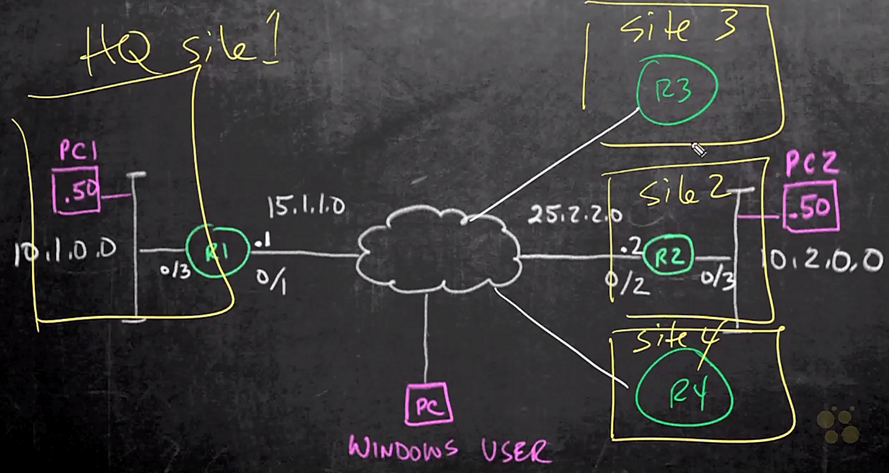

# 01. Explain Common Threats Against On-premises and Cloud Environments

Trainer: Knox Hutchinson


## Introducing the Cybersecurity Landscape

- Scope
  - learning key terms
  - understand the lanscape of cybersecurity


## Know Your Assets

- Assets
  - people: staffs including cybersecurity professionals
  - data: top security info
  - physical system


- Issues of assets
  - categories of assets: what types of assets, physical/software
  - responsibility:
    - who owns, maintain and use the assets
    - various names: owner, custodian, operators, administrator, end user, reader
  - sensitivity level


## Know Your Vulnerabilities

- Vulnerability sources
  - policy: people training
  - software: patch, e.g., operating systems
  - code design, protocol
  - network access
  - malware


## Know Your Threats

- Categories of threats
  - internal: people within an institute
  - external: black hat, white hat, gray hat, suicide hacker, script kiddie, cyber terrorist, state sponsored hacker, hacktivist


- Mitigation of threats
  - policies: stop people doing wrong thing, e.g., training
  - technical: NGFW, IDS/IPS, Web Content, email security, antivirus
  - physical: locks, keycard scanners, camera systems


## Virus, Worms, Trojan, and Malware

- Termonologies
  - virus
    - application, e.g., keylogger
    - replicate itself
  - worms
    - similar to virus
    - no end user to trigger but working on its own
  - trojans:
    - presenting itself as one application user needed
    - example: antivirus software


## Phishing and Social Engineering

- Vulnerability of people
  - phisinging: links in emails redirect to malicious websites
  - social engineering
    - research target company: dumpsters, websites, employees, tour company, etc.
    - choose victim: identify frustrated employees of target company
    - build relationship: develop relationship w/ target employee
    - exploit relationship: collect sensitive info and current technologies


## DDoS - Attacking Availability

- Denial od service (DoS) attacks
  - darknet:
    - internet where non-indexed w/ searching engine
    - requireing specific software to access
  - hacker as a service: taking down target website
  - ways to attack: social engineering, virus, etc.
  - typical attacks: TCP SYN requests, HTTP requests, Ping of death $\to$ buffer overflow


- Distributed Denial of Service (DDoS) attacks
  - botnet/zombie: infected computers around the world
  - flood the targets from these computers


## Spoofing and MitM Attacks

- MitM attacks
  - exfiltrate info


- spoofing attacks
  - known attacks: DNS, DHCP, MAC
  - redirect traffic by pretending as a real network service
  - mitigation: DAI, DHCP snooping


- CIA triad
  - confidentiality
  - integrity
  - availability


## Summarizing the Threat Landscape

- Summay
  - learn different threats
  - understand threats
  - mitigation and solutions following


# 02. Compare Common Security Vulnerabilities

Trainer: Knox Hutchinson


## Introducing Common Attack Vectors

- What to learn
  - how attackers exploit vulnerabilities
  - common attack methods
  - why it's important to handle attacks correctly


## Get to Know OWASP

- OWASP foundation
  - [Open Web Application Security Project](https://owasp.org/) (OWASP)
  - improving the security
  - some important projects
    - [OWASP Top 10](https://owasp.org/www-project-top-ten/): a standard awareness document for developers and web application security
    - [OWASP Cheat Sheet Series](https://owasp.org/www-project-cheat-sheets/): providing a set of simple good pracice guides for appplication developers and defenders to follow
    - [OWASP Web Security Testing Guide](https://owasp.org/www-project-web-security-testing-guide/): the premier cybersecurity testing resource for web application developers and security professionals
    - [OWASP Dependency-Check](https://owasp.org/www-project-dependency-check/): attempting to detect publicly disclosed vulnerabilities contained within a project’s dependencies


## The SQL Injection’; SELECT * FROM table

- 3-tier application architecture
  - tiers: web, app, and db
  - typical data flow: web or mobile apps / Kiosk (frontend) $\leftrightarrow$ application server (backend) $\leftrightarrow$ SQL database
  - frontend: web browser
  - backend: analytics, customer support, shipping, etc.
  - SQL db: storing cell files w/ SQL


- SQL injection
  - code sending code to app server or db directly
  - malicious procedure
    - web input field w/ SQL code to query info, e.g. `SELECT * FROM Table`
    - possible SQL statements: `INSERT`, `DELETE`, `DROP`, etc.
    - retrieve/delete user's sensitive info or insert brough data
  - mitigation: backend validates the SQL statement


- Demo: SQL injection
  - resource: [SQL Injection exercise](https://www.hacksplaining.com/exercises/sql-injection#/start)
  - web input: email = `user@email.com` password = `password` $\to$ Unknown email or password

    ```shell
    Rendering login page.
    Checking supplied authentication details for user@email.com.
    Finding user in database.
    No such user, report this to the user (invalid credentials?).
    Rendering login page.
    ```

  - web input: email = `user@email.com` password = `password'` $\to$ An unexpected error occurred.
    - logs: The logs show a SQL syntax error. This indicates that athe quote characterr messed somthing up in an unexpeccted way.

      ```shell
      Checking supplied authentication details for user@email.com.
      Finding user in database.
      An error occurred: PG::SyntaxError: ERROR: unterminated quoted string at or near 
        "'password'' limit 1" LINE 1: ...ers where email = 'user@email.com' and 
        password = 'password'... ^ : select * from users where email = 'user@email.com' 
        and password = 'password'' limit 1.
      Unable to login this user due to unexpected error.
      Rendering login page.
      ```

    - translated SQL code

      ```sql
      SELECT *
        FROM users
       WHERE email = 'user@email.com'
          AND pass  = 'password'' LIMIT 1
      ```
    
    - repeat the above input and observe the result
    - This behavior indicates that the application might be valuable to SQL INjection

      ```sql
      SELECT *
        FROM users
       WHERE email = 'user@email.com'
         AND pass  = 'password'' LIMIT 1
      ```

  - web input: email = `user@email.com` password = `' or 1=1--`
    - We successfully gained access to the application without having to guess the password using SQL Injection.

    ```sql
    SELECT *
      FROM users
     WHERE email = 'user@email.com'
       AND pass  = '' or 1=1--' LIMIT 1
    ```


## Cross-Site Scripting; var doCode{}

- Cross-site scripting
  - input field of web in 3-tier application w/ JS code, e.g., `<script> alert(); </script>`
  - JS code exected in web browser immediately
  - browser holding Cookie or token $\to$ probably sent to a malicious website
  - other possibilities: JS sending malicious data to server and DB 


- Demo: XSS attack
  - resource:
    - [Test Your XSS Skills Using Vulnerable Sites](https://bit.ly/3Eh9eix)
    - [Google XSS Game](https://xss-game.appspot.com/)
  - level 1:
    - input field: `<script>alert();</script>`
    - fire JS `alert` function 
    - related code snippet: [python code](src/02-l1-level.py)
  - level 2:
    - HTML code handling script text to handle script injection
    - input field: ``
    - sending JS code w/o `script` tag
    - related code snippets: [HTML](src/02-l2-index.html), [Python](src/02-l2-level.py), [JS](src/02-l2-post-store.js)


## Password Protection

- Password attacks
  - Infographic: Time it Takes a Hacker to Brute Force Your Password

    <figure style="margin: 0.5em; display: flex; justify-content: center; align-items: center;">
      
    </figure>

  - dictionary attacks
    - dictionaries accessed w/ google search for download
    - password cheing: [have i been pwned?](https://haveibeenpwned.com/)
  - brute force attacks: using random number to try


- Password mitigation
  - policy
    - enforcing minimum number of characters, upper and lower cases, numbers, and symbols
    - period for password changes
    - not hard coding username and password
  - key vault:
    - apps login key vault
    - key vault returns password once key vault authenticated
  - environment variables for username and password
  - changing default username and password


## Plain-Text Protocols

- Demo: telnet as plain-text protocol
  - task:
    - telnet to a local router via telnet
    - wireshark to capture the traffic
  - topology: Pc <--> (e0/0) R1
  - launch Wireshark and start capturing traffic on the intf connected to the console
  - config R1

    ```shell
    R1$ sh ip int br

    Interface     IP-Address      OK? Method  Status                Protocol
    Ethernet0/0   10.10.21.153    YES manual  up                    up
    EThernet0/1   unassigned      YES unset   administratively down down
    ...

  - start a new session to connect to R1 from PC w/ telnet
    - Username = cisco, Password = cisco
  - Wireshark w/ filter = `telnet` 
    - entry w/ Source and Destination IP = 10.10.21.29
    - viewing the message with the packet
    - th username and password exposed
  - using SSH instead of telnet


- Demo: HTTP as plain-text protocol
  - app not designed to redirect HTTP to HTTPS web site
  - Azure and other cloud services providing a simple option to redirect the traffic


- Protocols to conquer plain-text protocols
  - telnet $\to$ SSH
  - SNMP $\to$ SNMPv3, Netconf/SSH, Restconf/HTTPS
  - HTTP $\to$ HTTPS


## The Buffer Overflow

- Buffer overflow attacks
  - web apps sending more data than the app server able to handle
  - embedded overflow data w/ JS/C/Java code to execute
  - one of the OWASP top 10


- Mitigation of buffer overflow
  - backend code working to prevent the issue
  - one simply solution by sending back a service denial response w/ buffer overflow message


## Summarizing Common Vulnerabilities

- Summary
  - password change
  - secure version protocols
  - code change


# 03. Components of Cryptography

Trainer: Keith Barker


## Introduction to Components of Cryptography

- Learning goals
  - suite of cryptography tools
  - purpose of tools
  - applying tools to protect data integrity, confidentiality


## Data Integrity

- Hash overview
  - verifying data integrity
  - example: ios image
    - verify downloaded  file in router: `R1# verify /md5 flash0:/vios-adventerprisesek9-m`
    - generate hash value and compare to the provided hash value in Cisco website
  - date sent to remote site and using hash to verify the data not been manipulated
  - [SHA256 Hash Generator](https://passwordsgenerator.net/sha256-hash-generator/)
    - paste text to input field > 'Generate' button > SHA256 Hash of the string
    - any change of text $\to$ the hash changed
  - [HMAC Generator / Tester Tool](https://freeformatter.com/hmac-generator.html)
    - paste text into input field
    - secrete key: the element making the hash only calculateable by the devices both having the key
    - select a message digest algorithm = SHA512 > 'COMPUTE HMAC' button


## Data Privacy

- Encryption overview
  - locking & unlocking data
  - symmetrical encryption:
    - using the same key to encrypt and decrypt the data
    - algorithm current used: AES - 128, 192. 256
  - asymmetric encryption
    - key pair existed, mathematically related
    - encrypted w/ one key and decrypted w/ the other key
    - generally, private key and public key
    - provate key never sharing w/ other while public key sharing w/ world
    - public key sharing w/ digital certificate format
    - cons: computational intensive
  - Diffie-Hellman algorithm
    - one of the most popular symmetric algorithm
    - pre-shared key in general
    - typically dynamically generated


## SSL and TLS

- SSl/TLS overview
  - TLS: a successor of SSH
  - HTTPS using SSL/TLS
  - user w/ public key while server w/ private key
  - public key embedded in digital certificate
  - certificate from server signed by CA (Certificate Authority)
  - most likely the request w/ HTTP redirect to HTTPS and starting negotiation to validate the server and authenticate the end user


- Demo: HTTPS
  - network topology

    <figure style="margin: 0.5em; display: flex; justify-content: center; align-items: center;">
      
    </figure>
  
  - tasks: observe the behavior of HTTP and HTTPS
  - open web browser on PC1 to connect R2: `http://25.2.2.2` w/ user = admin, password = *** $\to$ browser indicating nor a secure connection
  - using HTTPS instad: `https://25.2.2.2` w/ username and password $\to$ browser indicating a lock but still not secure due to the trust $\to$ digital certificate missing
  - observe the packet tracker in Wireshark
    - entry for HTTP request - src = 10.1.0.50, dst = 25.2.2.2, protocol = TCP $\to$ info readbale
    - entries for HTTPS transaction
      - src = 10.1.0.50, dst = 25.2.2.2, protocol = TLSv2, Info = Client Hello  
      - src = 25.2.2.2, dst = 10.1.0.50, protocol = TLSv2, Info = Server Hello, Certificate $\to$ payload containing certificate
      - src = 10.1.0.50, dst = 25.2.2.2, protocol = TLSv2, Info = Server Key Exchange, Server Hello Done $\to$ payload encrypted


## Public Key Infrastructure (PKI)

- Public Key Infrastructure (PKI) overview
  - TLS workflow: end user (user) and server (srv)
    - user sending request to access srv w/ HTTPS (port 443)
    - src responding w/ digital certificate containing validate date, public key, etc.
    - how user knows the digital certificate a valid certificate? <span style="color: cyan;">signed</span>
  - signed digital certificate:
    - signed by a device that the browser of user PC $\to$ TRUST
    - Trust: user PC able to validate and signed by a Certificate Authority (CA)
  - how browser of user PC knows the CA? $\to$ preloaded on system
    - server generating public and private keys and then 
    - submit to CA to ask for its own digital certificate
    - once verified, CA issues a signed digital certificate


## IPsec

- IPsec overview
  - a suite of protocols to build VPN
  - purpose
    - privacy: encryption
    - data integrity: hashing algorithm - HMAC
  - methods
    - IKEv1: old version
    - IKEv2: more modular, more compatible
  

## Authentication

- Authentication overview
  - two main ways to authenticate peer
    - pre-shared key
    - digital certificate
  - pre-shared key:
    - both sides w/ same key
    - integrity (hashing): Hash-based Message Authentication Code (HMAC)
    - privacy (encryption/decryption): AES 128-256
  - RAS-signature (digital certificate)
    - both having its own certificate (possible same)


## Components of Cryptography Summary

- Summary
  - key for cryptography
  - algorithms for integrity and encryption
  - IPsec and PKI


# 04. IPsec Fundamentals

Trainer: Keith Barker

## Introduction to IPsec

- Learning goal
  - protecting data in motion and at rest
  - ensuring confidentiality and integrity
  - IPsec to achieve these goals


## IPsec Overview

- IPsec concept
  - main goals
    - privacy: encryption
    - integrity: hashing
  - types of IPsec:
    - site2site: protect traffic btw PC1 & PC2 $\to$ IPsec tunnel btw R1 & R2
    - remote access: protect traffic btw windows user and R1 $\to$ Ipsec tunnel btw PC and R1
  

- IPsec packet format
  - original IP packet
    - IP header: src = PC1, dst = PC2
    - payload
  - prefix ESP header: port 50
  - prefix new IP header: src = R1, dst = R2

  <div style="margin: 0.5em; display: flex; justify-content: center; align-items: center; flex-flow: row wrap;">
    <a href="url" ismap target="_blank">
      
    </a>
    <a href="http://www.sharetechnote.com/html/IP_Network_IPSec_ESP.html" ismap target="_blank">
      
    </a>
  </div>


- Internet Key Exchange (IKE) concept
  - DMVPN: hub-and-spoke network architecture
    - tunnels btw hub and spokes
    - tunnels btw spokes
  - crypto map
    - an instruction
    - operations
      - PC1 sending packet to PC2
      - R1 seeing the traffic and apply crypto map on the outgoing interface
      - R1 encrypting traffic and sending to R2
      - R2 decrypting the traffic and forwarding to PC2
    - old fashion and not flexible
  - virtual tunnel interface (VTI)
    - using GRE on virtual tunnel
    - applying crypto on the traffic abd sending via the virtual tunnel


## IKEv1 and IKEv2

- [IKE properties](https://learningnetwork.cisco.com/s/article/comparison-between-ikev1-and-ikev2)
  - negotiate SA attributes
  - generate and refresh keys using DH
  - authenticate peer devices using many attributes (like IP, FQDN, LDAP DN and more)


- Internet Key Exchange version 1 (IKEv1)
  - 2 phases: IKE phase 1 & IKE phase 2
  - phases representing the different security association to be built
  - security association = bi-directional tunnel
  - phase 1:
    - private communication channel
    - used for encrypting and hashing communication btw endpoints
    - parameters to negotiate: <span style="color: red">HAGLE</span>
      - Hash
      - Authentication: PSK, RAS-signature
      - Group - Diffie-Hellman group
      - Lieftime
      - Encryption
    - purpose: to build phase 2 tunnel
    - possibly having NAT-D
  - phase 2:
    - negotiating encryption, hashing (HMAC), Diffie-Hellman, lifetime, etc.
    - D.H. algorithm using the DH-Key generated by phase 1 or Perfect Forward Secrecy (PFS)
    - PFS forcing DH-Key calculation during phase 2 setup as well as Phase-2 periodic Rekey
    - IPsec SA / IPsec Tunnel built
    - NAT detected $\to$ NAT transparency / NAT-Transversal


- Internet Key Exchange version 2 (IKEv2)
  - EAP included
  - IKEv2 SA and child SA (IPsec SA)
  - NAT-D supported
  - more flexible to adopt new protocols
  - mitigating DoS


- IKEv1 and IKev2 comparisons

  <table style="font-family: Arial,Helvetica,Sans-Serif; margin: 0 auto; width: 50vw;" cellspacing=0 cellpadding=5 border=1 align="center">
    <caption style="font-size: 1.5em; margin: 0.2em;"><a href="http://rockhoppervpn.sourceforge.net/techdoc_ikev1vsikev2.html">Differences between IKEv1 and IKEv2</a></caption>
    <colgroup>
      <col style="width: 200%">
      <col style="width: 30%">
    </colgroup>
    <thead>
    <tr style="font-size: 1.2em; vertical-align:middle;">
      <th scope=row style="text-align: center;">IKEv1</th>
      <th scope=row style="text-align: center;">IKEv2 (SIMPLE and RELIABLE!)</th>
    </tr>
    </thead>
    <tbody>
      <tr><td>IPsec SA</td> <td>Child SA (Changed)</td></tr>
      <tr><td>Exchange modes:<br><ul><li>Main mode</li><li>Aggressive mode</li> </ul></td> <td>Only one exchange procedure is defined.<br>Exchange modes were obsoleted.</td></tr>
      <tr><td>Exchanged messages to establish VPN.<br> <ul> <li>Main mode: 9 messages    </li> <li>Aggressive mode: 6 messages    </li> </ul></td> <td>Only 4 messages.</td></tr>
      <tr> <td>Authentication methods ( 4 methods ):  <br> <ul> <li>Pre-Shared Key (PSK)    </li> <li>Digital Signature (RSA-Sig)    </li> <li>Public Key Encryption    </li> <li>Revised Mode of Public key Encryption    </li> </ul></td> <td>Only 2 methods:  <br> <ul> <li>Pre-Shared Key (PSK)    </li> <li>Digital Signature (RSA-Sig)    </li> </ul></td></tr>
      <tr> <td>Both peers must use the same authentication  method.</td> <td> <br>  Each peer can use a different authentication method (Asymmetrical authentication).<br>(e.g. Initiator: PSK and Responder: RSA-Sig)  <br> <br> </td></tr>
      <tr> <td>Traffic selector:  <br> <ul> <li>Only a combination of a source IP range, a destination IP range,a source port and a destination port is allowed per IPsec SA.</li> <li>Exact agreement of the traffic selectorbetween peers is required.</li> </ul></td> <td> <br> <ul> <li>Multiple combinations of a source IP range, a destination IP range,a source port range and a destination port range are allowed per Child SA. Of course, IPv4 and IPv6 addresses can be configuredfor the same Child SA.</li> <li>Narrowing traffic selectors between peersis allowed.</li> </ul></td></tr>
      <tr> <td>Lifetime for SAs:  <br>  &nbsp; Agreement between peers is required.</td> <td> <br>  NOT negotiated. Each peer can  delete&nbsp;SAs anytime by exchanging DELETE payloads.<br> <br> </td></tr>
      <tr> <td>Multi-hosting:  <br>  &nbsp; Basically, NOT supported.</td> <td> <br>  Supported by using multiple IDs on  a single  IP address and port pair.<br> <br> </td></tr>
      <tr> <td>Rekeying:  <br>  &nbsp; NOT defined.</td> <td>Defined.</td></tr>
      <tr> <td>NAT Traversal:  <br>  &nbsp; Defined as an extension.</td> <td>Supported by default.</td></tr>
      <tr> <td>Dead Peer Detection / Keep-alive for SAs:  <br>  &nbsp; Defined as an extension.</td> <td>Supported by default.</td></tr>
      <tr> <td>Remote Access VPN:  <br>  NOT defined. Supported by vender-specific implementations:  <br> <ul> <li>Mode config    </li> <li>XAUTH    </li> </ul></td> <td> <br>  Supported by default:  <br> <ul> <li>Extensible Authentication Protocol (EAP)    </li> <li>User authentication over EAP is associated withIKE's authentication.</li> <li>Configuration payload (CP)    </li> </ul></td></tr>
      <tr> <td>Multi-homing:<br>&nbsp; Basically, NOT supported.</td> <td> <br>  Supported by MOBIKE (IKEv2 Mobility and Multihoming Protocol:<a target="_blank" href="http://www.ietf.org/rfc/rfc4555.txt">RFC 4555</a>).<br> <br> </td></tr>
      <tr> <td>Mobile Clients:<br>  &nbsp; Basically, NOT supported. </td> <td> <br>  Supported by MOBIKE (IKEv2 Mobility and Multihoming Protocol:<a target="_blank" href="http://www.ietf.org/rfc/rfc4555.txt">RFC 4555</a>).<br> <br> </td></tr>
      <tr> <td>DoS protections:  <br>  &nbsp; Basically, NOT supported. </td> <td> <br> <ul> <li>Anti-replay function is supported.</li> <li>'Cookies' is supported for mitigating flooding attacks.</li> <li>Many vulnerabilities in IKEv1 were fixed.</li> </ul></td></tr>
      <tr> <td>Less reliable than IKEv2.</td> <td> <br>More reliable.<br> <ul> <li>All message types are defined as Request and Response pairs.</li> <li>A procedure to delete SAs is defined.</li> <li> A procedure to retransmit a message is defined.</li> </ul></td></tr>
      <tr> <td>Extensions are very poor.</td> <td> <br>  Useful extentions in actual network environment.<br> <br> <ul> <li>"Redirect Mechanism for IKEv2 (RFC5685)" </li> <li>"IKEv2 Session Resumption (RFC5723)" </li> <li>"An Extension for EAP-Only Authentication in IKEv2 (RFC5998)" </li> <li>"Protocol Support for High Availability of IKEv2/IPsec (RFC6311)" </li> <li>"A Quick Crash Detection Method for the Internet Key Exchange Protocol (IKE) (RFC6290)" </li> </ul> <div style="margin-left: 320px;"> etc.<br> </div> See the <a target="_blank" href="http://datatracker.ietf.org/wg/ipsecme/">IETF  ipsecme-WG's web page</a>. </td></tr>
    </tbody>
  </table>

## Crypto Map IPsec

- Crypto map concept
  - ACL to control interested traffic, e.g., traffic from PC1 subnet 10.1.0.0/24 to PC2 subnet 10.2.0.0/24
  - IPsec transform set: HAGLE parameters
  - a container containing
    - bundled ACL and IPsec transform set
    - peer info
  - used to build IPsec tunnel mode


- IPsec modes
  - refer to IPsec packet format
  - tunnel mode:
    - adding new IP header w/ two routers as src and dst addresses
    - default mode for IPsec
  - transport mode
    - using the original IP header, i.e. PC1 and PC2 as the src and dst address
    - using original tunnel w/ minimal manpiplation to form IPsec


## VTI IPsec

- Virtual Tunnel Interface (VTI) concept
  - create virtual tunnel on R1: `R1(config)# in tunnel 0`
  - using intf facing Internet as the source intf of the virtual tunnel : `R1(config-if)# source 15.1.1.1` or `R1(config-if)# source g0/1`
  - usinging intf facing public network as the destiunation intf: `R1(config-if)# destination 25.2.2.2` or `R1(config-if)# destination g0/2`
  - default encapsulation as GRE (generic route encapsulation)
  - use the encapsulation w/ IPsec instead: `R1(config-if)# ipsec ipv4`
  - apply ipsec profile
  - build a logic tunnel btw R1 (.1) & R2 (.2) w/ subnet 10.12.12.0/24 for routing purpose: `R1(config-if)# 10.12.12.1 255.255.255.0`


- Dynamic VTI concept
  - another option of VTI w/ unknown peer
  - mainly used for mobile user (PC) and headquarter router (R1)
  - create template w/ IPsec profile, IP address for remote user, 


## DMVPNs

- Dynamic Multipoint Virtual Private Network (DMVPN) concept
  - topology: hub-and-spoke network architecture
  - issue on building a full connectivity network
    - create IPsec tunnel btw hub (R1) and spokes (R2, R3, and R4) individually
    - unable to communicate btw spokes directly $\to$ dual trips
  - solution: DMVPN resolve the issue
  - building w/ IPsec
  - IPsec still using trunnel interface but mGRE (multipoint GRE) instead
  - through hub, spokes dynamically learned each other w/ NHRP (Next Hub Resolution Protocol)


  <figure style="margin: 0.5em; display: flex; justify-content: center; align-items: center;">
    
  </figure>


## FlexVPN

- FlexVPN concept
  - multiple types of VPNs, such as site2site, remote access, DMVPN, etc.
  - using IKEv2 to build FlexVPN for all these types of VPNs
  - many default options $\to$ using or modifying these defaults


## GET VPN

- Group Encrypted Transfer (GET) VPN concept
  - cloud as service and reaching all sites (R1~4)
  - build a full connecting VPN across all sites
  - introducing IPsec controller, communicating w/ all routers
  - IPsec controller
    - communicate all routers
    - instructing routers w/ given SA and keys, even any change
    - instructing routers for intresting traffic w/ policy
    - encrypted packet prefixing an IP header but using original src and dst addresses

  <figure style="margin: 0.5em; display: flex; justify-content: center; align-items: center;">
    
  </figure>


## NAT Traversal

- NAT Traversal concept
  - a.k.a. NAT transparency
  - NAT/PAT btw PC1 and PC2
  - NAT/PAT unable to handle Layer 4 ESP protocol (port 50)
  - implemented in many IKEv1 and all IKEv2
  - using hash value on th eIP address, receiver detects NAT/PAT used in btw
  - using UDP instead of ESP for the tunnel
    - prefix UDP header than IP header for encrypted packet
    - prefix an IP header w/ original src and dst addresses
  - keep alive required to maintain the NAT-T

  <div style="margin: 0.5em; display: flex; justify-content: center; align-items: center; flex-flow: row wrap;">
    <a href="https://bit.ly/3muy60h" ismap target="_blank">
      
    </a>
    <a href="https://support.huawei.com/enterprise/en/doc/EDOC1100055047/9b0b323f/ipsec-nat-traversal" ismap target="_blank">
      
    </a>
  </div>


- Demo: observing NAT-T w/ wireshark
  - IPsec negotiation btw 10.5.5.51 (= CLT) & 15.1.1.1 (= SRV)
  - the process applied for both IKEv1 & IKEv2
  - pkt: src = CLT, dst = SRV, protocol = ISAKMP, info = IKE SA INIT MID=00 Initiator Request
    - L3: Internet Protocol Version 4, Src: 10.5.5.51, Dst: 15.1.1.1 $\to$ Protocol: UDP (17)
    - L4: User Datagram Protocol, <span style="color: cyan;">Src Port : 59704, Dst Port: 500</span>
    - Payload: Internet Security Association and Key Management Protocol
      - Payload: Notify (41) - NAT_DETECTION_SOURCE_IP
      - Payload: Notify (41) - NAT_DETECTION_DESTINATION_IP
  - pkt: src = CLT, dst = SRV, protocol = ESP, Info = ESP (SPI=0xc2a16345) [randomly selected one]
    - L3: Internet Protocol Version 4, Src: 10.5.5.51, Dst: 15.1.1.1 $\to$ Protocol: UDP (17)
    - L4: User Datagram Protocol, <span style="color: cyan;">Src Port : 59705, Dst Port: 4500</span>, UDP Encapsulation of IPsec Packets
    - Payload: Encapsulating Security Payload


## IPsec Fundamentals Summary

- Summary
  - ways to implement IPsec, including crypto map and VTI
  - VPNs: DMVPN, GET VPN, FlexVPN 


