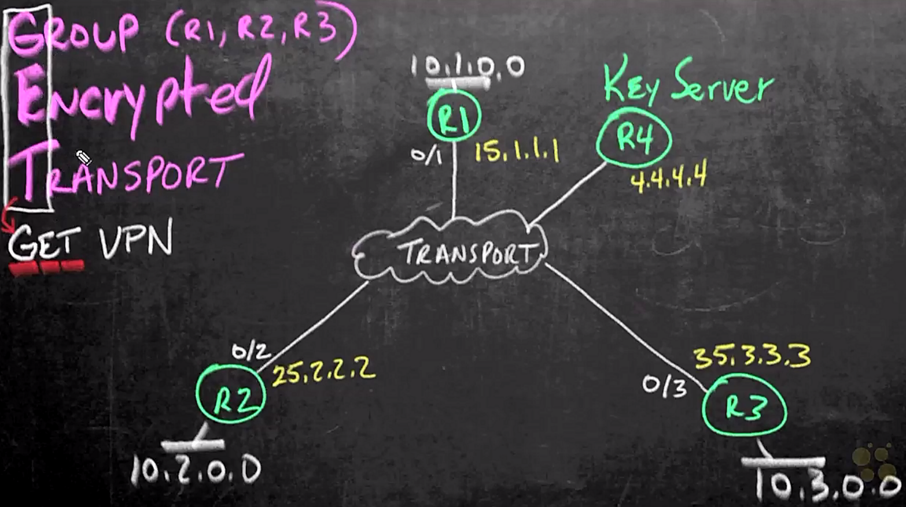

# IPsec Virtual Private network (VPN)


## 05. Cisco Router Site-To-Site VPNs


### Planning for IPsec Site-To-Site

- Site-to-site IPsec VPN
  - topology:
    - site 1: R1 + PC1
    - site 2: R2 + PC2
  - sharing info and protecting the traffic btw 2 sites
  - encrypted traffic only btw R1 & R2, PC1 & PC2 unawaring the encryption


- Requirements to build the site-to-site IPsec VPN
  - using IKEv1 to establish IPsec VPN
  - IKE Phase 1
    - authentication:
      - how peers to prove each other authorized?
      - solutions: preshared key, digital signature
    - hashing: packet integrity
    - encryption: ASE recommended
    - DH group:
      - a way to generate keying material
      - how to generate the keys for R1 & R2 encryption and decryption
    - lifetime
  - IKE Phase 2
    - the IPsec tunnel
    - encryption
    - interesting traffic: what traffic will be encrypted
    - peers: R1 & R2
    - tunnel mode: encrypted the whole packet and adding an new IP header
    - keying material: recycling from phase 1 or generating a new pair (PFS)


### Designing a Site-To-Site VPN

- Designing IKE phase 1 security association
  - encryption: AES 256
  - hash: SHA 256
  - authentication: pre-sharedd key (Cisco!23)
  - DH group: group 5
  - lifetime: 5000 (sec)


- Designing IKE phase 2 security association (IPsec tunnel)
  - ACL: traffic btw 10.1.0.0/24 and 10.2.0.0/24
  - encryption: AES 128
  - hash: SHA 384, most commonly using HMAC (Hash-based Message Authentication Code)
  - peer: R1 & R2
  - mode: tunnel
  - PFS (optional): group 15


### Configuring an IKE Phase 1 Policy

- Verify basic info and reachability
  - ensure the connectivity of public network
  - R1 interfaces na reachability check

    ```text
    R1# sh ip int br
    Interface           IP-Address  OK? Method  Status                Protocol
    GigabitEthernet0/0  unassigned  YES TFTP    administratively down down
    GigabitEthernet0/1  15.1.1.1    YES TFTP    up                    up
    GigabitEthernet0/2  unassigned  YES TFTP    administratively down down
    GigabitEthernet0/3  10.1.0.1    YES TFTP    up                    up

    R1# ping 25.2.2.2
    Sending 5, 100-byte ICMP Echos to 25.2.2.2, timeout is 2 seconds:
    !!!!!
    Success rate is 100 percent (5/5), round-trip min/avg/max = 4/6/11 ms
    ```

  - R1 & R2 reachability: `ping 25.2.2.2` $\to$ `!!!!!`
  - PC1 basic info and reachability check:

    ```text
    PC1# ip addr
    <...truncated...>
    82: eth0@if81: ...
      <...truncated...>
      inet 10.1.0.51/24 scope global eth0
      <...truncated...>
    
    PC1# route
    Kernel IP routing table
    Destination   Gateway   Genmask         Flags Metric  Ref   Use Iface
    default       10.10.1   0.0.0.0         UG    0       0       0 eth0
    10.1.0.0      *         255.255.255.0   U     0       0       0 eth0
    172.17.0.0    *         255.255.0.0     U     0       0       0 eth1
    
    pc1# traceroute 10.2.0.50
    traceroute to 10.2.0.50 (10.2.0.50), 30 hops max, 60 byte packets
     1  10.1.0.1  (10.1.0.1)    7.607 ms    12.278 ms 18.515 ms
     2  15.1.1.5  (15.1.1.5)    14.158 ms   21.355 ms 22.545 ms
     3  25.2.2.2  (25.2.2.2)    24.787 ms   26.037 ms 27.078 ms
     4  10.2.0.50 (10.2.0.50)   16.516 ms   18.765 ms 19.234 ms
    ```

    - PC1 interface

- Implementing IKE Phase 1 on R1
  - isakmp policy number: lower number taking priority

  ```text
  R1# sh run | section crypto
  ```

  ```text
  R1# sh crypto isakmp policy
  Global IKE policy
  Default protection suite
          encryption algorithm:   DES - Data Encryption Standard (56 bit keys).
          hash algorithm:         Secure Hash Standard
          authentication method:  Rivest-Shamir-Adleman Signature
          Diffie-Hellman group:   #1 (768 bit)
          lifetime:               86400 seconds, no volume limit
  
  ! config IKEv1 phase 1
  R1# conf t
  R1(config)# crypto isakmp policy 5
  R1(config-isakmp)# authentication pre-share
  R1(config-isakmp)# hash sha512
  R1(config-isakmp)# encryption aes 256
  R1(config-isakmp)# group 5
  R1(config-isakmp)# lifetime 
  R1(config-isakmp)# sh crypto isakmp policy
  Global IKE policy
  Protection suite of priority 5
          encryption algorithm:   AES - Advanced Encryption Standard (256 bit keys).
          hash algorithm:         Secure Hash Standard 2 (256 bit)
          authentication method:  Pre-Shared Key
          Diffie-Hellman group:   #5 (1536 bit)
          lifetime:               5000 seconds, no volume limit
  Default protection suite
          encryption algorithm:   DES - Data Encryption Standard (56 bit keys).
          hash algorithm:         Secure Hash Standard
          authentication method:  Rivest-Shamir-Adleman Signature
          Diffie-Hellman group:   #1 (768 bit)
          lifetime:               86400 seconds, no volume limit
  
  ! config pre-shared key
  R1(config-isakmp)# exit
  R1(config)# crypto isakmp key Cisco!23 address 25.2.2.2 ! specified intf
  R1(config)# crypto isakmp key Cisco!23 address 0.0.0.0  ! all intfs
  R1# sh crypto isakmp key
  Keyring      Hostname/Address                            Preshared Key
  default      0.0.0.0        [0.0.0.0        ]            Cisco!23
  ```

  - apply same config on R2


### Configuring an IKE Phase 2 (IPsec) Policy

- IMplement IKEv1 Phase 2 on R1
  - create transfor set for IKEv1 phase 2
  - crypto map sequence number: used ti identify if multiple crypto maps used for different sites
  - crypto map not enabled on any interface

  ```text
  ! config transform set
  R1# conf t
  R1(config)# crypto ipsec transform-set Demo-SET esp-aes 128 esp-sha384-hmac
  R1(cfg-crypto-trans)# mode tunnel
  R1(cfg-crypto-trans)# exit
  
  ! config crypto ACL
  R1(config)# ip access-list extended Crypto-ACL
  R1(config-ext-nacl)# permit ip 10.1.0.0 0.0.255.255 10.2.0.0 0.0.255.255
  R1(config-ext-nacl)# exit
  
  ! config crypto map
  R1(config)# crypto map Demo-MAP 10 ipsec-isakmp
  R1(config-crypto-map)# match address Crypto-ACL
  R1(config-crypto-map)# set peer 25.2.2.2
  R1(config-crypto-map)# set transform-set Demo-SET
  R1(config-crypto-map)# set pfs group15
  R1(config-crypto-map)# exit
  R1(config)# do sh crypto map
  Crypto Map "Demo-MAP" 10 ipsec-isakmp
      Peer = 25.2.2.2
      Extended IP access list Crypto-ACL
          access-list Crypto-ACL permit ip 10.1.0.0 0.0.255.255 10.2.0.0 0.0.255.255
      Security association lifetime: 4608000 kilobytes/3600 seconds
      PFS (Y/N): Y
      DH group:  group15
      Transform sets={ 
              Demo-SET:    { esp-aes esp-sha384-hmac  }, 
      }
      Interfaces using crypto map Demo-MAP:
  ```


### Enabling the IPsec Policy

- Verify IKEv1 config on R2
  - ensure the crypto config same as R1

  ```text
  ! verify R2
  R2# sh crypto isakmp policy
  Global IKE policy
  Protection suite of priority 5
          encryption algorithm:   AES - Advanced Encryption Standard (256 bit keys).
          hash algorithm:         Secure Hash Standard 2 (256 bit)
          authentication method:  Pre-Shared Key
          Diffie-Hellman group:   #5 (1536 bit)
          lifetime:               5000 seconds, no volume limit
          
  R2# sh crypto isakmp key
  Keyring      Hostname/Address                            Preshared Key
  default      0.0.0.0        [0.0.0.0        ]            Cisco!23

  R2# show crypto mao
  Crypto Map "Demo-MAP" 10 ipsec-isakmp
          Peer = 25.2.2.2
          Extended IP access list Crypto-ACL
              access-list Crypto-ACL permit ip 10.1.0.0 0.0.255.255 10.2.0.0 0.0.255.255
          Security association lifetime: 4608000 kilobytes/3600 seconds
          PFS (Y/N): Y
          DH group:  group15
          Transform sets={ 
                  Demo-SET:    { esp-aes esp-sha384-hmac  }, 
          }
          Interfaces using crypto map Demo-MAP:
  ```


- Applying crypto map to egress interface on R2

  ```text
  R2(config)# int gig 0/2
  R2(config-if)# crypto map Demo-MAP
  R2(config-if)# end
  
  ! verify applying to intf gig 0/2
  R2# sh crypto map
  Crypto Map "Demo-MAP" 10 ipsec-isakmp
          Peer = 25.2.2.2
          Extended IP access list Crypto-ACL
              access-list Crypto-ACL permit ip 10.1.0.0 0.0.255.255 10.2.0.0 0.0.255.255
          Security association lifetime: 4608000 kilobytes/3600 seconds
          PFS (Y/N): Y
          DH group:  group15
          Transform sets={ 
                  Demo-SET:    { esp-aes esp-sha384-hmac  }, 
          }
          Interfaces using crypto map Demo-MAP:
                  GigabitEthernet0/2
  ```

  ```text
  R2# show crypto isakmp sa
  interface: GigabitEthernet0/2
      Crypto map tag: Demo-MAP, local addr 25.2.2.2
    
    protected vrf: (none)
    local  ident (addr/mask/prot/port): (10.2.0.0/255.255.0.0/0/0)
    remote ident (addr/mask/prot/port): (10.1.0.0/255.255.0.0/0/0)
    current_peer 15.1.1.1 port 500
      PERMIT, flags = {origin_is_acl,}
      #pkts encaps: 0, #pkts encrypt: 0, #pkts digest: 0
      #pkts decaps: 0, #pkts decrypt: 0, #pkts verify: 0
      #pkts compressed: 0, #pkts decompressed: 0
      #pkts not compressed: 0, #pkts compr. failed: 0
      #pkts errros 0, #recv errors 0

       local crypto endpt.: 25.2.2.2, remote crypto endpt.: 15.1.1.1
       plaintext mtu 1500, path mtu 1500, ip mtu 1500, ip mtu idb GigabitEthernet0/2
       current outbound spi: 0x0(0)
       FPS (Y/N): N, DH group: none

       inbound esp sas:
  ```


- Applying crypto map to egress interface on R1

  ```text
  R1(config)# int gig 0/1
  R1(config-if)# crypto map Demo-MAP
  R1(config-if)# end
  R1(config)# end
  ```

- Verify IKE and IPsec sa
  - site-to-site IPsec VPN not created when config
  - IPsec VPN created unless traffic flow btw
  - enable debug tool on R1 to observe the negotiation

    ```text
    R1# show crypto isakmp sa
    IPv4 Crypto ISAKMP SA
    dst       src     state     conn-id status
    ! no sa created 

    R1# debug crypto isakmp
    R1# debug crypto ipsec
    ```

  - init traffic on PC1:

    ```text
    PC1# traceroute10.2.0.50
    traceroute to 10.2.0.50 (10.2.0.50), 30 hops max, 60 byte packets
     1  10.1.0.1  (10.1.0.1)    4.028 ms    <...truncated...>
     2  25.2.2.2  (25.2.2.2)    24.343 ms   <...truncated...>
     3  10.2.0.50 (10.2.0.50)   70.862 ms   <...truncated...>
    ```

  - verify sa negotiation on R1
    - `OM_IDLE`: not build tunnel unless traffic triggered

    ```text
    R1# undebug all

    R1# show crypto isakmp sa
    IPv4 Crypto ISAKMP SA
    dst       src       state     conn-id status
    25.2.2.2  15.1.1.1  OM_IDLE      1001 ACTIVE
    
    R1# show crypto isakmp sa detail
    IPv4 Crypto ISAKMP SA
    C-id  Local     Remote    I-VRF Status  Encr  Hash    Auth  DH  Lifetime
    1001  15.1.1.1  25.2.2.2        ACTIVE  aes   sha256  psk   5   01:22:30
           Engine-id:Conn-id =  SW:1
    
    R1# show crypto ipsec sa
    interface: GigabitEthernet0/1
      Crypto map tag: Demo-MAP, local addr 15.1.1.1
    
    protected vrf: (none)
    local  ident (addr/mask/prot/port): (10.1.0.0/255.255.0.0/0/0)
    remote ident (addr/mask/prot/port): (10.2.0.0/255.255.0.0/0/0)
    current_peer 25.2.2.2 port 500
      PERMIT, flags = {origin_is_acl,}
      #pkts encaps: 35, #pkts encrypt: 35, #pkts digest: 35
      #pkts decaps: 10, #pkts decrypt: 10, #pkts verify: 10
      #pkts compressed: 0, #pkts decompressed: 0
      #pkts not compressed: 0, #pkts compr. failed: 0
      #pkts errros 0, #recv errors 0

       local crypto endpt.: 15.1.1.1, remote crypto endpt.: 25.2.2.2
       plaintext mtu 1422, path mtu 1500, ip mtu 1500, ip mtu idb GigabitEthernet0/1
       current outbound spi: 0x71D29954(1929627220)
       FPS (Y/N): Y, DH group: group15

       inbound esp sas:
    ```


### Protocol Analysis IPsec

- Analyzing IPsec negotiation flow
  - init traffic from PC1
    - connectivity: `PC1# ping -c 5 10.2.0.50`
    - browsing sever: URL = `http://10.2.0.50`
    - repeat a couple of times by resending ICMP and refreshing browser
  - open Wireshark to observe traffic
    - Observation points: R1 g0/3 = O1, R2 g0/3 = O2, Cloud g0/1 = O3
    - R1 g0/3 = S1 = 10.1.0.50, R1 g0/1 = E1 = 15.1.1.1, R2 g0/1 = E2 = 25.2.2.2, R2 g0/3 = S2 = 10.2.0.50 = S2
    - O1 pkt: src = S1, dst = S2, Prot = HTTP, Info = GET / HTTP/1.1
      - L3: Internet Protocol Version 4, Src: S1, Dst: S2 $\to$ Identification: 0xf2b5 (62133)
    - O3 pkt: src = E1, dst = E2, Pro = ESP, Info = (SPI=0x71d29954)
      - L3: Internet Protocol Version 4, Src: E1, Dst: E2 $\to$ Protocol: Encap Security Protocol (50)
      - Payload: Encapsulating Security Payload $\to$ ESP Sequence: 70, encrypted and data unknown
    - using Identification number to search for the original and encrypted on S1 and E1


## 06. Cisco Point-To-Point GRE over IPsec VPNs


### Overview of GRE over IPsec VPNs

- Issues of IPsec tunnel
  - originally designed for site-to-site IPsec VPN
  - no logical IP address w/ S2S IPsec tunnel
  - not supporting broadcast and multicast
  - unable to use routing protocols


- Generic Routing Encapsulation (GRE)
  - a protocol for encapsulating data packets to set up a direct network connection
  - creating GRE tunnel to enable
    - network address space associated to the tunnel
    - carrying other protocols other than IP only
    - broadcast and multicast w/ the address space
    - running routing protocols
  - packet format

    <figure style="margin: 0.5em; display: flex; justify-content: center; align-items: center;">
      
    </figure>

  <div style="margin: 0.5em; display: flex; justify-content: center; align-items: center; flex-flow: row wrap;">
    <a href="http://blog.51sec.org/2016/10/cisco-ios-router-configuration-ipsec.html" ismap target="_blank">
      
    </a>
    <a href="url" ismap target="_blank">
      
    </a>
  </div>

  <div style="margin: 0.5em; display: flex; justify-content: center; align-items: center; flex-flow: row wrap;">
    <a href="http://blog.51sec.org/2016/10/cisco-ios-router-configuration-ipsec.html" ismap target="_blank">
      
    </a>
    <a href="url" ismap target="_blank">
      
    </a>
  </div>


### P2P GRE Tunnel Design

- Designing GRE tunnel
  - create tunnel btw R1 & R2
  - tunnel address space: 10.12.12.0/24
  - use EIGRP as routing protocol
    - autonomous system: 1
    - network: 10.0.0.0/8 


### P2P GRE Tunnel Implementation

- Implementing P2P GRE tunnel on R1

  ```text
  ! verify interface config
  R1# sh ip int br
  Interface           IP-Address  OK? Method  Status                Protocol
  GigabitEthernet0/0  unassigned  YES TFTP    administratively down down
  GigabitEthernet0/1  15.1.1.1    YES TFTP    up                    up
  GigabitEthernet0/2  unassigned  YES TFTP    administratively down down
  GigabitEthernet0/3  10.1.0.1    YES TFTP    up                    up
  
  ! create tunnel intf 0 w/ Ip addr
  R1# conf t
  R1(config)# int tunnel 0
  R1(config-if)# ip addr 10.12.12.1 255.255.255.0
  R1(config-if)# tunnel source 15.1.1.1
  R1(config-if)# tunnel destination 25.2.2.2
  R1(config-if)# do show run int tun 0
  Current configuration : 115 bytes
  !
  interface Tunnel0
   ip address 10.12.12.1 255.255.255.0
   tunnel source 15.1.1.1
   tunnel destination 25.2.2.2
  end
  ```


- Implementing P2P GRE tunnel on R2

  ```text
  R2# conf t
  R2(config)# int tunnel 0
  R2(config-if)# ip addr 10.12.12.2 255.255.255.0
  R2(config-if)# tunnel source 25.2.2.2
  R2(config-if)# tunnel destination 15.1.1.1
  
  R1(config-if)# do show run int tun 0
  Current configuration : 115 bytes
  ! 
  interface Tunnel0
   ip address 10.12.12.2 255.255.255.0
   tunnel source 25.2.2.2
   tunnel destination 15.1.1.1
  end
  ```


- Config EIGRP on R1 & R2

  ```text
  R2# show ip route
  Gateway of last resort is not set

  s*    0.0.0.0 [1/0] via 25.2.2.5
        10.0.0.0/8 is variably subnetted, 2 subnets, 2 masks
  C        10.2.0.0/24 is directly connected, GigabitEthernet0/3
  L        10.2.0.1/32 is directly connected, GigabitEthernet0/3
  C        10.12.12.0/24 is directly connected, Tunnel0
  L        10.12.12.1/32 is directly connected, Tunnel0
        25.0.0.0/8 is variably subnetted, 2 subnets, 2 masks
  C        25.2.2.0/24 is directly connected, GigabitEthernet0/2
  L        25.2.2.2/32 is directly connected, GigabitEthernet0/2
  
  ! config EIGRP
  R2# conf t
  R2(config)# router eigrp 1
  R2(config-router)# no auto-summary
  R2(config-router)# net 10.0.0.0 0.255.255.255
  R2(config-router)# end
  
  R2#sh ip eigrp interfaces 
  EIGRP-IPv4 Interfaces for AS(1)
                          Xmit Queue   Mean   Pacing Time   Multicast    Pending
  Interface        Peers  Un/Reliable  SRTT   Un/Reliable   Flow Timer   Routes
  Gi0/3              0        0/0         0       0/1            0           0
  Tu0                0        0/0         0       6/6            0           0
  
  ! config EIGRP
  R1# conf t
  R1(config)# router eigrp 1
  R1(config-router)# no auto-summary
  R1(config-router)# net 10.0.0.0 0.255.255.255
  R1(config-router)# end
  
  R1# show ip route eigrp
  Gateway of last resort is not set

        10.0.0.0/8 is variably subnetted, 2 subnets, 2 masks
  D        10.2.0.0/24 [90/26880256] via 10.12.12.2 00:00:09, Tunnel0
  ```


### P2P GRE Tunnel Verification

- Verifying P2P GRE tunnel
  - capture packets on A - PC1 (10.1.0.50), B - Cloud, and C - PC2 (10.2.0.50)
  - PC1 browsing PC2, 10.2.0.50, and reflash a couple of time to generate traffic
  - pkt on A: src=PC1, dst=PC2, prot=HTTP, info=GET / HTTP/1.1
    - L3: IPv4 $\to$ Identification: 0x7f18 (32536)
    - L4: TCP, SrcPort: 36276, Dst Port: 80
  - pkt on B: src=PC1, dst=PC2, prot=HTTP, info=GET / HTTP/1.1
    - L3: IPv4, Src: 15.1.1.1, Dst: 25.2.2.2 $\to$ Protocol: Generic Routing Encapsulation (47)
    - Generic Routing Encapsulation (IP)
    - L3: IPv4, Src: PC1, Dst=PC2 $\to$ Identification: 0x7f18 (32536)
    - L4: TCP, SrcPort: 36276, Dst Port: 80
  - pkt on C: src=PC1, dst=PC2, prot=HTTP, info=GET / HTTP/1.1
    - L3: IPv4 $\to$ Identification: 0x7f18 (32536)
    - L4: TCP, SrcPort: 36276, Dst Port: 80


### IPsec Tunnel Protection Design

- Planning of IPsec tunnel
  - IKE phase 1
    - encryption: aes 256
    - hashing: SHA 256
    - authentication: pre-shared key (PSK)
    - DH group: group 5
    - lifetime: 5000
  - IKE phase 2
    - enccryption: aes 128
    - hashing: HMAC SHA 384
  - interesting traffic
    - crypto map w/ crypto ACL fpr port 47
    - tunnel protection profile into tunnel interface (recommended)


### IPsec Virtual Tunnel Interface Configuration

- Config IKE phase 1 on R1

  ```text
  R1# conf t
  R1(config)#crypto isakmp policy 7
  R1(config-isakmp)#encryption aes 256
  R1(config-isakmp)#hash sha256
  R1(config-isakmp)#authentication pre-share
  R1(config-isakmp)#group 5
  R1(config-isakmp)#lifetime 5000
  R1(config-isakmp)# exit
  
  R1(config)#do show crypto isakmp policy  
  Global IKE policy
  Protection suite of priority 7
  
          encryption algorithm:   AES - Advanced Encryption Standard (256 bit keys).
          hash algorithm:         Secure Hash Standard 2 (256 bit)
          authentication method:  Pre-Shared Key
          Diffie-Hellman group:   #5 (1536 bit)
          lifetime:               5000 seconds, no volume limit
          
  ! config pre-shared key
  R1(config)#crypto isakmp key Cisco!23 address 0.0.0.0
  R1(config)#do sh crypto isakmp key
  Keyring      Hostname/Address                            Preshared Key
  default      0.0.0.0        [0.0.0.0        ]            Cisco!23
  ```
  

- Config IKE phase 2 on R1
  
  ```text
  R1(config)#crypto ipsec transform-set Demo-SET esp-aes 128 esp-sha384-hmac 
  R1(cfg-crypto-trans)#mode tunnel 
  R1(cfg-crypto-trans)#exit
  
  ! change tunnel encryption GRE to IPsec
  R1(config)# crypto ipsec profile Demo-IPsec-Profile 
  R1(ipsec-profile)# set transform-set Demo-SET
  R1(ipsec-profile)# exit
  ```


- Config IPsec within tunnel interface on R1
  - tunnel mode ipsec ipv4 = VTI

  ```text
  R1(config)# int tunnel 0
  R1(config-if)#tunnel mode ipsec ipv4 
  R1(config-if)#tunnel protection ipsec profile Demo-IPsec-Profile
  R1(config-if)#end
  ```
  

- Config IKE phase 1, phase 2 and tunnel interface on R2

  ```text
  R2# conf t
  ! IKE phase 1
  R2(config)# crypto isakmp policy 7
  R2(config-isakmp)# encryption aes 256
  R2(config-isakmp)# hash sha256
  R2(config-isakmp)# authentication pre-share
  R2(config-isakmp)# group 5
  R2(config-isakmp)# lifetime 5000
  R2(config-isakmp)# exit
  
  R1(config)#do show crypto isakmp policy  
  Global IKE policy
  Protection suite of priority 7
          encryption algorithm:   AES - Advanced Encryption Standard (256 bit keys).
          hash algorithm:         Secure Hash Standard 2 (256 bit)
          authentication method:  Pre-Shared Key
          Diffie-Hellman group:   #5 (1536 bit)
          lifetime:               5000 seconds, no volume limit
          
  ! config pre-shared key
  R2(config)# exit
  R2(config)#crypto isakmp key Cisco!23 address 0.0.0.0
  R2(config)#do sh crypto isakmp key
  Keyring      Hostname/Address                            Preshared Key
  default      0.0.0.0        [0.0.0.0        ]            Cisco!23
  
  ! IKE phase 2
  R2(config)# crypto ipsec transform-set Demo-SET esp-aes 128 esp-sha384-hmac 
  R2(cfg-crypto-trans)# mode tunnel 
  R2(cfg-crypto-trans)# exit
  
  ! change tunnel encryption GRE to IPsec
  R2(config)# crypto ipsec profile Demo-IPsec-Profile 
  R2(ipsec-profile)# set transform-set Demo-SET
  R2(ipsec-profile)# exit
  ```


- Verify connectivity and config
  - open browser on PC1 w/ URL = '10.2.0.50', refresh a couple time to generate traffic
  - verify crypto info on R1

    ```text
    R1# show crypto engine connections active
    Crypto Engine Connections

       ID  Type    Algorithm      Encrypt  Decrypt LastSeqN IP-Address
        5  IPsec   AES+SHA384           0       23       23 15.1.1.1
        6  IPsec   AES+SHA384          25        0        0 15.1.1.1
     1001  IKE     SHA256+AES256        0        0        0 15.1.1.1
     1002  IKE     SHA256+AES256        0        0        0 15.1.1.1
    
    R1#show crypto isakmp sa
    IPv4 Crypto ISAKMP SA
    dst             src             state          conn-id status
    25.2.2.2        15.1.1.1        QM_IDLE           1002 ACTIVE
    15.1.1.1        25.2.2.2        QM_IDLE           1001 ACTIVE
    
    R1# show crypto ipsec sa
    interface: GigabitEthernet0/1
      Crypto map tag: Demo-MAP, local addr 15.1.1.1
    
    protected vrf: (none)
    local  ident (addr/mask/prot/port): (0.0.0.0/0.0.0.0/0/0)
    remote ident (addr/mask/prot/port): (0.0.0.0/0.0.0.0/0/0)
    current_peer 25.2.2.2 port 500
      PERMIT, flags = {origin_is_acl,}
      #pkts encaps: 39, #pkts encrypt: 39, #pkts digest: 39
      #pkts decaps: 36, #pkts decrypt: 36, #pkts verify: 36
      #pkts compressed: 0, #pkts decompressed: 0
      #pkts not compressed: 0, #pkts compr. failed: 0
      #pkts errors 0, #recv errors 0
      
       local crypto endpt.: 15.1.1.1, remote crypto endpt.: 25.2.2.2
       plaintext mtu 1422, path mtu 1500, ip mtu 1500, ip mtu idb GigabitEthernet0/1
       current outbound spi: 0xC2A77F2F(3265756975)
       FPS (Y/N): N, DH group: none

       inbound esp sas:
    ```


### IPsec Static VTI Verification

- Verify VTI
  - verification points: A - PC1, B - Cloud, C - PC2
  - PC1 = 10.1.0.50, PC2 = 101.2.0.50, 
  - pkt on A: src=PC1, dst=PC2, prot=HTTP, info=GET / HTTP/1.1 $\to$ ip.id == 0x4965
    - L3: IPv4, Src: PC1, dDst: PC2 $\to$ Identification: 0x4965 (18789), Time to live: 64
    - L4: TCP, Src Port: 38592, Dst Port: 80, Seq: 3381, Ack: 14818, Len: 446
    - L7: Hypertext Transfer Protocol $\to$ plain text
  - pkt on B: src=25.2.2.2, dst=15.1.1.1, prot=ESP, info = ESP (SPI=0x...)
    - L3: IPv4, Src: 25.2.2.2, Dst: 15.1.1.1 $\to$ Protocol: Encap Security Playload (50)
    - L7: Encapsulating Security Payload $\to$ encrypted text
    - unable to find ip.id = 0x4965 (encrypted)
  - pkt on C: src=PC1, dst=PC2, prot=HTTP, info=GET / HTTP/1.1 $\to$ ip.id == 0x4965
    - same packet as observed on A
    - L3: IPv4, Src: PC1, dDst: PC2 $\to$ Identification: 0x4965 (18789), Time to live: 62


## 07. Cisco DMVPN


### Introduction to DMVPN

- Procedure to implement DMVPN
  - 1\. config mGRE on tunnel intf
  - 2\. config NHRP on those intf and how spokes reaching the hub
  - 3\. config routing protocol
  - 4\. config IPsec on DMVPN

### DMVPN Overview

- DMVPN network
  - hub-spoke network
  - R1 w/ headquarter, R2 w/ site 2, and R3 w/ site 3
  - R1~3 connected via Internet, private network or MPLS
  - NBMA: Non-Broadcast Multiple Access
  - mGRE: tunnel interfaces btw R1 & R2, R1 & R3
  - user traffic from R2 to server connected to R3
  - R2 viewing R3 as the next hop $\to$ traffic directly from R2 to R3, not via R1
  - issue: how do R2 know the Ip address space, 35.3.3.0?
  - solution:
    - using mGRE + NHRP 
    - R2 & R2 dynamically negotiate to build tunnel btw
    - directly routing the traffic by themselves

  <figure style="margin: 0.5em; display: flex; justify-content: center; align-items: center;">
    
  </figure>


### Planning for the mGRE Tunnel

- mGRE tunnel design
  - full mesh of tunnels
  - tunnel IP addresses: 172.16.123.0/24 w/ R1 = .1, R2 = .2, R3 = .3
  - tunnel type: mGRE - same tunnel intf for multiple pairing w/ other devices
  - tunnel source:
    - R1: 15.1.1.1 (G0/1)
    - R2: 25.2.2.2 (G0/2)
    - R3: 35.3.3.3 (G0/3)
  - tunnel destination: not required, dymanically identify the end of the tunnel
  - MTU (optional):
    - recommended: adjust maximum segment size
    - GRE w/ additional overhead
    - a little than the default value $\to$ no fragment for the final packets
  - tunnel key: same for all routers


### mGRE Tunnel Configuration

- Config mGRE on R1
  - preventing from packet segmentation w/ mtu = 1400

  ```text
  ! DMVPN Hub
  R1#conf t
  R1(config)# int tunnel 0
  R1(config-if)# description DMVPN Hub
  R1(config-if)# ip address 172.16.123.1 255.255.255.0
  R1(config-if)# ip mtu 1400
  R1(config-if)# ip tcp adjust-mss 1360
  R1(config-if)# tunnel source g0/1
  R1(config-if)# tunnel mode gre multipoint
  R1(config-if)# tunnel key 6783
  R1(config-if)# end
  ```


- Config mGRE on R2

  ```text
  R2# conf t
  R2(config)# int tunnel 0
  R2(config-if)# description DMVPN Spoke site 2
  R2(config-if)# ip address 172.16.123.1 255.255.255.0
  R2(config-if)# ip mtu 1400
  R2(config-if)# ip tcp adjust-mss 1360
  R2(config-if)# tunnel source g0/2
  R2(config-if)# tunnel mode gre multipoint
  R2(config-if)# tunnel key 6783
  R2(config-if)# end
  ```

- Config mGRE on R3

  ```text
  R3# conf t
  R3(config)# int tunnel 0
  R3(config-if)# description DMVPN Spoke site 3
  R3(config-if)# ip address 172.16.123.3 255.255.255.0
  R3(config-if)# ip mtu 1400
  R3(config-if)# ip tcp adjust-mss 1360
  R3(config-if)# tunnel source g0/3
  R3(config-if)# tunnel mode gre multipoint
  R3(config-if)# tunnel key 6783
  R3(config-if)# end
  ```


### NHRP Overview and Design

- NHRP overview
  - only tunnel interface config on R1~3
  - none knowing what the other side of tunnel suppose to be
  - NHRP used to
    - train spokes to check in the hub
    - dynamically learn the reachable addresses btw themselves


- NHRP design
  - build tunnel btw R1 & R2, R1 & R3
  - train R2/R3 to know where the hub is
  - multicast packet on R2/R3 sending to the hub
  - config the tunnel IP address to associate w/ the public NBMA address
    - R1: 172.16.123.1 $\leftrightarrow$ 15.1.1.1
    - R2: 172.16.123.2 $\leftrightarrow$ 25.2.2.2
    - R3: 172.16.123.3 $\leftrightarrow$ 35.3.3.3
  - NHRP authentication password: Cisco!23
  - train R1 to dynamically learn the other end of the tunnels
  - next hop server (NHS) config on R2 & R3
    - R2 sending packet to 172.16.123.3
    - R2 not knowing the R3
    - specify the next hop server as R1
    - a request sent to R1 for getting the reachable address of 17216.123.3
    - R1 returns the details of R3
    - R2 proceeds to build tunnel w/ R3
  - goal of DMVPN: dynamically building tunnels btw spokes, in particular, many spokes
  - R1 redirecting traffic w/ NHRP while R2 & R3 building a NHRP shortcut


### Configuring NHRP for DMVPN

- Config NHRP on hub

  ```text
  R1# conf t
  R1(config)# int tunnel 0
  R1(config-if)# authentication Cisco!23
  R1(config-if)# ip nhrp map multicast dynamic
  R1(config-if)# ip nhrp network-id 1223
  R1(config-if)# ip nhrp redirect
  R1(config-if)# end
  ```


- Config NHRP on spokes (R2 & R3)
  - NHS using tunnel IP address of hub
  - mapping tunnel address to public Ip address (T.P.)
  - tunnel supporting multicast by forwarding to public IP address of hub

  ```text
  R2# conf t
  R2(config)# int tunnel 0
  R2(config-if)# authentication Cisco!23
  R2(config-if)# ip nhrp map 172.16.123.1 15.1.1.1
  R2(config-if)# ip map multicast 15.1.1.1
  R2(config-if)# ip nhrp network-id 1223
  R2(config-if)# ip nhs 172.16.123.1
  R2(config-if)# ip nhrp shortcut
  R2(config-if)# end
  
  R2# show run int tun 0
  Current configuration : 379 bytes
  !
  interface Tunnel0
   description DMVPN spoke site 2
   ip address 172.16.123.3 255.255.255.0
   no ip redirects
   ip mtu 1400
   ip nhrp authentication Cisco!23
   ip nhrp map 172.16.123.1 15.1.1.1
   ip nhrp map multicast 15.1.1.1
   ip nhrp network-id 123
   ip nhrp nhs 172.16.123.1
   ip tcp adjust-mss 1360
   tunnel source GigbitEthernet0/3
   tunnel mode gre multipoint
   tunnel key 123
  end
  ```


- Verify NHRP settings

  ```text
  R1# show ip nhrp
  172.16.123.2/32 via 172.16.123.2
     Tunnel0 created 00:01:17, expire 00:08:43
     Type: dynamic, Flags: registered used nhop
     NBMA address: 25.2.2.2
  172.16.123.3/32 via 172.16.123.3
     Tunnel0 created 00:01:08, expire 00:08:52
     Type: dynamic, Flags: registered nhop
     NBMA address: 35.3.3.3
    
  R2# show ip nhrp
  172.16.123.1/32 via 172.16.123.1
     Tunnel0 created 00:02:06, never expire
     Type: static, Flags:
     NBMA address: 15.1.1.1
  ```


### Adding Routing to DMVPN

- Applying routing protocol to the mGRE+NHRP network
  - using tunnel intf to forward traffic
  - the topology working w/ the routing protocol
  - subnets connected to R1~3 not known by remote devices
  - applying EIGRP w/ autonomous system 1 to the network
    - subnet for each route
    - tunnel network


- Config EIGRP on R1

  ```text
  R1# conf t
  R1(config)# router eigrp 1
  R1(config-router)# net 10.0.0.0
  R1(config-router)# net 172.16.123.0 0.0.0.255
  R1(config-router)# end
  
  R1# show ip eigrp interfaces
  EIGRP-IPv4 Interfaces for AS(1)
                      Xmit Queue    PeerQ         Mean    Pacing Time
  Interface   Peers   Un/Reliable   Un/Reliable   SRTT    Un/Reliable
  Gi0/3         0         0/0        0/0            0        0/0
  Tu0           0         0/0        0/0            0        6/6
  ```


- Config EIGRP on R2

  ```text
  R2# conf t
  R2(config)# router eigrp 1
  R2(config-router)# net 10.0.0.0
  R2(config-router)# net 172.16.123.0 0.0.0.255
  R2(config-router)# end
  ```


- Sanity check for routing
  - R2 w/o R3 subnet info
    
    ```text
    R2# show ip route eigrp
    Gateway of last resort is 25.2.2.5 to network 0.0.0.0

        10.0.0.0/8 is variably subnetted, 3 subnets, 2 masks
    D       10.1.0.0/24 [90/26880256] via 172.16.123.1, 00:01:06, Tunnel0
    ```

  - R1 knowing R3 subnet

    ```text
    R1# show ip route 10.0.0.0
    Routing entry for 10.0.0.0/8, 4 known subnets
      Attached (2 connections)
      Variably subnetted with 2 masks
      Redistributing via eigrp 1
    C    10.1.0.0/24 is directly connected, GigabitEthernet0/3
    L    10.1.0.0/32 is directly connected, GigabitEthernet0/3
    D    10.2.0.0/24 [90/26880256] via 172.16.123.2, 00:01:06, Tunnel0
    D    10.3.0.0/24 [90/26880256] via 172.16.123.3, 00:00:56, Tunnel0
    ```

  - tunnels btw R1 & R2, R1 & R3 built
  - R1 learning R3 subnet w/ tunnel intf should not advertise the network to the same intf $\to$ `no split-horizon`
  - config R1 for EIGRP w/o split horizon

    ```text
    R1# conft
    R1(config)# int tunnel 0
    R1(config-if)# no ip split-horizon eigrp 1
    R1(config-if)# end
    ```

  - verify EIGRP routes on R2 again
    
    ```text
    R2# show ip route eigrp
    Gateway of last resort is 25.2.2.5 to network 0.0.0.0

        10.0.0.0/8 is variably subnetted, 3 subnets, 2 masks
    D      10.1.0.0/24 [90/26880256] via 172.16.123.1, 00:03:26, Tunnel0
    D      10.3.0.0/24 [90/26880256] via 172.16.123.1, 00:00:11, Tunnel0
    ```

  - packets from R3 subnet to R2 subnet
    - R1 receiving the packets from R3
    - replacing the source address from R3 to R1 itself before forwarding to R2 (no split horizontal)
    - and vice vers
  - options to dealing w/ the default behavior
    - disable setting the next-hop address on R1 so the hub do not change it to its own IP: `no ip next-hop-self eigrp 1`
    - config DMVPN phase 3 to establish tunnel btw R2 & R3
      - R2 subnet sending pkts to R3 subnet
      - R2 using hub tunnel intf as next hop
      - R1 replying w/ a redirecting info to indicate tunnel intf of R3 a better selection than replacing the source IP address
      - R2 requests for the NBMA address of R3
      - once R2 retrieving R3 NBMA address, R2 & R3 able to communicate to each other


### Verifying DMVPNs

- Verify DMVPN negotiations
  - expecting tunnels btw R1 &2, R1 & R3
  - R2 & R3 regisrtered to R1
  - EIGRP routing protocol in place to advertise the subnets
  - Attrb legend of `show dmvpn`: S - Static, D - Dynamic, I - Incomplete, T1 - Routed Installed, T2 - Nexthop-override
  - verify DMVPN & NHRP settings on R1

    ```text
    R1# show dmvpn
    <...truncated...>
    Interface: Runnel0, IPv4 NHRP Details
    Type: Hub, NHRP Peers:2,

    # Ent  Peer NBMA Addr Peer Tunnel Add State  UpDn Tm Attrb
    --------------------- --------------- ----- -------- -----
        1  25.2.2.2          172.16.123.2    UP 01:17:35     D
        1  35.3.3.3          172.16.123.3    UP 01:17:25     D
    
    R1# show ip nhrp
    172.16.123.2/32 via 172.16.123.2
      Tunnel0 created 01:18:03, expire 00:07:05
      Type: dynamic, Flags: registered used nhop
      NBMA address: 25.2.2.2
    
    172.16.123.3/32 via 172.16.123.3
      Tunnel0 created 01:17:53, expire 00:08:46
      Type: dynamic, Flags: registered nhop
      NBMA address: 35.3.3.3
    ```

  - verify DMVPN & NHRP settings on R2

    ```text
    R2# show dmvpn
    <...truncated...>
    Interface: Runnel0, IPv4 NHRP Details
    Type: Spoke, NHRP Peers:1,

    # Ent  Peer NBMA Addr Peer Tunnel Add State  UpDn Tm Attrb
    --------------------- --------------- ----- -------- -----
        1  15.1.1.1          172.16.123.1    UP 00:02:28     S
        
    R2# show ip nhrp
    172.16.123.1/32 via 172.16.123.1
      Tunnel0 created 01:18:44, never expire
      Type: static, Flags: used
      NBMA address: 15.1.1.1
      
    R2# show ip route 10.0.0.0
    Routing entry for 10.0.0.0/8, 4 known subnets
      Attached (2 connections)
      Variably subnetted with 2 masks
      Redistributing via nhrp, eigrp 1
    D    10.1.0.0/24 [90/26880256] via 172.16.123.1, 00:03:21, Tunnel0
    C    10.2.0.0/24 is directly connected, GigabitEthernet0/3
    L    10.2.0.0/32 is directly connected, GigabitEthernet0/3
    D    10.3.0.0/24 [90/28160256] via 172.16.123.31, 00:03:21, Tunnel0
    
    ! before R2 & R3 tunnel built
    R2# traceroute 10.3.0.50 source 10.2.0.2
    Tracing the route to 10.3.0.50
    VRF info: (vrf in name/id, vrf out name/id)
      1 172.16.123.1 16 msec 8 msec 8 msec
      2 172.16.123.3 20 msec 9 msec 15 msec
      3 10.3.0.50 15 msec 8 msec 10 msec
    
    ! after R2 & R3 tunnel built
    R2# traceroute 10.3.0.50 source 10.2.0.2
    Tracing the route to 10.3.0.50
    VRF info: (vrf in name/id, vrf out name/id)
      1 172.16.123.3 10 msec 7 msec 10 msec
      2 10.3.0.50 7 msec 7 msec 6 msec
      
    R2# show ip route
    Gateway of last resort is 25.2.2.5 to network 0.0.0.0
    S*   0.0.0.0/0 [1/0] via 25.2.2.5
         10.0.0.0/8 is variably subnetted, 4 subnets, 2 masks
    D       10.1.0.0/24 [90/26880256] via 172.16.123.1, 00:07:07, Tunnel0
    C       10.2.0.0/24 is directly connected, GigabitEthernet0/3
    L       10.2.0.0/32 is directly connected, GigabitEthernet0/3
    D   %   10.3.0.0/24 [90/28160256] via 172.16.123.1 00:00:07, Tunnel0
         25.0.0.0/8 is variably subnetted, 2 subnets, 2 masks
    C       25.2.2.0/24 is directly connected, GigabitEthernet0/2
    L       25.2.2.2/32 is directly connected, GigabitEthernet0/2
         172.16.0.0/16 is variably subnetted, 3 subnets, 2 masks
         
    R2# show ip cef 10.3.0.0
    10.3.0.0/24
      nexthop 172.16.123.3 Tunnel0
      
    R2 shoe ip nhrp
    10.2.0.0/24 via 172.16.123.2
      Tunnel0 created 00:01:14, expire 00:08:45
      Type: dynamic, Flags: router unique local
      NBMA address: 25.2.2.2
      
    10.3.0.0/24 via 172.16.123.3
      Tunnel0 created 00:01:14, 00:08:44
      Type: dynamic, Flags: router used rib nho
      NBMA address: 35.3.3.3
    172.16.123.1/32 via 172.16.123.1
      Tunnel0 created 01:23:31, never expire
      Type: static, Flags: used
      NBMA address: 15.1.1.1
    172.16.123.3/32 via 172.16.123.3
      Tunnel0 created 00:01:14, expire00:08:44
      Type: static, Flags: router nhop rib
      NBMA address: 35.3.3.3
      
    R2# show dmvpn
    <...truncated...>
    Interface: Runnel0, IPv4 NHRP Details
    Type: Spoke, NHRP Peers:2,

    # Ent  Peer NBMA Addr Peer Tunnel Add State  UpDn Tm Attrb
    --------------------- --------------- ----- -------- -----
        2  35.3.3.3          172.16.123.3    UP 00:01:22   DT2
                             172.16.123.3    UP 00:01:22   DT1
        1  15.1.1.1          172.16.123.1    UP 00:07:43     S
    ```


### Adding IPsec Protection Profiles


- Config IPsec on DMVPN in R1
  - using transport mode than tunnel mode

  ```text
  ! IKE phase1
  R1# conf t
  R1(config)# crypto isakmp policy 1
  R1(config-isakmp)# encryption aes 256
  R1(config-isakmp)# hash sha256
  R1(config-isakmp)# authentication pre-share
  R1(config-isakmp)# group 16
  R1(config-isakmp)# exit
  
  ! IKE key
  R1(config)# crypto isakmp key cisco!23 address 0.0.0.0
  
  ! IKE phase 2
  R1(config)# crypto ipsec transform-set Demo-Set esp-aes 256 esp-sha512-hmac
  R1(cfg-crypto-trans)# mode transport
  R1(cfg-crypto-trans)# exit
  
  ! 
  R1(config)# int tunnel 0
  R1(config-if)# tunnel protection ipsec profile Deno-IPsec-Profile
  R1(config-if)# end
  ```

  - same config applied to R2 & R3


- Verify tunnel on spoke

  ```text
  R2# show crypto isakmp sa
  IPv4 Crypto ISAKMP SA
  dst             src             state          conn-id status
  15.1.1.1        25.2.2.2        QM_IDLE           1001 ACTIVE
  25.2.2.2        15.1.1.1        QM_IDLE           1002 ACTIVE
  
  R2# show crypto engine connections active
    Crypto Engine Connections

       ID  Type    Algorithm      Encrypt  Decrypt LastSeqN IP-Address
        1  IPsec   AES256+SHA512        0        1        1 25.2.2.2
        1  IPsec   AES256+SHA512        3        0        0 25.2.2.2
        3  IPsec   AES256+SHA512        0       20       20 25.2.2.2
        4  IPsec   AES256+SHA512       17        0        0 25.2.2.2
     1001  IKE     SHA256+AES256        0        0        0 25.2.2.2
     1002  IKE     SHA256+AES256        0        0        0 25.2.2.2
     
  R2(config)# do show crypto map
  Crypto Map "Tunnel0-head-0" 65536 ipsec-isakmp
          Profile name: Demo-IPsec-Profile
          Security association lifetime: 4608000 kilobytes/3600 seconds
          Responder-only (Y/N): N
          PFS (Y/N): N
          Mixed-mode : Disabled
          Transform sets={ 
                  Demo-SET:    { esp-256-aes esp-sha512-hmac  }, 
          }
          
  Crypto Map "Tunnel0-head-0" 65537 ipsec-isakmp
          MAP is a PROFILE INSTANCE.
          Peer = 15.1.1.1
          Extended IP access list
              access-list Crypto-ACL permit gre 25.2.2.2 host 15.1.1.1
          Current peer: 15.1.1.1
          Security association lifetime: 4608000 kilobytes/3600 seconds
          Responder-only (Y/N): N
          PFS (Y/N): N
          Mixed-mode : Disabled
          Transform sets={ 
                  Demo-SET:    { esp-256-aes esp-sha512-hmac  }, 
          }
          Interfaces using crypto map Tunnel0-head-0:
                  Tunnel0
  
  R1# show ip route
  Gateway of last resort is not set

  s*    0.0.0.0 [1/0] via 25.2.2.5
        10.0.0.0/8 is variably subnetted, 4 subnets, 2 masks
  D        10.1.0.0/24 [90/26880256] via 172.16.123.1 00:32:35, Tunnel0
  C        10.2.0.0/24 is directly connected, GigabitEthernet0/3
  L        10.2.0.1/32 is directly connected, GigabitEthernet0/3
  D        10.3.0.0/24 [90/28160256] via 172.16.123.1 00:02:24, Tunnel0
        25.0.0.0/8 is variably subnetted, 2 subnets, 2 masks
  C        25.2.2.0/24 is directly connected, GigabitEthernet0/2
  L        25.2.2.2/32 is directly connected, GigabitEthernet0/2
        172.16.0.0/16 is variably subnetted, 2 subnets, 2 masks
  C        172.16.123.0/24 is directly connected, Tunnel0
  L        172.16.123.2/32 is directly connected, Tunnel0
  
  R2# ping 10.3.0.50 source 10.2.0.2
  !!!!!
  R2# ping 10.3.0.50 source 10.2.0.2
  !!!!!
  
  R1# show ip route
  Gateway of last resort is 25.2.2.2 to network 0.0.0.0

  s*    0.0.0.0 [1/0] via 25.2.2.5
        10.0.0.0/8 is variably subnetted, 4 subnets, 2 masks
  D        10.1.0.0/24 [90/26880256] via 172.16.123.1 00:32:35, Tunnel0
  C        10.2.0.0/24 is directly connected, GigabitEthernet0/3
  L        10.2.0.1/32 is directly connected, GigabitEthernet0/3
  D   %    10.3.0.0/24 [90/28160256] via 172.16.123.1 00:02:24, Tunnel0
        25.0.0.0/8 is variably subnetted, 2 subnets, 2 masks
  C        25.2.2.0/24 is directly connected, GigabitEthernet0/2
  L        25.2.2.2/32 is directly connected, GigabitEthernet0/2
        172.16.0.0/16 is variably subnetted, 2 subnets, 2 masks
  C        172.16.123.0/24 is directly connected, Tunnel0
  L        172.16.123.2/32 is directly connected, Tunnel0
  H        172.16.123.3/32 is directly connected, 00:00:06, Tunnel0
  
  R2# show ip cef 10.3.0.0
  10.3.0.0/24
    nexthop 172.16.123.3 Tunnel0
  
  R2# show crypto engine connections active
    Crypto Engine Connections

       ID  Type    Algorithm      Encrypt  Decrypt LastSeqN IP-Address
        1  IPsec   AES256+SHA512        0        1        1 25.2.2.2
        1  IPsec   AES256+SHA512        3        0        0 25.2.2.2
        3  IPsec   AES256+SHA512        0       64       64 25.2.2.2
        4  IPsec   AES256+SHA512       59        0        0 25.2.2.2
        5  IPsec   AES256+SHA512        0        1        1 25.2.2.2
        6  IPsec   AES256+SHA512        5        0        0 25.2.2.2
        7  IPsec   AES256+SHA512        0        5        5 25.2.2.2
        8  IPsec   AES256+SHA512        1        0        0 25.2.2.2
     1001  IKE     SHA256+AES256        0        0        0 25.2.2.2
     1002  IKE     SHA256+AES256        0        0        0 25.2.2.2
     
  R2# show crypto isakmp sa
  IPv4 Crypto ISAKMP SA
  dst             src             state          conn-id status
  35.3.3.3        25.2.2.2        QM_IDLE           1004 ACTIVE
  15.1.1.1        25.2.2.2        QM_IDLE           1001 ACTIVE
  25.2.2.2        15.1.1.1        QM_IDLE           1002 ACTIVE
  25.2.2.2        35.3.3.3        QM_IDLE           1003 ACTIVE
  
  R2# show crypto
  Number of Crypto Socket connection 2
     Tu0 Peers (local/remote): 25.2.2.2/15.1.1.1
         Local Ident  (addr/mask/port/prot): (25.2.2.2/255.255.255.255/0/47)
         Remote Ident (addr/mask/port/prot): (25.2.2.2/255.255.255.255/0/47)
         IPsec Profile: "Demo-IPsec-Profile"
         Socket State: Open
         Client: "TUNNEL SEC" (Client State: Active
         
     Tu0 Peers (local/remote): 25.2.2.2/35.3.3.3
         Local Ident  (addr/mask/port/prot): (25.2.2.2/255.255.255.255/0/47)
         Remote Ident (addr/mask/port/prot): (35.3.3.3/255.255.255.255/0/47)
         IPsec Profile: "Demo-IPsec-Profile"
         Socket State: Open
         Client: "TUNNEL SEC" (Client State: Active)
  Crypto Socket in Listen State:
  Client: "TUNNEL SEC" Profile: "Demo-IPsec_Profile" Map-name: "Runnel0-head-0"
  
  R2# show ip sec sa
  interface: Tunnel0
      Crypto map tag: Tunnel0-head-0, local addr 25.2.2.2

    protected vrf: (none)
    local Ident  (addr/mask/port/prot): (25.2.2.2/255.255.255.255/0/47)
    remote Ident (addr/mask/port/prot): (35.3.3.3/255.255.255.255/0/47)
    current-peer 35.3.3.3 port 500
      PERMIT, flags={origin_is-acl,}
      
    #pkts encaps: 6, #pkts encrypt: 6, #pkts digest: 6
    #pkts decaps: 6, #pkts decrypt: 6, #pkts verify: 6
    #pkts compressed: 0, #pkts decompressed: 0
    #pkts not compressed: 0, #pkts compr. failed: 0
    #pkts errros 0, #recv errors 0
    
     local crypto endpt.: 25.2.2.2, remote crypto endpt.: 35.3.3.3
     plaintext mtu 1422, path mtu 1500, ip mtu 1500, ip mtu idb GigabitEthernet0/1
     current outbound spi: 0x71D29954(1929627220)
     FPS (Y/N): N, DH group: none

     inbound esp sas:
     
  R2# pint 10.3.0.50 source 10.2.0.2 repeat 1000
  !!!!!...!!!!
  R2# show ip sec sa
  interface: Tunnel0
      Crypto map tag: Tunnel0-head-0, local addr 25.2.2.2
      
    protected vrf: (none)
    local Ident  (addr/mask/port/prot): (25.2.2.2/255.255.255.255/0/47)
    remote Ident (addr/mask/port/prot): (35.3.3.3/255.255.255.255/0/47)
    current-peer 35.3.3.3 port 500
      PERMIT, flags={origin_is-acl,}
      
    #pkts encaps: 1006, #pkts encrypt: 1006, #pkts digest: 1006
    #pkts decaps: 1006, #pkts decrypt: 1006, #pkts verify: 1006
    #pkts compressed: 0, #pkts decompressed: 0
    #pkts not compressed: 0, #pkts compr. failed: 0
    #pkts errros 0, #recv errors 0
  <...truncated...>
  ```


## 08. Cisco GET VPN


### Introduction to GET VPN

- GET VPN overview
  - Group Encrypted Transport (GET)
  - a technology w/ central controller to create groups of SAs and keys for multiple secured devices
  - a tunnel-less VPN technology meant for private networks
  - Multicast rekeying: a way to to enable encryption for "native" multicat packets and unicast rekeying over a private WAN


### GET VPN Overview

- GET VPN topology
  - group member: R1~R3
  - encrypted w/ IPsec
  - example: client (.50) w/ R3 subnet sending queries to server (.10) in R1 subnet
    - original pkt: src = 10.3.0.50 = CLT, dst = 10.1.0.10 = SRV
    - pkt out R3 g0/3: encrypting original pkt, add esp header (port 50) and new IP header w/ src=CLT, dst = SRV
    - IPsec transport mode reserving the original IP addresses
    - transport network: MPLS or Internet


  <figure style="margin: 0.5em; display: flex; justify-content: center; align-items: center;">
    
  </figure>


- Benefits of GET VPN
  - a ket server in charge of control plane for all IPsec tunnels
  - features
    - generate keys
    - creating ACLs
    - communicating w/ group members
  - handling group policy for all group members in one point
  - all subnets of group members encrypted based on the policy
  - key server inforing the group members about the subnets
  - GDOI: Group Domain Interpretation
  - any change of the policy in key server propagating to all group members


### GET VPN Key Servers (KS)

- Key sever (KS) of GET VPN overview
  - unable to be a group member
  - COOP: fault tolerance, allowing to have multiple key servers to work together


- Procedure to config key server
  - 1\. config IKE phase 1 policy
  - 2\. config IPsec
  - 3\. config ACLs for interesting traffic
  - 4\. config SA
  - 5\. config rekeying:
    - TEK: traffic encryption key
    - KEK: key encryption key (UDP port 848)


### GET VPN Members (GM)

- Group members of GET VPN overview
  - communicating w/ key server via ISAKMP phase 1
  - once tunnel established, using UDP 848 to exchange info btw key server and members
  - GDOI used to exchange encrypted info
  - member downloading info from key server including
    - IPsec info, including policy
    - crypto ACL
    - SA info
  - key server rekeying periodically
    - unicast: expecting ack, retry until timeout
    - multicast: more efficient, transport network support


### GET VPN Design

- Planning of GET VPN implementation 
  - pre-shared key btw key sever and group members
  - IKE phase 1
    - encryption: AES 128
    - hash: SHA 256
    - DH group: 14
    - authentication: pre-shared key (same as key for key server and members)
    - lifetime: default
  - IPsec (IKE phase 2)
    - transform set
    - profile, including transform set
    - lifetime
  - rekeying: RSA key pair
  - crypto ACL: limited to subnets of member group
  - GDOI:
    - bundling IPsec profile, crypto ACL, etc.
    - group ID #
    - key pair for rekeying


### Implementing KS Configuration

- Sanity check for reachability of all routers
  - Key server: R4

    ```text
    R4# show ip route
    Gateway of last resort is 45.4.4.5 to network 0.0.0.0

    O*E2  0.0.0.0/0 [110/1] via 45.4.4.5, 01:03:53, GigabitEthernet0/0
          1.0.0.0/32 is subnetted, 1 subnets
    O        1.1.1.1 [110/3] via 45.4.4.5, 0.1:03:43, GigabitEThernet0/0
          2.0.0.0/32 is subnetted, 1 subnets
    O        2.2.2.2 [110/3] via 45.4.4.5, 0.1:03:43, GigabitEThernet0/0
          3.0.0.0/32 is subnetted, 1 subnets
    O        3.3.3.3 [110/3] via 45.4.4.5, 0.1:03:43, GigabitEThernet0/0
          4.0.0.0/32 is subnetted, 1 subnets
    C        4.4.4.4 [110/3] directly connected, Loopback0
    
          5.0.0.0/32 is subnetted, 1 subnets
    O        5.5.5.5 [110/3] via 45.4.4.5, 0.1:03:43, GigabitEThernet0/0
          10.1.1.1/24 is subnetted, 3 subnets
    O        10.1.0.0 [110/3] via 45.4.4.5, 00:03:43, GigabitEthernet0/0
    O        10.2.0.0 [110/3] via 45.4.4.5, 00:03:43, GigabitEthernet0/0
    O        10.3.0.0 [110/3] via 45.4.4.5, 00:03:53, GigabitEthernet0/0
          15.0.0.0/24 is subnetted, 1 subnets
    O        15.1.1.0 [110/2] via 45.4.4.5, 01:03:53, GigabitEthernet 0/0
          25.0.0.0/24 is subnetted, 1 subnets
    O        25.2.2.0 [110/2] via 45.4.4.5, 01:03:53, GigabitEthernet 0/0
          35.0.0.0/24 is subnetted, 1 subnets
    O        35.3.3.0 [110/2] via 45.4.4.5, 01:03:53, GigabitEthernet 0/0
          45.0.0.0/8 is subnetted, 1 subnets
    C        45.4.4.0/24 is directly connected, GigabitEthernet0/0
    L        45.4.4.4/32 is directly connected, GigabitEthernet0/0
    
    R4# show ip route 10.0.0.0
    Routing entry for 10.0.0.0/24, 3 known subnets
    O        10.1.0.0 [110/3] via 45.4.4.5, 00:03:43, GigabitEthernet0/0
    O        10.2.0.0 [110/3] via 45.4.4.5, 00:03:43, GigabitEthernet0/0
    O        10.3.0.0 [110/3] via 45.4.4.5, 00:03:53, GigabitEthernet0/0
    
    R4# ping 10.1.0.1
    !!!!!
    R4# ping 10.2.0.2
    !!!!!
    R4# ping 10.3.0.3
    !!!!!
    ```

  - group member: R1


    ```text
    R1# ping 10.2.0.2
    !!!!!
    ```


- config key server

  ```text
  R4# conf t
  ! conf terminal w/ 200 in width for reading
  R4(config)# line con 0
  R4(config-line)# width 20
  R4(config-line)# exit
  
  ! IKE Phase 1 for communication btw key server & members
  R4(config)# crypto isakmp policy 10
  R4(config-isakmp)# encryption aes 128
  R4(config-isakmp)# hash sha256
  R4(config-isakmp)# group 14
  R4(config-isakmp)# authentication pre-share
  R4(config-isakmp)# exit
  
  ! IKE key for pre-shared key
  R4(config)# crypto isakmp key Cisco!23 address 0.0.0.0
  
  ! config transform set and profile
  R4(config)# crypto ipsec transform-set Demo-Transform-Set esp-aes esp-sha-hmac
  R4(cfg-crypto-trans)# crypto ipsec profile Demo-IPsec-Profile
  R4(ipsec-profile)# set transform-set Demo-Transform-Set
  R4(ipsec-profile)# set security-association lieftime seconds 3600
  R4(ipsec-profile)# exit

  ! KS key-pair generation
  R4(config)# crypto key generate rsa general-keys label KS-Keys mode 2048 exportable
  
  ! specifying crypto ACL for interesting traffic
  R4(config)# ip access-list extended Demo-List
  R4(config-ext-nacl)# permit ip 10.0.0.0 255.255.255.0 10.0.0.0 0.255.255.255
  R4(config-ext-nacl)# deny ip any any
  R4(config-ext-nacl)# exit
  
  ! creating GDOI for GET VPN
  R4(config)# crypto gdoi group Demo-GETVPN-Group
  R4(config-gkm-group)# identity number 6783
  
  R4(config-gkm-group)# server local
  R4(gkm-local-server)# address ipv4 4.4.4.4
  R4(gkm-local-server)# rekey lifetime seconds 1800
  R4(gkm-local-server)# rekey retransmit 40 number 2
  R4(gkm-local-server)# rekey authentication mypubkey rsa KS-Keys
  R4(gkm-local-server)# rekey transport unicast
  R4(gkm-local-server)# sa ipsec 777
  
  R4(gkm-sa-ipsec)# profile Demo-IPsec-Profile
  R4(gkm-sa-ipsec)# match address ipv4 Demo-List
  R4(gkm-sa-ipsec)# replay time window-size 5
  R4(gkm-sa-ipsec)# end
  ```


- Verify key server config
  
  ```text
  R4# show crypto gdoi
  GROUP INFORMATION
    Group Name                : Demo-GETVPN-Group (Unicast)
    Re-auth on new CRL        : Disabled
    Group Identity            : 6783
    Group Type                : GDOI (ISAKMP)
    Group Path                : ipv4
    Key Managemnet Path       : ipv4
    Group Members             : 0
    IPsec SA Direction        : Both
    IP D3P Windows            : Disabled
    CKM status                : Disabled
    Group Rekey Lifetime      : 1800 secs
    Rekey Retransmit Period   : 40 secs
    Rekey Retransmit Attempts : 2

      IPsec SA Number         : 777
      IPsec SA Rekey Lifetime : 3600 secs
      Profile Name            : Demo-IPsec-Profile
      Replay method           : Time Based
      Replay window Size      : 5
      Tagging method          : Disabled
      ACL Configured          : access-list Demo-List

      Group server list       : Local
  ```


### Implementing GM Configuration

- Config GM on R1
  
  ```text
  R1# conf t

  ! IKE Phase 1 for communication btw key server & members
  R1(config)# crypto isakmp policy 10
  R1(config-isakmp)# encryption aes 128
  R1(config-isakmp)# hash sha256
  R1(config-isakmp)# group 14
  R1(config-isakmp)# authentication pre-share
  R1(config-isakmp)# exit
  
  ! IKE key for pre-shared key
  R1(config)# crypto isakmp key Cisco!23 address 0.0.0.0
  
  ! creating GDOI for GET VPN
  R1(config)# crypto gdoi group Demo-GETVPN-Group
  R1(config-gkm-group)# identity number 6783
  R1(gkm-local-server)# server address ipv4 4.4.4.4
  R1(gkm-local-server)# exit
  
  R1(config)# crypto map GM-Map 10 gdoi
  R1(config-crypto-map)# set group Demo-GETVPN-Group
  
  ! apply GM MAP to interface
  R1(config-crypto-map)# interface g0/1
  R1(config-if)# crypto map GM-Map
  R1(config-if)# end
  ```

  - same config apply to R2 (`int g0/2`) & R3 (`int g0/3`)  but interface changes


- Verify GM config

  ```text
  R1# show crypto gdoi
  GROUP INFORMATION
    Group Name                : Demo-GETVPN-Group (Unicast)
    Group Identity            : 6783
    Group Type                : GDOI (ISAKMP)
    Group Path                : ipv4
    Key Managemnet Path       : ipv4
    Rekey received            : 0
    IPsec SA Direction        : Both
    
     Group server list        : 4.4.4.4.

  Group Member Information For Group Demo-GETVPN-Group:
    IPsec SA Direction        : Both
    ACL Received From KS      : gdoi_group_Demo_GETVPN-Group_temp_acl
    
    Group member              : 15.1.1.1         vrf: None
      Local addr/port         : 15.1.1.1/848    
      Remote addr/port        : 4.4.4.4/848
      fvrf/vrf                :None/None
      Version                 : 1.0.17
      Registration status     : Registered
      Registered with         : 4.4.4.4
      Re-registered in        : 1670 secs
      Succeeded registration  : 1
      Attempted registration  : 1
      Last rekey from         : 0.0.0.0
      Last rekey seq num      : 0
      Unicast rekey received  : 0
      Rekey ACKs sent         : 0
      Rekey received          : Never
      DP Error Monitoring     : OFF
      IPSEC init reg executed : 0
      IPsec init reg postponed  : 0
      active TEK Number       : 1
      SA Track (OID/status)   : disabled
      
      allowable rekey cipher  : any
      allowable rekey hash    : any
      allowable transformtag  : any ESP
      
    Rekeys cumulative
      Total received          : 0
      After latest register   : 0
      Rekey Acks sents        : 0
      
  ACL Downloaded From KS 4.4.4.4
    access-list   permit ip 10.0.0.0 0.255.255.255 10.0.0.0 0.255.255.255
    access-list   deny ip any any
    
  KEK POLICY:
    Rekey Transport Type      : unicast
    Lifetime (secs)           : 1767
    Encrypt Algorithm         : 3DES
    Key Size                  : 192
    Sig Hash Algorithm        : HMAC_AUTH_SHA
    Sig Key Length (bits)     : 2352
    
  TEL POLICY for the current KS-Policy ACEs Downloaded:
    GigabitEThernet0/1:
      IPsec SA:
        spi: 0x51111211F(1460077087)
        KGS: Disabled
        transform: esp-aes esp-sha-hmac
        sa timing:remaining key lifetime (sec): (3569)
        Anti-Replay(Time Based) : 5 sec interval
        tag method : disabled
        alg key size : 16 (bytes)
        sig key size : 20 (bytes)
        encaps: ENCAPS_TUNNEL
  ```


### GET VPN verification

- Verify on KS

  ```text
  R4# sho crypto gdoi ks
  Total group member registered to this box: 3

  Key Server Information For Group Demo-GETVPN-GROUP
    Group Name                : Demo-GETVPN-Group (Unicast)
    Re-auth on new CRL        : Disabled
    Group Identity            : 6783
    Group Type                : GDOI (ISAKMP)
    Group Members             : 3
    Rekey Acknowledgement Cfg : Cisco
    IPsec SA Direction        : Both
    IP D3P Windows            : Disabled
    CKM status                : Disabled
    ACL Configured:
        access-list Demo-List
  ```


- Verify on HM

  ```text
  R1# sho crypto isakmp sa detail
  C-id  Local         Remote        I-VRF   Status  Encr  Hash    Auth  DH  Lifetime
  1001  15.1.1.1      4.4.4.4               ACTIVE  aes   sha256  psk   14  23:47:21
         Engine-id:Conn-id = SW:1
         
  R1# show crypto ipsec sa 
  interface: GigabitEthernet0/1
      Crypto map tag: TGM-Map, local addr 15.1.1.1

    protected vrf: (none)
    local Ident  (addr/mask/port/prot): (10.0.0.0/255.255.255.255/0/0)
    remote Ident (addr/mask/port/prot): (10.0.0.0/255.255.255.255/0/0)
    Group: Demo-GETVPN-Group
    current-peer 0.0.0.0 port 848
      PERMIT, flags={}
    #pkts encaps: 0, #pkts encrypt: 0, #pkts digest: 0
    #pkts decaps: 0, #pkts decrypt: 0, #pkts verify: 0
    #pkts compressed: 0, #pkts decompressed: 0
    #pkts not compressed: 0, #pkts compr. failed: 0
    #pkts not decompressed: 0, #pkts decompress failed: 0
    #pkts errors 0, #recv errors 0

     local crypto endpt.: 15.1.1.1, remote crypto endpt.: 0.0.0.0
     plaintext mtu 1422, path mtu 1500, ip mtu 1500, ip mtu idb GigabitEthernet0/1
     current outbound spi: 0x5111511F(1360077087)
     FPS (Y/N): N, DH group: none
     
  R1# ping 10.2.0.2 source 10.1.0.1
  !!!!!
  
  R1# show crypto ipsec sa 
  interface: GigabitEthernet0/1
      Crypto map tag: TGM-Map, local addr 15.1.1.1

    protected vrf: (none)
    local Ident  (addr/mask/port/prot): (10.0.0.0/255.255.255.255/0/0)
    remote Ident (addr/mask/port/prot): (10.0.0.0/255.255.255.255/0/0)
    Group: Demo-GETVPN-Group
    current-peer 0.0.0.0 port 848
      PERMIT, flags={}
    #pkts encaps: 5, #pkts encrypt: 5, #pkts digest: 5
    #pkts decaps: 5, #pkts decrypt: 5, #pkts verify: 5
    #pkts compressed: 0, #pkts decompressed: 0
    #pkts not compressed: 0, #pkts compr. failed: 0
    #pkts errros 0, #recv errors 0

     local crypto endpt.: 15.1.1.1, remote crypto endpt.: 0.0.0.0
     plaintext mtu 1422, path mtu 1500, ip mtu 1500, ip mtu idb GigabitEthernet0/1
     current outbound spi: 0x5111511F(1360077087)
     FPS (Y/N): N, DH group: none
     
  R1# show crypto gdoi
  GROUP INFORMATION
    Group Name                : Demo-GETVPN-Group (Unicast)
    Group Identity            : 6783
    Group Type                : GDOI (ISAKMP)
    Group Path                : ipv4
    Key Managemnet Path       : ipv4
    Rekey received            : 0
    IPsec SA Direction        : Both

     Group server list        : 4.4.4.4
     
  Group Member Information For Group Demo-GETVPN-Group:
    IPsec SA Direction        : Both
    ACL Received From KS      : gdoi_group_Demo_GETVPN-Group_temp_acl
    
    Group member              : 15.1.1.1         vrf: None
      Local addr/port         : 15.1.1.1/848    
      Remote addr/port        : 4.4.4.4/848
      fvrf/vrf                :None/None
      Version                 : 1.0.17
      Registration status     : Registered
      Registered with         : 4.4.4.4
      Re-registered in        : 788 secs
      Succeeded registration  : 1
      Attempted registration  : 1
      Last rekey from         : 0.0.0.0
      Last rekey seq num      : 0
      Unicast rekey received  : 0
      Rekey ACKs sent         : 0
      Rekey received          : Never
      DP Error Monitoring     : OFF
      IPSEC init reg executed : 0
      IPsec init reg postponed  : 0
      active TEK Number       : 1
      SA Track (OID/status)   : disabled
      
      allowable rekey cipher  : any
      allowable rekey hash    : any
      allowable transformtag  : any ESP
      
    Rekeys cumulative
      Total received          : 0
      After latest register   : 0
      Rekey Acks sents        : 0
      
  ACL Downloaded From KS 4.4.4.4
    access-list   permit ip 10.0.0.0 0.255.255.255 10.0.0.0 0.255.255.255
    access-list   deny ip any any
    
  KEK POLICY:
    Rekey Transport Type      : unicast
    Lifetime (secs)           : 855
    Encrypt Algorithm         : 3DES
    Key Size                  : 192
    Sig Hash Algorithm        : HMAC_AUTH_SHA
    Sig Key Length (bits)     : 2352
    
  TEL POLICY for the current KS-Policy ACEs Downloaded:
    GigabitEThernet0/1:
      IPsec SA:
        spi: 0x51111211F(1360077087)
        KGS: Disabled
        transform: esp-aes esp-sha-hmac
        sa timing:remaining key lifetime (sec): (3569)
        Anti-Replay(Time Based) : 5 sec interval
        tag method : disabled
        alg key size : 16 (bytes)
        sig key size : 20 (bytes)
        encaps: ENCAPS_TUNNEL
  ```


- Verify w/ Wireshark
  - CLT (10.2.0.50) sends request to SRV (10.1.0.50)
  - observation points: A - R2 g0/3 (connect to CLT), B - R2, g0/2 (connect to cloud)
  - verify CLT (Linux)

    ```text
    CLT# ip addr
    <...truncated...>
    576: eth0@if675: <BROADCAST,MULTICAST,UP,LOWER_UP> mtu 1500 qdisc noqueue UP
    Toup default qlen 1000
      <...truncated...>
      ient 10.2.0.50/24 scope global eth0
      <...truncated...>
      
    CLT# route
    Destination   Gateway     Genmask   Flags Metrics Ref   Use Iface
    Default       10.2.0.2    0.0.0.0   UG    0       0       0 eth0
    10.2.0.0      *           255.255.255.0   U       0       0 eth0
    172.17.0.0    *           255.255.255.0   U       0       0 eth0
    ```

  - send traffic from CLT to SRV w/ ping and web browser
    - ping: `ping 10.1.0.50 -s 1000`
    - web browser to open URL = '10.1.0.50'
  - traffic captured
    - pkt on A: src=SRV, dst=CLT, prot=ICMP. info=Echo (ping) reply id=0x1b84, ...
      - L4: Internet Control Message Protocol
    - pkt on B: src=SRV, dst=CLI, port=ESP (50), info=ESP (SPI=0x5111211f)


### GET VPN Summary

- Summary of GET VPN
  - all devices within a group build IPsec tunnels w/ each other
  - one policy configured in KS
  - group member checking in key server to download Ipsec and rel;ated info


## 09. Cisco FlexVPN


### Introduction to FlexVPN

- Learning goal
  - FlexVPN concept
  - IKEv2 to enble the flexibility
  - Site-to-site Flex VPN config and verification


### FlexVPN Overview

- FlexVPN concept
  - a network allowing w/ multiple VPNs
    - site-to-site VPM
    - remote access VPNs
    - DMVPN - hub-and -spoke VPN
  - FlexVPN allowing these VPNs coexisted
  - IKEv2 used to achieve the security goal on mixed VPNs


### FlexVPN Components

- IKEv2 components
  - proposals:
    - a collection of transforms used in the negotiation of IKE SAs as part of IKE_SA_INIT exchange
    - tansform types used in the negotiation
      - encryption algorithm
      - integrity algorithm
      - pseudo-ramdom function (PRF) algorithm
      - Diffie-Hellman (DH) group
    - default proposal
  - policy:
    - containing proposals used to negotiate the encryption, integrity, PRF algorithm, and DH group in the IKE_SA_INIT exchange
    - able to have match statements used as selection criteria to select a profile during negotiation
    - default policy
  - profile: a repository of non-negotiable parameters of the IKE SA, such as local or remote identities and authentication methods and services that are available to authenticated peers that match the profile
  - keyrings: a repository of symmetric or asymmetric pre-shared keys

- IPsec profile
  - transform set
  - IKEv2 profile (same as IKEv2)


- Purpose of crypto maps
  - created for IPsec to set up SAs for traffic flows that must be encrypted
  - components
    - crypto ACL: which traffic should be protected by IPsec
    - remote peer: where IPsec-protected traffic should be sent
    - local address: used to send traffic
    - transform set: which IPsec security type should be applied to this traffic
    - SAs established manually or via IKE
    - other parameters probably necessary to define an IPsec SA


### IKEv2 Flex VPN Site-To-Site Planning

- Design of site-to-site FlexVPN
  - IKEv2 components
    - proposal: default but DH group 16
    - policy: deefault
    - profile: R1 & R2
    - keyrings: named IOS-Keys, pre-shared key
  - IPsec profile
    - transform set: AES 256, HMAC SHA 512
    - IKEv2 profile same as profile above
  - using VTI w/ IPsec


### IKEv2 FlexVPN Site-To-Site Configuration

- Config IKEv2 FlexVPN site-to-site on R1

  ```text
  ! config loopback 0 and line terminal width
  R1# conf t
  R1(config)# int loop 0
  R1(config-if)# ip address 1.1.1.1 255.255.255.255
  R1(config-if)# exit
  R1(config)# line con 0
  R1(config-line)# width 100
  R1(config-line)# exit
  
  ! default policy
  R1(config)# do show crypto ikev2 policy
  IKEv2 policy: default
      Match fvrf : any
      Match address local : any
      Proposal    : default
      
  ! default proposal
  R1(config)# do show crypto ikev2 proposal
  IKEv2 proposal: default
      Encryption : AES-CBC-256 AES-CBC-192 AES-CBC-128
      Integrity  : SHA512 SHA 384 SHA256 SHA96 MD596
      PRF        : SHA512 SHA 384 SHA256 SHA1 MD5
      DH Group   : DH_GROUP_1536_MODP/Group 5 DH_GROUP_1024_MODP/Group 2
      
  R1(config)# crypto ike2 proposal default
  R1(config-ikev2-proposal)# group 15
  R1(config-ikev2-proposal)# exit
  
  R1(config)# do show crypto ikev2 proposal
  IKEv2 proposal: default
      Encryption : AES-CBC-256 AES-CBC-192 AES-CBC-128
      Integrity  : SHA512 SHA 384 SHA256 SHA96 MD596
      PRF        : SHA512 SHA 384 SHA256 SHA1 MD5
      DH Group   : DH_GROUP_4096_MODP/Group 16
      
  ! config keyring
  R1(config)# crypto ikev2 keyring ISO-Keys
  R1(config-ikev2-keyring)# peer R2
  R1(config-ikev2-keyring-peer)# address 25.2.2.2
  R1(config-ikev2-keyring-peer)# pre-shared-key Cisco!23
  R1(config-ikev2-keyring-peer)# exit
  R1(config-ikev2-keyring)# exit
  
  ! config profile
  R1(config)# crypto ikev2 profile Demo-v2-Profile
  IKEv2 profile MUST have:
      1. A local and a remote authentication methods.
      2. A match identity or a match certificate or match any statement.
  R1(config-ikev2-profile)# match identity remote access 25.2.2.2 255.255.255.255
  R1(config-ikev2-profile)# authentication remote pre-share
  R1(config-ikev2-profile)# authentication local pre-share
  R1(config-ikev2-profile)# keyring local IOS-Keys
  R1(config-ikev2-profile)# exit
  
  ! create transform set
  R1(config)# crypto ipsec transform-set Demo-Set esp-aes esp-sha512-hmac
  R1(crypto-crypto-trans)# mode tunnel
  R1(config-crypto-trans)# exit
  
  ! create IPsec profile
  R1(config)# crypto ipsec profile Demo-Ipsec-Profile
  R1(ipsec-profile)# set transform-set Demo-Set
  R1(ipsec-profile)# set ikev2-profile Demo-v2-Profile
  R1(ipsec-profile)# exit
  
  ! config tunnel intf
  R1(config)# int tunnel 0
  R1(config-if)# ip address 10.12.12.0 255.255.255.0
  R1(config-if)# tunnel source G0/1
  R1(config-if)# tunnel mode ipsec ipv4
  R1(config-if)# tunnel protection ipsec profile Demo-v2-Profile
  R1(config-if)# exit
  ```


### IKEv2 FlexVPN Verification

- Verify on R1

  ```text
  R1# show crypto ikev2 proposal default
  IKEv2 proposal: default
      Encryption : AES-CBC-256 AES-CBC-192 AES-CBC-128
      Integrity  : SHA512 SHA 384 SHA256 SHA96 MD596
      PRF        : SHA512 SHA 384 SHA256 SHA1 MD5
      DH Group   : DH_GROUP_4096_MODP/Group 16
      
  R1# show crypto ikev2 sa
  Tunnel-id Local         Remote        fvrf/ivrf   Status
  1         15.1.1.1/500  25.2.2.2/500  none/none   READ
    Encr: AES-CBC, Keysize: 256, PRF: SHA512, Hash: SHA512, DH Grp:16, Auth sign: PSK, Auth verify: PSK
    
  R1# show crypto ipsec transform-set
  Transfor set deafult: { esp-aes esp-sha-hmac  }
      will negotiate = { Transport,  },
  Transfor set Demo-Set: { esp-256-aes esp-sha512-hmac  }
      will negotiate = { Tunnel,  },
      
  R1# sho crypto ipsec profile
  IPSEC profile Demo-IPsec-Profile
      IKEv2 Profile: Demo-v2-Profile
      Security association lifetime; 4608000 kilobytes/3600 seconds
      Responder-Only (Y/N): N
      PFS (Y/N): N
      Mixed-mode : Disabled
      Transfor set = {
        Demo-Set: { esp-256-aes esp-sha512-hmac  }
      }
      
  IPSEC profile default
      IKEv2 Profile: Demo-v2-Profile
      Security association lifetime; 4608000 kilobytes/3600 seconds
      Responder-Only (Y/N): N
      PFS (Y/N): N
      Mixed-mode : Disabled
      Transfor set = {
        Demo-Set: { esp-aes esp-sha-hmac  }
      }
      
  R1# show crypto ipsec sa
  interface: Tunnel0
      Crypto map tag: Tunnel0-head-0, local addr 15.1.1.1

    protected vrf: (none)
    local Ident  (addr/mask/port/prot): (10.0.0.0/0.0.0.0/0/0)
    remote Ident (addr/mask/port/prot): (10.0.0.0/0.0.0.0/0/0)
    current-peer 25.2.2.2 port 500
      PERMIT, flags={origin_is_acl}
      
    #pkts encaps: 0, #pkts encrypt: 0, #pkts digest: 0
    #pkts decaps: 0, #pkts decrypt: 0, #pkts verify: 0
    #pkts compressed: 0, #pkts decompressed: 0
    #pkts not compressed: 0, #pkts compr. failed: 0
    #pkts not decompressed: 0, #pkts decompress failed: 0
    #pkts errors 0, #recv errors 0
    
     local crypto endpt.: 15.1.1.1, remote crypto endpt.: 25.2.2.2
     plaintext mtu 1422, path mtu 1500, ip mtu 1500, ip mtu idb GigabitEthernet0/1
     current outbound spi: 0xD6F40E5C(3606318684)
     FPS (Y/N): N, DH group: none
     
     inbound esp sas:
      epi: 0x83A96616(2208917014)
        transform: esp-256-aes esp-sha512-hmac ,
        in use settings = {Tunnel, }
        conn id: 1, flow_id: SW:1, sibling_flag 80000040, crypto mao: Tunnel0-head-0
        sa timing: remaining key lifetime (k/sec): (4189686/3262)
        IV size: 16 bytes
        replay detection support: Y
        Status: ACTIVE(ACTIVE)
        
     inbound ah sas:

     inbound pcp sas:
  ```

  ```text
     outbound esp sas:
      spi: 0xD6F40E5C(3606318684)
        transform: esp-256-aes esp-sha512-hmac ,
        in use settings = {Tunnel, }
        conn id: 2, flow_id: SW:2, sibling_flag 80000040, crypto mao: Tunnel0-head-0
        sa timing: remaining key lifetime (k/sec): (4189686/3262)
        IV size: 16 bytes
        replay detection support: Y
        Status: ACTIVE(ACTIVE)
        
     outbound ah sas:

     outbound pcp sas:
     
  R1# show crypto map
  Crypto Map: "Tunnel0-head-0" IKEv2 profile: Demo-v2-Profile

  Crypto Map IPv4 "Tunnel0-head-0" 65536 ipsec-isakmp
    IKEv2 Profile: Demo-v2-Profile
    Profile name: Demo-IPsec-Profile
    Security association lifetime; 4608000 kilobytes/3600 seconds
    
      Responder-Only (Y/N): N
      PFS (Y/N): N
      Mixed-mode : Disabled
      Transfor set = {
        Demo-Set: { esp-256-aes esp-sha512-hmac  }
      }
      
  Crypto Map IPv4 "Tunnel0-head-0" 65537 ipsec-isakmp
      Map is a PROFILE INSTANCE
      peer = 25.2.2.2
      IKEv2 profile: Demo-v2-Profile
      Extended IP access list
            access-list permit ip any any
      Current peer: 25.2.2.2
      Security association lifetime; 4608000 kilobytes/3600 seconds
      Responder-Only (Y/N): N
      PFS (Y/N): N
      Mixed-mode : Disabled
      Transfor set = {
        Demo-Set: { esp-aes esp-sha-hmac  }
      }
      Always create SAs
      Interfaces using crypto map Tunnel0-head-0

  R1# show crypto ipsec sa
  interface: Tunnel0
      Crypto map tag: Tunnel0-head-0, local addr 15.1.1.1

    protected vrf: (none)
    local Ident  (addr/mask/port/prot): (10.0.0.0/0.0.0.0/0/0)
    remote Ident (addr/mask/port/prot): (10.0.0.0/0.0.0.0/0/0)
    current-peer 25.2.2.2 port 500
      PERMIT, flags={origin_is_acl}
    #pkts encaps: 0, #pkts encrypt: 0, #pkts digest: 0
    #pkts decaps: 0, #pkts decrypt: 0, #pkts verify: 0
    #pkts compressed: 0, #pkts decompressed: 0
    #pkts not compressed: 0, #pkts compr. failed: 0
    #pkts not decompressed: 0, #pkts decompress failed: 0
    #pkts errors 0, #recv errors 0
    
     local crypto endpt.: 15.1.1.1, remote crypto endpt.: 25.2.2.2
     plaintext mtu 1422, path mtu 1500, ip mtu 1500, ip mtu idb GigabitEthernet0/1
     current outbound spi: 0xD6F40E5C(3606318684)
     FPS (Y/N): N, DH group: none

     inbound esp sas:
      epi: 0x83A96616(2208917014)
      
  R1# show ip route
  Gateway of last resort is 25.2.2.5 to network 0.0.0.0
    S*   0.0.0.0/0 [1/0] via 25.2.2.5
         1.0.0.0.0/32 is subnetted, 1 subnets
    C       1.1.1.1 is directly connected, Loopback0
         10.0.0.0/32 is variably subnetted, 4 subnets, 2 masks
    C       10.2.0.0/24 is directly connected, GigabitEthernet0/3
    L       10.2.0.0/32 is directly connected, GigabitEthernet0/3
    C       10.12.12.0/24 is directly connected, Tunnel0
    L       10.12.12.0/32 is directly connected, Tunnel0
         15.0.0.0/8 is variably subnetted, 2 subnets, 2 masks
    C       15.1.1.0/24 is directly connected, GigabitEthernet0/1
    L       15.1.1.1/32 is directly connected, GigabitEthernet0/1
  ```


### Adding Routing to FlexVPN

- Adding EIGRP for tunnel network on R1

  ```text
  R1# config
  R1(config)# router eigrp 1
  R1(config-router)# net 10.0.0.0
  R1(config-router)# end

  R1# show ip eigrp int
  EIGRP-IPv4 Interfaces for AS(1)
                      Xmit Queue    PeerQ         Mean    Pacing Time   MTU
  Interface   Peers   Un/Reliable   Un/Reliable   SRTT    Un/Reliable   Flow
  Gi0/3         0         0/0        0/0            0        0/0
  Tu0           0         0/0        0/0            0        6/6
  ```


- Adding EIGRP for tunnel network on R2

  ```text
  R2# debug ip routing

  R2# conf t
  R2(config)# router eigrp 1
  R2(config-router)# net 10.0.0.0
  R2(config-router)# end

  %DUAL-5-NBRCHANGE: EIGRP-IPv4 1: Neighbor 10.12.12.1 (Tunnel0) is up: new adjacency
  
  R2# show ip route

  Gateway of last resort is 25.2.2.5 to network 0.0.0.0
  S*   0.0.0.0/0 [1/0] via 25.2.2.5
       2.0.0.0.0/32 is subnetted, 1 subnets
  C       2.2.2.2 is directly connected, Loopback0
       10.0.0.0/32 is variably subnetted, 5 subnets, 2 masks
  D       10.1.0.0/24 [90/26880256], via 10.12.12.1, 00:00:17, Tunnel0
  C       10.2.0.0/24 is directly connected, GigabitEthernet0/3
  L       10.2.0.0/32 is directly connected, GigabitEthernet0/3
  C       10.12.12.0/24 is directly connected, Tunnel0
  L       10.12.12.0/32 is directly connected, Tunnel0
       25.0.0.0/8 is variably subnetted, 2 subnets, 2 masks
  C       25.1.1.0/24 is directly connected, GigabitEthernet0/2
  L       25.1.1.1/32 is directly connected, GigabitEthernet0/2
  
  R2# ping 10.1.0.50
  !!!!!
  R2# traceroute 10.1.0.50
  Tracing the route to 10.1.0.50
  VRF info: (vrf in name/id, vrf out name/id)
    1 10.12.12.1 19 ms 16 ms 14 ms
    2 10.1.0.50 12 ms 16 ms 10 ms
    
  R2# show crypto ipsec sa
  interface: Tunnel0
      Crypto map tag: Tunnel0-head-0, local addr 25.2.2.2
      
    protected vrf: (none)
    local Ident  (addr/mask/port/prot): (10.0.0.0/0.0.0.0/0/0)
    remote Ident (addr/mask/port/prot): (10.0.0.0/0.0.0.0/0/0)
    current-peer 15.2.2.2 port 500
      PERMIT, flags={origin_is_acl}
    #pkts encaps: 88, #pkts encrypt: 88, #pkts digest: 88
    #pkts decaps: 94, #pkts decrypt: 94, #pkts verify: 94
    #pkts compressed: 0, #pkts decompressed: 0
    #pkts not compressed: 0, #pkts compr. failed: 0
    #pkts not decompressed: 0, #pkts decompress failed: 0
    #pkts errors 0, #recv errors 0
    
     local crypto endpt.: 25.1.1.1, remote crypto endpt.: 15.2.2.2
     plaintext mtu 1422, path mtu 1500, ip mtu 1500, ip mtu idb GigabitEthernet0/1
     current outbound spi: 0x83A96616(2208917014)
     FPS (Y/N): N, DH group: none
    ...
  ```


- Verify w/ traffic capture on tunnel
  - pkt: src=25.2.2.2, dst=15.1.1.1, prot=ESP, info=ESP (SPI=0x83A96616) $\to$ encrypted payload


### FlexVPN Summary

- Summay of FlexVPM
  - using IKEv2
  - flexible config
    - site-to-site
    - remote access
    - hub-and-spoke


## 10. Cisco Remote Access VPNs


### Introduction to RA VPNs

- Learning goals
  - options for remote access
  - configurations of Cisco Remote Access VPNs
  - verifications of Cisco Remote Access VPNs
  - the use of AnyConnect


### RA VPN Overview

- RV VPN concept
  - PC: end user
  - R1: router for corporate HQ network
  - security options
    - IPsec
    - SSL/TLS
  - push:
    - pushing policy from R1 to PC
    - authentication
    - routing
    - firewall
    - restrictions
  - split tunneling: corporate traffic route to R1 while other traffic via Internet
  - Cisco AnyConnect client software


### FlexVPN IPsec RA VPNs

- Components of FlexVPN IPsec RA VPNs
  - IKEv2 sa
    - encryption
    - authentication
    - PRF
    - encryption
  - IPsec sa
    - transform set
    - profile
  - AAA method
    - authentication: local authentication w/ certificate on R1 or Radius server in 10.1.0.0/24
    - authorization policy
  - addresses range of users
  - [virtual interface template service](https://bit.ly/3sKSFt3)
    - a feature providing a generic service used to apply predefined interface configurations in creating and freeing virual access interface dynamically, as needed
    - used to provide configuration for dynamically created virtual-access interfaces
    - a logical entity - a configuration for a serial interface but not tied to a physical interface - applied dynamically as needed
    - one possible source of configuration information for virtual access interface
    - benefits
      - easy maintenance
      - scalability
      - consistency and configuration ease
      - efficient device operation
  - virtual access interface
    - virtual interfaces created, configured dynamically, used, and then free when no longer needed
    - able to clone from only one template


### FlexVPN RA Design

- Design of FlexVPN RA
  - local certificate authority (CA) on R1
  - AAA method on R1
  - IP address range: 10.67.83.51-100
  - DNS server: 10.5.5.5
  - virtual template:
    - create logical interface for client
    - defined as part of FlexVPN config on R1
    - example: loopback intf 100 w/ 11.11.11.11/32
    - tunnel mode: IPsec
    - IPsec tunnel protection


### Setting CA Services in IOS

- Config CA on R1

  ```text
  ! config domain name
  R1# conf t
  R1(config)# ip domain name ogit.online
  
  ! create RAS key
  R1(config)# crypto key generate rsa general-keys modulus 2048
  The name for th ekeys will be: R1.ogit.online
  % The key modulus size is 2048 bits
  % Generating 2048 bit RSA keys, keys will be non-exportable...
  %SSH-5-ENABLE: SSH 1.99 has been enabled
  
  ! issue certificate
  R1(config)# ip http server
  R1(config)# crypto pki server CA
  R1(ca-server)# issue-number CN=ca.ogit.online O=Training C=BT
  R1(ca-server)# grant auto
  %PKI-6-CS_GRANT_AUTO: All enrollment requests will ne automatically granted.
  
  R1(ca-server)# no shutdown
  Password: *****
  Re-enter password: *****
  % Generating 1024 bit RSA keys, keys will be non-exportale
  % Certificate Server enabled.
  %PKI-6-CA_ENABLED: Certificate server now available
  
  ! config to trust point w/ the CA
  R1(ca-server)# exit
  R1(config)# crypto pki trustpoint LOCAL-CA
  R1(ca-trustpoint)# enrollment utl http://1.1.1.1:80
  R1(ca-trustpoint)# do show ip int brief
  Interface             IP-Address    OK? Method  Status                Protocol
  GigabitEthernet0/0    unassigned    YES TFTP    administratively down down
  GigabitEthernet0/1    15.1.1.1      YES TFTP    up                    up
  GigabitEthernet0/2    unassigned    YES TFTP    administratively down down
  GigabitEthernet0/3    10.1.0.1      YES TFTP    up                    up
  Loopback0             1.1.1.1       YES manual  up                    up
  
  R1(ca-trustpoint)# revocation-check none
  R1(ca-trustpoint)# exit
  
  ! config to create certificate w/ the CA
  R1(config)# crypto pki authenticate LOCAL-CA
  Certificate has the following attributes:
       Fingerprint MD5: 0F6F3B03 9334DFD1 C6E41CA3 B8F0398C
      Fingerprint SHA1: C0888440 9B2124CB A2288462 8D76D071 8FCAA416

  % Do you accept this certificate? [yes/no]: yes
  Trustpoint CA certificate accepted.
  
  ! verify
  R1(config)# do show crypto pki cert
  CA Certificate
    Status: Available
    Certificate Serial Number (hex): 01
    Certificate Usage: Signature
    Issuer:
      cn=ca.ogit.online O=Training C=CBT
    Subject: 
      cn=ca.ogit.online O=Training C=CBT
    Validity Date:
      start date: 21:56:28 UTC Sep 27 2020
      end   date: 21:56:28 UTC Sep 27 2023
      
  ! enroll self to use the certificate
  R1(config)# crypto pki enroll LOCAL-CA
  
  % Start certificate enrollment ...
  % Create a challenge password. You will need to verbally provide this
    password to tge CA administrator in order to revoke your certificate.
    For security reason your password will not be saved in the configuration.
    Please make a not of it.

  Password: *****
  Re-enter password: *****
  
  % The subject name in the certificate will include: R1.ogit.online
  % Include the router serial number in the subject name? [yes/no]: yes
  % The serial number in the certificate will be: 9YM0EOOC1QT8ODJJ6XJYL
  % Include an IP address in the subject name? [no]: yes
  Enter the Interface name or IP Address[]: 15.1.1.1
  Request certificate from CA: [yes/no] yes
  % Certificate request sent to Certificate Authority
  % The 'show crypto pki certificate verbose LOCAL-CA' command will show the fingerprints.
  
  R1# shoe crypto pki cert
  Certificate
    Status: Available
    Certificate Serial Number (hex): 02
    Certificate Usage: General Purpose
    Issuer:
      cn=ca.ogit.online O=Training C=CBT
    Subject:
      Name: R1.ogit.online
      IP Address: 15.1.1.1
      Serial Number: 9YM0EOOC1QT8ODJJ6XJYL
      ipaddress=15.1.1.1+hostname=R1.ogit.online+serialNumber=9YM0EOOC1QT8ODJJ6XJYL
    Validity Date:
      start date: 22:05:10 UTC Sep 27 2020
      end   date: 22:05:10 UTC Sep 27 2023
    Associated Trustpoints: LOCAL-CA

    CA Certificate
    Status: Available
    Certificate Serial Number (hex): 01
    Certificate Usage: Signature
    
    Issuer:
      cn=ca.ogit.online O=Training C=CBT
    Subject: 
      cn=ca.ogit.online O=Training C=CBT
    Validity Date:
      start date: 21:56:28 UTC Sep 27 2020
      end   date: 21:56:28 UTC Sep 27 2023
    Associated Trustpoints: LOCAL-CA
  ```


### Configuring FlexVPN RA

- Implementing FlexVPN RA on R1
  - too complex to memorize
  - focus on concept
  
  ```text
  R1# conf t
  R1(config)# aaa new-model

  R1(config)# aaa authentication login a-eap-auth-local local
  R1(config)# aaa authorization network a-eap-author-grp local
  
  R1(config)# username admin privilege 15 secret Cisco!23

  R1(config)# ip local pool ACPOOL 10.67.83.51 10.57.83.100
  
  R1(config)# ip access-list standard split_tunnel
  R1(config-std-nacl)# permit 10.0.0.0 0.255.255.255
  
  R1(configstd-nacl)# crypto ikev2 authorization policy ikev2-auth-policy
  R1(config-ikev2-author-policy)# pool ACPOOL
  R1(config-ikev2-author-policy)# route set access-list split_tunnel
  R1(config-ikev2-author-policy)# dns 10.5.5.5
  R1(config-ikev2-author-policy)# exit
  
  R1(config)# crypto ikev2 proposal IKEv2-prop1
  R1(config-ikev2-proposal)# encryption aes-cbc-256
  R1(config-ikev2-proposal)# integrity sha256
  R1(config-ikev2-proposal)# group 14
  
  R1(config-ikev2-proposal)# crypto ikev2 policy IKEv2-pol
  R1(config-ikev2-policy)# proposal IKEv2-propl
  R1(config-ikev2-policy)# exit
  
  R1(config)# crypto ikev2 profile AnyConnect-EAP
  R1(config-ikev2-profile)# match identity remote key-id *$AnyConnectClient$*
  R1(config-ikev2-profile)# authentication local rsa-sig
  R1(config-ikev2-profile)# authentication remote anyconnect-eap aggregate
  R1(config-ikev2-profile)# pki trustpoint LOCAL-CA
  R1(config-ikev2-profile)# aaa authentication anyconnect-eap a-eap-authen-local
  R1(config-ikev2-profile)# aaa authorization group anyconnect-eap list a-eap-author-grp ikev2-auth-policy
  R1(config-ikev2-profile)# aaa authorization user anyconnect-eap cached
  R1(config-ikev2-profile)# virtual-template 100
  
  R1(config-ikev2-profile)# crypto ipsec transform-set TS esp-aes 256 esp-sha256-hmac
  R1(cfg-crypto-trans)# mode tunnel
  
  R1(cfg-crypto-trans)# crypto ipsec profile AnyConnect-EAP
  R1(ipsec-profile)# set transform-set TS
  R1(ipsec-profile)# set ikev2-profile AnyConnect-EAP
  
  R1(ipsec-profile)# interface loopback100
  R1(config-if)# ip address 11.11.11.11 255.255.255.255
  
  R1(config-if)# interface Virtual-Template100 type tunnel
  R1(config-if)# ip unnumbered Loopback100
  R1(config-if)# ip mtu 1400
  R1(config-if)# tunnel mode ipsec ipv4
  R1(config-if)# tunnel protection ipsec profile AnyConnect-EAP

  R1(config-if)# end
  ```


### AnyConnect Profile Editor

- AnyConnect VPN profile editor
  - downloaded from Cisco website
  - AnyConnect Profile Editor - VPN > folders - Preferences (Part 1), Preferences (Part 2), Backup Servers, Certificate Pinning, Certificate Matching, Certificate Enrollment, Mobile Policy, Server List
  - Preferences (Part 1) - Profile: Untitled > User Controllable = On, Minimize On Connect = On, Auto Reconnect = On, Auto Update = On
  - Server List - Profile: Untitled > fields - Hostname, Host Address, User Group, Backup Server List, SCEP, Mobile Settings, Certificate Pins > 'Add' button
    - Server List Entry > tabs - Server, Load Balancing Servers, SCEP, Mobile, Certificate Pinning
    - Servers > primary Server: Display Name (required) = 'Primary VPN Server', FQDN or IP Address = 15.1.1.1
    - Servers > Connection Information: Primary Protocols = IPsec, SAS gateway = Off, Auth Methgod During IKE Negotiation = EAP-AnyConnect
    - 'ok' button > entry - Hostname = Primary VPN Server, Host Address = 15.1.1.1, Backup Server List = -- Inherited --
  - File > 'Save As...' > '10.xml'
  - file location: `C:\ProgramData\Cisco\Cisco AnyConnect Secure Mobility Client\Profile\`
  - Preferences (Part 1): Windows VPN Establishment = AllowRemoteUsers $\gets$ remote users than local users, in particular RTP users


- Special setting for BypassDownloader
  - not supporting SSL $\implies$ BypassDownloader not working
  - change to  `<BypassDownloader>flase</BypassDownloader>` in `C:\ProgramData\Cisco\Cisco AnyConnect Secure Mobility Client\AnyConnectLocalPolicy.xml`
  - alternatively, `VPN Local Policy Editor` software
    - check 'Bypass Downloader' box


### Testing and Verifying the RA VPN

- Testing and Verify FlexVPN RA on PC
  - srv: 10.1.0.0, user: 10.1.0.50
  - exec Cisco AnyConnect Secure Mobility Client
  - select appropriate profile, 7 > 'Connect' button
  - Cisco AnyConnect | 7 > Username = admin, Password = ***** > 'Gear' icon
  - AnyConnect Secure Mobility Client > tabs - Preferences, Statistics, Route Details, Firewall, Message History
  - Statistics tab > Address Information: Client (Ipv4) = 10.67.83.52 (virtual server IP address), Server = 15.1.1.1
  - Route Details tab > Secure Routes (Ipv4): 10.0.0.0/8, 10.5.5.5/32; Non-Secured Routes (IPv4): 0.0.0.0/0
  - PC CLI: `route print` $\to$ Network Destination = 10.0.0.0, Netmask = 255.0.0.0, Gateway = On-link, Interface = 10.67.83.52, Metric = 257
  - PC CLI: `ping 10.1.0.50` $\to$ AnyConnect Secure Mobility Clint > observe the change - Statistics tab > Frames: Sent = 106, Receive = 10 (issue ping again)
  - PC CLI: `ping 10.2.0.50` $\to$ AnyConnect Secure Mobility Clint > observe the change - Statistics tab > w/o change


- Verify on R1

  ```text
  R1# show ip in brief
  Interface           IP-Address  OK? Method  Status                Protocol
  GigabitEthernet0/0  unassigned  YES TFTP    administratively down down
  GigabitEthernet0/1  15.1.1.1    YES TFTP    up                    up
  GigabitEthernet0/2  unassigned  YES TFTP    administratively down down
  GigabitEthernet0/3  10.1.0.1    YES TFTP    up                    up
  Loopback0           1.1.1.1     YES manual  up                    up
  Loopback100         11.11.11.11 YES manual  up                    up
  Virtual-Access      11.11.11.11 YES manual  up                    up
  Virtual-Template100 11.11.11.11 YES manual  up                    down
  
  R1# show ip route
  Gateway of last resort is 15.1.1.5 to network 0.0.0.0

    O*    0.0.0.0/0 [1/0] via 15.1.1.5
          1.0.0.0/32 is subnetted, 1 subnets
    O        1.1.1.1 is directely connected, Loopback0
          10.0.0.0/8 is variably subnetted, 5 subnets, 2 masks
    C        10.1.0.0/24 is directly connected, GigabitEthernet0/3
    L        10.1.0.0/32 is directly connected, GigabitEthernet0/3
    O        10.2.0.0 [110/3] via 15.1.1.5, 01:58:13, GigabitEthernet0/1
    O        10.3.0.0 [110/2] via 15.1.1.5, 01:58:13, GigabitEthernet0/1
    S        10.67.83.52/32 is directly connected, Virtual-Access1
          11.0.0.0/32 is subnetted, 1 subnets
    C       11.11.11.11 is directely connected, Loopback100
          15.0.0.0/8 is variably subnetted, 2 subnets, 2 masks
    C        15.1.1.0 is directly connected, GigabitEthernet 0/1
    L        15.1.1.1 is directly connected, GigabitEthernet 0/1
          25.0.0.0/24 is subnetted, 1 subnets
    O        25.2.2.0 [110/2] via 15.1.1.5 00:58:13, GigabitEthernet 0/1
    O     192.168.1.0/24 [110/2] via 15.1.1.5 00:58:13, GigabitEthernet 0/1
    
  R1# show crypto ikev2 sa
  Tunnel-id Local         Remote          fvrf/ivrf   Status
  1         15.1.1.1/4500 10.5.5.51/54643 none/none   READ
    Encr: AES-CBC, Keysize: 256, PRF: SHA256, Hash: SHA256, DH Grp:14, Auth sign: PSK, Auth verify: PSK
    Life/Active Time: 86400/563 sec
    
  R1# show crypto ikev2 sa detailTunnel-id Local         Remote          fvrf/ivrf   Status
  1         15.1.1.1/4500 10.5.5.51/54643 none/none   READ
    Encr: AES-CBC, Keysize: 256, PRF: SHA256, Hash: SHA256, DH Grp:14, Auth sign: PSK, Auth verify: PSK
    Life/Active Time: 86400/563 sec
    CE id: 1002, Session-id: 2
    Status Description: Negotiation done
    Local spi: 11FEB1839ECFF9F4       Remote spi: 902888ED4634E9EB
    Local id: 15.1.1.1
    Remote id: *$AnyConnectClient$*
    Remote EAP id: admin
    Local req msg id:   0             Remote req msg id:   26
    Local next msg id:  0             Remote next msg id:  26
    Local queue msg id: 0             Remote req queue id: 26
    Local window:       5             Remote window:       1
    DPD configured for 0 seconds, entry 0
    Fragmentation not configured.
    Dynamic Route Update: disabled
    Extended Authentication not configured.
    NAT-T is detected outside
    Cisco Trust Security SGT is disabled
    Assigned host addr: 10.67.83.52
    Initiator of SA : No
    
  R1# show crypto ipsec sa
  interface: Tunnel0
      Crypto map tag: Virtual-Access1-head-0, local addr 15.1.1.1

    protected vrf: (none)
    local Ident  (addr/mask/port/prot): (00.0.0.0/0.0.0.0/0/0)
    remote Ident (addr/mask/port/prot): (10.76.83.52/255.255.255.255/0/0)
    current-peer 10.5.5.51 port 54643
      PERMIT, flags={origin_is_acl}
    #pkts encaps: 12, #pkts encrypt: 12, #pkts digest: 12
    #pkts decaps: 120, #pkts decrypt: 120, #pkts verify: 120
    #pkts compressed: 0, #pkts decompressed: 0
    #pkts not compressed: 0, #pkts compr. failed: 0
    #pkts not decompressed: 0, #pkts decompress failed: 0
    #pkts errors 0, #recv errors 0
    
     local crypto endpt.: 15.1.1.1, remote crypto endpt.: 10.5.5.51
     plaintext mtu 1422, path mtu 1500, ip mtu 1500, ip mtu idb GigabitEthernet0/1
     current outbound spi: 0xD6F40E5C(3606318684)
     FPS (Y/N): N, DH group: none

     inbound esp sas:
      epi: 0x89ECD594(2213999764)
  ```    


### Flex VPN RA Summary

- Summary
  - headend VPN server
  - AnyConnect VPN Client


## 11. Debugging for IPsec Tunnels


### Introduction to Debugging IPsec

- learning goal
  - basic concept of IPsec troubleshooting 
  - troubleshotting procedures for IPsec
  - show and debug commands for difference scenarios


### Overview of IPsec Options

- Implementing IPsec VPN
  - methods
    - IKEv1
    - IKEv2
  - scenarios
    - site-to-site
    - remote access
  - site-to-site IPsec VPN
    - crypto map
    - crypto ACL
  - virtual tunnel interfaces (VTI)
  - DMVPN: NHRP
  - GET VPN: IKEv1 phase 1 for gms and ks


### Troubleshooting Tips for IPsec

- Tshooting methodology for IPsec
  - routing issues: most likely forgotten issue on encrypted traffic via tunnel
  - reachability:
    - connectivity btw R1 & R2
    - default IPsec negotiation w/ UDP:500
    - IPsec tunnel w/ ESP:50
  - correct policy implement
    - IKE version
    - matched IKEv1 phase 1 & 2 policies
    - password


- Verify routing issue
  - traffic from 10.1.0.0 to 10.2.0.0
  - verify routes on R1
    - no explicit route for 10.2.0.0 

    ```text
    R1# show ip route
    Gateway of last resort is 15.1.1.1 to network 0.0.0.0

    s*    0.0.0.0 [1/0] via 15.1.1.5
          10.0.0.0/8 is variably subnetted, 2 subnets, 2 masks
    C        10.1.0.0/24 is directly connected, GigabitEthernet0/3
    L        10.1.0.1/32 is directly connected, GigabitEthernet0/3
          15.0.0.0/8 is variably subnetted, 2 subnets, 2 masks
    C        15.1.1.0/24 is directly connected, GigabitEthernet0/1
    L        15.1.1.1/32 is directly connected, GigabitEthernet0/1
    ```


- Verify reachability btw endpoints of tunnel


### IKEv1, Phase 1, Missing Routes

- Troubleshooting site-to-site IPsec VPN
  - config info
    - crypto maps
    - crypto ACLs
    - IP address space for subnets
    - interfaces to build tunnel
    - endpoints: client and server
  - issue: no reachability
  - tshoot

    ```text
    R1# show run | section crypto
    crypto isakmp policy 5
     encr aes 256
     hash sha256
     authentication pre-share
     group 5
     lieftime 5000
    crypto isakmp key Cisco!23 address 0.0.0.0
    crypto ipsec transform-set Demo-Set esp-aes esp-sha384-hmac
     mode tunnel
    crypto map Demo-Map 10 ipsec-isakmp
     set peer 25.2.2.2
     set transform-set Demo-Set
     set pfs group15
     match address Crypto-ACL
     crypto map Demo-Map
     
    R1# show crypto map
    Crypto Map "Demo-MAP" 10 ipsec-isakmp
      Peer = 25.2.2.2
      Extended IP access list Crypto-ACL
        access-list Crypto-ACL permit ip 10.1.0.0 0.0.255.255 10.2.0.0 0.0.255.255
      Current peer: 25.2.2.2
      Security association lifetime: 4608000 kilobytes/3600 seconds
      
      Responder-Only (Y/N): N
      PFS (Y/N): Y
      DH group:  group15
      Transform sets={ 
        Demo-SET:    { esp-aes esp-sha384-hmac  }, 
      }
      Interfaces using crypto map Demo-MAP:
        GigabitEthernet0/1
        
    R1# show crypto isakmp sa
    IPv4 Crypto ISAKMP SA
    dst     src     state     conn-id status
    
    R1# show isakmp sa detail
    IPv4 Crypto ISAKMP Sa

    C-id  Local   Remote    I-VRF   Status  Encr  Hash  aAuth DH Lifetime
    
    R1# show crypto isakmp policy
    Global IKE policy
    Protection suite of priority 5
          encryption algorithm:   AES - Advanced Encryption Standard (256 bit keys).
          hash algorithm:         Secure Hash Standard 2 (256 bit)
          authentication method:  Pre-Shared Key
          Diffie-Hellman group:   #5 (1536 bit)
          lifetime:               5000 seconds, no volume limit
          
    R1# show crypto session
    Interface: GigabitEthernet0/1
    Session status: DOWN
    Peer: 25.2.2.2 port 500
      IPSEC FLOW: permit ip 10.1.0.0/255.255.0.0 10.2.0.0/255.255.0.0
            Active SAs: 0, origin: crypto map
            
    R1# debug crypto isakmp
    R1# show users
        Line    User    Hosts(s)      Idle      Location
    * 0 con 0           idle          00:00:00
    
    R1# show ip int brief
    Interface           IP-Address  OK? Method  Status                Protocol
    GigabitEthernet0/0  unassigned  YES TFTP    administratively down down
    GigabitEthernet0/1  15.1.1.1    YES TFTP    up                    up
    GigabitEthernet0/2  unassigned  YES TFTP    administratively down down
    GigabitEthernet0/3  10.1.0.1    YES TFTP    up                    up
    
    R1# ping 10.2.0.2 source 10.1.0.1
    .....
    ! no debug msg shown -> checking routing table
    R1# show ip route
    Gateway of last resort is not set
    
          10.0.0.0/8 is variably subnetted, 2 subnets, 2 masks
    C        10.1.0.0/24 is directly connected, GigabitEthernet0/3
    L        10.1.0.1/32 is directly connected, GigabitEthernet0/3
          15.0.0.0/8 is variably subnetted, 2 subnets, 2 masks
    C        15.1.1.0/24 is directly connected, GigabitEthernet0/1
    L        15.1.1.1/32 is directly connected, GigabitEthernet0/1
    
    ! no 10.2.0.0 and no default route
    R1# config t
    R1(config)# ip route 0.0.0.0 0.0.0.0 15.1.1.5
    R1(config)# end
    
    R1# ping 15.1.1.5
    !!!!!
    R1# show ip route
    Gateway of last resort is 15.1.1.1 to network 0.0.0.0

    s*    0.0.0.0 [1/0] via 15.1.1.5
          10.0.0.0/8 is variably subnetted, 2 subnets, 2 masks
    C        10.1.0.0/24 is directly connected, GigabitEthernet0/3
    L        10.1.0.1/32 is directly connected, GigabitEthernet0/3
          15.0.0.0/8 is variably subnetted, 2 subnets, 2 masks
    C        15.1.1.0/24 is directly connected, GigabitEthernet0/1
    L        15.1.1.1/32 is directly connected, GigabitEthernet0/1

    R1# ping 10.2.0.2 source 10.1.0.1
    !!!!!
    ...
    ISAKMP: (0): Can not start Aggressive mode, trying Main mode.
    ISAKMP: (0): found peer-shared key matching 25.2.2.2
    ...
    ISAKMP: (0): Checking ISAKMP transfor 1 against priority 5 policy
    ISAKMP: (0):      encryption AES-CBC
    ISAKMP: (0):      keylength of 256
    ISAKMP: (0):      hash sha256
    ISAKMP: (0):      default group 5
    ISAKMP: (0):      auth pre-share
    ISAKMP: (0):      life type in seconds
    ISAKMP: (0):      life duration (basic) of 5000
    ISAKMP: (0): attrs are acceptable. Next payload is 0
    ISAKMP: (0): Old State = IKE_I_MM2    New State = IKE_I_MM2
    ISAKMP-PAK: (0): sending packet to 25.2.2.2 my_port 500 peer_port 500 (I) MM_SA
    ISAKMP: (0): Old State = IKE_I_MM2    New State = IKE_I_MM3
    ISAKMP: (0): Old State = IKE_I_MM3    New State = IKE_I_MM4
    ISAKMP: (1001): Old State = IKE_I_MM4    New State = IKE_I_MM5
    ISAKMP: (1001): Old State = IKE_I_MM5    New State = IKE_I_MM6
    ISAKMP: (1001): Old State = IKE_I_MM6    New State = IKE_P1_COMPLETE

    R1# undebug all
    
    R1# show crypto isakmp sa
    IPv4 Crypto ISAKMP SA
    dst       src       state     conn-id status
    25.2.2.2  15.1.1.1  OM_IDLE      1001 ACTIVE
    
    R1# show crypto isakmp sa detail
    IPv4 Crypto ISAKMP SA
    C-id  Local     Remote    I-VRF Status  Encr  Hash    Auth  DH  Lifetime
    1001  15.1.1.1  25.2.2.2        ACTIVE  aes   sha256  psk   5   01:18:30
           Engine-id:Conn-id =  SW:1
           
    R1# show crypto session
    Interface: GigabitEthernet0/1
    Session status: UP-ACTIVE
    Peer: 25.2.2.2 port 500
      IKEv1 SA: local 15.1.1.1/500 remote 25.2.2.2/500 Active
      IPSEC FLOW: permit ip 10.1.0.0/255.255.0.0 10.2.0.0/255.255.0.0
            Active SAs: 2, origin: crypto map
    ```

### IKEv1, Phase 1, Bad Config

- Troubleshooting IKEv1 Phase 1
  - issue: IPsec tunnel not working
  
  ```text
  R1# show run | section crypto
  crypto isakmp policy 5
   encr aes 192
   hash sha256
   authentication pre-share
   group 5
   lieftime 5000
  crypto isakmp key Cisco!23 address 0.0.0.0
  crypto ipsec transform-set Demo-Set esp-aes esp-sha384-hmac
   mode tunnel
   
  crypto map Demo-Map 10 ipsec-isakmp
   set peer 25.2.2.2
   set transform-set Demo-Set
   set pfs group15
   match address Crypto-ACL
   crypto map Demo-Map
   
  R1# show ip route
  Gateway of last resort is 15.1.1.1 to network 0.0.0.0

    s*    0.0.0.0 [1/0] via 15.1.1.5
          10.0.0.0/8 is variably subnetted, 2 subnets, 2 masks
    C        10.1.0.0/24 is directly connected, GigabitEthernet0/3
    L        10.1.0.1/32 is directly connected, GigabitEthernet0/3
          15.0.0.0/8 is variably subnetted, 2 subnets, 2 masks
    C        15.1.1.0/24 is directly connected, GigabitEthernet0/1
    L        15.1.1.1/32 is directly connected, GigabitEthernet0/1
    
  R2# show ip route
  Gateway of last resort is 15.1.1.1 to network 0.0.0.0

    s*    0.0.0.0 [1/0] via 15.1.1.5
          10.0.0.0/8 is variably subnetted, 2 subnets, 2 masks
    C        10.1.0.0/24 is directly connected, GigabitEthernet0/3
    L        10.1.0.1/32 is directly connected, GigabitEthernet0/3
          25.0.0.0/8 is variably subnetted, 2 subnets, 2 masks
    C        25.2.2.0/24 is directly connected, GigabitEthernet0/2
    L        25.2.2.2/32 is directly connected, GigabitEthernet0/2
    
  R1# ping 25.2.2.2
  !!!!!
  
  R1# show crypto isakmp sa
  IPv4 Crypto ISAKMP SA
  dst       src       state     conn-id status

  R1# debug crypto isakmp
  R2# debug crypto isakmp
  
  R2# show users
      Line    User    Hosts(s)      Idle      Location
  * 0 con 0           idle          00:00:00
  
  R1# show debugging
  Cryptographic subsystems:
    Crypto ISAKMP debugging is on
    
  R1# ping 10.2.0.2 source 10.1.0.1

  R1# undebug all
  R2# undebug all
  
  R2# 
  ISAKMP-PAK: (0): received packet from 15.1.1.1 dport 500 sport 500 Global (N) 
  ...
  ISAKMP: (0): found peer pre-shared key match 15.1.1.1
  ...
  ISAKMP-ERROR: (0): Proposed key length does not match policy
  ISAKMP-ERROR: (0): attrs are not acceptable. Next payload is 0
  ISAKMP-ERROR: (0): no offers accepted!
  ISAKMP-ERROR: (0): phase 1 SA policy not acceptable! (local 25.2.2.2 remote 15.1.1.1)
  
  R2# show crypto isakmp policy
  Global IKE policy
  Protection suite of priority 5
        encryption algorithm:   AES - Advanced Encryption Standard (256 bit keys).
        hash algorithm:         Secure Hash Standard 2 (256 bit)
        authentication method:  Pre-Shared Key
        Diffie-Hellman group:   #5 (1536 bit)
        lifetime:               5000 seconds, no volume limit
        
  R1# show crypto isakmp policy
  Global IKE policy
    Protection suite of priority 5
          encryption algorithm:   AES - Advanced Encryption Standard (192 bit keys).
          hash algorithm:         Secure Hash Standard 2 (256 bit)
          authentication method:  Pre-Shared Key
          Diffie-Hellman group:   #5 (1536 bit)
          lifetime:               5000 seconds, no volume limit
          
  R1# conf t
  R1(config)# crypto isakmp policy 5
  R1(config-isakmp)# encryption aes 256
  R1(config-isakmp)# end

  R1# debug crypto isakmp
  R2# debug crypto isakmp

  R1# show crypto map
  Crypto Map "Demo-MAP" 10 ipsec-isakmp
    Peer = 25.2.2.2
    Extended IP access list Crypto-ACL
      access-list Crypto-ACL permit ip 10.1.0.0 0.0.255.255 10.2.0.0 0.0.255.255
    Current peer: 25.2.2.2
    Security association lifetime: 4608000 kilobytes/3600 seconds
    Responder-Only (Y/N): N
    PFS (Y/N): Y
    
    DH group:  group15
    Transform sets={ 
      Demo-SET:    { esp-aes esp-sha384-hmac  }, 
    }
    Interfaces using crypto map Demo-MAP:
      GigabitEthernet0/1
      
  R1# ping 10.2.0.2 source 10.1.0.1
  !!!!
  ... ! ni ISAKMP-ERROR shown
  
  R1# show crypto isakmp sa
  IPv4 Crypto ISAKMP SA
    dst       src       state     conn-id status
    25.2.2.2  15.1.1.1  OM_IDLE      1001 ACTIVE
    
  R1# show crypto isakmp sa detail
  IPv4 Crypto ISAKMP SA
  C-id  Local     Remote    I-VRF Status  Encr  Hash    Auth  DH  Lifetime
  1001  15.1.1.1  25.2.2.2        ACTIVE  aes   sha256  psk   5   01:22:12
         Engine-id:Conn-id =  SW:1
         
  R1# show crypto engine connection active
  Crypto Engine Connections

     ID  Type   Algorithm     Encrypt   Decrypt   LastSeqN  IP-Address
      1  IPsec  AES+SHA384          0         4          4  15.1.1.1
      2  IPsec  AES+SHA384          4         0          0  15.1.1.1
   1001  IKE    AHA256+AES256       0         0          0  15.1.1.1
  ```


### IKEv1, Phase 2 Bad Config

- Tshooting Ipsec tunnel
  - issue: IPsec tunnel not working but others working well
  - IKEv1
    - phase 1: working weell
    - phase 2: Ipsec tunnel not working
  
  ```text
  R1# show run | section crypto
  crypto isakmp policy 5
   encr aes 256
   hash sha256
   authentication pre-share
   group 5
   lieftime 5000
  crypto isakmp key Cisco!23 address 0.0.0.0
  crypto ipsec transform-set Demo-Set esp-aes esp-sha384-hmac
   mode tunnel
   
  crypto map Demo-Map 10 ipsec-isakmp
   set peer 25.2.2.2
   set transform-set Demo-Set
   set pfs group15
   match address Crypto-ACL
   crypto map Demo-Map
   
  R1# show crypto map
  Crypto Map "Demo-MAP" 10 ipsec-isakmp
    Peer = 25.2.2.2
    Extended IP access list Crypto-ACL
      access-list Crypto-ACL permit ip 10.1.0.0 0.0.255.255 10.2.0.0 0.0.255.255
    Current peer: 25.2.2.2
    Security association lifetime: 4608000 kilobytes/3600 seconds
    Responder-Only (Y/N): N
    PFS (Y/N): Y
    DH group:  group15
    Transform sets={ 
      Demo-SET:    { esp-aes esp-sha384-hmac  }, 
    }
    Interfaces using crypto map Demo-MAP:
      GigabitEthernet0/1
      
  R1# show crypto session
  Interface: GigabitEthernet0/1
    Session status: DOWN
    Peer: 25.2.2.2 port 500
      IPSEC FLOW: permit ip 10.1.0.0/255.255.0.0 10.2.0.0/255.255.0.0
            Active SAs: 0, origin: crypto map
            
  R1# pint 10.2.0.2 source 10.1.0.1
  .....
  R1# show crypto isakmp sa
  IPv4 Crypto ISAKMP SA
    dst       src       state     conn-id status
    25.2.2.2  15.1.1.1  OM_IDLE      1001 ACTIVE
    
  R1# show crypto ipsec sa
  interface: Tunnel0
      Crypto map tag: Virtual-Access1-head-0, local addr 15.1.1.1
      
    protected vrf: (none)
    local Ident  (addr/mask/port/prot): (10.1.0.0/255.255.0.0/0/0)
    remote Ident (addr/mask/port/prot): (10.2.0.0/255.255.255.255/0/0)
    current-peer 25.2.2.2 port 500
      PERMIT, flags={origin_is_acl}
      
    #pkts encaps: 0, #pkts encrypt: 0, #pkts digest: 0
    #pkts decaps: 0, #pkts decrypt: 0, #pkts verify: 0
    #pkts compressed: 0, #pkts decompressed: 0
    #pkts not compressed: 0, #pkts compr. failed: 0
    #pkts not decompressed: 0, #pkts decompress failed: 0
    #pkts errors 5, #recv errors 5

     local crypto endpt.: 15.1.1.1, remote crypto endpt.: 25.2.2.2
     plaintext mtu 1500, path mtu 1500, ip mtu 1500, ip mtu idb GigabitEthernet0/1
     current outbound spi: 0x0(0)
     FPS (Y/N): N, DH group: none

     inbound esp sas:
      ...
      
  R1# show crypto engine connections active
  Crypto Engine Connections

     ID  Type   Algorithm     Encrypt   Decrypt   LastSeqN  IP-Address
   1001  IKE    AHA256+AES256       0         0          0  15.1.1.1
   
  ! no IPsec connection present --> IPsec tunnel broken
  R1# debug crypto ipsec
  R2# debug crypto ipsec
  
  R1# ping 10.2.0.2 source 10.1.0.1
  .....

  IPSEC(sa_request): ,
    (key eng. msg.) OUTBOUND local= 15.1.1.1:500, remote= 25.2.2.2:500,
      local_proxy= 10.1.0.0/255.255.0.0/256/0,
      remote_proxy= 10.2.0.0/255.255.0.0/256/0,
      protocol= ESP, transform=esp-aes (Tunnel),
      lifedur= 3600s and 4608000kb,
      spi= 0x0(0), conn_id= 0, keysize= 128, flags= 0x0
  IPSEC:(SESSION_ID = 1) (key_engine) request timer fired: count = 1,
    (identity) local= 15.1.1.1:0, remote= 10.2.2.2:0,
      local_proxy= 10.1.0.0/255.255.0.0/256/0,
      remote_proxy= 10.2.0.0/255.255.0.0/256/0
  IPSEC(sa_request): ,
    (key eng. msg.) OUTBOUND local= 15.1.1.1:500, remote= 25.2.2.2:500,
      local_proxy= 10.1.0.0/255.255.0.0/256/0,
      ...
      
  R2#
  IPSEC(validate_proposal_request): proposal part #1,
    (key eng. msg) INBOUND local= 25.2.2.2:0, remote= 15.1.1.1:0,
      local_proxy= 10.2.0.0/255.255.0.0/256/0
      remote_proxy= 10.1.0.0/255.255.0.0/256/0
      protocol= ESP, transform=esp-aes (Tunnel),
      lifedur= 0s and 0kb,
      spi= 0x0(0), conn_id= 0, keysize= 128, flags= 0x0
  Crypto mapdb : proxy_match
          src addr     : 10.2.0.0
          dst addr     : 10.1.0.0
          protocol     : 0
          src port     : 0
          dst port     : 0
  IPSEC(ipsec_process_proposal): transforma proposal not supported for idenitty: {esp-aes }
  
  ! probably not compatible IPsec transform set
  R1# show crypto map
  Crypto Map "Demo-MAP" 10 ipsec-isakmp
    Peer = 25.2.2.2
    Extended IP access list Crypto-ACL
      access-list Crypto-ACL permit ip 10.1.0.0 0.0.255.255 10.2.0.0 0.0.255.255
    Current peer: 25.2.2.2
    Security association lifetime: 4608000 kilobytes/3600 seconds
    Responder-Only (Y/N): N
    PFS (Y/N): Y
    DH group:  group15
    Transform sets={ 
      B-SET:    { esp-aes  }, 
    }
    Interfaces using crypto map Demo-MAP:
      GigabitEthernet0/1
      
  R2# show crypto map
  Crypto Map "Demo-MAP" 10 ipsec-isakmp
    Peer = 15.1.1.1
    Extended IP access list Crypto-ACL
      access-list Crypto-ACL permit ip 10.2.0.0 0.0.255.255 10.1.0.0 0.0.255.255
    Current peer: 15.1.1.1
    Security association lifetime: 4608000 kilobytes/3600 seconds
    Responder-Only (Y/N): N
    PFS (Y/N): Y
    DH group:  group15
    Mixed-mode : Disabled
    Transform sets={ 
      Demo-SET:    { esp-aes esp-sha384-hmac  }, 
    }
    Interfaces using crypto map Demo-MAP:
      GigabitEthernet0/2
  
  R1# undebug all
  R2# undebug all

  R1# conf t
  R1(config)# do show run | section crypto
  crypto isakmp policy 5
     encr aes 256
     hash sha256
     authentication pre-share
     group 5
     lieftime 5000
    crypto isakmp key Cisco!23 address 0.0.0.0
    crypto ipsec transform-set Demo-Set esp-aes esp-sha384-hmac
     mode tunnel
    crypto ipsec transform-set B-Set esp-aes
     mode tunnel
    crypto map Demo-Map 10 ipsec-isakmp
     set peer 25.2.2.2
     set transform-set B-Set
     set pfs group15
     match address Crypto-ACL
     crypto map Demo-Map
     
  R1(config)# crypto map Demo-Map 10 ipsec-isakmp
  R1(config-crypto-map)# set transform-set Demo-Set
  R1(config-crypto-mao)# int g0/1
  R1(config-if)# no crypto map Demo-Map
  R1(config-if)# crypto map Demo-Map
  R1(config-if)# end
  
  ! regenerte traffic w/ debug
  R1# debug crypto ipsec
  R2# debug crypto ipsec
  
  R1# ping 10.2.0.2 source 10.1.0.1
  .!!!!

  IPSEC(sa_request): ,
    (key eng. msg.) OUTBOUND local= 15.1.1.1:500, remote= 25.2.2.2:500,
      local_proxy= 10.1.0.0/255.255.0.0/256/0,
      remote_proxy= 10.2.0.0/255.255.0.0/256/0,
      protocol= ESP, transform=esp-aes (Tunnel),
      lifedur= 3600s and 4608000kb,
      spi= 0x0(0), conn_id= 0, keysize= 128, flags= 0x0
      
  IPSEC:(SESSION_ID = 1) (key_engine) request timer fired: count = 1
  IPSEC:(SESSION_ID = 1) (key_engine) request timer fired: count = 1,
    (identity) local= 15.1.1.1:0, remote= 10.2.2.2:0,
      local_proxy= 10.1.0.0/255.255.0.0/256/0,
      remote_proxy= 10.2.0.0/255.255.0.0/256/0
      protocol= ESP, transform=esp-aes esp-sha384-hmac (Tunnel),
      lifedur= 0s and 0kb,
      spi= 0x0(0), conn_id= 0, keysize= 128, flags= 0x0
      
  IPSEC(validate_proposal_request): proposal part #1,
    (key eng. msg) INBOUND local= 25.2.2.2:0, remote= 15.1.1.1:0,
      local_proxy= 10.2.0.0/255.255.0.0/256/0
      remote_proxy= 10.1.0.0/255.255.0.0/256/0
      protocol= ESP, transform=esp-aes esp-sha384-hmac (Tunnel),
      lifedur= 0s and 0kb,
      spi= 0x0(0), conn_id= 0, keysize= 128, flags= 0x0
  Crypto mapdb : proxy_match
          src addr     : 10.2.0.0
          dst addr     : 10.1.0.0
          protocol     : 0
          src port     : 0
          dst port     : 0
  (ipsec_process_proposal)Map Accepted: Demo-Map, 10
  IPSEC(key-engine): got a queue event with 1 KMI message(s)
  ...

  R1# undebug all
  R2# undebug all

  R1# show crypto session
  Interface: GigabitEthernet0/1
  
    Session status: UP-ACTIVE
    Peer: 25.2.2.2 port 500
      IKEv1 SA: local 15.1.1.1/500 remote 25.2.2.2/500 Active
      IPSEC FLOW: permit ip 10.1.0.0/255.255.0.0 10.2.0.0/255.255.0.0
            Active SAs: 2, origin: crypto map
  
  R1# show crypto ipsec sa
  interface: Tunnel0
      Crypto map tag: Virtual-Access1-head-0, local addr 15.1.1.1

    protected vrf: (none)
    local Ident  (addr/mask/port/prot): (10.1.0.0/255.255.0.0/0/0)
    remote Ident (addr/mask/port/prot): (10.2.0.0/255.255.255.255/0/0)
    current-peer 25.2.2.2 port 500
      PERMIT, flags={origin_is_acl}
      
    #pkts encaps: 4, #pkts encrypt: 4, #pkts digest: 4
    #pkts decaps: 4, #pkts decrypt: 4, #pkts verify: 4
    #pkts compressed: 0, #pkts decompressed: 0
    #pkts not compressed: 0, #pkts compr. failed: 0
    #pkts not decompressed: 0, #pkts decompress failed: 0
    #pkts errors 5, #recv errors 5
    
     local crypto endpt.: 15.1.1.1, remote crypto endpt.: 25.2.2.2
     plaintext mtu 1500, path mtu 1500, ip mtu 1500, ip mtu idb GigabitEthernet0/1
     current outbound spi: 0x0(0)
     FPS (Y/N): N, DH group: none

     inbound esp sas:
      ...
  ```


### IKEv2 Troubleshooting

- Tshooting IKEv2
  - tunnel interface 0 on both sides w/ IP address space 10.12.12.0/24
  - encrypting/decrypting traffic btw 10.1.0.0 and 10.2.0.0
  - IKEv2 SA and children SA $\to$ IPsec SA

  ```text
  R1# show ip route
  Gateway of last resort is 25.2.2.5 to network 0.0.0.0
    S*   0.0.0.0/0 [1/0] via 25.2.2.5
         1.0.0.0/32 is subnetted, 1 subnets
            1.1.1.1 is directly connected, Loopback0
         10.0.0.0/8 is variably subnetted, 4 subnets, 2 masks
    C       10.1.0.0/24 is directly connected, GigabitEthernet0/3
    L       10.1.0.0/32 is directly connected, GigabitEthernet0/3
    D       10.2.0.0/24 [90/28160256] via 10.12.12.2 00:06:45, Tunnel0
    C       10.12.12.0/24 is directly connected, Tunnel0
    L       10.12.12.1/32 is directly connected, Tunnel0
         15.0.0.0/8 is variably subnetted, 2 subnets, 2 masks
    C       15.1.1.0/24 is directly connected, GigabitEthernet0/1
    L       15.1.1.1/32 is directly connected, GigabitEthernet0/1
    
  R1# show run int tun 0
  Current Configuration : 200 bytes
  !
  interface tunnel0
   ip address 10.12.12.0 255.255.255.0
   tunnel source GigabitEthernet0/1
   tunnel mode ipsec ipv4
   tunnel destination 25.2.2.2
   tunnel protection ipsec profile Demo-IPsec-Profile
  end

  R1# show crypto session
  Interface: Tunnel0
    Session status: UP-ACTIVE
    Peer: 25.2.2.2 port 500
      Session ID: 2
      IKEv2 SA: local 15.1.1.1/500 remote 25.2.2.2/500 Active
      IPSEC FLOW: permit ip 0.0.0.0/0.0.0.0 0.0.0.0/0.0.0.0
            Active SAs: 2, origin: crypto map
            
  ! no crypto map w/ IKEv2
  R1# show run | include map
  
  R1# show crypto mao
  Crypto Map: "Tunnel0-head-0" IKEv2 profile: Demo-v2-Profile

  Crypto Map "Tunnel0-head-0" 65536 ipsec-isakmp
          IKEv2 Profile: Demo-v2-Profile
          Profile name: Demo-IPsec-Profile
          Security association lifetime: 4608000 kilobytes/3600 seconds
          Responder-Only (Y/N): N
          PFS (Y/N): Y
          DH group:  group15
          Transform sets={ 
                  Demo-SET:    { esp-256-aes esp-sha512-hmac  }, 
          }
          
  Crypto Map "Tunnel0-head-0" 65537 ipsec-isakmp
          MAP is a PROFILE INSTANCE
          Peer = 25.2.2.2
          IKEv2 Profile: Demo-v2-Profile
          Extended IP access list
            access-list permit ip any any
          Current peer: 25.2.2.2
          Security association lifetime: 4608000 kilobytes/3600 seconds
          ...
          
  R1# show crypto ikev2 ?
    authorization       
    certificate-cache   Show certificate in ikev2 certificate-cahe
    client              Show Client status
    cluster             Show Cluster load
    diagnose            Shows ikev2 diagnose
    policy              Show policies
    profile             Shows ikev2 profiles
    proposal            Show proposals
    sa                  Shows ikev2 SAs
    session             Shows ikev2 active session 
    stats               Shows ikev2 sa stats
    
  R1# show crypto ikev2 sa
  Tunnel-id Local           Remote          fvrf/ivrf   Status
  1         15.1.1.1/500    25.2.2.2/500    none/none   READY
      Encr: AES-CBC, keysize: 256, PRF: SHA512, Hash: SHA512,
        DH Grp: 16, Auth sign: PSK, Auth verify: PSK
        
  R1# show crypto ikev2 connections active
  Crypto Engine Connections

       ID  Type    Algorithm      Encrypt  Decrypt LastSeqN IP-Address
        5  IPsec   AES256+SHA512      156        0        0 15.1.1.1
        6  IPsec   AES256+SHA512       25      156      156 15.1.1.1
     1003  IKEv2   SHA512+AES256        0        0        0 15.1.1.1
     
  R1# show crypto ipsec sa
  interface: Tunnel0
      Crypto map tag: Tunnel0-head-0, local addr 15.1.1.1

    protected vrf: (none)
    local Ident  (addr/mask/port/prot): (0.0.0.0/0.0.0.0/0/0)
    remote Ident (addr/mask/port/prot): (0.0.0.0/0.0.0.0/0/0)
    current-peer 25.2.2.2 port 500
      PERMIT, flags={origin_is_acl}
    #pkts encaps: 166, #pkts encrypt: 166, #pkts digest: 166
    #pkts decaps: 166, #pkts decrypt: 166, #pkts verify: 166
    #pkts compressed: 0, #pkts decompressed: 0
    #pkts not compressed: 0, #pkts compr. failed: 0
    #pkts not decompressed: 0, #pkts decompress failed: 0
    #pkts errors 0, #recv errors 0
    
     local crypto endpt.: 15.1.1.1, remote crypto endpt.: 25.2.2.2
     plaintext mtu 1500, path mtu 1500, ip mtu 1500, ip mtu idb GigabitEthernet0/1
     current outbound spi: 0x87...73(228...39)
     FPS (Y/N): N, DH group: none

     inbound esp sas:
      spi: 0xA1A...38(27...48)
      ...
      status: ACTIVE(ACTIVE)
      ...
    outbound esp sas:
      spi: 0x87...73(228...39)
      ...
      Status: ACTIVE (ACTIVE)
      
  ! turn on debug
  R1# debug crypto ikev2
  R2# debug crypto ikev2
  
  R1# conf t
  R1(config)# int tun 0
  R1(config-if)# shutdown
  
  R1(config-if)# end

  R1# show log
  ...
  IKEv2:(SESSION ID = 2, SA ID = 1):Verify peer's policy
  IKEv2:(SESSION ID = 2, SA ID = 1):Peer's policy verified
  IKEv2:(SESSION ID = 2, SA ID = 1):Get peer's authentication method
  IKEv2:(SESSION ID = 2, SA ID = 1):Peer's authenticaton method is 'PSK'
  ...

  R2#
  ...
  IKEv2:(SESSION ID = 3, SA = 1): IKEV2 SA created; inserting SA into database.
  ...

  R1# undebug all
  R2# undebug all
  
  R1# show crypto session

  R1(config-if)# no shut
  Interface: Tunnel0
  Profile: Demo-v2-Profile
  Session status: UP-ACTIVE
  Peer: 25.2.2.2 port 500
    Session ID: 2
    IKEv2 SA: local 15.1.1.1/500 remote 25.2.2.2/500 Active
    IPSEC FLOW: permit ip 0.0.0.0/0.0.0.0 0.0.0./0.0.0.0
          Active SAs: 2., origin: crypto map
  ```


