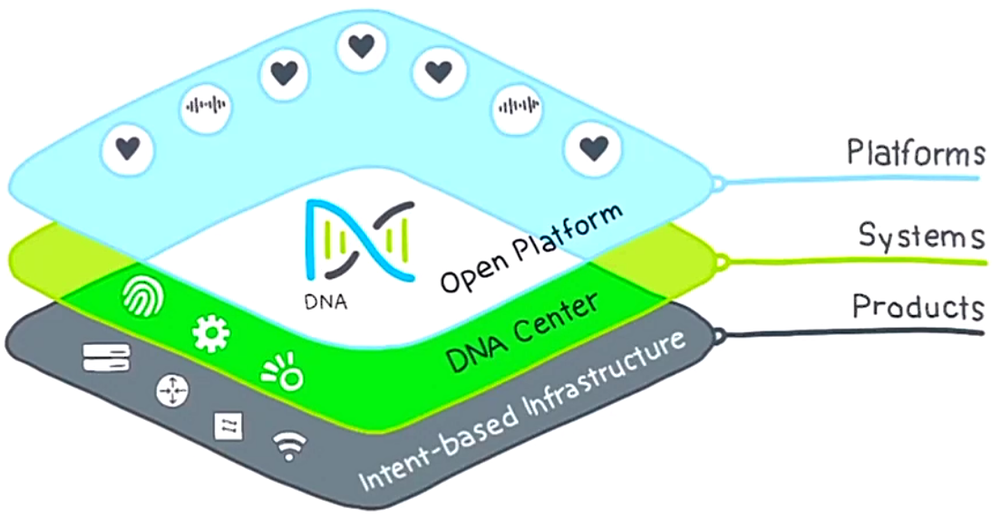
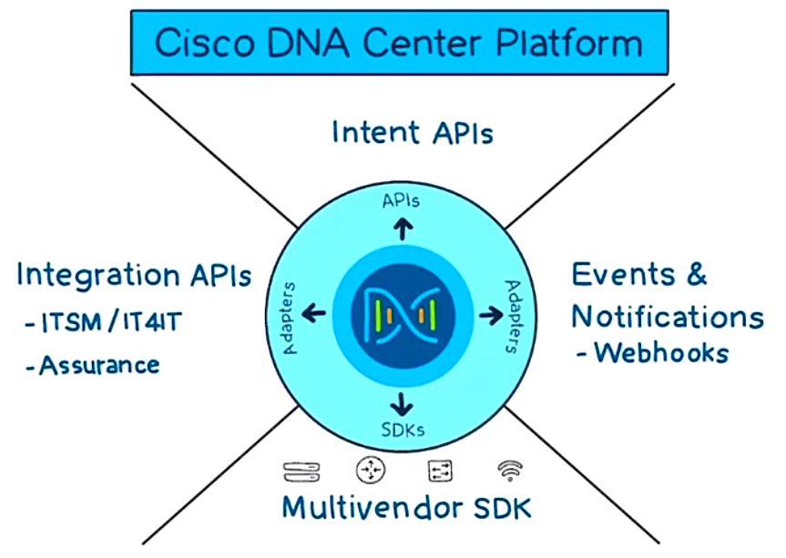
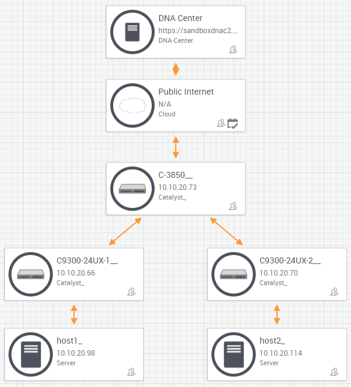
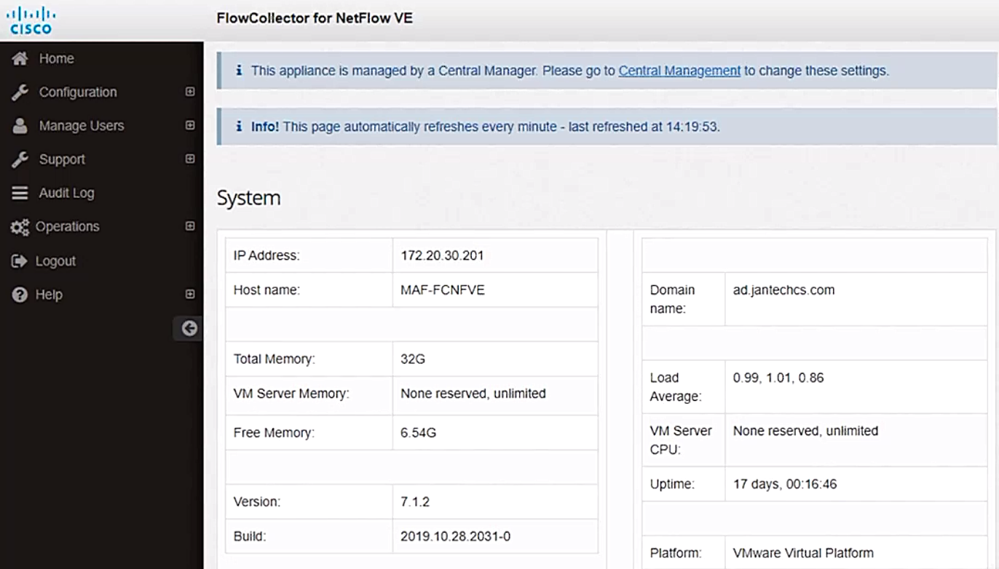
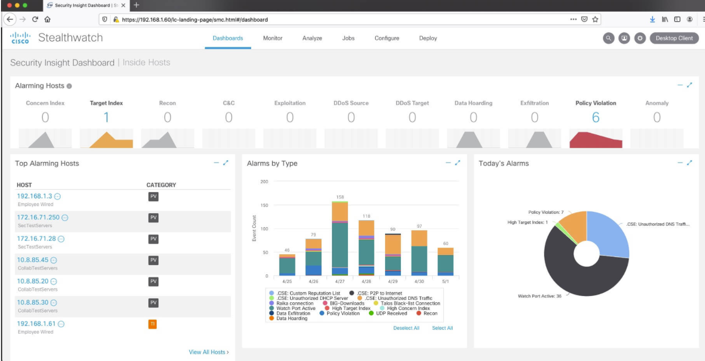
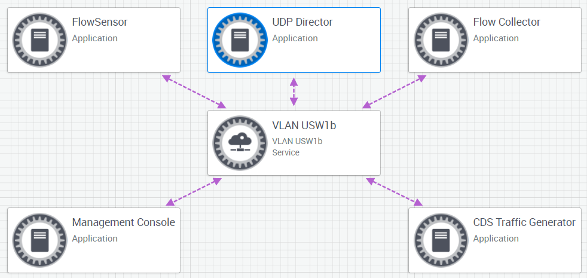
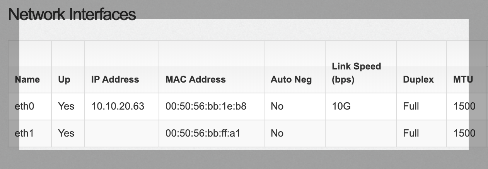
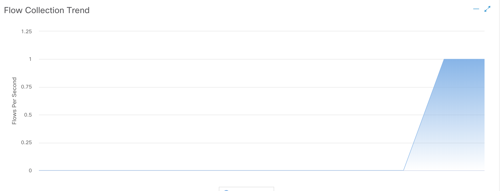
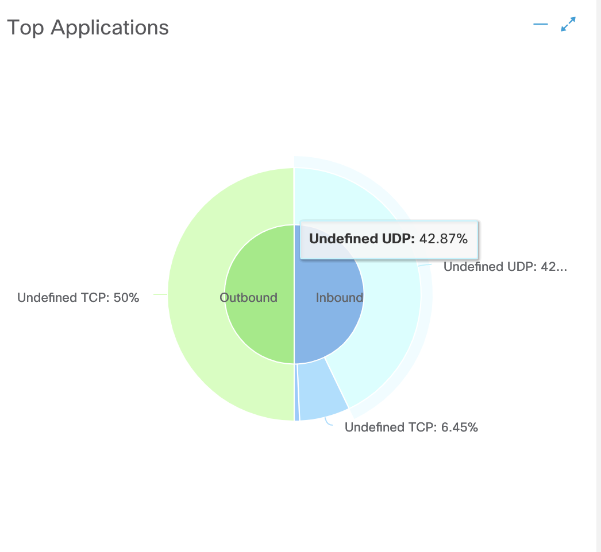
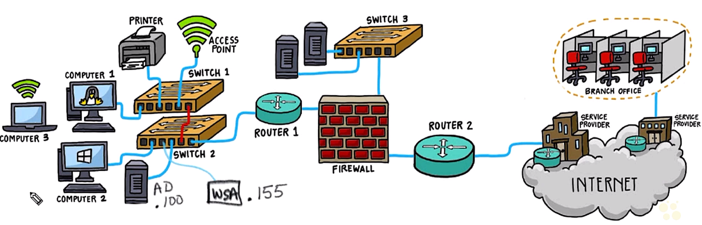

# Security Intelligence


## 12. Security Intelligence


### Introduction to Security Intelligence

- Learn goals
  - security intelligence
  - Talos
  - authoring, sharing and using security intelligence


### Security Intelligence Overview

- Security intelligence
  - Talos: an organization in Cisco who gathers malware info from the Internet
  - features
    - collecting data
    - authorizing
    - sharing
    - using/consuming info
  - appliances using and feedback to Talos
    - Email Security Appliance (ESA): connected to Switches
    - Web Security Appliance (WSA): connected to switches
    - Firewall / IPS: Next Generation Firewall (NGFW) / FirePower
    - Advanced Malware Protection (AMP): all devices
    - ThreatGrid

  <figure style="margin: 0.5em; display: flex; justify-content: center; align-items: center;">
    
  </figure>


### Cisco Talos Overview

- Talos overview
  - [Talos website](https://talosintelligence.com/)
  - homepage legend
    - blue: legitimated email
    - orange: spam
    - green: malware
  - important tabs: Software, Vulnerability Information, Reputation Center, Library, Incident Response
  - Software:
    - Snort: open source intrustion prevention system capable of real-time traffic analysis and packet logging
    - ClamAV: open source antivirus engine for detection trojans, virus, malware, & other malicious threats
    - etc.
  - Vulnerability Information: Vulnerability Reports, Microsoft Advisories
  - Reputation Center: IP & Domain Reputation, Talos File Reputation, Reputation Support, AMP Threat Naming Conventions, AWBO Exercises, Intelligence Categories
  - Library: publications, presentations
  - Incident Response: contract or support agreements


### Talos Vulnerability Information

- Talos vulnerabilities reports
  - tabs: zero-day reports, disclosed vulnerability reports
  - disclosed vulnerability reports: subtabs - report id, title, report date, cve number, cvss score
  - CVSS score:
    - [Common Vulnerability Scoring System Calculator](https://nvd.nist.gov/vuln-metrics/cvss/v3-calculator)
    - Basic score metrics: exploitability metrics, impact metrics
      - exploitability metrics:
        - attack vector (AV): network, adjacent network, local , physical
        - attack complexity (AC): low, high
        - privileges required (PR): none, low, high
        - user interaction (UI): none, required
        - scope (S): unchanged, changed
      - impact metrics
        - confidentiality impact (C): none. low, high
        - integrity impact (I): none. low. high
        - availability impact (A): none, low, high
  - CVE number
    - [Common Vulnerabilities and Exposures](https://cve.mitre.org/): a list of public known cybersecurity vulnerabilities
    - Talos report containing the number 


### Talos Reputation Center

- Talos reputation center
  - IP & Domain reputation
    - 'ihaveabadreputation.com': a website for testing purpose w/ web reputation = untrusted | poor, threat category = malicious sites
    - additional info: ip address, whois, email volume history, top network owners
  - file reputation
    - maintining a reputation disposition on billions of files
    - fed into AMP, FirePower, CalmAV, and open-source Snort
  - intelligence categories
    - subtabs - content categories, threat categories
    - content categories: used by Umbrella, FirePower, other services tied w/ Talos
    - threat categories

      <table id="threat-categories" data-toggle="table" data-search="true" data-pagination="true" data-page-list="[25, 50, 100, ALL]" data-page-size="25" data-mobile-responsive="true">
        <thead style=""><tr><th style="" data-field="category" tabindex="0"><div>
            <span style="font-size: 1.2em;">Category</span>
          </div></th><th style="" data-field="description" tabindex="0"><div>
            <span style="font-size: 1.2em;">Description</span>
          </div></th></tr></thead>
        <tbody><tr data-index="0"><td style="">
          <strong>Malware Sites</strong>
          </td><td style="">
            Websites that are known to contain, serve, or support malware in its delivery, propagation, or in carrying out its malicious intent.
          </td></tr><tr data-index="1"><td style="">
            <strong>Spyware and Adware</strong>
          </td><td style="">
            Sites that are known to contain, serve, or support Spyware and Adware activities.
          </td></tr><tr data-index="2"><td style="">
            <strong>Phishing</strong>
          </td><td style="">
            Phishing and other fraudulent sites that copy or mimic legitimate sites for the purposes of surreptitiously acquiring sensitive information, such as user names, passwords, credit card numbers, etc..., for use in malicious activities.
          </td></tr><tr data-index="3"><td style="">
            <strong>Botnets</strong>
          </td><td style="">
            Known to participate in a Bot network. These include Command and Control (CNC, C2) Servers and sites that deliver or receive data as part of the malicious transaction (bots, zombies).
          </td></tr><tr data-index="4"><td style="">
            <strong>Spam</strong>
          </td><td style="">
            Known to serve, deliver or aide in the propagation of Spam.
          </td></tr><tr data-index="5"><td style="">
            <strong>Exploits</strong>
          </td><td style="">
            Sites that are known to host or aide in exploits, drive-by-downloads and other activities that identifies and compromises vulnerable systems.
          </td></tr><tr data-index="6"><td style="">
            <strong>High Risk Sites and Locations</strong>
          </td><td style="">
            Domains and hostnames that match against the OpenDNS predictive security algorithms from security graph.
          </td></tr><tr data-index="7"><td style="">
            <strong>Bogon</strong>
          </td><td style="">
            Bogons are IP Addresses that are known to belong to reserved IP address spaces that is supposedly unallocated or undelagated.  Sites in this category are bogons that are known to be sending traffic.
          </td></tr><tr data-index="8"><td style="">
            <strong>Ebanking Fraud</strong>
          </td><td style="">
            Known to engage in fraudulent activities that relate to electronic banking.
          </td></tr><tr data-index="9"><td style="">
            <strong>Indicators of Compromise (IOC)</strong>
          </td><td style="">
            Hosts that have been observed to engage in Indicators of Compromise.
          </td></tr><tr data-index="10"><td style="">
            <strong>Domain Generated Algorithm</strong>
          </td><td style="">
            Domains that are extracted from malware that employ algorithms that generate domains for potential use in future malicious activities such as hosting malware or as an exfiltration destination.
          </td></tr><tr data-index="11"><td style="">
            <strong>Open HTTP Proxy</strong>
          </td><td style="">
            Hosts that are known to run Open Web Proxies and offer anonymous web browsing services.
          </td></tr><tr data-index="12"><td style="">
            <strong>Open Mail Relay</strong>
          </td><td style="">
            Commonly used by Spam and Phishing attackers, sites in this category are hosts that are known to offer anonymous email relaying services.
          </td></tr><tr data-index="13"><td style="">
            <strong>TOR exit Nodes</strong>
          </td><td style="">
            Hosts known to offer exit node services for the Tor Anonymizer network.
          </td></tr><tr data-index="14"><td style="">
            <strong>DNS Tunneling</strong>
          </td><td style="">
            Sites that provide DNS Tunneling as a service. These services can be for PC or mobile and create a VPN connection specifically over DNS to send traffic that may bypass corporate policies and inspection.
          </td></tr><tr data-index="15"><td style="">
            <strong>Dynamic DNS</strong>
          </td><td style="">
            Sites that are hosting dynamic DNS services. Attackers can use this technology as an evasion technique against IP blacklisting.
          </td></tr><tr data-index="16"><td style="">
            <strong>Newly Seen Domains</strong>
          </td><td style="">
            Domains that have recently been registered, or not yet seen via telemetry. The behavior of these URLs has not been observed enough to establish the appropriate reputation. Spammers and malicious actors may rely on newly registered, or previously unused domains to disguise their activities, and avoid interdiction due to low reputation. Some legitimate URLs may briefly appear in this threat category as they become visible.
          </td></tr><tr data-index="17"><td style="">
            <strong>Cryptojacking</strong>
          </td><td style="">
            Websites with embedded scripts to mine cryptocurrency which use the visitor's web browser. The script may belong to the owner of the web site, or injected by a malicious third-party, and is used as a method of generating revenue.
          </td></tr><tr data-index="18"><td style="">
            <strong>Linkshare</strong>
          </td><td style="">
            Websites that share copyrighted files without permission. The web site may be compromised, or otherwise involved in illegal file sharing.
          </td></tr><tr data-index="19"><td style="">
            <strong>Malicious Sites</strong>
          </td><td style="">
            Sites exhibiting malicious behavior that do not necessarily fit into another, more granular, threat category.
          </td></tr></tbody>
      </table>


### Security Intelligence Summary

- Summary
  - Talos: collecting data and feed into products
  - VCSS score and calculation
  - VCE number
  - IP & Domain reputation
  - file reputation
  - threat categories


## 13. Explain APIs in the SDN Architecture


### Introducing APIs and SDN

- Learning goals
  - application programming interfaces (APIs)
  - categories of APIs
  - software defined networking (SDN)


### What is an API anyway?

- Application programming interfaces (API) fundamentals
  - web front
    - programming languages: HTML, CSS, JS
    - input fields and buttons for user interaction
    - validating inputs
    - sending data to backend server
  - backend server
    - redirecting receiving data to appropriate teams
    - sending data to DB for recording
  - API: a piece of software communicating btw servers and applications
  - server returning raw data, XML or JSON, fro application's requests
  - applications probably retrieving raw data from DB


- Network automation and software defined networking
  - Cisco platforms w/ some form of API
  - all devices w/ some API on them
  - SDN: making it possible to interact w/ devices directly
  - traditional way:
    - using console cable to enter commands
    - config one at a time $\to$ time consuming
  - controllers of SDN
    - once logged in the controller, entire network able to view at once
    - bale to config to view devices in batch
    - web applications implemented to view and config via the controllers
    - controllers using API to communicating w/ devices
  - network automation
    - simplify the interaction w/ only one device, controller
    - controller collecting info from all other devices

  <figure style="margin: 0.5em; display: flex; justify-content: center; align-items: center;">
    
  </figure>


- API overview
  - types of API
    - Representational State Transfer (REST) as API for HTTPS
    - SNMP, NetFlow, etc.
    - NetConf:
      - one of the most popular network automation API, using SSH/XML
      - RestConf: a variation of NetConf using HTTP/HTTPS
  - JSON: data format to communicate devices and controllers
  - Telemetry: subscript to devices to collect statictics


### The Northbound API

- The Northbound API overview
  - interface btw application and controller
  - business intent
  - centralized configuration changes
  - retrieving summarized data out of controller
  - interacting w/ management plane of the entire network
  - examples: policy deployment, network topology changes


### The Southbound API

- The Southbound API overview
  - interface btw controller and network devices
  - pushing config down to network devices


### The Eastbound API

- The Eastbound API overview
  - interface btw controller and other applications, in particular, notification
  - sending data out of a SDN solution to social media or DB
  - Webhook: push notification/alert system
  - sending notification on events to an API endpoint specified


### The Westbound API

- The Westbound API overview
  - interface btw controller and other systems or services
  - binding network system/service and devices into one solution
  - examples: ISE, AD, IPAM, Netflow, Syslog, etc.


### Summarizing APIs and SDN

- Summary
  - API and SDN
  - Northbound: user interaction
  - Southbound: network devices
  - Eastbound: notification
  - Westbound: integration w/ other systems/services


## 14. DNA Center Foundations


### Introducing DNA Center

- Learning goals
  - DNA center
  - Workflows
  - DNA center API


### What DNA Center Does

- DNA center overview
  - a new SDN solution
  - targeting at large enterprise
  - goal: simplify how to deploy, operate, and optimize a network infrastructure


- DNA software architecture
  - intent-based networking
  - example: group A members not allowed to communicated w/ group B members
  - intent-base infrastructure:
    - wireless access, switch, router, extended nodes
    - these devices capable of deploying business intent
    - running on IOS-XE, in general, Catalyst 9K devices
  - systems
    - DNA center appliance, standalone appliance
    - interacting w/ users
    - redundancy: 3x minimum
    - working closely w/ ISE, an AD like + network devices info
    - able to integrate w/ IPAM solution, IP addressing and services of network devices
  - platforms: APIs
    - assurance: enabling every point on the network to become a sensor, sending continuous streaming telemetry on application performance and user connectivity in real time
    - ML/AI feature to identify suspicious or abnormal issues
    - historical view and search for issues

  <div style="margin: 0.5em; display: flex; justify-content: center; align-items: center; flex-flow: row wrap;">
    <a href="url" ismap target="_blank">
      
    </a>
    <a href="https://bit.ly/3zhdcqH" ismap target="_blank">
      
    </a>
  </div>


### What an SD-Access Fabric Does

- SD-access fabric overview
  - deploying intent, e.g., 
    - Group A users not allowing to access Group B users (bi-directional)
    - Group B permits to access servers in Group C
  - DNA center implements the intent across the entire network
  - the deployment based on SD-access
  - macro-segmentation: separting the whole campus based on the virtual networks
  - micro-segmentation
    - more granuar segmentation within a virtual network
    - multiple groups existed within a virtual network
    - policies existed within a virtual network
    - example: IT VN containing of Domain Admin, HelpDesk, Payroll servers
    - HelpDesk unable to access Payroll servers but Domain Admin able to 


- Example: 3 buildings
  - Bldg A, B, and C having 2 floors
  - Bldg A 1st fl w/ Group A while 2nd fl w/ Group B
  - Group A users accessing network w/ 802.1x via username and password
  - ISE handling the access authentication and passing the permission to DNA center
  - DNA center based on Group A users' privilege and placing them into a virtual network
  - the virtual network fully functional and completely isolated from other networks
  - Group B users accessing the network and placing into different virtual network
  - VRFs used to achieve the purpose
    - similar to VLAN
    - a layer 3 routing technology
    - users in different VRF isolated from each other
  - Group A members able to migrate or roam to any part of campus but still maintaining the same IP address and participating in the same virtual network $\to$ using LISP and VXLAN
  - same for Group B members


- Example: macro-segmentation w/ DNA center
  - Cisco DNA center: tabs - DESIGN, POLICY, PROVISION, ASSURE, PLATFORM
  - POLICY tab > subtabs - Cgroup-Based Access Control, IP Based Access Control, Application, Traffic Copy, Virtual Network
  - Virtual Network subtab: folders - DEFAULT_VN, INFRA_VN, HR+VN, IT_VN, IoT_VN > HR_VN folder 
  - Create or Modify Virtual Network by selecting Available Scalable Group > tabs - Available Scalable Groups (able to sync Group Names form ISE), Groups in the Virtual Networks


- Example: micro-segmentation w/ DNA center
  - Group Based Access Control: Policies, Scalable Groups, Access Groups > Policies
  - Policies: MiniMap - grid cells w/ Source & Destination as vertical and horizontal axes (Groups)
    - icons: Filter, Deploy, Refresh
    - actions: Permit, Deny, Custom, Default
    - hover anc click on a cell > Change Contract
    - Create Policy: Policy Status = Enabled; Contract = Change Contract > 'Change Contract' link
    - Change Contract: fields - Name, Description, Policies Referencing > click on the selected entry, e.g., Deny IP, Deny_IP_log, Permit IP, Permit_IP_log, AllowWeb, AllowDHCPDNS, DenyRemoteService


### The Four Workflows of DNA Center

- Workflows of DNA center
  - Design: geography about IP address space, DHCP server, DNA server, devices, IOS images and versions
  - Policy: virtual networks, ACLs
  - Provision: LAN automation, fabric overlay
  - Assurance: operating and optimizing the network by monitoring and troubleshooting


- Cisco Trust Set (CTS)
  - devices provisioned by
  - devices used to implement policies
  - devices able to learn about group users allowed and who able to communicate to
  - realizing macro-segmentation and micro-segmentation
  - fabric overlay devices communicating w/ ISE to implement CTS


- Example: deign workflow in DNA Center
  - DESIGN tab: subtabs - Network Hierarchy, Network Settings, Image Repository, Network Profiles, Authentication Template
  - Network Hierarchy subtab: folders - Global - Illinois, Louisiana - New Orieans ( Nola Main - Main Floor 1, Nola Satellite - Satellite Floor 1)
  - New Orieans > Network Setting subtab: tabs - Network, Device Credentials, IP Address Pool, SP Profiles, Wireless
    - Network tab: AAA Server, DHCP Server, DNS Server, SYSLOG Server, SNMP Server, NTP Server, Time Zone, Message of the day
    - Device Credentials tab: CLI Credentials, SNMP Credentials, HTTP(S) Credentials
    - IP Address Pools tab: fields - Name, Type, IPv4 Subnet, IPv6 Subnet, Inherited from, Actions

- Example: features of POLICY tab in DNA Center
  - Virtual Network: Macro-segmentation
  - Group-Based Access Control: Micro-segmentation
  - IP Based Access Control: classical traffic control
  - Application: define QoS
  - Traffic Copy:
    - packet capturing or Wiresharking
    - used to define business intent and build policy
    - largely from ISE


- Example: features of PROVISION tab in DNA Center
  - subtabs - Devices, Fabric, Services
  - Devices subtab: folders based on geography > fields - Device Name, IP Address, Support Type, Device Family, Site
    - able to discover entire network by assigning a seed node
    - discovering entire network via CDP or LLDP one by one
    - LAN automation: discovering devices w/ factory default state and assigning IP addresses and create connectivity
  - Fabric subtab > SD-Acccess Fabrics and Transit/Peer Networks
    - info DNA center which virtual network w/ the site
    - users login able to communicate w/ ISE and assign virtual network w/ correct CTS policies


- Example: features of ASSURANCE tab in DNA Center
  - subtabs - Dashboards, Trends And Insights, Manage
  - Dashboards subtabs > sections w/ charts - network Devices, Wired Clients, Wireless Clients, Top 10 Issue Types
  - diagnose issues: deep investigation w/ license to identify business-critical applications


### The DNA Center Platform APIs

- APIs of DNA Center
  - PLATFORM tab: subtabs - Overview, Manage, Developer Toolkit, Runtime Dashboard
  - Developer Toolkit subtab: tooltabs - APIs, Integration Flows, Data and Reports, Multivendor Support, Events
  - APIs tooltabs: folders - Authentication (Know Your Network, Site Management, Connectivity, Operational Tasks, Policy), Event Management
    - Know Your Network subfolder: inventory and how they behaving
    - Site Management subfolder: Design workflow
    - Connectivity subfolder: Assurance workflow
    - Operational Tasks subfolder: fabric provisioning
    - Policy subfolder: view and implement policies
  - HTTP RESTful API
    - `GET`: get request to retrieve info
    - `POST`: post request to create new data

  <figure style="margin: 0.5em; display: flex; justify-content: center; align-items: center;">
    
  </figure>


- Lab: DNA Center Sandbox in DevNet
  - [DevNet sandbox](https://devnetsandbox.cisco.com/RM/Topology) for demo and practice
  - SANDBOX LAB: [Cisco DNA Center AO 1.3.1.4](https://bit.ly/3FGSQcF)
  - Instruction

    <span style="text-decordation: underline; font-weight: bold;">Overview</span>
    
    Cisco Digital Network Architecture (DNA) Center is a centralized management application for the network. Cisco DNA Center provides a single pane of management to design, provision, enable policy, and assure network services with full visibility of user and device identity, operating systems and applications across the entire network fabric. Cisco DNA Center allows you to manage the enterprise network over a centralized dashboard and deploy networks in minutes, not days, using intuitive work flows.The Cisco DNA Center Sandbox provides the developer the ability to design, develop and test utilizing the Cisco DNA Center development platform with a sample Sandbox Lab Topology.
    
    <span style="text-decordation: underline; font-weight: bold;">In this sandbox the developer can</span>

    The Cisco DNA Center Sandbox consists of a virtualized Controller and real Hardware sample network topology containg network elements and hosts that developers can utilize so they can develop, debug and test their sample Cisco DNA Center application.

    - Develop/test Cisco DNA Center type applications with the Cisco DNA Center.
    - Interact with the Cisco DNA Center API calls using a variety of REST clients such as POSTMAN

    <span style="text-decordation: underline; font-weight: bold;">Sandbox Access</span>

    The Cisco DNA Center Sandbox is designed to be accessed via the internet. VPN is not required or provided to connect to the Cisco DNA Center Appliance and sample network. The developer does not have any direct access to the sample network elements and hosts.

    To access the shared environment and integrate with the sample database, please follow these steps:
    1. Go to https://sandboxdnac2.cisco.com
    1. Accept the self-signed certificate
    1. Allow for showing of Browser Notifications
    1. Login with credentials **[devnetuser/Cisco123!]**

    <span style="text-decordation: underline; font-weight: bold;">Learn More</span>

    [Cisco DNA Center on DevNet](https://developer.cisco.com/site/dna-center/)

  <figure style="margin: 0.5em; display: flex; justify-content: center; align-items: center;">
    
  </figure>


### Summarizing DNA Center

- Summary
  - micro-segmentation and macro-segmentation
  - assurance platforms:
    - identify threats or alerts and any anomaly in the network
    - enable to troubleshoot the issues immediately
  - integrates w/ ISE and IPAM


## 15. Interpret Basic Python Scripts used with Cisco Security


### Introducing Basic Python Security Scripts

- Learning goals
  - Python scripts
  - impact on Cisco security platform
  - authentication w/ Python scripts
  - monitoring w/ Python scrippts


### Extending Python and Setting Variables

- Python fundamentals
  - task: get a list of FirePower management center apps
  - import libraries
    - `json`: working w/ JSON data format
    - `sys`: working w/ actual operating system
    - `requests`: perform HTTP requests w/ REST API
  - other important libraries for 
    - `ncclient`: working w/ Netconf protocol
    - `lxml`: workign w/ XML data
    - `openpyxl`: working w/ excel file
    - `selenium`: emulate web browser
  - global variables
    - `url`: base URL of DevNet Sandbox
    - `login_url`: generated token for FirePower authentication
    - `headers`: specify what kind of data to request and post
    - `user` & `pw`: username and password, insecure way

  ```python
  import sys
  import json
  import requests

  # Set up global variables
  url = "https://fmcrestapisandbox.cisco.com"
  login_url = "/api/fmc_platform/v1/auth/generatetoken"
  headers = {"Content-Type": "application/json"}

  user = "knox"
  pw = "BtNdJM9k"
  ```


### Getting Authenticated

- Retrieving token from FirePower Sandbox in DevNet
  - task: login to web to get token
  - FirePower mgmt center sending back a token if login successfully
  - web browser using the token to work on proceeding activities
  - try-except block to handle error, same as try/catch block in other languages
  - HTTP methods
    - `requests.post`:
      - submit a request w/ data
      - `auth=(user, pw)`: authenticating `user` w/ the password `pw`
      - `verify=False`: not using self-signed certificate for authentication
    - `requests.get`: retrieve HTML doc
  - obtain token from response headers:
    - extract headers from response:`resp_headers = login_response.headers`
    - get token from header: `token = resp_headers.get("X-auth-access-token", default=None)`
    - not token existed $\to$ exit the program
  - add retrieved token into own headers: `headers["X-auth-access-token"] = token`


  ```python
  try:
      # POST the login ans password to the login endpoint
      login_response = requests.post(f"{url}{login_url}", auth=(user, pw), verify=False)

      # Parse out the headers
      resp_headers = login_response.headers

      # Grab the token from the response headers
      token = resp_headers.get("X-auth-access-token", default=None)
      if token == None:
          print("Failed to get a token. Try again")
          sys.exit()

      # Set the token in the headers to be used in the next call
      headers["X-auth-access-token"] = token
  except Exception as err:
      print(f"error raised! {err}")
  ```


### Getting Monitored Applications

- Retrieving monitoring data from FirePower in DevNet Sandbox
  - utilizing the token retrieved from login
  - `e276abec-e0f2-11e3-8169-6d9ed49b625f`: get from the FirePower Management Center doc
  - `requests.get`: retrieve data from specified apps
    - `headers=headers`: using token within headers for authentication
    - `.json()`: parsing return data into JSON format
  - JSON just a formated text string
  - print JSON in formated output: `print(json.dumps(apps_response, indent=2, sort_keys=True))`

  ```python

  # Get monitored apps
  apps_url = (
      "/api/fmc_config/v1/domain/e276abec-e0f2-11e3-8169-6d9ed49b625f/object/applications"
  )

  try:
      apps_response = requests.get(
          f"{url}{apps_url}", headers=headers, verify=False
      ).json()

      print(json.dumps(apps_response, indent=2, sort_keys=True))
  except Exception as err:
      print(f"error raised! {err}")
  finally:
      if apps_response:
          apps_response.close()
  ```


### Summarizing Interpreting Python Scripts

- Summary
  - Python fundamental
  - retrieve token from login return headers
  - assign token for following activities
  - [original code](https://bit.ly/3pL8duZ)
  - [local Python copy](src/)


## 16. Troubleshoot NetFlow


### Introduction to Troubleshooting NetFlow

- Learning goals
  - NetFlow tool
  - how NetFlow works
  - implementation of NetFlow
  - NetFlow version 5, 9 and 10
  - data analysis


### NetFlow Overview

- NetFlow overview
  - 3 basic steps for NetFlow working
    - 1\. training devices to collect flow records
    - 2\. export data to a collector (storage point) periodically
    - 3\. analyze collected flow records

  <figure style="margin: 0.5em; display: flex; justify-content: center; align-items: center;">
    
  </figure>

- Example: Training the devices to collect data
  - focus on traffic on g0/1
  - not capturing packets but the characteristics and statistics of traffic
  - traffic from subnet (10.1.70.0/24) to subnet 192.168.1.0/24 via R7 $\to$ R5 $\to$ R3 $\to$ R1 $\to$ R2 $\to$ R4 $\to$ R6 $\to$ R8, vice versa


### Flavors of NetFlow

- Versions of NetFlow
  - version 1 not used any more
  - major ones: v5 & v9
  - version 5
    - a simple one
    - device collecting data by specifying
      - the collector id
      - traffic types, e.g. UDP port 7683
    - analyzer analyzeing the collected flow records and generate reports
  - version 9
    - very flexible, a.k.a flexible NetFlow
    - modularized w/ flow records
    - flow record: an object carrying the actual information about the network traffic which is then used by your NetFlow analyzer tool to generate bandwidth and traffic reports
    - monitor:
      - an object specifying what record to be used to collect data
      - applied to an interface to collect data (inbound/outbound)
    - exporter: an object specifying where the record to deliver, either collector id or IP address
  - IPFIX:
    - stand for 'IP Flow Information eXport'
    - an IETF standard
    - spawn from NetFlow v9 and backward compatible with v9 traffic
    - a.k.a. NetFlow v10
 


### NetFlow v5

- Implementing NetFlow v5
  - traffic flow path: subnet 10.1.7.0/24 $\leftrightarrow$ R7 $\leftrightarrow$ R5 $\leftrightarrow$ R3 $\leftrightarrow$ R1 $\leftrightarrow$ R2 $\leftrightarrow$ R4 $\leftrightarrow$ R6 $\leftrightarrow$ R8 $\leftrightarrow$ subnet 192.168.1.0/24
  - observe inbound and outbound traffic on R1 g/0
  - expotor: IP addr = 1.2.3.4/32, traffic type = UDP:6783

  ```bash
  R1# show ip int brief
  Interface           IP-Address  OK? Method  Status                Protocol
  Ethernet0/0         unassigned  YES NVRAM   administratively down down
  GigabitEthernet0/0  10.0.1.1    YES NVRAM   up                    up
  GigabitEthernet0/1  10.0.12.1   YES NVRAM   up                    up
  GigabitEthernet0/2  10.0.13.1   YES NVRAM   up                    up
  ...
  Loopback0           1.1.1.1     YES NVRAM   up                    up

  R1# conf t
  R1(config)# int g1/0
  R1(config-if)# ip flow ingress
  R1(config-if)# ip flow egress
  R1(config-if)# exit
  R1(config)# ip flow-export destination 1.2.3.4 6783
  R1(config)# ip flow-export source loopback 0
  R1(config)# ip flow-export version 5
  R1(config)# end

  R1# show ip cache flow
  IP packet size distribution (0 total packets):
      1-32   64   96  128  160  192  224  256  288  320  352  384  416  448  480
      .000 .000 .000 .000 .000 .000 .000 .000 .000 .000 .000 .000 .000 .000 .000

       512  544  576 1024 1536 2048 2560 3072 3584 4096 4608
      .000 .000 .000 .000 .000 .000 .000 .000 .000 .000 .000

  IP Flow Switching Cache, 4456704 bytes
    0 active, 65536 inactive, 0 added
    0 ager polls, 0 flow alloc failures
    Active flows timeout in 30 minutes
    Inactive flows timeout in 15 seconds
  IP Sub Flow Cache, 533256 bytes
    0 active, 16384 inactive, 0 added, 0 added to flow
    0 alloc failures, 0 force free
    1 chunk, 1 chunk added
    last clearing of statistics never
  Protocols   Total   Flows   Packets Bytes   Packets Active (Sec)  Idle (Sec)
  ---------   Flows    /Sec     /Secc  /Pkt      /Sec     /Flow       /Flow

  SrcIf     SrcIPaddress    DstIf     DstIPaddress    Pr  SrcP  DstP  Pkts
  ```

  ```bash
  ! generate traffic
  R8# show ip int brief
  Interface           IP-Address  OK? Method  Status                Protocol
  Ethernet0/0         unassigned  YES NVRAM   administratively down down
  GigabitEthernet0/0  192.168.1.8 YES NVRAM   up                    up
  GigabitEthernet0/1  unassigned  YES NVRAM   administratively down down
  GigabitEthernet0/2  unassigned  YES NVRAM   administratively down down
  Serials3/0          unassigned  YES NVRAM   administratively down down
  Serials3/1          10.38.0.8   YES NVRAM   up                    up
  Serials3/2          10.78.0.8   YES NVRAM   up                    up
  Serials3/3          unassigned  YES NVRAM   administratively down down
  FastEthernet4/0     unassigned  YES NVRAM   administratively down down
  FastEthernet4/0     10.2.68.8   YES NVRAM   up                    up
  Loopback0           8.8.8.8     YES NVRAM   up                    up

  R7# telnet 10.2.68.8
  Trying 10.2.68.8 ... Open

  R8# show run

  R1# show ip cache flow
  IP packet size distribution (0 total packets):
      1-32   64   96  128  160  192  224  256  288  320  352  384  416  448  480
      .000 .880 .021 .010 .000 .000 .021 .000 .000 .010 .000 .000 .000 .021 .000

       512  544  576 1024 1536 2048 2560 3072 3584 4096 4608
      .021 .000 .000 .000 .000 .000 .000 .000 .000 .000 .000

  IP Flow Switching Cache, 4456704 bytes
    2 active, 65534 inactive, 2 added
    32 ager polls, 0 flow alloc failures
    Active flows timeout in 30 minutes
    Inactive flows timeout in 15 seconds
  IP Sub Flow Cache, 533256 bytes
    2 active, 16382 inactive, 2 added, 2 added to flow
    0 alloc failures, 0 force free
    1 chunk, 1 chunk added
    last clearing of statistics never
  Protocols   Total   Flows   Packets Bytes   Packets Active (Sec)  Idle (Sec)
  ---------   Flows    /Sec     /Secc  /Pkt      /Sec     /Flow       /Flow

  SrcIf     SrcIPaddress    DstIf     DstIPaddress    Pr  SrcP  DstP  Pkts 
  Gi1/0     10.2.68.8       Gi2/0     10.1.57.7       06  0017  79D3    46

  SrcIf     SrcIPaddress    DstIf     DstIPaddress    Pr  SrcP  DstP  Pkts 
  Gi2/0     10.1.57.7       Gi1/0     10.2.68.8       06  79D3  0017    46
  ```


### Flexible NetFlow

- Troubleshooting Flexible NetFlow
  - based on a live gear: TJ-LSV-RTR-A = RA
  - two flow monitors configured on RA g0/3
  - `SW-MON` flow monitor applied to int g0/3
    - `SW-EXPORTER` as the expoter of the flow monitor
    - `SW_RECORD` as the flow record that what traffic info will be collected
  - `flow exporter SW-EXPOTER` section specifying what to collect and other settings
    - traffic to collect: UDP:2055
    - collector IP addr: 172.20.30.201
    - protocol to export: IPFIX
  - `flow record SW_RECORD` specify what to pay attention and what to collect

  ```bash
  RA# show run int g0/3
  !
  interface GigabitEthernet0/3
   description Core: Core.TJ-LSV-RTR-A GigabitEthernet0/3
   ip vrf forwarding Cox
   ip address 172.16.6.1 255.255.255.0
   no ip redirects
   no ip unreachables
   no ip proxy-arp
   ip flow monitor FEMonitor input
   ip flow monitor SW-MON input
   ip nat inside
   ip virtual-assembly in
   load-interval 30
   duplex auto
   speed auto
   service-policy input prm-KARKING_IN
   service-policy outout prm-dscp#QUEUING_OUT
  end

  RA# show run | sec flow monitor
  flow monitor EFMonitor
   exporter EFExport
   record EFRecord
  flow monitor
   export SW-EXPORTER
   cache timeout active 80
   record SW_RECORD
   ip flow monitor SW_MON input
   ip flow monitor EFMonitor input
   ...
  ```

  ```bash
  R1# show run | sec flow export
  flow expoter EFExport
   destination 172.20.30.155 vrf Internal
   source Loopback1
   transport udp 2055
   template data timeout 60
   option application-table timeout 60
  flow exporter SW-EXPOTER
   description Export NetFlow to SW FC
   destination 172.20.30.201 vrf Internal
   source Loopback1
   transport udp 2055
   export-protocol ipfix
   template data timeout 30
   option application-table timeout 10
  
  R1# show ru | sec flow record
  ...
  flow record SW_RECORD
   description NetFlow record format to send to SW
   match ipv4 tos
   match ipv4 protocol
   match ipv4 source address
   match ipv4 destination address
   match transport source-port
   match transport destination-port
   match interface input
   match flow direction
   match flow cts source group-tag
   match flow cts destination group-tag
   collect routing source as
   collect routing destination as
   collect routing nex-hop address as
   collect ipv4 dscp
   collect ipv4 id
   collect ipv4 source prefix
   collect ipv4 source mask
   collect ipv4 destination mask
   collect ipv4 ttl minimum
   collect ipv4 ttl maximum
   collect transport tcp flags
   collect counter bytes
   collect counter packets
   collect timestamp sys-uptime first
   collect timestamp sys-uptime last
   collect application name
   collect application http url
   collect application http host
  ```


### NetFlow Collectors and Analyzers

- Collecting and analyzing record w/ StealthWatch
  - Flow Collector: FlowCollector for NetFlow VE
    - available either a physical or a virtual appliance
    - Flow Collector VE performing the same functions as its physical counterpart but in a VMWare environment
  - NetFlow analyzer: Cisco StealthWatch
    - analyzing collected data to make the data useful
    - StealthWatch Dashboard > Analyze tab > Flow Search: allowing to drill down the data for a particular issue

  <div style="margin: 0.5em; display: flex; justify-content: center; align-items: center; flex-flow: row wrap;">
    <a href="url" ismap target="_blank">
      
    </a>
    <a href="url" ismap target="_blank">
      
    </a>
  </div>

### Troubleshoot NetFlow

- Lab: Cisco StealthWatch in DevNet
  - [Sandbox of StealthWatch](https://bit.ly/3mSrAjU)
  - instructions: overview

    <span style="font-weight: bold; text_decoration: underline;">Overview:</span>

    Cisco Stealthwatch is the most comprehensive visibility and network traffic security analytics solution that uses enterprise telemetry from the existing network infrastructure. It provides advanced threat detection, accelerated threat response, and simplified network segmentation using multilayer machine learning and entity modeling. With advanced behavioral analytics, you will always know who is on your network and what they are doing.

    This Sandbox contains a Stealthwatch Enterprise Environment for developer API testing. The CDS traffic generator populates the SMC with usable data for reporting and API calls. Traffic is started by users at the beginning of an actve reservation. Also, a number of postman collections are available on GIT to download and play with, against this environment.

    This sandbox contains the following:
    - StealthWatch Management Center
    - Flow Collector
    - Flow Sensor
    - UDP Director
    - CDS Traffic Generator

    <span style="font-weight: bold; text_decoration: underline;">Server Access Credentials</span>

    - SMC - admin/C1sco12345
    - Flow Collector (10.10.20.61) - admin/C1sco12345
    - Flow Sensor(10.10.20.62) - admin/C1sco12345
    - UDP Director (10.10.20.63) - admin/C1sco12345
    - CDS (10.10.20.64) - root/lan1cope

    NOTE: root access for the above servers is also enabled. Password is the same

    <span style="font-weight: bold; text_decoration: underline;">More information:</span>
    - [Stealthwatch on Cisco DevNet](https://developer.cisco.com/stealthwatch/)
    - [Stealthwatch APIs](https://developer.cisco.com/docs/stealthwatch/#!why-use-these-apis/why-use-these-apis)
    - [Postman Collection - Enterprise](https://developer.cisco.com/codeexchange/github/repo/CiscoDevNet/stealthwatch-enterprise-sample-postman)

    <span style="font-weight: bold; text_decoration: underline;">Additional Information:</span>
    - [Sandbox Support](https://communities.cisco.com/community/developer/sandbox)

    <span style="font-weight: bold; text_decoration: underline;">Network Topology</span>

    <figure style="margin: 0.5em; display: flex; justify-content: center; align-items: center;">
      
    </figure>

  - instruction: start traffic

    <span style="font-weight: bold; text_decoration: underline;">Starting CDS Traffic Flow</span>

    Once a reservation has setup and reached "Active" state, users can start the CDS traffic flow towards the UDP director. This is then picked up and displayed my th e Stealthwatch Management Center monitoring.

    This sandbox contains the following:
    - Once the Sandbox reservation has become Active connect to the VPN as instructed in the output window or the email
    - Browser to the [UPD Director](https://10.10.20.63/) and login with admin/C1sco12345
    - Scroll down on the main page to the interfaces. Note the MAC address of the Eth0 interface.

    <figure style="margin: 0.5em; display: flex; justify-content: center; align-items: center;">
      
    </figure>

    - We now need to start the traffic from the CDS Traffic generator. Ssh root@10.10.20.64 (password is lan1cope)
    - Once connected, the firstrun script will trigger
    - Hit n to the configuration XML question
    - Accept the default hostname for the box
    - Set domain to lab.devnetsandbox.local
    - IP address of DNS server is 10.17.248.11
    - IP address of NTP server is 10.17.251.250
    - The MAC address for the UDP director is then requested. Enter the MAC from step 3 above in xx:xx:xx:xx:xx:xx notation
    - The IP address of UDP Director should be set to 10.10.20.63
    - The IP address of Flow Sensor should be set to 10.10.20.62
    - The IP address of the Flow Collector should be set to 10.10.20.61
    - Enter y to accept the setting. A script will run to rewrite the .pcap files, taking just a moment.
    - Browse to [Stealthwatch Management Center GUI](https://10.10.20.60/) and check the flows on the main page. It may take 10 minutes or so to register the traffic flow

    <div style="margin: 0.5em; display: flex; justify-content: center; align-items: center; flex-flow: row wrap;">
      <a href="https://bit.ly/3mSrAjU" ismap target="_blank">
        
        
      </a>
    </div>

  - instruction: API info

    <span style="font-weight: bold; text_decoration: underline;">REST API Overview</span>

    Sandbox provides a simple StealthWatch environment within which, users can experiment, play and develop with the Stealthwatch REST API.

    The Stealthwatch System REST APIs consists of a collection of resources for developers, administrators, or partners that enable the functionality of Stealthwatch to be accessed programmatically. Since Stealthwatch REST APIs are based on open standards, you can use any programming or scripting language you wish as long as it supports HTTP.

    DevNet has an abundance of API documentation, code samples, tools and postman collections for StealthWatch. These are linked below to help you get started.

    - [Stealthwatch Enterprise Sample Scripts](https://developer.cisco.com/codeexchange/github/repo/CiscoDevNet/stealthwatch-enterprise-sample-scripts)
    - [Stealthwatch CSV Tools](https://developer.cisco.com/codeexchange/github/repo/CiscoDevNet/stealthwatch-enterprise-csv-tools)
    - [Postman Collection - Enterprise](https://developer.cisco.com/codeexchange/github/repo/CiscoDevNet/stealthwatch-enterprise-sample-postman)

    When you have downloaded and imported the postman collections, it's important to set the environment variables to that of the Stealthwatch Sandbox:

    - STEALTHWATCH-SMC = 10.10.20.60
    - username = admin
    - password = C1sco12345

  - instruction: VON Access

    <span style="font-weight: bold; text_decoration: underline;">Software VPN Access to this Lab:</span>

    This tab will explain everything you need to know about how to establish a secure software VPN connection to this lab.  A [VPN connection](http://en.wikipedia.org/wiki/Virtual_private_network) is required for you to interact with the systems and devices in this Lab.  You'll also need to have an active reservation for this Lab.

    <span style="font-weight: bold; text_decoration: underline;">Stuff You Can (and Should) Do Prior to Your Reservation:</span>

    In order to establish a software VPN connection to this Lab, you must download and install Cisco's AnyConnect VPN Client software on any system you plan to use to connect to your Lab.  (And it's ok if you don't do  this until after your reservation has started.  It's all good!)  Here's how you download and install AnyConnect:
    - [Download the Cisco AnyConnect VPN Client software.](https://developer.cisco.com/site/devnet/sandbox/anyconnect/)
    - [Installation Guide for Cisco AnyConnect VPN Client software.](https://devnetsandbox.cisco.com/Docs/VPN_Access/AnyConnect_Installation_Guide.pdf)

    <span style="font-weight: bold; text_decoration: underline;">Emails You'll Receive:</span>

    When your Lab reservation begins, you will receive several emails communicating important information about the status of your Lab.
    1. The first email is sent to you from the Lab provisioning automation engine, and indicates that resources in your Lab are in the process of being provisioned and tested.  Your Lab is NOT READY yet, but this email will give an estimate of when your Lab will be available.
    2. The second email will be sent to you when your Lab is fully provisioned, tested and READY for you to connect.  In this email you'll find the  information required by AnyConnect to establish a VPN connection to your Lab (Network IP Address, VPN Username, VPN Password).

    <span style="font-weight: bold; text_decoration: underline;">Connecting to Your Lab:</span>

    Once you receive the email that says your Lab is ready, you can begin the VPN connection process.  Here's how you establish a VPN connection to your Lab.
    - [AnyConnect VPN Connection Guide.](https://devnetsandbox.cisco.com/Docs/VPN_Access/AnyConnect_Connection_Guide.pdf)


## 17. The Components of Network Security Design


### Intro to components of Network Security Design

- Learning goals
  - concept of network security design
  - components of network security design
  - network access control
  - end point security
  - firewalls and IPS
  - TrustSec and MACsec


### Network Access Control

- Network access control fundamentals
  - one of the most popular solution via 802.1x protocol
  - components
    - supplicant: client 
    - authenticator: switch or WLC
    - authentication server: AAA server
  - supplicant software in client trying to access network w/ username and password
  - switch / WLC authenticating locally $\to$ not scalable
  - solution: centralized management - AAA server, i.e., RADIUS server
  - Cisco solution: Identity Service Engine (ISE)
    - tabs - MONITOR, WLANs, CONTROLLER, WIRELESS, SECURITY, MANAGEMENT, COMMANDS
    - SECURITY tab > folders - AAA, Local EAp, Advanced EAp, Priority Order, Certificate, Access Control Lists, Wireless Protection Policies, Web Auth, TrustSec SXP, Local Policies, Advanced
  - 802.1x applied for wired and wireless connections

  <figure style="margin: 0.5em; display: flex; justify-content: center; align-items: center;">
    
  </figure>


- Demo: wired access control w/ ISE
  - SECURITY tab > AAA > RADIUS > Authentication > RADIUS Authentication Servers: fields - Network User, Management, Tunnel Proxy, Server Index, Server Address (Ipv4/Ipv6), Port, IPsec, Admin Status
    - entry: Server Addresses = 172.16.30.225
    - entry: Server Addresses = 172.16.30.225
  - WLANs tab > folder - WLANs, Advanced > WLANs: fields - WLAN ID, Type, Profile Name, WLAN, WLAN SSID, Admin Status, Security Policies > entry - WLAN ID = 1, Type = WLAN, Profile Name = AG-MAF-AP, Security Policies = [WAP2][Auth(802.1x)] > '1' link
  - WLANs > Edit 'AG-MAF-AP' > tabs: General, Security, QoS, Policy-Mapping, Advanced
    - General: Profile Name = AG-MAF-AP, Security Policies = [WAp2][Auth(802.1x)]
    - Security: tabs - Layer 2, Layer 3, AAA Server
      - Layer 2 Security = WPA + WPA2, MAC Filtering = Off, Fast Transition = Off; PMF (Protected Management Frame) = Disable; WPA + WPA2 pParemeters - WPA2 Policies = On, WPA2 Encryption = AES, TKIP; Authentication Key Management - 802.1x = Enable
      - AAA Servers: Authentication Servers = Enabled, 'IP:172.16.30.225, Port:1812', 'IP:172.16.30.226, Port:1812'; Accounting Servers = Enable, 'IP:172.16.30.225, Port:1813', 'IP:172.16.30.226, Port:1813'
  - POLICY tab > folders - Authentication, Authorization, Profiling, Posture, Client Provisioning > Authentication > Allowed Protocols
  - Allowed Protocols Services List > Deafult Network Access: Name = Default Network Access, Allowed Protocols - Process Host Lookup = On; Allow PAP/ASCII = On; Allow EAP-MD5 = On; Allow EAP-TLS = on; Allow PEAP = On -> PEAP Inner Method: Allow EAP-MS-CHAP2v2 = On, Allow EAP-TC = On, Allow EAP-TLS = On; Allow EAP-FAST = On -> EAP-FAST Inner Methods: Allow EAP-MS-CHAPv2 = On, ...


- MAC Authentication Bypass (MAB)
  - devices unable to interact w/ authenticator, e.g., printer
  - hard coded the MAC address of the system to access the network


- Web Authentication (Web Auth)
  - redirecting non-registered user to a web page
  - web page providing the opportunity to provide username and password dor login


### End Point Security

- Securing end points
  - minimum privilege principle
  - Advanced Malware Protection (AMP):
    - keeping the endpoint safe
    - a piece of software on endpoint devices
    - a system to track malware
  - AMP integrating w/ cloud intelligence, web security firewalls, email security firewalls, etc.


### Next Generation Firewalls and IPS

- Next generation firewalls (NGFW)
  - more advanced than stateful filtering
  - stateful filtering: firewall recording the state of outgoing traffic and used it to judge the incoming traffic
  - NGFW able to inspect the payload to find the confidential info within
  - capability
    - deep inspection
    - content analysis
    - decision making
    - cloud intelligence, such as reputation, IP addresses
    - intrusion prevention


### TrustSec and MACsec

- TrustSec overview
  - protecting traffic in motion
  - TrustSec compliant and capable devices following the ACL defined btw groups
  - ISE > tabs - Home, Context Visibility, Operations, Policy, Administration, Work Centers
  - Work Center tab > subtabs - Network Access, Guest Access, TrustSec, BYOD, Profiler, Posture, Device Management, PassiveID
  - TrustSec subtab > subtabs - Overview, Components, TrustSec Policy, Policy Set, SXP, Troubleshoot, Reports, Settings
  - Components subtabs > folders - Security Groups, IP SGT Static Mapping, Security Group ACLs, Network Devices, TrustSec AAA Servers > Security Groups
  - Security Groups: fields - Icon, Name, SGT (Dec/Hex), Description, Learned from; icons - Edit, Add, Import, Export, Trash, Push, Verify Deploy
  - SGT = Security Group Tag
  - Security Group ACLs subtab
    - create to deny or permit certain type of traffic
    - specify what to do btw these groups
  - TrustSec Policy subtab > folder - Egress Policy (Matrices List, Matrix, Source Tree, Destination Type), Network Device Authorization > Matrix - a grid table w/ groups in vertical and horizontal axes > each cell applying an ACL to permit or deny the traffic


- MACsec overview
  - encrypting traffic btw end node and switches
  - downlink MACsec: traffic btw end node and switch
  - uplink MACsec: traffic btw switches


