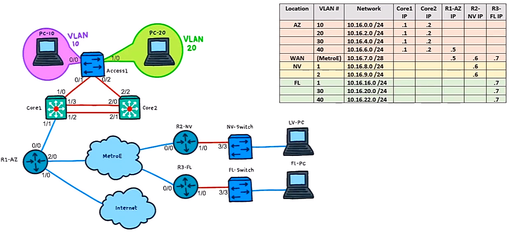
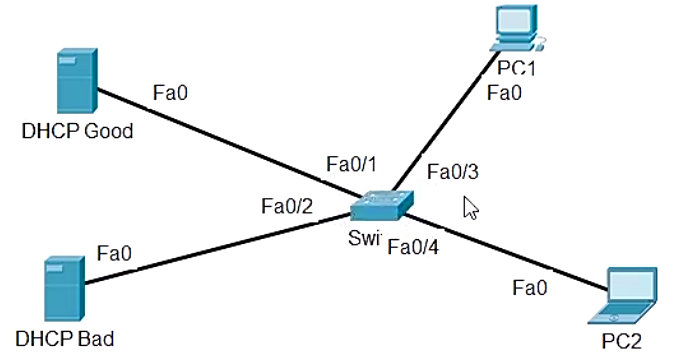
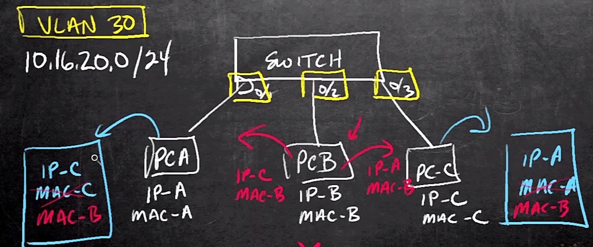
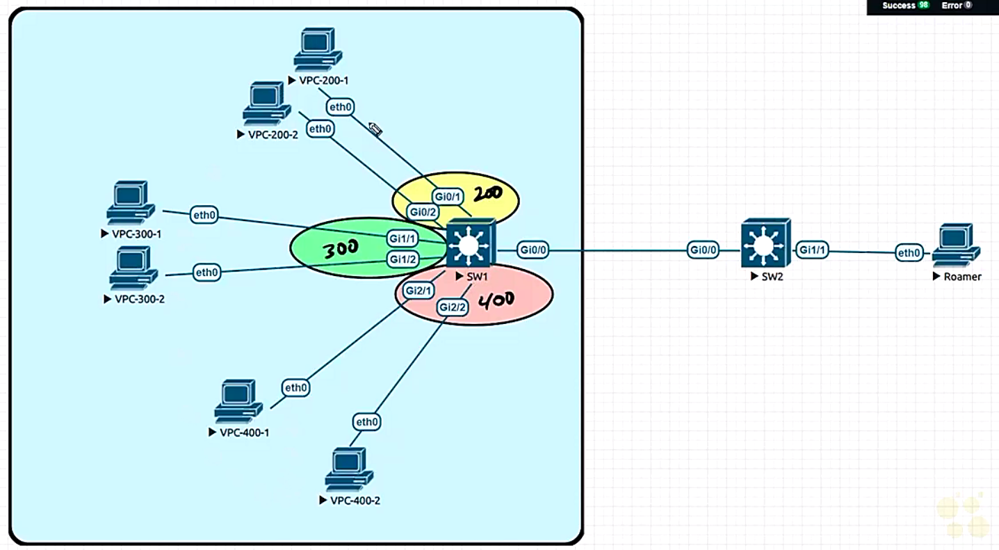
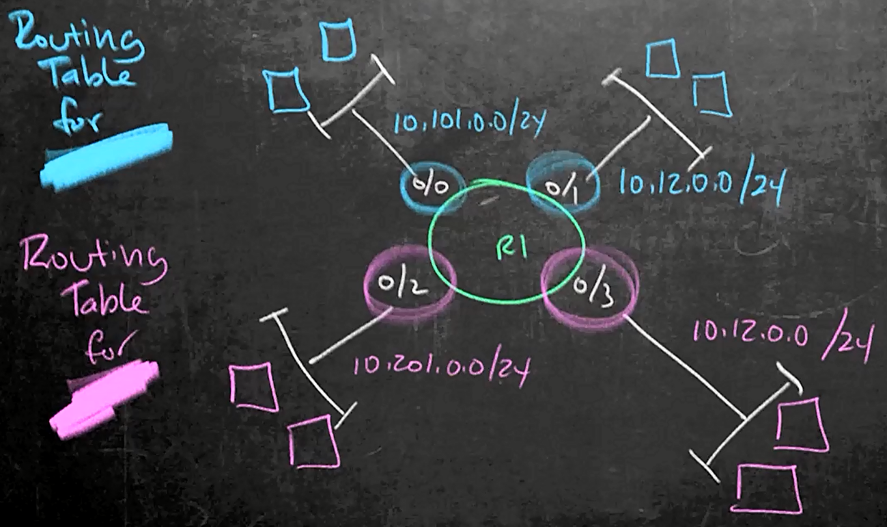
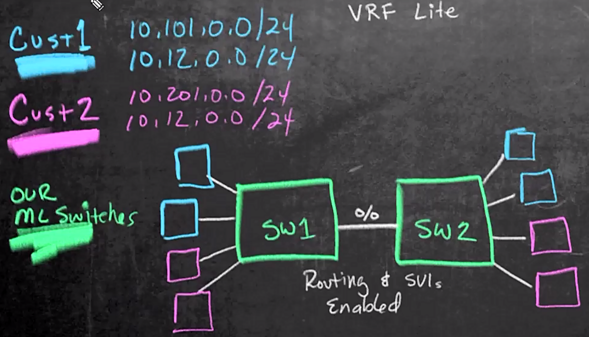
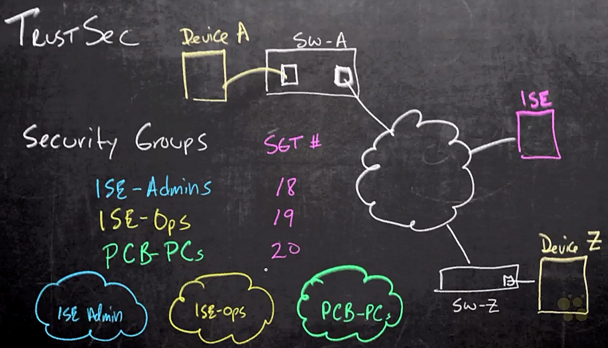
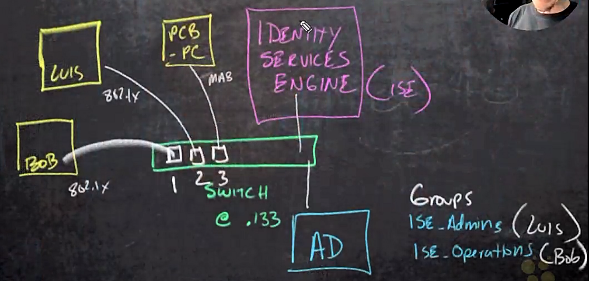
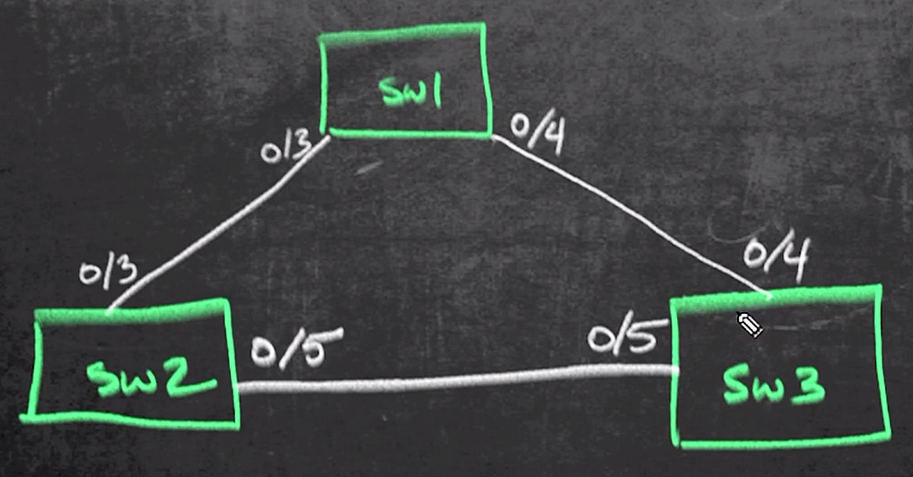

# Layer 2 Security


## 18. Configure and Verify Cisco Port Security


### Understanding Port Security and Why we Need It

- Security challenges of switch port
  - 1\. who/what connect to the port
  - 2\. multiple ports via another switch
  - 3\. hacker - Content Addressable Memory (CAM) table overflow, Mac flooding


- Demo: CAM table overflow

  ```text
  SW# show vlan brief
  VLAN Name           Status    Ports
  ---- -------------- --------- -----------------------------
  1    default        active    Gi0/3, Gi1/1, Gi1/2, Gi1/3
                                ...
  10   VLAN0010       active    Gi0/0
  20   VLAN0020       active    Gi1/0
  30   VLAN0030       active
  40   VLAN0040       active
  ...

  SW# show mac address-table vlan 10
          Mac Address Table
  Vlan  Mac Address     Type    Ports
  ----  -----------     ------  -----
    10  0015.5d44.5566  DYNAMIC Gi0/0
    10  0015.5d67.8322  DYNAMIC Gi0/0
    10  0015.d221.800a  DYNAMIC Gi0/1
    10  0015.d259.800a  DYNAMIC Gi0/1
  Total Mac Addresses for this criterion: 4

  SW# show mac address-table int g0/0 vlan 10
          Mac Address Table
  Vlan  Mac Address     Type    Ports
  ----  -----------     ------  -----
    10  0015.5d44.5566  DYNAMIC Gi0/0
    10  0015.5d67.8322  DYNAMIC Gi0/0
  Total Mac Addresses for this criterion: 2

  ! connect a Kali Linux box to g0/0
  SW# show mac address-table int g0/0 vlan 10
          Mac Address Table
  Vlan  Mac Address     Type    Ports
  ----  -----------     ------  -----
    10  0015.5d44.5566  DYNAMIC Gi0/0
    10  0015.5d67.8322  DYNAMIC Gi0/0
    10  0015.5d77.7701  DYNAMIC Gi0/0
  Total Mac Addresses for this criterion: 3

  Kali## macof -i eth0 -n 50

  SW# show mac address-table count vlan 10
  Mac Entries for Vlan 10:
  --------------------------
  Dynamic Address Count : 53
  Static Address Count  : 0
  Total Mac Addresses   : 53

  Total Mac Addess Space Available: 53207136
  ```


### Port Security Defaults

- Switch port mode for port security
  - access mode: `switchport mode access`
    - assign the port to a particular Vlan: `switchport access vlan 10`
  - host mode: `switchport host`
    - config as access mode
    - enable portfast
    - disable EtherChannel


- Port security config
  - dynamic L2 port:
    - a port automatically negotiate w/ peer
    - not allowing port security
  - enable port security on a port: `switchport port-security`
  - the port either an access or a trunk mode port
  - specify maximum allowable number of MAC addresses
  - violation: more Mac adddress attached to the port than maximum allowable Mac addresses
  - action w/ violation: shutdown


### Implementing Port Security on Layer 2 Interface

- Demo: config port security
  - plan: port g0/0 connected to a PC w/ Vlan 10

  ```text
  SW# conf t
  SW(config)## int g0/0
  SW(config-if)## switchport mode access
  SW(config-if)## switchport access vlan 10
  SW(config-if)## switchport host

  SW(config-if)## do show vlan brief
  ...
  SW(config-if)## do show mac address-table vlan 10
  ...
  SW(config-if)## do show port-security int g0/0
  Port Security              : Disabled
  Port Status                : Secure-down
  Violation Mode             : Shutdown
  Aging Time                 : 0 mins
  Aging Type                 : Absolute
  SecureStatic Address Aging : Disabled
  Maximum Mac Addresses      : 1
  Total Mac Addresses        : 0
  Configured Mac Addresses   : 0
  Sticky Mac Addresses       : 0
  Last Source Addresses:Vlan : 0000.0000.0000:0
  Security Violation Count   : 0

  SW(config-if)## do show port-security
  Secure Port   MaxSecureAddr   CurrentAddr   SecurityViolation   Security Action
                   (Count)         (Count)           (Count)
  -------------------------------------------------------------------------------
  -------------------------------------------------------------------------------
  Total Addresses in System (excluding one mac per port)     : 0
  Max Addresses limit in System (excluding one mac per port) : 4096

  SW(config-if)## switchport port-security
  SW(config-if)## end

  SW# show port security
  Secure Port   MaxSecureAddr   CurrentAddr   SecurityViolation   Security Action
                   (Count)         (Count)           (Count)
  -------------------------------------------------------------------------------
        Gi0/0               1             0                   0          Shutdown
  -------------------------------------------------------------------------------
  Total Addresses in System (excluding one mac per port)     : 0
  Max Addresses limit in System (excluding one mac per port) : 4096

  ! generate traffic in Kali Linux
  Kali## ping 10.16.0.1
  ...
  6 packets transmitted, 0 received, 100% packet loss, time 5140ms

  SW# show int status err-disabled
  Port  Name  Status        Reason            Err-disabled Vlans
  Gi0/0       err-disabled  psecure-violation
  ```


### Customizing Port Security

- Demo: customizing port security
  - `maximum`: set maximum mac address allowed on the port
  - `mac-address ...`: hard coded mac address
  - `sticky`: learn mac address dynamically on the port
  - `violation`: violation actions:
    - shutdown: default, shutdown the port
    - protect: drop packets w/ unknown mac addresses
    - restrict: same as protect but generate log message
  - all port security settings not in function until port security enabled
  - resume shutdowned interface by executing `shutdown` and `no shutdown` on the interface

  ```text
  SW# conf t
  SW(config)## int g0/0
  SW(config-if)## switchport mode access
  SW(config-if)## switchport access vlan 10
  SW(config-if)## switchport host
  SW(config-if)## switchport port-security maximum 5
  SW(config-if)## switchport port-security mac-address 0011.2233.4455
  SW(config-if)## switchport port-security mac-address sticky
  SW(config-if)## switchport port-security violation restrict|protect|shutdown

  SW(config-if)## do show port-security
  Secure Port   MaxSecureAddr   CurrentAddr   SecurityViolation   Security Action
                   (Count)         (Count)           (Count)
  -------------------------------------------------------------------------------
  -------------------------------------------------------------------------------
  Total Addresses in System (excluding one mac per port)     : 0
  Max Addresses limit in System (excluding one mac per port) : 4096

  SW(config-if)## switchport port-security

  SW(config-if)## do show port security
  Secure Port   MaxSecureAddr   CurrentAddr   SecurityViolation   Security Action
                   (Count)         (Count)           (Count)
  -------------------------------------------------------------------------------
        Gi0/0               5             1                   0          Shutdown
  -------------------------------------------------------------------------------
  Total Addresses in System (excluding one mac per port)     : 0
  Max Addresses limit in System (excluding one mac per port) : 4096

  SW(config-if)## do show port-security int g0/0
  Port Security              : Enabled
  Port Status                : Secure-up
  Violation Mode             : Shutdown
  Aging Time                 : 0 mins
  Aging Type                 : Absolute
  SecureStatic Address Aging : Disabled
  Maximum Mac Addresses      : 5
  Total Mac Addresses        : 2
  Configured Mac Addresses   : 1
  Sticky Mac Addresses       : 1
  Last Source Addresses:Vlan : 0015.5d44.5566:10
  Security Violation Count   : 0

  SW(config-if)## end
  SW# show mac address-table int g0/0
          Mac Address Table
  Vlan  Mac Address     Type    Ports
  ----  -----------     ------  -----
    10  0015.5d44.5566  STATIC  Gi0/0
    10  0015.5d67.8322  DYNAMIC Gi0/0
    10  0011.2233.4455  STATIC  Gi0/0
  Total Mac Addresses for this criterion: 3

  ! check connectivity from Kali
  Kali## ping 10.16.0.1
  ! successful
  Kali## ping 10.16.0.2
  ! successful

  SW(config-if)## end
  SW# show mac address-table int g0/0
          Mac Address Table
  Vlan  Mac Address     Type    Ports
  ----  -----------     ------  -----
    10  0015.5d44.5566  STATIC  Gi0/0
    10  0015.5d67.8322  DYNAMIC Gi0/0
    10  0015.5d70.7701  DYNAMIC Gi0/0
    10  0011.2233.4455  STATIC  Gi0/0
  Total Mac Addresses for this criterion: 4

  ! generate traffic w/ different mac address
  Kali## macof -i  eth0 -n 10

  SW#
  %PORT_SECURITY-2-PSECURE_CIOLATION: Security violation occurred, 
    caused by MAC address b49f.a376.e018 on port GigabitEthernet0/0
  
  SW# show intterfaces status err-disabled
  Port  Name  Status        Reason            Err-disabled Vlans
  Gi0/0       err-disabled  psecure-violation

  ! resume the interface
  SW# conf t
  SW(config)## int g0/0
  SW(config-if)## shutdown
  SW(config-if)## no shutdown
  SW(config-if)## end

  SW# show int status err-disbaled
  Port  Name  Status        Reason            Err-disabled Vlans
  ```


### Configuring Auto Errdisable Recovery

- Demo: config auto recovery for port security violation

  ```text
  SW# show port-security
  Secure Port   MaxSecureAddr   CurrentAddr   SecurityViolation   Security Action
                   (Count)         (Count)           (Count)
  -------------------------------------------------------------------------------
  -------------------------------------------------------------------------------
  Total Addresses in System (excluding one mac per port)     : 0
  Max Addresses limit in System (excluding one mac per port) : 4096

  SW# conf t
  SW(config)## int g0/0
  SW(config-if)## switchport host
  SW(config-if)## switchport port-security maximum 5
  SW(config-if)## switchport port-security
  
  SW(config-if)## do show port-security int g0/0
  Port Security              : Enabled
  Port Status                : Secure-up
  Violation Mode             : Shutdown
  Aging Time                 : 0 mins
  Aging Type                 : Absolute
  SecureStatic Address Aging : Disabled
  Maximum Mac Addresses      : 5
  Total Mac Addresses        : 1
  Configured Mac Addresses   : 0
  Sticky Mac Addresses       : 0
  Last Source Addresses:Vlan : 0015.5d44.5566:10
  Security Violation Count   : 0

  ! trigger violation in Kali Linux
  Kali## macof -i eth0 -n 10

  SW(config-if)## do show int status err-disabled
  Port  Name  Status        Reason            Err-disabled Vlans
  Gi0/0       err-disabled  psecure-violation

  SW(config-if)## end
  SW# show errdisable recovery
  ErrDisable Reason       Timer Status
  -----------------       ------------
  arp-inspection          Disabled
  ...
  psecure-violation       Disabled
  ...

  ! port security violation auto recovery in 30 secs
  SW# conf t
  SW(config)## errdisable recovery cause psecure-violation
  SW(config)## errdisable recovery interval 30
  SW(config)## end

  SW(config-if)## end
  
  SW# show errdisable recovery
  ErrDisable Reason       Timer Status
  -----------------       ------------
  arp-inspection          Disabled
  ...
  psecure-violation       Enable
  ...

  Timer interval: 30 seconds

  Interfaces that will be enabled at the next timeout:
  Interface   Errdisabled reason    Time left (sec)
  ---------   ------------------    ---------------
  Gi0/0       psecure-violation       281

  SW# conf t
  SW(config)## int g0/0
  SW(config-if)## shutdown
  SW(config-if)## no shutdown
  SW(config-if)## end

  SW# show errdisable recovery
  ErrDisable Reason       Timer Status
  -----------------       ------------
  arp-inspection          Disabled
  ...
  psecure-violation       Enable
  ...

  Timer interval: 30 seconds

  Interfaces that will be enabled at the next timeout:
  Interface   Errdisabled reason    Time left (sec)
  ---------   ------------------    ---------------
  Gi0/0       psecure-violation       20
  ```


### Applying Port Security Skills in Production

- Demo: applying port security in production
  - topology

    <figure style="margin: 0.5em; display: flex; justify-content: center; align-items: center;">
      
    </figure>

  - tasks:
    - applying port security on trunk interfaces (g1/0 on Core 1 and g2/2 on Core2)
    - Core 1 trunk to Access 1
    - Core 2 trunk to Access 1
    - port security parameters
      - max mac addresses: 2000
      - violation action: protect

  ```text
  ! config Core1
  Core1## show cdp neighbor
  Device ID   Local Interface   Holdtime  Capability  Platform  Port ID
  Core 2      Gig 1/2           146            R S I  ISOv      Gig 2/1
  Core 2      Gig 1/3           177            R S I  ISOv      Gig 2/0
  Access1     Gig 1/0           129             S I   IOSv      Gig 0/1

  Total cdp entries displayed: 3

  Core1## show port-security
  Secure Port   MaxSecureAddr   CurrentAddr   SecurityViolation   Security Action
                   (Count)         (Count)           (Count)
  -------------------------------------------------------------------------------
  -------------------------------------------------------------------------------
  Total Addresses in System (excluding one mac per port)     : 0
  Max Addresses limit in System (excluding one mac per port) : 4096

  Core1## conf t
  Core1(config)## int g1/0
  Core1(config-if)## switchport port-security maximum 2000
  Core1(config-if)## switchport port-security violation protect
  Core1(config-if)## switchport port-security
  Core1(config-if)## emd

  Core1## show port-security 
  Secure Port   MaxSecureAddr   CurrentAddr   SecurityViolation   Security Action
                   (Count)         (Count)           (Count)
  -------------------------------------------------------------------------------
        Gi1/0           2000              1                   0           Protect
  -------------------------------------------------------------------------------
  Total Addresses in System (excluding one mac per port)     : 0
  Max Addresses limit in System (excluding one mac per port) : 4096

  Core1## show port-security int gig 1/0
  Port Security              : Enabled
  Port Status                : Secure-up
  Violation Mode             : Protect
  Aging Time                 : 0 mins
  Aging Type                 : Absolute
  SecureStatic Address Aging : Disabled
  Maximum Mac Addresses      : 2000
  Total Mac Addresses        : 2
  Configured Mac Addresses   : 0
  Sticky Mac Addresses       : 0
  Last Source Addresses:Vlan : 0015.5d44.5566:1
  Security Violation Count   : 0

  ! config Core 2
  Core2## show port-security
  Secure Port   MaxSecureAddr   CurrentAddr   SecurityViolation   Security Action
                   (Count)         (Count)           (Count)
  -------------------------------------------------------------------------------
  -------------------------------------------------------------------------------
  Total Addresses in System (excluding one mac per port)     : 2
  Max Addresses limit in System (excluding one mac per port) : 4096

  Core2## show cdp neighbor
  Device ID   Local Interface   Holdtime  Capability  Platform  Port ID
  Core 1      Gig 2/1           138            R S I  ISOv      Gig 1/2
  Core 1      Gig 2/0           145            R S I  ISOv      Gig 1/3
  Access1     Gig 2/2           129             S I   IOSv      Gig 0/2

  Total cdp entries displayed: 3

  Core1## conf t
  Core1(config)## int g2/2
  Core1(config-if)## switchport port-security maximum 2000
  Core1(config-if)## switchport port-security violation protect
  Core1(config-if)## switchport port-security
  Core1(config-if)## emd

  Core1## show port-security 
  Secure Port   MaxSecureAddr   CurrentAddr   SecurityViolation   Security Action
                   (Count)         (Count)           (Count)
  -------------------------------------------------------------------------------
        Gi2/2           2000              4                   0           Protect
  -------------------------------------------------------------------------------
  Total Addresses in System (excluding one mac per port)     : 3
  Max Addresses limit in System (excluding one mac per port) : 4096

  Core1## show port-security int gig 2/2
  Port Security              : Enabled
  Port Status                : Secure-up
  Violation Mode             : Protect
  Aging Time                 : 0 mins
  Aging Type                 : Absolute
  SecureStatic Address Aging : Disabled
  Maximum Mac Addresses      : 2000
  Total Mac Addresses        : 10
  Configured Mac Addresses   : 0
  Sticky Mac Addresses       : 0
  Last Source Addresses:Vlan : 00dc.d259.8028:1
  Security Violation Count   : 0
  ```


### Review of Configure and Verify Cisco Port Security

- Quest 1

  How does Port Security prevent unwanted devices from connecting to a single port?

  Ans: Yes<br>
  Explanation: port security contolling the quantity of different Mac address able to be seen the inbound L2 source frames


- Question 2

  What are the defaults for Port Security for number of addresses and violation action?

  Ans: deafult max number = 1, default action = shutdown
  Explanation:
  - set max allowable mac addresses: `switchport port-security maxiumum #`
  - options of violation action: shutdown, restrict, protect
  - cmd to set action: `switchport port-security violation shutdown|protect|restrict`


### Cisco CCNA (200-301) Assessment Lab: Security

- Ref: [New Training: Cisco CCNA (200-301) Assessment Lab: Security](https://www.cbtnuggets.com/blog/new-skills/new-training-cisco-ccna-200-301-assessment-lab-security)


## 19. Configure and Verify Cisco DHCP Snooping


### Introducing DHCP Snooping

- Learning goals
  - benefits of DHCP snooping
  - trusted and untrusted ports
  - enable switch to verify IP and MAC addresses before receiving frames

### Why is DHCP Snooping Needed

- DHCP DORA process
  - Discover (broadcast): client sending out DHCP server request
  - Offer (unicast): DHCP server offerring service
  - Request (broadcast): client sending request for DHCP service
  - Acknowledgement (unicast): server replying to the request


- DHCP snooping
  - config to accept DHCP type messages on switch
  - config DHCP service on Vlan 30
  - L2 switch blocking unauthorized DHCP servers from distributing IP addresses to clients
  - port categories
    - truested:
      - a.k.a Trusted Source or Trusted interface
      - DHCP server messages trusted
    - untrusted
      - a.k.a Untrusted Source or Untrusted interface
      - DHCP server messages not trusted
      - default setting
  - router w/o DHCP snooping feature
  - DHCP server messages w/ DHCP Option 82 - Agent Information Option


### The Recipe for DHCP Snooping

- Commands for DHCP snooping
  - enable DHCP snooping: `SW(config)## ip dhcp snooping`
  - enable DHCP snooping on a particular VLAN: `SW(config)## ip dhcp snooping vlan 20`
  - confing a trusted port: `SW(config-if)## ip dhcp snoop trust`
  - option 82 not allowed w/ `SW(config)## no ip dhcp snooping info option`


### Building and Implementing DHCP Snooping in PT

- Demo: config DHCP snooping

  <figure style="margin: 0.5em; display: flex; justify-content: center; align-items: center;">
    
  </figure>

  ```text
  SW# show vlan brief
  ! all ports on native vlan

  SW# conf t
  SW(config)## ip dhcp snooping
  
  SW(config)## do show ip dhcp snooping
  DHCP snooping is configured on the following VLANs:
  none
  Insertion of option 82 is enabled
  Option 82 on untrusted port is not allowed
  Verification of hwaddr field is enabled
  Interface         Trusted   Rate Limited (pps)
  ----------------  -------   ------------------

  SW(config)## ip dhcp snooping vlan 1
  SW(config)## do show ip dhcp snooping
  Switch DHCP snooping is enabled
  DHCP snooping is configured on the following VLANs:
  1
  Insertion of option 82 is enabled
  Option 82 on untrusted port is not allowed
  Verification of hwaddr field is enabled
  Interface         Trusted   Rate Limited (pps)
  ----------------  -------   ------------------

  SW(config)## no ip dhcp snooping information option
  SW(config)## do show ip dhcp snooping
  Switch DHCP snooping is enabled
  DHCP snooping is configured on the following VLANs:
  1
  Insertion of option 82 is disabled
  Option 82 on untrusted port is not allowed
  Verification of hwaddr field is enabled
  Interface         Trusted   Rate Limited (pps)
  ----------------  -------   ------------------

  SW(config)## int f0/1
  SW(config-if)## ip dhcp snooping trust
  SW(config)## do show ip dhcp snooping
  Switch DHCP snooping is enabled
  DHCP snooping is configured on the following VLANs:
  1
  Insertion of option 82 is disabled
  Option 82 on untrusted port is not allowed
  Verification of hwaddr field is enabled
  Interface         Trusted   Rate Limited (pps)
  ----------------  -------   ------------------
  FastEthernet0/1   yes       unlimited
  ```

- Demo: verify DHCP operations
  - packet tracer to conduct the demo
  - bootup PC1 and observe interfaces connected to DHCP Good and DHCP Bad
  - check IP address of PC1 & PC2 $\gets$ both from DHCP Good server

  ```text
  SW# show ip dhcp binding
  MacAddress          IpAddress     Lease (sec)   Type            VLAN  Interface
  -----------------   ------------  -----------   -------------   ----  ---------------
  00:D0:FF:B1:3D:16   10.16.20.2    86400         dhcp-snooping   1     FastEthernet0/1
  00:DC:CF:61:E3:90   10.16.20.3    86400         dhcp-snooping   1     FastEthernet0/2
  Total number of bindings: 2
  ```


### Adding Source Guard to a Switch

- Source guard overview
  - a per-interface traffic filter
  - permitting IP traffic only if IP and/or MAC addresses of each packet matched
  - enable source guard: `SW(config-if)## ip verify source port-security`
    - `port-security`: verify both IP and MAC addresses


- Demo: config source guard

  ```text
  SW# show ip dhcp snooping
  DHCP snooping is configured on the following VLANs:
  30
  DHCP snooping is operational on the following VLANs:
  30
  DHCP snooping is configured on the following L3 Interfaces:

  Insertion of option 82 is disabled
    circuit-id default format: vlan-mod-port
    remote-id: 00dc.d2b2.ff00 (MAC)
  Option 82 on untrusted port is not allowed
  Verification of hwaddr field is enabled
  Verification of giaddr field is enabled
  DHCP snooping trust/rate is configured on the following Interfaces:

  Interface           Trusted   Allow option    Rate Limited (pps)
  ------------------  -------   ------------    ------------------
  GigabitEthernet0/1   yes       yes             unlimited

  SW# show ip dhcp snooping binding
  MacAddress           IpAddress    LeaseSec   Type           VLAN    Interface
  -------------------  ----------   ---------  -------------  ----    -------------------
  00:50:79?:66:68:04   10.16.20.101 85538      dhcp-snooping   30     GigabitEThernet0/1
  Total number of binding: 1

  SW# conf t
  SW(config)## int g0/1
  SW(config-if)## ip verify source port-security
  SW(config-if)## end

  SW# show ip source binding
  MacAddress           IpAddress    LeaseSec   Type           VLAN    Interface
  -------------------  ----------   ---------  -------------  ----    -------------------
  00:50:79?:66:68:04   10.16.20.101 85448      dhcp-snooping   30     GigabitEThernet0/1
  Total number of binding: 1

  SW# show ip verify source
  Interface  Filter-type  Filter-mode  IP-address       Mac-address        Vlan
  ---------  -----------  -----------  ---------------  -----------------  ----------
  Gi0/1      ip-mac       active       10.16.20.101     permit-all         30
  ```


### Applying DHCP Snooping in Production

- Demo: DHCP snooping in production
  - tasks:
    - R3-FL (R3) as DHCP server for VLAN 30
    - FL-Switch (SW) w/ dhcp snooping for Vlan 30
    - disable option 82 insertion for DHCP snooping or config g3/3 on SW as trusted port
    - verify from FL-PC (PC1)

  <figure style="margin: 0.5em; display: flex; justify-content: center; align-items: center;">
    
  </figure>

  ```text
  ! always verify basic info before conducting any config
  R3## show ip int brief
  Interface              IP-Address     OK? Method Status                Protocol
  Ethernet0/0            unassigned     YES NVRAM  administratively down down
  GigabitEthernet0/0     10.16.7.7      YES VNARM  up                    up
  GigabitEthernet1/0     10.16.16.7     YES VNARM  up                    up
  GigabitEthernet1/0.30  10.16.20.7     YES VNARM  up                    up
  GigabitEthernet1/0.40  10.16.22.7     YES VNARM  up                    up
  GigabitEthernet2/0     unassigned     YES NVRAM  administratively down down
  ...
  Loopback0              3.3.3.3        YES VNARM  up                    up

  R3## conf t
  R3(config)## ip dhcp pool DEMOPOOL
  R3(dhcp-config)## default-router 10.16.20.7
  R3(dhcp-config)## dns-server 8.8.8.8
  R3(dhcp-config)## exit
  R3(config)## ip dhcp excluded-address 10.16.20.1 10.16.20.10
  R3(config)## end

  R3## show ip dhcp pool
  Pool DEMOPOOL:
   Utilization mark (high/low)    : 100 / 0
   Subnet size (first/next)       : 0 / 0
   Total addresses                : 254
   Leased addresses               : 0
   Pending event                  : none
   1 subnets are currently in the pool :
   Current index        IP address range           Leased/Exclude/Total
   10.16.20.1           10.16.20.1 - 10.16.20.254  0     / 10    / 254
   
  ! config switch
  SW# show ip dhcp snooping
  DHCP snooping is configured on the following VLANs:
  none
  DHCP snooping is operational on the following VLANs:
  none
  DHCP snooping is configured on the following L3 Interfaces:

  Insertion of option 82 is disabled
    circuit-id default format: vlan-mod-port
    remote-id: 00dc.d2b2.ff00 (MAC)
  Option 82 on untrusted port is not allowed
  Verification of hwaddr field is enabled
  Verification of giaddr field is enabled
  DHCP snooping trust/rate is configured on the following Interfaces:

  Interface           Trusted   Allow option    Rate Limited (pps)
  ------------------  -------   ------------    ------------------

  SW# conf t
  SW(config)## ip dhcp snooping
  SW(config)## ip dhcp snooping vlan 30

  SW(config)## do show ip dhcp snooping
  Switch DHCP snooping is enabled
  Switch DHCP gleaning is disabled
  DHCP snooping is configured on the following VLANs:
  30
  DHCP snooping is operational on the following VLANs:
  30
  ...

  SW(config)## no ip dhcp snooping infomation option
  ...
  Insertion of option 82 is disabled
  ...

  ! verify the interface connect to R3
  SW(config)## do show cdp neighbor
  Device ID        Local Intrfce     Holdtme    Capability  Platform  Port ID
  R3               Gig 3/3           163               R    7206VXR   Gig 1/0

  ! config g3/3 as trusted port
  SW(config)## int g3/3
  SW(config-if)## ip dhcp snooping trust
  SW(config-if)## end

  SW# ip dhcp snooping
  Switch DHCP snooping is enabled
  Switch DHCP gleaning is disabled
  DHCP snooping is configured on the following VLANs:
  30
  DHCP snooping is operational on the following VLANs:
  30
  DHCP snooping is configured on the following L3 Interfaces:

  Insertion of option 82 is disabled
    circuit-id default format: vlan-mod-port
    remote-id: 00dc.d2b2.ff00 (MAC)
  Option 82 on untrusted port is not allowed
  Verification of hwaddr field is enabled
  Verification of giaddr field is enabled
  DHCP snooping trust/rate is configured on the following Interfaces:

  Interface           Trusted   Allow option    Rate Limited (pps)
  ------------------  -------   ------------    ------------------
  GigabitEthernet3/3  yes       yes             unlimited

  ! verify PC1 and issue DHCP request
  PC1> show ip
  NAME        : PC1
  IP/MASK     : 10.16.20.30/24
  GATEWAY     : 10.16.20.7
  DNS         : 
  MAC         : 00:50:79:66:68:04
  LPORT       : 10222
  RHOST:RPORT : 127.0.0.1:10223
  MTU         : 1500

  PC1> ip dhcp
  DDORA IP 10.16.20.11/24 GW 10.16.20.7

  ! verify on SW
  SW# show ip dhcp binding
  MacAddress           IpAddress    LeaseSec   Type           VLAN    Interface
  -------------------  ----------   ---------  -------------  ----    -------------------
  00:50:79:66:68:04    10.16.20.11  86376      dhcp-snooping   30     GigabitEThernet0/1
  Total number of binding: 1
  ```


### Review of Configure and Verify Cisco DHCP Snooping

- Question 1

  How does DHCP Snooping protect the network?

  A. Switch denies inbound DHCP server message, on half-duple ports.<br>
  B. Switch denies frames, if the maximum MAC address count is exceeded.<br>
  C. Switch denies frames, if the the user hasn't been authenticated.<br>
  D. Switch denies inbound DHCP server messages,, on untrusted DHCP ports.<br>

  Ans: D


- Question 2

  Which feature can leverage the information learned via DHCP snooping, and prevent IP address snooping?

  A. Dynamic ARP Inspection (DAI)<br>
  B. Source guard<br>
  C. Destination guard<br>
  D. Port Security<br>

  Ans: B


- Question 3

  What is the default for a port, when DHCP snooping is applied?

  A. Trusted<br>
  B. Untrusted<br>
  C. Err-disabled<br>
  D. Full-duplex<br>

  Ans: B

### Configure and Verify Cisco DHCP Snooping

- [CCNA Lab Assessment Online Training](https://www.cbtnuggets.com/it-training/cisco/assessment-labs)

## 20. Configure and Verify Cisco Dynamic ARP Inspection


### Introducing Dynamic ARP Inspection (DAI)

- Learning goals
  - Dynamic ARP Inspection (DAI)
  - implement DAI
  - ARP ACL
  - DAI options and features


### Why is DAI Needed

- ARP and issue
  - PCA $\leftrightarrow$ PAC
    - ARP cache in PCA w/ entry - (IP-C, MAC-C)
    - ARP cache in PCC w/ entry - (IP-A, MAC-A)
  - PCB running malicious software to send ARP message w/ (IP-C, MAC-B)
  - PCA updating cache w/ entry - (IP-C, MAC-B)
  - PCB sending ARP message w/ (IP-A, MAC-B) as well
  - PCC updating cache w/ entry - (IP-A, MAC-B)
  - PCB forwarding received packets to appropriate destination after eavesdropping or manipulating
  - Solution: Dynamic ARP Inspection (DAI)

  <figure style="margin: 0.5em; display: flex; justify-content: center; align-items: center;">
    
  </figure>


### The Recipe and Commands for DAI

- DAI overview
  - DHCP snooping used to map IP and MAC addresses
  - commands
    - enable DAI on vlan: `ip arp inspecton clan 30`
    - enable intf as DAI trusted port: `if) ip arp inspect trust`
    - verify DAI: `show ip arp inspect vlan 30`
  - router a DHCP client $\to$ not offering DHCP snooping
    - manually config static L2 & L3 mapping
    - config the port on switch connected to router as a trusted port


### Implementing DAI

- Config DAI
  - topology:
    - R3 connected to Switch (SW) on port g3/3
    - PC2 connected to SW on port g0/2
    - another switch (subnet 10.1.0.0/24) connected to SW on port g0/1
  - task: implement DAI for SW
  
  ```text
  ! verify DHCP snooping enabled
  SW# show ip dhcp snooping binding
  MacAddress           IpAddress    LeaseSec   Type           VLAN    Interface
  -------------------  ----------   ---------  -------------  ----    -------------------
  00:50:79:66:68:04    10.16.20.101 85604      dhcp-snooping   40     GigabitEThernet0/2
  00:15:5D:77:77:01    10.16.20.102 85689      dhcp-snooping   30     GigabitEthernet0/1
  Total number of binding: 2

  SW# shop ip arp inspection vlan 30
  Source Mac Validation       : Disabled
  Destination Mac Validation  : Disabled
  IP Address Validation       : Disabled
  
  Vlan Configuration Operation ACL Match Static ACL
  ---- ------------- --------- --------- ----------
    30 Disabled      Inactive
  
  Vlan ACL Logging DHCP Logging Probe Logging
  ---- ----------- ------------ -------------
    30 Deny        Deny         Off
  
  ! config interface trust first
  SW# conf t
  SW(config)## int g3/3
  
  SW(config-if)## do show cdp neighbor
  Device ID        Local Intrfce     Holdtme    Capability  Platform  Port ID
  R3               Gig 3/3           154               R    7206VXR   Gig 1/0

  SW(config-if)## ip arp inspection trust
  SW(config-if)## exit

  ! enable DAI
  SW(config)## ip arp inspection vlan 30
  SW(config)## end

  ! verify DAI
  SW# show ip arp inspection vlan 30
  Source Mac Validation       : Disabled
  Destination Mac Validation  : Disabled
  IP Address Validation       : Disabled
  
  Vlan Configuration Operation ACL Match Static ACL
  ---- ------------- --------- --------- ----------
    30 Enabled       Active
  
  Vlan ACL Logging DHCP Logging Probe Logging
  ---- ----------- ------------ -------------
    30 Deny        Deny         Off

  ! ARP deny msgs
  SW#
  ...
  %SW_DAI-4-DHCP_SNOOPING_DENY: 2 Invalid ARPs (Req) on Gi0/1, vlan 30.
    ([0015.5d67.8322/10.1.0.111/0000.0000.0000/10.1.0.1/00:29:59 UTC ...])
  %SW_DAI-4-DHCP_SNOOPING_DENY: 2 Invalid ARPs (Req) on Gi0/1, vlan 30.
    ([0015.5d44.5566/10.1.0.120/0000.0000.0000/10.1.0.1/00:30:00 UTC ...])
  ...TRUNCATED...

  ! another switch connected to SW  w/ untrusted port
  ! DHCP messages dropped amd no (IP, MAC) mapping generated
  ```


### ARP Access Lists for Non-DHCP Devices

- Troubleshooting dropped ARP msgs from untrusted port connected to a switch
  - dropped DHCP messages allowed by permitted ACL
  
  ```text
  SW# show ip dhcp snooping binding
  MacAddress           IpAddress    LeaseSec   Type           VLAN    Interface
  -------------------  ----------   ---------  -------------  ----    -------------------
  00:50:79:66:68:04    10.16.20.101 85604      dhcp-snooping   40     GigabitEThernet0/2
  00:15:5D:77:77:01    10.16.20.102 85689      dhcp-snooping   30     GigabitEthernet0/1
  Total number of binding: 2

  ! config interface trust first
  SW# conf t
  SW(config)## int g3/3
  SW(config-if)## ip arp inspection trust
  SW(config-if)## exit

  SW(config)## ip arp inspection vlan 30

  SW(config)## arp access-list DEMO-LIST
  SW(config-arp-nacl)## permit ip host 10.1.0.111 mac host 0015.5d67.8322
  SW(config-arp-nacl)## permit ip host 10.1.0.120 mac host 0015.5d44.5566
  SW(config-arp-nacl)## exit

  SW(config)## ip arp inspection filter DEMO-LIST vlan 30
  SW(config)## end

  SW# show arp access-list
  ARP access list DEMO-LIST
      permit ip host 10.1.0.111 mac host 0015.5d67.8322
      permit ip host 10.1.0.120 mac host 0015.5d44.5566

  SW# show arp inspection vlan 30
  Source Mac Validation       : Disabled
  Destination Mac Validation  : Disabled
  IP Address Validation       : Disabled
  
  Vlan Configuration Operation ACL Match Static ACL
  ---- ------------- --------- --------- ----------
    30 Enabled       Active    DEMO-LIST No
  
  Vlan ACL Logging DHCP Logging Probe Logging
  ---- ----------- ------------ -------------
    30 Deny        Deny         Off

  SW# show ip arp inspection statistics
  Vlan Forwarded Dropped DHCP Drops ACL Drops
  ---- --------- ------- ---------- ----------
    30        46      46         46          0
  
  Vlan DHCP Permits ACL Permits Probe Permit  Source MAC Failures
  ---- ------------ ----------- ------------  -------------------
    30            0          46            0                    0
  
  Vlan Dest MAC Failures IP Validation Failures Invalid Protocol Data
  ---- ----------------- ---------------------- ---------------------
    30                 0                      0                     0

  ! generate traffic from Kali Linux
  Kali## ifconfig
  eth0: flags=4163 ...TRUNCATED...
      inet 10.16.20.102 ...TRUNCATED...

  Kali## ping 10.16.20.7
  ...TRUNCATED...

  ! statistics increased
  SW# show ip arp inspection statistics
  Vlan Forwarded Dropped DHCP Drops ACL Drops
  ---- --------- ------- ---------- ----------
    30        101     46         46          0
  
  Vlan DHCP Permits ACL Permits Probe Permit  Source MAC Failures
  ---- ------------ ----------- ------------  -------------------
    30            1          99            0                    0
  
  Vlan Dest MAC Failures IP Validation Failures Invalid Protocol Data
  ---- ----------------- ---------------------- ---------------------
    30                 0                      0                     0
  ```


### Additional DAI Options and Features

- Demo: config DAI parameters

  ```text
  SW# show ip arp inspection interfaces
  Interface       Trust State Rate (pps)  Burst Interval
  --------------- ----------- ----------  --------------
  Gi0/0           Untrusted           15               1
  Gi0/0           Untrusted           15               1
  ...TRUNCATED...
  Gi3/3           Trusted           None             N/A

  ! config DAI on g3/3 w/ rate limit = 100 pkts/sec
  SW# conf t
  SW(config)## int g3/3
  SW(config-if)## ip arp inspection limit rate 100
  SW(config-if)## end

  SW# show ip arp inspection interfaces
  Interface       Trust State Rate (pps)  Burst Interval
  --------------- ----------- ----------  --------------
  Gi0/0           Untrusted           15               1
  Gi0/0           Untrusted          100               1
  ...TRUNCATED...
  Gi3/3           Trusted           None             N/A

  ! verify w/ nmap to scan IP addr space w/o port scan
  Kali## nmap -sn 10.16.20.0/24

  SW#
  %SW_DA-4-PACKET_RATE_EXCEEDED: 103 packets received in 630 milliseconds on Gi0/1
  %PM-4-ERR_DISABLED: arp-inspection error detected on Gi0/1, putting Gi0/1 in err-disable state
  %LINEPORTO-5-UPDOWN: Line protocol on Interface GigabitEthernet0/1, changed state to down
  %LINK-3-UPDOWN: Interface GigabitEThernet0/1, change state to down

  SW# show int status err-disabled
  Port      Name      Status       Reason          Err-disabled Vlans
  Gi0/1               err-disabled arp-inspection

  ! re-activate shutdown interface
  SW# conf t
  SW(config)## int g0/1
  SW(config-if)## shutdown
  SW(config-if)## no shutdown
  SW(config-if)## end

  ! ARP spoofing
  ! verify w/ arpspoof to perform ARP spoofing from Kali Linux
  ! sending broadcast arp responses to clean L2 address of 10.16.20.7 w/
  ! L2 address of eth0
  Kali## arpspoof -i eth0 10.16.20.7 
  0:15:5d:77:77:1 ff:ff:ff:ff:ff:ff 0896 42: arp reply 10.16.20.7 
    is-at 0:15:5d:77:77:1
  ...TRUNCATED...

  SW#
  %SW_DAI-4-DHCP_SNOOPING_DENY: 1 INvalid ARPs (Res) on Gi0/1, Vlan 30
    ([0015.5d77.7701/10.16.20.7/ffff.ffff.ffff/0.0.0.0/00:36:14 UTC ...])
  ...

  ! disable src/dst MAC & IP addresses validation by default
  SW# show ip arp inspection vlan 30
  Source Mac Validation       : Disabled
  Destination Mac Validation  : Disabled
  IP Address Validation       : Disabled
  ...

  ! enable src/dst MAC & IP addresses validation
  SW# conf t
  SW(config)## ip arp inspection validate dst-mac src-mac ip
  SW(config)## end

  SW# show ip arp inspection vlan 30
  Source Mac Validation       : Enabled
  Destination Mac Validation  : Enabled
  IP Address Validation       : Enabled
  ...TRUNCATED...
  ```


### Applying DAI to the Production Network

- Demo: config DAI in production network
  - topology
    - SW = FL-Switch
    - R3 = R3-FL
    - PC2 = FL-PC2

    <figure style="margin: 0.5em; display: flex; justify-content: center; align-items: center;">
      
    </figure>

  - tasks: 
    - setup DAI on vlan 40
    - trust port g3/3 $\gets$ g1/0 on R3 not assigned via DHCP
    - verify DAI working correctly
  
  ```text
  ! verify basic info
  SW# show vlan brief
  VLAN Name                             Status    Ports
  ---- -------------------------------- --------- -------------------------------
  1    default                          active    Gi0/0, Gi0/3, Gi0/1, Gi1/1,
                                                  ...
  30   Engineering                      active    Gi0/1
  40   Sales                            active    Gi0/2
  ...TRUNCATED...

  SW# show cdp neighbor
  Device ID        Local Intrfce     Holdtme    Capability  Platform  Port ID
  R3               Gig 3/3           177               R    7206VXR   Gig 1/0

  SW# conf t
  SW(config)## int g3/3
  SW(config-if)## ip arp inspection trust
  SW(config-if)## exit
  SW(config)## ip arp inspection vlan 40
  SW(config)## end

  SW# show ip arp inspection vlan 40

  Source Mac Validation       : Disabled
  Destination Mac Validation  : Disabled
  IP Address Validation       : Disabled
  
  Vlan Configuration Operation ACL Match Static ACL
  ---- ------------- --------- --------- ----------
    40 Enabled       Active
  
  Vlan ACL Logging DHCP Logging Probe Logging
  ---- ----------- ------------ -------------
    40 Deny        Deny         Off

  SW# show ip dhp snooping binding
  MacAddress           IpAddress    LeaseSec   Type           VLAN    Interface
  -------------------  ----------   ---------  -------------  ----    -------------------
  00:50:79:66:68:04    10.16.20.101 85681      dhcp-snooping   40     GigabitEThernet0/2
  00:15:5D:77:77:01    10.16.20.102 85766      dhcp-snooping   30     GigabitEthernet0/1
  Total number of binding: 2

  ! PC2 > show ip
  NAME        : FL-PC2[1]
  IP/MASK     : 10.16.22.101/24
  GATEWAY     : 10.16.22.7
  DNS         : 
  DHCP SERVER : 10.16.22.7
  DHCP LEASE  : 85105, 86400/43200/75600
  MAC         : 00:50:79:66:68:00
  LPORT       : 10008
  RHOST:RPORT : 127.0.0.1:10009
  MTU         : 1500

  PC1> ping 10.16.22.7
  ...successful...

  ! PC2 w/ static IP address -> no (IP, MAC) mapping on SW
  ! ARP msg from PC2 unable to be verified --> pkt dropped
  PC2> ip 10.16.22.200
  PC2: 10.16.22.200 255.255.255.0

  PC2> ping 10.16.22.7
  ..UNSUCCESS...

  SW#
  %SW_DAI-4-DHCP_SNOOPING_DENY: 1 Invalid ARPs (Eeq) on Gi0/2, vlan 40
    ([0050.7966.6800/10.16.22.200/ffff.ffff.ffff/10.16.22.200/00:27:36 UTC ...])
  ...TRUNCATED...

  ! PC2 changes back to dynamic IP address
  PC2> ip dhcp
  DORA IP 10.16.22.101/24 GW 10.16.22.7

  ! verify the change
  SW# show ip dhcp snooping binding
  MacAddress           IpAddress    LeaseSec   Type           VLAN    Interface
  -------------------  ----------   ---------  -------------  ----    -------------------
  00:50:79:66:68:04    10.16.20.101 85681      dhcp-snooping   40     GigabitEThernet0/2
  00:15:5D:77:77:01    10.16.20.102 85766      dhcp-snooping   30     GigabitEthernet0/1
  Total number of binding: 2

  ! verify connectivity on PC2
  PC2> pint 10.16.22.7
  ...SUCCESS...
  ```


### Review of Configure and Verify Cisco Dynamic ARP Inspection

- Question 1

  How does DAI dynamically know about which IP/MAC address mapping are correct?

  A. IGMP Snooping<br>
  B. DHCP Snooping<br>
  C. IP Verify<br>
  D. Source Guard<br>
  E. BPDU Guard<br>

  Ans: B


- Question 2

  Which methods would allow a device which is NOT in the DHCP snooping binding table, to still be allowed to send ARP messages into the network? (choose 2)

  A. Port Security<br>
  B. DAI trusted port<br>
  C. Extended Access-list<br>
  D. ARP Access-list<br>
  E. Source Guard<br>

  Ans: BD


- Question 3

  Which is the command to implement DAI on a CLAN?

  A. arp inspection vlan 40<br>
  B. ip ar inspection vlan 40<br>
  C. arp ip inspction vlan 40<br>
  D. inspection ip arp vlan 40<br>

  Ans: B


### Configure and Verify Cisco Dynamic ARP Inspection

- [CCNA Lab Assessment Online Training](https://www.cbtnuggets.com/it-training/cisco/assessment-labs)


## 21. Private VLANS


### PVLANs Overview

- VLAN fundamentals
  - traditional VLAN
    - create a vlan, said Vlan 100
    - asssign vlan 100 to a couple of ports
    - the ports w/ L3 scheme 10.100.0.0/24
    - frames allowed to send btw ports using broadcast
  - issue w/ traditional vlan: unable to filter broadcast frames
  - solution: PVLAN
  
  
- Private VLAN (PVLAN) fundamentals
  - create a primary vlan, said vlan 100
  - logical sub-divisions of primary vlan created to separate the ports
  - secondary vlan as the sub-section of primary vlan
  - create secondary vlans associated w/ a subset of ports in the primary vlan
  - two types of secondary vlans
    - community:
      - ports within the same community able to communicate w/ each other
      - ports belonging to different communit vlans unable to communicate w/ each other
    - isolated: ports within unable to communicate w/ each other
  - ports w/ the same primary vlan and IP address space $\to$ IP address not decisive


### Promiscuous Ports

- Promiscuous ports overview
  - ports w/o any restriction in a primary vlan
  - acting as a default gateway in L3 routing
  - example:
    - primary vlan = 100, community vlan = 200, community vlan = 300, isolated vlan = 400
    - IP address space of vlan 100: 10.100.0.0/24
  - promiscuous ports
    - associated w/ primary vlan, not any secondary vlan
    - able to communicate w/ any port in the primary vlan
  - ports connected to other switches as trunk w/ associated community vlan


### PVLAN Design

- Planning PVLAN
  - primary vlan: 100
  - IP address space: 10.100.0.0/24
  - community vlan: 200 w/ port 0/1-2
  - community vlan: 300 w/ port 1/1-2
  - isolated vlan: 400 w/ port 2/1-2
  - switched virtual interface as promiscuous port
    - associated w/ primary vlan 100
    - IP addr = 10.100.0.1/24
  - DHCP service on SW1

  <figure style="margin: 0.5em; display: flex; justify-content: center; align-items: center;">
    
  </figure>


### Implement PVLANs

- Demo: config PVLAN

  ```text
  SW# conf t

  ! reset existed config
  SW1(config)## no vlan 2-1000
  SW1(config)## deafult int range g0/0-3
  SW1(config)## default int range 1/0-3
  SW1(config)## default int range 2/0-3

  SW1(config)## spanning mode rapid

  SW1(config)## vtp mode ransport

  ! create secondary vlan
  SW1(config)## vlan 200
  SW1(config-vlan)## name Community A
  SW1(config-vlan)## private-vlan community
  SW1(config-vlan)## exit
  
  SW1(config)## vlan 300
  SW1(config-vlan)## name Community B
  SW1(config-vlan)## private-vlan community
  SW1(config-vlan)## exit
  
  SW1(config)## vlan 400
  SW1(config-vlan)## name Isolated VLAN
  SW1(config-vlan)## private-vlan isolated
  SW1(config-vlan)## exit
  
  ! create primary vlan
  SW1(config)## vlan 100
  SW1(config-vlan)## name Primary VLAN
  SW1(config-vlan)## private-vlan primary
  SW1(config-vlan)## private-vlan association 200, 300, 400
  SW1(config-vlan)## exit

  ! associate ports w/ pvlan
  SW1(config)## interface range GigabitEthernet0/1-2
  SW1(config-if)## switchport private-vlan host-association 100 200
  SW1(config-if)## switchport mode private-vlan host
  SW1(config-if)## exit

  SW1(config)## interface range GigabitEthernet1/1-2
  SW1(config-if)## switchport private-vlan host-association 100 300
  SW1(config-if)## switchport mode private-vlan host
  SW1(config-if)## exit

  SW1(config)## interface range GigabitEthernet2/1-2
  SW1(config-if)## switchport private-vlan host-association 100 400
  SW1(config-if)## switchport mode private-vlan host
  SW1(config-if)## exit

  ! switch virtual interface w/ vlan 100
  SW1(config)## interfac vlan 100
  SW1(config-if)## no shutdown
  SW1(config-if)## private-vlan mapping add 200,300,400
  SW1(config-if)## ip addr 10.100.0.1 255.255.255.0
  SW1(config-if)## end
  ```

### Verify PVLANs

- Demo: verify PVLAN

  ```text
  SW1# show int brief
  Port      Name     Status       Vlan       Duplex  Speed Type
  Gi0/0              connect      1          a-full  auto  RJ45
  Gi0/1              connect      100,200    a-full  auto  RJ45
  Gi0/2              connect      100,200    a-full  auto  RJ45
  Gi0/3              notconnect   1          a-full  auto  RJ45
  Gi1/0              notconnect   1          a-full  auto  RJ45
  Gi1/1              connect      100,300    a-full  auto  RJ45
  Gi1/2              connect      100,300    a-full  auto  RJ45
  Gi1/3              notconnect   1          a-full  auto  RJ45
  Gi1/0              notconnect   1          a-full  auto  RJ45
  Gi1/1              connect      100,400    a-full  auto  RJ45
  Gi1/2              connect      100,400    a-full  auto  RJ45
  Gi1/3              notconnect   1          a-full  auto  RJ45

  SW1# show vlan private-vlan
  Primary Secondary Type              Ports
  ------- --------- ----------------- -------------------------
  100     200       community         Gi0/1, Gi0/2   
  100     300       community         Gi1/1, Gi1/2
  100     400       isolated          Gi2/1, Gi2/2

  SW1# show vlan private-vlan type
  Vlan Type
  ---- -----------------
  100  primary
  200  community
  300  community
  400  isolated

  SW1# show int gig 0/1 switchport
  Name: Gi0/1
  Switchport: Enable
  Administrative Mode: private-vlan host
  Operational Mode: private-vlan host
  ...TRUNCATED...
  Administrative private-vlan host-association: 100 (Primary VLAN) 200 (Community A)
  ...TRUNCATED...

  SW1# show int gig 1/1 switchport
  Name: Gi1/1
  ...TRUNCATED...
  Administrative private-vlan host-association: 100 (Primary VLAN) 300 (Community B)
  ...TRUNCATED...

  SW1# show int gig 2/1 switchport
  Name: Gi2/1
  ...TRUNCATED...
  Administrative private-vlan host-association: 100 (Primary VLAN) 400 (Isolated VLAN)
  ...TRUNCATED...

  ! config dhcp pool for DHCP service
  SW1# conf t
  SW1(config)## ip dhcp pool DemoPool
  SW1(dhcp-config)## network 10.100.10.0 /24
  SW1(dhcp-config)## exit
  SW1(config)## ip dhcp excluded-address 10.100.0.1 10.100.0.50

  ! DHCP requests
  200-1> ip dhcp
  DORA 10.100.0.51/24

  200-2> ip dhcp
  DORA 10.100.0.52/24

  300-1> ip dhcp
  DORA 10.100.0.53/24

  300-2> ip dhcp
  DORA 10.100.0.54/24

  400-1> ip dhcp
  DORA 10.100.0.55/24

  400-2> ip dhcp
  DORA 10.100.0.56/24

  ! verify reachability 
  200-1> ping 10.100.0.52
  <---REACHABLE--->

  200-1> ping 10.100.0.55
  <---NOT REACHABLE--->

  400-1> pint 10.100.0.56
  <---NOT REACHABLE--->

  x00-x> ping 10.100.0.1
  <---REACHABLE--->
  ```


### Trunking and PVLANs

- Trunking & PVLAN
  - broadcast frames on any port of a community vlan, communicate to
    - any port within the same community vlan
    - any promiscuous port on primary vlan
    - trunking port associated to the community vlan
  - broadcast frames and received by a trunk port associated w/ the same community vlan
    - 802.1Q encapsulation applied
    - trunk port tagging the community vlan id
    - trunking port on the other end forwarding the frame to ports w/ the same community vlan


- Demo: config trunk port for PVLAN
  - tasks:
    - Roamer as a member of community vlan 300
    - config to allow Roamer to access PC 300-1 & 300-2
    - verify the reachability from Roamer

  ```text
  SW2# show vlan private-vlan
  Primary Secondary Type              Ports
  ------- --------- ----------------- -------------------------
  100     200       community         Gi0/1, Gi0/2   
  100     300       community         Gi1/1, Gi1/2
  100     400       isolated          Gi2/1, Gi2/2

  SW2# show int trunk
  Port    Mode  Encapsulation Status    Native vlan
  Gi0/0   on    802.1q        trunking  1

  Port    Vlans allowed on trunk
  Gi0/0   1-4094

  Port    Vlans allowed and active in management domain
  Gi0/0   1,100,200,300,400

  Port    Vlans in spanning tree forwarding state and not pruned
  Gi0/0   1,100,200,300,400

  ! access DHCp service
  Roamer> ip dhcp
  DDORA IP 10.100.0.57/24

  ! turn on packet capture on SW2 g0/0 and request DHCP service again
  Roamer> ip dhcp
  DORA IP 10.100.0.57/24

  ! verify reachability to PC:300-1
  Roamer> ping 10.100.0.53
  <---REACHABLE-->

  ! verify reachability to PC:200-1
  Roamer> ping 10.100.0.51
  <---NOT REACHABLE-->
  ```

- Demo: observing trunking frames
  - packet captured on g0/0 of SW1
  - traffic for DHCP service
    - pkt: src=0.0.0.0 , sdt=255.255.255.255, prot=DHCP, info=DHCP Discovery - Transaction ID 0x7a692329
      - L2.5 frame: 802.1Q V, PRI: 0, DEI: 0, ID:300
    - pkt: src=10.100.0.1, dst=10.100.0.57, prot=DHCP, info=Offer - Transaction ID 0x7a692329
      - L2.5 frame: 802.1Q V, PRI: 0, DEI: 0, ID:100
    - pkt: src=0.0.0.0 , sdt=255.255.255.255, prot=DHCP, info=DHCP Request - Transaction ID 0x7a692329
      - L2.5 frame: 802.1Q V, PRI: 0, DEI: 0, ID:300
    - pkt: src=0.0.0.0 , sdt=255.255.255.255, prot=DHCP, info=DHCP ACK - Transaction ID 0x7a692329
      - L2.5 frame: 802.1Q V, PRI: 0, DEI: 0, ID:100
  - ICMP traffic
    - pkt: src=10.100.0.57, dst=10.100.0.53, prot=ICMP, info=Echo (ping) request id=0x7f88, seq=1/256, ttl=64 (reply in 113)
      - L2.5 frame: 802.1Q V, PRI: 0, DEI: 0, ID:300
    - pkt: src=10.100.0.53, dst=10.100.0.57, prot=ICMP, info=Echo (ping) reply id=0x7f88, seq=1/256, ttl=64 (reply in 112)
      - L2.5 frame: 802.1Q V, PRI: 0, DEI: 0, ID:300


## 22. VRF-lite


### VRF-lite Overview

- Virtual Routing Forwarding-Light (VRF-lite) fundamentals
  - a feature enabling a service provider to support two or more VPNs whose IP addresses probably overlapped
  - using input interfaces to distinguish routes for different VPNs
  - forming virtual packet-forwarding tables by associating one or more Layer 3 interfaces with each VRF
  - either physical or logical
  - VRF-lite interfaces = L3 interfaces
  - devices including VRF-lite
    - customer edge (CE) devices:
      - providing customer access to the service provider network over a data link to one or more provider edge routers
      - advertising the site’s local routes to the provider edge router
      - learning the remote VPN routes from the advertisements
    - provider edge (PE) routers:
      - exchanging routing information with CE devices by using static routing or a routing protocol
      - only required to maintain VPN routes for those VPNs to which it is directly attached
      - eliminating the need for the PE to maintain all of the service provider VPN routes
      - associated with a single VRF if all of these sites participate in the same VPN
      - mapped to a specified VRF
      - any routers in the service provider network that do not attach to CE devices
  
- Demo: two routing tables w/ vrf-lite
  - a router w/ 2 separated VPNs (blue and pink)
  - R1 w/ global (default) routing table
  - VRF as sub-routing table
  - creating two separated sub-routing tables
  - assigning interfaces which sub-routing table belongs to
    - blue routing table (A): g0/0 and g0/1
    - pink routing table (B): g0/2 and g0/3
  - an interfaces belonging to only one sub-routing table and global routing table
  - MPLS using VRF as part of its solution to separate different customers (VPNs)
  - lite version: only separating routing tables and associated interfaces locally
  - analogy: VLAN on L2 switches

  <figure style="margin: 0.5em; display: flex; justify-content: center; align-items: center;">
    
  </figure>


### VRF-lite Configuration Basics

- Commands for VRF-lites
  - procedure
    - create VRF
    - assign L2 interfaces to the VRF
  - creating VRF
    - IPv4 only: `ip vrf VRF_NAME`
    - IPv4 and/or IPv6:
      - enable VRF: `vrf definition VRF_NAME`
      - specify address space: `address-family ipv6|ipv6`
  - config each interface: `if) vrf forwarding VRF_NAME`


### VRFs on a Multi-Layer Switch

- VRFs and Multi-layer switches
  - procedure
    - create VRF
    - allocate L3 interfaces
  - create SVI: `int vlan #`
  - associate SVI to designed VRF


### VRF-lite Design

- Plan for VRF-lite
  - cust1 w/ 2 subnets: 10.101.0.0/24 & 10.12.0.0/24
  - cust2 w/ 2 subnets: 10.201.0.0/24 & 10.12.0.0./24
  - not L3 router but switches
  - using VLANs to map for each subnets
    - vlan 101: 10.101.0.0/24
    - vlan 102: 10.12.0.0/24
    - vlan 201: 10.201.0.0/24
    - vlan 202: 10.12.0.0./24
  - create SVI for each vlan
  - vlan 102 & 202 w/ the same IP address space

  <figure style="margin: 0.5em; display: flex; justify-content: center; align-items: center;">
    
  </figure>


### VRF-lite Implementation

- Demo: config VRF-lite on SW1

  ```text
  SW1# conf t
  SW1(config)## vrf definition Cust1
  SW1(config-vrf)## description Routing for Cust1
  SW1(config-vrf)## address-family ipv4
  SW1(config-vrf-af)## exit
  SW1(config-vrf)## exit

  SW1(config)## vrf definition Cust2
  SW1(config-vrf)## description Routing for Cust2
  SW1(config-vrf)## address-family ipv4
  SW1(config-vrf-af)## exit
  SW1(config-vrf)## exit

  SW1(config)## vlan 101
  SW1(config-vlan)## name Cust10VLAN-101
  SW1(config-vlan)## vlan 102
  SW1(config-vlan)## name Cust10VLAN-102
  SW1(config-vlan)## vlan 201
  SW1(config-vlan)## name Cust10VLAN-201
  SW1(config-vlan)## vlan 202
  SW1(config-vlan)## name Cust10VLAN-202

  SW1(config)## int g0/0
  SW1(config-if)## switchport trunk encapsulation dot1q
  SW1(config-if)## switchport mode trunk
  SW1(config-if)## exit

  SW1(config)## int vlan 101
  SW1(config-if)## vrf forwarding Cust1
  SW1(config-if)## ip address 10.101.0.1 255.255.255.0
  SW1(config-if)## no shutdown
  SW1(config-if)## exit

  SW1(config)## int vlan 102
  SW1(config-if)## vrf forwarding Cust1
  SW1(config-if)## ip address 10.12.0.1 255.255.255.0
  SW1(config-if)## no shutdown
  SW1(config-if)## exit

  SW1(config)## int vlan 201
  SW1(config-if)## vrf forwarding Cust2
  SW1(config-if)## ip address 10.201.0.1 255.255.255.0
  SW1(config-if)## no shutdown
  SW1(config-if)## exit

  SW1(config)## int vlan 202
  SW1(config-if)## vrf forwarding Cust2
  SW1(config-if)## ip address 10.12.0.1 255.255.255.0
  SW1(config-if)## no shutdown
  SW1(config-if)## exit
  SW1(config)## end

  SW1# show vrf
  Name    Default RD    Protocols   Interfaces
  Cust1   <not set>     ipv4        Vl101
                                    VL102
  Cust2   <not set>     ipv4        Vl201
                                    VL202

  SW1# show ip route
  Gateway of last resort is not set.

  SW1# show ip route vrf Cust1
  Gateway of last resort is not set.
      10.0.0.0/8 is variably subnetted, 4 subnets, 2 masks
  C    10.12.0.0/24 is directly connected, Vlan102
  L    10.12.0.1/32 is directly connected, Vlan102
  C    10.101.0.0/24 is directly connected, Vlan101
  L    10.101.0.1/32 is directly connected, Vlan101

  SW1# show ip route vrf Cust2
  Gateway of last resort is not set.
      10.0.0.0/8 is variably subnetted, 4 subnets, 2 masks
  C    10.12.0.0/24 is directly connected, Vlan202
  L    10.12.0.1/32 is directly connected, Vlan202
  C    10.201.0.0/24 is directly connected, Vlan201
  L    10.201.0.1/32 is directly connected, Vlan201
  ```

- Demo: config VRF-lite on SW2
  - same config as SW1 but SVi Ip addresses

  ```text
  SW2(config)## int vlan 101
  SW2(config-if)## vrf forwarding Cust1
  SW2(config-if)## ip address 10.101.0.2 255.255.255.0
  ...TRUNCATED...
  SW2(config)## int vlan 102
  SW2(config-if)## vrf forwarding Cust1
  SW2(config-if)## ip address 10.12.0.2 255.255.255.0
  ...TRUNCATED...
  SW2(config)## int vlan 201
  SW2(config-if)## vrf forwarding Cust2
  SW2(config-if)## ip address 10.201.0.2 255.255.255.0
  ...TRUNCATED...
  SW2(config)## int vlan 202
  SW2(config-if)## vrf forwarding Cust2
  SW2(config-if)## ip address 10.12.0.2 255.255.255.0
  ...TRUNCATED...

  SW2# show vrf
  Name    Default RD    Protocols   Interfaces
  Cust1   <not set>     ipv4        Vl101
                                    VL102
  Cust2   <not set>     ipv4        Vl201
                                    VL202

  SW2# show ip route vrf Cust1
  Gateway of last resort is not set.
      10.0.0.0/8 is variably subnetted, 4 subnets, 2 masks
  C    10.12.0.0/24 is directly connected, Vlan102
  L    10.12.0.2/32 is directly connected, Vlan102
  C    10.101.0.0/24 is directly connected, Vlan101
  L    10.101.0.2/32 is directly connected, Vlan101

  SW2# show ip route vrf Cust2
  Gateway of last resort is not set.
      10.0.0.0/8 is variably subnetted, 4 subnets, 2 masks
  C    10.12.0.0/24 is directly connected, Vlan202
  L    10.12.0.2/32 is directly connected, Vlan202
  C    10.201.0.0/24 is directly connected, Vlan201
  L    10.201.0.2/32 is directly connected, Vlan201

  SW1# show ip route
  Gateway of last resort is not set.
  ```


### VRF-lite Adding Routing

- Demo: config routing per VRF
  - Cust1: OSPF routinng
  - Cust2: EIGRP routing
  - same commands for both switches

  ```text
  SW1# conf t
  SW1(config)## router ospf 1 vrf Cust1
  SW1(config-router)## network 0.0.0.0 255.255.255.255 area 0
  SW1(config-router)## exit

  SW1(config)## router eigrp Cust2-EIGRP
  SW1(config-router)## address-family ipv4 vrf Cust2 autonomous-system 1
  SW1(config-router-af)## network 0.0.0.0
  SW1(config-router-af)## end

  SW1# show ip ospf neighbor
  Neighbor ID     Pri    State      Dead Time    Address     Interface
  10.101.0.2        1    FULL/DR    00:00:33     10.12.0.2   Vlan102
  10.101.0.2        1    FULL/DR    00:00:35     10.101.0.2  Vlan101

  SW1# show eigrp address-family ipv4 vrf Cust2 interfaces
  EIGRP-IPv4 VR(Cust2-EIGRP) Address-Family Interfaces for AS(1)
             VRF(Cust2)
                      Xmit Queue   PeerQ       Mean  Pacing Time     Multicast    Pending 
  Interface    Peers  Un/Reliable  Un/Reliable SRTT  Un/Reliable     Flow Timer   Services
  Vl201          1        0/0        0/0        14      0/0          127           0 
  Vl202          1        0/0        0/0         0      0/0          127           0

  SW1# show ip eigrp vrf Cust2 neighbors
  EIGRP-IPv4 VR(Cust2-EIGRP) Address-Family Neighbors for AS(1)
             VRF(Cust2)
  H   Address     Interfaces    Hold  Uptime   SRTT    RTO   Q
                                (sec)          (ms)         Cnt
  1   10.12.0.2   Vl202           12  00:03:22    1   4500   0
  0   10.201.0.2  Vl201           13  00:03:22   14    100   0

  ! verify connectivity
  SW1# ping 10.12.0.2
  .....

  SW1# ping vrf Cust1 10.12.0.2
  !!!!!
  ```


### VRF-lite Routing Verification

- Demo: verify VRF-lite

  ```text
  SW1# show vrf
  Name    Default RD    Protocols   Interfaces
  Cust1   <not set>     ipv4        Vl101
                                    VL102
  Cust2   <not set>     ipv4        Vl201
                                    VL202
  
  SW1# show ip protocols vrf Cust1
  *** IP Routing is NSF aware ***
  Routing Protocol is "ospf 1"
    Outgoing update filter list for all interfaces is not set
    Incoming update filter list for all interfaces is not set
    Router ID 10.101.0.1
    It is an area border souter
    Number of areas in this router is 1. 1 normal 0 stub 0 nssa
    Maximum path: 4
    Routing for Networks:
      0.0.0.0 255.255.255.255 area 0
    Routing Information Sources:
      Gateway   Distance    Last Update
    Distance: (default is 110)

  ! create loopback interface
  SW1# conf t
  SW1(config)## int loop 0
  SW1(config-if)## vrf forwarding Cust1
  SW1(config-if)## ip addr 1.1.1.1 255.255.255.255
  SW1(config-if)## end

  ! verify reachability
  SW2# show ip route
  Gateway of last resort is not set.
      1.0.0.0/32 is subnetted, 1 subnets
  O    1.1.1.1 [110/2] via 10.101.0.1, 00:00:20, Vlan101
               [110/2] via 10.12.0.1, 00:00:20, Vlan102
      10.0.0.0/8 is variably subnetted, 4 subnets, 2 masks
  ...TRUNCATED...

  SW2# ping 1.1.1.1
  .....

  SW2# ping vrf Cust1 1.1.1.1
  !!!!!

  SW2# show ip route vrf Cust1

  SW1# conf t
  SW1(config)## router ospf 1 vrf Cust1
  SW1(config-router)## default-information originate always
  SW1(config-router)## end

  SW2# show ip route
  Gateway of last resort is not set.
  O*E2  0.0.0.0/0 [110/2] via 10.101.0.1, 00:00:20, Vlan101
                  [110/2] via 10.12.0.1, 00:00:20, Vlan102
        1.0.0.0/32 is subnetted, 1 subnets
  O      1.1.1.1 [110/2] via 10.101.0.1, 00:00:20, Vlan101
                 [110/2] via 10.12.0.1, 00:00:20, Vlan102
        10.0.0.0/8 is variably subnetted, 4 subnets, 2 masks
  ...TRUNCATED...

  SW2# conf t
  SW2(config)## int loop 0
  SW2(config-if)## vrf forwarding Cust2
  SW2(config-if)## ip addr 2.2.2.2 255.255.255.255
  SW2(config-if)## end

  ! verify Cust2 routing settings
  SW2# show ip protocols vrf Cust2
  *** IP Routing is NSF aware ***
  Routing Protocol is "ospf 1"
    Outgoing update filter list for all interfaces is not set
    Incoming update filter list for all interfaces is not set
    Deafult networks flagged in outgoing updates
    Default networks accepted from incoming updates
    EIGRP-IPv4 VR(Cust2-EIGRP) Address-Family Protocol for AS(1) VRF(Cust2)
      Metric weight K1=1, K2=0, K3=1, K4=0, K5=0, K6=0
      Metric rib-scale 128
      Metric version 64bit
      Soft SIA disabled
      NSF-aware route hold timer is 240
      Router-ID: 10.201.0.2
      Topology : 0 (base)
        Active timer: 3 min
        Distance: internal 90 external 170
        Maximum path: 4
        Maximum hopcount 100
        Maximum metric variance 1
        Total Prefix Count: 3
        Total Redist Count: 0
    
    Automatic summarization: disabled
    Maximum path: 4
    Routing for Networks:
      0.0.0.0
    Routing Information Sources:
      Gateway     Distance    last Update
      10.12.0.1         90    00:10:53
      10.201.0.1        90    00:10:59
    Distance: internal 90 external 170

  SW2# show vrf
  Name    Default RD    Protocols   Interfaces
  Cust1   <not set>     ipv4        Vl101
                                    VL102
  Cust2   <not set>     ipv4        Vl201
                                    VL202
                                    Lo0

  SW1# show ip route vrf Cust2
  Gateway of last resort is not set.
        2.0.0.0/32 is subnetted, 1 subnets
  D      2.2.2.2 [90/10880] via 10.201.0.1, 00:00:43, Vlan201
                 [90/10880] via 10.12.0.1, 00:00:43, Vlan202
        10.0.0.0/8 is variably subnetted, 4 subnets, 2 masks
  ...TRUNCATED...

  SW1# ping vrf Cust2 2.2.2.2
  !!!!!
  ```


### DHCP VRF Services

- Demo: verify reachability w/ DHCP and VRF-lite

  ```text
  SW2# conf t

  ! config DHCP pool for different VRFs
  SW2(config)## ip dhcp pool 101-subnet
  SW2(dhcp-config)## network 10.101.0.0 /24
  SW2(dhcp-config)## default-router 10.101.0.2
  SW2(dhcp-config)## vef Cust1
  Any Active bindings and leased subnets will be released from this pool.
  Continue? [no]: yes
  SW2(dhcp-config)## yes
  SW2(dhcp-config)## exit

  SW2(config)## ip dhcp pool 12-subnet-Cust1
  SW2(dhcp-config)## network 10.12.0.0/24
  SW2(dhcp-config)## default-router 10.12.0.2
  SW2(dhcp-config)## vrf Cust1
  Any Active bindings and leased subnets will be released from this pool.
  Continue? [no]: yes
  SW2(dhcp-config)## yes
  SW2(dhcp-config)## exit

  SW2(config)## ip dhcp pool 201-subnet
  SW2(dhcp-config)## network 10.201.0.0 /24
  SW2(dhcp-config)## default-router 10.201.0.2
  SW2(dhcp-config)## vef Cust2
  Any Active bindings and leased subnets will be released from this pool.
  Continue? [no]: yes
  SW2(dhcp-config)## yes
  SW2(dhcp-config)## exit

  SW2(config)## ip dhcp pool 12-subnet-Cust2
  SW2(dhcp-config)## network 10.12.0.0/24
  SW2(dhcp-config)## default-router 10.12.0.2
  SW2(dhcp-config)## vrf Cust2
  Any Active bindings and leased subnets will be released from this pool.
  Continue? [no]: yes
  SW2(dhcp-config)## yes
  SW2(dhcp-config)## exit

  SW2(config)## end

  ! verify config
  SW2# show run | sec dhcp
  ip dhcp pool 101-subnet
    vrf Cust1
    network 10.101.0.0 255.255.255.0
    default-router 10.101.0.2
  ip dhcp pool 12-subnet
    vrf Cust1
    network 10.12.0.0 255.255.255.0
    default-router 10.12.0.2
  ip dhcp pool 201-subnet
    vrf Cust2
    network 10.201.0.0 255.255.255.0
    default-router 10.201.0.2
  ip dhcp pool 101-subnet
    vrf Cust2
    network 10.12.0.0 255.255.255.0
    default-router 10.12.0.2

  ! associate interface w/ different VRFs
  SW2# conf t

  SW2(config)## int g1/0
  SW2(config-if)## switchport host
  SW2(config-if)## switchport access vlan 101
  SW2(config-if)## exit

  SW2(config)## int g1/1
  SW2(config-if)## switchport host
  SW2(config-if)## switchport access vlan 101
  SW2(config-if)## exit
  
  SW2(config)## int g1/2
  SW2(config-if)## switchport host
  SW2(config-if)## switchport access vlan 201
  SW2(config-if)## exit

  SW2(config)## int g1/3
  SW2(config-if)## switchport host
  SW2(config-if)## switchport access vlan 202
  SW2(config-if)## exit

  ! verify 
  SW2# show int status
  Port      Name      Status        VLan    Duplex  Speed Type
  Gi0/0               connected     trunk   a-full  auto  RJ45
  Gi0/1               not connected 1       a-full  auto  RJ45
  ...TRUNCATED...
  Gi1/0               connected     101     a-full  auto  RJ45
  Gi1/1               connected     102     a-full  auto  RJ45
  Gi1/2               connected     201     a-full  auto  RJ45
  Gi1/3               connected     202     a-full  auto  RJ45

  ! verify reachability from PCs
  ```


## 23. Network Infrastructure Device Hardening

### Device Hardening Overview

- Device hardening overview
  - improving security possibly broken 
    - management plane
    - control plane
    - data plane
  - management plane
    - protocols btw users and systems
    - e.g., SSH, SNMP, NetFlow, FTP. TFTP, AAA, NTP, Syslog, etc.
  - control plane
    - protocols btw devices
    - e.g., routing protocols, STP, MAC addresses
  - data plane: user traffic, end-to-end


### Cisco Guide to Harden IOS Devices

- Cisco device hardening guideline
  - [Cisco Guide to Harden Cisco IOS Devices](https://www.cisco.com/c/en/us/support/docs/ip/access-lists/13608-21.html)
  - Document ID: 13608
  - considerations for the document
    - not every solution perfect for every network
    - testing every plan before deploying


### Management Plane Hardening

- General Management Plane Hardening
  - password mgmt: TACACS+ + local user account
    - `algorithm-type [md5 | scrypt | sha256]`: algorithm to user for hashing the plantext secrete, type 9 password
    - `secrete`: using type 5 password
  - enhanced password security
  - login password retry lockout
  - no Service Password-Recovery
  - disable Unused Services (*)
  - EXEC Timeout: timeout connection
  - keepalives for TCP Sessions
  - management Interface Use: create loopback intf w/ IP address
  - Memory Threshold Notifications
  - CPU Thresholding Notification (*)
  - Reserve Memory for Console Access
  - Memory Leak Detector
  - Buffer Overflow: Detection and Correction of Redzone Corruption
  - Enhanced Crashinfo File Collection
  - Network Time Protocol: authentication always
  - Disable Smart Install

  ```text
  ! local user account
  R1(config)## username admin1 privilege 15 password Cisco!23
  R1(config)## username admin1 privilege 15 secrete Cisco!23
  R1(config)## username admin1 privilege 15 algorithm-type scrypt secrete Cisco!23

  ! disable unused services
  R1## show control-plane host open-ports
  Active internet connections (servers and established)
  Prot        Local Address      Foreign Address             Service    State
   tcp                 *:23                  *:0              Telnet   LISTEN

  R1(config)## line vty 0 4
  R1(config-line)## transport input ssh
  R1(config-line)## exit
  R1(config)## ip http secure-server
  R1(config)## end

  R1## show control-plane host open-ports
  Active internet connections (servers and established)
  Prot        Local Address      Foreign Address             Service    State
   tcp                 *:22                  *:0          SSH-Server   LISTEN
   tcp                 *:23                  *:0              Telnet   LISTEN
   tcp                *:443                  *:0        HTTPS-Server   LISTEN
   tcp                *:443                  *:0           HTTP CORE ESTABLIS
  ```


- Limit Access to the Network with Infrastructure ACLs
  - infrastructure ACL:
    - on edge routers
    - only allowing from certain admin computers to access management plane
    - specifying connections from hosts or networks that need to be allowed to network devices
    - all other traffic to the infrastructure is explicitly denied
  - ICMP Packet Filtering
  - Filter IP Fragments
  - ACL Support for Filtering IP Options
  - ACL Support to Filter on TTL Value


- Secure Interactive Management Sessions
  - Management Plane Protection
  - Control Plane Protection: very granularity to protect CPU, queue, threshold, etc.; control plane policing - less granularity to protect CPU
  - Encrypt Management Sessions
  - SSHv2 (*)
  - SSHv2 Enhancements for RSA Keys
  - Console and AUX Ports
  - Control vty and tty Lines
  - Control Transport for vty and tty Lines
  - Warning Banners


- Authentication, Authorization, and Accounting
  - TACACS+ Authentication
  - Authentication Fallback
  - Use of Type 7 Passwords: even type 9
  - TACACS+ Command Authorization
  - TACACS+ Command Accounting
  - Redundant AAA Servers


- Fortify the Simple Network Management Protocol
  - SNMP Community Strings
  - SNMP Community Strings with ACLs
  - Infrastructure ACLs
  - SNMP Views
  - SNMP Version 3: preferred
  - Management Plane Protection


- Logging Best Practices
  - Send Logs to a Central Location
  - Logging Level
  - Do Not Log to Console or Monitor Sessions
  - Use Buffered Logging (*)
  - Configure Logging Source Interface
  - Configure Logging Timestamps


- Cisco IOS Software Configuration Management
  - Configuration Replace and Configuration Rollback
  - Exclusive Configuration Change Access
  - Cisco IOS Software Resilient Configuration
  - Digitally Signed Cisco Software
  - Configuration Change Notification and Logging

  ```text
  R1## dir
  ! get the iso file name

  R1## show software authenticity file flash0:vios-adventerprisek9-m

  ! configuration rollback
  R1(config)## archive
  R1(config-archive)## path flash0:KB-Backup.cfg
  R1(config-archive)## maximum 10
  R1(config-archive)## time-period 2
  R1(config-archive)## write-memory
  R1(config-archive)## log config
  R1(config-archive-log-cfg)## end

  R1## dir 
  ! a copy of curren running config
  R1## write
  ! generate a startup config but also a copy of backup
  R1## configure replace flash0:KB-Backup.cfg-....
  ! replace current running config w/ the backup config
  ```


### Control Plane Hardening

- Primary considerations of control plane
  - routing protocols
  - authentication


- General Control Plane Hardening
  - consider to turn of the features
  - IP ICMP Redirects: suggesting better routes
  - ICMP Unreachables: hacker flooding to explore existence of subnets
  - Proxy ARP


- Limit CPU Impact of Control Plane Traffi
  - Understand Control Plane Traffic: drop pkts before impact CPU
  - Infrastructure ACLs (*)
  - Receive ACLs (*)
  - CoPP
  - Control Plane Protection
  - Hardware Rate Limiters


- Secure BGP
  - TTL-based Security Protections (*)
  - BGP Peer Authentication with MD5
  - Configure Maximum Prefixes
  - Filter BGP Prefixes with Prefix Lists (*)
  - Filter BGP Prefixes with Autonomous System Path Access Lists 


- Secure Interior Gateway Protocols
  - Routing Protocol Authentication and Verification with Message Digest 5
  - Passive-Interface Commands
  - Route Filtering
  - Routing Process Resource Consumption


- Secure First Hop Redundancy Protocols (FHRP)
  - including: HSRP, VRRP, GLBP
  - no authentication by default


### Data Plane Hardening

- General Data Plane Hardening
  - IP Options Selective Drop
  - Disable IP Source Routing
  - Disable ICMP Redirects
  - Disable or Limit IP Directed Broadcasts


- Filter Transit Traffic with Transit ACLs
  - ICMP Packet Filtering
  - Filter IP Fragments
  - ACL Support for Filtering IP Options


- Anti-Spoofing Protections (*)
  - Unicast RPF
  - IP Source Guard
  - Port Security
  - Dynamic ARP Inspection
  - Anti-Spoofing ACLs


- Limit CPU Impact of Data Plane Traffic
  - Features and Traffic Types that Impact the CPU
  - Filter on TTL Value
  - Filter on the Presence of IP Options
  - Control Plane Protection


- Traffic Identification and Traceback
  - NetFlow (*)
  - Classification ACLs


- Access Control with VLAN Maps and Port Access Control Lists
  - Access Control with VLAN Maps
  - Access Control with PACLs
  - Access Control with MAC


- Private VLAN Use
  - Isolated VLANs
  - Community VLANs
  - Promiscuous Ports
  - VRF-lite


### Device Hardening Checklist

- Management Plane
  - Passwords
    - Enable MD5 hashing (secret option) for enable and local user passwords
    - Configure the password retry lockout
    - Disable password recovery (consider risk)
  - Disable unused services
  - Configure TCP keepalives for management sessions
  - Set memory and CPU threshold notifications
  - Configure
    - Memory and CPU threshold notifications
    - Reserve memory for console access
    - Memory leak detector
    - Buffer overflow detection
    - Enhanced crashinfo collection
  - Use iACLs to restrict management access
  - Filter (consider risk)
    - ICMP packets
    - IP fragments
    - IP options
    - TTL value in packets
  - Control Plane Protection
    - Configure port filtering
    - Configure queue thresholds
  - Management access
    - Use Management Plane Protection to restrict management interfaces
    - Set exec timeout
    - Use an encrypted transport protocol (such as SSH) for CLI access
    - Control transport for vty and tty lines (access class option)
    - Warn using banners
  - AAA
    - Use AAA for authentication and fallback
    - Use AAA (TACACS+) for command authorization
    - Use AAA for accounting
    - Use redundant AAA servers
  - SNMP
    - Configure SNMPv2 communities and apply ACLs
    - Configure SNMPv3
  - Logging
    - Configure centralized logging
    - Set logging levels for all relevant components
    - Set logging source-interface
    - Configure logging timestamp granularity
  - Configuration Management
    - Replace and rollback
    - Exclusive Configuration Change Access
    - Software resilience configuration
    - Configuration change notifications


- Control Plane
  - Disable (consider risk)
    - ICMP redirects
    - ICMP unreachables
    - Proxy ARP
  - Configure NTP authentication if NTP is being used
  - Configure Control Plane Policing/Protection (port filtering, queue thresholds)
  - Secure routing protocols
    - BGP (TTL, MD5, maximum prefixes, prefix lists, system path ACLs)
    - IGP (MD5, passive interface, route filtering, resource consumption)
  - Configure hardware rate limiters
  - Secure First Hop Redundancy Protocols (GLBP, HSRP, VRRP)


- Data Plane
  - Configure IP Options Selective Drop
  - Disable (consider risk)
    - IP source routing
    - IP Directed Broadcasts
    - ICMP redirects
  - Limit IP Directed Broadcasts
  - Configure tACLs (consider risk)
    - Filter ICMP
    - Filter IP fragments
    - Filter IP options
    - Filter TTL values
  - Configure required anti-spoofing protections
    - ACLs
    - IP Source Guard
    - Dynamic ARP Inspection
    - Unicast RPF
    - Port security
  - Control Plane Protection (control-plane cef-exception)
  - Configure NetFlow and classification ACLs for traffic identification
  - Configure required access control ACLs (VLAN maps, PACLs, MAC)
  - Configure Private VLANs


## 24. Configure Cisco TrustSec


### TrustSec Overview

- TrustSec overview
  - Device A connected to SW-A w/ MAB or 802.1x
  - identity of user authenticated via ISE
  - security group
    - used for authentication
    - a logical group w/ members
  - security group associated w/ a security group tag (SGT), a number
  - example: 3 security groups
    - ISE-admin w/ STG = 18
    - ISE-Ops w/ STG = 19
    - PCB-PCs w/ tag = 20
  - frames w/ a security group traversing across network including STG
  - able to control frames btw groups and within group
  - ISE able to implement policies btw security groups

  <div style="margin: 0.5em; display: flex; justify-content: center; align-items: center; flex-flow: row wrap;">
    <a href="url" ismap target="_blank">
      
    </a>
    <a href="https://www.routexp.com/2019/05/introduction-to-secure-group-tagging-sgt.html" ismap target="_blank">
      
    </a>
  </div>


### TrustSec Security Groups

- Demo: create TrustSec security groups on ISE
  - Work Centers tab > TrustSec: subtabs - Overview, Components, TrustSec Policy, Policy Sets, SXP, Troubleshoot, Reports, Settings
  - Components subtab > folders - Security Groups, IP SGT Static Mapping, Security Group ACLs, Network Devices, TrustSec Servers > Security Groups
  - Security Groups: fields - Icon, Name, SGT (Dec/Hex), Description; Icons - Edit, Add, Import, Export, Trash, Push, Verify Deploy
    - entry: Name = Auditors, SGT = 9
    - entry: Name = BYOD, SGT = 15
  - 'Add' icon > Security Groups List > New Security Group: Name = ISE_Admin, SGT = 16 > 'Submit' button
  - 'Add' icon > Security Groups List > New Security Group: Name = ISE_Ops, SGT = 17 > 'Submit' button
  - 'Add' icon > Security Groups List > New Security Group: Name = PCB_PCs, SGT = 18 > 'Submit' button


### Security Group ACLs

- Demo: create security group policies on ISE
  - Work Centers tab > TrustSec > Components subtab > Security Group ACLs
  - Security Group ACLs: fields - Name, Description, IP Version; Icons - Edit, Add, Duplicate, Push, Verify Deploy
  - 'Add' icon > Security Group ACLs: Name = NO_ICMP, IP Version = IPv4, Security Group ACL content = 'deny icmp' + 'permit ip' > 'Submit' button
  - Security Group ACLs: new entry - Name = NO_ICMP, IP Version = IPv4
  - 'Add' icon > Security Group ACLs: Name = No_Telnet, IP Version = IPv4, Security Group ACL content = 'deny tcp dst eq 23' + 'permit ip' > 'Submit' button
  - Security Group ACLs: new entry - Name = No_Telnet, IP Version = IPv4


### TrustSec Policies

- Plan for TrustSec policies btw groups
  - deny telnet: ISE-Ops $\to$ PCB-PCs
  - deny telnet: ISE Admin $\to$ PCB-PCs
  - deny peer FTP: PCB-PCs $\leftrightarrow$ PCB-PCs


- Demo: create TrustSec policies on ISE
  - Work Centers tab > TrustSec > TrustSec Policy subtab > folders - Egress Policy (Metrices List, Matrix, Source Tree, Destination Tree), Network Device Authorization
  - Matrix: Vertical = Source, Horizontal = Destination; Icons - Edit, Add, Clear, Deploy, Verify Deploy, Monitor All -Off, Import, Export, View
  - View: Condensed with SGACL names, Condensed without SGACL names, Full with SGACL names, Full without SGACL names
  - 'Add' icon > Create Security Group ACL Mapping ... > Source Security Group = ISE_Admin; Destination Security Group = PCB_PCs; Assigned Security Group ACLs = No_Telnet > 'Save' button
  - 'Add' icon > Create Security Group ACL Mapping ... > Source Security Group = ISE_Ops; Destination Security Group = PCB_PCs; Assigned Security Group ACLs = No_Telnet > 'Save' button


### Configure Network Devices for TrustSec

- Demo: config network devices for TrustSec
  - SW-A = SW2-3750x
    - a Catalyst 3750 box w/ console access
    - 3 devices connected to SW2: 2 windows, 1 raspberry pie
  - `cts` = Cisco TrustSec
  - `cts logging verbose`: debugging purpose; terminal monitored, otherwise, vty w/ ssh occupies the bandwidth
  - `pac` = protected access credential
  - `cts credentials id SW2-3750x-136 password Cisco!23`: config on privilege mode
  - `cts refresh`: ensure ISE updated

  ```text
  SW2# conf t
  SW2(config)## cts authorization list DemoSGList
  SW2(config)## aaa authorization network DemoSGList group Demo-Group
  SW2(config)## cts logging verbose
  SW2(config)## cts role-based enforcement
  SW2(config)## cts role-based enforcement vlan-list all
  SW2(config)## radius-server vsa send authentication
  SW2(config)## dot1x system-auth-control

  SW2(config)## radius server Demo_ISE
  SW2(config)## pac key Cisco!23
  SW2(config)## exit

  SW2# cts credentials id SW2-3750x-136 password Cisco!23
  SW2# show cts pacs
  AID: CE01...56FE
  PAC-Info:
    PAC-type = Cisco TrustSec
    AID = CE01...56FE
    I-ID: SW2-3750x-136
    A-ID_Info: Identity Service Engine
    Credential Lifetime: 22:44:34 UTC ...
  PAC-Opaque: 0002...6DE9
  Refresh timer is set for 14y42w

  SW2# cts refresh environment-data
  Environment data download in progress
  SW2# cts refresh policy
  Policy refresh in progress

  SW2# show cts environment-data
  CTS Environment Data
  ====================
  Current state = COMPLETE
  Last status = successful
  Local Device SGT:
    SGT tag = 2-04:TrustSec_Devices
  Server List Info:
  <...TRUNCATED...>
  Security Group Name Table:
    <...TRUNCATED...>
    16-c3:ISE_Admins
    17-c3:ISE_Ops
    18-c3:PCB_PCs
  <...TRUNCATED...>
  ```


### ISE and NAD TrustSec Integration

- Demo: integrating ISE and NAD TrustSec
  - Work Centers > TrustSec > Components subtab > Network Devices folder
  - Network Devices: fields - Name, IP/Mask, Profile Name, Location, Type, Description > entry - Name = SW2-3750x-136, IP/Mask = 192.168.1.136 > 'SW2-3750x-136' link
  - Network Devices: Name = SW2-3750x-136, Description = 'Sw2 at .136', IP Address = 192.168.1.136/32, Device Profile = Cisco, RADIUS Authentication Settings, Advanced TrustSec Settings
  - Advanced TrustSec Settings: sections - Device Authentication Settings, HTTP REST API Settings, TrustSec Notification and Updates, Device Configuration Deployment, Out of Bound (OOB) TrustSec PAC > Advanced TrustSec Settings = On
    - Device Authentication: Use Device ID for TrustSec Identification = On, Device Id = SW2-3750x-136
    - TrustSec Notification and Updates: Send Configuration changes to device = On Using CoA = On (Change of Authorization), Send to = ISE-02 > 'Test Connection' button > green checked
    - Device Configuration Deployment: Include this device when deploying Security Group Tag Mapping Updates = On, EXEC Mode Username = admin, EXEC Mode Password = `****`, Enable Mode Password = `****`
    - Out of Bound (OOB) TrustSec PAC > 'Generate PAC' button
    - Generate Pac: Identity = SW2-3750x-136, Encryption Key = `****`, PAC Time to Live = 1 week > 'Generate' button


### Verify TrustSec

- Demo: verify TrustSec config
  - topology
    - SW2 @ .133
    - Bob connected to SW2 w/ g2/0/1, SG = ISE_Ops
    - Luis connected to SW2 on g2/0/2, SG = ISE_ADmins
    - PCB-PC connected to SW2 w/ MAB on g2/0/2

    <figure style="margin: 0.5em; display: flex; justify-content: center; align-items: center;">
      
    </figure>

  - bring up SW interfaces
  
    ```text
    SW2(config)## int range g2/0/1-3
    SW2(config-if-range)## no shutdown
    SW2(config-if-range)## end

    ! TrustSec SXP
    SW2# term mon
    %CTS-6-SXP_TIMER_STOP: Connection <192.168.1.136> hold timer stopped
    %CTS-6-SXP_TIMER_START: Connection <192.168.1.136> hold timer started
    ```

  - verify interface status on ISE
    - Operatoins tab > RADIUS subtab > Live Logs: fields - Time, Status, Details, Repeat, Identity, Endpoint D, Endpoint P, Authentication, Authorization
    - entries - Identity = DC:A6:32:96:92:A8; Identity = Bob; Identity = Luis > Identity = DC:A6:32:96:92:A8 > 'Details' icon
    - Authentication: section - Overview, Authentication Details, Steps
  - policy for TrustSec (Matrix): Work Centers tab > TrustSec > TrustSec Policy subtab
  - modify authentication/authorization policy
    - Policy tab > Policy Sets subtab: fields - Status, Policy Set Name, Description, Conditions, Allowed Protocols / Server Sequence, Hits, Actions, View
    - entry - Policy Set Name = Our-Site1-Switch-Policy-Set; Conditions = 'Device-Location EQUALS All Locations#site1' AND 'DEVICE-Device Type EQUALS ALL Device TYpes#switch' > 'View' icon
    - Policy Sets -> Out-Site1-Switch-Policy-Set: sections - Authentication, Authorization Policy - Local Exceptions, Authorization Policy - Global Exceptions, Authorization Policy
      - Authentication Policy: entries - Rule Name = Our-Authen-dot1x, Our-Authen-MAB, Default
      - Authorization Policy: entry - Rule Name = ISE-OPS, Results = ISE_Operations
      - Authorization Policy: entry - Rule Name = Admins, Results = Ise-admins
      - Authorization Policy: Rule Name = MAB-Author-Rule, Results = PCB-PC Author Profile
  - verify authentication & authorization
    - Operations tab > RADIUS subtab > Live Logs 
      - entry - Identity = bob, Status = session icon > 'Details' icon > Overview: Authorization Result = ISE-OPerations
      - entry - Identity = Luis, Status = session icon > 'Details' icon > Overview: Authorization Result = ise-admins
      - entry - Identity = DC:A6:32:96:92:A8, Status = session icon > 'Details' icon > Overview: Authorization Result = PCB-PC 
  - add TrustSec policy to Authorization policy
    - Policy tab > Policy Sets subtab > Authorization Policy
      - entry - Rule Name = ISE-OPS, Condition = Our-DC ExternalGroup EQUALS ogit.com/ISE-Operations, Results = (Profiles = ISE_Operations) + (Security Groups = ISE_Ops)
      - entry - Rule Name = Admins, Condition = Our-DC ExternalGroup EQUALS ogit.com/ISE-Admins, Results = (Profiles = ise-admins) + (Security Groups = ISE_Admins)
      - entry - Rule Name = MAB-Author-Rule, Condition = Network_Access_Authentication_Passed, Results = (Profiles = ISE_Operations) + (Security Groups = PCB_PCs)
      - 'Save' button > circle w/ 1 on top banner (beside Work Center tab) -> 'Completed sending 1 TrustSec CoA notificatona to releveant network devices.' > 'OK' button
  - verify pushing TrustSec policy on SW2
  
    ```text
    SW2# cts refresh environment-data
    SW2# cts refresh policy
    SW2# show cts security groups
    Security Group Table:
    =====================
      <...TRUNCATED...>
      16:ISE_Admins
      17:ISE_Ops
      18:PCB_PCs

    SW2# show authentication sessions
    Interface MAC Address     Method  Domain  Status  Fg  Session ID
    Gi2/0/3   dca6.3296.92a8  mab     DATA    Auth        Success 0A1E...6B15
    Gi2/0/2   8cae.4cfd.b87f  dot1x   DATA    Auth        Success 0A1E...6362
    Gi2/0/1   5882.a899.5c81  dot1x   DATA    Auth        Success 0A1E...6594
    Session count = 3

    SW2# show cts role-based sgt-map all
    IP Address        SGT         Source
    ============================================
    10.30.0.1         2           INTERNAL
    10.80.0.1         2           INTERNAL
    192.168.1.136     2           INTERNAL

    IP-SGT Active Bindings Summary
    ============================================
    Total number of INTERNAL bindings = 3
    Total number of active   bindings = 3
    ! SGT not 16, 17  & 18

    SW2# conf t
    SW2(config)## int range g2/0/1-3
    SW2(config-if-range)## shutdown
    SW2(config-if-range)## no shutdown
    SW2(config-if-range)## end

    SW2# show cts role-based sgt-map all
    IP Address        SGT         Source
    ============================================
    10.30.0.1         2           INTERNAL
    10.80.0.1         2           INTERNAL
    10.80.0.11        17          LOCAL
    10.80.0.12        18          LOCAL
    10.80.0.13        16          LOCAL
    192.168.1.136     2           INTERNAL

    IP-SGT Active Bindings Summary
    ============================================
    Total number of LOCAL    bindings = 3
    Total number of INTERNAL bindings = 3
    Total number of active   bindings = 6
    
    SW2# show cts role-based permissions
    IPv4 Role-based permissions default:
        Permit IP-00
    IPv4 Role-based permissions from group 16: ISE_Admins to group 18: PCB_PCs:
        No_Telnet-20
    IPv4 Role-based permissions from group 17: ISE_OPs to group 18: PCB_PCs:
        No_Telnet-20
    RBACL Monitor All for Dynamic Policies : FALSE
    RBACL Monitor All for Configured Policies : FALSE

    ! verify telnet    from ISE_Admins to PCB_PCs
    Admin> ping 10.80.0.12
    !!!!!

    Raspberrypi## ip addr
    <...TRUNCATED...>
    2: eth0: ...
      inet 10.80.1.12/24 ...
    
    ! testing terminal emulator to telnet 10.80.10.12 (no allowed)
    SW2# show cts role-based counters
    Role-based counters
    From To SW-Denied HW-Denied SW-Permitted HW_Permitted
    *    *  0         0         8233         5726
    16   18 0         5         0            16
    17   18 0         -         0            -
    ```

  - recommendation: test protocols before pulling SG ACLs


### SGT eXchange Protocol (SXP)

- SXP overview
  - not all devices w/ Cisco
  - a.k.a. Scalable Group Tag (SGT) eXchange protocol (SXP)
  - SGTs assigned to endpoints connecting to the network w/ common network policies
  - SXP:
    - a control-plane mechanism used to transport an endpoint's SGT w/ the IP address from one SGT-aware network device to another
    - a control protocol for propagating IP-to-SGT binding informationacross network devices w/o capability to tag packets
  - TrustSec filtering packets at egress interface


- Demo: config SXP
  - config on switches connecting the endpoints

    ```text
    SW2# conf t
    SW2(config)## cts sxp enable
    SW2(config)## cts sxp deafult password Cisco!23
    SW2(config)## cts sxp connection peer 192.168.1.105 password default mode peer speaker hold-time 0 0
    SW2(config)## end

    SW2# show cts security-groups
    Security Group Table:
    =====================
      <...TRUNCATED...>
      16:ISE_Admins
      17:ISE_Ops
      18:PCB_PCs

    SW2# show cts role-based sgt-map all
    IP Address        SGT         Source
    ============================================
    10.30.0.1         2           INTERNAL
    10.80.0.1         2           INTERNAL
    10.80.0.11        17          LOCAL
    10.80.0.12        18          LOCAL
    10.80.0.13        16          LOCAL
    192.168.1.136     2           INTERNAL

    IP-SGT Active Bindings Summary
    ============================================
    Total number of LOCAL    bindings = 3
    Total number of INTERNAL bindings = 3
    Total number of active   bindings = 6

    SW2# show authentication sessions
    Interface MAC Address     Method  Domain  Status  Fg  Session ID
    Gi2/0/3   dca6.3296.92a8  mab     DATA    Auth        Success 0A1E...461B
    Gi2/0/2   8cae.4cfd.b87f  dot1x   DATA    Auth        Success 0A1E...3EF6
    Gi2/0/1   5882.a899.5c81  dot1x   DATA    Auth        Success 0A1E...3F85
    Session count = 3

    SW2# show authentication sessions mac 5882.a899.5c81 details
              Interface:  GigabitEthernet2/0/1
              MAC Address:  5882.a899.5c81
               IP Address:  10.80.0.13
                User-Name:  Luis
                   Status:  Authzorized
                   Domain:  DATA
           Oper host mode:  multi-auth
         Oper control dir:  both
          Session timeout:  N/A
          Restart timeout:  N/A
    Periodic Acct timeout:  N/A
        Common Session ID:  Success 0A1E...3F85
          Acct Session ID:  0x00000054
                   Handle:  0x79000026
           Current Policy:  POLICY_Gi2/0/1

    Local Policy:
       Service Template: DEFAULT_LINKSEC_POLICY_SHOULD_SECURE (priority 150)
          Security Policy: Should Secure
          Security Status: Link unsecure
    Server Policy:
               Vlan Group:  Vlan: 80
                SGT Value:  16
      Methods status list:
              Method        State
              dot1x         Authc Success
    ```

  - verify ISE on ISe
    - Work Center tab > TrustSec > SXP subtab: folders - SXP Devices, All SXP Mappings
    - SXP Devices: fields - Name, IPAddress, Status, Peer Role, Password, Negotiation, SXP, Connected To, Duration, SXP Domain
    - entry - Name = SW2, IP Address = 172.16.1.136 Status = On, Peer Role = LISTENER > 'Edit' icon
    - Work Centers tab > TrustSec > SXP: folders - SXP Devices, ALL SXP Mappings
      - entry: IP Address = 10.80.0.11/32, SGT = ISE_OPs (17/0011), Learned From = 192.1691.105, 192.168.01.136, Learned By = session, SXP Domain = default, PSNs Involved = ISE_02
      - entry: IP Address = 10.80.0.12/32, SGT = ISE_OPs (18/0011), Learned From = 192.1691.105, 192.168.01.136, Learned By = session, SXP Domain = default, PSNs Involved = ISE_02
      - entry: IP Address = 10.80.0.13/32, SGT = ISE_OPs (16/0011), Learned From = 192.1691.105, 192.168.01.136, Learned By = session, SXP Domain = default, PSNs Involved = ISE_02
    - Administration tab > System > Deployment: folders - Deployment, PAN Failover > Deployment
    - Deployment Nodes List > ISE-02 > End Node: subtabs - General Settings, Profiling Configuration > General Settings
      - End Node: Hostname = ISE-02, FQDN = ISE-02.ogit.com, Node Type = Identity Service Engine (ISE), Role = Primary, Policy Service = On, Enable SXP Service = On, pxGrid = On > 'Save' button
  - verify commands

    ```text
    SW2# show ip device tracking all
    SW2# show cts roll-based sgt-map all
    SW# show role-based permissions
    ```


## 25. Additional Layer 2 Security


### Layer 2 Security Overview

- Info required for L2 security
  - network segmentation @ VLAN level $\to$ TrustSec on ISE
  - DHCP snooping
  - DAI
  - port security
  - ACLs

  <figure style="margin: 0.5em; display: flex; justify-content: center; align-items: center;">
    
  </figure>


### Storm Control

- Storm control fundamentals
  - L2 loop forming $\to$ broadcast storm
  - ARP broadcast traffic forming loop
  - solutions
    - spanning tree (STP)
    - storm control: monitoting th elevel of incoming broadcast, multicast, and unicast traffic over 1-second interval


- Demo: config storm control
  - disable STP on VLAN 1

  <figure style="margin: 0.5em; display: flex; justify-content: center; align-items: center;">
    
  </figure>

  ```text
  SW2# show cdp neighbor
  Device ID        Local Intrfce     Holdtme    Capability  Platform  Port ID
  SW1.ogit.com     Fas 0/3           169           R S I    WS-C3560- Fas 0/3
  SW2.ogit.com     Fas 0/5           179           R S I    WS-C3560- Fas 0/5

  SW1# show spanning-tree vlan 1
  ...TRUNCATED... 
  Interface        Role Sts Cost      Prio.Nbr Status
  ---------------- ---- --- --------- -------- --------
  Fa0/3            Desg FWD 19        128.4    P2p
  Fa0/4            Desg FWD 19        128.5    P2p

  SW2# show spanning-tree vlan 1
  ...TRUNCATED... 
  Interface        Role Sts Cost      Prio.Nbr Status
  ---------------- ---- --- --------- -------- --------
  Fa0/3            Root FWD 19        128.4    P2p
  Fa0/5            Altn BLK 19        128.6    P2p

  SW3# show spanning-tree vlan 1
  ...TRUNCATED... 
  Interface        Role Sts Cost      Prio.Nbr Status
  ---------------- ---- --- --------- -------- --------
  Fa0/4            Root FWD 19        128.5    P2p
  Fa0/5            Desg FWD 19        128.6    P2p

  SW1/2/3## conf t
  SW1/2/3(config)## no spanning-tree vlan 1
  SW1/2/3(config)## end

  SW1# conf t
  SW1(config)## int vlan 1
  SW1(config-if)## ip address 1.1.1.1 255.255.255.0
  SW1(config-if)## end

  SW1# show ip int brief
  Interface           IP-Address    OK? Method  Status                Protocol
  Vlan1               1.1.1.1       YES manual  up                    up
  FastEthernet0/1     unassigned    YES NVRAM   administratively down down
  FastEthernet0/2     unassigned    YES NVRAM   administratively down down
  FastEthernet0/3     unassigned    YES NVRAM   up                    up
  ...TRUNCATED... 
  GigabitEthernet0/1  192.168.1.201 YES NVRAM   up                    up

  SW1# ping 1.1.1.88
  .....

  ! broadcast storm happening
  SW1# show int f0/3 | inc Received
    Received 47233 broadcasts (149 multicasts)

  SW1# show int f0/3 | inc Received
    Received 58713 broadcasts (150 multicasts)

  SW1# show int status
  Port      Name      Status        VLan    Duplex  Speed  Type
  FA0/1               not connected 1       a-full  auto   10/100BaseT
  FA0/2               not connected 1       a-full  auto   10/100BaseT
  FA0/3               connected     trunk   a-full  a-100  10/100BaseT
  FA0/4               connected     trunk   a-full  a-100  10/100BaseT
  ...TRUNCATED... 
  Gi0/1               connected     routed  a-full  a-1000 10/100/1000BaseT

  SW1# conf t
  SW1(config)## int range f0/3-4
  SW1(config-if-range)## storm-control broadcast level 10 5
  SW1(config-if-range)## storm-control multicast level bps 10k 5k
  SW1(config-if-range)## storm-control unitcast level 85 80
  SW1(config-if-range)## storm-control action [shutdown | trap]
  SW1(config-if-range)## end

  SW1# show storm-control
  Interface  Filter State    Upper        Lower        Current
  ---------  -------------  -----------  -----------  ----------
  Fa0/3      Forwarding     10.00%          5.00%        0.51%
  Fa0/4      Forwarding     10.00%          5.00%        0.51%

  SW1# show storm-control broadcast
  Interface  Filter State    Upper        Lower        Current
  ---------  -------------  -----------  -----------  ----------
  Fa0/3      Forwarding     10.00%          5.00%        0.51%
  Fa0/4      Forwarding     10.00%          5.00%        0.51%

  SW1# show storm-control unicast
  Interface  Filter State    Upper        Lower        Current
  ---------  -------------  -----------  -----------  ----------
  Fa0/3      Forwarding       85.00%        80.00%        0.00%
  Fa0/4      Forwarding       85.00%        80.00%        0.00%

  SW1# show storm-control multicast
  Interface  Filter State    Upper        Lower        Current
  ---------  -------------  -----------  -----------  ----------
  Fa0/3      Forwarding         10k bps       5k bps       0 bps
  Fa0/4      Forwarding         10k bps       5k bps       0 bps

  SW1/2/3## conf t
  SW1/2/3(config)## spanning-tree vlan 1
  SW1/2/3(config)## end
  ```


### Root Guard

- Root Guard overview
  - STP on 2 switched network (shown as above)
    - SW1 as root bridge on vlan 1
    - f0/3 & f0/4: designated ports
    - f0/3 on Sw2 & f0/4 on SW3: root ports
    - f0/5 on SW3: designated port
    - f0/5 on SW2: blocked port
  - STP switchport states
    - disabled: disable the port
    - blocking: first entering state when connected
    - listening: listening and sending BPDUs
    - learning: receiving a superior BPDU, stop sending BPDU and relay superior BPDU
    - forwarding: forwarding traffic
  - root guard:
    - protectING the STP topology attack of replacing the original Root Bridge with a rogue Root Bridge
    - putting the port in the root-inconsistent STP state if receiving a superior BPDU from a rogue switch


- Demo: config root guard
  
  ```text
  SW1/2/3## show spanning-tree vlan 1
  VLAN0001
    Spanning tree enabled protocol rstp
    Root ID   Priority  24577
              Address   a418.75a2.7880
              This bridge is the root
    <...TRUNCATED...>

  SW2# show spanning-tree vlan 1
  <...TRUNCATED... >
  Interface        Role Sts Cost      Prio.Nbr Status
  ---------------- ---- --- --------- -------- --------
  Fa0/3            Root FWD 19        128.4    P2p
  Fa0/5            Altn BLK 19        128.6    P2p

  SW3# show spanning-tree vlan 1
  <...TRUNCATED...>
  Interface        Role Sts Cost      Prio.Nbr Status
  ---------------- ---- --- --------- -------- --------
  Fa0/4            Root FWD 19        128.5    P2p
  Fa0/5            Desg FWD 19        128.6    P2p

  ! config root guard on f0/5 of Sw3, never being a root port
  ! putting the port into root-inconsistent state
  SW3# conf t
  SW3(config)## int f0/5
  SW3(config-if)## spanning-tree guard root
  SW3(config)## end

  ! verify by putting SW2 as root
  SW2# conf t
  SW2(config)## spanning-tree clan 1 root primary 
  SW2(config)## end

  SW2(config)## show spanning-tree vlan 1
  VLAN0001
    Spanning tree enabled protocol rstp
    Root ID   Priority  24577
              Address   a418.75a2.7880
              This bridge is the root
    <...TRUNCATED...>
  Interface        Role Sts Cost      Prio.Nbr Status
  ---------------- ---- --- --------- -------- --------
  Fa0/3            Root FWD 19        128.4    P2p
  Fa0/5            Desg BLK 19        128.6    P2p

  SW3# show log
  <...TRUNCATED...>
  %SPANTREE-2-ROOTGUARD_CONFIG_CHANGE: Root guard enabled on port FastEthernet0/5 on VLAN 1
  %SPANTREE-2-ROOTGUARD_BLOCK: Root guard blocking port FastEthernet0/5 on VLAN 1

  SW3# show spanning-tree vlan 1
  <...TRUNCATED...>
  Interface        Role Sts Cost      Prio.Nbr Status
  ---------------- ---- --- --------- -------- ---------------
  Fa0/4            Root FWD 19        128.5    P2p
  Fa0/5            Desg FWD 19        128.6    P2p %RoOOT_Inc

  SW3# show spanning-tree inconsistentports
  Name        Interface       Inconsistency
  ----------- --------------- -------------------
  VLAN00001   FastEthernet0/5 Root Inconsistent

  Number of inconsistent ports (segments) in the system: 1
  ```


### BPDU Guard

- BPDU guard
  - a feature to protect the port from receiving STP BPDUs
  - preventing from accidental connection of switching devices to portfast-enable ports
  - action: shutdown the port 


- BPDU filter
  - a feature used to filter sending or receiving BPDUs on a switchport
  - extremely useful on ports configured as portfast ports where not receiving and sending any BPDU messages
  - configured globally or under the interface level
  - action: drop BPDU


- Demo: config BPDU guard
  - topology: same as Root Guard
  - enable BPDU guard on f0/3 on SW2

  ```text
  SW2# show spanning-tree vlan 1
  <...TRUNCATED... >
  Interface        Role Sts Cost      Prio.Nbr Status
  ---------------- ---- --- --------- -------- --------
  Fa0/3            Root FWD 19        128.4    P2p
  Fa0/5            Altn BLK 19        128.6    P2p
  
  SW2# conf t
  SW2(config)## int f0/3
  SW2(config-if)## shutdown
  SW2(config-if)## do show spanning-tree vlan 1
  VLAN0001
    spanning tree enabled protocol rstp
  <...TRUNCATED... >
  Interface        Role Sts Cost      Prio.Nbr Status
  ---------------- ---- --- --------- -------- --------
  Fa0/5            Root FWD 19        128.6    P2p

  SW2(config-if)## spanning-tree bpduguard enable
  SW2(config-if)## no shutdown
  SW2(config-if)## end

  SW2# show int status
  Port      Name      Status        VLan    Duplex  Speed  Type
  FA0/1               notconnected  1       auto    auto   10/100BaseT
  FA0/2               notconnected  1       auto    auto   10/100BaseT
  FA0/3               err-disabled  1       auto    auto   10/100BaseT
  FA0/4               notconnected  1       auto    auto   10/100BaseT
  ...TRUNCATED... 
  Gi0/1               connected     routed  a-full  a-1000 10/100/1000BaseT

  SW2# show int status err-disabled
  Port    Name      Status         Reason         Err-disabled Vlans
  Fa0/3             err-disabled   bpduguard  

  ! recover
  SW2# show int f0/3
  interface FastEthernet0/3
   switchport trunk encapsulation dot1q
   switchport mode trunk
   spanning-tree bpduguard enable
  end

  SW2# conf t
  SW2(config)## int f0/3
  SW2(config-if)## no spanning-tree bpduguard enable
  SW2(config-if)## shutdown
  SW2(config-if)## no shutdown
  SW2(config-if)## end

  SW2# show spanning-tree vlan 1
  <...TRUNCATED... >
  Interface        Role Sts Cost      Prio.Nbr Status
  ---------------- ---- --- --------- -------- --------
  Fa0/3            Root FWD 19        128.4    P2p
  Fa0/5            Altn BLK 19        128.6    P2p
  ```


