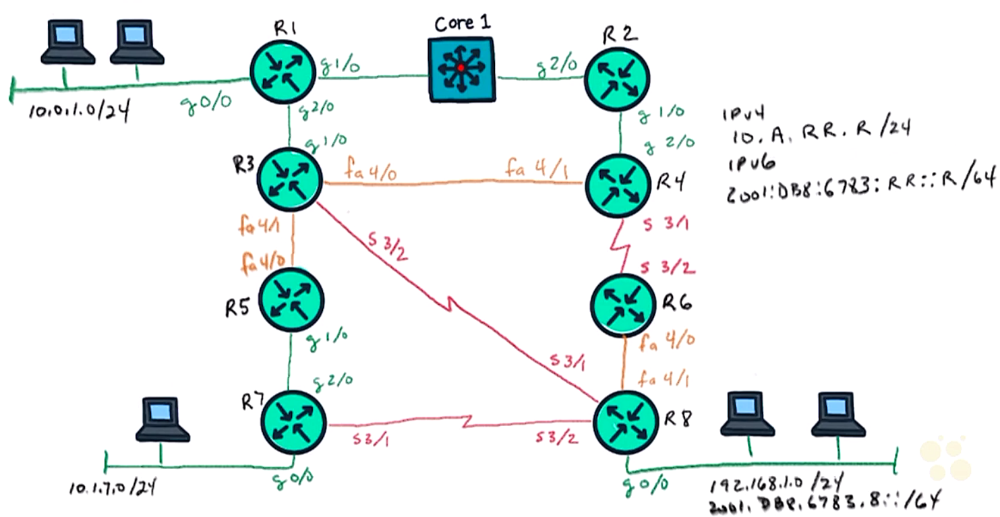
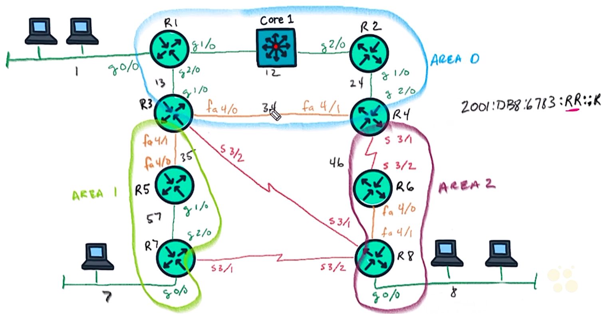

# Routing Authentication


## 26. EIGRP Neighbor Relationships and Authentication


### Neighborship Overview

- EIGRP neighbors overview
  - requirements:
    - same autonomous system number w/ multicast addr 224.0.0.10 
    - agreed k values: lowest bandwidth on path, delays
    - authentication
    - ACLs to permit 224.0.0.10 & traffic btw
  - IP mask not critical to form EIGRP neighbor
    - R3 subnet: 10.1.35.0/24
    - R5 subnet: 10.1.35.0/25
    - still able to form EIGRP neighbor

  <figure style="margin: 0.5em; display: flex; justify-content: center; align-items: center;">
    
  </figure>

### Authentication Overview

- EIGRP authentication plan
  - classic mode on R1
  - named mode on R2
  - authenticate R1 & R2
  - IPv4 using AS #4
  - IPv6 using AS #6
  - key chain: 6783 cisco


- Demo: config EIGRP authentication on R1

  ```text
  ! Classic IPv4
  R1# conf t
  R1(config)# router eigrp 4
  R1(config-router)# network 0.0.0.0
  R1(config-router)# end

  ! Classic IPv6
  R1# conf t
  R1(config)# ipv6 unicst-routing
  R1(config)# ipv6 router eigrp 6
  R1(config-rtr)# no shutdown
  R1(config-rtr)# exit
  R1(config)# int gig 0/0
  R1(config-if)# ipv6 eigrp 6
  R1(config-if)# int gig 1/0
  R1(config-if)# ipv6 eigrp 6
  ```

  ```text
  R1(config-if)# int gig 2/0
  R1(config-if)# ipv6 eigrp 6
  R1(config-if)# int gig 4/0
  R1(config-if)# ipv6 eigrp 6
  R1(config-if)# int gig 4/1
  R1(config-if)# ipv6 eigrp 6
  R1(config-if)# int ser 3/1
  R1(config-if)# ipv6 eigrp 6
  R1(config-if)# int ser 3/1
  R1(config-if)# ipv6 eigrp 6
  R1(config-if)# int loop 0
  R1(config-if)# ipv6 eigrp 6
  R1(config-if)# end

  R1# show ip eigrp interfaces
  EIGRP-IPv4 Interfaces for AS(4)
              Xmit    Queue         Peer        Mean  Pacing Time   Multicast   Pending
  Interface   Peers   Un/Reliable   Un/Reliable SRTT  Un/Reliable   Flow Timer  Routes
  Gi0/0         0         0/0        0/0          0      0/0            0          0
  Gi1/0         0         0/0        0/0          0      0/0            0          0
  Gi2/0         0         0/0        0/0          0      0/0            0          0
  Lo0           0         0/0        0/0          0      0/0            0          0

  R1# show ipv6 eigrp interfaces
  EIGRP-IPv4 Interfaces for AS(4)
              Xmit    Queue         Peer        Mean  Pacing Time   Multicast   Pending
  Interface   Peers   Un/Reliable   Un/Reliable SRTT  Un/Reliable   Flow Timer  Routes
  Gi0/0         0         0/0        0/0          0      0/0            0          0
  Gi1/0         0         0/0        0/0          0      0/0            0          0
  Gi2/0         0         0/0        0/0          0      0/0            0          0

  ! config key chain
  R1# conf t
  R1(config)# key chain Demo-Chain
  R1(config-keychain)# key 6783
  R1(config-keychain-key)# key-string cisco
  R1(config-keychain-key)# do show key chain
  Key-chain Demo-Chain:
    key 6783 -- text "cisco"
      accept lieftime (always valid) - (always valid) [valid now]
      send lifetime (always valid) - (always valid) [valid now]

  ! apply key chain to g1/0
  R1(config-keychain-key)# int g1/0
  R1(config-if)# ip authentication key-chain eigrp 4 Demo-Chain
  R1(config-if)# ip authentication mode eigrp 4 md5
  R1(config-if)# end

  ! verify 
  R1# show ip eigrp interfaces detail
  EIGRP-IPv4 Interfaces for AS(4)
              Xmit    Queue         Peer        Mean  Pacing Time   Multicast   Pending
  Interface   Peers   Un/Reliable   Un/Reliable SRTT  Un/Reliable   Flow Timer  Routes
  Gi0/0         0         0/0        0/0          0      0/0            0          0
    <...truncated...>
  Gi1/0         0         0/0        0/0          0      0/0            0          0
    <...truncated...>
    Authentication mode is md5,  key-chain is "Demo-Chain"
  Gi2/0         0         0/0        0/0          0      0/0            0          0
  <...authenticated...>

  ! enable authentication for IPv6
  R1# conf t
  R1(config)# int g1/0
  R1(config-if)# ipv6 authentication key-chain eigrp 6 Demo-Chain
  R1(config-if)# ipv6 authentication mode eigrp 6 md5
  R1(config-if)# end

  R1# show ipv6 eigrp interfaces detail
  EIGRP-IPv4 Interfaces for AS(4)
              Xmit    Queue         Peer        Mean  Pacing Time   Multicast   Pending
  <...truncated...>
  Gi1/0         0         0/0        0/0          0      0/0            0          0
    <...truncated...>
    Authentication mode is md5,  key-chain is "Demo-Chain"
  <...authenticated...>
  ```

- Demo: config EIGRP authentication on R2

  ```text
  ! config key chain
  R2# conf t
  R2(config)# key-chain Demo-Chain
  R2(config-keychain)# key 6783
  R2(config-keychain-key)# key-string cisco
  R2(config-keychain-key)# end

  ! named config
  R2# conf t
  !remove previous protocols
  R2(config)# no router eigrp 4
  R2(config)# no ipv6 router eigrp 6

  R2(config)# ipv6 unicast-routing
  R2(config-router)# router unicast-routing
  R2(config-router)# router eigrp Demo-Named-EIGRP
  R2(config-router)# address-family ipv4 unicast autonomous-system 4
  R2(config-router-af)# network 0.0.0.0
  R2(config-router-af)# exit

  R2(config-router)# do show key chain
  Key-chain Demo-Chain:
    key 6783 -- text "cisco"
      <...truncated..>

  ! apply the key chain for all IPv4 interfaces
  R2(config-router)# address-family ipv4 unicast autonomous-system 4
  R2(config-router-af)# af-interface default
  R2(config-router-af-interface)# authentication mode md5
  R2(config-router-af-interface)# authentication key-chain Demo-Chain
  R2(config-router-af-interface)# address-family ipv6 unicast autonomous-system 6
  R2(config-router-af)# af-interface default
  R2(config-router-af-interface)# authentication mode md5
  R2(config-router-af-interface)# authentication key-chain Demo-Chain
  R2(config-router-af-interface)# end
  ```

  ```text
  R2# show ipv6 eigrp neighbors
  EIGRP-IPv4 VR(Demo-Named_EIGRP) Address-Family Neighbors for AS(4)
  H   Address         Interface       Hold Uptime   SRTT   RTO  Q  Seq
                                      (sec)         (ms)       Cnt Num
  0   10.1.12.1       Gi2/0             12 00:00:56 1559  5000  1  3
  ! H: a sequence number to represent the order of adjacency formed
  ! Interface: the local interface paring w/ the neighbor from
  ! Hold timer: 15 seconds by default but refresh 5 sec periodically
  ! Uptime: how long having the neighborship
  ! SRRT: smoothed round-trip times
  ! RTO: retransition interval
  ! Q: the number of outstanding requests to form neighbor, expecting 0 in most cases
  ! seq num: packets of negotiation flow btw neighbors

  R2# show ip eigrp neighbors
  EIGRP-IPv4 VR(Demo-Named_EIGRP) Address-Family Neighbors for AS(4)
  H   Address         Interface       Hold Uptime   SRTT   RTO  Q  Seq
                                      (sec)         (ms)       Cnt Num
  0   10.1.12.1       Gi2/0             11 00:03:49 1559  5000  1  3
    Version 11.0/2.0, Tetrans: 1, Retries: 0, Prefixes: 3
    Topology-ids from peer - 0

  R2# show ip route eigrp
  Gateway of last resort is not set.
      1.0.0.0/32 is subnetted, 1 subnets
  D    1.1.1.1 [90/2570240] via 10.0.12.1, 00:.4:59, GigabitEthernet2/0
      10.0.0.0/8 is variably subnetted, 8 subnets, 2 masks
  D    10.0.1.0/24 [90/15360] via 10.0.12.1 00:.4:59, GigabitEthernet2/0
  D    10.0.13.0/24 [90/15360] via 10.0.12.1 00:.4:59, GigabitEthernet2/0
  ```


### EIGRP Hands on Lab with Authentication

- Plan: EIGRP authentication
  - topology
    - IPv4 addr space: 10.A.RR.R/24
    - IPv6 addr space: 2001.DB8:6783:RR:R/64
    - subnet for R3 & R4: RR = 34
    - subnet for R3 & R8: RR = 38
  - tasks
    - R1: EIGRP classic mode for IPv4 & IPv6
    - other routers: EIGRP Named mode for IPv4 & IPv6
    - authentication for all routers


- Demo: config EIGRP authentication

  ```cfg
  ! Key chain all routers
  conf t
  key chain Demo-Chain
  key 36783
  key-string cisco
  exit
  ```

  ```cfg
  ! Classic on R1
  conf t
  router eigrp 4
  network 0.0.0.0
  exit
  ipv6 unicast-routing
  ipv6 router eigrp 6
  no shutdown
  exit

  int g2/0
  ipv6 eigrp 6
  ip authentication key-chain eigrp 4 Demo-Chain
  ip authentication mode eigrp 4 md5
  ip authentication key-chain eigrp 6 Demo-Chain
  ip authentication mode eigrp 6 md5

  int g1/0
  ipv6 eigrp 6
  ip authentication key-chain eigrp 4 Demo-Chain
  ip authentication mode eigrp 4 md5
  ip authentication key-chain eigrp 6 Demo-Chain
  ip authentication mode eigrp 6 md5

  int g0/0
  ipv6 eigrp 6
  ip authentication key-chain eigrp 4 Demo-Chain
  ip authentication mode eigrp 4 md5
  ip authentication key-chain eigrp 6 Demo-Chain
  ip authentication mode eigrp 6 md5
  ```

  ```cfg
  ! All other routers in named mode (R2 ~ R8)
  conf t
  ipv6 unicast-routing
  router eigrp DemoEIGRP
  address-family ipv4 unicast autonomous-system 4
  network 0.0.0.0
  af-interface default
  authenticaton key-chain Demo-Chain
  authentication mode md5
  exit
  exit
  address-family ipv6 unicast autonomous-system 6
  af-interface default
  authentication key-chain Demo-Chain
  authentication mode md5
  end
  ```

- Demo: verify EIGRP neighbors

  ```text
  R8# show ip eigrp neighbors
  EIGRP-IPv4 VR(DemoEIGRP) Address-Family Neighbors for AS(4)
  H   Address         Interface       Hold Uptime   SRTT   RTO  Q  Seq
                                      (sec)         (ms)       Cnt Num
  2   10.78.0.7       Se3/2             13 00:00:06   45   270  0  14
  1   10.2.68.6       Fa4/1             14 00:00:07   39   234  0  12
  0   10.38.0.3       Se3/1             13 00:00:09   39  2340  0  27

  R8# show ipv6 eigrp neighbors
  EIGRP-IPv6 VR(DemoEIGRP) Address-Family Neighbors for AS(6)
  H   Address               Interface   Hold Uptime   SRTT   RTO  Q  Seq
                                        (sec)         (ms)       Cnt Num
  2   Link-local addresses: Se3/2         12 00:00:12   24   144  0  11
      FE80:C807:14FF:FEF4:6
  1   Link-local addresses: Fa4/1         13 00:00:13   23   138  0  10
      FE80:C805:15FF:FE78:70
  0   Link-local addresses: Se3/1         13 00:00:16   22  2370  0  19
      FE80:C803:18FF:FE64:6

  R8# show eigrp address-family ipv4 neighbor
  EIGRP-IPv4 VR(DemoEIGRP) Address-Family Neighbors for AS(4)
  H   Address         Interface       Hold Uptime   SRTT   RTO  Q  Seq
                                      (sec)         (ms)       Cnt Num
  2   10.78.0.7       Se3/2             13 00:00:21   45   270  0  14
  <...truncated...>

  R8# show eigrp address-family ipv6 neighbor
  EIGRP-IPv6 VR(DemoEIGRP) Address-Family Neighbors for AS(6)
  H   Address               Interface   Hold Uptime   SRTT   RTO  Q  Seq
                                        (sec)         (ms)       Cnt Num
  2   Link-local addresses: Se3/2         12 00:00:12   24   144  0  11
  <..truncated...>

  R8# show ip eigrp interfaces
  EIGRP-IPv4 VR(DemoEIGRP) Address-Family Interfaces for AS(4)
              Xmit    Queue         Peer        Mean  Pacing Time   Multicast   Pending
  Interface   Peers   Un/Reliable   Un/Reliable SRTT  Un/Reliable   Flow Timer  Routes
  Gi0/0         0         0/0        0/0          0      0/0            0          0
  Se3/1         1         0/0        0/0         39     10/390        558          0
  Se3/2         1         0/0        0/0         45      0/16         216          0
  Se4/1         1         0/0        0/0         39      00           148          0
  Lo0           0         0/0        0/0          0      0/0            0          0

  R8# show ipv6 eigrp interfaces
  EIGRP-IPv6 VR(DemoEIGRP) Address-Family Interfaces for AS(6)
              Xmit    Queue         Peer        Mean  Pacing Time   Multicast   Pending
  Interface   Peers   Un/Reliable   Un/Reliable SRTT  Un/Reliable   Flow Timer  Routes
  Gi0/0         0         0/0        0/0          0      0/0            0          0
  Se3/1         1         0/0        0/0         22     15/390        487          0
  Se3/2         1         0/0        0/0         24      0/16          96          0
  Se4/1         1         0/0        0/0         23      00            80          0

  R8# show eigrp address-family ipv6 interfaces
  EIGRP-IPv6 VR(DemoEIGRP) Address-Family Interfaces for AS(6)
              Xmit    Queue         Peer        Mean  Pacing Time   Multicast   Pending
  Interface   Peers   Un/Reliable   Un/Reliable SRTT  Un/Reliable   Flow Timer  Routes
  Gi0/0         0         0/0        0/0          0      0/0            0          0
  Se3/1         1         0/0        0/0         22     15/390        487          0
  Se3/2         1         0/0        0/0         24      0/16          96          0
  Se4/1         1         0/0        0/0         23      00            80          0

  R8# show ip eigrp topology
  EIGRP-IPv4 VR(DemoEIGRP) Topology Table for AS(4)/ID(8.8.8.8)
  Codes: P - Passive, A - Active, U - Update, Q - Query, R - Reply,
         r - reply Status, s - sia Status
  
  P 10.1.5.0/24, 1 successors, FD is 1736486678
          via 10.78.0.7 (1736486678/1966080), Serial3/2
          via 10.38.0.3 (11557928960/13762560), Serial3/2
  <...truncated...>

  R8# show eigrp address-family ipv4 topology
  EIGRP-IPv4 VR(DemoEIGRP) Topology Table for AS(4)/ID(8.8.8.8)
  Codes: P - Passive, A - Active, U - Update, Q - Query, R - Reply,
         r - reply Status, s - sia Status
  
  P 10.1.5.0/24, 1 successors, FD is 1736486678
          via 10.78.0.7 (1736486678/1966080), Serial3/2
          via 10.38.0.3 (11557928960/13762560), Serial3/2
  <...truncated...>
  ```


- Demo: control the order of neighbors learned
  - task: Se3/1 on R8 not learned first

  ```text
  R8(config)# int ser 3/1
  R8(config-if)# shutdown
  R8(config-if)# end

  R8# clear eigrp address-family ipv4 neighbors
  ! clear all neighborship and reestablish adjacency

  R8# show ip eigrp neighbors
  EIGRP-IPv4 VR(DemoEIGRP) Address-Family Neighbors for AS(4)
  H   Address         Interface       Hold Uptime   SRTT   RTO  Q  Seq
                                      (sec)         (ms)       Cnt Num
  1   10.78.0.7       Se3/2             11 00:00:16   56   270  0  28
  0   10.2.68.6       Fa4/1             11 00:00:19   24   234  0  26

  R8# conf t
  R8(config)# int ser 3/1
  R8(config-if)# no shutdown
  R8(config-if)# end

  R8# show ip eigrp neighbors
  EIGRP-IPv4 VR(DemoEIGRP) Address-Family Neighbors for AS(4)
  H   Address         Interface       Hold Uptime   SRTT   RTO  Q  Seq
                                      (sec)         (ms)       Cnt Num
  3   10.38.0.3       Se3/1             11 00:00:07   13  2340  0  65
  1   10.78.0.7       Se3/2             11 00:00:16   56   270  0  38
  0   10.2.68.6       Fa4/1             11 00:00:19   24   234  0  34
  ```


## 27. Troubleshoot OSPF Authentication for IPv4


### Overview of OSPF Authentication

- OSPF authentication overview
  - preventing from hacker on subnets as an OSPF fully adjacent router
  - authentication options
    - NULL (0): no authentication
    - simple/ plain text (1): authentication using plain text key
    - MD5/encrypted (2): using MD5 to encrypting key
  - locations to apply authentication
    - area
    - interfaces #\to$ more secure & predecent


- Planning OSPF authentication
  - area 0: no authentication
  - area 1: plain text key authentication
  - area 2: md5 authentication

  <figure style="margin: 0.5em; display: flex; justify-content: center; align-items: center;">
    
  </figure>

- Demo: config and verify all routers
  - general config for all routers

    ```cfg
    ! config apply to all routers (R1~R8)
    conf t
    ip router ospf 1
    area 1 authentication
    area 2 authentication message-digest
    end
    ```
  
  - config R1 and all other routers

    ```text
    R1# conf t
    R1(config)# ip router ospf 1
    R1(config-router)# area 1 authentication
    R1(config-router)# area 2 authentication message-digest
    R1(config-router)# end
    ```

  - verify OSPF 

    ```text
    R1# show ip ospf
      Routing Process "ospf 1" with ID 1.1.1.1 
      <...truncated...>
        Area BACKBONE(0) 
            Number of interfaces in this area is 4 (1 loopback)
            Area has no authentication
            <...truncated...>
    
    R1# show ip ospf int g0/0
    GigabitEthernet0/0 is up, line protocol is up
      <...truncated...>
      Neighbor Count is 0, Adjacent neighbor count is 0
      Suppresses hello for 0 neighbor(0)
    ! nothing about authentication due to area 0
    ```

    ```text
    R5# show ip ospf
      Routing Process "ospf 1" with ID 1.1.1.1 
      <...truncated...>
        Area 1 
            Number of interfaces in this area is 4 (1 loopback)
            Area has simple password authentication
            <...truncated...>
        Area 2
            Number of interfaces in this area is 0
            Area has message digest authentication
      <...truncated...>

    R5# show ip ospf int g1/0
    GigabitEthernet0/0 is up, line protocol is up
      <...truncated...>
      Suppresses hello for 0 neighbor(0)
      Simple password authentication enabled

    ! area 2 routers still forming adjacency even not key set 
    ```


- Demo: config key for OSPF Area 1 routers
  - task: enable plain text password for authentication on interfaces btw R3 & R5 and R5 & R7
  - command to set plain text key: `ip ospf authentication-key cisco123`
  - apply the plain text key to interfaces on R3, R5 & R7

    ```text
    R3(config)# int f4/1
    R3(config-if)# ip ospf authentication-key cisco123

    R5(config-if)# show ip cdp neighbors
    Device ID     Local Intrfce   Holdtme    Capability  Platform  Port ID
    R3            Fas 4/0         165           R        7206VXR   Fas 4/1
    R7            Gig 1/0         141           R        7206VXR   gig 2/0

    R5(config)# int f4/0
    R5(config-if)# do debug ospf adj
    OSPF-1 ADJ  Fa4/0: Rcv pkt from 10.1.35.3,  :  Mismatched Authentication Key - Clear Text

    R5(config-if)# ip ospf authentication-key cisco123
    OSPF-1 ADJ  Fa4/0: 2 Way Communicastion to 3.3.3.3, state 2WAY
    <...truncated...>
    %OSPF-5-ADJCHG: Process 1, Nbr 3.3.3.3 on FastEthernet4/0 from LOADING to FULL, Loading Done
    R5(config-if)# end
    R5# undebug all

    ! same process applied to g1/0 on R3 and g2/0 on R7
    ```

- Demo config MD5 key for OSPF Area 2 routers
  - task: enable MD5 key for authentication on interfaces btw R6 & R8
  - cmd to set MD5 key: `ip ospf message-digest-key 1 md5 cisco123`
  - apply the md5 key to interfaces on R6 and R8

    ```text
    R6# show ip ospf
      Routing Process "ospf 1" with ID 1.1.1.1 
      <...truncated...>
        Area 2
            Number of interfaces in this area is 0
            Area has message digest authentication
      <...truncated...>
    ```

    ```text
    R6# show cdp neighbor
    Device ID     Local Intrfce   Holdtme    Capability  Platform  Port ID
    R4            Fas 3/2         133           R        7206VXR   Ser 3/1
    R8            Fas 4/0         179           R        7206VXR   Fas 4/1

    R6# show ip ospf int f4/0
    FastEthernet4/0 is up and line protocol is up
    <...truncated...>
      Message digest authentication enabled
        No Key configured, using default key id 0

    R6# conf t
    R6(config)# int f4/0
    R6(config-if)# ip ospf message-digest-key 1 md5 cisco123

    R8(config)$ int f4/1
    R8(config-if)# ip ospf message-digest-key 1 md5 cisco123
    R8(config-if)# end
    ```

- Demo: config NULL authentication on OSPF Area 2
  - task: config null authentication btw R4 & R6

  ```text
  R4(config)# int ser 3/1
  R4(config-if)# ip ospf authentication null

  R6(config)# int ser 3/2
  R6(config-if)# ip ospf authentication null
  ```


### Implement OSPF Authentication

- Demo: config OSPF authentication
  - tasks
    - Area 0 w/ MD5 authentication
    - password: Cisco!23
    - R1 & R2 MD5 pw
    - R3 & R4 simple pw
    - R2 & R4 no auth
  - general config for R1 ~ R4
    
    ```cfg
    conf t
    router ospf 1
    area 0 authentication message-digest
    end
    ```

  - config R1 & R2 w/ MD5 pwd

    ```text
    R1# show cdp neighbors
    Device ID     Local Intrfce   Holdtme    Capability  Platform  Port ID
    Core1         Gig 1/0         119           R S I    IOSv      Gig 1/0
    R3            Gig 2/0         155             R      7206VXR   Gig 1/0

    R1# conf t
    R1(config)# int g1/0
    R1(config-if)# ip ospf message-digest-key 1 md5 cisco123
    R1(config-if)# end
    ```

    ```text
    R2# show cdp neighbors
    Device ID     Local Intrfce   Holdtme    Capability  Platform  Port ID
    Core1         Gig 2/0         138           R S I    IOSv      Gig 2/0
    R4            Gig 1/0         173             R      7206VXR   Gig 2/0

    R2# conf t
    R2(config)# int g1/0
    R2(config-if)# ip ospf message-digest-key 1 md5 cisco123
    R2(config-if)# end
    ```

  - config R1 & R3 w/ simple pwd

    ```text
    ! verify R3 interface
    R3# show cdp neighbors
    Device ID     Local Intrfce   Holdtme    Capability  Platform  Port ID
    R1            Gig 1/0         138             R      7206VXR   Gig 2/0
    R4            Gig 4/0         160             R      7206VXR   Fas 4/1
    R5            Gig 4/1         168             R      7206VXR   Fas 4/0
    R8            Gig 3/2         157             R      7206VXR   Ser 3/1

    R3# show ip ospf int f4/0
    FastEthernet4/0 is up, line protocol is up
      <...truncated...>
      Message digest authentication enabled
        No key configured, using default key 0

    ! config f4/0 on R3 w/ simple password 
    R3# conf t
    R3(config)# int f4/0
    R3(config-if)# ip ospf authentication
    R3(config-if)# do show ip ospf int f4/0
    FastEthernet4/0 is up, line protocol is up
      <...truncated...>
      Simple password authentication enabled

    R3(config-if)# ip ospf authentication-key cisco123

    ! config f4/1 on R4 w/ simple password
    R4(config)# int f4/1
    R4(config-if)# do debug ip ospf adjacency
    OSPF-1 ADJ  Fa4/1: Rcv pkt from 10.0.34.3 : Mismatched Authentication type. 
      Input packet specified type 1, ...
    R4(config-if)# ip ospf authentication-key cisco1233
    R4(config-if)# end
    %OSPF-5=ADJCHG: Process 1, Nbr 3.3.3.3 on FastEthernet4/1 from LOADING to FULL, Loading Done

    R4# undebug all
    R4# show ip ospf neighbors
    Neighbor ID     Pri State     Dead Time Address     Interface
    3.3.3.3         1   FULL/BDR  00:00:36  10.0.34.3   FastEthernet4/1
    2.2.2.2         1   FULL/BDR  00:00:35  10.0.24.2   GigabitEthernet2/0
    6.6.6.6         1   FULL/BDR  00:00:35  10.0.46.2   Serial3/1
    ```

  - config R2 & R4 w/o authentication

    ```text
    R2# show cdp neighbors
    Device ID     Local Intrfce   Holdtme    Capability  Platform  Port ID
    Core1         Gig 2/0         138           R S I    IOSv      Gig 2/0
    R4            Gig 1/0         173             R      7206VXR   Gig 2/0

    R2# conf t
    R2(config)# int g1/0
    R2(config-if)# ip ospf authentication null

    R4# show cdp neighbors
    Device ID     Local Intrfce   Holdtme    Capability  Platform  Port ID
    R2            Gig 2/0         158             R      7206VXR   Gig 1/0
    R3            Fas 4/1         158             R      7206VXR   Gig 4/0
    R6            Ser 3/1         137             R      7206VXR   Ser 3/2

    R4# conf t
    R4(config)# int g2/0
    R4(config-if)# ip ospf authentication null
    R4(config-if)# end
    ```

- Demo: verify reachability

  ```text
  R7# traceroute 192.168.1.8
  Tracing the route to 192.168.1.8
  VRF info: (vrf in name/id, vrf out name/id)
    1 10.1.57.5 100 ms ...
    2 10.1.35.3 64 ms ...
    3 10.0.13.1 96 ms ...
    4 10.0.12.2 88 ms ...
    5 10.0.24.4 276 ms ...
    6 10.2.46.6 176 ms ...
    7 10.2.68.8 148 ms ...
  ```


### Virtual Links and Authentication

- Virtual links of OSPF routing
  - all areas of OSPF physically connected to the backbone area (Area 0)
  - some cases making it impossible, e.g., an area connect to R8 w/ its own Area, said Area 50 and IP addr space 10.50.50.0/24
  - solution: virtual link
    - connecting to the backbone through a non-backbone area
    - transit area: the area configured the virtual link
    - transit area must have full routing info
    - a stub area not allowed
    - e.g., a virtual link config through Area 2 to link R4 and R8
  - recommendations
    - not a preferred solution
    - often just a temporary solution
  - authentication scenario
    - Area 0 w/ MD5 authentication
    - R8 connected to Area 0 via R4
    - R8 config to Area 0 w/ DM5 authentication


### Troubleshooting OSPF Authentication Lab 01

- Demo: troubleshooting OSPF authentication
  - topology
    - PC7 connected to 10.1.7.0/24 subnet
    - PC8 connect to 192.168.1.0/24 subnet
  - task: PC7 abel to ping PC8

  ```text
  PC7> show ip
  NAME      : PV-7[1]
  IP/MASK   : 10.1.7.10/24
  GATEWAY   : 10.1.7.7
  <...truncated...>

  R7# show ip route ospf
  Gateway of last resort is not set
    5.0.0.0/323 is subnetted, 1 subnets
  O     5.5.5.5 [110/2] via 10.1.57.5, 00:22:56, GigbitEThernet2/0
      10.0.0.0/8 is variably subnetted, 9 subnets, 2 masks
  O     10.1.5.0/24 [110/2] via 10.1.57.5, 00:22:56, GigabitEThernet2/0
  O     10.1.35.0/24 [110/11] via 10.1.57.5, 00:22:56, GigabitEthernet2/0

  R8# show ip int brief
  Interface           IP-Address    OK? Method  Status                Protocol
  GigabitEthernet0/0  192.168.1.8   YES NVRAM   up                    up
  <..truncated...>

  R7# traceroute 192.168.1.8
  <...truncated...>
    1  * 

  R7# show ip route
  Gateway of last resort is not set
      5.0.0.0/323 is subnetted, 1 subnets
  O     5.5.5.5 [110/2] via 10.1.57.5, 00:22:56, GigbitEThernet2/0
      7.0.0.0/32 is subnetted, 1 subnets
  C     7.7.7.7 is directly connected, Loopback0
      10.0.0.0/8 is variably subnetted, 9 subnets, 2 masks
  O     10.1.5.0/24 [110/2] via 10.1.57.5, 00:22:56, GigabitEThernet2/0
  C     10.1.7.0/24 is directly connected, GigabitEThernet0/0
  L     10.1.7.7/32 is directly connected, GigabitEThernet0/0
  O     10.1.35.0/24 [110/11] via 10.1.57.5, 00:22:56, GigabitEthernet2/0
  C     10.1.57.0/24 is directly connected, GigabitEThernet2/0
  L     10.1.57.7/32 is directly connected, GigabitEThernet2/0
  C     10.1.78.0/24 is directly connected, Searial3/1
  L     10.1.78.7/32 is directly connected, Searial3/1
  C     10.1.78.8/32 is directly connected, Searial3/1
  ! no 192.168.1.0/24 subnet

  R7# show ip ospf neighbors
  Neighbor ID     Pri State     Dead Time Address     Interface
  5.5.5.5           1 FULL/BDR  00:00:36  10.1.57.5   GigabitEthernet2/0

  R5# show ip ospf neighbors
  Neighbor ID     Pri State     Dead Time Address     Interface
  7.7.7.7           1 FULL/BDR  00:00:30  10.1.57.7   GigabitEthernet1/0

  R5# show ip ospf int brief
  Interface   PID Area  IP Address/Mask Cost  State Nbrs F/C
  Lo0         1   1     5.5.5.5         1     LOOP  0/0
  Fa4/0       1   1     10.1.35.5/24    10    DR    0/0
  Gi1/0       1   1     10.1.57.5/24    1     BDR   1/1
  Gi0/0       1   1     10.1.5.5/24     1     DR    0/0

  R5# show cdp neighbors
  Device ID     Local Intrfce   Holdtme    Capability  Platform  Port ID
  R3            Fas 4/0         160             R      7206VXR   Fas 4/1
  R7            Gig 1/0         174             R      7206VXR   Gig 2/0

  R5# debug ip ospf adjacency
  R5# ping 10.1.35.3
  !!!!!
  
  R3# show ip ospf int brief
  Interface   PID Area  IP Address/Mask Cost  State Nbrs F/C
  Lo0         1   0     3.3.3.3         1     LOOP  0/0
  Fa4/0       1   0     10.1.34.5/24    10    DR    1/1
  Gi1/0       1   0     10.1.13.5/24    1     DR    1/1
  Gi0/0       1   0     10.1.3.3/24     1     DR    0/0
  Fa4/1       1   1     10.1.35.3/24    10    DR    0/0

  R3# sho cdp neighbors
  Device ID     Local Intrfce   Holdtme    Capability  Platform  Port ID
  R1            Gig 1/0         169             R      7206VXR   Gig 2/0
  R4            Fas 4/0         172             R      7206VXR   Fas 4/1
  R5            Fas 4/1         155             R      7206VXR   Fas 4/0
  R8            Ser 3/2         160             R      7206VXR   Ser 3/1

  R5# show ip ospf int f4/0
  FastEthernet4/0 is up, line protocol is up
      <...truncated...>
      Suppress hello for 0 neighbor(s)
  
  R3# show ip ospf int f4/1
  FastEthernet4/1 is up, line protocol is up
      <...truncated...>
      Timer intervals configured, Hello 11, Dead 44, Wait 44, Retransmit 5
      <...truncated...>
      Suppress hello for 0 neighbor(s)

  R3# conf
  R3(config)# int f4/1
  R3(config-if)# no ip ospf hello-interval
  R3(config-if)# end
  %OSPF-5-ADJCHG: Process 1. Nbr 5.5.5.5 on FastEthernet4/1 from LOADING to FULL, Loading Done
  R3(config-if)# end

  R3# show ip ospf neighbors
  Neighbor ID     Pri State     Dead Time Address     Interface
  4.4.4.4           1 FULL/BDR  00:00:34  10.0.34.4   FastEthernet4/0
  1.1.1.1           1 FULL/BDR  00:00:32  10.0.13.1   GigabitEthernet1/0
  5.5.5.5           1 FULL/BDR  00:00:32  10.0.35.5   FastEthernet4/1

  R7# show ip route ospf
  Gateway of last resort is not set
        1.0.0.0/32 is subnetted, 1 subnets
  O IA    1.1.1.1 [110/13] via 10.1.57.5, 00:00:20, GigbitEThernet2/0
  <...truncated...>
  O IA    10.2.6.0/24 [110/662] via 10.1.57.5, 00:00:20, GigabitEThernet2/0
  O IA    10.2.46.0/24 [110/661] via 10.1.57.5, 00:00:20, GigabitEThernet2/0
  O IA    10.2.68.0/24 [110/671] via 10.1.57.5, 00:00:20, GigabitEThernet2/0
  ! no 192.16.1.0 subnet

  R8# show ip ospf int brief
  Interface   PID Area  IP Address/Mask Cost  State Nbrs F/C
  Lo0         1   2     8.8.8.8         1     LOOP  0/0
  Gi0/0       1   2     192.16.1.8/24   1     DR    0/0
  Fa4/1       1   2     10.2.68.8/24    10    DR    0/0
  ! 192.16.1.8 enabled

  R4# show ip route ospf
  Gateway of last resort is not set
        1.0.0.0/32 is subnetted, 1 subnets
  O       1.1.1.1 [110/3] via 10.1.24.2, 00:27:55, GigbitEThernet2/0
        2.0.0.0/32 is subnetted, 1 subnets
  <...truncated...>
  O       10.2.6.0/24 [110/648] via 10.2.46.6, 00:29:06, Serial3/1
  O       10.2.68.0/24 [110/648] via 10.2.46.6, 00:14:46, Serial3/1
  ! no 192.168.1.0/24 subnet

  R6# show ip ospf int brief
  Interface   PID Area  IP Address/Mask Cost  State Nbrs F/C
  Lo0         1   2     6.6.6.6         1     LOOP  0/0
  Fa4/0       1   2     10.2.68.6/24    10    DR    0/0
  Se3/2       1   2     10.2.46.6/24    647   P2P   1/1
  Gi0/0       1   2     10.2.6.6/24     1     DR    0/0

  R6# show ip ospf neighbor
  Neighbor ID     Pri State     Dead Time Address     Interface
  4.4.4.4           0 FULL/     00:00:39  10.2.46.4   Serial3/
  ! no neighborship w/ R8

  R6# debug ip ospf adjacency
  OSPF-1 ADJ Fa4/0: Rcv pkt from 10.2.68.8 : Mismatched Authentication type. 
    Input packet specified type 2, we use type 0

  R6# show ip ospf
  <...truncated...>
    Area 2
      Number of interfaces in this area is 4 (1 loopback)
      Area has no authentication
  <...truncated...>


  R8# show ip ospf int f4/1
  <...truncated...>
    Message digest authentication enabled
      No key configured, using default key id 0

  R8# conf t
  R8(config)# int f4/1
  R8(config-if)# no ip ospf authentication
  R8(config-id)# end

  R7# show ip route ospf
  Gateway of last resort is not set
      1.0.0.0/323 is subnetted, 1 subnets
  O     1.1.1.1 [110/13] via 10.1.57.5, 00:5:33, GigbitEThernet2/0
  <...truncated...>
  O IA 192.168.1.0/24 [110/672] via 10.1.57.5, 00:00:38, GigabitEthernet2/0

  PC7> trace 192.168.1.8 -P 1
  trace to 192.168.1.8, 8 hops max (ICMP), press Ctrl-C to stop
   1  10.1.7.7    130.970 ms ...
   2  10.1.57.5   24.365 ms ...
   3  10.1.35.3   45.998 ms ...
   4  10.0.13.1   51.991 ms ...
   5  10.0.12.2   87.006 ms ...
   6  10.0.24.4   1104.008 ms ...
   7  10.2.46.6   119.999 ms ...
   8  192.168.1.8 170.896 ms ...
  ```


### Troubleshooting OSPF Authentication Lab 02

- Demo: troubleshooting OSPF authentication w/ virtual link
  - topology:
    - a subnet 10.50.50.0/24 connected to R8
    - the subnet w/ OSPF Area 50
    - a loopback interface (Lo50) w/ 10.50.50.50/24 used to represent a use
    - PC7 w/ subnet 10.1.7.0/24 connected to R7
  - task: PC7 able to reach Lo50

  ```text
  R7# show ip route ospf
  Gateway of last resort is not set
        1.0.0.0/32 is subnetted, 1 subnets
  O IA    1.1.1.1 [110/13] via 10.1.57.5, 00:26:12, GigbitEThernet2/0
  <...truncated...>
  O       10.1.35.0/24 [110/11] via 10.1.57.5, 00:00:20, GigabitEThernet2/0
  O IA    10.2.46.0/24 [110/661] via 10.1.57.5, 00:00:20, GigabitEThernet2/0
  ! no 10.50.50.50 subnet

  R4# show ip route ospf
  Gateway of last resort is not set
        1.0.0.0/32 is subnetted, 1 subnets
  O IA    1.1.1.1 [110/13] via 10.0.24.2, 00:25:05, GigbitEThernet2/0
  <...truncated...>
  O IA    10.1.5.0/24 [110/14] via 10.0.24.2, 00:25:05, GigabitEThernet2/0
  O IA    10.1.7.0/24 [110/15] via 10.0.24.2, 00:25:05, GigabitEThernet2/0
  O IA    10.1.35.0/24 [110/14] via 10.0.24.2, 00:25:05, GigabitEThernet2/0
  O IA    10.1.57.0/24 [110/14] via 10.0.24.2, 00:25:05, GigabitEThernet2/0
  ! no 10.50.50.50 subnet

  R8# show ip route connected
  Gateway of last resort is not set
        8.0.0.0/32 is subnetted, 1 subnets
  C      8.8.8.8 is directly connected, Loopback0
        10.0.0.0/32 is subnetted, 11 subnets, 2 masks
  <...truncated...>
  C     10.50.50.50/32 is directly connected, Loopback50
  <...truncated...>

  R8# show ip ospf int brief
  Interface   PID Area  IP Address/Mask Cost  State Nbrs F/C
  VL0         1   0     0.0.0.0/0       65535 DOWN  0/0
  Lo0         1   2     8.8.8.8/32      1     LOOP  0/0
  Gi0/0       1   2     192.168.1.0/24  1     DR    0/0
  Fa4/1       1   2     10.2.68.8/24    10    DR    1/1
  Lo50        1   50    10.50.50.50/32  1     LOOP  0/0
  ```

  ```text
  ! virtual link required for Area 0 to connected to Area 0
  ! VL0 existed in R8 for virtual link
  R8# show ip ospf virtual-links
  Virtual Link OSPF VL0 to router 4.4.4.4 is down
    Run as demand circuit
    DoNotAge LSA allowed,
    Transit area 2
  Topology-MTID   Cost  Disabled    Shutdown   Topology Name
          0       65535   no           no         Base
    Transmit Delay is 1 sec, Satate DOWN,
    Timer intervals configured, Hello 10, Dead 40, Wait 40, Retransmit 5
  
  R4# show ip ospf neighbors
  Neighbor ID     Pri State     Dead Time Address     Interface
  3.3.3.3           1 FULL/BDR  00:00:34  10.0.34.4   FastEthernet4/1
  2.2.2.2           1 FULL/BDR  00:00:34  10.0.34.4   GigabitEthernet2/0

  R4# show ip ospf int brief
  Interface   PID Area  IP Address/Mask Cost  State Nbrs F/C
  VL0         1   0     0.0.0.0/0       65535 DOWN  0/0
  Lo0         1   0     4.4.4.4/32      1     LOOP  0/0
  Fa4/1       1   0     10.0.34.4/24    10    BDR   1/1
  Gi2/0       1   0     10.0.24.4/24    1     DR    1/1
  Gi0/0       1   0     10.0.4.4/24     1     DR    0/0
  Se3/1       1   2     10.0.46.4/24    647   P2P   0/0

  R4# show ip ospf virtual-links
  Virtual Link OSPF VL0 to router 8.8.8.8 is down
    Run as demand circuit
    DoNotAge LSA allowed,
    Transit area 2
  Topology-MTID   Cost  Disabled    Shutdown   Topology Name
          0       65535   no           no         Base
    Transmit Delay is 1 sec, Satate DOWN,
    Timer intervals configured, Hello 10, Dead 40, Wait 40, Retransmit 5

  R4# debug ip ospf adjacency
  <...no required msh shown...>

  R4# show ip ospf
  Routing Process "ospf 1" with ID 4.4.4.4
  <...truncated...>
    Area BACKBONE(0)
      Number of interfaces in this area is 5 (1 loopback)
      Area has message digest authentication
      <...truncated...>
    Area 2
      Number of interface in this area is 1
      Area has no authentication
      <...truncated...>

  R8# show ip ospf
  Routing Process "ospf 1" with ID 8.8.8.8
  <...truncated...>
    Area BACKBONE(0)
      Number of interfaces in this area is 5 (1 loopback)
      Area has no authentication
      <...truncated...>
    Area 2
      Number of interface in this area is 1
      Area has no authentication
      <...truncated...>
  ! Area 0 should be MD5

  ! fix area 0 authentication w/ MD5
  R8# conf t
  R8(config)# router ospf
  R8(config-router)# area 0 authentication message-digest
  R8(config-router)# end
  ! no adjacency w/ R4 shown

  R4# undebug all
  R4# show ip ospf
  Routing Process "ospf 1" with ID 4.4.4.4
  <...truncated...>
    Area BACKBONE(0)
      Number of interfaces in this area is 5 (1 loopback)
      Area has message digest authentication
      <...truncated...>
    Area 2
      Number of interface in this area is 1
      Area has no authentication
      <...truncated...>

  R8# show ip ospf
  Routing Process "ospf 1" with ID 4.4.4.4
  <...truncated...>
    Area BACKBONE(0)
      Number of interfaces in this area is 5 (1 loopback)
      Area has message digest authentication
      <...truncated...>
    Area 2
      Number of interface in this area is 1
      Area has no authentication
      <...truncated...>

  R8# show ip ospf virtual-links
  Virtual Link OSPF VL0 to router 4.4.4.4 is down
  <...truncated...>

  R8# show ip ospf neighbor
  Neighbor ID     Pri State     Dead Time Address     Interface
  6.6.6.6           1 FULL/BDR  00:00:36  10.2.68.6   FastEthernet4/1
  
  R8# show ip route ospf
  Gateway of last resort is not set
        6.0.0.0/32 is subnetted, 1 subnets
  O       6.6.6.6 [110/11] via 10.2.68.6, 00:19:38, FastEthernet4/1
        10.0.0.0/8 is variably subnetted, 11 subnets, 2 masks
  O       10.2.6.0/24 [110/11] via 10.2.68.6, 00:19:38, FastEthernet4/1
  O       10.2.46.0/24 [110/657] via 10.2.68.6, 00:19:38, FastEthernet4/1

  R6# shoe ip ospf neighbors
  Neighbor ID     Pri State     Dead Time Address     Interface
  8.8.8.8           1 FULL/BDR  00:00:33  10.2.68.8   FastEthernet4/0
  ! no neighborship w/ R4

  R6# show ip ospf int brief
  Interface   PID Area  IP Address/Mask Cost  State Nbrs F/C
  Lo0         1   2     6.6.6.6/32      1     LOOP  0/0
  Fa4/0       1   2     10.2.68.6/24    10    BDR   1/1
  Se3/2       1   2     10.2.46.6/24    647   P2P   0/0
  Gi0/0       1   0     10.0.6.6/24     1     DR    0/0
  ! Se3/2 w/ Nbrs F/C = 0/0

  R6# show ip ospf int s3/2
  Serial3/2 is up, line protocol is up
    <...truncated...>
    Neighbor count is 0, Adjacency neighbor count is 0
    Suppress hello for 0 neighbor(s)
  ! expect to be neighbor of R4

  R6# show cdp neighbors
  Device ID     Local Intrfce   Holdtme    Capability  Platform  Port ID
  R4            Ser 3/2         155             R      7206VXR   Ser 3/1
  R8            Fas 4/0         126             R      7206VXR   Fas 4/1

  R4# show ip ospf int brief
  Interface   PID Area  IP Address/Mask Cost  State Nbrs F/C
  VL0         1   0     0.0.0.0/0       65535 DOWN  0/0
  <...truncated...>
  Se3/1       1   2     10.0.46.4/24    647   P2P   0/0

  R4# show ip ospf int s3/1
  Serial3/1 is up, line protocol is up
    <...truncated...>
    Timer intervals configured, Hello 10, Dead 40, Wait 40, Retransmit 5
      oob-resync timeout 40
      No Hellos (Passive interface)
    <...truncated...>
  ! Passive inertface: interface including in OSPF but nor bother to form
  ! neighborship

  R4# conf t
  R4(config)# router ospf 1
  R4(config-router)# no passive-interface ser 3/1
  R4(config-router)# end
  %OSPF-5-ADJCHG: Process 1, Nbr 6.6.6.6 on Serial3/1 from LOADING to FULL, Loading Done

  ! verify from R7 again
  R7# show ip route ospf
  Gateway of last resort is not set
        1.0.0.0/32 is subnetted, 1 subnets
  O IA    1.1.1.1 [110/13] via 10.1.57.5, 00:00:12, GigbitEThernet2/0
  <...truncated...>
  O IA    10.2.46.0/24 [110/661] via 10.1.57.5, 00:00:13, GigabitEThernet2/0
  O IA  192.168.1.0/24 [110/672] via 10.1.57.5, 00:00:13, GigabitEThernet2/0
  ! no 10.50.50.50 subnet

  R4# show ip route ospf
  Gateway of last resort is not set
  <...truncated...>
  O IA    10.50.50.50/32 [110/658] via 10.2.46.6, 00:00:11, Serial3/1
  O     192.168.1.0/24 [110/658] via 10.2.46.6, 00:00:31, Serial3/1
  ! 10.50.50.50/32 shown

  R3# show ip route ospf
  Gateway of last resort is not set
  <...truncated...>
  O IA    10.50.50.50/32 [110/661] via 10.0.13.1, 00:00:16, GigabitEthernet1/0
  O     192.168.1.0/24 [110/661] via 10.0.13.1, 00:00:16, GigabitEthernet1/0
  ! 10.50.50.50/32 shown

  R7# show ip route ospf
  Gateway of last resort is not set
  <...truncated...>
  O IA    10.50.50.50/32 [110/672] via 10.1.57.5, 00:00:25, GigabitEthernet2/0
  O     192.168.1.0/24 [110/672] via 10.1.57.5, 00:00:55, GigabitEthernet2/0
  ! require time to converge

  R7# trace 10.50.50.50 source 10.1.7.7
   1  10.1.57.5 12 msec ...
   2  10.1.35.3 232 msec ...
   3  10.0.13.1 120 msec ...
   4  10.0.12.2 252 msec ...
   5  10.0.24.4 252 msec ...
   6  10.2.46.6 160 msec ...
   7  10.2.68.8 192 msec ...

  PC7> trace 10.50.50.50 -P 1
   1  10.1.7.7 16.933 ms ...
   2  10.1.57.5 26.023 ms ...
   <...truncated...>
   8  10.2.68.8 192.892 ms ...
  ```


## 28. Troubleshoot OSPF Authentication for IPv6


### IPv6 OSPF Authentication Overview

- IPv6 OSPF authentication fundamentals
  - topology
    - IP addr space: 2001:DB8:6783:RR::R
    - `RR`: network segment btw two routers, e.g., link btw R3 & R4 -> RR = 34
    - `R`: router number, e.g., R1 -> R = 1
  - authentication options
    - no authentication
    - IPsec
  - Security Parameter Index (SPI)
    - used for IPsec
    - an identification tag added to the header while using IPsec
    - a 32-bit random number generated by the sender to identify SA to the recipient
  - area and IPsec
    - config IPsec for OSPFv3 authentication
    - able to specify hashing, key, etc.
    - automatically using the SPI on interfaces of the area
    - traffic btw routers encrypted
    - no need to manually specify keys btw interfaces
  - interface and IPsec
    - able to config IPsec on interface level
    - interface level authentication taking precedence 

  <figure style="margin: 0.5em; display: flex; justify-content: center; align-items: center;">
    
  </figure>


- Config OSPFv3 authentication w/ IPsec
  - [How to Configure IPv6 Routing: OSPFv3 Authentication Support with IPsec Configuring IPsec on OSPFv3](https://bit.ly/3r9b9Bo) in [IP Routing: OSPF Configuration Guide](https://bit.ly/3t8n5Ww)
  - config in area
    - syntax: `area <area-id> authentication ipsec spi <spi> <authentication-algorithm> [key-encryption-type] key`
    - example: `area 1 authentication ipsec spi 678 md5 1234567890ABCDEF1234567890ABCDEF`
  - config in interface - two options (depending on version of sw)
    - syntax 1: `ospfv3 authentication {ipsec spi} {md5 | sha1}{ key-encryption-type key} | null`
    - syntax 2: `ipv6 ospf authentication {null | ipsec spi spi authentication-algorithm [key-encryption-type] [key]}`
    - example for syntax 1: `Device(config-if)# ospfv3 authentication md5 0 27576134094768132473302031209727`
    - example for syntax 2: `Device(config-if)# ipv6 ospf authentication ipsec spi 500 md5 1234567890abcdef1234567890abcdef`


- Demo: config OSPFv3 authentication on Area 0

  ```text
  ! config R1 w/ area 0
  R1# show ipv6 ospf
  Routing process "ospfv3 1" with ID 1.1.1.
  <...truncated...>
    Area BACKBONE(0)
      Number of interfaces in this area is 3
      SPF algorithm executed 7 times
      Number of LSA 25. Checksum sum 0x0A8889
      Number of DCbitless LSA 0
      Number of indication LSA 0
      Number of DoNotAge LSA 0
      Flood list length 0

  R1# conf t
  R1(config)# ipv6 router ospf 1
  R1(config-rtr)# area 1 authentication ipsec spi 1000 sha1 0 
    1234567890123456789012345678901234567890
  R1(config-rtr)# end

  ! config R2 w/ area 0
  R2# conf t
  R2(config)# ipv6 router ospf 1
  R2(config-rtr)# area 1 authentication ipsec spi 1000 sha1 0 
    1234567890123456789012345678901234567890
  R2(config-rtr)# end
  ```

  ```text
  R2# show ipv6 ospf int g2/0
  GigabitEThernet2/0 is up, line protocol is up
    Link Local Address FE80::C802:17FF:FED4:38, Interface ID 5
    Area 0 Process ID 1, Instance ISD 0, Router ID: 2.2.2.2
    Network Type BROADCAST, Cost: 1
    SHA-1 authentication (Area) SPI 1000, secure socket UP (errors: 0)
    <...truncated...>

  ! config on R3 & R4
  R3/4# conf t
  R3/4(config)# ipv6 router ospf 1
  R3/4(config-rtr)# area 1 authentication ipsec spi 1000 sha1 0 
    1234567890123456789012345678901234567890
  R3/4(config-rtr)# end 

  R4# show ipv6 ospf int brief
  Interface   PID Area  Intf ID   Cost  State Nbrs F/C
  Fa4/1       1   0     11        10    BDR   1/1
  Gi2/0       1   0     5         1     DR    1/1
  Gi0/0       1   0     3         1     DR    0/0
  Se3/1       1   2     7         647   P2P   1/1

  R2# show crypto engine connections active
  Crypto Engine Connections
       ID  Type    Algorithm      Encrypt  Decrypt LastSeqN IP-Address
        1  IPsec   SHA                  0       62        0 FE02::5
        2  IPsec   SHA                 56        0        0 FE80::C802:17FF:FED4:38
        3  IPsec   SHA                  0       41        0 FE02::5
        4  IPsec   SHA                 64        0        0 FE80::C802:17FF:FED4:1C

  R2# show crypto ipsec sa 
  interface: GigabitEthernet2/0
      Crypto map tag: TGM-Map, local addr FE80::C802:17FF:FED4:38

    protected vrf: (none)
    local Ident  (addr/mask/port/prot): (1FE80::/10/89/0)
    remote Ident (addr/mask/port/prot): (::/0/89/0)
    current-peer FF20::5 port 500
      PERMIT, flags={origin_is_acl, }
    #pkts encaps: 63, #pkts encrypt: 63, #pkts digest: 63
    #pkts decaps:690, #pkts decrypt: 69, #pkts verify69 0
    #pkts compressed: 0, #pkts decompressed: 0
    #pkts not compressed: 0, #pkts compr. failed: 0
    #pkts not decompressed: 0, #pkts decompress failed: 0
    #pkts errors 0, #recv errors 0

     local crypto endpt.: FE80::C802:17FF:FED4:38, 
     remote crypto endpt.: FE20::5
     path mtu 1500, ipv6 mtu 1500, ip mtu idb GigabitEthernet2/0
     current outbound spi: 0x3E8(1000)

  R2# show crypto ipsec policy
  Crypto IPsec client security policy data

  Policy name:      OSPFv3-1000
  Policy refcount:  2
  Inbound  AH SPI:  1000 (0x3E8)
  Outbound AH SPI:  1000 (0x3E8)
  Inbound  AH Key:  1234567890123456789012345678901234567890
  Outbound AH Key:  1234567890123456789012345678901234567890
  Transform set:    ah-sha-hmac
  ```


- Demo: config OSPFv3 w/o authentication btw R1 & R3

  ```text
  ! config g2/0 on R1
  R1# conf t
  R1(config)# int g2/0
  R1(condig-if)# ipv6 ospf authentication null
  R1(condig-if)# end

  ! config g1/0 on R3
  R3# conf t
  R3(config)# int g1/0
  R3(condig-if)# ipv6 ospf authentication null
  R3(condig-if)# end
  %OSPFv3-5-ADJCHG: Process 1, Nbr 1.1.1.1 on GigabitEThernet1/0 from LOADING to FILL, Loading Done

  R3# show ipv6 ospf int g1/0
  GigabitEThernet1/0 is up, line protocol is up
    <...truncated...>
    authentication NULL
    <...truncated...>
  ```


### Implement and Verify Authentication

- Plan for OSPFv3 authentication
  - Area 1: area level authentication
  - Area 0 w/o OSPFv3 authentication
  - link btw R2 and R4 w/ interface level authentication


- Demo: config OSPFv3 area authentication

  ```text
  R3/5/7# conf t
  R3/5/7(config)# ipv6 router ospf 1
  R3/5/7(config-rtr)# area 1 authentication ipsec spi 1000 sha1 
    0123456789012345678901234567890123456789
  R3/5/7(config-rtr)# end

  R7# show crypto ipsec policy
  Crypto IPsec client security policy data

  Policy name:      OSPFv3-1000
  Policy refcount:  2
  Inbound  AH SPI:  1000 (0x3E8)
  Outbound AH SPI:  1000 (0x3E8)
  Inbound  AH Key:  0123456789012345678901234567890123456789
  Outbound AH Key:  0123456789012345678901234567890123456789
  Transform set:    ah-sha-hmac
  ```


- Demo: config OSPFv3 interface authentication 

  ```text
  R2# conf t
  R2# show cdp neighbors
  Device ID   Local Interface   Holdtime  Capability  Platform  Port ID
  Core1       Gig 2/0           150            R S I  ISOv      Gig 2/0
  R4          Gig 1/0           143              R    7206VXR   Gig 2/0

  R2(config)# int g1/0
  R2(config-if)# ipv6 ospf authentication ipsec spi 1000 sha1 
    0123456789012345678901234567890123456789
  R2(config-if)# end
  ```

  ```text
  R4(config)# int g2/0
  R4(config-if)# ipv6 ospf authentication ipsec spi 1000 sha1 
    0123456789012345678901234567890123456789
  R4(config-if)# end

  R4# show crypto engine connections active
  Crypto Engine Connections
       ID  Type    Algorithm      Encrypt  Decrypt LastSeqN IP-Address
        1  IPsec   SHA                  0        8        0 FE02::5
        2  IPsec   SHA                  8        0        0 FE80::C804:18FF:FE50:38
  ```


### Troubleshooting OSPF Authentication Lab 01

- Demo: troubleshooting OSPFv3 authentication
  - topology:
    - PC1 on the subnet connected to g0/0 on R1
    - PC8 on the subnet connected to g0/0 on R8
  - tasks:
    - PC1 able to reach R8
    - best path: PC1 -> R1 -> Core1 -> R2 -> R4 -> R6 -> R8 -> PC8

  ```text
  PC8> show ipv6
  NAME              : PC-8[1]
  LINK-LOCAL SCOPE  : fe80::250:79ff:fe66:6807/64
  GLOBAL SCOPE      : 2001:db8:6783:8:2050:79ff:fe66:6807/64
  ROUTER LINK-LAYER : ca:08:12:c0:00:08
  MAC               : 00:50:79:66:68:02
  LPORT             : 10118
  RHOST:PORT        : 1.0.0.1:10119
  MTU               : 1500

  PC1> show ipv6
  NAME              : PC-1[1]
  LINK-LOCAL SCOPE  : fe80::250:79ff:fe66:6800/64
  GLOBAL SCOPE      : 2001:db8:6783:1:2050:79ff:fe66:6800/64
  ROUTER LINK-LAYER : ca:08:12:10:00:08
  <..truncated...>

  PC1> ping 2001:db8:6783:8:2050:79ff:fe66:6807
  *2001:db8:6783:1::1 icmp6 seq=1 ttl=64 ... (ICMP type:1, code:6, Reject route to destination)
  ! 2001:db8:6783:1::1 -> R1
  ```

  ```text
  R1# show ipv6 route
  IPv6 Routing Table - 9 entries
  Codes: C - Connected, L - Local, S - Static, R - RIP, B - BGP
         I1 - ISIS L1, I2 - ISIS L2, IA - IIS interarea
  C   2001:DB8:6783:1::1/64 [0/0]
       via GigabitEthernet0/0, directly connected
  L   2201:DB8:6783:1::1/128, [0/0]
       via GigabitEthernet0/0, receive
  O   2201:DB8:6783:4::/64 [110/12]
       via FE80::C803:18FF:FE64:1C, GigabitEthernet2/0
  OI  2201:DB8:6783:7::/64 [110/13]
       via FE80::C803:18FF:FE64:1C, GigabitEthernet2/0
  OI  2201:DB8:6783:8::/64 [110/669]
       via FE80::C803:18FF:FE64:1C, GigabitEthernet2/0
  S   2201:DB8:6783:8::/65 [1/0]
       via Null0, directly connected
  <..truncated...>
  ! static route takes precedence

  R1# conf t
  R1(config)# no ipv6 route 2201:DB8:6783:8::/65
  R1(config)# end

  R1# ping 2001:db8:6783:8:2050:79ff:fe66:6807
  2001:db8:6783:8:2050:79ff:fe66:6807 icmp6, seq=1 ttl=54 time=188.647 ms
  <...truncated...>

  ! verify optimal route
  PC1> trace 2001:db8:6783:8:2050:79ff:fe66:6807
   1  2001:db8:6783:1::1 ...
   2  2001:db8:6783:13::3 ...
   3  2001:db8:6783:34::4 ...
   4  2001:db8:6783:46::6 ...
   5  2001:db8:6783:68::8 ...
   6  2001:db8:6783:8:2050:79ff:fe66:6807 ...
  ! PC1 -> R1 -> R3 -> R4 -> R6 -> R8 -> PC8 (not the best route)

  R1# show ipv6 ospf
  Routing process "ospfv3 1" with ID 1.1.1.
  <...truncated...>
  Reference bandwidth unit is 1000 mbps
  <...truncated...>

  R1# show ipv6 ospf neighbor
  Neighbor ID     Pri    State      Dead Time    Interface ID     Interface
  3.3.3.3           1    FULL/DR    00:00:32     4                GigabitEthernet2/0
  ! not forming neighborship w/ R2

  R1# show ipv6 ospf int brief
  Interface   PID Area  Intf ID   Cost  State Nbrs F/C
  Gi2/0       1   0     5         1     DR    1/1
  Gi1/0       1   0     4         1     DR    0/0
  Gi0/0       1   0     3         1     DR    0/0
  ! Gi1/0 Nbr F/C = 0/0 -> no full adjacency

  ! verify R2 interface enable
  R2# show ipv6 int brief
  Interface   PID Area  Intf ID   Cost  State Nbrs F/C
  Gi2/0       1   0     5         1     DR    0/0
  Gi1/0       1   0     4         1     BDR   1/1

  R2# debug ipv6 ospf adj
  R2# show ipv6 ospf int g2/0
  GigabitEThernet2/0 is up, line protocol is up
    <...truncated...>
    MD5 authentication SPI 256, secure socket UP (errors: 0)
    <...truncated...>

  R1# show ipv6 ospf int g2/0
  GigabitEThernet1/0 is up, line protocol is up
    <...truncated...>
    Area 0, Process ID 1, Instance ID 0, Router ID 1.1.1.1
    <...truncated...>

  R1# show ipv6 ospf
  Routing process "ospfv3 1" with ID 1.1.1.
  <...truncated...>
    Area BACKBONE(0)
      Number of interfaces in this area is 3
      SPF algorithm executed 7 times
      Number of LSA 25. Checksum sum 0x0A8889
      Number of DCbitless LSA 0
      Number of indication LSA 0
      Number of DoNotAge LSA 0
      Flood list length 0
  ! no authentication set on Area 0

  ! remove authentication on R2 or add MD5 on R1
  R2# show crypto ipsec policy
  Crypto IPsec client security policy data

  Policy name:      OSPFv3-256
  Policy refcount:  1
  Inbound  AH SPI:  256 (0x100)
  Outbound AH SPI:  256 (0x100)
  Inbound  AH Key:  12345678912345678912369852152AB
  Outbound AH Key:  12345678912345678912369852152AB
  Transform set:    ah-md5-hmac

  R2# conf t
  R2(config)# int g2/0
  R2(config-if)# no ipv6 ospf authentication ipsec spi 256
  R2(config-if)# end

  R2# undebug all
  R2# show ipv6 ospf neighbor
  Neighbor ID     Pri    State      Dead Time    Interface ID     Interface
  1.1.1.1           1    FULL/BDR   00:00:32     4                GigabitEthernet2/0
  4.4.4.4           1    FULL/BDR   00:00:33     5                GigabitEthernet1/0

  ! verify the route
  PC1> trace 2001:db8:6783:8:2050:79ff:fe66:6807
   1  2001:db8:6783:1::1 ...
   2  2001:db8:6783:12::2 ...
   3  2001:db8:6783:34::4 ...
   4  2001:db8:6783:46::6 ...
   5  2001:db8:6783:68::8 ...
   6  2001:db8:6783:8:2050:79ff:fe66:6807 ...
  ! PC1 -> R1 -> R2 -> R4 -> R6 -> R8 -> PC8
  ```


### Troubleshooting OSPF Authentication Lab 02

- Demo: Troubleshooting OSPF Authentication
  - topology:
    - a loopback interface 55 (Lo55) on R5 w/ 2001:DB8:6783:5555::5
    - PC8 connect to the subnet on R8
  - task: PC8 unable tp reach Lo55

  ```text
  R5# show ipv6 int brief
  Ethernet0/0                [administratively down/down]
      unassigned
  GigabitEthernet0/0         [up/up]
      FE80::C805:16FF:FE70:8
      2001:DB8:6783:5::5
  <...truncated...>
  Loopback55                 [administratively down/down]
      FE80::C805:16FF:FE70:6
      2001:DB8:6783:5555::5
  ! interface Lo55 down

  R5# conf t
  R5(config)# int lo55
  R5(config-if)# no shutdown
  R5(config-if)# end

  R5# shoe ipv6 ospf int brief
  Interface   PID Area  Intf ID   Cost  State Nbrs F/C
  VL0         1   0     15        10    P2P   1/1
  Fa4/0       1   1     10        10    DR    1/1
  Gi1/0       1   1     4         1     BDR   0/0
  Lo55        1   5555  14        1     LOOP  0/0
  ! Lo55 w/ Area 5555 and VL0 existed for virtual link

  R5# show ipv6 ospf virtual-links
  Virtual Link OSPFv3 VL0 to router 3.3.3.3 is up
  <...truncated...>

  R5# show ipv6 ospf
  <...truncated...>
    Area BACKBONE(0)
      Number of interfaces in this interface is 1
      <...truncated...>
  ! virtual link existed

  R3# show ipv6 route ospf
  IPv6 Routing Table - 15 entries
  <...truncated...>
  O   2001:DB8:6783:7::/64 [110/12]
       via FE80::C803:16FF:FE70:70, FastEthernet4/1
  O   2001:DB8:6783:23::5/128 [110/10]
       via FE80::C803:16FF:FE70:70, FastEthernet4/1
  O   2001:DB8:6783:57::/64 [110/11]
       via FE80::C803:16FF:FE70:70, FastEthernet4/1
  OI  2001:DB8:6783:5555::5/128 [110/10]
       via FE80::C803:16FF:FE70:70, FastEthernet4/1
  ! Lo55 route exists, but missig many routes for backbone

  R3# ping 2001:DB8:6783:5555::5
  !!!!!
  ```

  ```text
  R3# show ipv6 ospf neighbor
  Neighbor ID     Pri    State      Dead Time    Interface ID     Interface
  5.5.5.5           0    FULL/  -     -          15               OSPFv3_VL0
  5.5.5.5           1    FULL/DR    00:00:32     10               FastEthernet4/1

  R3# show ipv6 ospf
  <...truncated...>
    Area BACKBONE(0)
      <...truncated...>
    Area 1
      <...truncated...>
  ! Area 0 & 1 no authentication

  R1# show ipv6 ospf
  <...truncated...>
    Area BACKBONE(0)
      Number of interfaces in this area is 3
      SHA-1 Authentication, SPI 1000
      <...truncated...>
  ! Area 0 w/ Sha1 authentication

  R1# show ipv6 ospf neighbor
  Neighbor ID     Pri    State      Dead Time    Interface ID     Interface
  2.2.2.2           1    FULL/DR    00:00:33     5                GigabitEthernet1/0

  R1# show crypto ipsec policy
  Crypto IPsec client security policy data

  Policy name:      OSPFv3-1000
  Policy refcount:  3
  Inbound  AH SPI:  1000 (0x3E8)
  Outbound AH SPI:  1000 (0x3E8)
  Inbound  AH Key:  1234567894563214569870369998741014444
  Outbound AH Key:  1234567894563214569870369998741014444
  Transform set:    ah-md5-hmac

  ! config R3 on OSPFv3 Area 0 w/ authentication
  R3# conf t
  R3(config)# ipv6 router ospf 1
  R3(config-rtr)# area 0 authentication ipsec spi 1000 sha1
    1234567894563214569870369998741014444
  R3(config-rtr)# end

  R3# show ipv6 ospf neighbor
  Neighbor ID     Pri    State      Dead Time    Interface ID     Interface
  5.5.5.5           0    FULL/ -      -          15               OSPFv3_VL0
  4.4.4.4           1    FULL/DR    00:00:36     11               FastEthernet4/0
  1.1.1.1           1    FULL/BDR   00:00:32     5                GigabitEthernet1/0
  5.5.5.5           1    FULL/DR    00:00:38     10               FastEthernet4/1

  R8# show ip route ospf
  IPv6 Routing Table - 22 entries
  <...truncated...>
  OI  2001:DB8:6783:5555::5/128 [1106700]
       via FE80::C803:16FF:FE70:70, FastEthernet4/1

  R8# ping 2001:DB8:6783:5555::5
  !!!!!
  ```


