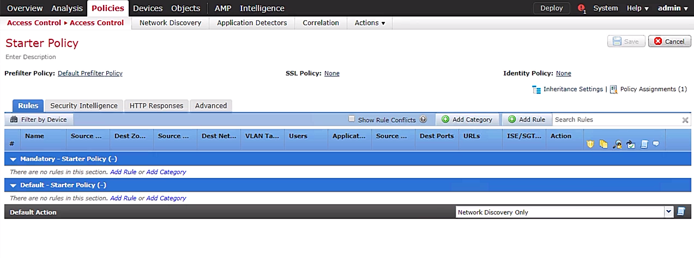
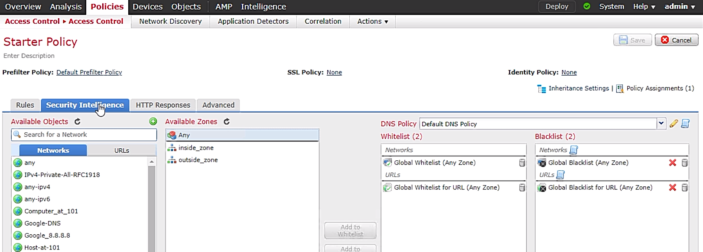
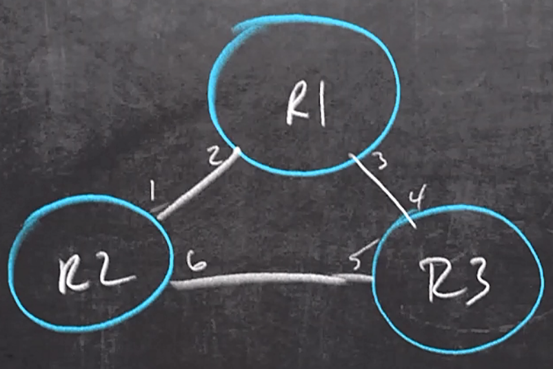

# 29. Firepower Access Control Policies


## Access Control Policy Overview

- Access control policy definition
  - high level requirements specifying how access is managed and who may access information under what circumstances
  - enforced through a mechanism that translates a user's access request
  - NIST, [Access Control Policy and Implementation Guides](https://csrc.nist.gov/Projects/Access-Control-Policy-and-Implementation-Guides)
  - [access control policy](https://www.luc.edu/its/aboutits/itspoliciesguidelines/access_control_policy.shtml) of Loyola University Chicago


- Typical procedure to check new session of ingress traffic (in sequence)
  - 1\. pre-filter
  - 2\. L3/L4 ACL
  - 3\. security intelligence (SI) based on IP address
  - 4\. SSL policy (decryption)
  - 5\. SI based on URL/DNS
  - 6\. App (L7) filtering
  - 7\. file/malware analysis and IPS (access control policy applied)
  - 8\. forward traffic


- Cisco Secure Firewall Management Center (FMC):
  - an administrative service to manage Cisco security products running on multiple platforms
  - a.k.a. Firepower Management Center
  - providing extensive intelligence about the users, applications, devices, threats and vulnerabilities that exist in your network
  - using this information to analyze your network’s vulnerabilities
  - providing tailored recommendations regarding security policies to implement, plus prioritization of security events to investigate
  - the centralized event and policy manager for
    - Firewall Threat Defence (FTD) OS
    - ASA w/ FirePower SDervice
    - Secure IPS (Firepower Next-Gen IPS / NGIPS)
    - FirePOWER Threat Defence for ISR
    - Malware Defence (AMP)


- Demo: access control policy of FMC
  - FirePower > tabs - Overview, Analysis, Policies, Devices, Objects, AMP, Intelligence
  - Policies > subtabs - Access Control , network Discovery, Application Detectors, Correlation, Actions
  - Access Control subtab > Starter Policy: tabs - Rules, Security Intelligence, HTTP Response, Advanced
  - Starter Policy > Rules
    - top-down fashion
    - Pre-filter Policy = Default Prefilter Policy; SSL Policy = None; Identity Policy = None
    - Deafult Action: Access Control: Block All | Access Control: Trust All Traffic | Network Discovery Only (default) | Instrusion Prevention: Maximum Detection | Instrusion Prevention: Connectivity Over Security | Instrusion Prevention: Balanced Security and Connectivity | Instrusion Prevention: Security Over Connectivity
    - main categories - Mandatory - Starter Policy, Default - Starter Policy
    - Loggin icon: disabled
    - icons after fields - shield icon = intrusion policy; files icon = file policy
  - Starter Policy > Security Intelligence
    - sections - Available Objects (Networks, URLs), Available Zone, DNS Policy, Whitelist, Blacklist

  <div style="margin: 0.5em; display: flex; justify-content: center; align-items: center; flex-flow: row wrap;">
    <a href="url" ismap target="_blank">
      
    </a>
    <a href="url" ismap target="_blank">
      
    </a>
  </div>


## Access Control Policy Rule Actions Concepts

- Actions of access control policy rule
  - 4 options
    - allow: ready for further inspection
    - trust: no further analysis required, e.g., backup service, VoIP
    - monitor: logging, handy for testing or troubleshooting
    - block (options):
      - block w/ reset - TCP traffic w/ TCP reset
      - block w/ interactivity - interactive w/ customer web page
  - example: ICMP echo request (inside zone) to 8.8.8.8 (outside zone) w/ action = block
    - just drop packets
    - no further analysis required


## Access Control Policy Rule Actions Demonstration

- Demo: actions of access control policy rules w/ FMC
  - verify Linux reachability
    
    ```text
    Sbox# ifconfig
    eth0: flags-4163<UP,BROADCAST, RUNNING,MULTICAST> mtu 1500
      inet 10.1.0.103   netmask 255.255.255.0   broadcast 10.1.0.255
      <...truncated...>

    SBox# ping 8.8.8.8
    <...success...>

    SBox# ping www.cisco.com
    <...success...>
    ```

  - config policy on FMC
    - FirePower > Policies tab > Access Control subtab > field - Access Control Policy, Status, Last Modified
    - entry: Access Control Policy = Starter Policy > 'Edit' icon
    - Starter Policy > Rules tab > Mandatory - Starter Policy > 'Add Rule' link
    - Add Rule > Name = No Ping 8.8.8.8; Enable = On; Action = Allow; Insert = into Mandatory; tabs - Zones, Networks, VLAN Tags, Users, Applications, Ports, URLs, SGT/ISE Attributes, Inspection, Logging, Comments
      - Zones tab > Source Zones = inside_zone, Destination Zones = outside_zone
      - Networks tab > Source Networks = (empty), Destination Networks = Google_8.8.8.8; none existed $\implies$ 1+1 icond on Availabe Networks
      - Ports tab > Available Ports > '+' icon > New Port Objects: Name = ICMP_Request_IPv4; Protocol = ICMP; Type = 8 (Echo Request); Code = Any > 'Save' button
      - Ports tab > Selected Source Ports = (empty); Selected Destination Ports = ICMP_Request_IPv4; Action = Block; Logging tab -> Log at the Beginning  of Connection = On > 'Add' button
    - Mandatory procedure to make the policy effect: Starter Policy > <span style="color: cyan;">'Save' button</span> > <span style="color: cyan;">'Deploy' link</span> on top banner > Deploy Policies > FTD-1 = On > `Deploy` button
  - Verify w/ SBox

    ```text
    SBox# ping 8.8.8.8
    <...fail...>
    SBox# ping www.cisco.com
    <...success...>
    ```

  - verify w/ FMC
    - Anslysis tab > Connections subtab > Events > Connection Events: fields - Firest Pacjet, Last Packet, Action, Reason, Initiator IP, Responder IP, Responder Country, Ingress Security Zone, Egress Security Zone, Source Port / ICMP Type, Destination ICMP Code
    - entry: Initiator IP = 10.1.0.103, Action = Block, Responder IP = 8.8.8.8, Source Port / ICMP Type = 8 (Echo Request) / icmp
    - entries before the ICP request packet all allowed for DNS lookup


## URL Filtering

- URL filtering overview
  - probably company policy to block certain types of web sites
  - user signing agreement to agree banning these web sites
  - ACL to block these web sites


- Demo: blocking sports web site w/ FMC
  - verify w/ Kali Linus
    - open web browser to browse 'Top 15 Most Popular Sports Website'
    - click on the links to the websites to verify the connectivity
  - FMC > Overview tab > Dashboards subtab > Summary Dashboard: tabs - Network, Threats, Intrustion Events, Status, Geolocation, QoS > Network tab
    - Network tab: charts - Unique Application over Time, Top Web Applications Seen, Top Client Applications Seen
    - Top Web Applications Seen (in tod-down order): Yahoo!, Google, CBS, Akamai, ...
  - config policy to block sports web sites: FMC > Policies tab > Access Control subtab > Access Control Policy = Starter Policy > 'Edit' icon
    - Starter Policy > Rule tab > Mandatory - Starter Policy > entry - # = 1, Name = No Ping to 8.8.8.8 > right click - Insert new rule
    - Add Rule: Insert = below rule 1; Name = No Sports; Action = Block with reset; Enabled = on
      - Zones tab: Source Zones = inside_zone; Destination Zones = outside_zone
      - Network tab: Source Networks = IPv4-Private-10.0.0.0-8; Destination Networks = (empty)
      - URLs tab: Reputations = Any; Selected URLs = Sports (Any Reputation)
      - Logging tab: Log at Beginning of Connection = On
      - 'Add' button
    - entry: # = 2, Name = No Sports, Source Zones = inside_zone, Dest Zone = outside_zone
    - 'Save' button > 'Deploy' link on top banner > FTD-1 = On > 'Deploy' button
    - green circle icon to check the status of deployment
  - Verify w/ Kali Linux
    - browse sports web site: 'The connection was reset' message on page
    - browse other web sites: ok


## Malware and File Inspections

- Demo: creating malware policy w/ FMC
  - FMC > Policies tab > Access Control subtab > Malware & File > Empty by default > 'New File Policy' button
  - create policy:
    - New File Policy: Name = Malware-n-File_Policy > 'Save' button
    - Malware-n-File Policy > tabs - Rules, Advanced; fields - File Types, Application Protocol, Direction, Action > Rules tab > 'Add' Rule
    - View Rule: Application Protocol = Any; Direction of Transfer = Any; Action = Block Files; File Type Categories = PDF Files; <span style="color: cyan;">Selected File Categories and Types = Category: PDF files</span> > 'Save' button
  - add the policy into ACL
    - FMC > Policies tab > Access Control > Access Control subtab > Access Control Policy = Starter Policy > 'Edit' icon
    - Starter Policy > entries w/ 'Files' icon gray out (no File policy included)
      - either add the File policy to existing rules or create new
      - both entries: action = block
      - expect to allow the PDF files
    - entry # = 2 > right click > Insert new rules
    - Add rule: Insert = below value 2; Name = Looking for PDFs; Action = Allow
      - Networks tab: Source Networks = IPv4-Private-10.0.0.0-8
      - Inspection tab: Intrusion Policy = None; File Policy = Malware-n-File_Policy
      - Logging tab: Log at Beginning of Connection = On
      - 'Add' button
    - entry - # = 3, Name = Looking for PDFs, File icon = On > 'Save' button
  - verify the file policy before deploying
    - browse a PDF file and download it > success
  - deploy the policy: FMC > 'Deploy' link > Deploy Policies: FTD-1 = On > 'Deploy' button
  - verify the file policy:
    - clear cache from browser in Kali Linux
    - browse the PDF document again > 'The connection was reset' message shown (PDF file allowed only from IPv4-Private-10.0.0.0-8)
    - browse a PDF file w/ HTTPS > ok


## SSL/TLS Decryption

- Inspecting traffic w/ SSL/TLS descryption
  - policy blocking some L7 applications and/or web sites
  - encrypted payload and header probably not able to be inspected, in particular, HTTPS
  - solution:
    - making firewall as man-in-the-middle device to inspect the packets
    - two sessions requested: inside session and outside sessions
    - firewall resigning the packets
  - scenario for inbound traffic:
    - user in branch office accessing the corporate service
    - servers in corperate servers w/ private keys
    - user's computer using know public key
    - some traffic not allowed to decrypt, such as financial and mediacal info
  - decryption and encryption intensively resource consuming


- Demo: decryption SSL/TLS in FMC
  - assume that the certificate and key are ready for use
  - FMC > Policies tab > Access Control > SSL subtab > entry - SSL Policy > 'Edit' icon
  - create rule for SSL policy: SSL Policy: tabs - Rules, Trusted CA certificates, Undecryptable Actions
    - Rules tab: 'Add' Rule > Add Rule: Insert = into Category Standard Rules; Name = xxx
  - apply the rule into access control policy: Policy tab > Access Control > Access Control subtab
    - entry - Starter Policy > 'Edit' icon
    - Starter Policy > SSL Policy = None > 'None' link
    - SSL Policy to use for inspecting encrypted connections = SSL Policy > 'OK' button
    - 'Save' button > 'Deploy' link > Deploy 


## IPS Inspection

- Demo: adding IPS policy to access control
  - create intrusion policy
    - Policies tab > Access Control > Intrusion subtab > empty by default > 'Create Policy' button
    - Create Intrusion Policy: Name = Our-IPS-Policy; Drop when Inline = On; Base Policy = Balanced Security and Connectivity > 'Create and Edit Policy' button
    - Create Policy: Our-IPS-Policy > folders - Policy Information (Rules, Firepower Recommendations), Advanced Settings, Policy Layers > Policy Information
    - Policy Information: Name = Our-IPS-Policy > 'Commit Changes' button
    - entry - Intrusion Policy = Our-IPS-Policy, Drop wne Inline = Yes, Status = No access control policies use this policy 
  - apply intrusion policy to access control policy
    - Policies tab > Access Control > Access Control subtab > entry - Access Control Policy = Starter Policy > 'Edit' icon
    - Starter Policy > Mandatory - Starter Policy
      - 3 entries w/ greyout shield icons - no Intrustion policy applied
      - nay policy w/ action = Block resulting packet drop and w/o further investigation, i.e., # = 1 & 2 not applicable
      - entry - # = 3, Name = Looking for PDFs, the only entry applicable > 'Edit' icon
      - Editing Rule - Looking for PDFs > Inspection subtab: Intrusion Policy = Our-IPS-Policy > 'Save' button
      - 'Save' button > 'Deploy' link > Deploy Policies: FTD-1 = On > 'Deploy' button
    - alternative, Default Action = Intrusion Prevention: Our-IPS-Policy


# 30. Management Options to Improve Security


## Overview of Secure Management

- Mechanisms to secure network management
  - out of band (OOB) management
    - separated management network physically or logically
    - isolated management traffic from user traffic
  - secure protocols: including SCP, SFTP, HTTPS, SNMPv3, VPN, SSL, SSH or IPsec
  - security measures
    - including DHCP snooping, ARP inspection (DAI), port security
    - preventing from using DTP
    - unused access ports assigned to unused VLAN
  - hardening
  - AAA
    - controling access and privilege
    - ISE and TACACS+ as Cisco solution
    - authentication: MFA or 2FA
    - parser views for local user to control access and privilege
    - implementing modular policy framework (MPF): class-maps, policy-maps
  - firewall
    - cisco solutions: FirePower, ASA
    - NetFlow Secure Event Logging (NSEL) in ASA able to generate reports
    - flow control w/ NetFlow v9, w/ actions - flow teardown or flow deny
    - NetFlow collector to generate charts and reports
  - software define network (SDN)
    - controller interacting w/ network devices
    - ensuring secure connecting btw controller and devices
  - change control
    - backup of configurations on devices


## Syslog Overview

- Syslog overview
  - what able to be logged
    - events on devices
    - what going on
    - what happending
    - logged locally or sent to server
  - commands
    - able to track all commands used w/ AAA
    - track w/ syslog as well
  - where the msgs to go and store
    - read only message stored on server besides syslog server


- Demo: config syslog on router
  - config syslog server: `logging host 2.2.2.2`
  - config the interface that the router uses to send syslog packets: `logging source-interface loop 0`
  - config the timestamp format for log msgs: `service timestamps log`

  ```text
  R1# show logging
  <...truncated...>
    Console logging: level debugging, 3800 messages logged, xml disabled,
                     filtering disbaled
    Monitor logging: level debugging, 0 messages logged, xml disabled,
                     filtering disbaled
    Buffer logging: level debugging, 3800 messages logged, xml disabled,
                     filtering disbaled
    Exception logging: size (8192 bytes)
    Count and timestamp logging messages: disabled
    Persistent logging: disabled
  
  R1# conf t
  ! config syslog server
  R1(config)# logging host 2.2.2.2
  %SYS-6-LOGGINGHOST_STARTSTOP: Logging to host 2.2.2.2 port 514 started ...

  R1(config)# logging source-interface loop 0
  R1(config)# service timestamps log datetime show-timezone localtime year msec
  R1(config)# service timestamps debug datetime show-timezone localtime year msec
  R1(config)# end

  R1# show ntp status
  Clock is synchronized, stratum 2, reference is 2.2.2.2
  <...truncated...>
  Nov 20 2020 1651:59.981 PST: %SYS-6-LOGGINGHOST_STARTSTOP: ...
  ```


## NTP with Authentication

- NTP authentication
  - NTP w/ UDP port 123
  - NTP server on Internet w/ atomic clcok as stratum 1
  - local router referring to the NTP server as stratum 2
  - manually config to access the NTP server
  - NTP probably taking a long time to sync the time


- Demo: config to sync NTP server
  - provide server and access queries: `ntp access-group serve 1`
  - preventing from DoS w/ ACL

  ```text
  R1# show ntp status
  Clock is synchronized, stratum 2, reference is 2.2.2.2
  <...truncated...>

  R1# show ntp association
  address     ref clock    st  when    poll   reach   delay   offset    disp 
  *~2.2.2.2   .LOCL.       1     13     128     377  17.230  194.938   2.646

  R1# show run | include ntp|clock
  clock timezone PST -8 0
  clock summer-time PDT recurring
  ntp authentication-key 6783 md5 072C285F4D06585744 7
  ntp authentication
  ntp trusted-key 6783
  ntp source Loopback0
  ntp update-calendar
  ntp server 2.2.2.2

  ! access control list to control NTP access
  R2# show access-list
  Standard IP access list 1
    10 permit 1.1.1.1 (70 matches)

  R2# show run | include ntp
  ntp authentication-key 6783 md5 1531021F07256A767B 7
  ntp authentication
  ntp trusted-key 6783
  ntp source Loopback0
  ntp access-group serve 1
  ntp master 1
  ntp update-calendar
  ntp server 2.2.2.2

  R2# show control-plane host open-ports
  Prot  Local Address   Foreign Address 
   tcp           *:23               *:0
   udp          *:123               *:0
   udp         *:4500               *:0
   udp          *:500               *:0
  ```


## Change Control

- Benefits of change management
  - second set of eyes
  - documentation:
    - window to implement change
    - change itself
    - tested and who did
    - roll-back process
  - inventory
    - devices and network connections
    - version of software


# 31. Troubleshoot SNMP


## SNMP Overview

- SNMP fundamentals
  - components
    - agent: client software either built-in or add-on
    - manager: dedicated server or software running on PC
  - messages
    - `get` and `set` requests
      - from server to ask for info from agent
      - default: udp port 161
    - `traps` or `inform` message
      - report events to server
      - default: udp port 162
  - management information base (MIB)
    - a detailed record for each components on a device
    - tree structure
    - different MIBs from device to device
  - access control used to control who able to request info


- Versions of SNMP
  - SNMPv2c
    - using 'community strings' as passwords
    - specify different community strings for RO / RW `get` & `set` requests
  - SNMPv3
    - 'views': scope of MIBs, where
    - 'groups': the privilege of corresponding views, what
    - 'users':
      - the members of groups, who
      - including user-name, groups, auth (key; MD5 | SHA), privacy (key, AES)
    - rarely used due to complexity
    - example:
      - Group A able to do read only on View 1
      - Group B able to read/write permisssion on View 1


## SNMPv2 Configuration

- Demo: config SNMPv2c on R1
  - topology
    - R1 as SNMP agent
    - SNMP server connected to cloud
  
  - verify current SNMP config

    ```text
    R1# show run | inc snmp
    snmp-server community Cisco!23 RW
    <...truncated...>
    ```

  - verify SNMP manager settings
    - Obserium: a free SNMP manager
    - basic config: protocol version = v2c; transport = UDP; port = 161
    - SNMP v1/v2c authentication: SNMP community = Cisco!23
    - info about the connected device: graphs tab > subtabs - Graphs, System, Processor, Memory, Storage, Netstats, Firewall, Authentication, OSPF, Poller


## SNMPv3 Client Configuration

- Demo: config SNMPv3

  ```text
  ! verify current setting
  R1# show run | inc snmp
  snmp-server group GROUPA v3 priv read VIEW1
  snmp-server group GROUPB v3 priv read FULL write FULL
  snmp-server group admingroup v3 priv read fullview write fullview
  snmp-server view FULL iso included
  snmp-server view VIEW1 sysUpTime included
  snmp-server view VIEW1 ifOperStatus included
  snmp-server view fullview iso included
  snmp-server ifindex persist

  R1# conf t
  R1(config)# snmp-server user Jim admingroup v3 
    auth sha Cisco!23 prov aes 256 Cisco!23
  R1(config)# end
  ```

  ```text
  ! verify snmp settings
  ! running config unable to view user
  R1# show run | inc snmp
  snmp-server group GROUPA v3 priv read VIEW1
  <...truncated...>
  snmp-server ifindex persist

  R1# show snmp user
  User name: Jim
  Engine ID: 80000090300F4CFE249B1A0
  storage-type: nonvolatile   active
  Authentication protocol: SHA
  Privacy Protocol: SEA256
  Group-name: admingroup

  User name: Bob
  Engine ID: 80000090300F4CFE249B1A0
  storage-type: nonvolatile   active access-list: 1
  Authentication protocol: SHA
  Privacy Protocol: SEA256
  Group-name: GroupA
  <...truncated...>

  R1# show snmp view
  FULL iso - included nonvolatile active
  *ilmi system - included permanent active
  *ilmi atmForumUni - included permanent active
  VIEW1 systemUpTime - included nonvolatile active
  VIEW2 ifOperStatus - included nonvolatile active
  <...truncated...>

  R1# show snmp group
  <...truncated...>
  group name: GROUPA                    security mode:v3 priv
  contextname: <no context specified>   storage type: nonvolatile
  readview: VIEW1                       writeview: <no writeview specified>
  notifyview: <no notifyview specified>
  row status: active

  group name: GROUPB                    security mode:v3 priv
  contextname: <no context specified>   storage type: nonvolatile
  readview: FULL                        writeview: FULL
  notifyview: <no notifyview specified>
  row status: active

  group name: admingroup                security mode:v3 priv
  contextname: <no context specified>   storage type: nonvolatile
  readview: fullview                    writeview: fullview
  notifyview: <no notifyview specified>
  row status: active
  ```


## SNMPv3 Server Configuration

- Demo: SNMPv3 server w/ Observium
  - SNMP settings
    - basic config: Protocol Version = v3; Transport = UDP; Port = 161
    - SNMP v3 authentication: Auth Level = authPriv; Auth Username = `****`; Auth Password = `****`; Auth Algorithm = SHA; Crypto Password = `****`; Crypto Algorithm = AES
    - Auth Level = noAuthNoPriv | authNoPriv | AuthPriv
  - Overview:
    - tabs: Graphs, System, Processor, Memory, Storage, Netstats, Authentication, Poller
    - poll all details of the device
    - every 10 mins update


## Troubleshooting SNMP

- Recommended points to troubleshoot SNMP
  - IP connectivity w/ UDP:161/162
  - SNMP version 
  - correct MIB
  - device persistence in case hardware change


# 32. Troubleshoot Network Problems using Logging


## Logging Overview

- Logging overview
  - display types
    - console: line console 0
    - monitor:
      - terminal lines, `line vty 0-15`
      - displaying log message at terminal lines, `terminal monitor`
    - buffer: storing on buffer
  - logging severity level:
    - 0: Emergencies - device unusable
    - 1: alerts - immediate action required
    - 2: critical - conditional critical
    - 3: error - error condition
    - 4: warnings - warning condition
    - 5: notifications - normal but important event
    - 6: informational - informational messages
    - 7: debugging - debug message
  - verify system logging settings
    
    ```text
    R1# show logging
    Syslog logging: enabled (0 messages dropped, 0 messages rate-limited,
                    0 flushes, 0 overruns, xml disabled, filtering disabled)
    No Active Message Discriminator.
    No Inactive Message Discriminator.
        Console logging: level debugging, 70 messages logged, xml disabled,
                        filtering disabled
        Monitor logging: level debugging, 0 messages logged, xml disabled,
                        filtering disabled
        Buffer logging:  level debugging, 40 messages logged, xml disabled,
                        filtering disabled
        Logging Exception size (8192 bytes)
        Count and timestamp logging messages: disabled
        Persistent logging: disabled
    No active filter modules.
        Trap logging: level informational, 74 message lines logged
            Logging Source-Interface:       VRF Name: 
    ```

  - config log messsage
    - sequence of log messages from different devices able to help debug
    - adding timestamp, date stamp, msec, etc.

    ```text
    R1# config t
    R1(config)# exit
    R1#
    %SYS-5-CONFIG I: Configured from console by console
    ```


## Configuring Logging

- Demo: modify log and debug message
  - `uptime`: how long since device rebooted
  - `localtime` offset w/ UTC and correct NTP setting

  ```text
  R1# show logging
  <...truncated...>
        Console logging: level debugging, 70 messages logged, xml disabled,
                        filtering disabled
        Monitor logging: level debugging, 0 messages logged, xml disabled,
                        filtering disabled
        Buffer logging:  level debugging, 40 messages logged, xml disabled,
                        filtering disabled
  <...truncated>

  R1# conf t
  R1(config)# service timestamps log datetime localtime show-timezone year msec
  R1(config)# service sequence-numbers
  R1(config)# end
  R1#
  000042: *May 27 2020 21:47:08.683 UTC: %SYS-5-CONFIG_I: Configured from colsole by console

  R1# conf t
  R1(config)# service timestamps debug datetime localtime show-timezone year msec
  R1(config)# end
  ```

- Demo: config severity level w/ monitor

  ```text
  R1# conf t
  R1(config)# logging monitor 3
  R1(config)# end
  
  R1# show logging
  <...truncated...>
        Monitor logging: level errors, 0 messages logged, xml disabled,
                        filtering disabled
  <...truncated>

  ! verify settings
  R1# show ip int brief
  Interface           IP-Address  OK? Method  Status                Protocol
  <...truncated...>
  Loopback1           1.1.1.1     YES NVRAM   up                    up
  <...truncated>

  R1# conf t
  R1(config)# line vty 0 4
  R1(config-line)# no login
  R1(config-line)# privilege level 15
  R1(config-line)# end

  ! telnet from R2  to R1
  R2# telnet 1.1.1.1
  Trying 1.1.1.1 ... Open

  R1# show users
      Line      User  Host(s)   Idle        Location 
     0 con 0          idle      00:00:14
  *  1 vty 0          idle      00:00:00  172.16.12.2

  R1# who
      Line      User  Host(s)   Idle        Location 
     0 con 0          idle      00:00:16
  *  2 vty 0          idle      00:00:00  172.16.12.2

  R1# debug ip packet

  ! return to R1 console
  R1# undebug all
  R1# conf t
  R1(config)# do show logging
  <...truncated...>
        Console logging: level debugging, 160 messages logged, xml disabled,
                        filtering disabled
        Monitor logging: level debugging, 0 messages logged, xml disabled,
                        filtering disabled
        Buffer logging:  level debugging, 162 messages logged, xml disabled,
                        filtering disabled
  <...truncated>

  R1(config)# logging monitor 7
  R1(config)# end

  ! return to R2 console
  R1# debug ip packet
  ! none debug message shown

  ! return back to R1 console
  R1#
  ! many debug messages shown

  ! return back to R2 console
  R1# terminal monitor
  ! debug messages shown 

  R1# terminal no monitor
  R1# exit
  R2#

  ! return back to R1 sonsole
  ! config SNMP trap severity level
  R1# conf t
  R1(config)# logging host 1.2.3.4
  R1(config)# logging trap 7
  R1(config)# end
  R1# show logging
  <...truncated...>
        Trap logging: level debugging, 52 message lines logged
            Logging to 1.2.3.4 (udp port 514, audit disabled
            link up)
            2 message lines logged,
            0 message lines rate-limited,
            0 message lines dropped-by-MD,
            xml disabled, sequence number disabled

  ! disable monitor logging
  R1# conf t
  R1(config)# no logging monitor
  R1(config)# end

  R1# show logging
  <...truncated...>
        Console logging: level debugging, 1194 messages logged, xml disabled,
                        filtering disabled
        Monitor logging: disabled
        Buffer logging:  level debugging, 1197 messages logged, xml disabled,
                        filtering disabled
  <...truncated>
  ```


## Conditional Debugging

- Conditional debug overview
  - able to apply to specific interface(s)
  - able to apply to specific IP address space
  - able to aggregate several conditional debugs into a group
  - issue:
    - not applied to all devices
    - not all devices accepting all conditionals for debugging
  - solution: test every single conditional debug before using it on a certain device


- Demo: config conditional debugging
  - topology
    - severity levles: buffer (7), conscole (6)
    - debug on specific topics, e.g., OSPF

  <figure style="margin: 0.5em; display: flex; justify-content: center; align-items: center;">
    
  </figure>

  - task:
    - debug Hello only on intf g0/6 on R2
    - no debug info on intf g0/1 on R2
  - verify R2 settings
    
    ```text
    R2# show ip protocol
    *** IP Routing is NSF aware ***
    Routing Protocol is "ospf 1"
      Outgoing update filter list for all interfaces is not set
      Incoming update filter list for all interfaces is not set
      Router ID 2.2.2.2
      Number of areas in this router is 1. 1 normal 0 stub 0 nssa
      Maximum path: 4
      Routing for Networks:
        0.0.0.0 255.255.255.255 area 0
      Passive Interface(s):
        Ethernet0/0
        Serial3/0
        <...truncated...>
      Routing Information Source:
        Gateway     Distance    Last Update
        11.11.11         110    00:11:21
        172.16.23.3      110    00:12:59
      Distance: (default is 110)
    Routing Protocol is "bgp 100"
      Outgoing update filter list for all interfaces is not set
      Incoming update filter list for all interfaces is not set
      Router reflector for address family IPv4 Unicast, 1 client
      IGP synchronization is disabled
      Automatic route summarization is disabled
      Neighbor(s):
        Address       FiltIn FiltOut DistIn DistOut Weight RouteMap
        100.100.24.4
        172.16.12.1
        172.16.23.3
        172.16.211.11
      Maximum path: 1
      Routing Information Sources
        Gateway       Distance    Last Update
        100.100.24.4        20    00:10:19
        172.16.12.1        200    00:12:29
      Distance: external 20 internal 200 local 200

    R2# show ip ospf neighbor
    Neighbor ID     Pri State     Dead Time   Address         Interface
    11.11.11.11       1   FULL/BDR  00:00:35  172.16.211.11   GigabitEthernet2/0
    172.16.23.3       1   FULL/DR   00:00:32  172.16.23.3     GigabitEthernet1/0
    1.1.1.4           1   FULL/BDR  00:00:31  172.16.12.1     GigabitEthernet0/0

    R2# debug ip osph hello
    OSPF-1 HELLO Gi2/0: Send hello to 224.0.0.5 area 0 from 172.16.211.2
    OSPF-1 HELLO Gi1/0: Send hello to 224.0.0.5 area 0 from 172.16.23.2
    OSPF-1 HELLO Gi0/0: Send hello to 224.0.0.5 area 0 from 172.16.12.2
    OSPF-1 HELLO Gi1/0: Rcv hello to 172.16.23.3 area 0 from 172.16.23.3
    OSPF-1 HELLO Gi0/0: Rcv hello to 172.16.12.1 area 0 from 172.16.12.1
    OSPF-1 HELLO Gi2/0: Rcv hello to 11.11.11.11 area 0 from 172.16.211.11

    R2# show logging
    <...truncated...>
          Console logging: level debugging, 38 messages logged, xml disabled,
                          filtering disabled
          Monitor logging: level debugging, 0 messages logged, xml disabled,
                          filtering disabled
          Buffer logging:  level debugging, 42 messages logged, xml disabled,
                          filtering disabled
    <...truncated>

    R2# show users
        Line      User  Host(s)   Idle        Location 
    *  0 con 0          idle      00:00:00

    R2# undebug all
    ```

  - config conditional debug

    ```text
    ! config debug 
    R2# debug condition interface g0/0
    R2# debug condition interface g1/0
    R2# show debug condition
    Condition 1: interface Gi0/0 (1 flags triggered)
            Flags: Gi0/0
    Condition 2: interface Gi1/0 (1 flags triggered)
            Flags: Gi1/0
    
    RT2# debug ip ospf hello
    OSPF-1 HELLO Gi1/0: Send hello to 224.0.0.5 area 0 from 172.16.23.2
    OSPF-1 HELLO Gi0/0: Send hello to 224.0.0.5 area 0 from 172.16.12.2
    OSPF-1 HELLO Gi1/0: Rcv hello to 172.16.23.3 area 0 from 172.16.23.3
    OSPF-1 HELLO Gi0/0: Rcv hello to 172.16.12.1 area 0 from 172.16.12.1

    R2# no debug condition 2
    OSPF-1 HELLO Gi0/0: Send hello to 224.0.0.5 area 0 from 172.16.12.2
    OSPF-1 HELLO Gi0/0: Rcv hello to 172.16.12.1 area 0 from 172.16.12.1

    R2# undebug all
    R2# show debug condition
    Condition 1: interface Gi0/0 (1 flags triggered)
            Flags: Gi0/0

    R2# no debug condition 1
    ! warning message for the last debug condition
    Proceed with removal? [yes/no]: yes
    ```


