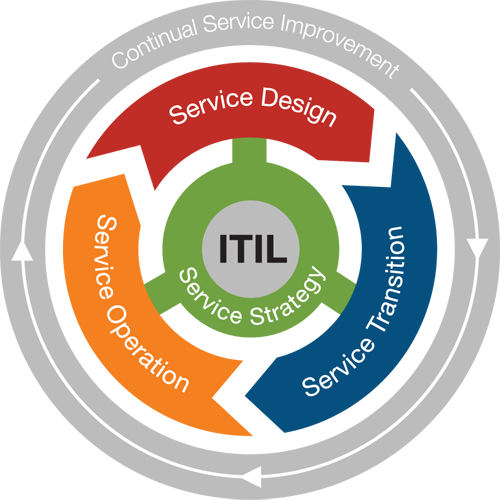

# Security for Cloud Service

## 33. Cloud Service and Deployment Models


### Planning for loud Services

- Essential characteristics of could computing service by NIST
  - on-demand self-seervice: via API
  - broad network access
  - resource pooling: shared
  - rapid elasticity: vertical and horizontal scaling 
  - measured service: SLA, QoS


- Concerns of cloud services
  - CIA
    - confidentiality: who access the info
    - integrity: accuracy of info
    - availability: info available when needed
  - control
    - protective
    - detective
    - reactive


- Cloud Service model
  - tradeoff btw responsibility and control
  - different models w/ different separation of boundaries for responsibility and control 
  - management layer btw customer and provider
    - interface for customer to instruct provider what to perform
    - tools: command line tool, system development kit (SDK), management interface, etc.
  - layers of administrative control
    - control what customer implemented
    - control to instruct provider how to implement
  - right level of documentation required to comply w/ the auditorial requirement and government expectation

  <figure style="margin: 0.5em; display: flex; justify-content: center; align-items: center;">
    
  </figure>


### Plan for Infrastructure As A Service

- Infrastructure model
  - existing virtualized services: virtual machines, virtual storage, virtual networks, and virtualized containers for applications, etc.
  - security concern
  - cloud service model
    - provider: physical, servers / storage, hypervisor
    - customer: virtual network, operating system, runtime / middleware, applications, data and people


### Plan for Platform As A Service

- Platform model
  - cloud service provider
    - provider: physical network, servers / storage, hypervisor, virtual network, operating system, runtime / middleware
    - customer: applications, data and people
  - focusing on what the applications do
  - container:
    - data and application
    - docker, kubernetes, etc.
    - key concerns: platform diagnostic, portability, encapsulation
  - protability considerations
    - how to make libraries portable
    - how to make application portable w/ libraries
    - how to make interfaces working w/ service providers in terms of management perspective
  - reusable components
    - building blocks
    - APIs interacting w/ different layers offered by service provider
    - principles of web services, micro services, or container


### Plan for Software As A Service

- Software model
  - cloud service provider
    - provider: physical network, servers / storage, hypervisor, virtual network, operating system, runtime / middleware, applications
    - customer: data, people 
  - recommendation: starting w/ SaaS
  - security concerns
    - data: encryption
    - people: identity and access management
  - providers offerring high degree of isolation and separation btw different components and customers


### Plan for Cloud Deployment Models

- Deployment models
  - [The NIST Definition of Cloud Computing](https://nvlpubs.nist.gov/nistpubs/Legacy/SP/nistspecialpublication800-145.pdf), NIST 800-145
  - private cloud
    - exclusive use by <span style="color: cyan; font-wight: bold;">a single organization</span>
    - owned, managed, and operated by the organization, a 3rd party, or some combination of them
    - existing on or off premises
  - community cloud
    - exclusive use by a specific community of consumers from organizations that have <span style="color: cyan; font-wight: bold;">shared concerns</span>, including mission, security requirements, policy, and compliance considerations
    - owned, managed, and operated by one of more of the organizations in the community, a 3rd party, or some combination of them
    - existing on or off premises
  - public cloud
    - open use by <span style="color: cyan; font-wight: bold;">the general public,/span>
    - owned, managed, and operated by a business, academic, or government organization, or some combination of them
    - existing <span style="color: cyan; font-wight: bold;">on the premises</span> of the cloud provider
  - hybrid cloud
    - a.k.a. multicloud, mixed cloud
    - a composition of two or more distinct cloud infrastructure (private, community, or public)
    - remaining unique entities but bound together by standardized or propriety technology that enables data and application portability
  
- Security of cloud service
  - security concerns
    - isolation
    - asset ownership
    - exclusively control
  - highest level of security w/ private cloud
    - better exclusively control
    - better granularity
    - higher QoS
  - tradoff: more customer control
    - more exclusivity
    - less resource sharing
    - less value proposition improved
  - level of security
    - private cloud: maximum control and exclusivity
    - public cloud: general public availability, hosted by a service provider
    - community cloud: shared or commion set of interest
    - hybrid cloud: multiple locations to deploy infrastructure
  - value:
    - SaaS > PaaS > IaaS
    - public & community > hybrid > private


## 34. Planning for Software Development Methodologies


### Software and App Development Methodologies

- Software development methodologies
  - waterfall
  - agile
  - CI/CD
  - DevOps
  - DevSecOps


### Plan for Waterfall Method

- Software development lifecycle (SDLC)
  - planning
  - define requirements
  - design & prototyping
  - software development
  - testing
  - deployment
  - operations & maintenance


- Waterfall method overview
  - linear approach: move to next step until the current one completed
  - any change in the cycle $\to$ back to the requirements
  - five basic steps
    - requirements
      - stakeholder createing demand
      - demand translated into requirements
      - deliverables:
        - document to capture requirements
        - context: use cases, etc. to linerate the requirements
    - design
      - creating specifications according requirements
      - aspects of specs
        - physical - components, e.g., CPU, memory, network, and storage
        - logical - relations btw components and how to put them together
    - implementation
      - coding according specs
      - unit test
    - verification
      - testing: out of development environment
      - sign off to accept for release
    - maintenance
      - operating
      - measured w/ SLAs or metrics in requirements
  - disadvantages
    - ridgid: any change back to the begining of the procedure
    - long development time


### Plan for Lean and Agile Methods

- ITIL Services Lifecycle
  - Service Strategy
  - Service Design
  - Service Transition
  - Service Operation
  - Continuous Service Improvement

  <div style="margin: 0.5em; display: flex; justify-content: center; align-items: center; flex-flow: row wrap;">
    <a href="https://www.helpsystems.com/solutions/optimization/itil-version-3" ismap target="_blank">
      
    </a>&nbsp;&nbsp;
    <a href="https://pdca.edchen.org/itil-v3-0-framework-illustrated/" ismap target="_blank">
      
    </a>
  </div>


- Agile/Lean method
  - dynamic approach to adopt changes
  - ITIL: a service management framework
    - small changes
    - feed feedback
  - waterfall still valid but embedded and iterated
  - principles
    - <span style="color: cyan; font-weight: bold;">individual & interactions</span> over process and tools
    - <span style="color: cyan; font-weight: bold;">working software</span> over comprehensive docs
    - <span style="color: cyan; font-weight: bold;">responding to change</span> over following a plan
    - <span style="color: cyan; font-weight: bold;">customer collaboration</span> over contract negotiation
  - feedback from customer resulting in software changes


### Plan for Kanban and Scrum Teams

- Kanban and Scrum overview
  - reslation:
    - lean: business level
    - agile: IT level
    - kanban & scrum: team level
    - extreme programming: developer level
  - kanban - visualization
    - dynamic
    - timeline flex
    - no roles
  - scrum
    - sprint: a week in general but depend on nature of project
    - plan: ready to action
    - implement
    - deliver
  - extreme programming


### Continuous Integration, Deployment, and Delivery

- CI/CD overview
  - major components: source control, build, test, and deploy
  - source control
    - commit: saving source code
    - versioning: history
    - branch: variation
    - merge: combination back to original flow
    - pull request: validation & review
  - build
    - components of applications: general shared library, application code itself, 3rd party components
    - compile: generate executable
    - package: bundle required components together, container
  - test
    - interacting w/ other system, e.g., web client
    - test agents: automatic as much as possible
  - deploy:
    - deliverable: deliver the component to production environment
    - probably part of the larger components as input of anther test and deploy
  - combining different software components probably forming another thread of test and deploy


### Understand CICD Pipelines in Action

- CI/CD demo w/ AWS
  - Cloudformation
    - Infrastructure-as-a-Code
    - model, provision, and manage AWS and third-party resources
    - users creating a template that describes all the AWS resources that you want
    - CloudFormation taking care of provisioning and configuring those resources for you
  - Cloudformation template
    - [original](https://s3.us-west-2.amazonaws.com/cloudformation-templates-us-west-2/AutoScalingMultiAZWithNotifications.template)
    - [local version](src/34-AutoScalingMultiAZWithNotifications.templat)

    ```json
    {
      "AWSTemplateFormatVersion" : "2010-09-09",
      "Description" : "AWS CloudFormation Sample Template AutoScalingMultiAZWithNotifications: 
      Create a multi-az, load balanced and Auto Scaled sample web site running on an Apache 
      Web Serever. The application is configured to span all Availability Zones in the region 
      and is Auto-Scaled based on the CPU utilization of the web servers. Notifications will 
      be sent to the operator email address on scaling events. The instances are load 
      balanced with a simple health check against the default web page. 
      **WARNING** This template creates one or more Amazon EC2 instances and an Application 
      Load Balancer. You will be billed for the AWS resources used if you create a stack from 
      this template.",

      "Parameters" : {
        "VpcId" : { 
          "Type" : "AWS::EC2::VPC::Id",
          "Description" : "VpcId of your existing Virtual Private Cloud (VPC)",
          "ConstraintDescription" : "must be the VPC Id of an existing Virtual Private Cloud."
        },
    ```
    
    ```json
        "Subnets" : {
          "Type" : "List<AWS::EC2::Subnet::Id>",
          "Description" : "The list of SubnetIds in your Virtual Private Cloud (VPC)",
          "ConstraintDescription" : "must be a list of at least two existing subnets 
          associated with at least two different availability zones. They should be residing 
          in the selected Virtual Private Cloud."
        },
      ...
    }
    ```

  - change code and validate w/ `cfn-lint`
    - `cfn-lint`: [AWS CloudFormation Linter](https://github.com/aws-cloudformation/cfn-lint)
    - correct code and validate again
  - source control w/ GitHub
    - commit code to repository: `git commit -a`
    - push to repository: `git push --set-upstream origin demoBranch`
    - 'compare and pull request' in repository > comments about the change > 'Create Pull Request' button
  - test and deploy
    - validaton integrating w/ GitHub
    - after validation > 'Merge pull request' button > confirm merge


### Plan for DevOps

- DevOps overview
  - traditional:
    - silos: business, developer, operations teams
    - developer -> operations -> business -> developer -> ...
    - gaps btw languages, tools, culture, etc.
  - DevOps
    - culture
      - developer adopting changes
      - operations providing stability
      - breaking down silos
      - business team pulling inputs into the collaboration team
    - process
    - tools
    - feedback
  - principle: automation on development and control


### Plan for DevSecOps

- DevSecOps overview
  - applying security control, principle, and expection to the highly automatic system
  - principles: IaaC, control, testing
  - Infrastructure as a Code:
    - template to computer resources
    - management
    - source code
      - admin user account
      - policy
      - firewall rules, e.g. control only SSH
    - how to translate the source code into actions
  - control
    - notification, mitigation
    - automic the process
  - fuzzing testing
    - randomizing the testing
    - injecting possible bad data to realize what happen to system 


## 35. Planning for and Securing Cloud Software-as-a-Service


### Planning for Software-as-a-Service Security

- Key factors to select cloud computing services
  - following value vs. risk equation
    - high value and low risk $\to$ probably not cloud computing service
    - solution: picking the appropriate service model, infrastructure, platform, and services
  - starting w/ SaaS
    - consider Software as a Serice (SaaS) as the first selection
    - tradoffs: responsibility and control


- Security concerns of SaaS
  - people:
    - authentication and authorization
    - example: tokens, SAML, AOuth, etc.
  - data: encryption
  - Cisco solutions
    - Dual
    - ISE
  - Cloud Access Security Broker (CASB)
    - Cisco CloudLock
    - highly integrated tools to monitor, maintain, and control SaaS
  - Email and DNS security


### Federating Identities with SAML, OAuth, and OpenID

- Identity management
  - people and data: authn & authz
  - federating identity: sharing identity w/ different systems
  - directory:
    - old fashion used in organization
    - a collection of identities and permission properties
    - example: MS AD
  - other solutions
    - Secure Assertion Markup Language (SAML)
    - OAuth
    - OpenID


- Secure Assertion Markup Language (SAML)
  - an umbrella standard covering federation, identity management and single sign-on (SSO)
  - providing single-sign-on (SSO) service
  - typically used for domain-based computer
  - roles
    - service provider
    - users (client= browser)
    - identity provider (IDP)
  - SAML workflow

    <figure style="margin: 0.5em; display: flex; justify-content: center; align-items: center;">
      
    </figure>
  
  - advantage: feature-rich mechanism, not only authn & authz
  - disadvantage: complexity


- Open Authorization (OAuth)
  - an authentication protocol allowing to approve one application interacting with another on your behalf without giving away your password
  - an open standard for access delegation, commonly used as a way for Internet users to grant websites or applications access to their information on other websites but without giving them the passwords
  - delegation permission, in particular, authorization
  - roles
    - client (mobile / web app)
    - resource owner
    - authorization server
    - resource server
  - response from authorization server most likely including identity property
  - OAuth workflow

    <figure style="margin: 0.5em; display: flex; justify-content: center; align-items: center;">
      
    </figure>

  - example: twitter using facebook account to login
  - OPenID:
    - providing an identity assertion
    - an open standard that organizations use to authenticate users


### Cisco Zero-Trust for the Workforce

- Zero-trust security overview
  - offering a comprehensive solution to secure all access across your applications and environment
  - a strategic approach to security that centers on the concept of eliminating trust from an organization's network architecture
  - traditional, trust anything within corporate network
  - layers
    - workplace security:
      - Cisco SD-Access
      - protecting general ingress, egress points or endpoints
    - workload security
      - Cisco Tetration
      - tools to control what happen in managing and rasing visibility of workload
      - examples: virtual machines, physical devices or containers
    - workforce
      - Cisco Duo & AnyConnect
      - Duo working w/ other identity system
      - authenticating users using existing on-premises or cloud-based directory credentials
      - AnyConnect + Duo to provide zero-trust


- Duo authentication options
  - multifactor authentication (MFA)
  - single-sign-on service (SSO): hosted - Cisco cloud env.
  - dual access gateway (DAG): on-premise, able to work w/ IDP, SAML, OAuth
  - network access gateway (NAG)


- Demo: Stealthwatch cloud w/ Duo
  - login Stealthwatch
  - redirect to `sign-on.security.cisco.com`
  - login page shown
    - SecureX username
    - OAuth w/ Cisco or MS account
  - using MS account > Duo Security: MFA


### Cisco Cloudlock Access Security Broker

- Cloud Access Security Broker (CASB)
  - Cisco solution: Cloudlock
  - providing visibility and control over data and threats in the cloud to meet enterprise security requirements
  - a control point to secure cloud services
  - typically unifying a number of security measures used across the cloud to make detection, management, and enforcement much easier to deploy and control
  - security concerns for people and data
    - clients: mobile app & browser
    - APIs to provide the common interfaces
    - CASB sending queries to API of clients
  - <span style="color: cyan;">layers of control</span>
    - behavior: user activities on data focused operations
    - data loss prevention (DLP): what, when and who to share data
    - OAuth:
      - potential exploit
      - sharing w/ other organization's account
      - able to catch what has been shared
  - [Cisco Cloudlock: Secure Cloud Data](https://learn-umbrella.cisco.com/i/785943-cisco-cloudlock-secure-cloud-data)


### Securing DNS with Cisco Umbrella and OpenDNS

- DNS security
  - most likely config w/ opendns.com or umbrella as DNS server
  - able to filter and/or log URLs
  - utilizing Talos to recognizing the bad reputation URLs
  - network architecture w/ Umbrella
    - standalone Umbrella
    - cloud-based Umbrella
  - [Cisco Umbrella Global Network](https://umbrella.cisco.com/why-umbrella/global-network-and-traffic)
    - list of global data centers: offering DNS service
    - anycast: allowing the nearest server to response


- Demo: DNS service
  - [OpenDNS](https://www.opendns.com/)
  - Home tab: personal network
  - Setting tab > folders - Web Content Filtering, Security, Customization, Stats and Logs, Advanced Settings
    - entry - IP = 75.120.207.108 > '75.120.207.108' link
    - Web Content Filtering: choosing your filtering level = Moderate
  - Stats tab > folders - Total Requests, Total Unique Domains, Unique IPs, Domains, Blocked Domains, Request Types
    - Block Domains: search for a period of dates > entries of blocked URLs


### Securing Communications with Cisco Email Security

- Email security
  - spam mails: different flavors
  - Talos providing a intelligent service for email security
  - [where to deploy](https://bit.ly/3FgJhjG)
    - cloud
    - virtual
    - on-premises
    - hybrid
  - email flow:
    - 1\. Look up the authoritative Name Server for `sudotoolbox.com` from the root DNS servers.
    - 2\. Query the `sudotoolbox.com` Name Servers for the MX records (Mail Exchanger, a type of DNS record).
    - 3\. Look up the “A” record (IP address) for the MX value in NS to get the IP address.

    <figure style="margin: 0.5em; display: flex; justify-content: center; align-items: center;">
      
    </figure>

  - cisco email security
    - a man-in-the-middle fashion
    - mail send to email security box before sending to mail server for inspection
    - inspection including risk, AMP and Talos
    - integrated w/ secureX platform
  - encrypting message
    - recipient connecting to email security device to setup an encryption key
    - subcribing the recipeint to use public and private key sharing model
    - receiving secure email via secure email device
  - email security mechanisms
    - FED: Forged Email Detection
    - S/MIME: Secure/Multipurpose Internet Mail Extensions
    - authentication
      - SPF: Sender Policy Framework
      - DKIM: Domain Keys Identified Mail
      - DMARC: Domain-based Message Authentication Reporting and Conformance


- Summary
  - federated identities
  - workforce zero-trust
  - cloud access brokers
  - umbrella DNS security
  - cloud email security


## 36. Planning for and Securing Cloud Infrastructure-as-a-Service


### Planning for Cloud Infrastructure Security

- IaaS security
  - accessing providers
  - network isolation
  - security appliances
  - hardening VMs
  - infrastructure as a code
  - Cisco Stealthwatch
  - zero-trust basics
  - token authentication demo


### Assessing Cloud Service Providers

- Cloud service provider assessment
  - CSA, [Security Guidance for Critical Areas of Focus in Cloud Computing v4.0](https://cloudsecurityalliance.org/download/artifacts/security-guidance-v4/), 2017
  - [Consensus Assessments Initiative Questionnaire (CAIQ)](https://cloudsecurityalliance.org/group/consensus-assessments/#_overview)


### Isolating and Segmenting Cloud Networks

- Isolating cloud networks
  - IP
  - subnets
  - path/routing
  - gateways


- Demo: isolated subnets in AWS
  - VPC: virtual private cloud
    - a logical router
    - a container
  - two different subnets: private subnet, public subnet
  - a routing table: Public Routing
  - internet gateway: WAN uplink
  - block arrow line:
    - relationship of two blocks
    - source block availabele to destination block
    - Public routing available to Public subnet
  - private subnet no path to the Internet

  <figure style="margin: 0.5em; display: flex; justify-content: center; align-items: center;">
    
  </figure>


- Framework of cloud virtual network
  - account
  - container - virtual machine
  - subnets
  - VPN to other container


### Leveraging Virtual Appliances

- Virtual appliances
  - cloud service provider providing capability to embedded virtual appliances in the virtual network
  - Cisco providing different virtual appliance to plug into the cloud virtual network 


### Hardening, Protecting, and Maintaining Cloud VMs

- Cloud VM security
  - operating system disk image
    - AWS: amazon machine image (AMI)
    - Azure: image
  - virtual machine
    - naming convention
      - AWS: instance
      - Azure: VM
    - CPU, RAM, storage, network
    - cost
  - hardening
    - snapshot of VM image, data, etc.
      - data snapshot: new volume
      - os snapshot: new image
    - patch management
      - tools: yum, apt, or wsus (Windows Update Service)
      - agent: out of the OS
      - remote server (e.g., Chef, Ansible) instructing agent to install or run scripts
      - cloud-init
  - Cisco solution
    - Stealthwatch
    - zero-trust


### Planning for Infrastructure-as-Code

- Infrastructure as a Code (IaaC)
  - template: DSL (domain specific language) document
  - specifying what resources required and actions to react the state
  - script: JSON, YAML
  - Azure: ARM (Azure Resource Template)
  - AWS: CloudFormation
  - Demo: Azure template


- State management
  - resource in a known good state
  - desire state: SSH 4.x.x.x
  - system in other state: HTTP 0.0.0.0/0
  - rule decided what action to take


### Monitor and Analyze with Stealthwatch


### Understand the Tenets of Zero Trust Security


### Zero Trust Token Auth Demo

- Demo: zer-trust token authentication
  - API required authn and authz
  - token generated as passing original request
  - using token to call API and process intend actions


## 37. Planning for and Securing Cloud Platform-as-a-Service


### Securing Cloud Platform-as-a-Service

- PaaS security
  - container
  - orchestrating containers
  - OWASP
  - micros-segmentation
  - Tetration
  - AppDynamic


### Plan for Containers

- Container overview
  - efficiency, sharing resources, and abstraction
  - software parts of virtual machines: OS and Apps
  - hardware parts of virtual machines: computing resources, including CPU, memory, storage, and network
  - focused on software parts, in particular, Apps
  - abstraction layer providing shared libraries
  - only focusing on Apps
  - components in container environment
    - container (image), e.g., docker
    - registry: a safe structured place to store images
    - orchestration
  - cloud service provider offering all 3 components


### Secure Container Images and Registries

- Securing container images and registries
  - container image: OS image + library image + apps image
  - able to be a source control mechanism
  - docker
    - a docker file or docker-compose
    - including installation of OS and software, configuration, network
  - container **checkin** to registry
  - registry:
    - a structure storage location similar to DB
    - info: what the image is, who able to use, security, encryption, control, and authentication
    - highly secured
    


- AWS Lambda
  - AWS container
  - functions:
    - capability of the container
    - runtime requirements
  - developers adding their own code


- Demo: AWS container
  - a Lambda in YAML or JSON formate, e.g., YAML file

    ```yaml
    AWSTemplateFormatVersion: '2010-09-09'
    Description: Simple calculator app
    Transform: AWS::Serverless-2016-10-31
    Resource:
      calcFunction:
        Type: AWS::Serverless::Function
        Properties:
          Handler: src/handlers/calc.handler
          Runtime: nodejs12.x
          MemorySize: 128
          Timeout: 100
          Description: A Lambda function which performs some calculations
    ```

  - CLI exec: `sam local invoke -e ./event/calcEvent.json`
    - pulling image from amazon or local to run `nodejs12.x`
    - display info about he container, execution summary, and result
  

- Resources:
  - [Docker repository](https://hub.docker.com/)
  - [Amazon ECS Clusters](https://docs.aws.amazon.com/AmazonECS/latest/developerguide/clusters.html)


### Orchestrating Containers

- Orchestrating containers
  - microservice: large apps abel to break into small components
  - different containsers running different tasks
  - scaleing up certain task w/ more same function containers
  - level of scaling
    - container
    - host
  - tools to corordinating these containers: docker swam, apache mesos, kubernets
  - components of Kubernetes: a cluster
    - master node (control plane)
      - admin
      - APIs
      - receiving calls
    - node:
      - a worker or a minor
      - a machine where containers (workloads) deployed
      - running a container `runtime` (runtime system - implementing portions of an execution mode)
      - below-mentioned components for communication w/ the primary for network config of these containers
    - pod
      - the basic scheduling unit
      - consisting of one or more containers
      - co-located on the same node
      - assigning a unique IP address

    <figure style="margin: 0.5em; display: flex; justify-content: center; align-items: center;">
      
    </figure>

  - AWS Fargate
    - a complete managed container orchestrating environment
    - AWS handling all nodes, pods, etc.
    - developers only focusing on code


### Open Web Application Security Project Controls

- [OWASP proactive controls - 2018](https://owasp.org/www-project-proactive-controls/)
  - define security requirement
    - documentation
    - risk sensitivity = asset + threats + vulnerabilities
    - use cases = stories
  - security frameworks and libraries
    - library inventory, e.g., AWS SDKs
    - monitoring, e.g., OpenID/SAML
  - secure database access
    - data in transit
    - input: what to send and how well validated
    - credentials and/or connector
  - encode and escape data
    - sending data to the next component or DB
    - syntax: structure of the data, e.g., CSV, XML, JSON, SQL
    - control characters: interpret correctly, e.g., `/`, `\`, etc.
  - validate all inputs
    - looking for 'good' patterns
    - looking for 'bad' patterns
  - implement digital identity
    - authn/authz
    - 1\. password
    - 2\. MFA
    - 3\. token
  - enforce access control
    - permissions
    - data implication: RW, RO
    - force validation
    - deny by default
    - no hard coding
    - log everything" logging for avilability
  - protect data everywhere
    - in-use
    - in-transit: SSH, SSL, TLS
    - at-rest: encryption key management
  - security logging and monitoring
    - visibility
    - log processsing: SIEM
    - monitoring:
      - KPI, KHI
      - agent: push to API
  - handle all errors and exceptions
    - expect failure
    - example: boolean value (true/false) $\neq$ 0


### Cisco Zero-Trust Architecture Overview

- Zero-trust architecture
  - key components: user/application authentication, device authentication, and trust
  - principles: establish trust, enforce zero-trust, verify through environment
  - establishing trust
    - endpoint trust
    - security devices to built trust
  - enforcing zero-trust architecture
    - enterprise security policy
    - reactive control
  - verifying everywhere
    - enforcing all individual sessions
    - all devices in the network

  <div style="margin: 0.5em; display: flex; justify-content: center; align-items: center; flex-flow: row wrap;">
    <a href="https://www.crowdstrike.com/cybersecurity-101/zero-trust-security/" ismap target="_blank">
      
    </a>
    <a href="https://www.cisco.com/c/en_hk/products/security/zero-trust.html" ismap target="_blank">
      
    </a>
  </div>

- Cisco zero-trust architecture
  - a shift of network defenses toward a more comprehensive IT security model
  - allowing organizations to restrict access controls to networks, applications, and environment without sacrificing performance and user experience
  - trusting no one
  - workplace
    - SD-Access & SD-WAN components
    - enterprise networking tools
    - appliances interacting w/ cloud-based VMs
    - purpose: establishing trusts
  - workload
    - Tetration: analytic engine for detection and enforcement
    - detection (dependencies): agent/sensor installed in VMs, not only VMs but also processes and firewall in VMs
    - enforcement: policy and rules, container
  - workforce
    - Duo and AnyConnect
    - Duo: authn & authz
    - AnyConnect: encpoints


### Securing Workloads with Cisco Tetration

- Micro-segmentation
  - a network security technique enabling security architects to logically divide the data center into distinct security segments down to the individual workload level
  - defining security controls and deliver services for each unique segment
  - perimeter containing VM, server, host (containers)
  - perimeter as macro-segmentation
  - VM as micro-segmentation
  - preventing attackers or threats from spreading or moving laterally in data centers, clouds, or campus networks


- Workload security on Tetration
  - agent/sensor
    - monitoring: system utilization, applications
    - enforcing rules
    - Stealthwatch monitoring only on traffic but not deep inspection while Tetration does
  - Tetration
    - context of the traffic
    - integrated w/ ISE & ASA
    - machine learning


- Demo: Tetration
  - folders - VISIBILITY, SEGMENTATION, SECURITY, PERFORMANCE, DATA PLATFORM, ALERTS, MAINTENANCE
  - segmentation: tabs - Conversations, Clusters, Policies, Provided Services, App View
    - workplace
    - complication of system, traffic, identity
    - application dependency mapping
  - security: folders - dashboard, Vulnerabilities, Forensics Analysis, Lookout Annotiation
    - Dashboard: scope security score
    - Vulnerabilities: high profile problems


### Visibility with Cisco AppDynamics

- Application Performance Monitoring (APM)
  - libraries
  - servers
  - containers
  - real user monitoring (RUM)


- Demo: AppDynamics visualization
  - Cisco solution for AMP
  - agents required in monitored apps or machines
  - list of [supported platforms](https://www.appdynamics.com/product/infrastructure-monitoring/cloud-monitoring)
  - tabs - Home, Applications, User Experience, Databases, Servers, Dashboard & Reports, Alert & Respond
  - Home tab: subtabs - Overview, Unified Monitoring, Getting Started, Cloud Platform
  - Home tab > Unified Monitoring > User Experience: icons - Browser Apps, Mobile Apps, Applications, Databases, Servers


