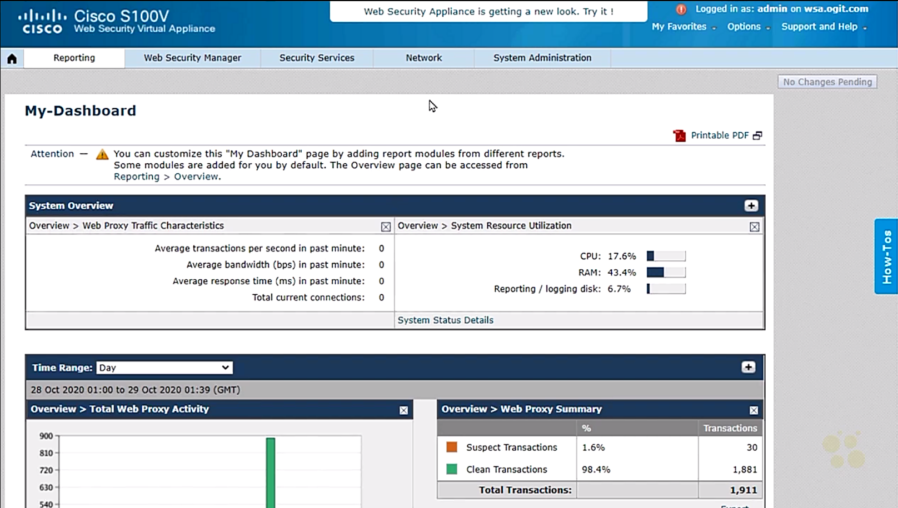

# Application Layer Security


## 38. Capture and Redirection Methods


### Capture and Redirection Overview

- Capturing and redirecting web traffic
  - web security appliance (WAS) connected in inside zone to examine the web traffic
  - explicit forwarding
    - computer configured to forward web traffic to WSA
    - configured manually 
    - automatic: proxy auto-config file (PAC), group policy object (GPO)
  - capture and redirect web traffic
    - network devices in the path of network to capture and redirect the web traffic
    - options
      - PBR: policy base routing
      - WCCP: web cache communication protocol


### Policy Based Routing (PBR) Overview

- Policy based routing overview
  - via access control list (ACL)
  - route map: if TCP:443 then forward to WSA
  - applied to interfaces in default gateway


### PBR Configuration and Testing

- Demo: config PBR
  - topology
    - PC not explicitly config to forward traffic to WSA
    - SW connecting PC, WSA, AD, R1 and other network devices
    - WAS w/ .155 IP address
    - AD w/ .100 IP address
    - R1 as the default gateway
  - task: redirect web traffic to WAS for inspection before browse the Internet
  - verify PV Windows proxy setting: Proxy Settings > Manual proxy setup > Use a proxy server = Off

  ```text
  PC> ip config /all
  <...truncated...>
  IPv4 Address      : 192.168.1.116
  Subnet Mask       : 255.255.255.0
  Deafult Gateway   : 192.168.1.136
  <...truncated...>

  ! open web browser to access a web site
  SW# show ip int brief | exclude una
  Interface     IP-Address      OK? Method  Status        Protocol
  Vlan1         192.168.1.136   YES VNARM   up            up

  SW# terminal monitor
  SW# who
      Line      User  Host(s)   Idle        Location 
     0 con 0          idle      00:00:34
  *  2 vty 1          idle      00:00:00  192.168.1.151

  ! config ACL
  SW# conf t
  SW(config)# ip access-list extended ACL-ForPBR
  SW(config-ext-nacl)# permit tcp host 192.168.1.116 any eq 443
  SW(config-ext-nacl)# exit
  SW(config)# route-map Redirect-Policy permit 10
  SW(config-route-map)# match ip address ACL-ForPBR
  SW(config-route-map)# set ip next-hop 192.168.1.155
  SW(config-route-map)# exit

  ! apply to interface
  SW(config)# int vlan1
  SW(config-if)# ip policy route-map Redirect-Policy
  SW(config-if)# end

  ! verify config
  SW# show ip policy
  Interface       Route map
  Vlan1           Redirect-Policy

  ! verify from PC w/ browser open fireballwhisky.com
  ! the web page unable to be displayed
  ```


### WCCP Overview and Planning

- Plan for web traffic redirect w/ WCCP
  - redirect TCP:80 and TCP:443 traffic to WSA
  - ACL to match and redirect traffic
  - config WCCP to adopt the ACLs
  - router w/ IP 192.168.1.136


### WSA Configuration for WCCP

- Demo: config WSA to redirect web traffic
  - topology
    - R1 w/ 192.168.1.136
    - WSA w/ 192.168.1.155
  - task: config WCCP to redirect web traffic to WSA
  - Web Security Virtual Appliance (WSA)
    - tabs - Reporting, Web Secure Manager, Security Services, Network, System Administration
    - Network tab > Transparent Redirection > Transparent Redirection Device: Type = L4 switch or No Device > 'Edit Device' button
    - Transparent Redirection > Transparent Redirection Device: Type = WCCP v2 Router; WCCP v2 Service > 'Add Service' button
    - Add WCCP v2 Service: Service Profile Name = JUST-HTTP; Service: standard Service ID: 0 web-cache (destination port 80) = On; Router IP address = 192.168.1.136; Router Security: Enable Security Service = On, Passphrase = `****` > 'Submit' button
    - Transparent Redirection > Transparent Redirection Device: Type = WCCP v2 Router; WCCP v2 Service: fields - Service Profile Name, Service ID, Router IP adddresses, Ports, Delete
    - entry - Service Progfile Name = Just-HTTP, Service ID = 0, Router IP addresses = 192.168.1.136, Ports = 80 > 'Add Service' button
    - Add WCCP v2 Service > Service Profile Name = HTTPS; Service: Dynamic Service ID = 90, Port numbers = 443, Router IP address = 192.168.1.136; Router Security: Enable Security fir Service = On, Passphrase = `****` > 'Submit' button
    - entry - Service Progfile Name = HTTPS, Service ID = 90, Router IP addresses = 192.168.1.136, Ports = 443
    - Transparent Redirection > 'Commit Changes' button on top right corner > Uncommit Changes > 'Commit Changes' button


### IOS Configuration for WCCP

- Demo: config Router for WCCP
  - PC w/ 192.168.1.116
  - `web-cache`: standard web caching serverice, i.e., port 80

  ```text
  SW# conf t
  ! config extended ACLs for web traffic 
  SW(config)# ip wccp source-interface vlan1
  SW(config)# ip access-list extended HTTP
  SW(config-ext-nacl)# permit tcp host 192.168.1.116 any eq 80
  SW(config-ext-nacl)# exit
  SW(config)# ip access-list extended HTTPS
  SW(config-ex-nacl)# permit ip tcp host 192.168.1.116 any eq 443
  SW(config-ex-nacl)# exit

  ! config standard ACL to redirect traffic
  SW(config)# ip access-list standard WSA
  SW(config-std-nacl)# permit host 192.168.1.155
  SW(config-std-nacl)# exit

  ! config WCCP
  SW(config)# ip wccp web-cache redirect-list HTTP group-list WSA password Cisco!23
  SW(config)# ip wccp 90 redirect-list HTTP group-list WSA password Cisco!23
  SW(config)# end

  SW# debug ip wccp packets
  WCCP-PKT:IPv4:S0: Sending ISY to 192.168.1.155, rcv_id:8
  WCCP-PKT:IPv4:S0: Sending 708 bytes rom 192.168.1.136 to 192.168.1.155
  WCCP-PKT:IPv4:D90: Sending ISY to 192.168.1.155, rcv_id:6
  WCCP-PKT:IPv4:D90: Sending 708 bytes rom 192.168.1.136 to 192.168.1.155
  SW# undebug all

  ! apply WCCP to interface
  SW# conf t
  SW(config)# int vlan 1
  SW(config-if)# ip wccp web-cache redirect in
  SW(config-if)# ip wccp 90 redirect in
  SW(config-if)# end

  ! verify config
  SW# show ip wccp
  Global WCCP information:
   Router information:
       Router Identifier:                   192.168.1.136
       Configured source-interface:         Vlan1

   Service Identifier: web-cache
       <...truncated...>
       Redirect access-list:                HTTP
       Total Packets Denied Redirect:       0
       Total Packets Unassigned:            0
       Group access-list:                   WSA
       <...truncated...>

   Service Identifier: 90
       <...truncated...>
       Redirect access-list:                HTTPS
       Total Packets Denied Redirect:       0
       Total Packets Unassigned:            0
       Group access-list:                   WSA
       <...truncated...>
  ```


### Testing WCCP

- Demo: verify WCCP redirecting web traffic
  - NB: clear browser cache before testing
  - PC IP addr: 182.168.1.116
  - verify PC auto and manual proxy setting: both off
  - verify PC reachability to the Internet: `ping 8.8.8.8`
  - open web browser w/ google search 'alcohol'
  - open any website w/ search result 
  - page asking for sign in w/ username and password via http://esa.ogit.com


## 39. Cisco Web Security


### Web Security Appliance Overview

- Web security appliance overview
  - either physical or virtual machine
  - WSA as a proxy or just redirect to send web requests
  - proxy w/ many policies
    - subnets
    - AD user/group
    - port
    - URL filtering
    - apps
    - DLP
    - malware
  - web reputation based on Talos

  <figure style="margin: 0.5em; display: flex; justify-content: center; align-items: center;">
    
  </figure>


### WSA and AD Integration

- Integrating WSA and AD
  - WSA: tabs - Reporting, Web Security Manager, Security Services, Network, System Administration
  - Network tab > Authentication
  - Authentication > Authentication Realms > 'Add Realms' button
  - Add Realm: sections - Authentication Realm, LDAP Authentication/Active Directory Authentication
    - Authentication Realm: Realm Name = ADServer, Authentication Server Type and Scheme(s) = Active Directory (Kerberos, NTLMSSP or Basic Authentication), Test Current Setting
    - Active Directory Authentication
      - Active Directory Server: Set Source Interface = On, Source Interface = Management, 192.168.1.100
      - Active Directory Account: Active Directory Domain = ogit.com, 'Join Domain' button > Computer Account Credentials: Username = administrator, password = `****`
      - Test Current Settings: 'Start Test' button > message displayed 
      - 'Submir' button > Authentication >'Commit Change' button on top right corner > Uncommitted Change: Comment (optional) = Just add ed AD to the Mix > 'Commit Changes' button


### WSA Identification Profiles

- Demo: WAS identity profile
  - assumption: web proxy set via either on local machine or WCCP/PBR redirect
  - Web Security Manager tab > Identification Profiles
  - Client / user Identification Profiles: fields - Order, Transaction Criteria, Authentication / Identification Decision, End-User Acknowledgement, Delete > 'Add Identification Profile...' button
  - Identification Profiles: Add Profile > sections - Client / User Identification Profile Settings, User Identification Method, Membership Definition
    - Client / User Identification Profile Settings: Enable Identification Profile = on, Name = OurProfileOne, Insert above = 1 (Global Profile)
    - User Identification Method: Identification and Authentication = Authenticate Users; Authentication Realm: Select a Realm or Sequence = ADServer, Select a Scheme = Use Basic (in production - Use Kerberos or NTLMSSP); Authentication Surrogates = IP Address
    - Membership Definition: Define Members by Protocol = HTTP/HTTPS
    - 'Submit' button > Identification Profiles: Warning - The policy group "OurProfileOne" was added
    - entry - Order = 1, Transaction Criteria = OurProfileOne, Authentication/Identification Decision = Realm: ADServer (Scheme: Basic), End-User Acknowledgement = (global profile)
    - 'Commit Changes' button > Uncommitted Changes: Comments (optional) = added identity profile > 'Commit Changes' button
  - verify w/ PC browser to open a alcohol website and a sign in page shown
  - verify on WSA: Reporting tab > URL Categories: URL Categories Matched > entry - URL Category = Alcohol, ...
  - not really block the alcohol web traffic but just ask for sign in to allow traffic went through


### WSA Access Policies

- Demo: WSA access policies
  - Web Security manager tab > Access Policies > Policies: fields - Order, Group, Protocols and User Agents, URL Filtering, Applications, Objects, Anti-Malware and Reputation
  - order of policies: to-down
  - default entry - Group = Global Policy, Protocols and User Agenets = No blocked items, URL Filtering = Monitor: 86, Applications = Monitor: 345, Objects = No blocked items, Anti-Malware and Reputation = 'Web Reputation: Enabled, Advanced Malware Protection: Enabled, Anti-Malware Scanning: Enabled' 
  - Policies > 'Add Policy' button
  - Access Policy: Add Group: sections - Policy Settings, Policy Member Definition
    - Policy Settings: Enable policy = On, Policy Name = NoDrinkForBob, Insert Above Policy = 1 (Global Policy)
    - Policy Member Definition: Identification Profiles and Users = Select One or More Identification Profiles, Identification Profile = OurProfileOne, Authorized Users and Groups = Select Groups and Users, Groups = No groups entered, Users = No users entered > 'No users entered' link > Authorized Users = bob > 'Done' > 'Submit' button
    - new entry - Order = 1, Group = NoDrinkForBob, Protocols and User Agents = URL Filtering = Applications = Objects = AntiMalware and Reputation = (global policy) > '(global policy)' link under URL Filtering
    - Access Policies: URL Filtering: NoDrinkFor Bob: sections Custom and External URL Category Filtering, Predefined URL Category Filtering
    - Predefined URL Category Filtering: fields - Category, Use Global Settings, Override Global Settings (Block, Monitor, Warn, Quota-Based, Time-Based)
    - modify: Access Policies: URL Filtering: NoDrinkFor Bob: entry - Category = Alcohol, Block = On > 'Submit' button
    - 'Commit Change' button on top-right corner > Uncommitted Changes: Comments = Sorry Bob > 'Commit Changes' button
  - Access Policies: Success - Your changes have been committed.
  - Verify w/ open Alcohol website using Bob and other user to sign in


### WSA Application Filtering

- Demo WSA application filtering
  - task: forbit Bob to browse facebook.com
  - Verify from PC for Google Translate -> OK
  - Web Security Manager tab > Access Policies > entry - Group = NoDrinkForBob, Application = (global policy) > 'NoDrinkForBob' link
    - Access Policy: NoDrinkForBob > Policy Settings: Policy Name = SorryBob > 'Submit' button
    - entry - Group = SorryBob, Application = (global policy) > 'NoDrinkForBob' link
    - Access Policies: Application Visibility and Control: SorryBob > sections - Edit Application Settings, Application Settings
    - Application Settings: entry - Applications = Internet Utilities - Google Translate = Used Global (Monitor) > 'Used Global (Monitor)' link
    - Set action for application Google Translate = Block > 'Apply' button > 'Submit' button
    - modified entry: Order = 1, Group = SorryBob, Protocols and User Agent = (global policy), URL FIltering = 'Block: 1, Monitor: 85', Application = 'Block: 1, Monitor: 344', Objects = Anti-Malware and Reputation = (global policy)
    - 'Commit Changes' button > Uncommitted Changes > 'Commit Changes' button
  - verify from PC for Google Translate w/ Bob account -> blocked
  - failed scenario:
    - payload was encrypted and application filtering not working
    - TLS decryption to deep inspect on the traffic


### WSA TLS Decryption Overview

- WSA TLS decryption overview
  - verify WSA setting: Google Translate blocked
    - Access Policies: Appplications Visibility and Control: SorryBob > Applications Settings
    - entry - Applications = Google Translate, Settings = Block
  - verify from PC
    - open Chrome in incognito mode w/ 'translate.google.com'
    - sign in: Username = bob, Password = `****`
    - Page shown 'his Page Cannot Be Displayed'
  - verify from PC w/ Google search engine
    - incognit mode open 'google.com' ans search for 'translate'
    - access Google Translate from searching result
    - Google Translate working
  - issue: WSA no idea about application layer so far, i.e., the payload of packets
  - solution: TLS decryption
    - 2 HTTPS sessions: 1) btw PC and WSA; 2) btw WSA and web server
    - WSA able to see the dst of original request and establish the 2nd HTTPS session w/ web server


### WSA Certificate Management

- Demo: add trusted root certificate on WSA
  - Network tab > Certificate Management > Certificate Management: sections - Appliance Certificates, Certificate Lists (Updates, Certificate Management)
  - Certificate List > Certificate Management: Trust Root Certificates = 250 certificates in Cisco trusted root certificate list > 'Manage Trusted Root Certificates ...' button
  - Manage Trusted Root Certificates: sessions - Custom Trusted Root Certificates, Cisco Trusted Root Certificate List
    - fields - Certificate, Expiration Date, Override Trust
    - MS Active Directory Certificate Service > 'Download a Certificate, certificate chain, or CRL' link > Encoding method = Base 64 > 'Download CA certificate chain' link > save 'CA-Cert.cer' file
    - Custom Trusted Root Certificates > 'Import...' button > Import > 'Choose File' button > select 'CA-Cert.cer' file > 'Submit' button
    - Manage Trusted Root Certificates > Custom Trusted Root Certificates > new entry - Certificate = SRV-CA > 'Submit' button
    - Certificate Management > 'Commit Changes' button > Uncommitted Changes > 'Commit Changes' button
  - Certificate List > Certificate Management: Trust Root Certificates = 250 certificates in Cisco trusted root certificate list, 1 custom certificates added to trusted root certificate list


- Demo: add identity certificate signed by CA on WSA
  - Security Services tab > HTTPS Proxy > HTTPS Proxy Settings > 'Enable and Edit Settings...' button
  - Edit HTTPS Proxy Settings: setions - HTTPS Proxy Settings, Decryption Options, Invalid Certificate Options, Online Certificate Status Protocol Options
    - HTTPS Proxy Settings: Enable HTTPS Proxy = On; HTTPS Ports ro Proxy = 443; Root Certificate for Signing: Use Generated Certificate and Key = On > 'Generate New Certificate and Key' button
    - Generate Certificate and Key: Common Name = wsa.ogit.com, Organization = ogit, Organization Unit = IT, Country = US, Duration before expiration: 10 months > 'Generate' button
    - Edit HTTPS Proxy Settings:Success - Certificate and Key Successfully generated.
    - HTTPS Proxy Settings > Root Certificate for Signing: Use Generated Certificate and Key > 'Download Certificated Signing Request...' link > Save as 'WSA-CSR2.pem' > Copy the contents in 'WSA-CSR2.pem'
    - MS Active Directory Certificate Service > 'Request a certificate' link > 'Advanced certificate request' link > Saved Request = copied contents in 'WSA-CSR2.pem' > 'Submit' button > Certificate Issued: Base 64 encoded = On > 'Download certificate' button > save as 'WSA-ID-cert2.cer'
    - HTTPS Proxy Settings > Root Certificate for Signing: Signed Certificate > 'Choose File' button > Certificate = 'WSA-ID-cert2.cer'
    - Descryption Options: Enable decryption for authentication = On, Enable descryption for display of end-user notification pages = On, Enable descryption for display of the end-user acknowledgement page = On, Enable descryption for enhanced application visibility and control = On
    - Online Certificate Status Protocol Options: if applicable
    - 'Submit' button > 'Continue' button > HTTPS Proxy: 'Commit Changes' button on top-right


### WSA Decryption Policy

- Demo: config decryption policy on WSA
  - task: restrict the decryption on certain categories of web sites only
  - Web Security Manager tab > Decryption Policies
  - Policies: fields - Order, Group, URL Filtering, Web Reputation, Default Action > 'Add Policy...' button
    - default entry - Group = Global Policy, URL Filtering = 'Monitor: 86', Web Reputation = Enabled, Default Action = Decrypt
  - Decryption Policy: Add Group: sections - Policy Settings, Policy Member Definition
    - Policy Settings: Enable Policy = On; Policy Name = Descryption Policy one, Insert Above Policy = 1 (Global Policy)
    - Policy Member Definition: Authorized Users and Groups = Selected Groups and Users, Groups = No Groups entered, Users = No user entered; Add Identification Profile = > 'No users entered' link > Authorized Users = bob > 'Done' button
    - Policy Member Definition: Identification Profiles and Users = Select One or More Identification Profiles; Identification Profile = OurProfileOne; Authorized Users and Groups = Selected Groups and Users, Groups = No Groups entered, Users = bob > 'Submit' button
  - Decryption Policy: Policies > new entry - Order = 1, Group = Decryption Policy one, URL Filtering = Web Reputation = Default Action = (global Policy) > `(global Policy)' link under URL Filtering
    - Descryption Policies: URL Filtering > Decryption Policy one > Predefind URL Category Filtering: Override Global Settings - Pass Through, Monitor, Decrypt, Drop, Quota-Based, Time-Based
    - default: Decrypt
    - entry - Category = Auction, Override Global Setting = Pass Through
    - entry - Category = Finance, Override Global Setting = Pass Through
    - 'Submit' button > Decryption Policies > new entry - Order = 1, Group = Decryption Policy one, URL Filtering = 'Pass Through: 2, Monitor: 84' > 'Commit Changes' button > 'Commit Changes' button


- Demo: verify decryption policy
  - identify TLS descryption:
    - looking for the lock or unlock icon on the URL bar line before the URL
    - click on the lock icon, the msg shown the status of current connection, certificate, cookie and site settings
  - PC opens incognito Chrome w/ google.com > Sign in w/ bob's account > OK
    - Connection is Secure, Certificate (valid), Cookies (4 in use), Site Settings > 'Certificate' icon
    - Certificate > Issued to: www.google.com; Issued by: wsa.ogit.com
      - certificate issued from wsa.ogit.com
      - part of the enterprise root certificate (wsa.ogit.com)
      - client config to trust the CA and subordinate CA
  - search for an auction web site and browse its web site
    - Certificate > Issued to: www.ha.com; Issued by: DigiCert SHA2 Extended Validation Server CA
    - issued by a PKI and no decryption
  - visit paypal.com
    - Certificate > Issued to: www.paypal.com; Issued by: DigiCert SHA2 Extended Validation Server CA


### WSA Additional Security Features

- Demo: WSA features
  - System Adminstration tab > Feature keys: list of keys available on this appliance
  - Security Services tab > Policy Services > Acceptable Use Controls: capability of WSA
    - Acceptable Use Control: sections - Acceptable Use Control Settings, Acceptable Use Controls Engine Updates, Inspectable Archives Settings
    - Acceptable Use Controls Settings: Acceptable Use Controls Service Status = Enabled, Application Visibility and Control = Enabled, Dynamic Content Analysis Engine = Enabled, Multiple URL Categories = Enabled, Default action for Unreachable Service = Enabled, YouTube VCategorization = Disabled
    - Acceptable Use Controls Engine Updates: status of the updates
  - Security Services tab > Policy Services > Anti-Malware and Reputation
    - sections - Anti-Malware and Reputation Settings, Appliance Grouping for File Analysis Cloud Reporting, Anti-Malware Engine and Web Reputation Rules Updates,
    - Anti-Malware and Reputation Settings: list of current version and last update > 'Update Now' button
  - Reporting tab > Security: Anti-Malware, Advanced Malware Protection, File Analysis, AMP Verdict Updates, Client Malware Risk, Web Reputation Filters, L4 Traffic Monitor
  - working w/ Talos


## 40. Cisco Email Security


### Cisco Email Security Overview

- Email security overview
  - mail user agent (MUA), e.g., outlook
  - email server: mail transfer agent (MTA) to forward email to destination MTA
  - protocols used to download emails: IMAP / POP3
  - protocol used to send email: SMTP
    - MX: mail exchange record, including a list of destination mail server domain anmes
    - A: record of IP address resolving for mail server
  - ESA (email security appliance)
    - a middle-of-the-man security device
    - as an email server from outside world
    - relay emails to internal email server
    - both on-premise and cloud-based solution (CES)

  <figure style="margin: 0.5em; display: flex; justify-content: center; align-items: center;">
    
  </figure>


### ESA Inbound Mail Overview

- Inbound email on ESA
  - components:
    - public listener: a logical component receiving inbound requests from untrusted world
    - private listener: intacting w/ email server
  - ESA checking
    - reputation of senders
    - host access table (HAT)
  - incorporating w/ Talos
    - having real-time reaction on malicious
    - recipient access table (RAT)


- Demo: ESA incoming mail
  - ESA: tabs - Monitor, Mail Policies, Security Services, Network System Adminstration
  - Incoming Mail Policies: sections - Find Policies, Policies; fields - Order, Policy Name, <span style="color: cyan;">Anti-Spam, Anti-Virus, Advanced Malware Protection, GrayMail, Content Filters, Outbreak Filters, Advanced Phising Protection</span>
  - default entry - Policy Name = Default Policy, Anti-Spam = 'IronPort Anti-Spam, Positive: Quarantine, Suspected: Quarantine', Anti-Virus = 'Sophos, Encrypted: Deliver, Unscannable: Deliver, Virus Positive: Drop', Advanced Malware Protection = Greymail = Advanced Phising Protection = Not Available, Content Filters = SampleFilter, Outbreak Filters = 'Retention Time: Virus: 1 day'


### Blocking Incoming Email

- Talos, [IP and Domain Reputation Center](https://talosintelligence.com/reputation_center)


- Demo: ESA 
  - Mail Policies tab > Host Access Table (HAT) > HAT Overview
  - HTA Overview > Sender Groups (listener: IncomingMail 10.1.1.1:25): fields - Order, Sender Groups, SenderBase Reputation Score, External Threat Feed Sources Applied, Mail Flow Policy
  - entries - Sender Group = RELAYLIST, WHITELIST, BLACKLIST, SUSPECTLIST, UNKNOWNLIST
  - SenderBase Reputation Score (SBRS): block = (-10, -3), throttle = (-3, -1), accept = (-1, 10)
  - 'BLACKLIST' link > Sender Group: BLACKLIST - IncomingMail 10.1.1.1:25 > sections - Send Group Settings, Find Senders, Send List: Display All Items in List
  - Send List: Display All Items in List > 'Add Sender...' button
  - Add Sender to BLACKLIST: Sender Type = IP Addresses | (*)Geolocation; Ad Country: Country Name = Aruba > 'Submit' button > 'Commit Changes' button on the top-right corner > 'Commit Changes' button
  - modify mail flow policy on block
    - Mail Policy Host Access Table (HAT) > HAT Overview > Mail Flow Policy = BLOCKED > 'BLOCKED' link
    - Mail Policy Host Access Table (HAT) > Mail Flow Policy > Policy Name = BLOCKED > 'BLOCKED' link
    - Network tab > Listeners > Listener Name = IncomingMail, HOST Access Table = HAT > 'HAT' link HAT Overview > Mail Flow Policy = BLOCKED > 'BLOCKED' link


### ESA Outbound Mail Overview

- Demo: config and verify outgong mail settings
  - Network tab > Listeners > Listeners: sections - Listerners. Global Settings
  - Listerners: fields - Listener Name, Interface, Port, Host Access Table, Recipient Table
  - Listeners > default entries - Listener Name = IncomingMail, Host Access Table = HAT, Recipient Access Table = RAT; Listener Name = OutgoingMail, Host Access Table = HAT, Recipient Access Table = N/A
  - 'OutgoingMail' link > Edit Listener: Name = PrivateListener > 'Submit' button > 'Commit Changes' button > 'Commit Changes' button
  - 'RAT' link > Recipient Access Table Overview > Overview for Listener: fields - Order, Recipient Address, Default Action
    - entries - Recipient Address = 'admin@ogit.com, keith@ogit.com', Default Action = Accept (Bypass LDAP); Recipient Address = ogit.com, Default aCtion = Accept; Recipient Name = All Other Recipients, Default Action = Reject
  - Listeners > Listener Name = PrivateListener, Host Access Table = HAT > 'HAT' link
  - HAT Overview > Sender Groups > Sender Group = RELAYLIST, MAil Flow Policy = RELAYED > 'RELAYLIST' link
  - Sender Group: REPLAYLIST - PrivateListener 10.2.2.1:25 > Sender List: Display All Items in List: Sender = 192.168.1.100 (email server)


- Demo: policies for outbound mails
  - Mail Policies tab > Outgoing Mail Policies: fields - Policy Name, <span style="color: cyan;">Anti-Spam, Anti-Virus, Advanced Malware Protection, Greymail, Content Filters, Outbreak Filters, DLP</span>
  - default entry - Policy Name = Default Policy, Anti-Spam = 'IronPort Anti-Spam, Positive: Delivery, Suspected: Delivery', Anti-Virus = 'Sophos, Encrypted = Deliver, Unscannable: Deliver, Virus Positive: Drop', Advanced Malware Protection = Greymail = Not Available, Content Filters = 'Sample-OutBound-Filter, HighSecEncrypt', Outbreak Filters = 'Retention Time: Virus: 1 day', DLP = 'PCI-DSS (Payment Card Industry Data Security Standard), Canada PIPEDA (Personal Information Protection and Electronic Act), Contact Information (US)'


### SPAM Filtering

- Demo: config Spam filtering on ESA
  - Security Services tab > Anti-Spam > IronPort Anti-Spam: sections - IronPort Anti-Spam Overview, Rule Updates
    - IronPort Anti-Spam Overview > 'Edit Global Settings...' button > Enable IronPort Anti-Spam Scanning = On > 'Submit' button
    - Rule Updates: entries
  - System Adminstration tab > Feature Keys: what keys on the system
  - Mail Policies > Email Security Policies > Incoming Mail Policies > entry - Policy Name = Default Policy, Anti-Spam = 'IronPort Anti-Spam, Positive: Quarantine, Suspected: Quarantine' > 'IronPort Anti-Spam, Positive: Quarantine, Suspected: Quarantine' link to modify existing policy
  - Mail Policies: Anti-Spam: sections - Anti-Spam Settings, Positive-Identified SPam Settings, Suspected Spam Settings
    - Anti-Spam Settings: Enable nti-Spam Scanning for this Policy = use IronPort Anti-Spam service
    - Positive-Identified SPam Settings: Apply this Action to Message = Deliver | (*)Drop | Spam Quatantine | Bounce
    - Suspected Spam Settings: Enable Suspected Spam Scanning = Yes, Apply This Action to Message = Span Quarantine
    - Spam Threshold: IronPort Anti-Spam = Use the Default Thresholds (default: suspected = 50~90, spam > 90)


### Email Anti-Virus

- Demo: comfig anti-virtual on ESA
  - Mail Policies tab > Incoming Mail Policies > Policies
  - default entry - Policy Name = Default Policy, Anti-Spam = 'IronPort Anti-Spam, Positive: Quarantine, Suspected: Quarantine', Anti-Virus = 'Sophos, Encrypted: Deliver, Unscannable: Deliver, Virus Positive: Drop', Advanced Malware Protection = Greymail = Advanced Phising Protection = Not Available, Content Filters = SampleFilter, Outbreak Filters = 'Retention Time: Virus: 1 day' > 'Sophos, Encrypted: Deliver, Unscannable: Deliver, Virus Positive: Drop' link (license required to enable)
  - license: System Administration tab > Feature Key Settings > Feature Keys: list of available license keys
  - add Anti-Virus license: Security Services > Anti-Virus (Sophos, McAfee) > 'Sophos > Sophos Anti-Virus: sections - Sophos Anti-Virus Overview, Current Sophos Anti-Virus files
    - Sophos Anti-Virus Overview: Anti-Virus Scanning by Sophos Anti-Virus = Enabled
    - Current Sophos Anti-Virus files > 'Update Now' button to check for updates
  - Mail Policies: Anti-Virus: sections - Anti-Virus Settings, Message Scanning, Required Messages, Encrypted Messages,  Unscannable Messages, Virus Infected Messags
    - Anti-Virus Settings: Enable Anti-Virus Scanning for This Policy = Yes, Use Sophos Anti-Virus = On
    - Message Scanning: Scan for Viruses only
    - 'Submit' button > 'Commit Changes' button > 'Commit Changes' button
  - default entry - Policy Name = Default Policy, Anti-Virus = 'Sophos, Encrypted: Drop, Unscannable: Deliver, Virus Positive: Drop'


### DLP

- Demo: config DLP on ESA
  - DLP for outgoing mails only
  - Mail Policies tab > Email Security Manager > Outgoing Mail Policies > Policies
  - default entry - Policy Name = Default Policy, Anti-Spam = 'IronPort Anti-Spam, Positive: Delivery, Suspected: Delivery', Anti-Virus = 'Sophos, Encrypted = Deliver, Unscannable: Deliver, Virus Positive: Drop', Advanced Malware Protection = Greymail = Not Available, Content Filters = 'Sample-OutBound-Filter, HighSecEncrypt', Outbreak Filters = 'Retention Time: Virus: 1 day', DLP = 'PCI-DSS (Payment Card Industry Data Security Standard), Canada PIPEDA (Personal Information Protection and Electronic Act), Contact Information (US)'
  - DLP Policies:
    - PCI-DSS (Payment Card Industry Data Security Standard) = Enable
    - Canada PIPEDA (Personal Information Protection asnd Electronic Act) = Enable
    - Contact Information (US) = Enable
  - add new default DLP policy:
    - Mail Policies tab > Data Loss Prevention (DLP) > DLP Policy Manager > Active DLP Policies for Outgoing Mail: fields - Order, DLP Policy > 'Add DLP Policy...' button
    - DLP Policy Manager > Add DLP Policy from Template > Acceptable Use > Add Contact Information > 'Add' link
    - Policy: Contact Information > DLP Policy Name = Test DLP
    - Severity Settings: Critical Severity Incident = Default Action; High/Medium/Low Severity Incident = Inherit Action from Critical Severity Incident
    - 'Submit' button > 'Commit Changes' button > 'Commit Changes' button
  - Mail Policies tab > Email Security Manager > Outgoing Mail Policies > Policies > entry - Policy Name = Default Policy, DLP = 'PCI-DSS (Payment Card Industry Data Security Standard), Canada PIPEDA (Personal Information Protection asnd Electronic Act), Contact Information (US)' > 'PCI-DSS (Payment Card Industry Data Security Standard), Canada PIPEDA (Personal Information Protection and Electronic Act), Contact Information (US)' link
  - Mail Policies: DLP > DLP Policies > Test DLP = Enable > 'Submit' button > 'Commit Changes' button > 'Commit Change' button 


### Encryption

- Demo: email encryption on ESA
  - create a profile for encryption
    - Security Services tab > Cisco IronPort Email Encryption
    - Email Encryption Global Settings: Cisco IronPort Email Encryption = Enable (or 'Edit Settings' button to enable)
    - Email Encryption Profiles > 'Add Encryption Profile...' button
    - Add Encryption Envelope Profile: sections - Encryption Profile Settings, Key Server Settings, Envelope Settings, Notification Settings
      - Encryption Profile Settings: Profile Name = Test
      - Key Server Settings: Key Service Type = Cisco Registered Envelope Service
      - Envelope Settings: Envelope Message Security = High Security; Logo Link = No Link; Read Receipts = Enable Read Receipts
      - 'Submit' button
    - Email Encryption Profiles: new entry - Profile = Test, Key Service = Cisco Registered Envelope Service, Provision Status = Not provisioned > 'Commit Changes' button > 'Commit Changes' button
  - apply the creates profile to filter
    - Mail Policies tab > Outgoing Content Filters > Filters: fields - Order, Filter Name, Description | Rules | Policies
    - entry - Order = 2, Filter Name = HighSecEncrypt > 'HighSecEncrypt' link
    - Edit Outgoing Content Filter: sections - Content Filter Settings, Conditions, Actions
      - Content Filter Settings: Name = HighSecEncrypt
      - Confitions: Condition = Subject Header, Rule = 'subject == "\\[send secure]\\"' > 'Subject Header' link
      - Edit Condition > ATtachment Content: Contains text = supersecrete > 'Ok' button
      - Actions: Action = Encrypt on Delivery, Rule = 'encrypt-deferred("HighSecurity", "$subject", 0)'
  - apply the filter to policy
    - Mail Policies tab > Email Security Manager > Outgoing Content Filters > Policies > entry - Policy Name = Default Policy, Content Filters = 'Sample-OutBound-Filter, HighSecEncrypt' > 'Sample-OutBound-Filter, HighSecEncrypt' link


## 41. Cisco Umbrella


### Cisco Umbrella Overview

- Cisco Umbrella overview
  - security issues of DNS
    - bad/incorrect info
    - malicious web site
    - tunneling by attackers
  - Umbrella
    - Talos providing intelligence
    - a could solution
    - DNS as part of Umbrella service
    - DNS requests forwarding to Umbrella


### Umbrella Components

- Umbrella components
  - OpenDNS public DNS server: 208.67.222.222 & 208.67.220.220
  - Umbrella DNS service (licensed): filtering 17 categories of web sites
  - local DNS server
    - virtual appliance installed in DHCP server
    - internet DNS forwards to local DNS server
    - external DNS forwards to public DNS server
  - remove access
    - Umbrella client on PC
    - redirect to OpenDNS
    - enforce filtering

- Demo: Umbrella DNS service
  - verify PC

    ```text
    PC> ipconfig -all
    Windows Ip Configuration:
      <...truncated...>
    Ethernet adapter EEthernet0:
      <...truncated...>
      IPv4 Address      : 192.168.1.116(preferred)
      Subnet Mask       : 255.255.255.0
      Default Gateway   : 192.168.1.1
      DNS Servers       : 8.8.8.8
      <...truncated...>
    ```

  - verify connectivity w/ web browser
    - open 'www,google.com' -> OK
    - open 'cbtnuggets.com' -> OK
    - open 'internetbadguys.com' -> OK
  - config DNS server to OpenDNS
    - Control Panel > Network and Internet > Network and Sharing Center > Change adapter settings
    - Ethernet0 > right click on icon > Properties
    - Ethernet-0 Properties > Internet Protocol Version 4(TCP/IPv4) > Properties
    - Use the forwarding DNS server address: Preferred DNS server = 208.67.222.222, 208.67.220.220
  - verify w/ 'internetbadbuys.com' -> Blocked
  - open 'welcome.umbrella.com' -> indicating Umbrella service used


### Policy Overview

- Policy overview
  - analogy: shopping cart w/ many different items
  - possible components
    - destinations
    - content categories
    - apps
    - TLS decryption (optional)
    - security settings: malware sites
    - feedback (block page)
    - 3rd party features


### Policy Components

- Demo: create customized policy components on Umbrella
  - log on Umbrella
  - left panel folders - Overview, Deployment, Policies, Reporting, Investigate, Admin
  - Policy folder > Management > All Policies
  - Default Policy: Policy Name = Default Policy, Applied to All Identities, 2 Destination Listed Enforces, Security Setting Applied: Default Settting, Content Setting Applied: Default Settings, Filer Analysis Nor Enabled, Customer Block Page Applied, No Application Setting Applied
  - Policy folder > Management > Policy Components: Destination Lists, Content Categories, Application Settings, Security Settings, Block Page Appearance, Integration
  - Policy folder > Management > Policy Components > Destination Lists > 'Add' icon on top right corner
  - New Destination List: List Name = Our Custom Destination List; Destination in this list should be = Blocked, input field = www.acme.com > 'Add' button > 'Save' button
    - Destination Lists: new entry - Our Custom Destination List, Type = Blocked, Domains = 1, IPs = 0, URLs = 0
  - Policy folder > Management > Policy Components > Content Categories > 'Add' icon
    - Add New Content Setting: Seting Name = Our Custom Content Filtering; Copy From Existing = High; Categories to Block = Alcohol, Adware, Adult Themes, Chat, ... (inherited from High and modify from the setting) > 'Save' button
  - Policy folder > Management > Policy Components > Application Settings > 'Add' icon
    - Add New Application Setting: Give Your Setting a Name = Our Custom App Setting; Application to Control = Google Drive, IDrive, InCloudDrive, ... > 'Save' button
  - Policy folder > Management > Policy Components > Security Settings > 'Default Settings' link
    - Default Settings: Setting Name = Default Settings; checked items = Malware, Command and Control Callbacks, Phising Attacks > 'Add' icon
    - Setting Name = Our Custom Security Setting; checked items = Malware, Newly Seen Domains, Command and Control Callbacks, Phising Attacks, Dynamic DNS, Potentially Harmful Domains, DNS Tunneling VPN, Cryptomining > 'Save' button
    - new entry - Our Custom Security Setting, Setting Enabled = 8, Integrations = 0
  - Policy folder > Management > Policy Components > Block Page Appearance > 'Add' icon
    - Add New Block Page Appearance: Block Page Appearance Name = Custom Block Page; Blocked erequests should be treated: The Same = On, Show a Block page with a custom message = (*)Show on a block page with the default message | (type in whatever to show on blocked page) | Redirect users to this URL = (enter a URL); Allow blocked users to contact an admin from the block page = admin@ogit.com > 'Save' button


### Policy Creation

- Demo: create a policy on Umbrella
  - aggregate policy components into a policy
  - Policies folder > Management > All Policies > 'Add' icon or modify Default Policy
  - Wizard fashion ('Previous' or 'Next' button to advance or backward)
    - What would you like to protect?: Select Identities = (empty for further assocaition)
    - What should this policy do?
      - Enforce Security at the DNS Layer = Inspect Files = Limit Content Access = Apply Destination List = On
      - Advanced Settings: Enable Intelligent Proxy = On; SAFESEARCH: Enforce SafeSearch = Off; Logging: Log All Requests = On
      - Intelligent Proxy: license required; features - SSL Decryption, IP-Layer enforcement; 
        - SSL Decryption: allowing intelligent proxy to inspect traffic over HTTPS and block custom URLS in destination lists
        - IP-Layer enforcement: gain visibility into threats that bypass DNS lookups by tunneling suspect IP connections
        - Umbrella built TLS btw client and Umbrella to inspect the traffic and another TLS btw Umbrella and destination
      - SafeSearch: queries sent to supported search engines
    - Categories to Block (associated to Security Settings): Select Setting = Our Custom Security Setting
    - Limit Content Access (Content Categories): Custom = On; Custom Setting = Our Custom Content Filtering
    - Control Applications (Application Settings): Application Settings = Our Custom App Setting
    - Apply Destination Lists (Destination Lists): All Destination Lists - Our Custom Destination List = On
    - File Analysis: File Inspection = On
    - Set Block Page Settings (Block Page Appearance): Use a Custom Appearance = Custom Block Page
    - Policy Summary: Policy Name = Our Custom Policy; Advanced Settings (check and modify if required for Intelligent Proxy) > 'Save' button
  - All Policies > 2 entries
    - Order = 1,  Policy Name = Our Custom Policy, Applyied to = 0 identities (not set yet)
    - Order = 2, Policy Name = Default Policy, Applyied to = All identities
    - execution in order (top-down fashion)


### Core Identities

- Demo: core identities on Umbrella
  - identify free and paid users
  - add identities
    - Deployments folder > Core Identities: Networks, Network devices, Roaming Computers, Mobile Devices, Chromebook Users
    - Networks: 'Add' button to add new
    - Roaming Computers: agent software installation required; 'Romaing Client' icon to download software
  - apply policy to identity
    - Policies folder > Management > All Policies > Policy Name = Our Custom Policy, Applied to = 0 identities > 'Our Custom Policy' link
    - Our Custom Policy > Policy Name = Our Custom Policy: 0 identities Affected Enable > 'Enable' link
    - What Would You like to protect?: All Identities - ..., Networks, Roaming Computers, Sites, ...; Select Identities = Roaming Computers > 'Set and Return' button
    - Our Custom Policy > 'Save' button
  - verify w/ PC: 
  
    ```text
    PC> ipconfig -flushdns
    PC> ipconfig -all
    <...truncated...>
    DNS Server        : 127.0.0.1
    <....truncated...>
    ! Umbrella client installed, DNS request handled by it
    ```

    - open browser w/ google.com -> 'Your connection is not private' w/ 'NET::ERR_CERT_AUTHORITY_INVALID'
    - icon before URL bar: 'Your connection to this site is not secure'; Certificate (invalid) > 'Certificate' link
    - Certificate: Issue by = Cisco umbrella Secondary SubCA lax-SG


### Umbrella CA Certificates

- Demo: install Umbrella certificate
  - retrieve certificate from Umbrella
    - Networks folder > Configurations > Root Certificate > Get Started > 'DOWNLOAD CERTIFICATE' button
    - Save as 'Cisco_Umbrella_Root_CA.cer'
  - install certificate on PC
    - 'Manage user certificates' or 'Manage computer certificate'
    - click on 'Cisco_Umbrella_Root_CA.cer' > Certificate > 'Install Certificate...' button
    - Welcome to the Certificate Import Wizard: Store location = Current User > 'Next' button
    - Certificate Store: Place all certificate in the following store = Trusted Root Certification Authorities > 'Ok' button > 'Next' button
    - Completing the Certificate Import Wizard: Certificate Store Selected by User > 'Finish' button > 'Ok' button
  - verify w/ browser on PC 
    - google.com, ebay.com, facebook.com -> OK, icon - Certificate (Valid)
    - liquor.com, missionliquor.com, www.acme.com -> blocked


### Reporting and Investigation

- Demo: report and investigation in Umbrella
  - verify the use of Umbrella: browser open welcome.umbrella.com & welcome.opendns.com 
  - verify the block of malicious web sites: www.internetbadguys.com, www.examplemalwaredomain.com, www.examplebotnetdomain.com, www.exampleadultsite.com, ihaveabadreputation.com
  - different paged shown representing different policy components applied
  - Investigate folder
    - Search filed = ihabebadreputation.com > 'INVESTIGATE' button > Summary: High Risk; Malware Block List; Security Indicator
    - Search filed = cbtnuggets.com > 'INVESTIGATE' button > Summary: Low Risk; Security Categories = -; Content Categories = Educational Institutions
  - Reporting folder
    - Core Reports: Security Overview, Security Activity, Activity Search, App Discovery, Threats
    - Additional Reports: Total Requests, Activity Volume, Top Destinations, Top Categories, Top Identity 
  - Admin folder > Log Management: sections - Data Store (where to store), Amazon S3


### Umbrella VA

- Umbrella and multiple internal subnets
  - two subnets in an organization
    - two IP subnets & two VLANs
    - unable to distinguish them w/ PAT
  - solution: virtual appliance
    - a server installed for all internal users
    - the server redirect request to internal or external DNS servers
    - different policies able to apply to each subnets

- Demo: install virtual appliance (VA)
  - verify topology
    - Deployment folder > Core Identities > Networks: one network w/ Name = Keith-Lab_Network
    - Deployment folder > Configurations > Domain Management: one domain w/ Domain Name = ogit.com
    - Deployment folder > Configurations > Sites and Active Directory: one site w/ Name = 192.168.1.41
  - download VA
    - Deployment folder > Configurations > Sites and Active Directory > 'Download' icon on top-right corner
    - Download Components: Active Directory Components, Virtual Appliance Components
    - 'Download' button on the appropriate selection: VMWare ESX > 'Download' button
  - install VA
    - VMWare ESXi > Host (right click - Create/Register VM) > Deploy a virtual machine from an OVF or OVA file > 'Next' button
    - Cisco Umbrella VA:
      - login w/ password = Umbrella+SerialNumber, Serial Number shown in URL
      - Name = 192.168.1.41, IP = 192.168.1.41, Local DNS = 192.168.1.100, Gateway = 192.168.1.1; Connectivity: DNS Server = Local DNS = Umbrella DNS servers = ok
  - user requests redirect to 192.168.1.41 -> redirect to local or Umbrella DNS servers
  - config PC for VA: Network Adapter Properties > Preferred DNS server = 192.168.1.41
  - verify w/ PC: open w/ google.com & liquor.co -> OK
  - verify on Umbrella Policy setting -> Identities was removed > add back
  - verify w/ PC again: open 
    - google.com -> OK
    - www.acme.com & www.liquor.com  -> blocked


