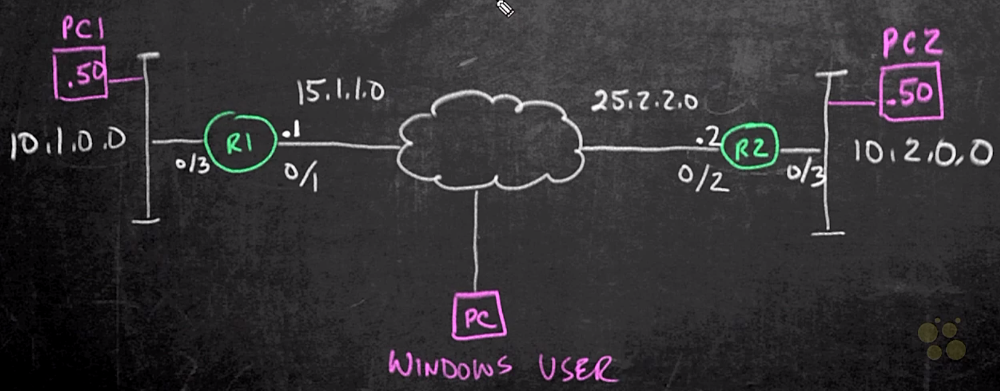

# 03. Components of Cryptography

Trainer: Keith Barker

## Introduction to Components of Cryptography

- Learning goals
  - suite of cryptography tools
  - purpose of tools
  - applying tools to protect data integrity, confidentiality

## Data Integrity

- Hash overview
  - verifying data integrity
  - example: ios image
    - verify downloaded  file in router: `R1# verify /md5 flash0:/vios-adventerprisesek9-m`
    - generate hash value and compare to the provided hash value in Cisco website
  - date sent to remote site and using hash to verify the data not been manipulated
  - [SHA256 Hash Generator](https://passwordsgenerator.net/sha256-hash-generator/)
    - paste text to input field > 'Generate' button > SHA256 Hash of the string
    - any change of text $\to$ the hash changed
  - [HMAC Generator / Tester Tool](https://freeformatter.com/hmac-generator.html)
    - paste text into input field
    - secret key: the element making the hash only calculateable by the devices both having the key
    - select a message digest algorithm = SHA512 > 'COMPUTE HMAC' button

## Data Privacy

- Encryption overview
  - locking & unlocking data
  - symmetrical encryption:
    - using the same key to encrypt and decrypt the data
    - algorithm current used: AES - 128, 192. 256
  - asymmetric encryption
    - key pair existed, mathematically related
    - encrypted w/ one key and decrypted w/ the other key
    - generally, private key and public key
    - provate key never sharing w/ other while public key sharing w/ world
    - public key sharing w/ digital certificate format
    - cons: computational intensive
  - Diffie-Hellman algorithm
    - one of the most popular symmetric algorithm
    - pre-shared key in general
    - typically dynamically generated

## SSL and TLS

- SSL/TLS overview
  - TLS: a successor of SSL
  - HTTPS using SSL/TLS
  - user w/ public key while server w/ private key
  - public key embedded in digital certificate
  - certificate from server signed by CA (Certificate Authority)
  - most likely the request w/ HTTP redirect to HTTPS and starting negotiation to validate the server and authenticate the end user

- Demo: HTTPS
  - network topology

    <figure style="margin: 0.5em; display: flex; justify-content: center; align-items: center;">
      
    </figure>
  
  - tasks: observe the behavior of HTTP and HTTPS
  - open web browser on PC1 to connect R2: `http://25.2.2.2` w/ user = admin, password = *** $\to$ browser indicating not a secure connection
  - using HTTPS instad: `https://25.2.2.2` w/ username and password $\to$ browser indicating a lock but still not secure due to the trust $\to$ digital certificate missing
  - observe the packet tracker in Wireshark
    - entry for HTTP request - src = 10.1.0.50, dst = 25.2.2.2, protocol = TCP $\to$ info readbale
    - entries for HTTPS transaction
      - src = 10.1.0.50, dst = 25.2.2.2, protocol = TLSv2, Info = Client Hello  
      - src = 25.2.2.2, dst = 10.1.0.50, protocol = TLSv2, Info = Server Hello, Certificate $\to$ payload containing certificate
      - src = 10.1.0.50, dst = 25.2.2.2, protocol = TLSv2, Info = Server Key Exchange, Server Hello Done $\to$ payload encrypted

## Public Key Infrastructure (PKI)

- Public Key Infrastructure (PKI) overview
  - TLS workflow: end user (user) and server (srv)
    - user sending request to access srv w/ HTTPS (port 443)
    - srv responding w/ digital certificate containing validate date, public key, etc.
    - how user knows the digital certificate a valid certificate? signed
  - signed digital certificate:
    - signed by a device that the browser of user PC $\to$ TRUST
    - Trust: user PC able to validate and signed by a Certificate Authority (CA)
  - how browser of user PC knows the CA? $\to$ preloaded on system
    - server generating public and private keys and then 
    - submit to CA to ask for its own digital certificate
    - once verified, CA issues a signed digital certificate

## IPsec

- IPsec overview
  - a suite of protocols to build VPN
  - purpose
    - privacy: encryption
    - data integrity: hashing algorithm - HMAC
  - methods
    - IKEv1: old version
    - IKEv2: more modular, more compatible
  

## Authentication

- Authentication overview
  - two main ways to authenticate peer
    - pre-shared key
    - digital certificate
  - pre-shared key:
    - both sides w/ same key
    - integrity (hashing): Hash-based Message Authentication Code (HMAC)
    - privacy (encryption/decryption): AES 128-256
  - RAS-signature (digital certificate)
    - both having its own certificate (possible same)

## Components of Cryptography Summary

- Summary
  - key for cryptography
  - algorithms for integrity and encryption
  - IPsec and PKI

