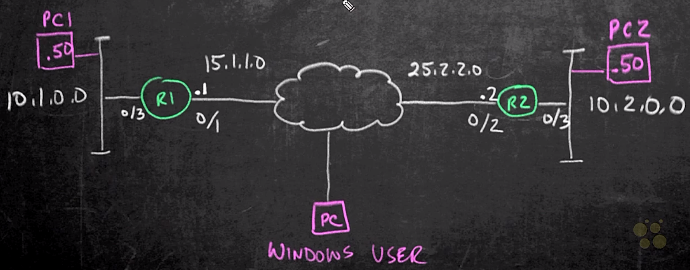
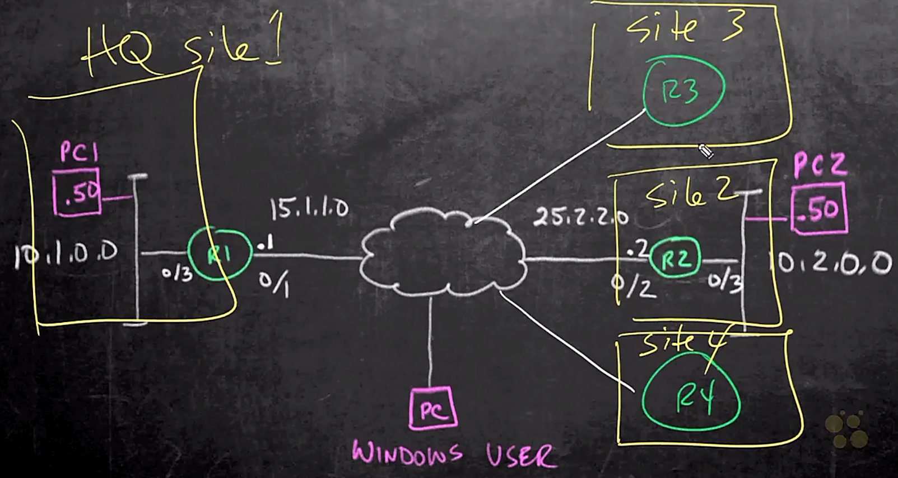
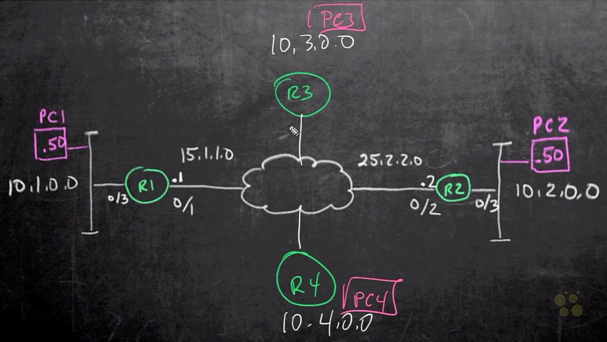

# 04. IPsec Fundamentals

Trainer: Keith Barker

## Introduction to IPsec

- Learning goal
  - protecting data in motion and at rest
  - ensuring confidentiality and integrity
  - IPsec to achieve these goals

## IPsec Overview

- IPsec concept
  - main goals
    - privacy: encryption
    - integrity: hashing
  - types of IPsec:
    - site2site: protect traffic btw PC1 & PC2 $\to$ IPsec tunnel btw R1 & R2
    - remote access: protect traffic btw windows user and R1 $\to$ Ipsec tunnel btw PC and R1
  

- IPsec packet format
  - original IP packet
    - IP header: src = PC1, dst = PC2
    - payload
  - prefix ESP header: port 50
  - prefix new IP header: src = R1, dst = R2

  <figure style="margin: 0.5em; display: flex; justify-content: center; align-items: center;">
    
  </figure>

  

    
  

- Internet Key Exchange (IKE) concept
  - DMVPN: hub-and-spoke network architecture
    - tunnels btw hub and spokes
    - tunnels btw spokes
  - crypto map
    - an instruction
    - operations
      - PC1 sending packet to PC2
      - R1 seeing the traffic and apply crypto map on the outgoing interface
      - R1 encrypting traffic and sending to R2
      - R2 decrypting the traffic and forwarding to PC2
    - old fashion and not flexible
  - virtual tunnel interface (VTI)
    - using GRE on virtual tunnel
    - applying crypto on the traffic and sending via the virtual tunnel

## IKEv1 and IKEv2

- [IKE properties](https://learningnetwork.cisco.com/s/article/comparison-between-ikev1-and-ikev2)
  - negotiate SA attributes
  - generate and refresh keys using DH
  - authenticate peer devices using many attributes (like IP, FQDN, LDAP DN and more)

- Internet Key Exchange version 1 (IKEv1)
  - 2 phases: IKE phase 1 & IKE phase 2
  - phases representing the different security association to be built
  - security association = bi-directional tunnel
  - phase 1:
    - private communication channel
    - used for encrypting and hashing communication btw endpoints
    - parameters to negotiate: HAGLE
      - Hash
      - Authentication: PSK, RAS-signature
      - Group - Diffie-Hellman group
      - Lieftime
      - Encryption
    - purpose: to build phase 2 tunnel
    - possibly having NAT-D
  - phase 2:
    - negotiating encryption, hashing (HMAC), Diffie-Hellman, lifetime, etc.
    - D.H. algorithm using the DH-Key generated by phase 1 or Perfect Forward Secrecy (PFS)
    - PFS forcing DH-Key calculation during phase 2 setup as well as Phase-2 periodic Rekey
    - IPsec SA / IPsec Tunnel built
    - NAT detected $\to$ NAT transparency / NAT-Transversal

- Internet Key Exchange version 2 (IKEv2)
  - EAP included
  - IKEv2 SA and child SA (IPsec SA)
  - NAT-D supported
  - more flexible to adopt new protocols
  - mitigating DoS

- IKEv1 and IKev2 comparisons

  <table style="font-family: Arial,Helvetica,Sans-Serif; margin: 0 auto; width: 50vw;" cellspacing=0 cellpadding=5 border=1 align="center">
    <caption style="font-size: 1.5em; margin: 0.2em;"><a href="http://rockhoppervpn.sourceforge.net/techdoc_ikev1vsikev2.html">Differences between IKEv1 and IKEv2</a></caption>
    <colgroup>
      <col style="width: 200%">
      <col style="width: 30%">
    </colgroup>
    <thead>
    <tr style="font-size: 1.2em; vertical-align:middle;">
      <th scope=row style="text-align: center;">IKEv1</th>
      <th scope=row style="text-align: center;">IKEv2 (SIMPLE and RELIABLE!)</th>
    </tr>
    </thead>
    <tbody>
      <tr><td>IPsec SA</td> <td>Child SA (Changed)</td></tr>
      <tr><td>Exchange modes: <ul><li>Main mode</li><li>Aggressive mode</li> </ul></td> <td>Only one exchange procedure is defined. Exchange modes were obsoleted.</td></tr>
      <tr><td>Exchanged messages to establish VPN.  <ul> <li>Main mode: 9 messages    </li> <li>Aggressive mode: 6 messages    </li> </ul></td> <td>Only 4 messages.</td></tr>
      <tr> <td>Authentication methods ( 4 methods ):    <ul> <li>Pre-Shared Key (PSK)    </li> <li>Digital Signature (RSA-Sig)    </li> <li>Public Key Encryption    </li> <li>Revised Mode of Public key Encryption    </li> </ul></td> <td>Only 2 methods:    <ul> <li>Pre-Shared Key (PSK)    </li> <li>Digital Signature (RSA-Sig)    </li> </ul></td></tr>
      <tr> <td>Both peers must use the same authentication  method.</td> <td>  Each peer can use a different authentication method (Asymmetrical authentication). (e.g. Initiator: PSK and Responder: RSA-Sig)    </td></tr>
      <tr> <td>Traffic selector:    <ul> <li>Only a combination of a source IP range, a destination IP range,a source port and a destination port is allowed per IPsec SA.</li> <li>Exact agreement of the traffic selectorbetween peers is required.</li> </ul></td> <td> <ul> <li>Multiple combinations of a source IP range, a destination IP range,a source port range and a destination port range are allowed per Child SA. Of course, IPv4 and IPv6 addresses can be configuredfor the same Child SA.</li> <li>Narrowing traffic selectors between peersis allowed.</li> </ul></td></tr>
      <tr> <td>Lifetime for SAs:     &nbsp; Agreement between peers is required.</td> <td>  NOT negotiated. Each peer can  delete&nbsp;SAs anytime by exchanging DELETE payloads.  </td></tr>
      <tr> <td>Multi-hosting:     &nbsp; Basically, NOT supported.</td> <td>  Supported by using multiple IDs on  a single  IP address and port pair.  </td></tr>
      <tr> <td>Rekeying:     &nbsp; NOT defined.</td> <td>Defined.</td></tr>
      <tr> <td>NAT Traversal:     &nbsp; Defined as an extension.</td> <td>Supported by default.</td></tr>
      <tr> <td>Dead Peer Detection / Keep-alive for SAs:     &nbsp; Defined as an extension.</td> <td>Supported by default.</td></tr>
      <tr> <td>Remote Access VPN:     NOT defined. Supported by vender-specific implementations:    <ul> <li>Mode config    </li> <li>XAUTH    </li> </ul></td> <td>  Supported by default:    <ul> <li>Extensible Authentication Protocol (EAP)    </li> <li>User authentication over EAP is associated withIKE's authentication.</li> <li>Configuration payload (CP)    </li> </ul></td></tr>
      <tr> <td>Multi-homing: &nbsp; Basically, NOT supported.</td> <td>  Supported by MOBIKE (IKEv2 Mobility and Multihoming Protocol:<a target="_blank" href="http://www.ietf.org/rfc/rfc4555.txt">RFC 4555</a>).  </td></tr>
      <tr> <td>Mobile Clients:   &nbsp; Basically, NOT supported. </td> <td>  Supported by MOBIKE (IKEv2 Mobility and Multihoming Protocol:<a target="_blank" href="http://www.ietf.org/rfc/rfc4555.txt">RFC 4555</a>).  </td></tr>
      <tr> <td>DoS protections:     &nbsp; Basically, NOT supported. </td> <td> <ul> <li>Anti-replay function is supported.</li> <li>'Cookies' is supported for mitigating flooding attacks.</li> <li>Many vulnerabilities in IKEv1 were fixed.</li> </ul></td></tr>
      <tr> <td>Less reliable than IKEv2.</td> <td>More reliable.  <ul> <li>All message types are defined as Request and Response pairs.</li> <li>A procedure to delete SAs is defined.</li> <li> A procedure to retransmit a message is defined.</li> </ul></td></tr>
      <tr> <td>Extensions are very poor.</td> <td>  Useful extentions in actual network environment.  <ul> <li>"Redirect Mechanism for IKEv2 (RFC5685)" </li> <li>"IKEv2 Session Resumption (RFC5723)" </li> <li>"An Extension for EAP-Only Authentication in IKEv2 (RFC5998)" </li> <li>"Protocol Support for High Availability of IKEv2/IPsec (RFC6311)" </li> <li>"A Quick Crash Detection Method for the Internet Key Exchange Protocol (IKE) (RFC6290)" </li> </ul> 
 etc.  
 See the <a target="_blank" href="http://datatracker.ietf.org/wg/ipsecme/">IETF  ipsecme-WG's web page</a>. </td></tr>
    </tbody>
  </table>

## Crypto Map IPsec

- Crypto map concept
  - ACL to control interested traffic, e.g., traffic from PC1 subnet 10.1.0.0/24 to PC2 subnet 10.2.0.0/24
  - IPsec transform set: HAGLE parameters
  - a container containing
    - bundled ACL and IPsec transform set
    - peer info
  - used to build IPsec tunnel mode

- IPsec modes
  - refer to IPsec packet format
  - tunnel mode:
    - adding new IP header w/ two routers as src and dst addresses
    - default mode for IPsec
  - transport mode
    - using the original IP header, i.e. PC1 and PC2 as the src and dst address
    - using original tunnel w/ minimal manpiplation to form IPsec

## VTI IPsec

- Virtual Tunnel Interface (VTI) concept
  - create virtual tunnel on R1: `R1(config)# in tunnel 0`
  - using intf facing Internet as the source intf of the virtual tunnel : `R1(config-if)# source 15.1.1.1` or `R1(config-if)# source g0/1`
  - usinging intf facing public network as the destiunation intf: `R1(config-if)# destination 25.2.2.2` or `R1(config-if)# destination g0/2`
  - default encapsulation as GRE (generic route encapsulation)
  - use the encapsulation w/ IPsec instead: `R1(config-if)# ipsec ipv4`
  - apply ipsec profile
  - build a logic tunnel btw R1 (.1) & R2 (.2) w/ subnet 10.12.12.0/24 for routing purpose: `R1(config-if)# 10.12.12.1 255.255.255.0`

- Dynamic VTI concept
  - another option of VTI w/ unknown peer
  - mainly used for mobile user (PC) and headquarter router (R1)
  - create template w/ IPsec profile, IP address for remote user, 

## DMVPNs

- Dynamic Multipoint Virtual Private Network (DMVPN) concept
  - topology: hub-and-spoke network architecture
  - issue on building a full connectivity network
    - create IPsec tunnel btw hub (R1) and spokes (R2, R3, and R4) individually
    - unable to communicate btw spokes directly $\to$ dual trips
  - solution: DMVPN resolve the issue
  - building w/ IPsec
  - IPsec still using trunnel interface but mGRE (multipoint GRE) instead
  - through hub, spokes dynamically learned each other w/ NHRP (Next Hub Resolution Protocol)

  <figure style="margin: 0.5em; display: flex; justify-content: center; align-items: center;">
    
  </figure>

## FlexVPN

- FlexVPN concept
  - multiple types of VPNs, such as site2site, remote access, DMVPN, etc.
  - using IKEv2 to build FlexVPN for all these types of VPNs
  - many default options $\to$ using or modifying these defaults

## GET VPN

- Group Encrypted Transfer (GET) VPN concept
  - cloud as service and reaching all sites (R1~4)
  - build a full connecting VPN across all sites
  - introducing IPsec controller, communicating w/ all routers
  - IPsec controller
    - communicate all routers
    - instructing routers w/ given SA and keys, even any change
    - instructing routers for intresting traffic w/ policy
    - encrypted packet prefixing an IP header but using original src and dst addresses

  <figure style="margin: 0.5em; display: flex; justify-content: center; align-items: center;">
    
  </figure>

- Comparison of DMVPN, FlexVPN and GETVPN

  <table style="font-family: Arial,Helvetica,Sans-Serif; margin: 0 auto; width: 60vw;" cellspacing=0 cellpadding=5 border=1 align="center">
    <caption style="font-size: 1.2em; margin: 0.2em;"><a href="https://bit.ly/33ThaKm">GETVPN Solution Comparison</a></caption>
    <colgroup>
      <col style="width: 20%">
      <col style="width: 20%">
      <col style="width: 20%">
      <col style="width: 20%">
    </colgroup>
    <thead>
    <tr style="font-size: 1.0em; vertical-align:middle;">
      <th scope=row style="text-align: center; background-color: #3d64ff; color: #ffffff;">Solution</th>
      <th scope=row style="text-align: center; background-color: #3d64ff; color: #ffffff;">DMVPN</th>
      <th scope=row style="text-align: center; background-color: #3d64ff; color: #ffffff;">FlexVPN</th>
      <th scope=row style="text-align: center; background-color: #3d64ff; color: #ffffff;">GETVPN</th>
    </tr>
    </thead>
    <tbody>
    <tr style="vertical-align:middle">
      <td style="font-weight: bold;">Infrastructure Network</td>
      <td style="text-align: center;">Public Internet Transport</td>
      <td style="text-align: center;">Public Internet Transport</td>
      <td style="text-align: center;">Private IP Transport </td>
    </tr>
    <tr style="vertical-align:middle">
      <td style="font-weight: bold;">Network Style</td>
      <td style="text-align: center;">Hub-Spoke and Spoke-to- Spoke; (Site-to-Site)</td>
      <td style="text-align: center;">Hub-Spoke and Spoke-to- Spoke; (Client-to-Site and Site-to-Site)</td>
      <td style="text-align: center;">Any-to-Any; (Site-to-Site)</td>
    </tr>
    <tr style="vertical-align:middle">
      <td style="font-weight: bold;">Routing</td>
      <td style="text-align: center;">Dynamic routing on tunnels</td>
      <td style="text-align: center;">Dynamic routing on tunnels or IKEv2 routing or IKEv2 Dynamic routing</td>
      <td style="text-align: center;">Dynamic routing on IP WAN</td>
    </tr>
    <tr style="vertical-align:middle">
      <td style="font-weight: bold;">Failover Redundancy</td>
      <td style="text-align: center;">Route Distribution Model</td>
      <td style="text-align: center;">Route Distribution Model</td>
      <td style="text-align: center;">Route Distribution Model</td>
    </tr>
    <tr style="vertical-align:middle">
      <td style="font-weight: bold;">Encryption Style </td>
      <td style="text-align: center;">Peer-to-Peer Protection</td>
      <td style="text-align: center;">Peer-to-Peer Protection</td>
      <td style="text-align: center;">Group Protection</td>
    </tr>
    <tr style="vertical-align:middle">
      <td style="font-weight: bold;">IP Multicast</td>
      <td style="text-align: center;">Multicast replication at hub</td>
      <td style="text-align: center;">Multicast replication at hub</td>
      <td style="text-align: center;">Multicast replication in IP WAN network </td>
    </tr>
    </tbody>
  </table> 

- Tunnel comparison

  <figure style="margin: 0.5em; display: flex; justify-content: center; align-items: center;">
    
  </figure>

## NAT Traversal

- NAT Traversal concept
  - a.k.a. NAT transparency
  - NAT/PAT btw PC1 and PC2
  - NAT/PAT unable to handle Layer 4 ESP protocol (port 50)
  - implemented in many IKEv1 and all IKEv2
  - using hash value on the IP address, receiver detects NAT/PAT used in btw
  - using UDP instead of ESP for the tunnel
    - prefix UDP header than IP header for encrypted packet
    - prefix an IP header w/ original src and dst addresses
  - keep alive required to maintain the NAT-T

  

    
    
  

- Demo: observing NAT-T w/ wireshark
  - IPsec negotiation btw 10.5.5.51 (= CLT) & 15.1.1.1 (= SRV)
  - the process applied for both IKEv1 & IKEv2
  - pkt: src = CLT, dst = SRV, protocol = ISAKMP, info = IKE SA INIT MID=00 Initiator Request
    - L3: Internet Protocol Version 4, Src: 10.5.5.51, Dst: 15.1.1.1 $\to$ Protocol: UDP (17)
    - L4: User Datagram Protocol, Src Port : 59704, Dst Port: 500
    - Payload: Internet Security Association and Key Management Protocol
      - Payload: Notify (41) - NAT_DETECTION_SOURCE_IP
      - Payload: Notify (41) - NAT_DETECTION_DESTINATION_IP
  - pkt: src = CLT, dst = SRV, protocol = ESP, Info = ESP (SPI=0xc2a16345) [randomly selected one]
    - L3: Internet Protocol Version 4, Src: 10.5.5.51, Dst: 15.1.1.1 $\to$ Protocol: UDP (17)
    - L4: User Datagram Protocol, Src Port : 59705, Dst Port: 4500, UDP Encapsulation of IPsec Packets
    - Payload: Encapsulating Security Payload

## IPsec Fundamentals Summary

- Summary
  - ways to implement IPsec, including crypto map and VTI
  - VPNs: DMVPN, GET VPN, FlexVPN 

