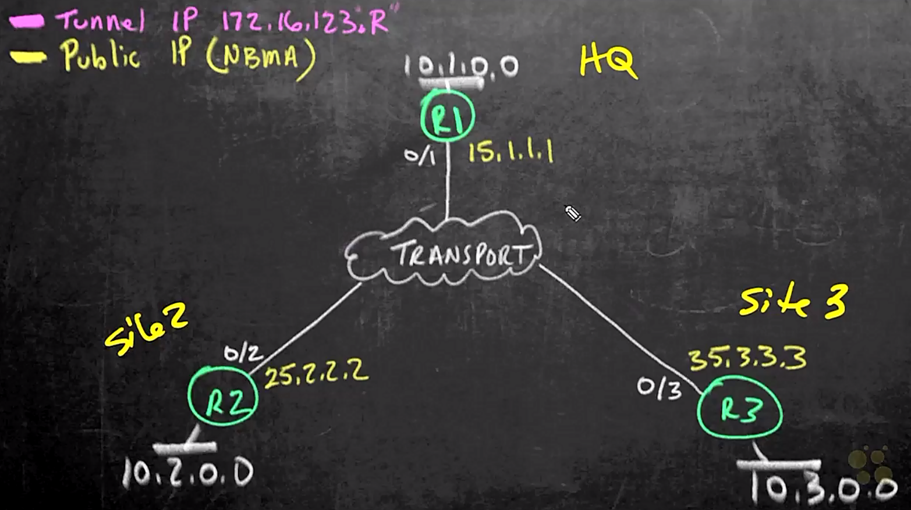

# 07. Cisco DMVPN

Trainer: Keith Barker


## Introduction to DMVPN

- Learning goals
  - concept of DMVPN
  - implementing and verifying mGRE
  - configuring and verifying of DMVPM

- Procedure to implement DMVPN
  - 1\. config mGRE on tunnel intf
  - 2\. config NHRP on those intf and how spokes reaching the hub
  - 3\. config routing protocol

## DMVPN Overview

- DMVPN network
  - hub-spoke network
  - R1 w/ headquarter, R2 w/ site 2, and R3 w/ site 3
  - R1~3 connected via Internet, private network or MPLS
  - NBMA: Non-Broadcast Multiple Access
  - mGRE: tunnel interfaces btw R1 & R2, R1 & R3
  - user traffic from R2 to server connected to R3
  - R2 viewing R3 as the next hop $\to$ traffic directly from R2 to R3, not via R1
  - issue: how do R2 know the Ip address space, 35.3.3.0?
  - solution:
    - using mGRE + NHRP 
    - R2 & R2 dynamically negotiate to build tunnel btw
    - directly routing the traffic by themselves

  <figure style="margin: 0.5em; display: flex; justify-content: center; align-items: center;">
    
  </figure>


## Planning for the mGRE Tunnel

- mGRE tunnel design
  - full mesh of tunnels
  - tunnel IP addresses: 172.16.123.0/24 w/ R1 = .1, R2 = .2, R3 = .3
  - tunnel type: mGRE - same tunnel intf for multiple pairing w/ other devices
  - tunnel source:
    - R1: 15.1.1.1 (G0/1)
    - R2: 25.2.2.2 (G0/2)
    - R3: 35.3.3.3 (G0/3)
  - tunnel destination: not required, dymanically identify the end of the tunnel
  - MTU (optional):
    - recommended: adjust maximum segment size
    - GRE w/ additional overhead
    - a little than the default value $\to$ no fragment for the final packets
  - tunnel key: same for all routers


## mGRE Tunnel Configuration

- Config mGRE on R1
  - preventing from packet segmentation w/ mtu = 1400

  ```bash
  ! DMVPN Hub
  R1#conf t
  R1(config)# int tunnel 0
  R1(config-if)# description DMVPN Hub
  R1(config-if)# ip address 172.16.123.1 255.255.255.0
  R1(config-if)# ip mtu 1400
  R1(config-if)# ip tcp adjust-mss 1360
  R1(config-if)# tunnel source g0/1
  R1(config-if)# tunnel mode gre multipoint
  R1(config-if)# tunnel key 6783
  R1(config-if)# end
  ```


- Config mGRE on R2

  ```bash
  R2# conf t
  R2(config)# int tunnel 0
  R2(config-if)# description DMVPN Spoke site 2
  R2(config-if)# ip address 172.16.123.1 255.255.255.0
  R2(config-if)# ip mtu 1400
  R2(config-if)# ip tcp adjust-mss 1360
  R2(config-if)# tunnel source g0/2
  R2(config-if)# tunnel mode gre multipoint
  R2(config-if)# tunnel key 6783
  R2(config-if)# end
  ```

- Config mGRE on R3

  ```bash
  R3# conf t
  R3(config)# int tunnel 0
  R3(config-if)# description DMVPN Spoke site 3
  R3(config-if)# ip address 172.16.123.3 255.255.255.0
  R3(config-if)# ip mtu 1400
  R3(config-if)# ip tcp adjust-mss 1360
  R3(config-if)# tunnel source g0/3
  R3(config-if)# tunnel mode gre multipoint
  R3(config-if)# tunnel key 6783
  R3(config-if)# end
  ```


## NHRP Overview and Design

- NHRP overview
  - only tunnel interface config on R1~3
  - none knowing what the other side of tunnel suppose to be
  - NHRP used to
    - train spokes to check in the hub
    - dynamically learn the reachable addresses btw themselves


- NHRP design
  - build tunnel btw R1 & R2, R1 & R3
  - train R2/R3 to know where the hub is
  - multicast packet on R2/R3 sending to the hub
  - config the tunnel IP address to associate w/ the public NBMA address
    - R1: 172.16.123.1 $\leftrightarrow$ 15.1.1.1
    - R2: 172.16.123.2 $\leftrightarrow$ 25.2.2.2
    - R3: 172.16.123.3 $\leftrightarrow$ 35.3.3.3
  - NHRP authentication password: Cisco!23
  - train R1 to dynamically learn the other end of the tunnels
  - next hop server (NHS) config on R2 & R3
    - R2 sending packet to 172.16.123.3
    - R2 not knowing the R3
    - specify the next hop server as R1
    - a request sent to R1 for getting the reachable address of 17216.123.3
    - R1 returns the details of R3
    - R2 proceeds to build tunnel w/ R3
  - goal of DMVPN: dynamically building tunnels btw spokes, in particular, many spokes
  - R1 redirecting traffic w/ NHRP while R2 & R3 building a NHRP shortcut


## Configuring NHRP for DMVPN

- Config NHRP on hub

  ```bash
  R1# conf t
  R1(config)# int tunnel 0
  R1(config-if)# authentication Cisco!23
  R1(config-if)# ip nhrp map multicast dynamic
  R1(config-if)# ip nhrp network-id 1223
  R1(config-if)# ip nhrp redirect
  R1(config-if)# end
  ```


- Config NHRP on spokes (R2 & R3)
  - NHS using tunnel IP address of hub
  - mapping tunnel address to public Ip address (T.P.)
  - tunnel supporting multicast by forwarding to public IP address of hub

  ```bash
  R2# conf t
  R2(config)# int tunnel 0
  R2(config-if)# authentication Cisco!23
  R2(config-if)# ip nhrp map 172.16.123.1 15.1.1.1
  R2(config-if)# ip map multicast 15.1.1.1
  R2(config-if)# ip nhrp network-id 1223
  R2(config-if)# ip nhs 172.16.123.1
  R2(config-if)# ip nhrp shortcut
  R2(config-if)# end

  R2# show run int tun 0
  Current configuration : 379 bytes
  !
  interface Tunnel0
   description DMVPN spoke site 2
   ip address 172.16.123.3 255.255.255.0
   no ip redirects
   ip mtu 1400
   ip nhrp authentication Cisco!23
   ip nhrp map 172.16.123.1 15.1.1.1
   ip nhrp map multicast 15.1.1.1
   ip nhrp network-id 123
   ip nhrp nhs 172.16.123.1
   ip tcp adjust-mss 1360
   tunnel source GigbitEthernet0/3
   tunnel mode gre multipoint
   tunnel key 123
  end
  ```


- Verify NHRP settings

  ```bash
  R1# show ip nhrp
  172.16.123.2/32 via 172.16.123.2
     Tunnel0 created 00:01:17, expire 00:08:43
     Type: dynamic, Flags: registered nhop
     NBMA address: 25.2.2.2
  172.16.123.3/32 via 172.16.123.3
     Tunnel0 created 00:01:08, expire 00:08:52
     Type: dynamic, Flags: registered nhop
     NBMA address: 35.3.3.3
  ```

  ```bash
  R2# show ip nhrp
  172.16.123.1/32 via 172.16.123.1
     Tunnel0 created 00:02:06, never expire
     Type: static, Flags:
     NBMA address: 15.1.1.1
  ```


## Adding Routing to DMVPN

- Applying routing protocol to the mGRE+NHRP network
  - using tunnel intf to forward traffic
  - the topology working w/ the routing protocol
  - subnets connected to R1~3 not known by remote devices
  - applying EIGRP w/ autonomous system 1 to the network
    - subnet for each route
    - tunnel network


- Config EIGRP on R1

  ```bash
  R1# conf t
  R1(config)# router eigrp 1
  R1(config-router)# net 10.0.0.0
  R1(config-router)# net 172.16.123.0 0.0.0.255
  R1(config-router)# end

  R1# show ip eigrp interfaces
  EIGRP-IPv4 Interfaces for AS(1)
                      Xmit Queue    PeerQ         Mean    Pacing Time
  Interface   Peers   Un/Reliable   Un/Reliable   SRTT    Un/Reliable
  Gi0/3         0         0/0        0/0            0        0/0
  Tu0           0         0/0        0/0            0        6/6
  ```


- Config EIGRP on R2

  ```bash
  R2# conf t
  R2(config)# router eigrp 1
  R2(config-router)# net 10.0.0.0
  R2(config-router)# net 172.16.123.0 0.0.0.255
  R2(config-router)# end
  ```


- Sanity check for routing
  - R2 w/o R3 subnet info
    
    ```bash
    R2# show ip route eigrp
    Gateway of last resort is 25.2.2.5 to network 0.0.0.0

        10.0.0.0/8 is variably subnetted, 3 subnets, 2 masks
    D       10.1.0.0/24 [90/26880256] via 172.16.123.1, 00:01:06, Tunnel0
    ```

  - R1 knowing R3 subnet

    ```bash
    R1# show ip route 10.0.0.0
    Routing entry for 10.0.0.0/8, 4 known subnets
      Attached (2 connections)
      Variably subnetted with 2 masks
      Redistributing via eigrp 1
    C    10.1.0.0/24 is directly connected, GigabitEthernet0/3
    L    10.1.0.0/32 is directly connected, GigabitEthernet0/3
    D    10.2.0.0/24 [90/26880256] via 172.16.123.2, 00:01:06, Tunnel0
    D    10.3.0.0/24 [90/26880256] via 172.16.123.3, 00:00:56, Tunnel0
    ```

  - tunnels btw R1 & R2, R1 & R3 built
  - R1 learning R3 subnet w/ tunnel intf should not advertise the network to the same intf $\to$ `no split-horizon`
  - config R1 for EIGRP w/o split horizon

    ```bash
    R1# conft
    R1(config)# int tunnel 0
    R1(config-if)# no ip split-horizon eigrp 1
    R1(config-if)# end
    ```

  - verify EIGRP routes on R2 again
    
    ```bash
    R2# show ip route eigrp
    Gateway of last resort is 25.2.2.5 to network 0.0.0.0

        10.0.0.0/8 is variably subnetted, 3 subnets, 2 masks
    D      10.1.0.0/24 [90/26880256] via 172.16.123.1, 00:03:26, Tunnel0
    D      10.3.0.0/24 [90/26880256] via 172.16.123.1, 00:00:11, Tunnel0
    ```

  - packets from R3 subnet to R2 subnet
    - R1 receiving the packets from R3
    - replacing the source address from R3 to R1 itself before forwarding to R2 (no split horizontal)
    - and vice vers
  - options to dealing w/ the default behavior
    - disable setting the next-hop address on R1 so the hub do not change it to its own IP: `no ip next-hop-self eigrp 1`
    - config DMVPN phase 3 to establish tunnel btw R2 & R3
      - R2 subnet sending pkts to R3 subnet
      - R2 using hub tunnel intf as next hop
      - R1 replying w/ a redirecting info to indicate tunnel intf of R3 a better selection than replacing the source IP address
      - R2 requests for the NBMA address of R3
      - once R2 retrieving R3 NBMA address, R2 & R3 able to communicate to each other


## Verifying DMVPNs


## Adding IPsec Protection Profiles


## DMVPN Summary


