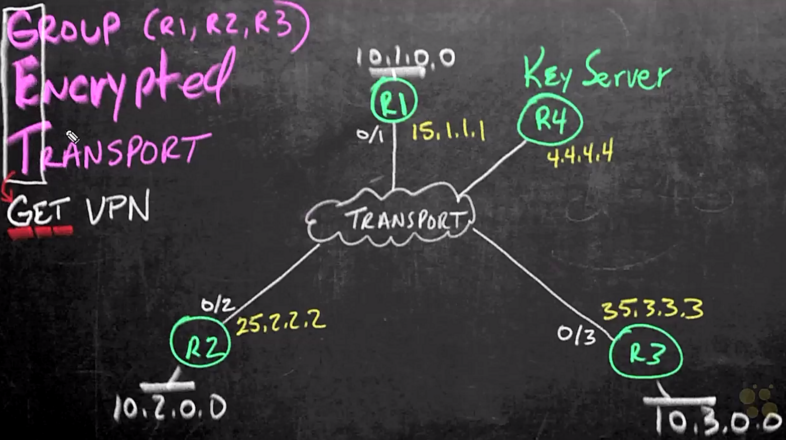

# 08. Cisco GET VPN

Trainer: Keith Barker


## Introduction to GET VPN

- GET VPN overview
  - Group Encrypted Transport (GET)
  - a technology w/ central controller to create groups of SAs and keys for multiple secured devices
  - a tunnel-less VPN technology meant for private networks
  - Multicast rekeying: a way to to enable encryption for "native" multicat packets and unicast rekeying over a private WAN


## GET VPN Overview

- GET VPN overview
  - group member: R1~R3
  - encrypted w/ IPsec
  - example: client (.50) w/ R3 subnet sending queries to server (.10) in R1 subnet
    - original pkt: src = 10.3.0.50 = CLT, dst = 10.1.0.10 = SRV
    - pkt out R3 g0/3: encrypting original pkt, add esp header (port 50) and new IP header w/ src=CLT, dst = SRV
    - IPsec transport mode reserving the original IP addresses
    - transport network: MPLS or Internet


  <figure style="margin: 0.5em; display: flex; justify-content: center; align-items: center;">
    
  </figure>


- Benefits of GET VPN
  - a ket server in charge of control plane for all IPsec tunnels
  - features
    - generate keys
    - creating ACLs
    - communicating w/ group members
  - handling group policy for all group members in one point
  - all subnets of group members encrypted based on the policy
  - key server inforing the group members about the subnets
  - GDOI: Group Domain Interpretation
  - any change of the policy in key server propagating to all group members


## GET VPN Key Servers (KS)

- Key sever (KS) of GET VPN overview
  - unable to be a group member
  - COOP: fault tolerance, allowing to have multiple key servers to work together


- Procedure to config key server
  - 1\. config IKE phase 1 policy
  - 2\. config IPsec
  - 3\. config ACLs for interesting traffic
  - 4\. config SA
  - 5\. config rekeying:
    - TEK: traffic encryption key
    - KEK: key encryption key (UDP port 848)


## GET VPN Members (GM)

- Group members of GET VPN overview
  - communicating w/ key server via ISAKMP phase 1
  - once tunnel established, using UDP 848 to exchange info btw key server and members
  - GDOI used to exchange encrypted info
  - member downloading info from key server including
    - IPsec info, including policy
    - crypto ACL
    - SA info
  - key server rekeying periodically
    - unicast: expecting ack, retry until timeout
    - multicast: more efficient, transport network support


## GET VPN Design

- Planning of GET VPN implementation 
  - pre-shared key btw key sever and group members
  - IKE phase 1
    - encryption: AES 128
    - hash: SHA 256
    - DH group: 14
    - authentication: pre-shared key (same as key for key server and members)
    - lifetime: default
  - IPsec (IKE phase 2)
    - transform set
    - profile, including transform set
    - lifetime
  - rekeying: RSA key pair
  - crypto ACL: limited to subnets of member group
  - GDOI:
    - bundling IPsec profile, crypto ACL, etc.
    - group ID #
    - key pair for rekeying


## Implementing KS Configuration

- Sanity check for reachability of all routers
  - Key server: R4

    ```bash
    R4# show ip route
    Gateway of last resort is 45.4.4.5 to network 0.0.0.0

    O*E2  0.0.0.0/0 [110/1] via 45.4.4.5, 01:03:53, GigabitEthernet0/0
          1.0.0.0/32 is subnetted, 1 subnets
    O        1.1.1.1 [110/3] via 45.4.4.5, 0.1:03:43, GigabitEThernet0/0
          2.0.0.0/32 is subnetted, 1 subnets
    O        2.2.2.2 [110/3] via 45.4.4.5, 0.1:03:43, GigabitEThernet0/0
          3.0.0.0/32 is subnetted, 1 subnets
    O        3.3.3.3 [110/3] via 45.4.4.5, 0.1:03:43, GigabitEThernet0/0
          4.0.0.0/32 is subnetted, 1 subnets
    C        4.4.4.4 [110/3] directly connected, Loopback0
          5.0.0.0/32 is subnetted, 1 subnets
    O        5.5.5.5 [110/3] via 45.4.4.5, 0.1:03:43, GigabitEThernet0/0
          10.1.1.1/24 is subnetted, 3 subnets
    O        10.1.0.0 [110/3] via 45.4.4.5, 00:03:43, GigabitEthernet0/0
    O        10.2.0.0 [110/3] via 45.4.4.5, 00:03:43, GigabitEthernet0/0
    O        10.3.0.0 [110/3] via 45.4.4.5, 00:03:53, GigabitEthernet0/0
          15.0.0.0/24 is subnetted, 1 subnets
    O        15.1.1.0 [110/2] via 45.4.4.5, 01:03:53, GigabitEthernet 0/0
          25.0.0.0/24 is subnetted, 1 subnets
    O        25.2.2.0 [110/2] via 45.4.4.5, 01:03:53, GigabitEthernet 0/0
          35.0.0.0/24 is subnetted, 1 subnets
    O        35.3.3.0 [110/2] via 45.4.4.5, 01:03:53, GigabitEthernet 0/0
          45.0.0.0/8 is subnetted, 1 subnets
    C        45.4.4.0/24 is directly connected, GigabitEthernet0/0
    L        45.4.4.4/32 is directly connected, GigabitEthernet0/0

    R4# show ip route 10.0.0.0
    Routing entry for 10.0.0.0/24, 3 known subnets
    O        10.1.0.0 [110/3] via 45.4.4.5, 00:03:43, GigabitEthernet0/0
    O        10.2.0.0 [110/3] via 45.4.4.5, 00:03:43, GigabitEthernet0/0
    O        10.3.0.0 [110/3] via 45.4.4.5, 00:03:53, GigabitEthernet0/0

    R4# ping 10.1.0.1
    !!!!!
    R4# ping 10.2.0.2
    !!!!!
    R4# ping 10.3.0.3
    !!!!!
    ```

  - group member: R1


    ```bash
    R1# ping 10.2.0.2
    !!!!!
    ```


- config key server

  ```bash
  R4# conf t
  ! conf terminal w/ 200 in width for reading
  R4(config)# line con 0
  R4(config-line)# width 20
  R4(config-line)# exit

  ! IKE Phase 1 for communication btw key server & members
  R4(config)# crypto isakmp policy 10
  R4(config-isakmp)# encryption aes 128
  R4(config-isakmp)# hash sha256
  R4(config-isakmp)# group 14
  R4(config-isakmp)# authentication pre-share
  R4(config-isakmp)# exit

  ! IKE key for pre-shared key
  R4(config)# crypto isakmp key Cisco!23 address 0.0.0.0

  ! config transform set and profile
  R4(config)# crypto ipsec transform-set Demo-Transform-Set esp-aes esp-sha-hmac
  R4(cfg-crypto-trans)# crypto ipsec profile Demo-IPsec-Profile
  R4(ipsec-profile)# set transform-set Demo-Transform-Set
  R4(ipsec-profile)# set security-association lieftime seconds 3600
  R4(ipsec-profile)# exit

  ! KS key-pair generation
  R4(config)# crypto key generate rsa general-keys label KS-Keys mode 2048 exportable

  ! specifying crypto ACL for interesting traffic
  R4(config)# ip access-list extended Demo-List
  R4(config-ext-nacl)# permit ip 10.0.0.0 255.255.255.0 10.0.0.0 0.255.255.255
  R4(config-ext-nacl)# deny ip any any
  R4(config-ext-nacl)# exit

  ! creating GDOI for GET VPN
  R4(config)# crypto gdoi group Demo-GETVPN-Group
  R4(config-gkm-group)# identity number 6783

  R4(config-gkm-group)# server local
  R4(gkm-local-server)# address ipv4 4.4.4.4
  R4(gkm-local-server)# rekey lifetime seconds 1800
  R4(gkm-local-server)# rekey retransmit 40 number 2
  R4(gkm-local-server)# rekey authentication mypubkey rsa KS-Keys
  R4(gkm-local-server)# rekey transport unicast
  R4(gkm-local-server)# sa ipsec 777

  R4(gkm-sa-ipsec)# profile Demo-IPsec-Profile
  R4(gkm-sa-ipsec)# match address ipv4 Demo-List
  R4(gkm-sa-ipsec)# replay time window-size 5
  R4(gkm-sa-ipsec)# end
  ```


- Verify key server config
  
  ```bash
  R4# show crypto gdoi
  GROUP INFORMATION
    Group Name                : Demo-GETVPN-Group (Unicast)
    Re-auth on new CRL        : Disabled
    Group Identity            : 6783
    Group Type                : GDOI (ISAKMP)
    Group Path                : ipv4
    Key Managemnet Path       : ipv4
    Group Members             : 0
    IPsec SA Direction        : Both
    IP D3P Windows            : Disabled
    CKM status                : Disabled
    Group Rekey Lifetime      : 1800 secs
    Rekey Retransmit Period   : 40 secs
    Rekey Retransmit Attempts : 2

      IPsec SA Number         : 777
      IPsec SA Rekey Lifetime : 3600 secs
      Profile Name            : Demo-IPsec-Profile
      Replay method           : Time Based
      Replay window Size      : 5
      Tagging method          : Disabled
      ACL Configured          : access-list Demo-List

      Group server list       : Local
  ```


## Implementing GM Configuration

- Config GM on R1
  
  ```bash
  R1# conf t

  ! IKE Phase 1 for communication btw key server & members
  R1(config)# crypto isakmp policy 10
  R1(config-isakmp)# encryption aes 128
  R1(config-isakmp)# hash sha256
  R1(config-isakmp)# group 14
  R1(config-isakmp)# authentication pre-share
  R1(config-isakmp)# exit

  ! IKE key for pre-shared key
  R1(config)# crypto isakmp key Cisco!23 address 0.0.0.0

  ! creating GDOI for GET VPN
  R1(config)# crypto gdoi group Demo-GETVPN-Group
  R1(config-gkm-group)# identity number 6783
  R1(gkm-local-server)# server address ipv4 4.4.4.4
  R1(gkm-local-server)# exit

  R1(config)# crypto map GM-Map 10 gdoi
  R1(config-crypto-map)# set group Demo-GETVPN-Group

  ! apply GM MAP to interface
  R1(config-crypto-map)# interface g0/1
  R1(config-if)# crypto map GM-Map
  R1(config-if)# end
  ```

  - same config apply to R2 (`int g0/2`) & R3 (`int g0/3`)  but interface changes


- Verify GM config

  ```bash
  R1# show crypto gdoi
  GROUP INFORMATION
    Group Name                : Demo-GETVPN-Group (Unicast)
    Group Identity            : 6783
    Group Type                : GDOI (ISAKMP)
    Group Path                : ipv4
    Key Managemnet Path       : ipv4
    Rekey received            : 0
    IPsec SA Direction        : Both

     Group server list        : 4.4.4.4.

  Group Member Information For Group Demo-GETVPN-Group:
    IPsec SA Direction        : Both
    ACL Received From KS      : gdoi_group_Demo_GETVPN-Group_temp_acl

    Group member              : 15.1.1.1         vrf: None
      Local addr/port         : 15.1.1.1/848    
      Remote addr/port        : 4.4.4.4/848
      fvrf/vrf                :None/None
      Version                 : 1.0.17
      Registration status     : Registered
      Registered with         : 4.4.4.4
      Re-registered in        : 1670 secs
      Succeeded registration  : 1
      Attempted registration  : 1
      Last rekey from         : 0.0.0.0
      Last rekey seq num      : 0
      Unicast rekey received  : 0
      Rekey ACKs sent         : 0
      Rekey received          : Never
      DP Error Monitoring     : OFF
      IPSEC init reg executed : 0
      IPsec init reg postponed  : 0
      active TEK Number       : 1
      SA Track (OID/status)   : disabled

      allowable rekey cipher  : any
      allowable rekey hash    : any
      allowable transformtag  : any ESP

    Rekeys cumulative
      Total received          : 0
      After latest register   : 0
      Rekey Acks sents        : 0

  ACL Downloaded From KS 4.4.4.4
    access-list   permit ip 10.0.0.0 0.255.255.255 10.0.0.0 0.255.255.255
    access-list   deny ip any any

  KEK POLICY:
    Rekey Transport Type      : unicast
    Lifetime (secs)           : 1767
    Encrypt Algorithm         : 3DES
    Key Size                  : 192
    Sig Hash Algorithm        : HMAC_AUTH_SHA
    Sig Key Length (bits)     : 2352

  TEL POLICY for the current KS-Policy ACEs Downloaded:
    GigabitEThernet0/1:
      IPsec SA:
        spi: 0x51111211F(1460077087)
        KGS: Disabled
        transform: esp-aes esp-sha-hmac
        sa timing:remaining key lifetime (sec): (3569)
        Anti-Replay(Time Based) : 5 sec interval
        tag method : disabled
        alg key size : 16 (bytes)
        sig key size : 20 (bytes)
        encaps: ENCAPS_TUNNEL
  ```


## GET VPN verification

- Verify on KS

  ```bash
  R4# sho crypto gdoi ks
  Total group member registered to this box: 3

  Key Server Information For Group Demo-GETVPN-GROUP
    Group Name                : Demo-GETVPN-Group (Unicast)
    Re-auth on new CRL        : Disabled
    Group Identity            : 6783
    Group Type                : GDOI (ISAKMP)
    Group Members             : 3
    Rekey Acknowledgement Cfg : Cisco
    IPsec SA Direction        : Both
    IP D3P Windows            : Disabled
    CKM status                : Disabled
    ACL Configured:
        access-list Demo-List
  ```


- Verify on HM

  ```bash
  R1# sho crypto isakmp sa detail
  C-id  Local         Remote        I-VRF   Status  Encr  Hash    Auth  DH  Lifetime
  1001  15.1.1.1      4.4.4.4               ACTIVE  aes   sha256  psk   14  23:47:21
         Engine-id:Conn-id = SW:1

  R1# show crypto ipsec sa 
  interface: GigabitEthernet0/1
      Crypto map tag: TGM-Map, local addr 15.1.1.1

    protected vrf: (none)
    local Ident  (addr/mask/port/prot): (10.0.0.0/255.255.255.255/0/0)
    remote Ident (addr/mask/port/prot): (10.0.0.0/255.255.255.255/0/0)
    Group: Demo-GETVPN-Group
    current-peer 0.0.0.0 port 848
      PERMIT, flags={}
    #pkts encaps: 0, #pkts encrypt: 0, #pkts digest: 0
    #pkts decaps: 0, #pkts decrypt: 0, #pkts verify: 0
    #pkts compressed: 0, #pkts decompressed: 0
    #pkts not compressed: 0, #pkts compr. failed: 0
    #pkts errros 0, #recv errors 0

     local crypto endpt.: 15.1.1.1, remote crypto endpt.: 0.0.0.0
     plaintext mtu 1422, path mtu 1500, ip mtu 1500, ip mtu idb GigabitEthernet0/1
     current outbound spi: 0x5111511F(1360077087)
     FPS (Y/N): N, DH group: none
  
  R1# ping 10.2.0.2 source 10.1.0.1
  !!!!!

  R1# show crypto ipsec sa 
  interface: GigabitEthernet0/1
      Crypto map tag: TGM-Map, local addr 15.1.1.1

    protected vrf: (none)
    local Ident  (addr/mask/port/prot): (10.0.0.0/255.255.255.255/0/0)
    remote Ident (addr/mask/port/prot): (10.0.0.0/255.255.255.255/0/0)
    Group: Demo-GETVPN-Group
    current-peer 0.0.0.0 port 848
      PERMIT, flags={}
    #pkts encaps: 5, #pkts encrypt: 5, #pkts digest: 5
    #pkts decaps: 5, #pkts decrypt: 5, #pkts verify: 5
    #pkts compressed: 0, #pkts decompressed: 0
    #pkts not compressed: 0, #pkts compr. failed: 0
    #pkts errros 0, #recv errors 0

     local crypto endpt.: 15.1.1.1, remote crypto endpt.: 0.0.0.0
     plaintext mtu 1422, path mtu 1500, ip mtu 1500, ip mtu idb GigabitEthernet0/1
     current outbound spi: 0x5111511F(1360077087)
     FPS (Y/N): N, DH group: none

  R1# show crypto gdoi
  GROUP INFORMATION
    Group Name                : Demo-GETVPN-Group (Unicast)
    Group Identity            : 6783
    Group Type                : GDOI (ISAKMP)
    Group Path                : ipv4
    Key Managemnet Path       : ipv4
    Rekey received            : 0
    IPsec SA Direction        : Both

     Group server list        : 4.4.4.4.

  Group Member Information For Group Demo-GETVPN-Group:
    IPsec SA Direction        : Both
    ACL Received From KS      : gdoi_group_Demo_GETVPN-Group_temp_acl

    Group member              : 15.1.1.1         vrf: None
      Local addr/port         : 15.1.1.1/848    
      Remote addr/port        : 4.4.4.4/848
      fvrf/vrf                :None/None
      Version                 : 1.0.17
      Registration status     : Registered
      Registered with         : 4.4.4.4
      Re-registered in        : 788 secs
      Succeeded registration  : 1
      Attempted registration  : 1
      Last rekey from         : 0.0.0.0
      Last rekey seq num      : 0
      Unicast rekey received  : 0
      Rekey ACKs sent         : 0
      Rekey received          : Never
      DP Error Monitoring     : OFF
      IPSEC init reg executed : 0
      IPsec init reg postponed  : 0
      active TEK Number       : 1
      SA Track (OID/status)   : disabled

      allowable rekey cipher  : any
      allowable rekey hash    : any
      allowable transformtag  : any ESP

    Rekeys cumulative
      Total received          : 0
      After latest register   : 0
      Rekey Acks sents        : 0

  ACL Downloaded From KS 4.4.4.4
    access-list   permit ip 10.0.0.0 0.255.255.255 10.0.0.0 0.255.255.255
    access-list   deny ip any any

  KEK POLICY:
    Rekey Transport Type      : unicast
    Lifetime (secs)           : 855
    Encrypt Algorithm         : 3DES
    Key Size                  : 192
    Sig Hash Algorithm        : HMAC_AUTH_SHA
    Sig Key Length (bits)     : 2352

  TEL POLICY for the current KS-Policy ACEs Downloaded:
    GigabitEThernet0/1:
      IPsec SA:
        spi: 0x51111211F(1360077087)
        KGS: Disabled
        transform: esp-aes esp-sha-hmac
        sa timing:remaining key lifetime (sec): (3569)
        Anti-Replay(Time Based) : 5 sec interval
        tag method : disabled
        alg key size : 16 (bytes)
        sig key size : 20 (bytes)
        encaps: ENCAPS_TUNNEL
  ```


- Verify w/ Wireshark
  - CLT (10.2.0.50) sends request to SRV (10.1.0.50)
  - observation points: A - R2 g0/3 (connect to CLT), B - R2, g0/2 (connect to cloud)
  - verify CLT (Linux)

    ```bash
    CLT# ip addr
    ...
    576: eth0@if675: <BROADCAST,MULTICAST,UP,LOWER_UP> mtu 1500 qdisc noqueue UP
    Toup default qlen 1000
      ...
      ient 10.2.0.50/24 scope global eth0
      ...

    CLT# route
    Destination   Gateway     Genmask   Flags Metrics Ref   Use Iface
    Default       10.2.0.2    0.0.0.0   UG    0       0       0 eth0
    10.2.0.0      *           255.255.255.0   U       0       0 eth0
    172.17.0.0    *           255.255.255.0   U       0       0 eth0
    ```

  - send traffic from CLT to SRV w/ ping and web browser
    - ping: `ping 10.1.0.50 -s 1000`
    - web browser to open URL = '10.1.0.50'
  - traffic captured
    - pkt on A: src=SRV, dst=CLT, prot=ICMP. info=Echo (ping) reply id=0x1b84, ...
      - L4: Internet Control Message Protocol
    - pkt on B: src=SRV, dst=CLI, port=ESP (50), info=ESP (SPI=0x5111211f)


## GET VPN Summary

- Summary of GET VPN
  - all devices within a group build IPsec tunnels w/ each other
  - one policy configured in KS
  - group member checking in key server to download Ipsec and rel;ated info


