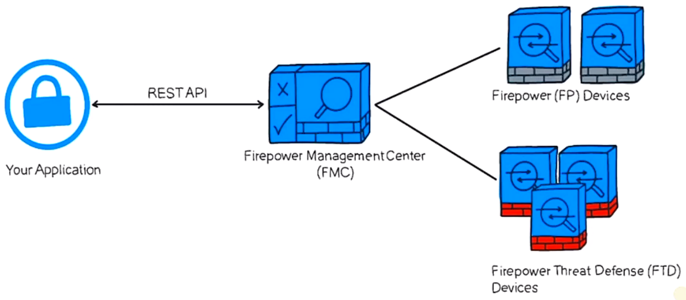

# 13. Explain APIs in the SDN Architecture

Trainer: Knox Hutchinson

## Introducing APIs and SDN

- Learning goals
  - application programming interfaces (APIs)
  - categories of APIs
  - software defined networking (SDN)

## What is an API anyway?

- Application programming interfaces (API) fundamentals
  - web front
    - programming languages: HTML, CSS, JS
    - input fields and buttons for user interaction
    - validating inputs
    - sending data to backend server
  - backend server
    - redirecting receiving data to appropriate teams
    - sending data to DB for recording
  - API: a piece of software communicating btw servers and applications
  - server returning raw data, XML or JSON, fro application's requests
  - applications probably retrieving raw data from DB

- Network automation and software defined networking
  - Cisco platforms w/ some form of API
  - all devices w/ some API on them
  - SDN: making it possible to interact w/ devices directly
  - traditional way:
    - using console cable to enter commands
    - config one at a time $\to$ time consuming
  - controllers of SDN
    - once logged in the controller, entire network able to view at once
    - bale to config to view devices in batch
    - web applications implemented to view and config via the controllers
    - controllers using API to communicating w/ devices
  - network automation
    - simplify the interaction w/ only one device, controller
    - controller collecting info from all other devices

  <figure style="margin: 0.5em; display: flex; justify-content: center; align-items: center;">
    
  </figure>

- API overview
  - types of API
    - Representational State Transfer (REST) as API for HTTPS
    - SNMP, NetFlow, etc.
    - NetConf:
      - one of the most popular network automation API, using SSH/XML
      - RestConf: a variation of NetConf using HTTP/HTTPS
  - JSON: data format to communicate devices and controllers
  - Telemetry: subscript to devices to collect statictics

## The Northbound API

## The Southbound API

## The Eastbound API

## The Westbound API

## Summarizing APIs and SDN

