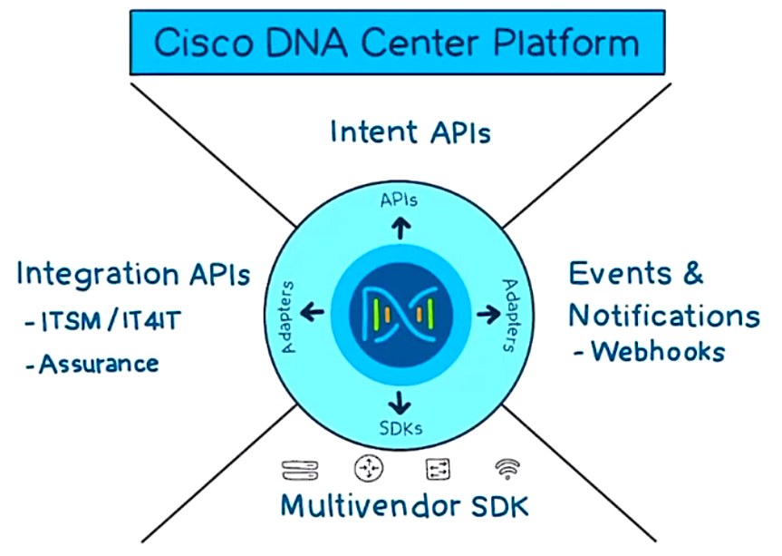
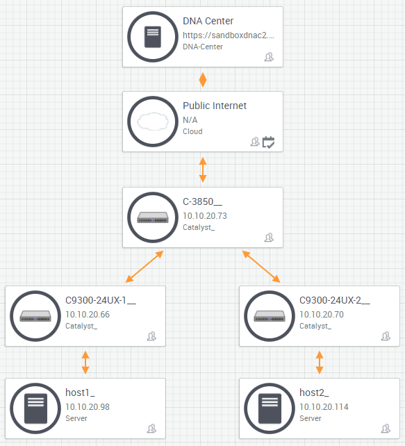

# 14. DNA Center Foundations

Trainer: Knox Hutchinson

## Introducing DNA Center

- Learning goals
  - DNA center
  - Workflows
  - DNA center API

## What DNA Center Does

- DNA center overview
  - a new SDN solution
  - targeting at large enterprise
  - goal: simplify how to deploy, operate, and optimize a network infrastructure

- DNA software architecture
  - intent-based networking
  - example: group A members not allowed to communicated w/ group B members
  - intent-base infrastructure:
    - wireless access, switch, router, extended nodes
    - these devices capable of deploying business intent
    - running on IOS-XE, in general, Catalyst 9K devices
  - systems
    - DNA center appliance, standalone appliance
    - interacting w/ users
    - redundancy: 3x minimum
    - working closely w/ ISE, an AD like + network devices info
    - able to integrate w/ IPAM solution, IP addressing and services of network devices
  - platforms: APIs
    - assurance: enabling every point on the network to become a sensor, sending continuous streaming telemetry on application performance and user connectivity in real time
    - ML/AI feature to identify suspicious or abnormal issues
    - historical view and search for issues

  

    
    
  

## What an SD-Access Fabric Does

- SD-access fabric overview
  - deploying intent, e.g., 
    - Group A users not allowing to access Group B users (bi-directional)
    - Group B permits to access servers in Group C
  - DNA center implements the intent across the entire network
  - the deployment based on SD-access
  - macro-segmentation: separting the whole campus based on the virtual networks
  - micro-segmentation
    - more granuar segmentation within a virtual network
    - multiple groups existed within a virtual network
    - policies existed within a virtual network
    - example: IT VN containing of Domain Admin, HelpDesk, Payroll servers
    - HelpDesk unable to access Payroll servers but Domain Admin able to 

- Example: 3 buildings
  - Bldg A, B, and C having 2 floors
  - Bldg A 1st fl w/ Group A while 2nd fl w/ Group B
  - Group A users accessing network w/ 802.1x via username and password
  - ISE handling the access authentication and passing the permission to DNA center
  - DNA center based on Group A users' privilege and placing them into a virtual network
  - the virtual network fully functional and completely isolated from other networks
  - Group B users accessing the network and placing into different virtual network
  - VRFs used to achieve the purpose
    - similar to VLAN
    - a layer 3 routing technology
    - users in different VRF isolated from each other
  - Group A members able to migrate or roam to any part of campus but still maintaining the same IP address and participating in the same virtual network $\to$ using LISP and VXLAN
  - same for Group B members

- Example: macro-segmentation w/ DNA center
  - Cisco DNA center: tabs - DESIGN, POLICY, PROVISION, ASSURE, PLATFORM
  - POLICY tab > subtabs - Cgroup-Based Access Control, IP Based Access Control, Application, Traffic Copy, Virtual Network
  - Virtual Network subtab: folders - DEFAULT_VN, INFRA_VN, HR+VN, IT_VN, IoT_VN > HR_VN folder 
  - Create or Modify Virtual Network by selecting Available Scalable Group > tabs - Available Scalable Groups (able to sync Group Names form ISE), Groups in the Virtual Networks

- Example: micro-segmentation w/ DNA center
  - Group Based Access Control: Policies, Scalable Groups, Access Groups > Policies
  - Policies: MiniMap - grid cells w/ Source & Destination as vertical and horizontal axes (Groups)
    - icons: Filter, Deploy, Refresh
    - actions: Permit, Deny, Custom, Default
    - hover anc click on a cell > Change Contract
    - Create Policy: Policy Status = Enabled; Contract = Change Contract > 'Change Contract' link
    - Change Contract: fields - Name, Description, Policies Referencing > click on the selected entry, e.g., Deny IP, Deny_IP_log, Permit IP, Permit_IP_log, AllowWeb, AllowDHCPDNS, DenyRemoteService

## The Four Workflows of DNA Center

- Workflows of DNA center
  - Design: geography about IP address space, DHCP server, DNA server, devices, IOS images and versions
  - Policy: virtual networks, ACLs
  - Provision: LAN automation, fabric overlay
  - Assurance: operating and optimizing the network by monitoring and troubleshooting

- Cisco Trust Set (CTS)
  - devices provisioned by
  - devices used to implement policies
  - devices able to learn about group users allowed and who able to communicate to
  - realizing macro-segmentation and micro-segmentation
  - fabric overlay devices communicating w/ ISE to implement CTS

- Example: deign workflow in DNA Center
  - DESIGN tab: subtabs - Network Hierarchy, Network Settings, Image Repository, Network Profiles, Authentication Template
  - Network Hierarchy subtab: folders - Global - Illinois, Louisiana - New Orieans ( Nola Main - Main Floor 1, Nola Satellite - Satellite Floor 1)
  - New Orieans > Network Setting subtab: tabs - Network, Device Credentials, IP Address Pool, SP Profiles, Wireless
    - Network tab: AAA Server, DHCP Server, DNS Server, SYSLOG Server, SNMP Server, NTP Server, Time Zone, Message of the day
    - Device Credentials tab: CLI Credentials, SNMP Credentials, HTTP(S) Credentials
    - IP Address Pools tab: fields - Name, Type, IPv4 Subnet, IPv6 Subnet, Inherited from, Actions

- Example: features of POLICY tab in DNA Center
  - Virtual Network: Macro-segmentation
  - Group-Based Access Control: Micro-segmentation
  - IP Based Access Control: classical traffic control
  - Application: define QoS
  - Traffic Copy:
    - packet capturing or Wiresharking
    - used to define business intent and build policy
    - largely from ISE

- Example: features of PROVISION tab in DNA Center
  - subtabs - Devices, Fabric, Services
  - Devices subtab: folders based on geography > fields - Device Name, IP Address, Support Type, Device Family, Site
    - able to discover entire network by assigning a seed node
    - discovering entire network via CDP or LLDP one by one
    - LAN automation: discovering devices w/ factory default state and assigning IP addresses and create connectivity
  - Fabric subtab > SD-Acccess Fabrics and Transit/Peer Networks
    - info DNA center which virtual network w/ the site
    - users login able to communicate w/ ISE and assign virtual network w/ correct CTS policies

- Example: features of ASSURANCE tab in DNA Center
  - subtabs - Dashboards, Trends And Insights, Manage
  - Dashboards subtabs > sections w/ charts - network Devices, Wired Clients, Wireless Clients, Top 10 Issue Types
  - diagnose issues: deep investigation w/ license to identify business-critical applications

## The DNA Center Platform APIs

- APIs of DNA Center
  - PLATFORM tab: subtabs - Overview, Manage, Developer Toolkit, Runtime Dashboard
  - Developer Toolkit subtab: tooltabs - APIs, Integration Flows, Data and Reports, Multivendor Support, Events
  - APIs tooltabs: folders - Authentication (Know Your Network, Site Management, Connectivity, Operational Tasks, Policy), Event Management
    - Know Your Network subfolder: inventory and how they behaving
    - Site Management subfolder: Design workflow
    - Connectivity subfolder: Assurance workflow
    - Operational Tasks subfolder: fabric provisioning
    - Policy subfolder: view and implement policies
  - HTTP RESTful API
    - `GET`: get request to retrieve info
    - `POST`: post request to create new data

  <figure style="margin: 0.5em; display: flex; justify-content: center; align-items: center;">
    
  </figure>

- Lab: DNA Center Sandbox in DevNet
  - [DevNet sandbox](https://devnetsandbox.cisco.com/RM/Topology) for demo and practice
  - SANDBOX LAB: [Cisco DNA Center AO 1.3.1.4](https://bit.ly/3FGSQcF)
  - Instruction

    Overview
    
    Cisco Digital Network Architecture (DNA) Center is a centralized management application for the network. Cisco DNA Center provides a single pane of management to design, provision, enable policy, and assure network services with full visibility of user and device identity, operating systems and applications across the entire network fabric. Cisco DNA Center allows you to manage the enterprise network over a centralized dashboard and deploy networks in minutes, not days, using intuitive work flows.The Cisco DNA Center Sandbox provides the developer the ability to design, develop and test utilizing the Cisco DNA Center development platform with a sample Sandbox Lab Topology.
    
    In this sandbox the developer can

    The Cisco DNA Center Sandbox consists of a virtualized Controller and real Hardware sample network topology containg network elements and hosts that developers can utilize so they can develop, debug and test their sample Cisco DNA Center application.

    - Develop/test Cisco DNA Center type applications with the Cisco DNA Center.
    - Interact with the Cisco DNA Center API calls using a variety of REST clients such as POSTMAN

    Sandbox Access

    The Cisco DNA Center Sandbox is designed to be accessed via the internet. VPN is not required or provided to connect to the Cisco DNA Center Appliance and sample network. The developer does not have any direct access to the sample network elements and hosts.

    To access the shared environment and integrate with the sample database, please follow these steps:
    1. Go to https://sandboxdnac2.cisco.com
    1. Accept the self-signed certificate
    1. Allow for showing of Browser Notifications
    1. Login with credentials **[devnetuser/Cisco123!]**

    Learn More

    [Cisco DNA Center on DevNet](https://developer.cisco.com/site/dna-center/)

  <figure style="margin: 0.5em; display: flex; justify-content: center; align-items: center;">
    
  </figure>

## Summarizing DNA Center

