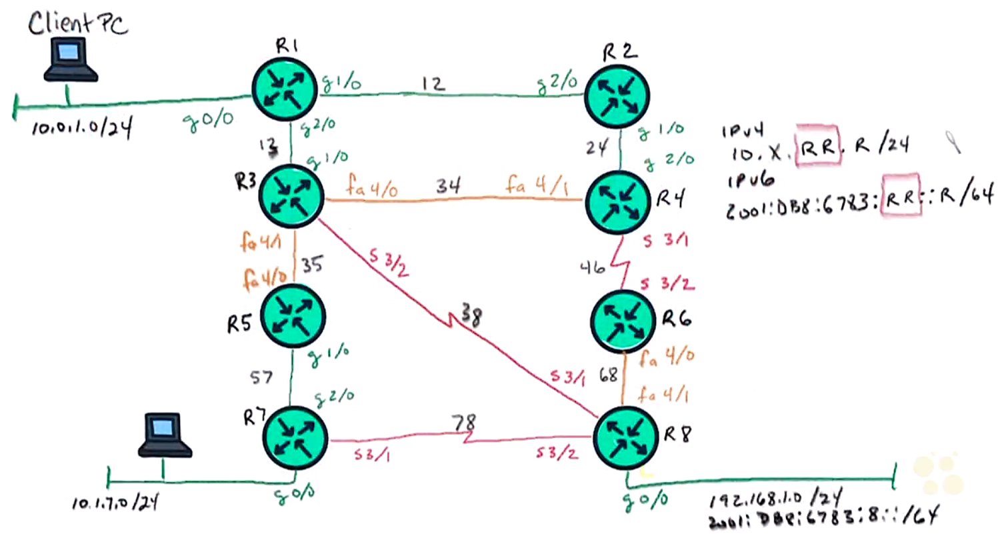

# 16. Troubleshoot NetFlow

Trainer: Keith Barker


## Introduction to Troubleshooting NetFlow

- Learning goals
  - NetFlow tool
  - how NetFlow works
  - implementation of NetFlow
  - NetFlow version 5, 9 and 10
  - data analysis


## NetFlow Overview

- NetFlow overview
  - 3 basic steps for NetFlow working
    - 1\. training devices to collect flow records
    - 2\. export data to a collector (storage point) periodically
    - 3\. analyze collected flow records

  <figure style="margin: 0.5em; display: flex; justify-content: center; align-items: center;">
    
  </figure>

- Example: Training the devices to collect data
  - focus on traffic on g0/1
  - not capturing packets but the characteristics and statistics of traffic
  - traffic from subnet (10.1.70.0/24) to subnet 192.168.1.0/24 via R7 $\to$ R5 $\to$ R3 $\to$ R1 $\to$ R2 $\to$ R4 $\to$ R6 $\to$ R8, vice versa


## Flavors of NetFlow

- Versions of NetFlow
  - version 1 not used any more
  - major ones: v5 & v9
  - version 5
    - a simple one
    - device collecting data by specifying
      - the collector id
      - traffic types, e.g. UDP port 7683
    - analyzer analyzeing the collected flow records and generate reports
  - version 9
    - very flexible, a.k.a flexible NetFlow
    - modularized w/ flow records
    - flow record: an object carrying the actual information about the network traffic which is then used by your NetFlow analyzer tool to generate bandwidth and traffic reports
    - monitor:
      - an object specifying what record to be used to collect data
      - applied to an interface to collect data (inbound/outbound)
    - exporter: an object specifying where the record to deliver, either collector id or IP address
  - IPFIX:
    - stand for 'IP Flow Information eXport'
    - an IETF standard
    - spawn from NetFlow v9 and backward compatible with v9 traffic
    - a.k.a. NetFlow v10
 


## NetFlow v5

- Implementing NetFlow v5
  - traffic flow path: subnet 10.1.7.0/24 $\leftrightarrow$ R7 $\leftrightarrow$ R5 $\leftrightarrow$ R3 $\leftrightarrow$ R1 $\leftrightarrow$ R2 $\leftrightarrow$ R4 $\leftrightarrow$ R6 $\leftrightarrow$ R8 $\leftrightarrow$ subnet 192.168.1.0/24
  - observe inbound and outbound traffic on R1 g/0
  - expotor: IP addr = 1.2.3.4/32, traffic type = UDP:6783

  ```bash
  R1# show ip int brief
  Interface           IP-Address  OK? Method  Status                Protocol
  Ethernet0/0         unassigned  YES NVRAM   administratively down down
  GigabitEthernet0/0  10.0.1.1    YES NVRAM   up                    up
  GigabitEthernet0/1  10.0.12.1   YES NVRAM   up                    up
  GigabitEthernet0/2  10.0.13.1   YES NVRAM   up                    up
  ...
  Loopback0           1.1.1.1     YES NVRAM   up                    up

  R1# conf t
  R1(config)# int g1/0
  R1(config-if)# ip flow ingress
  R1(config-if)# ip flow egress
  R1(config-if)# exit
  R1(config)# ip flow-export destination 1.2.3.4 6783
  R1(config)# ip flow-export source loopback 0
  R1(config)# ip flow-export version 5
  R1(config)# end

  R1# show ip cache flow
  IP packet size distribution (0 total packets):
      1-32   64   96  128  160  192  224  256  288  320  352  384  416  448  480
      .000 .000 .000 .000 .000 .000 .000 .000 .000 .000 .000 .000 .000 .000 .000

       512  544  576 1024 1536 2048 2560 3072 3584 4096 4608
      .000 .000 .000 .000 .000 .000 .000 .000 .000 .000 .000

  IP Flow Switching Cache, 4456704 bytes
    0 active, 65536 inactive, 0 added
    0 ager polls, 0 flow alloc failures
    Active flows timeout in 30 minutes
    Inactive flows timeout in 15 seconds
  IP Sub Flow Cache, 533256 bytes
    0 active, 16384 inactive, 0 added, 0 added to flow
    0 alloc failures, 0 force free
    1 chunk, 1 chunk added
    last clearing of statistics never
  Protocols   Total   Flows   Packets Bytes   Packets Active (Sec)  Idle (Sec)
  ---------   Flows    /Sec     /Secc  /Pkt      /Sec     /Flow       /Flow

  SrcIf     SrcIPaddress    DstIf     DstIPaddress    Pr  SrcP  DstP  Pkts


  R8# show ip int brief
  Interface           IP-Address  OK? Method  Status                Protocol
  Ethernet0/0         unassigned  YES NVRAM   administratively down down
  GigabitEthernet0/0  192.168.1.8 YES NVRAM   up                    up
  GigabitEthernet0/1  unassigned  YES NVRAM   administratively down down
  GigabitEthernet0/2  unassigned  YES NVRAM   administratively down down
  Serials3/0          unassigned  YES NVRAM   administratively down down
  Serials3/1          10.38.0.8   YES NVRAM   up                    up
  Serials3/2          10.78.0.8   YES NVRAM   up                    up
  Serials3/3          unassigned  YES NVRAM   administratively down down
  FastEthernet4/0     unassigned  YES NVRAM   administratively down down
  FastEthernet4/0     10.2.68.8   YES NVRAM   up                    up
  Loopback0           8.8.8.8     YES NVRAM   up                    up


## Flexible NetFlow


## NetFlow Collectors and Analyzers


## Troubleshoot NetFlow


