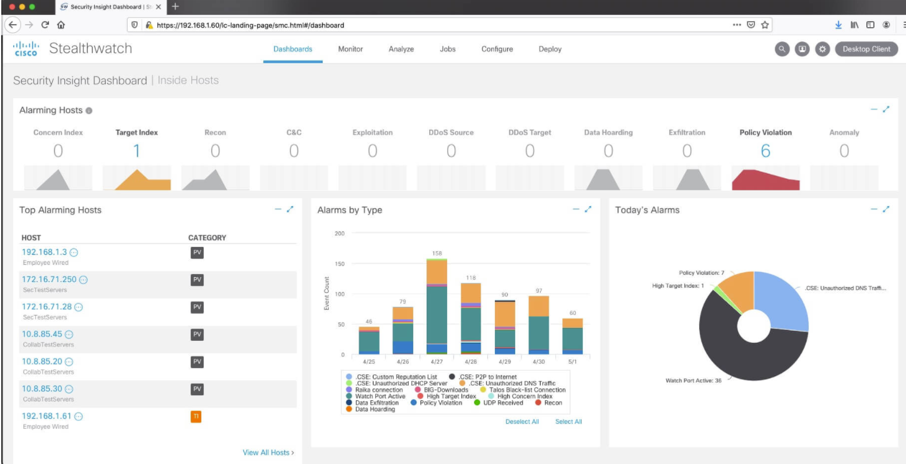
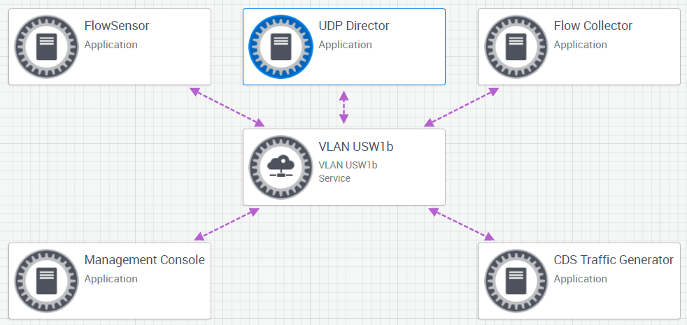

# 16. Troubleshoot NetFlow

Trainer: Keith Barker


## Introduction to Troubleshooting NetFlow

- Learning goals
  - NetFlow tool
  - how NetFlow works
  - implementation of NetFlow
  - NetFlow version 5, 9 and 10
  - data analysis


## NetFlow Overview

- NetFlow overview
  - 3 basic steps for NetFlow working
    - 1\. training devices to collect flow records
    - 2\. export data to a collector (storage point) periodically
    - 3\. analyze collected flow records

  <figure style="margin: 0.5em; display: flex; justify-content: center; align-items: center;">
    
  </figure>

- Example: Training the devices to collect data
  - focus on traffic on g0/1
  - not capturing packets but the characteristics and statistics of traffic
  - traffic from subnet (10.1.70.0/24) to subnet 192.168.1.0/24 via R7 $\to$ R5 $\to$ R3 $\to$ R1 $\to$ R2 $\to$ R4 $\to$ R6 $\to$ R8, vice versa


## Flavors of NetFlow

- Versions of NetFlow
  - version 1 not used any more
  - major ones: v5 & v9
  - version 5
    - a simple one
    - device collecting data by specifying
      - the collector id
      - traffic types, e.g. UDP port 7683
    - analyzer analyzeing the collected flow records and generate reports
  - version 9
    - very flexible, a.k.a flexible NetFlow
    - modularized w/ flow records
    - flow record: an object carrying the actual information about the network traffic which is then used by your NetFlow analyzer tool to generate bandwidth and traffic reports
    - monitor:
      - an object specifying what record to be used to collect data
      - applied to an interface to collect data (inbound/outbound)
    - exporter: an object specifying where the record to deliver, either collector id or IP address
  - IPFIX:
    - stand for 'IP Flow Information eXport'
    - an IETF standard
    - spawn from NetFlow v9 and backward compatible with v9 traffic
    - a.k.a. NetFlow v10
 


## NetFlow v5

- Implementing NetFlow v5
  - traffic flow path: subnet 10.1.7.0/24 $\leftrightarrow$ R7 $\leftrightarrow$ R5 $\leftrightarrow$ R3 $\leftrightarrow$ R1 $\leftrightarrow$ R2 $\leftrightarrow$ R4 $\leftrightarrow$ R6 $\leftrightarrow$ R8 $\leftrightarrow$ subnet 192.168.1.0/24
  - observe inbound and outbound traffic on R1 g/0
  - expotor: IP addr = 1.2.3.4/32, traffic type = UDP:6783

  ```text
  R1# show ip int brief
  Interface           IP-Address  OK? Method  Status                Protocol
  Ethernet0/0         unassigned  YES NVRAM   administratively down down
  GigabitEthernet0/0  10.0.1.1    YES NVRAM   up                    up
  GigabitEthernet0/1  10.0.12.1   YES NVRAM   up                    up
  GigabitEthernet0/2  10.0.13.1   YES NVRAM   up                    up
  ...
  Loopback0           1.1.1.1     YES NVRAM   up                    up

  R1# conf t
  R1(config)# int g1/0
  R1(config-if)# ip flow ingress
  R1(config-if)# ip flow egress
  R1(config-if)# exit
  R1(config)# ip flow-export destination 1.2.3.4 6783
  R1(config)# ip flow-export source loopback 0
  R1(config)# ip flow-export version 5
  R1(config)# end

  R1# show ip cache flow
  IP packet size distribution (0 total packets):
      1-32   64   96  128  160  192  224  256  288  320  352  384  416  448  480
      .000 .000 .000 .000 .000 .000 .000 .000 .000 .000 .000 .000 .000 .000 .000

       512  544  576 1024 1536 2048 2560 3072 3584 4096 4608
      .000 .000 .000 .000 .000 .000 .000 .000 .000 .000 .000

  IP Flow Switching Cache, 4456704 bytes
    0 active, 65536 inactive, 0 added
    0 ager polls, 0 flow alloc failures
    Active flows timeout in 30 minutes
    Inactive flows timeout in 15 seconds
  IP Sub Flow Cache, 533256 bytes
    0 active, 16384 inactive, 0 added, 0 added to flow
    0 alloc failures, 0 force free
    1 chunk, 1 chunk added
    last clearing of statistics never
  Protocols   Total   Flows   Packets Bytes   Packets Active (Sec)  Idle (Sec)
  ---------   Flows    /Sec     /Secc  /Pkt      /Sec     /Flow       /Flow

  SrcIf     SrcIPaddress    DstIf     DstIPaddress    Pr  SrcP  DstP  Pkts

  ! generate traffic
  R8# show ip int brief
  Interface           IP-Address  OK? Method  Status                Protocol
  Ethernet0/0         unassigned  YES NVRAM   administratively down down
  GigabitEthernet0/0  192.168.1.8 YES NVRAM   up                    up
  GigabitEthernet0/1  unassigned  YES NVRAM   administratively down down
  GigabitEthernet0/2  unassigned  YES NVRAM   administratively down down
  Serials3/0          unassigned  YES NVRAM   administratively down down
  Serials3/1          10.38.0.8   YES NVRAM   up                    up
  Serials3/2          10.78.0.8   YES NVRAM   up                    up
  Serials3/3          unassigned  YES NVRAM   administratively down down
  FastEthernet4/0     unassigned  YES NVRAM   administratively down down
  FastEthernet4/0     10.2.68.8   YES NVRAM   up                    up
  Loopback0           8.8.8.8     YES NVRAM   up                    up


  R7# telnet 10.2.68.8
  Trying 10.2.68.8 ... Open

  R8# show run


  R1# show ip cache flow
  IP packet size distribution (0 total packets):
      1-32   64   96  128  160  192  224  256  288  320  352  384  416  448  480
      .000 .880 .021 .010 .000 .000 .021 .000 .000 .010 .000 .000 .000 .021 .000

       512  544  576 1024 1536 2048 2560 3072 3584 4096 4608
      .021 .000 .000 .000 .000 .000 .000 .000 .000 .000 .000

  IP Flow Switching Cache, 4456704 bytes
    2 active, 65534 inactive, 2 added
    32 ager polls, 0 flow alloc failures
    Active flows timeout in 30 minutes
    Inactive flows timeout in 15 seconds
  IP Sub Flow Cache, 533256 bytes
    2 active, 16382 inactive, 2 added, 2 added to flow
    0 alloc failures, 0 force free
    1 chunk, 1 chunk added
    last clearing of statistics never
  Protocols   Total   Flows   Packets Bytes   Packets Active (Sec)  Idle (Sec)
  ---------   Flows    /Sec     /Secc  /Pkt      /Sec     /Flow       /Flow

  SrcIf     SrcIPaddress    DstIf     DstIPaddress    Pr  SrcP  DstP  Pkts 
  Gi1/0     10.2.68.8       Gi2/0     10.1.57.7       06  0017  79D3    46

  SrcIf     SrcIPaddress    DstIf     DstIPaddress    Pr  SrcP  DstP  Pkts 
  Gi2/0     10.1.57.7       Gi1/0     10.2.68.8       06  79D3  0017    46
  ```


## Flexible NetFlow

- Troubleshooting Flexible NetFlow
  - based on a live gear: TJ-LSV-RTR-A = RA
  - two flow monitors configured on RA g0/3
  - `SW-MON` flow monitor applied to int g0/3
    - `SW-EXPORTER` as the expoter of the flow monitor
    - `SW_RECORD` as the flow record that what traffic info will be collected
  - `flow exporter SW-EXPOTER` section specifying what to collect and other settings
    - traffic to collect: UDP:2055
    - collector IP addr: 172.20.30.201
    - protocol to export: IPFIX
  - `flow record SW_RECORD` specify what to pay attention and what to collect

  ```text
  RA# show run int g0/3
  !
  interface GigabitEthernet0/3
   description Core: Core.TJ-LSV-RTR-A GigabitEthernet0/3
   ip vrf forwarding Cox
   ip address 172.16.6.1 255.255.255.0
   no ip redirects
   no ip unreachables
   no ip proxy-arp
   ip flow monitor FEMonitor input
   ip flow monitor SW-MON input
   ip nat inside
   ip virtual-assembly in
   load-interval 30
   duplex auto
   speed auto
   service-policy input prm-KARKING_IN
   service-policy outout prm-dscp#QUEUING_OUT
  end

  RA# show run | sec flow monitor
  flow monitor EFMonitor
   exporter EFExport
   record EFRecord
  flow monitor
   export SW-EXPORTER
   cache timeout active 80
   record SW_RECORD
   ip flow monitor SW_MON input
   ip flow monitor EFMonitor input
   ...

  R1# show run | sec flow export
  flow expoter EFExport
   destination 172.20.30.155 vrf Internal
   source Loopback1
   transport udp 2055
   template data timeout 60
   option application-table timeout 60
  flow exporter SW-EXPOTER
   description Export NetFlow to SW FC
   destination 172.20.30.201 vrf Internal
   source Loopback1
   transport udp 2055
   export-protocol ipfix
   template data timeout 30
   option application-table timeout 10

  R1# show ru | sec flow record
  ...
  flow record SW_RECORD
   description NetFlow record format to send to SW
   match ipv4 tos
   match ipv4 protocol
   match ipv4 source address
   match ipv4 destination address
   match transport source-port
   match transport destination-port
   match interface input
   match flow direction
   match flow cts source group-tag
   match flow cts destination group-tag
   collect routing source as
   collect routing destination as
   collect routing nex-hop address as
   collect ipv4 dscp
   collect ipv4 id
   collect ipv4 source prefix
   collect ipv4 source mask
   collect ipv4 destination mask
   collect ipv4 ttl minimum
   collect ipv4 ttl maximum
   collect transport tcp flags
   collect counter bytes
   collect counter packets
   collect timestamp sys-uptime first
   collect timestamp sys-uptime last
   collect application name
   collect application http url
   collect application http host
  ```


## NetFlow Collectors and Analyzers

- Collecting and analyzing record w/ StealthWatch
  - Flow Collector: FlowCollector for NetFlow VE
    - available either a physical or a virtual appliance
    - Flow Collector VE performing the same functions as its physical counterpart but in a VMWare environment
  - NetFlow analyzer: Cisco StealthWatch
    - analyzing collected data to make the data useful
    - StealthWatch Dashboard > Analyze tab > Flow Search: allowing to drill down the data for a particular issue

  <div style="margin: 0.5em; display: flex; justify-content: center; align-items: center; flex-flow: row wrap;">
    <a href="url" ismap target="_blank">
      
    </a>
    <a href="url" ismap target="_blank">
      
    </a>
  </div>

## Troubleshoot NetFlow

- Lab: Cisco StealthWatch in DevNet
  - [Sandbox of StealthWatch](https://bit.ly/3mSrAjU)
  - instructions: overview

    <span style="font-weight: bold; text_decoration: underline;">Overview:</span>

    Cisco Stealthwatch is the most comprehensive visibility and network traffic security analytics solution that uses enterprise telemetry from the existing network infrastructure. It provides advanced threat detection, accelerated threat response, and simplified network segmentation using multilayer machine learning and entity modeling. With advanced behavioral analytics, you will always know who is on your network and what they are doing.

    This Sandbox contains a Stealthwatch Enterprise Environment for developer API testing. The CDS traffic generator populates the SMC with usable data for reporting and API calls. Traffic is started by users at the beginning of an actve reservation. Also, a number of postman collections are available on GIT to download and play with, against this environment.

    This sandbox contains the following:
    - StealthWatch Management Center
    - Flow Collector
    - Flow Sensor
    - UDP Director
    - CDS Traffic Generator

    <span style="font-weight: bold; text_decoration: underline;">Server Access Credentials</span>

    - SMC - admin/C1sco12345
    - Flow Collector (10.10.20.61) - admin/C1sco12345
    - Flow Sensor(10.10.20.62) - admin/C1sco12345
    - UDP Director (10.10.20.63) - admin/C1sco12345
    - CDS (10.10.20.64) - root/lan1cope

    NOTE: root access for the above servers is also enabled. Password is the same

    <span style="font-weight: bold; text_decoration: underline;">More information:</span>
    - [Stealthwatch on Cisco DevNet](https://developer.cisco.com/stealthwatch/)
    - [Stealthwatch APIs](https://developer.cisco.com/docs/stealthwatch/#!why-use-these-apis/why-use-these-apis)
    - [Postman Collection - Enterprise](https://developer.cisco.com/codeexchange/github/repo/CiscoDevNet/stealthwatch-enterprise-sample-postman)

    <span style="font-weight: bold; text_decoration: underline;">Additional Information:</span>
    - [Sandbox Support](https://communities.cisco.com/community/developer/sandbox)

    <span style="font-weight: bold; text_decoration: underline;">Network Topology</span>

    <figure style="margin: 0.5em; display: flex; justify-content: center; align-items: center;">
      
    </figure>

  - instruction: start traffic

    <span style="font-weight: bold; text_decoration: underline;">Starting CDS Traffic Flow</span>

    Once a reservation has setup and reached "Active" state, users can start the CDS traffic flow towards the UDP director. This is then picked up and displayed my th e Stealthwatch Management Center monitoring.

    This sandbox contains the following:
    - Once the Sandbox reservation has become Active connect to the VPN as instructed in the output window or the email
    - Browser to the [UPD Director](https://10.10.20.63/) and login with admin/C1sco12345
    - Scroll down on the main page to the interfaces. Note the MAC address of the Eth0 interface.

    <figure style="margin: 0.5em; display: flex; justify-content: center; align-items: center;">
      
    </figure>

    - We now need to start the traffic from the CDS Traffic generator. Ssh root@10.10.20.64 (password is lan1cope)
    - Once connected, the firstrun script will trigger
    - Hit n to the configuration XML question
    - Accept the default hostname for the box
    - Set domain to lab.devnetsandbox.local
    - IP address of DNS server is 10.17.248.11
    - IP address of NTP server is 10.17.251.250
    - The MAC address for the UDP director is then requested. Enter the MAC from step 3 above in xx:xx:xx:xx:xx:xx notation
    - The IP address of UDP Director should be set to 10.10.20.63
    - The IP address of Flow Sensor should be set to 10.10.20.62
    - The IP address of the Flow Collector should be set to 10.10.20.61
    - Enter y to accept the setting. A script will run to rewrite the .pcap files, taking just a moment.
    - Browse to [Stealthwatch Management Center GUI](https://10.10.20.60/) and check the flows on the main page. It may take 10 minutes or so to register the traffic flow

    <div style="margin: 0.5em; display: flex; justify-content: center; align-items: center; flex-flow: row wrap;">
      <a href="https://bit.ly/3mSrAjU" ismap target="_blank">
        
        
      </a>
    </div>

  - instruction: API info

    <span style="font-weight: bold; text_decoration: underline;">REST API Overview</span>

    Sandbox provides a simple StealthWatch environment within which, users can experiment, play and develop with the Stealthwatch REST API.

    The Stealthwatch System REST APIs consists of a collection of resources for developers, administrators, or partners that enable the functionality of Stealthwatch to be accessed programmatically. Since Stealthwatch REST APIs are based on open standards, you can use any programming or scripting language you wish as long as it supports HTTP.

    DevNet has an abundance of API documentation, code samples, tools and postman collections for StealthWatch. These are linked below to help you get started.

    - [Stealthwatch Enterprise Sample Scripts](https://developer.cisco.com/codeexchange/github/repo/CiscoDevNet/stealthwatch-enterprise-sample-scripts)
    - [Stealthwatch CSV Tools](https://developer.cisco.com/codeexchange/github/repo/CiscoDevNet/stealthwatch-enterprise-csv-tools)
    - [Postman Collection - Enterprise](https://developer.cisco.com/codeexchange/github/repo/CiscoDevNet/stealthwatch-enterprise-sample-postman)

    When you have downloaded and imported the postman collections, it's important to set the environment variables to that of the Stealthwatch Sandbox:

    - STEALTHWATCH-SMC = 10.10.20.60
    - username = admin
    - password = C1sco12345

  - instruction: VON Access

    <span style="font-weight: bold; text_decoration: underline;">Software VPN Access to this Lab:</span>

    This tab will explain everything you need to know about how to establish a secure software VPN connection to this lab.  A [VPN connection](http://en.wikipedia.org/wiki/Virtual_private_network) is required for you to interact with the systems and devices in this Lab.  You'll also need to have an active reservation for this Lab.

    <span style="font-weight: bold; text_decoration: underline;">Stuff You Can (and Should) Do Prior to Your Reservation:</span>

    In order to establish a software VPN connection to this Lab, you must download and install Cisco's AnyConnect VPN Client software on any system you plan to use to connect to your Lab.  (And it's ok if you don't do  this until after your reservation has started.  It's all good!)  Here's how you download and install AnyConnect:
    - [Download the Cisco AnyConnect VPN Client software.](https://developer.cisco.com/site/devnet/sandbox/anyconnect/)
    - [Installation Guide for Cisco AnyConnect VPN Client software.](https://devnetsandbox.cisco.com/Docs/VPN_Access/AnyConnect_Installation_Guide.pdf)

    <span style="font-weight: bold; text_decoration: underline;">Emails You'll Receive:</span>

    When your Lab reservation begins, you will receive several emails communicating important information about the status of your Lab.
    1. The first email is sent to you from the Lab provisioning automation engine, and indicates that resources in your Lab are in the process of being provisioned and tested.  Your Lab is NOT READY yet, but this email will give an estimate of when your Lab will be available.
    2. The second email will be sent to you when your Lab is fully provisioned, tested and READY for you to connect.  In this email you'll find the  information required by AnyConnect to establish a VPN connection to your Lab (Network IP Address, VPN Username, VPN Password).

    <span style="font-weight: bold; text_decoration: underline;">Connecting to Your Lab:</span>

    Once you receive the email that says your Lab is ready, you can begin the VPN connection process.  Here's how you establish a VPN connection to your Lab.
    - [AnyConnect VPN Connection Guide.](https://devnetsandbox.cisco.com/Docs/VPN_Access/AnyConnect_Connection_Guide.pdf)


