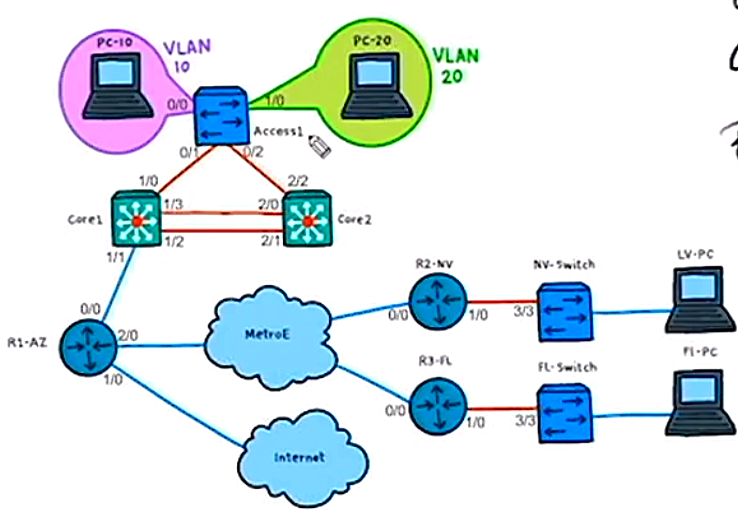

# 18. Configure and Verify Cisco Port Security

Trainer: Keith Barker


## Introducing Port Security

- Learning goals
  - configure and verify port security on a Cisco switch port
  - how to change the default settings of port security
  - how to use errdisable recovery
  - how to apply port security to multilayer switch trunk interfaces


## Understanding Port Security and Why we Need It

- Security challenges of switch port
  - 1\. who/what connect to the port
  - 2\. multiple ports via another switch
  - 3\. hacker - Content Addressable Memory (CAM) table overflow, Mac flooding


- Demo: CAM table overflow

  ```bash
  SW# show vlan brief
  VLAN Name           Status    Ports
  ---- -------------- --------- -----------------------------
  1    default        active    Gi0/3, Gi1/1, Gi1/2, Gi1/3
                                ...
  10   VLAN0010       active    Gi0/0
  20   VLAN0020       active    Gi1/0
  30   VLAN0030       active
  40   VLAN0040       active
  ...

  SW# show mac address-table vlan 10
          Mac Address Table
  Vlan  Mac Address     Type    Ports
  ----  -----------     ------  -----
    10  0015.5d44.5566  DYNAMIC Gi0/0
    10  0015.5d67.8322  DYNAMIC Gi0/0
    10  0015.d221.800a  DYNAMIC Gi0/1
    10  0015.d259.800a  DYNAMIC Gi0/1
  Total Mac Addresses for this criterion: 4

  SW# show mac address-table int g0/0 vlan 10
          Mac Address Table
  Vlan  Mac Address     Type    Ports
  ----  -----------     ------  -----
    10  0015.5d44.5566  DYNAMIC Gi0/0
    10  0015.5d67.8322  DYNAMIC Gi0/0
  Total Mac Addresses for this criterion: 2

  ! connect a Kali Linux box to g0/0
  SW# show mac address-table int g0/0 vlan 10
          Mac Address Table
  Vlan  Mac Address     Type    Ports
  ----  -----------     ------  -----
    10  0015.5d44.5566  DYNAMIC Gi0/0
    10  0015.5d67.8322  DYNAMIC Gi0/0
    10  0015.5d77.7701  DYNAMIC Gi0/0
  Total Mac Addresses for this criterion: 3

  Kali# macof -i eth0 -n 50

  SW# show mac address-table count vlan 10
  Mac Entries for Vlan 10:
  --------------------------
  Dynamic Address Count : 53
  Static Address Count  : 0
  Total Mac Addresses   : 53

  Total Mac Addess Space Available: 53207136
  ```


## Port Security Defaults

- Switch port mode for port security
  - access mode: `switchport mode access`
    - assign the port to a particular Vlan: `switchport access vlan 10`
  - host mode: `switchport host`
    - config as access mode
    - enable portfast
    - disable EtherChannel


- Port security config
  - dynamic L2 port:
    - a port automatically negotiate w/ peer
    - not allowing port security
  - enable port security on a port: `switchport port-security`
  - the port either an access or a trunk mode port
  - specify maximum allowable number of MAC addresses
  - violation: more Mac adddress attached to the port than maximum allowable Mac addresses
  - action w/ violation: shutdown


## Implementing Port Security on Layer 2 Interface

- Demo: config port security
  - plan: port g0/0 connected to a PC w/ Vlan 10

  ```bash
  SW# conf t
  SW(config)# int g0/0
  SW(config-if)# switchport mode access
  SW(config-if)# switchport access vlan 10
  SW(config-if)# switchport host

  SW(config-if)# do show vlan brief
  ...
  SW(config-if)# do show mac address-table vlan 10
  ...
  SW(config-if)# do show port-security int g0/0
  Port Security              : Disabled
  Port Status                : Secure-down
  Violation Mode             : Shutdown
  Aging Time                 : 0 mins
  Aging Type                 : Absolute
  SecureStatic Address Aging : Disabled
  Maximum Mac Addresses      : 1
  Total Mac Addresses        : 0
  Configured Mac Addresses   : 0
  Sticky Mac Addresses       : 0
  Last Source Addresses:Vlan : 0000.0000.0000:0
  Security Violation Count   : 0

  SW(config-if)# do show port-security
  Secure Port   MaxSecureAddr   CurrentAddr   SecurityViolation   Security Action
                   (Count)         (Count)           (Count)
  -------------------------------------------------------------------------------
  -------------------------------------------------------------------------------
  Total Addresses in System (excluding one mac per port)     : 0
  Max Addresses limit in System (excluding one mac per port) : 4096

  SW(config-if)# switchport port-security
  SW(config-if)# end

  SW# show port security
  Secure Port   MaxSecureAddr   CurrentAddr   SecurityViolation   Security Action
                   (Count)         (Count)           (Count)
  -------------------------------------------------------------------------------
        Gi0/0               1             0                   0          Shutdown
  -------------------------------------------------------------------------------
  Total Addresses in System (excluding one mac per port)     : 0
  Max Addresses limit in System (excluding one mac per port) : 4096

  ! generate traffic in Kali Linux
  Kali# ping 10.16.0.1
  ...
  6 packets transmitted, 0 received, 100% packet loss, time 5140ms

  SW# show int status err-disabled
  Port  Name  Status        Reason            Err-disabled Vlans
  Gi0/0       err-disabled  psecure-violation
  ```


## Customizing Port Security

- Demo: customizing port security
  - `maximum`: set maximum mac address allowed on the port
  - `mac-address ...`: hard coded mac address
  - `sticky`: learn mac address dynamically on the port
  - `violation`: violation actions:
    - shutdown: default, shutdown the port
    - protect: drop packets w/ unknown mac addresses
    - restrict: same as protect but generate log message
  - all port security settings not in function until port security enabled
  - resume shutdowned interface by executing `shutdown` and `no shutdown` on the interface

  ```bash
  SW# conf t
  SW(config)# int g0/0
  SW(config-if)# switchport mode access
  SW(config-if)# switchport access vlan 10
  SW(config-if)# switchport host
  SW(config-if)# switchport port-security maximum 5
  SW(config-if)# switchport port-security mac-address 0011.2233.4455
  SW(config-if)# switchport port-security mac-address sticky
  SW(config-if)# switchport port-security violation restrict|protect|shutdown

  SW(config-if)# do show port-security
  Secure Port   MaxSecureAddr   CurrentAddr   SecurityViolation   Security Action
                   (Count)         (Count)           (Count)
  -------------------------------------------------------------------------------
  -------------------------------------------------------------------------------
  Total Addresses in System (excluding one mac per port)     : 0
  Max Addresses limit in System (excluding one mac per port) : 4096

  SW(config-if)# switchport port-security

  SW(config-if)# do show port security
  Secure Port   MaxSecureAddr   CurrentAddr   SecurityViolation   Security Action
                   (Count)         (Count)           (Count)
  -------------------------------------------------------------------------------
        Gi0/0               5             1                   0          Shutdown
  -------------------------------------------------------------------------------
  Total Addresses in System (excluding one mac per port)     : 0
  Max Addresses limit in System (excluding one mac per port) : 4096

  SW(config-if)# do show port-security int g0/0
  Port Security              : Enabled
  Port Status                : Secure-up
  Violation Mode             : Shutdown
  Aging Time                 : 0 mins
  Aging Type                 : Absolute
  SecureStatic Address Aging : Disabled
  Maximum Mac Addresses      : 5
  Total Mac Addresses        : 2
  Configured Mac Addresses   : 1
  Sticky Mac Addresses       : 1
  Last Source Addresses:Vlan : 0015.5d44.5566:10
  Security Violation Count   : 0

  SW(config-if)# end
  SW# show mac address-table int g0/0
          Mac Address Table
  Vlan  Mac Address     Type    Ports
  ----  -----------     ------  -----
    10  0015.5d44.5566  STATIC  Gi0/0
    10  0015.5d67.8322  DYNAMIC Gi0/0
    10  0011.2233.4455  STATIC  Gi0/0
  Total Mac Addresses for this criterion: 3

  ! check connectivity from Kali
  Kali# ping 10.16.0.1
  ! successful
  Kali# ping 10.16.0.2
  ! successful

  SW(config-if)# end
  SW# show mac address-table int g0/0
          Mac Address Table
  Vlan  Mac Address     Type    Ports
  ----  -----------     ------  -----
    10  0015.5d44.5566  STATIC  Gi0/0
    10  0015.5d67.8322  DYNAMIC Gi0/0
    10  0015.5d70.7701  DYNAMIC Gi0/0
    10  0011.2233.4455  STATIC  Gi0/0
  Total Mac Addresses for this criterion: 4

  ! generate traffic w/ different mac address
  Kali# macof -i  eth0 -n 10

  SW#
  %PORT_SECURITY-2-PSECURE_CIOLATION: Security violation occurred, 
    caused by MAC address b49f.a376.e018 on port GigabitEthernet0/0
  
  SW# show intterfaces status err-disabled
  Port  Name  Status        Reason            Err-disabled Vlans
  Gi0/0       err-disabled  psecure-violation

  ! resume the interface
  SW# conf t
  SW(config)# int g0/0
  SW(config-if)# shutdown
  SW(config-if)# no shutdown
  SW(config-if)# end

  SW# show int status err-disbaled
  Port  Name  Status        Reason            Err-disabled Vlans
  ```


## Configuring Auto Errdisable Recovery

- Demo: config auto recovery for port security violation

  ```bash
  SW# show port-security
  Secure Port   MaxSecureAddr   CurrentAddr   SecurityViolation   Security Action
                   (Count)         (Count)           (Count)
  -------------------------------------------------------------------------------
  -------------------------------------------------------------------------------
  Total Addresses in System (excluding one mac per port)     : 0
  Max Addresses limit in System (excluding one mac per port) : 4096

  SW# conf t
  SW(config)# int g0/0
  SW(config-if)# switchport host
  SW(config-if)# switchport port-security maximum 5
  SW(config-if)# switchport port-security
  
  SW(config-if)# do show port-security int g0/0
  Port Security              : Enabled
  Port Status                : Secure-up
  Violation Mode             : Shutdown
  Aging Time                 : 0 mins
  Aging Type                 : Absolute
  SecureStatic Address Aging : Disabled
  Maximum Mac Addresses      : 5
  Total Mac Addresses        : 1
  Configured Mac Addresses   : 0
  Sticky Mac Addresses       : 0
  Last Source Addresses:Vlan : 0015.5d44.5566:10
  Security Violation Count   : 0

  ! trigger violation in Kali Linux
  Kali# macof -i eth0 -n 10

  SW(config-if)# do show int status err-disabled
  Port  Name  Status        Reason            Err-disabled Vlans
  Gi0/0       err-disabled  psecure-violation

  SW(config-if)# end
  SW# show errdisable recovery
  ErrDisable Reason       Timer Status
  -----------------       ------------
  arp-inspection          Disabled
  ...
  psecure-violation       Disabled
  ...

  ! port security violation auto recovery in 30 secs
  SW# conf t
  SW(config)# errdisable recovery cause psecure-violation
  SW(config)# errdisable recovery interval 30
  SW(config)# end

  SW(config-if)# end
  
  SW# show errdisable recovery
  ErrDisable Reason       Timer Status
  -----------------       ------------
  arp-inspection          Disabled
  ...
  psecure-violation       Enable
  ...

  Timer interval: 30 seconds

  Interfaces that will be enabled at the next timeout:
  Interface   Errdisabled reason    Time left (sec)
  ---------   ------------------    ---------------
  Gi0/0       psecure-violation       281

  SW# conf t
  SW(config)# int g0/0
  SW(config-if)# shutdown
  SW(config-if)# no shutdown
  SW(config-if)# end

  SW# show errdisable recovery
  ErrDisable Reason       Timer Status
  -----------------       ------------
  arp-inspection          Disabled
  ...
  psecure-violation       Enable
  ...

  Timer interval: 30 seconds

  Interfaces that will be enabled at the next timeout:
  Interface   Errdisabled reason    Time left (sec)
  ---------   ------------------    ---------------
  Gi0/0       psecure-violation       20
  ```


## Applying Port Security Skills in Production

- Demo: applying port security in production
  - topology

    <figure style="margin: 0.5em; display: flex; justify-content: center; align-items: center;">
      
    </figure>

  - tasks:
    - applying port security on trunk interfaces (g1/0 on Core 1 and g2/2 on Core2)
    - Core 1 trunk to Access 1
    - Core 2 trunk to Access 1
    - port security parameters
      - max mac addresses: 2000
      - violation action: protect

  ```bash
  ! config Core1
  Core1# show cdp neighbor
  Device ID   Local Interface   Holdtime  Capability  Platform  Port ID
  Core 2      Gig 1/2           146            R S I  ISOv      Gig 2/1
  Core 2      Gig 1/3           177            R S I  ISOv      Gig 2/0
  Access1     Gig 1/0           129             S I   IOSv      Gig 0/1

  Total cdp entries displayed: 3

  Core1# show port-security
  Secure Port   MaxSecureAddr   CurrentAddr   SecurityViolation   Security Action
                   (Count)         (Count)           (Count)
  -------------------------------------------------------------------------------
  -------------------------------------------------------------------------------
  Total Addresses in System (excluding one mac per port)     : 0
  Max Addresses limit in System (excluding one mac per port) : 4096

  Core1# conf t
  Core1(config)# int g1/0
  Core1(config-if)# switchport port-security maximum 2000
  Core1(config-if)# switchport port-security violation protect
  Core1(config-if)# switchport port-security
  Core1(config-if)# emd

  Core1# show port-security 
  Secure Port   MaxSecureAddr   CurrentAddr   SecurityViolation   Security Action
                   (Count)         (Count)           (Count)
  -------------------------------------------------------------------------------
        Gi1/0           2000              1                   0           Protect
  -------------------------------------------------------------------------------
  Total Addresses in System (excluding one mac per port)     : 0
  Max Addresses limit in System (excluding one mac per port) : 4096

  Core1# show port-security int gig 1/0
  Port Security              : Enabled
  Port Status                : Secure-up
  Violation Mode             : Protect
  Aging Time                 : 0 mins
  Aging Type                 : Absolute
  SecureStatic Address Aging : Disabled
  Maximum Mac Addresses      : 2000
  Total Mac Addresses        : 2
  Configured Mac Addresses   : 0
  Sticky Mac Addresses       : 0
  Last Source Addresses:Vlan : 0015.5d44.5566:1
  Security Violation Count   : 0

  ! config Core 2
  Core2# show port-security
  Secure Port   MaxSecureAddr   CurrentAddr   SecurityViolation   Security Action
                   (Count)         (Count)           (Count)
  -------------------------------------------------------------------------------
  -------------------------------------------------------------------------------
  Total Addresses in System (excluding one mac per port)     : 2
  Max Addresses limit in System (excluding one mac per port) : 4096

  Core2# show cdp neighbor
  Device ID   Local Interface   Holdtime  Capability  Platform  Port ID
  Core 1      Gig 2/1           138            R S I  ISOv      Gig 1/2
  Core 1      Gig 2/0           145            R S I  ISOv      Gig 1/3
  Access1     Gig 2/2           129             S I   IOSv      Gig 0/2

  Total cdp entries displayed: 3

  Core1# conf t
  Core1(config)# int g2/2
  Core1(config-if)# switchport port-security maximum 2000
  Core1(config-if)# switchport port-security violation protect
  Core1(config-if)# switchport port-security
  Core1(config-if)# emd

  Core1# show port-security 
  Secure Port   MaxSecureAddr   CurrentAddr   SecurityViolation   Security Action
                   (Count)         (Count)           (Count)
  -------------------------------------------------------------------------------
        Gi2/2           2000              4                   0           Protect
  -------------------------------------------------------------------------------
  Total Addresses in System (excluding one mac per port)     : 3
  Max Addresses limit in System (excluding one mac per port) : 4096

  Core1# show port-security int gig 2/2
  Port Security              : Enabled
  Port Status                : Secure-up
  Violation Mode             : Protect
  Aging Time                 : 0 mins
  Aging Type                 : Absolute
  SecureStatic Address Aging : Disabled
  Maximum Mac Addresses      : 2000
  Total Mac Addresses        : 10
  Configured Mac Addresses   : 0
  Sticky Mac Addresses       : 0
  Last Source Addresses:Vlan : 00dc.d259.8028:1
  Security Violation Count   : 0
  ```


## Review of Configure and Verify Cisco Port Security

- Quest 1

  How does Port Security prevent unwanted devices from connecting to a single port?

  Ans: Yes<br>
  Explanation: port security contolling the quantity of different Mac address able to be seen the inbound L2 source frames


- Question 2

  What are the defaults for Port Security for number of addresses and violation action?

  Ans: deafult max number = 1, default action = shutdown
  Explanation:
  - set max allowable mac addresses: `switchport port-security maxiumum #`
  - options of violation action: shutdown, restrict, protect
  - cmd to set action: `switchport port-security violation shutdown|protect|restrict`


## Cisco CCNA (200-301) Assessment Lab: Security


