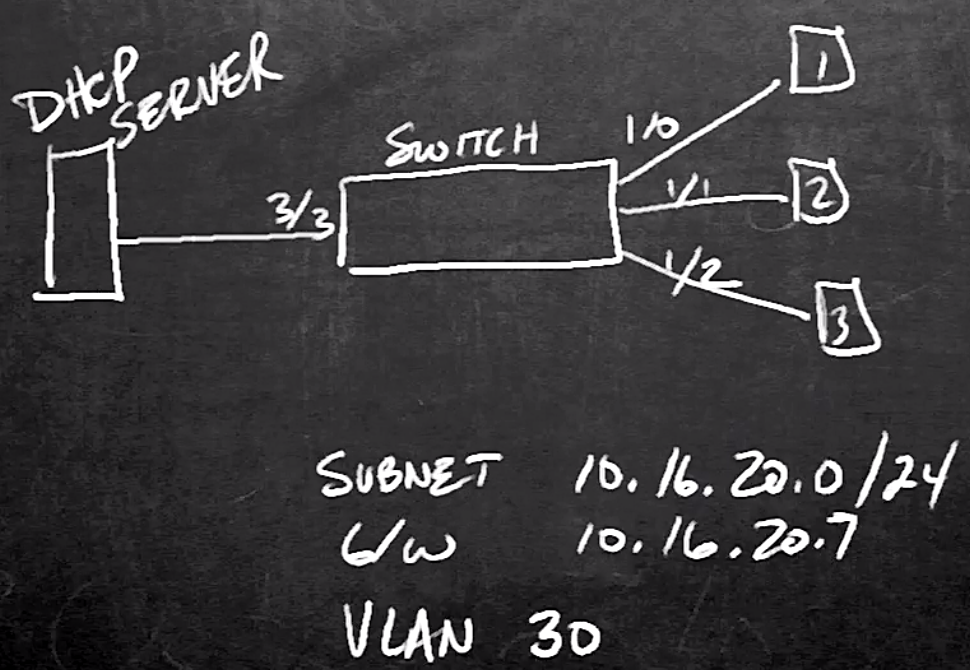

# 19. Configure and Verify Cisco DHCP Snooping

Trainer: Keith Barker

## Introducing DHCP Snooping

- Learning goals
  - benefits of DHCP snooping
  - trusted and untrusted ports
  - enable switch to verify IP and MAC addresses before receiving frames

## Why is DHCP Snooping Needed

- Benefits of DHCP snooping
  - example topology
  - DHCP DORA process
    - Discover (broadcast): client sending out DHCP server request
    - Offer (unicast): DHCP server offerring service
    - Request (broadcast): client sending request for DHCP service
    - Acknowledgement (unicast): server replying to the request

    

      
      
    

  - DHCP snooping
    - config to accept DHCP type messages on switch
    - config DHCP service on Vlan 30
    - L2 switch blocking unauthorized DHCP servers from distributing IP addresses to clients
    - port categories
      - truested:
        - a.k.a Trusted Source or Trusted interface
        - DHCP server messages trusted
      - untrusted
        - a.k.a Untrusted Source or Untrusted interface
        - DHCP server messages not trusted
        - default setting

## The Recipe for DHCP Snooping

## Building and Implementing DHCP Snooping in PT

## Adding Source Guard to a Switch

## Applying DHCP Snooping in Production

## Review of Configure and Verify Cisco DHCP Snooping

## Configure and Verify Cisco DHCP Snooping

