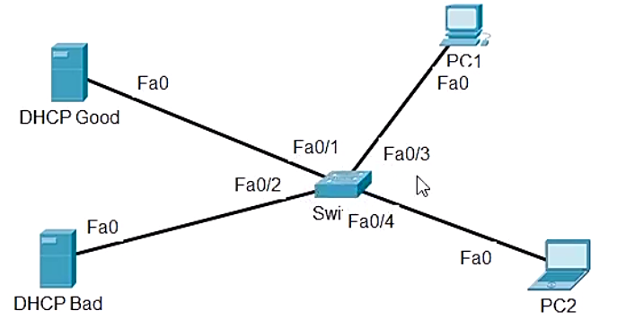

# 19. Configure and Verify Cisco DHCP Snooping

Trainer: Keith Barker


## Introducing DHCP Snooping

- Learning goals
  - benefits of DHCP snooping
  - trusted and untrusted ports
  - enable switch to verify IP and MAC addresses before receiving frames

## Why is DHCP Snooping Needed

- DHCP DORA process
  - Discover (broadcast): client sending out DHCP server request
  - Offer (unicast): DHCP server offerring service
  - Request (broadcast): client sending request for DHCP service
  - Acknowledgement (unicast): server replying to the request


- DHCP snooping
  - config to accept DHCP type messages on switch
  - config DHCP service on Vlan 30
  - L2 switch blocking unauthorized DHCP servers from distributing IP addresses to clients
  - port categories
    - truested:
      - a.k.a Trusted Source or Trusted interface
      - DHCP server messages trusted
    - untrusted
      - a.k.a Untrusted Source or Untrusted interface
      - DHCP server messages not trusted
      - default setting
  - router w/o DHCP snooping feature
  - DHCP server messages w/ DHCP Option 82 - Agent Information Option


## The Recipe for DHCP Snooping

- Commands for DHCP snooping
  - enable DHCP snooping: `SW(config)# ip dhcp snooping`
  - enable DHCP snooping on a particular VLAN: `SW(config)# ip dhcp snooping vlan 20`
  - confing a trusted port: `SW(config-if)# ip dhcp snoop trust`
  - option 82 not allowed w/ `SW(config)# no ip dhcp snooping info option`


## Building and Implementing DHCP Snooping in PT

- Demo: config DHCP snooping

  <figure style="margin: 0.5em; display: flex; justify-content: center; align-items: center;">
    
  </figure>

  ```bash
  SW# show vlan brief
  ! all ports on native vlan

  SW# conf t
  SW(config)# ip dhcp snooping
  
  SW(config)# do show ip dhcp snooping
  DHCP snooping is configured on the following VLANs:
  none
  Insertion of option 82 is enabled
  Option 82 on untrusted port is not allowed
  Verification of hwaddr field is enabled
  Interface         Trusted   Rate Limited (pps)
  ----------------  -------   ------------------

  SW(config)# ip dhcp snooping vlan 1
  SW(config)# do show ip dhcp snooping
  Switch DHCP snooping is enabled
  DHCP snooping is configured on the following VLANs:
  1
  Insertion of option 82 is enabled
  Option 82 on untrusted port is not allowed
  Verification of hwaddr field is enabled
  Interface         Trusted   Rate Limited (pps)
  ----------------  -------   ------------------

  SW(config)# no ip dhcp snooping information option
  SW(config)# do show ip dhcp snooping
  Switch DHCP snooping is enabled
  DHCP snooping is configured on the following VLANs:
  1
  Insertion of option 82 is disabled
  Option 82 on untrusted port is not allowed
  Verification of hwaddr field is enabled
  Interface         Trusted   Rate Limited (pps)
  ----------------  -------   ------------------

  SW(config)# int f0/1
  SW(config-if)# ip dhcp snooping trust
  SW(config)# do show ip dhcp snooping
  Switch DHCP snooping is enabled
  DHCP snooping is configured on the following VLANs:
  1
  Insertion of option 82 is disabled
  Option 82 on untrusted port is not allowed
  Verification of hwaddr field is enabled
  Interface         Trusted   Rate Limited (pps)
  ----------------  -------   ------------------
  FastEthernet0/1   yes       unlimited
  ```

- Demo: verify DHCP operations
  - packet tracer to conduct the demo
  - bootup PC1 and observe interfaces connected to DHCP Good and DHCP Bad
  - check IP address of PC1 & PC2 $\gets$ both from DHCP Good server

  ```bash
  SW# show ip dhcp binding
  MacAddress          IpAddress     Lease (sec)   Type            VLAN  Interface
  -----------------   ------------  -----------   -------------   ----  ---------------
  00:D0:FF:B1:3D:16   10.16.20.2    86400         dhcp-snooping   1     FastEthernet0/1
  00:DC:CF:61:E3:90   10.16.20.3    86400         dhcp-snooping   1     FastEthernet0/2
  Total number of bindings: 2
  ```


## Adding Source Guard to a Switch

- Source guard overview
  - a per-interface traffic filter
  - permitting IP traffic only if IP and/or MAC addresses of each packet matched
  - enable source guard: `SW(config-if)# ip verify source port-security`
    - `port-security`: verify both IP and MAC addresses


- Demo: config source guard

  ```bash
  SW# show ip dhcp snooping
  DHCP snooping is configured on the following VLANs:
  30
  DHCP snooping is operational on the following VLANs:
  30
  DHCP snooping is configured on the following L3 Interfaces:

  Insertion of option 82 is disabled
    circuit-id default format: vlan-mod-port
    remote-id: 00dc.d2b2.ff00 (MAC)
  Option 82 on untrusted port is not allowed
  Verification of hwaddr field is enabled
  Verification of giaddr field is enabled
  DHCP snooping trust/rate is configured on the following Interfaces:

  Interface           Trusted   Allow option    Rate Limited (pps)
  ------------------  -------   ------------    ------------------
  GigabitEthernet0/1   yes       yes             unlimited

  SW# show ip dhcp snooping binding
  MacAddress           IpAddress    LeaseSec   Type           VLAN    Interface
  -------------------  ----------   ---------  -------------  ----    -------------------
  00:50:79?:66:68:04   10.16.20.101 85538      dhcp-snooping   30     GigabitEThernet0/1
  Total number of binding: 1

  SW# conf t
  SW(config)# int g0/1
  SW(config-if)# ip verify source port-security
  SW(config-if)# end

  SW# show ip source binding
  MacAddress           IpAddress    LeaseSec   Type           VLAN    Interface
  -------------------  ----------   ---------  -------------  ----    -------------------
  00:50:79?:66:68:04   10.16.20.101 85448      dhcp-snooping   30     GigabitEThernet0/1
  Total number of binding: 1

  SW# show ip verify source
  Interface  Filter-type  Filter-mode  IP-address       Mac-address        Vlan
  ---------  -----------  -----------  ---------------  -----------------  ----------
  Gi0/1      ip-mac       active       10.16.20.101     permit-all         30
  ```


## Applying DHCP Snooping in Production

- Demo: DHCP snooping in production
  - tasks:
    - R3-FL (R3) as DHCP server for VLAN 30
    - FL-Switch (SW) w/ dhcp snooping for Vlan 30
    - disable option 82 insertion for DHCP snooping or config g3/3 on SW as trusted port
    - verify from FL-PC (PC1)

  <figure style="margin: 0.5em; display: flex; justify-content: center; align-items: center;">
    
  </figure>

  ```bash
  ! always verify basic info before conducting any config
  R3# show ip int brief
  Interface              IP-Address     OK? Method Status                Protocol
  Ethernet0/0            unassigned     YES NVRAM  administratively down down
  GigabitEthernet0/0     10.16.7.7      YES VNARM  up                    up
  GigabitEthernet1/0     10.16.16.7     YES VNARM  up                    up
  GigabitEthernet1/0.30  10.16.20.7     YES VNARM  up                    up
  GigabitEthernet1/0.40  10.16.22.7     YES VNARM  up                    up
  GigabitEthernet2/0     unassigned     YES NVRAM  administratively down down
  ...
  Loopback0              3.3.3.3        YES VNARM  up                    up

  R3# conf t
  R3(config)# ip dhcp pool DEMOPOOL
  R3(dhcp-config)# default-router 10.16.20.7
  R3(dhcp-config)# dns-server 8.8.8.8
  R3(dhcp-config)# exit
  R3(config)# ip dhcp excluded-address 10.16.20.1 10.16.20.10
  R3(config)# end

  R3# show ip dhcp pool
  Pool DEMOPOOL:
   Utilization mark (high/low)    : 100 / 0
   Subnet size (first/next)       : 0 / 0
   Total addresses                : 254
   Leased addresses               : 0
   Pending event                  : none
   1 subnets are currently in the pool :
   Current index        IP address range           Leased/Exclude/Total
   10.16.20.1           10.16.20.1 - 10.16.20.254  0     / 10    / 254
   
  
  ! config switch
  SW# show ip dhcp snooping
  DHCP snooping is configured on the following VLANs:
  none
  DHCP snooping is operational on the following VLANs:
  none
  DHCP snooping is configured on the following L3 Interfaces:

  Insertion of option 82 is disabled
    circuit-id default format: vlan-mod-port
    remote-id: 00dc.d2b2.ff00 (MAC)
  Option 82 on untrusted port is not allowed
  Verification of hwaddr field is enabled
  Verification of giaddr field is enabled
  DHCP snooping trust/rate is configured on the following Interfaces:

  Interface           Trusted   Allow option    Rate Limited (pps)
  ------------------  -------   ------------    ------------------

  SW# conf t
  SW(config)# ip dhcp snooping
  SW(config)# ip dhcp snooping vlan 30

  SW(config)# do show ip dhcp snooping
  Switch DHCP snooping is enabled
  Switch DHCP gleaning is disabled
  DHCP snooping is configured on the following VLANs:
  30
  DHCP snooping is operational on the following VLANs:
  30
  ...

  SW(config)# no ip dhcp snooping infomation option
  ...
  Insertion of option 82 is disabled
  ...

  ! verify the interface connect to R3
  SW(config)# do show cdp neighbor
  Device ID        Local Intrfce     Holdtme    Capability  Platform  Port ID
  R3               Gig 3/3           163               R    7206VXR   Gig 1/0

  ! config g3/3 as trusted port
  SW(config)# int g3/3
  SW(config-if)# ip dhcp snooping trust
  SW(config-if)# end

  SW# ip dhcp snooping
  Switch DHCP snooping is enabled
  Switch DHCP gleaning is disabled
  DHCP snooping is configured on the following VLANs:
  30
  DHCP snooping is operational on the following VLANs:
  30
  DHCP snooping is configured on the following L3 Interfaces:

  Insertion of option 82 is disabled
    circuit-id default format: vlan-mod-port
    remote-id: 00dc.d2b2.ff00 (MAC)
  Option 82 on untrusted port is not allowed
  Verification of hwaddr field is enabled
  Verification of giaddr field is enabled
  DHCP snooping trust/rate is configured on the following Interfaces:

  Interface           Trusted   Allow option    Rate Limited (pps)
  ------------------  -------   ------------    ------------------
  GigabitEthernet3/3  yes       yes             unlimited

  ! verify PC1 and issue DHCP request
  PC1> show ip
  NAME        : PC1
  IP/MASK     : 10.16.20.30/24
  GATEWAY     : 10.16.20.7
  DNS         : 
  MAC         : 00:50:79:66:68:04
  LPORT       : 10222
  RHOST:RPORT : 127.0.0.1:10223
  MTU         : 1500

  PC1> ip dhcp
  DDORA IP 10.16.20.11/24 GW 10.16.20.7

  ! verify on SW
  SW# show ip dhcp binding
  MacAddress           IpAddress    LeaseSec   Type           VLAN    Interface
  -------------------  ----------   ---------  -------------  ----    -------------------
  00:50:79:66:68:04    10.16.20.11  86376      dhcp-snooping   30     GigabitEThernet0/1
  Total number of binding: 0
  ```


## Review of Configure and Verify Cisco DHCP Snooping

- Question 1

  How does DHCP Snooping protect the network?

  A. Switch denies inbound DHCP server message, on half-duple ports.<br>
  B. Switch denies frames, if the maximum MAC address count is exceeded.<br>
  C. Switch denies frames, if the the user hasn't been authenticated.<br>
  D. Switch denies inbound DHCP server messages,, on untrusted DHCP ports.<br>

  Ans: D


- Question 2

  Which feature can leverage the information learned via DHCP snooping, and prevent IP address snooping?

  A. Dynamic ARP Inspection (DAI)<br>
  B. Source guard<br>
  C. Destination guard<br>
  D. Port Security<br>

  Ans: B


- Question 3

  What is the default for a port, when DHCP snooping is applied?

  A. Trusted<br>
  B. Untrusted<br>
  C. Err-disabled<br>
  D. Full-duplex<br>

  Ans: B

## Configure and Verify Cisco DHCP Snooping

- [CCNA Lab Assessment Online Training](https://www.cbtnuggets.com/it-training/cisco/assessment-labs)

