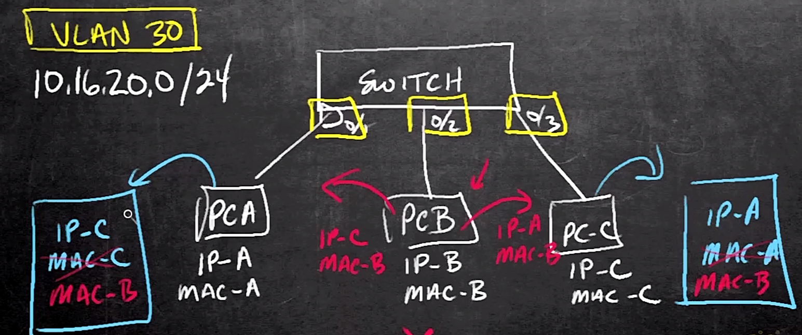

# 20. Configure and Verify Cisco Dynamic ARP Inspection

Trainer: keith Barker

## Introducing Dynamic ARP Inspection (DAI)

- Learning goals
  - Dynamic ARP Inspection (DAI)
  - implement DAI
  - ARP ACL
  - DAI options and features

## Why is DAI Needed

- ARP and issue
  - PCA $\leftrightarrow$ PAC
    - ARP cache in PCA w/ entry - (IP-C, MAC-C)
    - ARP cache in PCC w/ entry - (IP-A, MAC-A)
  - PCB running malicious software to send ARP message w/ (IP-C, MAC-B)
  - PCA updating cache w/ entry - (IP-C, MAC-B)
  - PCB sending ARP message w/ (IP-A, MAC-B) as well
  - PCC updating cache w/ entry - (IP-A, MAC-B)
  - PCB forwarding received packets to appropriate destination after eavesdropping or manipulating
  - Solution: Dynamic ARP Inspection (DAI)

  <figure style="margin: 0.5em; display: flex; justify-content: center; align-items: center;">
    
  </figure>

## The Recipe and Commands for DAI

- DAI overview
  - DHCP snooping used to map IP and MAC addresses
  - commands
    - enable DAI on vlan: `ip arp inspecton clan 30`
    - enable intf as DAI trusted port: `if) ip arp inspect trust`
    - verify DAI: `show ip arp inspect vlan 30`
  - router a DHCP client $\to$ not offering DHCP snooping
    - manually config static L2 & L3 mapping
    - config the port on switch connected to router as a trusted port

## Implementing DAI

## ARP Access Lists for Non-DHCP Devices

## Additional DAI Options and Features

## Applying DAI to the Production Network

## Review of Configure and Verify Cisco Dynamic ARP Inspection

## Configure and Verify Cisco Dynamic ARP Inspection

