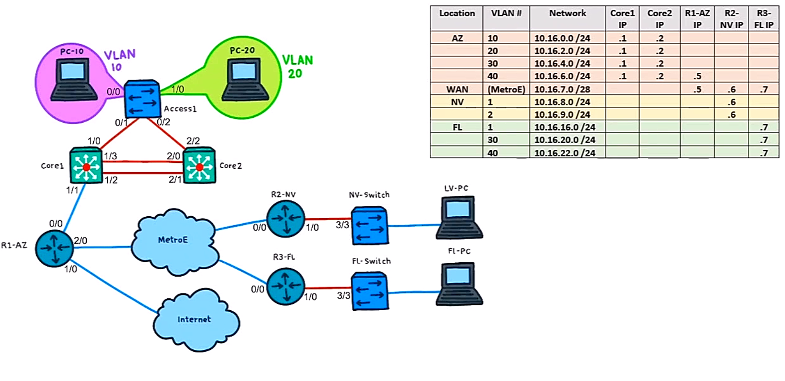

# 20. Configure and Verify Cisco Dynamic ARP Inspection

Trainer: keith Barker


## Introducing Dynamic ARP Inspection (DAI)

- Learning goals
  - Dynamic ARP Inspection (DAI)
  - implement DAI
  - ARP ACL
  - DAI options and features


## Why is DAI Needed

- ARP and issue
  - PCA $\leftrightarrow$ PAC
    - ARP cache in PCA w/ entry - (IP-C, MAC-C)
    - ARP cache in PCC w/ entry - (IP-A, MAC-A)
  - PCB running malicious software to send ARP message w/ (IP-C, MAC-B)
  - PCA updating cache w/ entry - (IP-C, MAC-B)
  - PCB sending ARP message w/ (IP-A, MAC-B) as well
  - PCC updating cache w/ entry - (IP-A, MAC-B)
  - PCB forwarding received packets to appropriate destination after eavesdropping or manipulating
  - Solution: Dynamic ARP Inspection (DAI)

  <figure style="margin: 0.5em; display: flex; justify-content: center; align-items: center;">
    
  </figure>


## The Recipe and Commands for DAI

- DAI overview
  - DHCP snooping used to map IP and MAC addresses
  - commands
    - enable DAI on vlan: `ip arp inspecton clan 30`
    - enable intf as DAI trusted port: `if) ip arp inspect trust`
    - verify DAI: `show ip arp inspect vlan 30`
  - router a DHCP client $\to$ not offering DHCP snooping
    - manually config static L2 & L3 mapping
    - config the port on switch connected to router as a trusted port


## Implementing DAI

- Config DAI
  - topology:
    - R3 connected to Switch (SW) on port g3/3
    - PC2 connected to SW on port g0/2
    - another switch (subnet 10.1.0.0/24) connected to SW on port g0/1
  - task: implement DAI for SW
  
  ```bash
  ! verify DHCP snooping enabled
  SW# show ip dhcp snooping binding
  MacAddress           IpAddress    LeaseSec   Type           VLAN    Interface
  -------------------  ----------   ---------  -------------  ----    -------------------
  00:50:79:66:68:04    10.16.20.101 85604      dhcp-snooping   40     GigabitEThernet0/2
  00:15:5D:77:77:01    10.16.20.102 85689      dhcp-snooping   30     GigabitEthernet0/1
  Total number of binding: 2

  SW# shop ip arp inspection vlan 30
  Source Mac Validation       : Disabled
  Destination Mac Validation  : Disabled
  IP Address Validation       : Disabled
  
  Vlan Configuration Operation ACL Match Static ACL
  ---- ------------- --------- --------- ----------
    30 Disabled      Inactive
  
  Vlan ACL Logging DHCP Logging Probe Logging
  ---- ----------- ------------ -------------
    30 Deny        Deny         Off
  
  ! config interface trust first
  SW# conf t
  SW(config)# int g3/3
  
  SW(config-if)# do show cdp neighbor
  Device ID        Local Intrfce     Holdtme    Capability  Platform  Port ID
  R3               Gig 3/3           154               R    7206VXR   Gig 1/0

  SW(config-if)# ip arp inspection trust
  SW(config-if)# exit

  ! enable DAI
  SW(config)# ip arp inspection vlan 30
  SW(config)# end

  ! verify DAI
  SW# show ip arp inspection vlan 30
  Source Mac Validation       : Disabled
  Destination Mac Validation  : Disabled
  IP Address Validation       : Disabled
  
  Vlan Configuration Operation ACL Match Static ACL
  ---- ------------- --------- --------- ----------
    30 Enabled       Active
  
  Vlan ACL Logging DHCP Logging Probe Logging
  ---- ----------- ------------ -------------
    30 Deny        Deny         Off

  ! ARP deny msgs
  SW#
  ...
  %SW_DAI-4-DHCP_SNOOPING_DENY: 2 Invalid ARPs (Req) on Gi0/1, vlan 30.
    ([0015.5d67.8322/10.1.0.111/0000.0000.0000/10.1.0.1/00:29:59 UTC ...])
  %SW_DAI-4-DHCP_SNOOPING_DENY: 2 Invalid ARPs (Req) on Gi0/1, vlan 30.
    ([0015.5d44.5566/10.1.0.120/0000.0000.0000/10.1.0.1/00:30:00 UTC ...])
  ...TRUNCATED...

  ! another switch connected to SW  w/ untrusted port
  ! DHCP messages dropped amd no (IP, MAC) mapping generated
  ```


## ARP Access Lists for Non-DHCP Devices

- Troubleshooting dropped ARP msgs from untrusted port connected to a switch
  - dropped DHCP messages allowed by permitted ACL
  
  ```bash
  SW# show ip dhcp snooping binding
  MacAddress           IpAddress    LeaseSec   Type           VLAN    Interface
  -------------------  ----------   ---------  -------------  ----    -------------------
  00:50:79:66:68:04    10.16.20.101 85604      dhcp-snooping   40     GigabitEThernet0/2
  00:15:5D:77:77:01    10.16.20.102 85689      dhcp-snooping   30     GigabitEthernet0/1
  Total number of binding: 2

  ! config interface trust first
  SW# conf t
  SW(config)# int g3/3
  SW(config-if)# ip arp inspection trust
  SW(config-if)# exit

  SW(config)# ip arp inspection vlan 30

  SW(config)# arp access-list DEMO-LIST
  SW(config-arp-nacl)# permit ip host 10.1.0.111 mac host 0015.5d67.8322
  SW(config-arp-nacl)# permit ip host 10.1.0.120 mac host 0015.5d44.5566
  SW(config-arp-nacl)# exit

  SW(config)# ip arp inspection filter DEMO-LIST vlan 30
  SW(config)# end

  SW# show arp access-list
  ARP access list DEMO-LIST
      permit ip host 10.1.0.111 mac host 0015.5d67.8322
      permit ip host 10.1.0.120 mac host 0015.5d44.5566

  SW# show arp inspection vlan 30
  Source Mac Validation       : Disabled
  Destination Mac Validation  : Disabled
  IP Address Validation       : Disabled
  
  Vlan Configuration Operation ACL Match Static ACL
  ---- ------------- --------- --------- ----------
    30 Enabled       Active    DEMO-LIST No
  
  Vlan ACL Logging DHCP Logging Probe Logging
  ---- ----------- ------------ -------------
    30 Deny        Deny         Off

  SW# show ip arp inspection statistics
  Vlan Forwarded Dropped DHCP Drops ACL Drops
  ---- --------- ------- ---------- ----------
    30        46      46         46          0
  
  Vlan DHCP Permits ACL Permits Probe Permit  Source MAC Failures
  ---- ------------ ----------- ------------  -------------------
    30            0          46            0                    0
  
  Vlan Dest MAC Failures IP Validation Failures Invalid Protocol Data
  ---- ----------------- ---------------------- ---------------------
    30                 0                      0                     0

  ! generate traffic from Kali Linux
  Kali# ifconfig
  eth0: flags=4163 ...TRUNCATED...
      inet 10.16.20.102 ...TRUNCATED...

  Kali# ping 10.16.20.7
  ...TRUNCATED...

  ! statistics increased
  SW# show ip arp inspection statistics
  Vlan Forwarded Dropped DHCP Drops ACL Drops
  ---- --------- ------- ---------- ----------
    30        101     46         46          0
  
  Vlan DHCP Permits ACL Permits Probe Permit  Source MAC Failures
  ---- ------------ ----------- ------------  -------------------
    30            1          99            0                    0
  
  Vlan Dest MAC Failures IP Validation Failures Invalid Protocol Data
  ---- ----------------- ---------------------- ---------------------
    30                 0                      0                     0
  ```


## Additional DAI Options and Features

- Demo: config DAI parameters

  ```bash
  SW# show ip arp inspection interfaces
  Interface       Trust State Rate (pps)  Burst Interval
  --------------- ----------- ----------  --------------
  Gi0/0           Untrusted           15               1
  Gi0/0           Untrusted           15               1
  ...TRUNCATED...
  Gi3/3           Trusted           None             N/A

  ! config DAI on g3/3 w/ rate limit = 100 pkts/sec
  SW# conf t
  SW(config)# int g3/3
  SW(config-if)# ip arp inspection limit rate 100
  SW(config-if)# end

  SW# show ip arp inspection interfaces
  Interface       Trust State Rate (pps)  Burst Interval
  --------------- ----------- ----------  --------------
  Gi0/0           Untrusted           15               1
  Gi0/0           Untrusted          100               1
  ...TRUNCATED...
  Gi3/3           Trusted           None             N/A

  ! verify w/ nmap to scan IP addr space w/o port scan
  Kali# nmap -sn 10.16.20.0/24

  SW#
  %SW_DA-4-PACKET_RATE_EXCEEDED: 103 packets received in 630 milliseconds on Gi0/1
  %PM-4-ERR_DISABLED: arp-inspection error detected on Gi0/1, putting Gi0/1 in err-disable state
  %LINEPORTO-5-UPDOWN: Line protocol on Interface GigabitEthernet0/1, changed state to down
  %LINK-3-UPDOWN: Interface GigabitEThernet0/1, change state to down

  SW# show int status err-disabled
  Port      Name      Status       Reason          Err-disabled Vlans
  Gi0/1               err-disabled arp-inspection

  ! re-activate shutdown interface
  SW# conf t
  SW(config)# int g0/1
  SW(config-if)# shutdown
  SW(config-if)# no shutdown
  SW(config-if)# end

  ! ARP spoofing
  ! verify w/ arpspoof to perform ARP spoofing from Kali Linux
  ! sending broadcast arp responses to clean L2 address of 10.16.20.7 w/
  ! L2 address of eth0
  Kali# arpspoof -i eth0 10.16.20.7 
  0:15:5d:77:77:1 ff:ff:ff:ff:ff:ff 0896 42: arp reply 10.16.20.7 
    is-at 0:15:5d:77:77:1
  ...TRUNCATED...

  SW#
  %SW_DAI-4-DHCP_SNOOPING_DENY: 1 INvalid ARPs (Res) on Gi0/1, Vlan 30
    ([0015.5d77.7701/10.16.20.7/ffff.ffff.ffff/0.0.0.0/00:36:14 UTC ...])
  ...

  ! disable src/dst MAC & IP addresses validation by default
  SW# show ip arp inspection vlan 30
  Source Mac Validation       : Disabled
  Destination Mac Validation  : Disabled
  IP Address Validation       : Disabled
  ...

  ! enable src/dst MAC & IP addresses validation
  SW# conf t
  SW(config)# ip arp inspection validate dst-mac src-mac ip
  SW(config)# end

  SW# show ip arp inspection vlan 30
  Source Mac Validation       : Enabled
  Destination Mac Validation  : Enabled
  IP Address Validation       : Enabled
  ...TRUNCATED...
  ```


## Applying DAI to the Production Network

- Demo: config DAI in production network
  - topology
    - SW = FL-Switch
    - R3 = R3-FL
    - PC2 = FL-PC2

    <figure style="margin: 0.5em; display: flex; justify-content: center; align-items: center;">
      
    </figure>

  - tasks: 
    - setup DAI on vlan 40
    - trust port g3/3 $\gets$ g1/0 on R3 not assigned via DHCP
    - verify DAI working correctly
  
  ```bash
  ! verify basic info
  SW# show vlan brief
  VLAN Name                             Status    Ports
  ---- -------------------------------- --------- -------------------------------
  1    default                          active    Gi0/0, Gi0/3, Gi0/1, Gi1/1,
                                                  ...
  30   Engineering                      active    Gi0/1
  40   Sales                            active    Gi0/2
  ...TRUNCATED...

  SW# show cdp neighbor
  Device ID        Local Intrfce     Holdtme    Capability  Platform  Port ID
  R3               Gig 3/3           177               R    7206VXR   Gig 1/0

  SW# conf t
  SW(config)# int g3/3
  SW(config-if)# ip arp inspection trust
  SW(config-if)# exit
  SW(config)# ip arp inspection vlan 40
  SW(config)# end

  SW# show ip arp inspection vlan 40

  Source Mac Validation       : Disabled
  Destination Mac Validation  : Disabled
  IP Address Validation       : Disabled
  
  Vlan Configuration Operation ACL Match Static ACL
  ---- ------------- --------- --------- ----------
    40 Enabled       Active
  
  Vlan ACL Logging DHCP Logging Probe Logging
  ---- ----------- ------------ -------------
    40 Deny        Deny         Off

  SW# show ip dhp snooping binding
  MacAddress           IpAddress    LeaseSec   Type           VLAN    Interface
  -------------------  ----------   ---------  -------------  ----    -------------------
  00:50:79:66:68:04    10.16.20.101 85681      dhcp-snooping   40     GigabitEThernet0/2
  00:15:5D:77:77:01    10.16.20.102 85766      dhcp-snooping   30     GigabitEthernet0/1
  Total number of binding: 2

  ! PC2 > show ip
  NAME        : FL-PC2[1]
  IP/MASK     : 10.16.22.101/24
  GATEWAY     : 10.16.22.7
  DNS         : 
  DHCP SERVER : 10.16.22.7
  DHCP LEASE  : 85105, 86400/43200/75600
  MAC         : 00:50:79:66:68:00
  LPORT       : 10008
  RHOST:RPORT : 127.0.0.1:10009
  MTU         : 1500

  PC1> ping 10.16.22.7
  ...successful...

  ! PC2 w/ static IP address -> no (IP, MAC) mapping on SW
  ! ARP msg from PC2 unable to be verified --> pkt dropped
  PC2> ip 10.16.22.200
  PC2: 10.16.22.200 255.255.255.0

  PC2> ping 10.16.22.7
  ..UNSUCCESS...

  SW#
  %SW_DAI-4-DHCP_SNOOPING_DENY: 1 Invalid ARPs (Eeq) on Gi0/2, vlan 40
    ([0050.7966.6800/10.16.22.200/ffff.ffff.ffff/10.16.22.200/00:27:36 UTC ...])
  ...TRUNCATED...

  ! PC2 changes back to dynamic IP address
  PC2> ip dhcp
  DORA IP 10.16.22.101/24 GW 10.16.22.7

  ! verify the change
  SW# show ip dhcp snooping binding
  MacAddress           IpAddress    LeaseSec   Type           VLAN    Interface
  -------------------  ----------   ---------  -------------  ----    -------------------
  00:50:79:66:68:04    10.16.20.101 85681      dhcp-snooping   40     GigabitEThernet0/2
  00:15:5D:77:77:01    10.16.20.102 85766      dhcp-snooping   30     GigabitEthernet0/1
  Total number of binding: 2

  ! verify connectivity on PC2
  PC2> pint 10.16.22.7
  ...SUCCESS...
  ```


## Review of Configure and Verify Cisco Dynamic ARP Inspection

- Question 1

  How does DAI dynamically know about which IP/MAC address mapping are correct?

  A. IGMP Snooping<br>
  B. DHCP Snooping<br>
  C. IP Verify<br>
  D. Source Guard<br>
  E. BPDU Guard<br>

  Ans: B


- Question 2

  Which methods would allow a device which is NOT in the DHCP snooping binding table, to still be allowed to send ARP messages into the network? (choose 2)

  A. Port Security<br>
  B. DAI trusted port<br>
  C. Extended Access-list<br>
  D. ARP Access-list<br>
  E. Source Guard<br>

  Ans: BD


- Question 3

  Which is the command to implement DAI on a CLAN?

  A. arp inspection vlan 40<br>
  B. ip ar inspection vlan 40<br>
  C. arp ip inspction vlan 40<br>
  D. inspection ip arp vlan 40<br>

  Ans: B


## Configure and Verify Cisco Dynamic ARP Inspection


