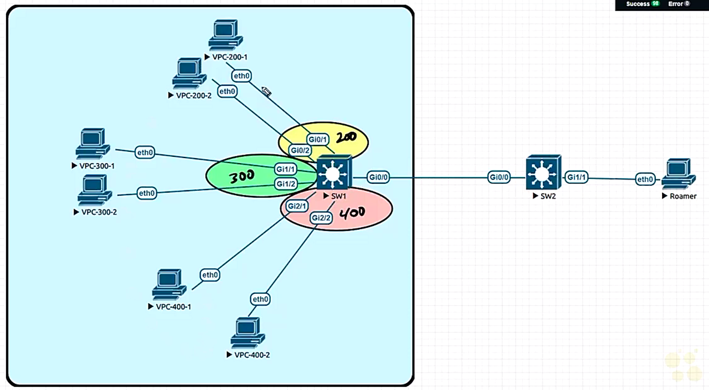

# 21. Private VLANS

Trainer: Keith Barker


## Introduction to Private VLANs

- Learning goals
  - PVLANs modes
  - config PVLANs
  - Verify PVLANs
  - trunkking w/ PVLANs


## PVLANs Overview

- VLAN fundamentals
  - traditional VLAN
    - create a vlan, said Vlan 100
    - asssign vlan 100 to a couple of ports
    - the ports w/ L3 scheme 10.100.0.0/24
    - frames allowed to send btw ports using broadcast
  - issue w/ traditional vlan: unable to filter broadcast frames
  - solution: PVLAN
  
  
- Private VLAN (PVLAN) fundamentals
  - create a primary vlan, said vlan 100
  - logical sub-divisions of primary vlan created to separate the ports
  - secondary vlan as the sub-section of primary vlan
  - create secondary vlans associated w/ a subset of ports in the primary vlan
  - two types of secondary vlans
    - community:
      - ports within the same community able to communicate w/ each other
      - ports belonging to different communit vlans unable to communicate w/ each other
    - isolated: ports within unable to communicate w/ each other
  - ports w/ the same primary vlan and IP address space $\to$ IP address not decisive


## Promiscuous Ports

- Promiscuous ports overview
  - ports w/o any restriction in a primary vlan
  - acting as a default gateway in L3 routing
  - example:
    - primary vlan = 100, community vlan = 200, community vlan = 300, isolated vlan = 400
    - IP address space of vlan 100: 10.100.0.0/24
  - promiscuous ports
    - associated w/ primary vlan, not any secondary vlan
    - able to communicate w/ any port in the primary vlan
    - ports connected to other switches as trunk


## PVLAN Design

- Planning PVLAN
  - primary vlan: 100
  - IP address space: 10.100.0.0/24
  - community vlan: 200 w/ port 0/1-2
  - community vlan: 300 w/ port 1/1-2
  - isolated vlan: 400 w/ port 2/1-2
  - switched virtual interface as promiscuous port
    - associated w/ primary vlan 100
    - IP addr = 10.100.0.1/24
  - DHCP service on SW1

  <figure style="margin: 0.5em; display: flex; justify-content: center; align-items: center;">
    
  </figure>


## Implement PVLANs

- Demo: config PVLAN

  ```bash
  SW# conf t

  ! reset existed config
  SW1(config)# no vlan 2-1000
  SW1(config)# deafult int range g0/0-3
  SW1(config)# default int range 1/0-3
  SW1(config)# default int range 2/0-3

  SW1(config)# spanning mode rapid

  SW1(config)# vtp mode ransport

  ! create secondary vlan
  SW1(config)# vlan 200
  SW1(config-vlan)# name Community A
  SW1(config-vlan)# private-vlan community
  SW1(config-vlan)# exit
  
  SW1(config)# vlan 300
  SW1(config-vlan)# name Community B
  SW1(config-vlan)# private-vlan community
  SW1(config-vlan)# exit
  
  SW1(config)# vlan 400
  SW1(config-vlan)# name Isolated VLAN
  SW1(config-vlan)# private-vlan isolated
  SW1(config-vlan)# exit
  
  ! create primary vlan
  SW1(config)# vlan 100
  SW1(config-vlan)# name Primary VLAN
  SW1(config-vlan)# private-vlan primary
  SW1(config-vlan)# private-vlan association 200, 300, 400
  SW1(config-vlan)# exit

  ! associate ports w/ pvlan
  SW1(config)# interface range GigabitEthernet0/1-2
  SW1(config-if)# switchport private-vlan host-association 100 200
  SW1(config-if)# switchport mode private-vlan host
  SW1(config-if)# exit

  SW1(config)# interface range GigabitEthernet1/1-2
  SW1(config-if)# switchport private-vlan host-association 100 300
  SW1(config-if)# switchport mode private-vlan host
  SW1(config-if)# exit

  SW1(config)# interface range GigabitEthernet2/1-2
  SW1(config-if)# switchport private-vlan host-association 100 400
  SW1(config-if)# switchport mode private-vlan host
  SW1(config-if)# exit

  ! switch virtual interface w/ vlan 100
  SW1(config)# interfac vlan 100
  SW1(config-if)# no shutdown
  SW1(config-if)# private-vlan mapping add 200,300,400
  SW1(config-if)# ip addr 10.100.0.1 255.255.255.0
  SW1(config-if)# end
  ```

## Verify PVLANs

- Demo: verify PVLAN

  ```bash
  SW1# show int brief
  Port      Name     Status       Vlan       Duplex  Speed Type
  Gi0/0              connect      1          a-full  auto  RJ45
  Gi0/1              connect      100,200    a-full  auto  RJ45
  Gi0/2              connect      100,200    a-full  auto  RJ45
  Gi0/3              notconnect   1          a-full  auto  RJ45
  Gi1/0              notconnect   1          a-full  auto  RJ45
  Gi1/1              connect      100,300    a-full  auto  RJ45
  Gi1/2              connect      100,300    a-full  auto  RJ45
  Gi1/3              notconnect   1          a-full  auto  RJ45
  Gi1/0              notconnect   1          a-full  auto  RJ45
  Gi1/1              connect      100,400    a-full  auto  RJ45
  Gi1/2              connect      100,400    a-full  auto  RJ45
  Gi1/3              notconnect   1          a-full  auto  RJ45

  SW1# show vlan private-vlan
  Primary Secondary Type              Ports
  ------- --------- ----------------- -------------------------
  100     200       community         Gi0/1, Gi0/2   
  100     300       community         Gi1/1, Gi1/2
  100     400       isolated          Gi2/1, Gi2/2

  SW1# show vlan private-vlan type
  Vlan Type
  ---- -----------------
  100  primary
  200  community
  300  community
  400  isolated

  SW1# show int gig 0/1 switchport
  Name: Gi0/1
  Switchport: Enable
  Administrative Mode: private-vlan host
  Operational Mode: private-vlan host
  ...TRUNCATED...
  Administrative private-vlan host-association: 100 (Primary VLAN) 200 (Community A)
  ...TRUNCATED...

  SW1# show int gig 1/1 switchport
  Name: Gi1/1
  ...TRUNCATED...
  Administrative private-vlan host-association: 100 (Primary VLAN) 300 (Community B)
  ...TRUNCATED...

  SW1# show int gig 2/1 switchport
  Name: Gi2/1
  ...TRUNCATED...
  Administrative private-vlan host-association: 100 (Primary VLAN) 400 (Isolated VLAN)
  ...TRUNCATED...

  ! config dhcp pool for DHCP service
  SW1# conf t
  SW1(config)# ip dhcp pool DemoPool
  SW1(dhcp-config)# network 10.100.10.0 /24
  SW1(dhcp-config)# exit
  SW1(config)# ip dhcp excluded-address 10.100.0.1 10.100.0.50

  ! DHCP requests
  200-1> ip dhcp
  DORA 10.100.0.51/24

  200-2> ip dhcp
  DORA 10.100.0.52/24

  300-1> ip dhcp
  DORA 10.100.0.53/24

  300-2> ip dhcp
  DORA 10.100.0.54/24

  400-1> ip dhcp
  DORA 10.100.0.55/24

  400-2> ip dhcp
  DORA 10.100.0.56/24

  ! verify reachability 
  200-1> ping 10.100.0.52
  <---REACHABLE--->

  200-1> ping 10.100.0.55
  <---NOT REACHABLE--->

  400-1> pint 10.100.0.56
  <---NOT REACHABLE--->

  x00-x> ping 10.100.0.1
  <---REACHABLE--->
  ```


## Trunking and PVLANs


## PVLAN Summary


