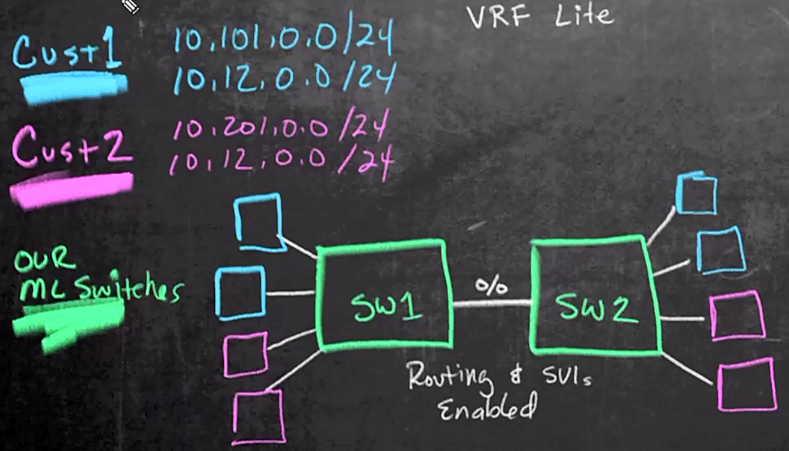

# 22. VRF-lite

Trainer: Keith Barker

## Introduction to VRF-lite

- Learning goals
  - VRF-lite
  - config VRF-lite
  - VRF-lite on multi-layer switch
  - VRF-lite w/ routing
  - DHCP VRF services

## VRF-lite Overview

- Virtual Routing Forwarding-Light (VRF-lite) fundamentals
  - a feature enabling a service provider to support two or more VPNs whose IP addresses probably overlapped
  - using input interfaces to distinguish routes for different VPNs
  - forming virtual packet-forwarding tables by associating one or more Layer 3 interfaces with each VRF
  - either physical or logical
  - VRF-lite interfaces = L3 interfaces
  - devices including VRF-lite
    - customer edge (CE) devices:
      - providing customer access to the service provider network over a data link to one or more provider edge routers
      - advertising the site’s local routes to the provider edge router
      - learning the remote VPN routes from the advertisements
    - provider edge (PE) routers:
      - exchanging routing information with CE devices by using static routing or a routing protocol
      - only required to maintain VPN routes for those VPNs to which it is directly attached
      - eliminating the need for the PE to maintain all of the service provider VPN routes
      - associated with a single VRF if all of these sites participate in the same VPN
      - mapped to a specified VRF
      - any routers in the service provider network that do not attach to CE devices
  
- Demo: two routing tables w/ vrf-lite
  - a router w/ 2 separated VPNs (blue and pink)
  - R1 w/ global (default) routing table
  - VRF as sub-routing table
  - creating two separated sub-routing tables
  - assigning interfaces which sub-routing table belongs to
    - blue routing table (A): g0/0 and g0/1
    - pink routing table (B): g0/2 and g0/3
  - an interfaces belonging to only one sub-routing table and global routing table
  - MPLS using VRF as part of its solution to separate different customers (VPNs)
  - lite version: only separating routing tables and associated interfaces locally
  - analogy: VLAN on L2 switches

  <figure style="margin: 0.5em; display: flex; justify-content: center; align-items: center;">
    
  </figure>

## VRF-lite Configuration Basics

- Commands for VRF-lites
  - procedure
    - create VRF
    - assign L2 interfaces to the VRF
  - creating VRF
    - IPv4 only: `ip vrf VRF_NAME`
    - IPv4 and/or IPv6:
      - enable VRF: `vrf definition VRF_NAME`
      - specify address space: `address-family ipv6|ipv6`
  - config each interface: `if) vrf forwarding VRF_NAME`

## VRFs on a Multi-Layer Switch

- VRFs and Multi-layer switches
  - procedure
    - create VRF
    - allocate L3 interfaces
  - create SVI: `int vlan #`
  - associate SVI to designed VRF

## VRF-lite Design

- Plan for VRF-lite
  - cust1 w/ 2 subnets: 10.101.0.0/24 & 10.12.0.0/24
  - cust2 w/ 2 subnets: 10.201.0.0/24 & 10.12.0.0./24
  - not L3 router but switches
  - using VLANs to map for each subnets
    - vlan 101: 10.101.0.0/24
    - vlan 102: 10.12.0.0/24
    - vlan 201: 10.201.0.0/24
    - vlan 202: 10.12.0.0./24
  - create SVI for each vlan
  - vlan 102 & 202 w/ the same IP address space

  <figure style="margin: 0.5em; display: flex; justify-content: center; align-items: center;">
    
  </figure>

## VRF-lite Implementation

## VRF-lite Adding Routing

## VRF-lite Routing Verification

## DHCP VRF Services

## VRF-lite Summary

