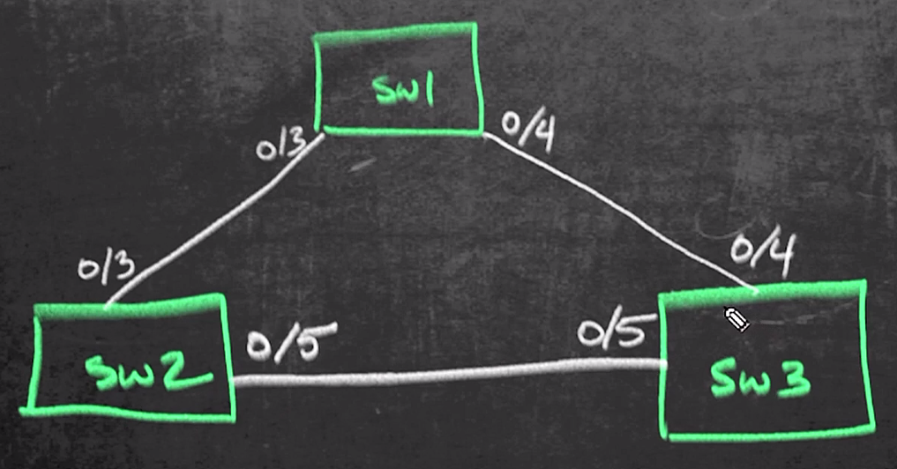

# 25. Additional Layer 2 Security

Trainer: Keith Barker


## Introduction to Additional Layer 2 Security Options

- Learning goals
  - L2 security tools
  - storm control
  - root guard
  - BPDU guard


## Layer 2 Security Overview

- Info required for L2 security
  - network segmentation @ VLAN level $\to$ TrustSec on ISE
  - DHCP snooping
  - DAI
  - port security
  - ACLs

  <figure style="margin: 0.5em; display: flex; justify-content: center; align-items: center;">
    
  </figure>


## Storm Control

- Storm control fundamentals
  - L2 loop forming $\to$ broadcast storm
  - ARP broadcast traffic forming loop
  - solutions
    - spanning tree (STP)
    - storm control: monitoting th elevel of incoming broadcast, multicast, and unicast traffic over 1-second interval


- Demo: config storm control
  - disable STP on VLAN 1

  <figure style="margin: 0.5em; display: flex; justify-content: center; align-items: center;">
    
  </figure>

  ```text
  SW2# show cdp neighbor
  Device ID        Local Intrfce     Holdtme    Capability  Platform  Port ID
  SW1.ogit.com     Fas 0/3           169           R S I    WS-C3560- Fas 0/3
  SW2.ogit.com     Fas 0/5           179           R S I    WS-C3560- Fas 0/5

  SW1# show spanning-tree vlan 1
  ...TRUNCATED... 
  Interface        Role Sts Cost      Prio.Nbr Status
  ---------------- ---- --- --------- -------- --------
  Fa0/3            Desg FWD 19        128.4    P2p
  Fa0/4            Desg FWD 19        128.5    P2p

  SW2# show spanning-tree vlan 1
  ...TRUNCATED... 
  Interface        Role Sts Cost      Prio.Nbr Status
  ---------------- ---- --- --------- -------- --------
  Fa0/3            Root FWD 19        128.4    P2p
  Fa0/5            Altn BLK 19        128.6    P2p

  SW3# show spanning-tree vlan 1
  ...TRUNCATED... 
  Interface        Role Sts Cost      Prio.Nbr Status
  ---------------- ---- --- --------- -------- --------
  Fa0/4            Root FWD 19        128.5    P2p
  Fa0/5            Desg FWD 19        128.6    P2p

  SW1/2/3# conf t
  SW1/2/3(config)# no spanning-tree vlan 1
  SW1/2/3(config)# end

  SW1# conf t
  SW1(config)# int vlan 1
  SW1(config-if)# ip address 1.1.1.1 255.255.255.0
  SW1(config-if)# end

  SW1# show ip int brief
  Interface           IP-Address    OK? Method  Status                Protocol
  Vlan1               1.1.1.1       YES manual  up                    up
  FastEthernet0/1     unassigned    YES NVRAM   administratively down down
  FastEthernet0/2     unassigned    YES NVRAM   administratively down down
  FastEthernet0/3     unassigned    YES NVRAM   up                    up
  ...TRUNCATED... 
  GigabitEthernet0/1  192.168.1.201 YES NVRAM   up                    up

  SW1# ping 1.1.1.88
  .....

  ! broadcast storm happening
  SW1# show int f0/3 | inc Received
    Received 47233 broadcasts (149 multicasts)

  SW1# show int f0/3 | inc Received
    Received 58713 broadcasts (150 multicasts)

  SW1# show int status
  Port      Name      Status        VLan    Duplex  Speed  Type
  FA0/1               not connected 1       a-full  auto   10/100BaseT
  FA0/2               not connected 1       a-full  auto   10/100BaseT
  FA0/3               connected     trunk   a-full  a-100  10/100BaseT
  FA0/4               connected     trunk   a-full  a-100  10/100BaseT
  ...TRUNCATED... 
  Gi0/1               connected     routed  a-full  a-1000 10/100/1000BaseT

  SW1# conf t
  SW1(config)# int range f0/3-4
  SW1(config-if-range)# storm-control broadcast level 10 5
  SW1(config-if-range)# storm-control multicast level bps 10k 5k
  SW1(config-if-range)# storm-control unitcast level 85 80
  SW1(config-if-range)# storm-control action [shutdown | trap]
  SW1(config-if-range)# end

  SW1# show storm-control
  Interface  Filter State    Upper        Lower        Current
  ---------  -------------  -----------  -----------  ----------
  Fa0/3      Forwarding     10.00%          5.00%        0.51%
  Fa0/4      Forwarding     10.00%          5.00%        0.51%

  SW1# show storm-control broadcast
  Interface  Filter State    Upper        Lower        Current
  ---------  -------------  -----------  -----------  ----------
  Fa0/3      Forwarding     10.00%          5.00%        0.51%
  Fa0/4      Forwarding     10.00%          5.00%        0.51%

  SW1# show storm-control unicast
  Interface  Filter State    Upper        Lower        Current
  ---------  -------------  -----------  -----------  ----------
  Fa0/3      Forwarding       85.00%        80.00%        0.00%
  Fa0/4      Forwarding       85.00%        80.00%        0.00%

  SW1# show storm-control multicast
  Interface  Filter State    Upper        Lower        Current
  ---------  -------------  -----------  -----------  ----------
  Fa0/3      Forwarding         10k bps       5k bps       0 bps
  Fa0/4      Forwarding         10k bps       5k bps       0 bps

  SW1/2/3# conf t
  SW1/2/3(config)# spanning-tree vlan 1
  SW1/2/3(config)# end
  ```


## Root Guard

- Root Guard overview
  - STP on 2 switched network (shown as above)
    - SW1 as root bridge on vlan 1
    - f0/3 & f0/4: designated ports
    - f0/3 on Sw2 & f0/4 on SW3: root ports
    - f0/5 on SW3: designated port
    - f0/5 on SW2: blocked port
  - STP switchport states
    - disabled: disable the port
    - blocking: first entering state when connected
    - listening: listening and sending BPDUs
    - learning: receiving a superior BPDU, stop sending BPDU and relay superior BPDU
    - forwarding: forwarding traffic
  - root guard:
    - protectING the STP topology attack of replacing the original Root Bridge with a rogue Root Bridge
    - putting the port in the root-inconsistent STP state if receiving a superior BPDU from a rogue switch


- Demo: config root guard
  
  ```text
  SW1/2/3# show spanning-tree vlan 1
  VLAN0001
    Spanning tree enabled protocol rstp
    Root ID   Priority  24577
              Address   a418.75a2.7880
              This bridge is the root
    <...TRUNCATED...>

  SW2# show spanning-tree vlan 1
  <...TRUNCATED... >
  Interface        Role Sts Cost      Prio.Nbr Status
  ---------------- ---- --- --------- -------- --------
  Fa0/3            Root FWD 19        128.4    P2p
  Fa0/5            Altn BLK 19        128.6    P2p

  SW3# show spanning-tree vlan 1
  <...TRUNCATED...>
  Interface        Role Sts Cost      Prio.Nbr Status
  ---------------- ---- --- --------- -------- --------
  Fa0/4            Root FWD 19        128.5    P2p
  Fa0/5            Desg FWD 19        128.6    P2p

  ! config root guard on f0/5 of Sw3, never being a root port
  ! putting the port into root-inconsistent state
  SW3# conf t
  SW3(config)# int f0/5
  SW3(config-if)# spanning-tree guard root
  SW3(config)# end

  ! verify by putting SW2 as root
  SW2# conf t
  SW2(config)# spanning-tree clan 1 root primary 
  SW2(config)# end

  SW2(config)# show spanning-tree vlan 1
  VLAN0001
    Spanning tree enabled protocol rstp
    Root ID   Priority  24577
              Address   a418.75a2.7880
              This bridge is the root
    <...TRUNCATED...>
  Interface        Role Sts Cost      Prio.Nbr Status
  ---------------- ---- --- --------- -------- --------
  Fa0/3            Root FWD 19        128.4    P2p
  Fa0/5            Desg BLK 19        128.6    P2p

  SW3# show log
  <...TRUNCATED...>
  %SPANTREE-2-ROOTGUARD_CONFIG_CHANGE: Root guard enabled on port FastEthernet0/5 on VLAN 1
  %SPANTREE-2-ROOTGUARD_BLOCK: Root guard blocking port FastEthernet0/5 on VLAN 1

  SW3# show spanning-tree vlan 1
  <...TRUNCATED...>
  Interface        Role Sts Cost      Prio.Nbr Status
  ---------------- ---- --- --------- -------- ---------------
  Fa0/4            Root FWD 19        128.5    P2p
  Fa0/5            Desg FWD 19        128.6    P2p %RoOOT_Inc

  SW3# show spanning-tree inconsistentports
  Name        Interface       Inconsistency
  ----------- --------------- -------------------
  VLAN00001   FastEthernet0/5 Root Inconsistent

  Number of inconsistent ports (segments) in the system: 1
  ```


## BPDU Guard

- BPDU guard
  - a feature to protect the port from receiving STP BPDUs
  - preventing from accidental connection of switching devices to portfast-enable ports
  - action: shutdown the port 


- BPDU filter
  - a feature used to filter sending or receiving BPDUs on a switchport
  - extremely useful on ports configured as portfast ports where not receiving and sending any BPDU messages
  - configured globally or under the interface level
  - action: drop BPDU


- Demo: config BPDU guard
  - topology: same as Root Guard
  - enable BPDU guard on f0/3 on SW2

  ```text
  SW2# show spanning-tree vlan 1
  <...TRUNCATED... >
  Interface        Role Sts Cost      Prio.Nbr Status
  ---------------- ---- --- --------- -------- --------
  Fa0/3            Root FWD 19        128.4    P2p
  Fa0/5            Altn BLK 19        128.6    P2p
  
  SW2# conf t
  SW2(config)# int f0/3
  SW2(config-if)# shutdown
  SW2(config-if)# do show spanning-tree vlan 1
  VLAN0001
    spanning tree enabled protocol rstp
  <...TRUNCATED... >
  Interface        Role Sts Cost      Prio.Nbr Status
  ---------------- ---- --- --------- -------- --------
  Fa0/5            Root FWD 19        128.6    P2p

  SW2(config-if)# spanning-tree bpduguard enable
  SW2(config-if)# no shutdown
  SW2(config-if)# end

  SW2# show int status
  Port      Name      Status        VLan    Duplex  Speed  Type
  FA0/1               notconnected  1       auto    auto   10/100BaseT
  FA0/2               notconnected  1       auto    auto   10/100BaseT
  FA0/3               err-disabled  1       auto    auto   10/100BaseT
  FA0/4               notconnected  1       auto    auto   10/100BaseT
  ...TRUNCATED... 
  Gi0/1               connected     routed  a-full  a-1000 10/100/1000BaseT

  SW2# show int status err-disabled
  Port    Name      Status         Reason         Err-disabled Vlans
  Fa0/3             err-disabled   bpduguard  

  ! recover
  SW2# show int f0/3
  interface FastEthernet0/3
   switchport trunk encapsulation dot1q
   switchport mode trunk
   spanning-tree bpduguard enable
  end

  SW2# conf t
  SW2(config)# int f0/3
  SW2(config-if)# no spanning-tree bpduguard enable
  SW2(config-if)# shutdown
  SW2(config-if)# no shutdown
  SW2(config-if)# end

  SW2# show spanning-tree vlan 1
  <...TRUNCATED... >
  Interface        Role Sts Cost      Prio.Nbr Status
  ---------------- ---- --- --------- -------- --------
  Fa0/3            Root FWD 19        128.4    P2p
  Fa0/5            Altn BLK 19        128.6    P2p
  ```


## Summary of Layer 2 Security


