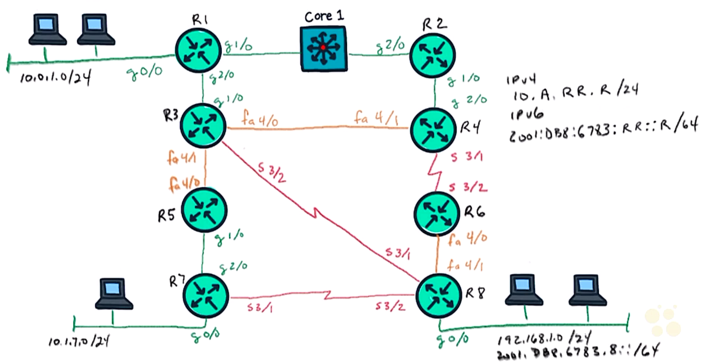

# 26. EIGRP Neighbor Relationships and Authentication

Trainer: Keith Barker

## Introduction to EIGRP Relationships and Authentication

- Learning goals
  - EIGRP
  - EIGRP neighbors
  - EIGRP authentication
  - config EIGRP neighbor and authentication

## Neighborship Overview

- EIGRP neighbors overview
  - requirements:
    - same autonomous system number w/ multicast addr 224.0.0.10 
    - agreed k values: lowest bandwidth on path, delays
    - authentication
    - ACLs to permit 224.0.0.10 & traffic btw
  - IP mask not critical to form EIGRP neighbor
    - R3 subnet: 10.1.35.0/24
    - R5 subnet: 10.1.35.0/25
    - still able to form EIGRP neighbor

  <figure style="margin: 0.5em; display: flex; justify-content: center; align-items: center;">
    
  </figure>

## Authentication Overview

## EIGRP Hands on Lab with Authentication

## EIGRP Neighbor Relationships and Authentication

