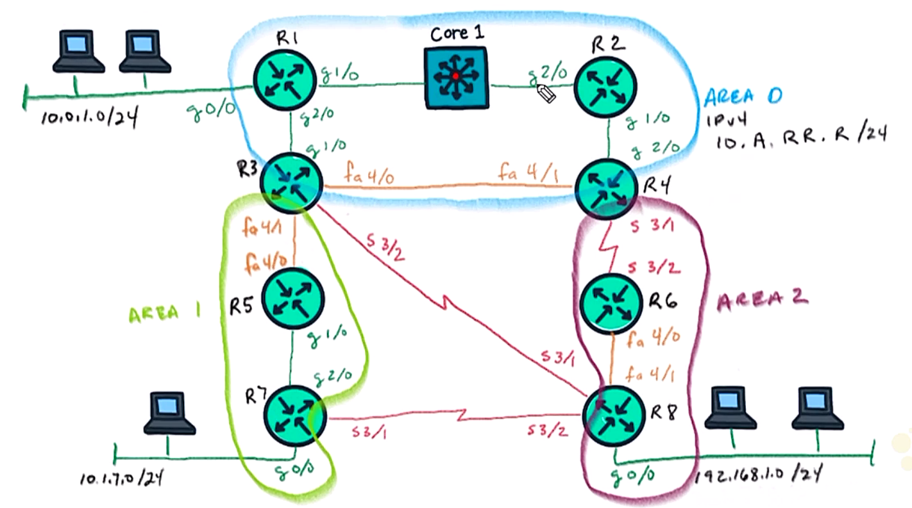

# 27. Troubleshoot OSPF Authentication for IPv4

Trainer: Keith Barker


## Intro to IPv4 OSPF Authentication and Troubleshooting

- Learning goals
  - IPv4 OSPF authentication
  - config OSPF authentication
  - virtual links authentication
  - troubleshooting OSPF authentication


## Overview of OSPF Authentication

- OSPF authentication overview
  - preventing from hacker on subnets as an OSPF fully adjacent router
  - authentication options
    - NULL (0): no authentication
    - simple/ plain text (1): authentication using plain text key
    - MD5/encrypted (2): using MD5 to encrypting key
  - locations to apply authentication
    - area
    - interfaces #\to$ more secure & predecent


- Planning OSPF authentication
  - area 0: no authentication
  - area 1: plain text key authentication
  - area 2: md5 authentication

  <figure style="margin: 0.5em; display: flex; justify-content: center; align-items: center;">
    
  </figure>

- Demo: config and verify all routers
  - general config for all routers

    ```cfg
    ! config apply to all routers (R1~R8)
    conf t
    ip router ospf 1
    area 1 authentication
    area 2 authentication message-digest
    end
    ```
  
  - config R1 and all other routers

    ```text
    R1# conf t
    R1(config)# ip router ospf 1
    R1(config-router)# area 1 authentication
    R1(config-router)# area 2 authentication message-digest
    R1(config-router)# end
    ```

  - verify OSPF 

    ```text
    R1# show ip ospf
      Routing Process "ospf 1" with ID 1.1.1.1 
      <...truncated...>
        Area BACKBONE(0) 
            Number of interfaces in this area is 4 (1 loopback)
            Area has no authentication
            <...truncated...>
    
    R1# show ip ospf int g0/0
    GigabitEthernet0/0 is up, line protocol is up
      <...truncated...>
      Neighbor Count is 0, Adjacent neighbor count is 0
      Suppresses hello for 0 neighbor(0)
    ! nothing about authentication due to area 0

    R5# show ip ospf
      Routing Process "ospf 1" with ID 1.1.1.1 
      <...truncated...>
        Area 1 
            Number of interfaces in this area is 4 (1 loopback)
            Area has simple password authentication
            <...truncated...>
        Area 2
            Number of interfaces in this area is 0
            Area has message digest authentication
      <...truncated...>

    R5# show ip ospf int g1/0
    GigabitEthernet0/0 is up, line protocol is up
      <...truncated...>
      Suppresses hello for 0 neighbor(0)
      Simple password authentication enabled

    ! area 2 routers still forming adjacency even not key set 
    ```


- Demo: config key for OSPF Area 1 routers
  - task: enable plain text password for authentication on interfaces btw R3 & R5 and R5 & R7
  - command to set plain text key: `ip ospf authentication-key cisco123`
  - apply the plain text key to interfaces on R3, R5 & R7

    ```text
    R3(config)# int f4/1
    R3(config-if)# ip ospf authentication-key cisco123

    R5(config-if)# show ip cdp neighbors
    Device ID     Local Intrfce   Holdtme    Capability  Platform  Port ID
    R3            Fas 4/0         165           R        7206VXR   Fas 4/1
    R7            Gig 1/0         141           R        7206VXR   gig 2/0

    R5(config)# int f4/0
    R5(config-if)# do debug ospf adj
    OSPF-1 ADJ  Fa4/0: Rcv pkt from 10.1.35.3,  :  Mismatched Authentication Key - Clear Text

    R5(config-if)# ip ospf authentication-key cisco123
    OSPF-1 ADJ  Fa4/0: 2 Way Communicastion to 3.3.3.3, state 2WAY
    <...truncated...>
    %OSPF-5-ADJCHG: Process 1, Nbr 3.3.3.3 on FastEthernet4/0 from LOADING to FULL, Loading Done
    R5(config-if)# end
    R5# undebug all

    ! same process applied to g1/0 on R3 and g2/0 on R7
    ```

- Demo config MD5 key for OSPF Area 2 routers
  - task: enable MD5 key for authentication on interfaces btw R6 & R8
  - cmd to set MD5 key: `ip ospf message-digest-key 1 md5 cisco123`
  - apply the md5 key to interfaces on R6 and R8

    ```text
    R6# show ip ospf
      Routing Process "ospf 1" with ID 1.1.1.1 
      <...truncated...>
        Area 2
            Number of interfaces in this area is 0
            Area has message digest authentication
      <...truncated...>

    R6# show cdp neighbor
    Device ID     Local Intrfce   Holdtme    Capability  Platform  Port ID
    R4            Fas 3/2         133           R        7206VXR   Ser 3/1
    R8            Fas 4/0         179           R        7206VXR   Fas 4/1

    R6# show ip ospf int f4/0
    FastEthernet4/0 is up and line protocol is up
    <...truncated...>
      Message digest authentication enabled
        No Key configured, using default key id 0

    R6# conf t
    R6(config)# int f4/0
    R6(config-if)# ip ospf message-digest-key 1 md5 cisco123

    R8(config)$ int f4/1
    R8(config-if)# ip ospf message-digest-key 1 md5 cisco123
    R8(config-if)# end
    ```

- Demo: config NULL authentication on OSPF Area 2
  - task: config null authentication btw R4 & R6

  ```text
  R4(config)# int ser 3/1
  R4(config-if)# ip ospf authentication null

  R6(config)# int ser 3/2
  R6(config-if)# ip ospf authentication null
  ```


## Implement OSPF Authentication

- Demo: config OSPF authentication
  - tasks
    - Area 0 w/ MD5 authentication
    - password: Cisco!23
    - R1 & R2 MD5 pw
    - R3 & R4 simple pw
    - R2 & R4 no auth
  - general config for R1 ~ R4
    
    ```cfg
    conf t
    router ospf 1
    area 0 authentication message-digest
    end
    ```

  - config R1 & R2 w/ MD5 pwd

    ```text
    R1# show cdp neighbors
    Device ID     Local Intrfce   Holdtme    Capability  Platform  Port ID
    Core1         Gig 1/0         119           R S I    IOSv      Gig 1/0
    R3            Gig 2/0         155             R      7206VXR   Gig 1/0

    R1# conf t
    R1(config)# int g1/0
    R1(config-if)# ip ospf message-digest-key 1 md5 cisco123
    R1(config-if)# end

    R2# show cdp neighbors
    Device ID     Local Intrfce   Holdtme    Capability  Platform  Port ID
    Core1         Gig 2/0         138           R S I    IOSv      Gig 2/0
    R4            Gig 1/0         173             R      7206VXR   Gig 2/0

    R2# conf t
    R2(config)# int g1/0
    R2(config-if)# ip ospf message-digest-key 1 md5 cisco123
    R2(config-if)# end
    ```

  - config R1 & R3 w/ simple pwd

    ```text
    ! verify R3 interface
    R3# show cdp neighbors
    Device ID     Local Intrfce   Holdtme    Capability  Platform  Port ID
    R1            Gig 1/0         138             R      7206VXR   Gig 2/0
    R4            Gig 4/0         160             R      7206VXR   Fas 4/1
    R5            Gig 4/1         168             R      7206VXR   Fas 4/0
    R8            Gig 3/2         157             R      7206VXR   Ser 3/1

    R3# show ip ospf int f4/0
    FastEthernet4/0 is up, line protocol is up
      <...truncated...>
      Message digest authentication enabled
        No key configured, using default key 0

    ! config f4/0 on R3 w/ simple password 
    R3# conf t
    R3(config)# int f4/0
    R3(config-if)# ip ospf authentication
    R3(config-if)# do show ip ospf int f4/0
    FastEthernet4/0 is up, line protocol is up
      <...truncated...>
      Simple password authentication enabled

    R3(config-if)# ip ospf authentication-key cisco123

    ! config f4/1 on R4 w/ simple password
    R4(config)# int f4/1
    R4(config-if)# do debug ip ospf adjacency
    OSPF-1 ADJ  Fa4/1: Rcv pkt from 10.0.34.3 : Mismatched Authentication type. Input packet specified type 1, ...
    R4(config-if)# ip ospf authentication-key cisco1233
    R4(config-if)# end
    %OSPF-5=ADJCHG: Process 1, Nbr 3.3.3.3 on FastEthernet4/1 from LOADING to FULL, Loading Done

    R4# undebug all
    R4# show ip ospf neighbors
    Neighbor ID     Pri State     Dead Time Address     Interface
    3.3.3.3         1   FULL/BDR  00:00:36  10.0.34.3   FastEthernet4/1
    2.2.2.2         1   FULL/BDR  00:00:35  10.0.24.2   GigabitEthernet2/0
    6.6.6.6         1   FULL/BDR  00:00:35  10.0.46.2   Serial3/1
    ```

  - config R2 & R4 w/o authentication

    ```text
    R2# show cdp neighbors
    Device ID     Local Intrfce   Holdtme    Capability  Platform  Port ID
    Core1         Gig 2/0         138           R S I    IOSv      Gig 2/0
    R4            Gig 1/0         173             R      7206VXR   Gig 2/0

    R2# conf t
    R2(config)# int g1/0
    R2(config-if)# ip ospf authentication null

    R4# show cdp neighbors
    Device ID     Local Intrfce   Holdtme    Capability  Platform  Port ID
    R2            Gig 2/0         158             R      7206VXR   Gig 1/0
    R3            Fas 4/1         158             R      7206VXR   Gig 4/0
    R6            Ser 3/1         137             R      7206VXR   Ser 3/2

    R4# conf t
    R4(config)# int g2/0
    R4(config-if)# ip ospf authentication null
    R4(config-if)# end
    ```

- Demo: verify reachability

  ```text
  R7# traceroute 192.168.1.8
  Tracing the route to 192.168.1.8
  VRF info: (vrf in name/id, vrf out name/id)
    1 10.1.57.5 100 ms ...
    2 10.1.35.3 64 ms ...
    3 10.0.13.1 96 ms ...
    4 10.0.12.2 88 ms ...
    5 10.0.24.4 276 ms ...
    6 10.2.46.6 176 ms ...
    7 10.2.68.8 148 ms ...
  ```


## Virtual Links and Authentication

- Virtual links of OSPF routing
  - all areas of OSPF physically connected to the backbone area (Area 0)
  - some cases making it impossible, e.g., an area connect to R8 w/ its own Area, said Area 50 and IP addr space 10.50.50.0/24
  - solution: virtual link
    - connecting to the backbone through a non-backbone area
    - transit area: the area configured the virtual link
    - transit area must have full routing info
    - a stub area not allowed
    - e.g., a virtual link config through Area 2 to link R4 and R8
  - recommendations
    - not a preferred solution
    - often just a temporary solution
  - authentication scenario
    - Area 0 w/ MD5 authentication
    - R8 connected to Area 0 via R4
    - R8 config to Area 0 w/ DM5 authentication


## Troubleshooting OSPF Authentication Lab 01

- Demo: troubleshooting OSPF authentication
  - topology
    - PC7 connected to 10.1.7.0/24 subnet
    - PC8 connect to 192.168.1.0/24 subnet
  - task: PC7 abel to ping PC8

  ```text
  PC7> show ip
  NAME      : PV-7[1]
  IP/MASK   : 10.1.7.10/24
  GATEWAY   : 10.1.7.7
  <...truncated...>

  R7# show ip route ospf
  Gateway of last resort is not set
    5.0.0.0/323 is subnetted, 1 subnets
  O     5.5.5.5 [110/2] via 10.1.57.5, 00:22:56, GigbitEThernet2/0
      10.0.0.0/8 is variably subnetted, 9 subnets, 2 masks
  O     10.1.5.0/24 [110/2] via 10.1.57.5, 00:22:56, GigabitEThernet2/0
  O     10.1.35.0/24 [110/11] via 10.1.57.5, 00:22:56, GigabitEthernet2/0

  R8# show ip int brief
  Interface           IP-Address    OK? Method  Status                Protocol
  GigabitEthernet0/0  192.168.1.8   YES NVRAM   up                    up
  <..truncated...>

  R7# traceroute 192.168.1.8
  <...truncated...>
    1  * 

  R7# show ip route
  Gateway of last resort is not set
      5.0.0.0/323 is subnetted, 1 subnets
  O     5.5.5.5 [110/2] via 10.1.57.5, 00:22:56, GigbitEThernet2/0
      7.0.0.0/32 is subnetted, 1 subnets
  C     7.7.7.7 is directly connected, Loopback0
      10.0.0.0/8 is variably subnetted, 9 subnets, 2 masks
  O     10.1.5.0/24 [110/2] via 10.1.57.5, 00:22:56, GigabitEThernet2/0
  C     10.1.7.0/24 is directly connected, GigabitEThernet0/0
  L     10.1.7.7/32 is directly connected, GigabitEThernet0/0
  O     10.1.35.0/24 [110/11] via 10.1.57.5, 00:22:56, GigabitEthernet2/0
  C     10.1.57.0/24 is directly connected, GigabitEThernet2/0
  L     10.1.57.7/32 is directly connected, GigabitEThernet2/0
  C     10.1.78.0/24 is directly connected, Searial3/1
  L     10.1.78.7/32 is directly connected, Searial3/1
  C     10.1.78.8/32 is directly connected, Searial3/1
  ! no 192.168.1.0/24 subnet

  R7# show ip ospf neighbors
  Neighbor ID     Pri State     Dead Time Address     Interface
  5.5.5.5           1 FULL/BDR  00:00:36  10.1.57.5   GigabitEthernet2/0

  R5# show ip ospf neighbors
  Neighbor ID     Pri State     Dead Time Address     Interface
  7.7.7.7           1 FULL/BDR  00:00:30  10.1.57.7   GigabitEthernet1/0

  R5# show ip ospf int brief
  Interface   PID Area  IP Address/Mask Cost  State Nbrs F/C
  Lo0         1   1     5.5.5.5         1     LOOP  0/0
  Fa4/0       1   1     10.1.35.5/24    10    DR    0/0
  Gi1/0       1   1     10.1.57.5/24    1     BDR   1/1
  Gi0/0       1   1     10.1.5.5/24     1     DR    0/0

  R5# show cdp neighbors
  Device ID     Local Intrfce   Holdtme    Capability  Platform  Port ID
  R3            Fas 4/0         160             R      7206VXR   Fas 4/1
  R7            Gig 1/0         174             R      7206VXR   Gig 2/0

  R5# debug ip ospf adjacency
  R5# ping 10.1.35.3
  !!!!!
  
  R3# show ip ospf int brief
  Interface   PID Area  IP Address/Mask Cost  State Nbrs F/C
  Lo0         1   0     3.3.3.3         1     LOOP  0/0
  Fa4/0       1   0     10.1.34.5/24    10    DR    1/1
  Gi1/0       1   0     10.1.13.5/24    1     DR    1/1
  Gi0/0       1   0     10.1.3.3/24     1     DR    0/0
  Fa4/1       1   1     10.1.35.3/24    10    DR    0/0

  R3# sho cdp neighbors
  Device ID     Local Intrfce   Holdtme    Capability  Platform  Port ID
  R1            Gig 1/0         169             R      7206VXR   Gig 2/0
  R4            Fas 4/0         172             R      7206VXR   Fas 4/1
  R5            Fas 4/1         155             R      7206VXR   Fas 4/0
  R8            Ser 3/2         160             R      7206VXR   Ser 3/1

  R5# show ip ospf int f4/0
  FastEthernet4/0 is up, line protocol is up
      <...truncated...>
      Suppress hello for 0 neighbor(s)
  
  R3# show ip ospf int f4/1
  FastEthernet4/1 is up, line protocol is up
      <...truncated...>
      Timer intervals configured, Hello 11, Dead 44, Wait 44, Retransmit 5
      <...truncated...>
      Suppress hello for 0 neighbor(s)

  R3# conf
  R3(config)# int f4/1
  R3(config-if)# no ip ospf hello-interval
  R3(config-if)# end
  %OSPF-5-ADJCHG: Process 1. Nbr 5.5.5.5 on FastEthernet4/1 from LOADING to FULL, Loading Done
  R3(config-if)# end

  R3# show ip ospf neighbors
  Neighbor ID     Pri State     Dead Time Address     Interface
  4.4.4.4           1 FULL/BDR  00:00:34  10.0.34.4   FastEthernet4/0
  1.1.1.1           1 FULL/BDR  00:00:32  10.0.13.1   GigabitEthernet1/0
  5.5.5.5           1 FULL/BDR  00:00:32  10.0.35.5   FastEthernet4/1

  R7# show ip route ospf
  Gateway of last resort is not set
        1.0.0.0/32 is subnetted, 1 subnets
  O IA    1.1.1.1 [110/13] via 10.1.57.5, 00:00:20, GigbitEThernet2/0
  <...truncated...>
  O IA    10.2.6.0/24 [110/662] via 10.1.57.5, 00:00:20, GigabitEThernet2/0
  O IA    10.2.46.0/24 [110/661] via 10.1.57.5, 00:00:20, GigabitEThernet2/0
  O IA    10.2.68.0/24 [110/671] via 10.1.57.5, 00:00:20, GigabitEThernet2/0
  ! no 192.16.1.0 subnet

  R8# show ip ospf int brief
  Interface   PID Area  IP Address/Mask Cost  State Nbrs F/C
  Lo0         1   2     8.8.8.8         1     LOOP  0/0
  Gi0/0       1   2     192.16.1.8/24   1     DR    0/0
  Fa4/1       1   2     10.2.68.8/24    10    DR    0/0
  ! 192.16.1.8 enabled

  R4# show ip route ospf
  Gateway of last resort is not set
        1.0.0.0/32 is subnetted, 1 subnets
  O       1.1.1.1 [110/3] via 10.1.24.2, 00:27:55, GigbitEThernet2/0
        2.0.0.0/32 is subnetted, 1 subnets
  <...truncated...>
  O       10.2.6.0/24 [110/648] via 10.2.46.6, 00:29:06, Serial3/1
  O       10.2.68.0/24 [110/648] via 10.2.46.6, 00:14:46, Serial3/1
  ! no 192.168.1.0/24 subnet

  R6# show ip ospf int brief
  Interface   PID Area  IP Address/Mask Cost  State Nbrs F/C
  Lo0         1   2     6.6.6.6         1     LOOP  0/0
  Fa4/0       1   2     10.2.68.6/24    10    DR    0/0
  Se3/2       1   2     10.2.46.6/24    647   P2P   1/1
  Gi0/0       1   2     10.2.6.6/24     1     DR    0/0

  R6# show ip ospf neighbor
  Neighbor ID     Pri State     Dead Time Address     Interface
  4.4.4.4           0 FULL/     00:00:39  10.2.46.4   Serial3/
  ! no neighborship w/ R8

  R6# debug ip ospf adjacency
  OSPF-1 ADJ Fa4/0: Rcv pkt from 10.2.68.8 : Mismatched Authentication type. Input packet specified type 2, we use type 0

  R6# show ip ospf
  <...truncated...>
    Area 2
      Number of interfaces in this area is 4 (1 loopback)
      Area has no authentication
  <...truncated...>


  R8# show ip ospf int f4/1
  <...truncated...>
    Message digest authentication enabled
      No key configured, using default key id 0

  R8# conf t
  R8(config)# int f4/1
  R8(config-if)# no ip ospf authentication
  R8(config-id)# end

  R7# show ip route ospf
  Gateway of last resort is not set
      1.0.0.0/323 is subnetted, 1 subnets
  O     1.1.1.1 [110/13] via 10.1.57.5, 00:5:33, GigbitEThernet2/0
  <...truncated...>
  O IA 192.168.1.0/24 [110/672] via 10.1.57.5, 00:00:38, GigabitEthernet2/0

  PC7> trace 192.168.1.8 -P 1
  trace to 192.168.1.8, 8 hops max (ICMP), press Ctrl-C to stop
   1  10.1.7.7    130.970 ms ...
   2  10.1.57.5   24.365 ms ...
   3  10.1.35.3   45.998 ms ...
   4  10.0.13.1   51.991 ms ...
   5  10.0.12.2   87.006 ms ...
   6  10.0.24.4   1104.008 ms ...
   7  10.2.46.6   119.999 ms ...
   8  192.168.1.8 170.896 ms ...
  ```


## Troubleshooting OSPF Authentication Lab 02

- Demo: troubleshooting OSPF authentication w/ virtual link
  - topology:
    - a subnet 10.50.50.0/24 connected to R8
    - the subnet w/ OSPF Area 50
    - a loopback interface (Lo50) w/ 10.50.50.50/24 used to represent a use
    - PC7 w/ subnet 10.1.7.0/24 connected to R7
  - task: PC7 able to reach Lo50

  ```text
  R7# show ip route ospf
  Gateway of last resort is not set
        1.0.0.0/32 is subnetted, 1 subnets
  O IA    1.1.1.1 [110/13] via 10.1.57.5, 00:26:12, GigbitEThernet2/0
  <...truncated...>
  O       10.1.35.0/24 [110/11] via 10.1.57.5, 00:00:20, GigabitEThernet2/0
  O IA    10.2.46.0/24 [110/661] via 10.1.57.5, 00:00:20, GigabitEThernet2/0
  ! no 10.50.50.50 subnet

  R4# show ip route ospf
  Gateway of last resort is not set
        1.0.0.0/32 is subnetted, 1 subnets
  O IA    1.1.1.1 [110/13] via 10.0.24.2, 00:25:05, GigbitEThernet2/0
  <...truncated...>
  O IA    10.1.5.0/24 [110/14] via 10.0.24.2, 00:25:05, GigabitEThernet2/0
  O IA    10.1.7.0/24 [110/15] via 10.0.24.2, 00:25:05, GigabitEThernet2/0
  O IA    10.1.35.0/24 [110/14] via 10.0.24.2, 00:25:05, GigabitEThernet2/0
  O IA    10.1.57.0/24 [110/14] via 10.0.24.2, 00:25:05, GigabitEThernet2/0
  ! no 10.50.50.50 subnet

  R8# show ip route connected
  Gateway of last resort is not set
        8.0.0.0/32 is subnetted, 1 subnets
  C      8.8.8.8 is directly connected, Loopback0
        10.0.0.0/32 is subnetted, 11 subnets, 2 masks
  <...truncated...>
  C     10.50.50.50/32 is directly connected, Loopback50
  <...truncated...>

  R8# show ip ospf int brief
  Interface   PID Area  IP Address/Mask Cost  State Nbrs F/C
  VL0         1   0     0.0.0.0/0       65535 DOWN  0/0
  Lo0         1   2     8.8.8.8/32      1     LOOP  0/0
  Gi0/0       1   2     192.168.1.0/24  1     DR    0/0
  Fa4/1       1   2     10.2.68.8/24    10    DR    1/1
  Lo50        1   50    10.50.50.50/32  1     LOOP  0/0

  ! virtual link required for Area 0 to connected to Area 0
  ! VL0 existed in R8 for virtual link
  R8# show ip ospf virtual-links
  Virtual Link OSPF VL0 to router 4.4.4.4 is down
    Run as demand circuit
    DoNotAge LSA allowed,
    Transit area 2
  Topology-MTID   Cost  Disabled    Shutdown   Topology Name
          0       65535   no           no         Base
    Transmit Delay is 1 sec, Satate DOWN,
    Timer intervals configured, Hello 10, Dead 40, Wait 40, Retransmit 5

  R4# show ip ospf neighbors
  Neighbor ID     Pri State     Dead Time Address     Interface
  3.3.3.3           1 FULL/BDR  00:00:34  10.0.34.4   FastEthernet4/1
  2.2.2.2           1 FULL/BDR  00:00:34  10.0.34.4   GigabitEthernet2/0

  R4# show ip ospf int brief
  Interface   PID Area  IP Address/Mask Cost  State Nbrs F/C
  VL0         1   0     0.0.0.0/0       65535 DOWN  0/0
  Lo0         1   0     4.4.4.4/32      1     LOOP  0/0
  Fa4/1       1   0     10.0.34.4/24    10    BDR   1/1
  Gi2/0       1   0     10.0.24.4/24    1     DR    1/1
  Gi0/0       1   0     10.0.4.4/24     1     DR    0/0
  Se3/1       1   2     10.0.46.4/24    647   P2P   0/0

  R4# show ip ospf virtual-links
  Virtual Link OSPF VL0 to router 8.8.8.8 is down
    Run as demand circuit
    DoNotAge LSA allowed,
    Transit area 2
  Topology-MTID   Cost  Disabled    Shutdown   Topology Name
          0       65535   no           no         Base
    Transmit Delay is 1 sec, Satate DOWN,
    Timer intervals configured, Hello 10, Dead 40, Wait 40, Retransmit 5

  R4# debug ip ospf adjacency
  <...no required msh shown...>

  R4# show ip ospf
  Routing Process "ospf 1" with ID 4.4.4.4
  <...truncated...>
    Area BACKBONE(0)
      Number of interfaces in this area is 5 (1 loopback)
      Area has message digest authentication
      <...truncated...>
    Area 2
      Number of interface in this area is 1
      Area has no authentication
      <...truncated...>

  R8# show ip ospf
  Routing Process "ospf 1" with ID 8.8.8.8
  <...truncated...>
    Area BACKBONE(0)
      Number of interfaces in this area is 5 (1 loopback)
      Area has no authentication
      <...truncated...>
    Area 2
      Number of interface in this area is 1
      Area has no authentication
      <...truncated...>
  ! Area 0 should be MD5

  ! fix area 0 authentication w/ MD5
  R8# conf t
  R8(config)# router ospf
  R8(config-router)# area 0 authentication message-digest
  R8(config-router)# end
  ! no adjacency w/ R4 shown

  R4# undebug all
  R4# show ip ospf
  Routing Process "ospf 1" with ID 4.4.4.4
  <...truncated...>
    Area BACKBONE(0)
      Number of interfaces in this area is 5 (1 loopback)
      Area has message digest authentication
      <...truncated...>
    Area 2
      Number of interface in this area is 1
      Area has no authentication
      <...truncated...>

  R8# show ip ospf
  Routing Process "ospf 1" with ID 4.4.4.4
  <...truncated...>
    Area BACKBONE(0)
      Number of interfaces in this area is 5 (1 loopback)
      Area has message digest authentication
      <...truncated...>
    Area 2
      Number of interface in this area is 1
      Area has no authentication
      <...truncated...>

  R8# show ip ospf virtual-links
  Virtual Link OSPF VL0 to router 4.4.4.4 is down
  <...truncated...>

  R8# show ip ospf neighbor
  Neighbor ID     Pri State     Dead Time Address     Interface
  6.6.6.6           1 FULL/BDR  00:00:36  10.2.68.6   FastEthernet4/1
  
  R8# show ip route ospf
  Gateway of last resort is not set
        6.0.0.0/32 is subnetted, 1 subnets
  O       6.6.6.6 [110/11] via 10.2.68.6, 00:19:38, FastEthernet4/1
        10.0.0.0/8 is variably subnetted, 11 subnets, 2 masks
  O       10.2.6.0/24 [110/11] via 10.2.68.6, 00:19:38, FastEthernet4/1
  O       10.2.46.0/24 [110/657] via 10.2.68.6, 00:19:38, FastEthernet4/1

  R6# shoe ip ospf neighbors
  Neighbor ID     Pri State     Dead Time Address     Interface
  8.8.8.8           1 FULL/BDR  00:00:33  10.2.68.8   FastEthernet4/0
  ! no neighborship w/ R4

  R6# show ip ospf int brief
  Interface   PID Area  IP Address/Mask Cost  State Nbrs F/C
  Lo0         1   2     6.6.6.6/32      1     LOOP  0/0
  Fa4/0       1   2     10.2.68.6/24    10    BDR   1/1
  Se3/2       1   2     10.2.46.6/24    647   P2P   0/0
  Gi0/0       1   0     10.0.6.6/24     1     DR    0/0
  ! Se3/2 w/ Nbrs F/C = 0/0

  R6# show ip ospf int s3/2
  Serial3/2 is up, line protocol is up
    <...truncated...>
    Neighbor count is 0, Adjacency neighbor count is 0
    Suppress hello for 0 neighbor(s)
  ! expect to be neighbor of R4

  R6# show cdp neighbors
  Device ID     Local Intrfce   Holdtme    Capability  Platform  Port ID
  R4            Ser 3/2         155             R      7206VXR   Ser 3/1
  R8            Fas 4/0         126             R      7206VXR   Fas 4/1

  R4# show ip ospf int brief
  Interface   PID Area  IP Address/Mask Cost  State Nbrs F/C
  VL0         1   0     0.0.0.0/0       65535 DOWN  0/0
  <...truncated...>
  Se3/1       1   2     10.0.46.4/24    647   P2P   0/0

  R4# show ip ospf int s3/1
  Serial3/1 is up, line protocol is up
    <...truncated...>
    Timer intervals configured, Hello 10, Dead 40, Wait 40, Retransmit 5
      oob-resync timeout 40
      No Hellos (Passive interface)
    <...truncated...>
  ! Passive inertface: interface including in OSPF but nor bother to form
  ! neighborship

  R4# conf t
  R4(config)# router ospf 1
  R4(config-router)# no passive-interface ser 3/1
  R4(config-router)# end
  %OSPF-5-ADJCHG: Process 1, Nbr 6.6.6.6 on Serial3/1 from LOADING to FULL, Loading Done

  ! verify from R7 again
  R7# show ip route ospf
  Gateway of last resort is not set
        1.0.0.0/32 is subnetted, 1 subnets
  O IA    1.1.1.1 [110/13] via 10.1.57.5, 00:00:12, GigbitEThernet2/0
  <...truncated...>
  O IA    10.2.46.0/24 [110/661] via 10.1.57.5, 00:00:13, GigabitEThernet2/0
  O IA  192.168.1.0/24 [110/672] via 10.1.57.5, 00:00:13, GigabitEThernet2/0
  ! no 10.50.50.50 subnet

  R4# show ip route ospf
  Gateway of last resort is not set
  <...truncated...>
  O IA    10.50.50.50/32 [110/658] via 10.2.46.6, 00:00:11, Serial3/1
  O     192.168.1.0/24 [110/658] via 10.2.46.6, 00:00:31, Serial3/1
  ! 10.50.50.50/32 shown

  R3# show ip route ospf
  Gateway of last resort is not set
  <...truncated...>
  O IA    10.50.50.50/32 [110/661] via 10.0.13.1, 00:00:16, GigabitEthernet1/0
  O     192.168.1.0/24 [110/661] via 10.0.13.1, 00:00:16, GigabitEthernet1/0
  ! 10.50.50.50/32 shown

  R7# show ip route ospf
  Gateway of last resort is not set
  <...truncated...>
  O IA    10.50.50.50/32 [110/672] via 10.1.57.5, 00:00:25, GigabitEthernet2/0
  O     192.168.1.0/24 [110/672] via 10.1.57.5, 00:00:55, GigabitEthernet2/0
  ! require time to converge

  R7# trace 10.50.50.50 source 10.1.7.7
   1  10.1.57.5 12 msec ...
   2  10.1.35.3 232 msec ...
   3  10.0.13.1 120 msec ...
   4  10.0.12.2 252 msec ...
   5  10.0.24.4 252 msec ...
   6  10.2.46.6 160 msec ...
   7  10.2.68.8 192 msec ...

  PC7> trace 10.50.50.50 -P 1
   1  10.1.7.7 16.933 ms ...
   2  10.1.57.5 26.023 ms ...
   <...truncated...>
   8  10.2.68.8 192.892 ms ...
  ```


## Virtual lab: Troubleshoot OSPF Authentication for IPv4

- Labs
  - Troubleshooting OSPF Authentication Lab 01
  - Troubleshooting OSPF Authentication Lab 02


