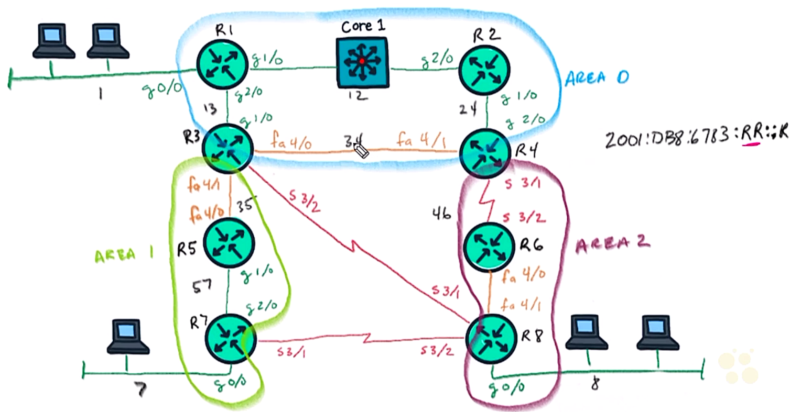

# 28. Troubleshoot OSPF Authentication for IPv6

Trainer: Keith Barker


## Intro to IPv6 OSPF Authentication and Troubleshooting

- Learning goals
  - IPv6 OSPF authentication
  - config and verify IPv6 OSPF authentication


## IPv6 OSPF Authentication Overview

- IPv6 OSPF authentication fundamentals
  - topology
    - IP addr space: 2001:DB8:6783:RR::R
    - `RR`: network segment btw two routers, e.g., link btw R3 & R4 -> RR = 34
    - `R`: router number, e.g., R1 -> R = 1
  - authentication options
    - no authentication
    - IPsec
  - Security Parameter Index (SPI)
    - used for IPsec
    - an identification tag added to the header while using IPsec
    - a 32-bit random number generated by the sender to identify SA to the recipient
  - area and IPsec
    - config IPsec for OSPFv3 authentication
    - able to specify hashing, key, etc.
    - automatically using the SPI on interfaces of the area
    - traffic btw routers encrypted
    - no need to manually specify keys btw interfaces
  - interface and IPsec
    - able to config IPsec on interface level
    - interface level authentication taking precedence 

  <figure style="margin: 0.5em; display: flex; justify-content: center; align-items: center;">
    
  </figure>


- Config OSPFv3 authentication w/ IPsec
  - [How to Configure IPv6 Routing: OSPFv3 Authentication Support with IPsec Configuring IPsec on OSPFv3](https://bit.ly/3r9b9Bo) in [IP Routing: OSPF Configuration Guide](https://bit.ly/3t8n5Ww)
  - config in area
    - syntax: `area <area-id> authentication ipsec spi <spi> <authentication-algorithm> [key-encryption-type] key`
    - example: `area 1 authentication ipsec spi 678 md5 1234567890ABCDEF1234567890ABCDEF`
  - config in interface - two options (depending on version of sw)
    - syntax 1: `ospfv3 authentication {ipsec spi} {md5 | sha1}{ key-encryption-type key} | null`
    - syntax 2: `ipv6 ospf authentication {null | ipsec spi spi authentication-algorithm [key-encryption-type] [key]}`
    - example for syntax 1: `Device(config-if)# ospfv3 authentication md5 0 27576134094768132473302031209727`
    - example for syntax 2: `Device(config-if)# ipv6 ospf authentication ipsec spi 500 md5 1234567890abcdef1234567890abcdef`


- Demo: config OSPFv3 authentication on Area 0

  ```text
  ! config R1 w/ area 0
  R1# show ipv6 ospf
  Routing process "ospfv3 1" with ID 1.1.1.
  <...truncated...>
    Area BACKBONE(0)
      Number of interfaces in this area is 3
      SPF algorithm executed 7 times
      Number of LSA 25. Checksum sum 0x0A8889
      Number of DCbitless LSA 0
      Number of indication LSA 0
      Number of DoNotAge LSA 0
      Flood list length 0

  R1# conf t
  R1(config)# ipv6 router ospf 1
  R1(config-rtr)# area 1 authentication ipsec spi 1000 sha1 0 
    1234567890123456789012345678901234567890
  R1(config-rtr)# end

  ! config R2 w/ area 0
  R2# conf t
  R2(config)# ipv6 router ospf 1
  R2(config-rtr)# area 1 authentication ipsec spi 1000 sha1 0 
    1234567890123456789012345678901234567890
  R2(config-rtr)# end

  R2# show ipv6 ospf int g2/0
  GigabitEThernet2/0 is up, line protocol is up
    Link Local Address FE80::C802:17FF:FED4:38, Interface ID 5
    Area 0 Process ID 1, Instance ISD 0, Router ID: 2.2.2.2
    Network Type BROADCAST, Cost: 1
    SHA-1 authentication (Area) SPI 1000, secure socket UP (errors: 0)
    <...truncated...>

  ! config on R3 & R4
  R3/4# conf t
  R3/4(config)# ipv6 router ospf 1
  R3/4(config-rtr)# area 1 authentication ipsec spi 1000 sha1 0 
    1234567890123456789012345678901234567890
  R3/4(config-rtr)# end 

  R4# show ipv6 ospf int brief
  Interface   PID Area  Intf ID   Cost  State Nbrs F/C
  Fa4/1       1   0     11        10    BDR   1/1
  Gi2/0       1   0     5         1     DR    1/1
  Gi0/0       1   0     3         1     DR    0/0
  Se3/1       1   2     7         647   P2P   1/1

  R2# show crypto engine connections active
  Crypto Engine Connections
       ID  Type    Algorithm      Encrypt  Decrypt LastSeqN IP-Address
        1  IPsec   SHA                  0       62        0 FE02::5
        2  IPsec   SHA                 56        0        0 FE80::C802:17FF:FED4:38
        3  IPsec   SHA                  0       41        0 FE02::5
        4  IPsec   SHA                 64        0        0 FE80::C802:17FF:FED4:1C

  R2# show crypto ipsec sa 
  interface: GigabitEthernet2/0
      Crypto map tag: TGM-Map, local addr FE80::C802:17FF:FED4:38

    protected vrf: (none)
    local Ident  (addr/mask/port/prot): (1FE80::/10/89/0)
    remote Ident (addr/mask/port/prot): (::/0/89/0)
    current-peer FF20::5 port 500
      PERMIT, flags={origin_is_acl, }
    #pkts encaps: 63, #pkts encrypt: 63, #pkts digest: 63
    #pkts decaps:690, #pkts decrypt: 69, #pkts verify69 0
    #pkts compressed: 0, #pkts decompressed: 0
    #pkts not compressed: 0, #pkts compr. failed: 0
    #pkts not decompressed: 0, #pkts decompress failed: 0
    #pkts errors 0, #recv errors 0

     local crypto endpt.: FE80::C802:17FF:FED4:38, 
     remote crypto endpt.: FE20::5
     path mtu 1500, ipv6 mtu 1500, ip mtu idb GigabitEthernet2/0
     current outbound spi: 0x3E8(1000)

  R2# show crypto ipsec policy
  Crypto IPsec client security policy data

  Policy name:      OSPFv3-1000
  Policy refcount:  2
  Inbound  AH SPI:  1000 (0x3E8)
  Outbound AH SPI:  1000 (0x3E8)
  Inbound  AH Key:  1234567890123456789012345678901234567890
  Outbound AH Key:  1234567890123456789012345678901234567890
  Transform set:    ah-sha-hmac
  ```


- Demo: config OSPFv3 w/o authentication btw R1 & R3

  ```text
  ! config g2/0 on R1
  R1# conf t
  R1(config)# int g2/0
  R1(condig-if)# ipv6 ospf authentication null
  R1(condig-if)# end

  ! config g1/0 on R3
  R3# conf t
  R3(config)# int g1/0
  R3(condig-if)# ipv6 ospf authentication null
  R3(condig-if)# end
  %OSPFv3-5-ADJCHG: Process 1, Nbr 1.1.1.1 on GigabitEThernet1/0 from LOADING to FILL, Loading Done

  R3# show ipv6 ospf int g1/0
  GigabitEThernet1/0 is up, line protocol is up
    <...truncated...>
    authentication NULL
    <...truncated...>
  ```


## Implement and Verify Authentication

- Plan for OSPFv3 authentication
  - Area 1: area level authentication
  - Area 0 w/o OSPFv3 authentication
  - link btw R2 and R4 w/ interface level authentication


- Demo: config OSPFv3 area authentication

  ```text
  R3/5/7# conf t
  R3/5/7(config)# ipv6 router ospf 1
  R3/5/7(config-rtr)# area 1 authentication ipsec spi 1000 sha1 
    0123456789012345678901234567890123456789
  R3/5/7(config-rtr)# end

  R7# show crypto ipsec policy
  Crypto IPsec client security policy data

  Policy name:      OSPFv3-1000
  Policy refcount:  2
  Inbound  AH SPI:  1000 (0x3E8)
  Outbound AH SPI:  1000 (0x3E8)
  Inbound  AH Key:  0123456789012345678901234567890123456789
  Outbound AH Key:  0123456789012345678901234567890123456789
  Transform set:    ah-sha-hmac
  ```


- Demo: config OSPFv3 interface authentication 

  ```text
  R2# conf t
  R2# show cdp neighbors
  Device ID   Local Interface   Holdtime  Capability  Platform  Port ID
  Core1       Gig 2/0           150            R S I  ISOv      Gig 2/0
  R4          Gig 1/0           143              R    7206VXR   Gig 2/0

  R2(config)# int g1/0
  R2(config-if)# ipv6 ospf authentication ipsec spi 1000 sha1 
    0123456789012345678901234567890123456789
  R2(config-if)# end

  R4(config)# int g2/0
  R4(config-if)# ipv6 ospf authentication ipsec spi 1000 sha1 
    0123456789012345678901234567890123456789
  R4(config-if)# end

  R4# show crypto engine connections active
  Crypto Engine Connections
       ID  Type    Algorithm      Encrypt  Decrypt LastSeqN IP-Address
        1  IPsec   SHA                  0        8        0 FE02::5
        2  IPsec   SHA                  8        0        0 FE80::C804:18FF:FE50:38
  ```


## Troubleshooting OSPF Authentication Lab 01

- Demo: troubleshooting OSPFv3 authentication
  - topology:
    - PC1 on the subnet connected to g0/0 on R1
    - PC8 on the subnet connected to g0/0 on R8
  - tasks:
    - PC1 able to reach R8
    - best path: PC1 -> R1 -> Core1 -> R2 -> R4 -> R6 -> R8 -> PC8

  ```text
  PC8> show ipv6
  NAME              : PC-8[1]
  LINK-LOCAL SCOPE  : fe80::250:79ff:fe66:6807/64
  GLOBAL SCOPE      : 2001:db8:6783:8:2050:79ff:fe66:6807/64
  ROUTER LINK-LAYER : ca:08:12:c0:00:08
  MAC               : 00:50:79:66:68:02
  LPORT             : 10118
  RHOST:PORT        : 1.0.0.1:10119
  MTU               : 1500

  PC1> show ipv6
  NAME              : PC-1[1]
  LINK-LOCAL SCOPE  : fe80::250:79ff:fe66:6800/64
  GLOBAL SCOPE      : 2001:db8:6783:1:2050:79ff:fe66:6800/64
  ROUTER LINK-LAYER : ca:08:12:10:00:08
  <..truncated...>

  PC1> ping 2001:db8:6783:8:2050:79ff:fe66:6807
  *2001:db8:6783:1::1 icmp6 seq=1 ttl=64 ... (ICMP type:1, code:6, Reject route to destination)
  ! 2001:db8:6783:1::1 -> R1

  R1# show ipv6 route
  IPv6 Routing Table - 9 entries
  Codes: C - Connected, L - Local, S - Static, R - RIP, B - BGP
         I1 - ISIS L1, I2 - ISIS L2, IA - IIS interarea
  C   2001:DB8:6783:1::1/64 [0/0]
       via GigabitEthernet0/0, directly connected
  L   2201:DB8:6783:1::1/128, [0/0]
       via GigabitEthernet0/0, receive
  O   2201:DB8:6783:4::/64 [110/12]
       via FE80::C803:18FF:FE64:1C, GigabitEthernet2/0
  OI  2201:DB8:6783:7::/64 [110/13]
       via FE80::C803:18FF:FE64:1C, GigabitEthernet2/0
  OI  2201:DB8:6783:8::/64 [110/669]
       via FE80::C803:18FF:FE64:1C, GigabitEthernet2/0
  S   2201:DB8:6783:8::/65 [1/0]
       via Null0, directly connected
  <..truncated...>
  ! static route takes precedence

  R1# conf t
  R1(config)# no ipv6 route 2201:DB8:6783:8::/65
  R1(config)# end

  R1# ping 2001:db8:6783:8:2050:79ff:fe66:6807
  2001:db8:6783:8:2050:79ff:fe66:6807 icmp6, seq=1 ttl=54 time=188.647 ms
  <...truncated...>

  ! verify optimal route
  PC1> trace 2001:db8:6783:8:2050:79ff:fe66:6807
   1  2001:db8:6783:1::1 ...
   2  2001:db8:6783:13::3 ...
   3  2001:db8:6783:34::4 ...
   4  2001:db8:6783:46::6 ...
   5  2001:db8:6783:68::8 ...
   6  2001:db8:6783:8:2050:79ff:fe66:6807 ...
  ! PC1 -> R1 -> R3 -> R4 -> R6 -> R8 -> PC8 (not the best route)

  R1# show ipv6 ospf
  Routing process "ospfv3 1" with ID 1.1.1.
  <...truncated...>
  Reference bandwidth unit is 1000 mbps
  <...truncated...>

  R1# show ipv6 ospf neighbor
  Neighbor ID     Pri    State      Dead Time    Interface ID     Interface
  3.3.3.3           1    FULL/DR    00:00:32     4                GigabitEthernet2/0
  ! not forming neighborship w/ R2

  R1# show ipv6 ospf int brief
  Interface   PID Area  Intf ID   Cost  State Nbrs F/C
  Gi2/0       1   0     5         1     DR    1/1
  Gi1/0       1   0     4         1     DR    0/0
  Gi0/0       1   0     3         1     DR    0/0
  ! Gi1/0 Nbr F/C = 0/0 -> no full adjacency

  ! verify R2 interface enable
  R2# show ipv6 int brief
  Interface   PID Area  Intf ID   Cost  State Nbrs F/C
  Gi2/0       1   0     5         1     DR    0/0
  Gi1/0       1   0     4         1     BDR   1/1

  R2# debug ipv6 ospf adj
  R2# show ipv6 ospf int g2/0
  GigabitEThernet2/0 is up, line protocol is up
    <...truncated...>
    MD5 authentication SPI 256, secure socket UP (errors: 0)
    <...truncated...>

  R1# show ipv6 ospf int g2/0
  GigabitEThernet1/0 is up, line protocol is up
    <...truncated...>
    Area 0, Process ID 1, Instance ID 0, Router ID 1.1.1.1
    <...truncated...>

  R1# show ipv6 ospf
  Routing process "ospfv3 1" with ID 1.1.1.
  <...truncated...>
    Area BACKBONE(0)
      Number of interfaces in this area is 3
      SPF algorithm executed 7 times
      Number of LSA 25. Checksum sum 0x0A8889
      Number of DCbitless LSA 0
      Number of indication LSA 0
      Number of DoNotAge LSA 0
      Flood list length 0
  ! no authentication set on Area 0

  ! remove authentication on R2 or add MD5 on R1
  R2# show crypto ipsec policy
  Crypto IPsec client security policy data

  Policy name:      OSPFv3-256
  Policy refcount:  1
  Inbound  AH SPI:  256 (0x100)
  Outbound AH SPI:  256 (0x100)
  Inbound  AH Key:  12345678912345678912369852152AB
  Outbound AH Key:  12345678912345678912369852152AB
  Transform set:    ah-md5-hmac

  R2# conf t
  R2(config)# int g2/0
  R2(config-if)# no ipv6 ospf authentication ipsec spi 256
  R2(config-if)# end

  R2# undebug all
  R2# show ipv6 ospf neighbor
  Neighbor ID     Pri    State      Dead Time    Interface ID     Interface
  1.1.1.1           1    FULL/BDR   00:00:32     4                GigabitEthernet2/0
  4.4.4.4           1    FULL/BDR   00:00:33     5                GigabitEthernet1/0

  ! verify the route
  PC1> trace 2001:db8:6783:8:2050:79ff:fe66:6807
   1  2001:db8:6783:1::1 ...
   2  2001:db8:6783:12::2 ...
   3  2001:db8:6783:34::4 ...
   4  2001:db8:6783:46::6 ...
   5  2001:db8:6783:68::8 ...
   6  2001:db8:6783:8:2050:79ff:fe66:6807 ...
  ! PC1 -> R1 -> R2 -> R4 -> R6 -> R8 -> PC8
  ```


## Troubleshooting OSPF Authentication Lab 02


## Virtual lab: Troubleshoot OSPF Authentication for IPv6


