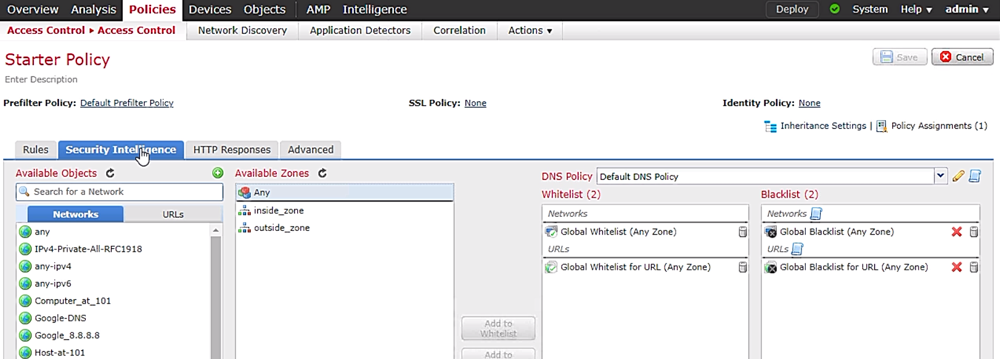

# 29. Firepower Access Control Policies

Trainer: Keith Barker

## Access Control Policy Overview

- Access control policy definition
  - high level requirements specifying how access is managed and who may access information under what circumstances
  - enforced through a mechanism that translates a user's access request
  - NIST, [Access Control Policy and Implementation Guides](https://csrc.nist.gov/Projects/Access-Control-Policy-and-Implementation-Guides)
  - [access control policy](https://www.luc.edu/its/aboutits/itspoliciesguidelines/access_control_policy.shtml) of Loyola University Chicago

- Typical procedure to check new session of ingress traffic (in sequence)
  - 1\. pre-filter
  - 2\. L3/L4 ACL
  - 3\. security intelligence (SI) based on IP address
  - 4\. SSL policy (decryption)
  - 5\. SI based on URL/DNS
  - 6\. App (L7) filtering
  - 7\. file/malware analysis and IPS (access control policy applied)
  - 8\. forward traffic

- Demo: access control policy of FirePower
  - FirePower > tabs - Overview, Analysis, Policies, Devices, Objects, AMP, Intelligence
  - Policies > subtabs - Access Control , network Discovery, Application Detectors, Correlation, Actions
  - Access Control subtab > Starter Policy: tabs - Rules, Security Intelligence, HTTP Response, Advanced
  - Starter Policy > Rules
    - top-down fashion
    - Pre-filter Policy = Default Prefilter Policy; SSL Policy = None; Identity Policy = None
    - Deafult Action: Access Control: Block All | Access Control: Trust All Traffic | Network Discovery Only (default) | Instrusion Prevention: Maximum Detection | Instrusion Prevention: Connectivity Over Security | Instrusion Prevention: Balanced Security and Connectivity | Instrusion Prevention: Security Over Connectivity
    - Loggin icon: disabled
    - icons after fields - shield icon = intrusion policy; files icon = file policy
  - Starter Policy > Security Intelligence
    - sections - Available Objects (Networks, URLs), Available Zone, DNS Policy, Whitelist, Blacklist

  

    
    
  

## Access Control Policy Rule Actions Concepts

## Access Control Policy Rule Actions Demonstration

## URL Filtering

## Malware and File Inspections

## SSL/TLS Decryption

## IPS Inspection

