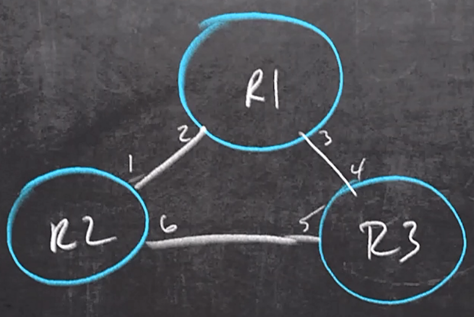

# 32. Troubleshoot Network Problems using Logging

Trainer: Keith Barker


## Introduction to Troubleshooting using Logging

- Learning goal
  - logging
  - logging config
  - debugging
  - troubleshoot w/ logging


## Logging Overview

- Logging overview
  - display types
    - console: line console 0
    - monitor:
      - terminal lines, `line vty 0-15`
      - displaying log message at terminal lines, `terminal monitor`
    - buffer: storing on buffer
  - logging severity level:
    - 0: Emergencies - device unusable
    - 1: alerts - immediate action required
    - 2: critical - conditional critical
    - 3: error - error condition
    - 4: warnings - warning condition
    - 5: notifications - normal but important event
    - 6: informational - informational messages
    - 7: debugging - debug message
  - verify system logging settings
    
    ```text
    R1# show logging
    Syslog logging: enabled (0 messages dropped, 0 messages rate-limited,
                    0 flushes, 0 overruns, xml disabled, filtering disabled)
    No Active Message Discriminator.
    No Inactive Message Discriminator.
        Console logging: level debugging, 70 messages logged, xml disabled,
                        filtering disabled
        Monitor logging: level debugging, 0 messages logged, xml disabled,
                        filtering disabled
        Buffer logging:  level debugging, 40 messages logged, xml disabled,
                        filtering disabled
        Logging Exception size (8192 bytes)
        Count and timestamp logging messages: disabled
        Persistent logging: disabled
    No active filter modules.
        Trap logging: level informational, 74 message lines logged
            Logging Source-Interface:       VRF Name: 
    ```

  - config log messsage
    - sequence of log messages from different devices able to help debug
    - adding timestamp, date stamp, msec, etc.

    ```text
    R1# config t
    R1(config)# exit
    R1#
    %SYS-5-CONFIG I: Configured from console by console
    ```


## Configuring Logging

- Demo: modify log and debug message
  - `uptime`: how long since device rebooted
  - `localtime` offset w/ UTC and correct NTP setting

  ```text
  R1# show logging
  <...truncated...>
        Console logging: level debugging, 70 messages logged, xml disabled,
                        filtering disabled
        Monitor logging: level debugging, 0 messages logged, xml disabled,
                        filtering disabled
        Buffer logging:  level debugging, 40 messages logged, xml disabled,
                        filtering disabled
  <...truncated>

  R1# conf t
  R1(config)# service timestamps log datetime localtime show-timezone year msec
  R1(config)# service sequence-numbers
  R1(config)# end
  R1#
  000042: *May 27 2020 21:47:08.683 UTC: %SYS-5-CONFIG_I: Configured from colsole by console

  R1# conf t
  R1(config)# service timestamps debug datetime localtime show-timezone year msec
  R1(config)# end
  ```

- Demo: config severity level w/ monitor

  ```text
  R1# conf t
  R1(config)# logging monitor 3
  R1(config)# end
  
  R1# show logging
  <...truncated...>
        Monitor logging: level errors, 0 messages logged, xml disabled,
                        filtering disabled
  <...truncated>

  ! verify settings
  R1# show ip int brief
  Interface           IP-Address  OK? Method  Status                Protocol
  <...truncated...>
  Loopback1           1.1.1.1     YES NVRAM   up                    up
  <...truncated>

  R1# conf t
  R1(config)# line vty 0 4
  R1(config-line)# no login
  R1(config-line)# privilege level 15
  R1(config-line)# end

  ! telnet from R2  to R1
  R2# telnet 1.1.1.1
  Trying 1.1.1.1 ... Open

  R1# show users
      Line      User  Host(s)   Idle        Location 
     0 con 0          idle      00:00:14
  *  1 vty 0          idle      00:00:00  172.16.12.2

  R1# who
      Line      User  Host(s)   Idle        Location 
     0 con 0          idle      00:00:16
  *  2 vty 0          idle      00:00:00  172.16.12.2

  R1# debug ip packet

  ! return to R1 console
  R1# undebug all
  R1# conf t
  R1(config)# do show logging
  <...truncated...>
        Console logging: level debugging, 160 messages logged, xml disabled,
                        filtering disabled
        Monitor logging: level debugging, 0 messages logged, xml disabled,
                        filtering disabled
        Buffer logging:  level debugging, 162 messages logged, xml disabled,
                        filtering disabled
  <...truncated>

  R1(config)# logging monitor 7
  R1(config)# end

  ! return to R2 console
  R1# debug ip packet
  ! none debug message shown

  ! return back to R1 console
  R1#
  ! many debug messages shown

  ! return back to R2 console
  R1# terminal monitor
  ! debug messages shown 

  R1# terminal no monitor
  R1# exit
  R2#

  ! return back to R1 sonsole
  ! config SNMP trap severity level
  R1# conf t
  R1(config)# logging host 1.2.3.4
  R1(config)# logging trap 7
  R1(config)# end
  R1# show logging
  <...truncated...>
        Trap logging: level debugging, 52 message lines logged
            Logging to 1.2.3.4 (udp port 514, audit disabled
            link up)
            2 message lines logged,
            0 message lines rate-limited,
            0 message lines dropped-by-MD,
            xml disabled, sequence number disabled

  ! disable monitor logging
  R1# conf t
  R1(config)# no logging monitor
  R1(config)# end

  R1# show logging
  <...truncated...>
        Console logging: level debugging, 1194 messages logged, xml disabled,
                        filtering disabled
        Monitor logging: disabled
        Buffer logging:  level debugging, 1197 messages logged, xml disabled,
                        filtering disabled
  <...truncated>
  ```


## Conditional Debugging

- Conditional debug overview
  - able to apply to specific interface(s)
  - able to apply to specific IP address space
  - able to aggregate several conditional debugs into a group
  - issue:
    - not applied to all devices
    - not all devices accepting all conditionals for debugging
  - solution: test every single conditional debug before using it on a certain device


- Demo: config conditional debugging
  - topology
    - severity levles: buffer (7), conscole (6)
    - debug on specific topics, e.g., OSPF

  <figure style="margin: 0.5em; display: flex; justify-content: center; align-items: center;">
    
  </figure>

  - task:
    - debug Hello only on intf g0/6 on R2
    - no debug info on intf g0/1 on R2
  - verify R2 settings
    
    ```text
    R2# show ip protocol
    *** IP Routing is NSF aware ***
    Routing Protocol is "ospf 1"
      Outgoing update filter list for all interfaces is not set
      Incoming update filter list for all interfaces is not set
      Router ID 2.2.2.2
      Number of areas in this router is 1. 1 normal 0 stub 0 nssa
      Maximum path: 4
      Routing for Networks:
        0.0.0.0 255.255.255.255 area 0
      Passive Interface(s):
        Ethernet0/0
        Serial3/0
        <...truncated...>
      Routing Information Source:
        Gateway     Distance    Last Update
        11.11.11         110    00:11:21
        172.16.23.3      110    00:12:59
      Distance: (default is 110)
    Routing Protocol is "bgp 100"
      Outgoing update filter list for all interfaces is not set
      Incoming update filter list for all interfaces is not set
      Router reflector for address family IPv4 Unicast, 1 client
      IGP synchronization is disabled
      Automatic route summarization is disabled
      Neighbor(s):
        Address       FiltIn FiltOut DistIn DistOut Weight RouteMap
        100.100.24.4
        172.16.12.1
        172.16.23.3
        172.16.211.11
      Maximum path: 1
      Routing Information Sources
        Gateway       Distance    Last Update
        100.100.24.4        20    00:10:19
        172.16.12.1        200    00:12:29
      Distance: external 20 internal 200 local 200

    R2# show ip ospf neighbor
    Neighbor ID     Pri State     Dead Time   Address         Interface
    11.11.11.11       1   FULL/BDR  00:00:35  172.16.211.11   GigabitEthernet2/0
    172.16.23.3       1   FULL/DR   00:00:32  172.16.23.3     GigabitEthernet1/0
    1.1.1.4           1   FULL/BDR  00:00:31  172.16.12.1     GigabitEthernet0/0

    R2# debug ip osph hello
    OSPF-1 HELLO Gi2/0: Send hello to 224.0.0.5 area 0 from 172.16.211.2
    OSPF-1 HELLO Gi1/0: Send hello to 224.0.0.5 area 0 from 172.16.23.2
    OSPF-1 HELLO Gi0/0: Send hello to 224.0.0.5 area 0 from 172.16.12.2
    OSPF-1 HELLO Gi1/0: Rcv hello to 172.16.23.3 area 0 from 172.16.23.3
    OSPF-1 HELLO Gi0/0: Rcv hello to 172.16.12.1 area 0 from 172.16.12.1
    OSPF-1 HELLO Gi2/0: Rcv hello to 11.11.11.11 area 0 from 172.16.211.11

    R2# show logging
    <...truncated...>
          Console logging: level debugging, 38 messages logged, xml disabled,
                          filtering disabled
          Monitor logging: level debugging, 0 messages logged, xml disabled,
                          filtering disabled
          Buffer logging:  level debugging, 42 messages logged, xml disabled,
                          filtering disabled
    <...truncated>

    R2# show users
        Line      User  Host(s)   Idle        Location 
    *  0 con 0          idle      00:00:00

    R2# undebug all
    ```

  - config conditional debug

    ```text
    ! config debug 
    R2# debug condition interface g0/0
    R2# debug condition interface g1/0
    R2# show debug condition
    Condition 1: interface Gi0/0 (1 flags triggered)
            Flags: Gi0/0
    Condition 2: interface Gi1/0 (1 flags triggered)
            Flags: Gi1/0
    
    RT2# debug ip ospf hello
    OSPF-1 HELLO Gi1/0: Send hello to 224.0.0.5 area 0 from 172.16.23.2
    OSPF-1 HELLO Gi0/0: Send hello to 224.0.0.5 area 0 from 172.16.12.2
    OSPF-1 HELLO Gi1/0: Rcv hello to 172.16.23.3 area 0 from 172.16.23.3
    OSPF-1 HELLO Gi0/0: Rcv hello to 172.16.12.1 area 0 from 172.16.12.1

    R2# no debug condition 2
    OSPF-1 HELLO Gi0/0: Send hello to 224.0.0.5 area 0 from 172.16.12.2
    OSPF-1 HELLO Gi0/0: Rcv hello to 172.16.12.1 area 0 from 172.16.12.1

    R2# undebug all
    R2# show debug condition
    Condition 1: interface Gi0/0 (1 flags triggered)
            Flags: Gi0/0

    R2# no debug condition 1
    ! warning message for the last debug condition
    Proceed with removal? [yes/no]: yes
    ```


## Troubleshoot Network Problems using Logging

- Virtual Lab: practice above demos


