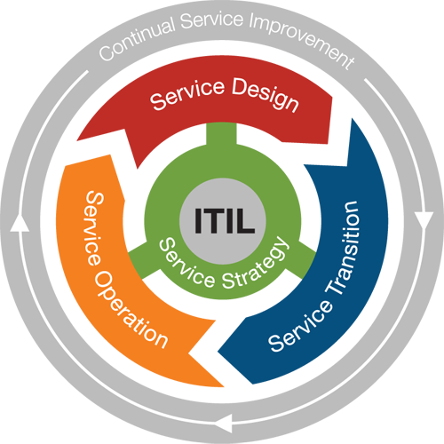
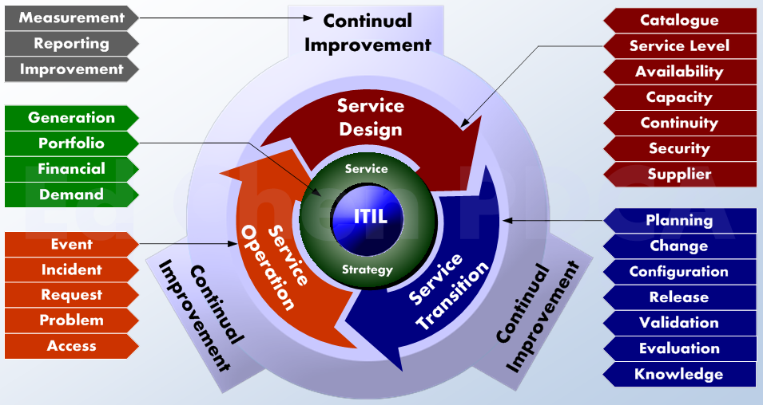

# 34. Planning for Software Development Methodologies

Trainer: Bart Castle

## Software and App Development Methodologies

- Software development methodologies
  - waterfall
  - agile
  - CI/CD
  - DevOps
  - DevSecOps

## Plan for Waterfall Method

- Software development lifecycle (SDLC)
  - planning
  - define requirements
  - design & prototyping
  - software development
  - testing
  - deployment
  - operations & maintenance

- Waterfall method overview
  - linear approach: move to next step until the current one completed
  - any change in the cycle $\to$ back to the requirements
  - five basic steps
    - requirements
      - stakeholder createing demand
      - demand translated into requirements
      - deliverables:
        - document to capture requirements
        - context: use cases, etc. to linerate the requirements
    - design
      - creating specifications according requirements
      - aspects of specs
        - physical - components, e.g., CPU, memory, network, and storage
        - logical - relations btw components and how to put them together
    - implementation
      - coding according specs
      - unit test
    - verification
      - testing: out of development environment
      - sign off to accept for release
    - maintenance
      - operating
      - measured w/ SLAs or metrics in requirements
  - disadvantages
    - ridgid: any change back to the begining of the procedure
    - long development time

## Plan for Lean and Agile Methods

- ITIL Services Lifecycle
  - Service Strategy
  - Service Design
  - Service Transition
  - Service Operation
  - Continuous Service Improvement

  

    &nbsp;&nbsp;
    
  

- Agile/Lean method
  - dynamic approach to adopt changes
  - ITIL: a service management framework
    - small changes
    - feed feedback
  - waterfall still valid but embedded and iterated
  - principles
    - individual & interactions over process and tools
    - working software over comprehensive docs
    - responding to change over following a plan
    - customer collaboration over contract negotiation
  - feedback from customer resulting in software changes

## Plan for Kanban and Scrum Teams

## Continuous Integration, Deployment, and Delivery

## Understand CICD Pipelines in Action

## Plan for DevOps

## Plan for DevSecOps

