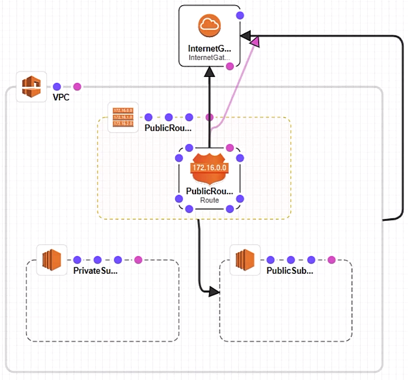

# 36. Planning for and Securing Cloud Infrastructure-as-a-Service

Trainer: Bart Castle

## Planning for Cloud Infrastructure Security

- IaaS security
  - accessing providers
  - network isolation
  - security appliances
  - hardening VMs
  - infrastructure as a code
  - Cisco Stealthwatch
  - zero-trust basics
  - token authentication demo

## Assessing Cloud Service Providers

- Cloud service provider assessment
  - CSA, [Security Guidance for Critical Areas of Focus in Cloud Computing v4.0](https://cloudsecurityalliance.org/download/artifacts/security-guidance-v4/), 2017
  - [Consensus Assessments Initiative Questionnaire (CAIQ)](https://cloudsecurityalliance.org/group/consensus-assessments/#_overview)

## Isolating and Segmenting Cloud Networks

- Isolating cloud networks
  - IP
  - subnets
  - path/routing
  - gateways

- Demo: isolated subnets in AWS
  - VPC: virtual private cloud
    - a logical router
    - a container
  - two different subnets: private subnet, public subnet
  - a routing table: Public Routing
  - internet gateway: WAN uplink
  - block arrow line:
    - relationship of two blocks
    - source block availabele to destination block
    - Public routing available to Public subnet
  - private subnet no path to the Internet

  <figure style="margin: 0.5em; display: flex; justify-content: center; align-items: center;">
    
  </figure>

- Framework of cloud virtual network
  - account
  - container - virtual machine
  - subnets
  - VPN to other container

## Leveraging Virtual Appliances

- Virtual appliances
  - cloud service provider providing capability to embedded virtual appliances in the virtual network
  - Cisco providing different virtual appliance to plug into the cloud virtual network 

## Hardening, Protecting, and Maintaining Cloud VMs

- Cloud VM security
  - operating system disk image
    - AWS: amazon machine image (AMI)
    - Azure: image
  - virtual machine
    - naming convention
      - AWS: instance
      - Azure: VM
    - CPU, RAM, storage, network
    - cost
  - hardening
    - snapshot of VM image, data, etc.
      - data snapshot: new volume
      - os snapshot: new image
    - patch management
      - tools: yum, apt, or wsus (Windows Update Service)
      - agent: out of the OS
      - remote server (e.g., Chef, Ansible) instructing agent to install or run scripts
      - cloud-init
  - Cisco solution
    - Stealthwatch
    - zero-trust

## Planning for Infrastructure-as-Code

- Infrastructure as a Code (IaaC)
  - template: DSL (domain specific language) document
  - specifying what resources required and actions to react the state
  - script: JSON, YAML
  - Azure: ARM (Azure Resource Template)
  - AWS: CloudFormation
  - Demo: Azure template

- State management
  - resource in a known good state
  - desire state: SSH 4.x.x.x
  - system in other state: HTTP 0.0.0.0/0
  - rule decided what action to take

## Monitor and Analyze with Stealthwatch

## Understand the Tenets of Zero Trust Security

## Zero Trust Token Auth Demo

