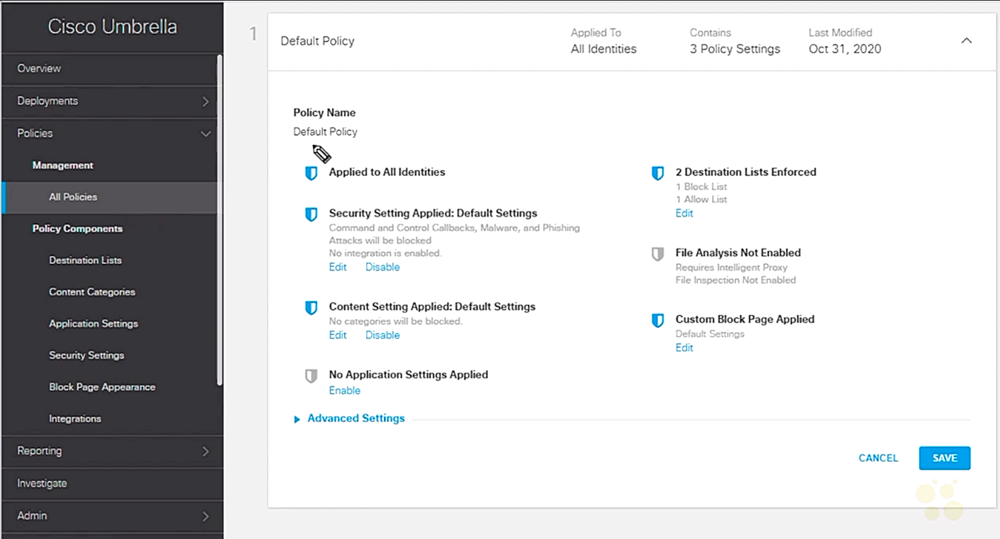

# 41. Cisco Umbrella

Trainer: Keith Barker


## Introduction to Cisco Umbrella

- Learning goals
  - Cisco Umbrella
  - policy
  - identity
  - digital certificates
  - VA


## Cisco Umbrella Overview

- Cisco Umbrella overview
  - security issues of DNS
    - bad/incorrect info
    - malicious web site
    - tunneling by attackers
  - Umbrella
    - Talos providing intelligence
    - a could solution
    - DNS as part of Umbrella service
    - DNS requests forwarding to Umbrella


## Umbrella Components

- Umbrella components
  - OpenDNS public DNS server: 208.67.222.222 & 208.67.220.220
  - Umbrella DNS service (licensed): filtering 17 categories of web sites
  - local DNS server
    - virtual appliance installed in DHCP server
    - internet DNS forwards to local DNS server
    - external DNS forwards to public DNS server
  - remove access
    - Umbrella client on PC
    - redirect to OpenDNS
    - enforce filtering

- Demo: Umbrella DNS service
  - verify PC

    ```text
    PC> ipconfig -all
    Windows Ip Configuration:
      <...truncated...>
    Ethernet adapter EEthernet0:
      <...truncated...>
      IPv4 Address      : 192.168.1.116(preferred)
      Subnet Mask       : 255.255.255.0
      Default Gateway   : 192.168.1.1
      DNS Servers       : 8.8.8.8
      <...truncated...>
    ```

  - verify connectivity w/ web browser
    - open 'www,google.com' -> OK
    - open 'cbtnuggets.com' -> OK
    - open 'internetbadguys.com' -> OK
  - config DNS server to OpenDNS
    - Control Panel > Network and Internet > Network and Sharing Center > Change adapter settings
    - Ethernet0 > right click on icon > Properties
    - Ethernet-0 Properties > Internet Protocol Version 4(TCP/IPv4) > Properties
    - Use the forwarding DNS server address: Preferred DNS server = 208.67.222.222, 208.67.220.220
  - verify w/ 'internetbadbuys.com' -> Blocked
  - open 'welcome.umbrella.com' -> indicating Umbrella service used


## Policy Overview

- Policy overview
  - analogy: shopping cart w/ many different items
  - possible components
    - destinations
    - content categories
    - apps
    - TLS decryption (optional)
    - security settings: malware sites
    - feedback (block page)
    - 3rd party features

  <figure style="margin: 0.5em; display: flex; justify-content: center; align-items: center;">
    
  </figure>


## Policy Components

- Demo: create customized policy components on Umbrella
  - log on Umbrella
  - left panel folders - Overview, Deployment, Policies, Reporting, Investigate, Admin
  - Policy folder > Management > All Policies
  - Default Policy: Policy Name = Default Policy, Applied to All Identities, 2 Destination Listed Enforces, Security Setting Applied: Default Settting, Content Setting Applied: Default Settings, Filer Analysis Nor Enabled, Customer Block Page Applied, No Application Setting Applied
  - Policy folder > Management > Policy Components: Destination Lists, Content Categories, Application Settings, Security Settings, Block Page Appearance, Integration
  - Policy folder > Management > Policy Components > Destination Lists > 'Add' icon on top right corner
  - New Destination List: List Name = Our Custom Destination List; Destination in this list should be = Blocked, input field = www.acme.com > 'Add' button > 'Save' button
    - Destination Lists: new entry - Our Custom Destination List, Type = Blocked, Domains = 1, IPs = 0, URLs = 0
  - Policy folder > Management > Policy Components > Content Categories > 'Add' icon
    - Add New Content Setting: Seting Name = Our Custom Content Filtering; Copy From Existing = High; Categories to Block = Alcohol, Adware, Adult Themes, Chat, ... (inherited from High and modify from the setting) > 'Save' button
  - Policy folder > Management > Policy Components > Application Settings > 'Add' icon
    - Add New Application Setting: Give Your Setting a Name = Our Custom App Setting; Application to Control = Google Drive, IDrive, InCloudDrive, ... > 'Save' button
  - Policy folder > Management > Policy Components > Security Settings > 'Default Settings' link
    - Default Settings: Setting Name = Default Settings; checked items = Malware, Command and Control Callbacks, Phising Attacks > 'Add' icon
    - Setting Name = Our Custom Security Setting; checked items = Malware, Newly Seen Domains, Command and Control Callbacks, Phising Attacks, Dynamic DNS, Potentially Harmful Domains, DNS Tunneling VPN, Cryptomining > 'Save' button
    - new entry - Our Custom Security Setting, Setting Enabled = 8, Integrations = 0
  - Policy folder > Management > Policy Components > Block Page Appearance > 'Add' icon
    - Add New Block Page Appearance: Block Page Appearance Name = Custom Block Page; Blocked erequests should be treated: The Same = On, Show a Block page with a custom message = (*)Show on a block page with the default message | (type in whatever to show on blocked page) | Redirect users to this URL = (enter a URL); Allow blocked users to contact an admin from the block page = admin@ogit.com > 'Save' button


## Policy Creation

- Demo: create a policy on Umbrella
  - aggregate policy components into a policy
  - Policies folder > Management > All Policies > 'Add' icon or modify Default Policy
  - Wizard fashion ('Previous' or 'Next' button to advance or backward)
    - What would you like to protect?: Select Identities = (empty for further assocaition)
    - What should this policy do?
      - Enforce Security at the DNS Layer = Inspect Files = Limit Content Access = Apply Destination List = On
      - Advanced Settings: Enable Intelligent Proxy = On; SAFESEARCH: Enforce SafeSearch = Off; Logging: Log All Requests = On
      - Intelligent Proxy: license required; features - SSL Decryption, IP-Layer enforcement; 
        - SSL Decryption: allowing intelligent proxy to inspect traffic over HTTPS and block custom URLS in destination lists
        - IP-Layer enforcement: gain visibility into threats that bypass DNS lookups by tunneling suspect IP connections
        - Umbrella built TLS btw client and Umbrella to inspect the traffic and another TLS btw Umbrella and destination
      - SafeSearch: queries sent to supported search engines
    - Categories to Block (associated to Security Settings): Select Setting = Our Custom Security Setting
    - Limit Content Access (Content Categories): Custom = On; Custom Setting = Our Custom Content Filtering
    - Control Applications (Application Settings): Application Settings = Our Custom App Setting
    - Apply Destination Lists (Destination Lists): All Destination Lists - Our Custom Destination List = On
    - File Analysis: File Inspection = On
    - Set Block Page Settings (Block Page Appearance): Use a Custom Appearance = Custom Block Page
    - Policy Summary: Policy Name = Our Custom Policy; Advanced Settings (check and modify if required for Intelligent Proxy) > 'Save' button
  - All Policies > 2 entries
    - Order = 1,  Policy Name = Our Custom Policy, Applyied to = 0 identities (not set yet)
    - Order = 2, Policy Name = Default Policy, Applyied to = All identities
    - execution in order (top-down fashion)


## Core Identities

- Demo: core identities on Umbrella
  - identify free and paid users
  - add identities
    - Deployments folder > Core Identities: Networks, Network devices, Roaming Computers, Mobile Devices, Chromebook Users
    - Networks: 'Add' button to add new
    - Roaming Computers: agent software installation required; 'Romaing Client' icon to download software
  - apply policy to identity
    - Policies folder > Management > All Policies > Policy Name = Our Custom Policy, Applied to = 0 identities > 'Our Custom Policy' link
    - Our Custom Policy > Policy Name = Our Custom Policy: 0 identities Affected Enable > 'Enable' link
    - What Would You like to protect?: All Identities - ..., Networks, Roaming Computers, Sites, ...; Select Identities = Roaming Computers > 'Set and Return' button
    - Our Custom Policy > 'Save' button
  - verify w/ PC: 
  
    ```text
    PC> ipconfig -flushdns
    PC> ipconfig -all
    <...truncated...>
    DNS Server        : 127.0.0.1
    <....truncated...>
    ! Umbrella client installed, DNS request handled by it
    ```

    - open browser w/ google.com -> 'Your connection is not private' w/ 'NET::ERR_CERT_AUTHORITY_INVALID'
    - icon before URL bar: 'Your connection to this site is not secure'; Certificate (invalid) > 'Certificate' link
    - Certificate: Issue by = Cisco umbrella Secondary SubCA lax-SG


## Umbrella CA Certificates

- Demo: install Umbrella certificate
  - retrieve certificate from Umbrella
    - Networks folder > Configurations > Root Certificate > Get Started > 'DOWNLOAD CERTIFICATE' button
    - Save as 'Cisco_Umbrella_Root_CA.cer'
  - install certificate on PC
    - 'Manage user certificates' or 'Manage computer certificate'
    - click on 'Cisco_Umbrella_Root_CA.cer' > Certificate > 'Install Certificate...' button
    - Welcome to the Certificate Import Wizard: Store location = Current User > 'Next' button
    - Certificate Store: Place all certificate in the following store = Trusted Root Certification Authorities > 'Ok' button > 'Next' button
    - Completing the Certificate Import Wizard: Certificate Store Selected by User > 'Finish' button > 'Ok' button
  - verify w/ browser on PC 
    - google.com, ebay.com, facebook.com -> OK, icon - Certificate (Valid)
    - liquor.com, missionliquor.com, www.acme.com -> blocked


## Reporting and Investigation

- Demo: report and investigation in Umbrella
  - verify the use of Umbrella: browser open welcome.umbrella.com & welcome.opendns.com 
  - verify the block of malicious web sites: www.internetbadguys.com, www.examplemalwaredomain.com, www.examplebotnetdomain.com, www.exampleadultsite.com, ihaveabadreputation.com
  - different paged shown representing different policy components applied
  - Investigate folder
    - Search filed = ihabebadreputation.com > 'INVESTIGATE' button > Summary: High Risk; Malware Block List; Security Indicator
    - Search filed = cbtnuggets.com > 'INVESTIGATE' button > Summary: Low Risk; Security Categories = -; Content Categories = Educational Institutions
  - Reporting folder
    - Core Reports: Security Overview, Security Activity, Activity Search, App Discovery, Threats
    - Additional Reports: Total Requests, Activity Volume, Top Destinations, Top Categories, Top Identity 
  - Admin folder > Log Management: sections - Data Store (where to store), Amazon S3


## Umbrella VA

- Umbrella and multiple internal subnets
  - two subnets in an organization
    - two IP subnets & two VLANs
    - unable to distinguish them w/ PAT
  - solution: virtual appliance
    - a server installed for all internal users
    - the server redirect request to internal or external DNS servers
    - different policies able to apply to each subnets

- Demo: install virtual appliance (VA)
  - verify topology
    - Deployment folder > Core Identities > Networks: one network w/ Name = Keith-Lab_Network
    - Deployment folder > Configurations > Domain Management: one domain w/ Domain Name = ogit.com
    - Deployment folder > Configurations > Sites and Active Directory: one site w/ Name = 192.168.1.41
  - download VA
    - Deployment folder > Configurations > Sites and Active Directory > 'Download' icon on top-right corner
    - Download Components: Active Directory Components, Virtual Appliance Components
    - 'Download' button on the appropriate selection: VMWare ESX > 'Download' button
  - install VA
    - VMWare ESXi > Host (right click - Create/Register VM) > Deploy a virtual machine from an OVF or OVA file > 'Next' button
    - Cisco Umbrella VA:
      - login w/ password = Umbrella+SerialNumber, Serial Number shown in URL
      - Name = 192.168.1.41, IP = 192.168.1.41, Local DNS = 192.168.1.100, Gateway = 192.168.1.1; Connectivity: DNS Server = Local DNS = Umbrella DNS servers = ok
  - user requests redirect to 192.168.1.41 -> redirect to local or Umbrella DNS servers
  - config PC for VA: Network Adapter Properties > Preferred DNS server = 192.168.1.41
  - verify w/ PC: open w/ google.com & liquor.co -> OK
  - verify on Umbrella Policy setting -> Identities was removed > add back
  - verify w/ PC again: open 
    - google.com -> OK
    - www.acme.com & www.liquor.com  -> blocked


## Umbrella Summary

- Summary
  - Umbrella & DNS
  - Umbrella policy
  - policy components
  - identities
  - virtual appliance


