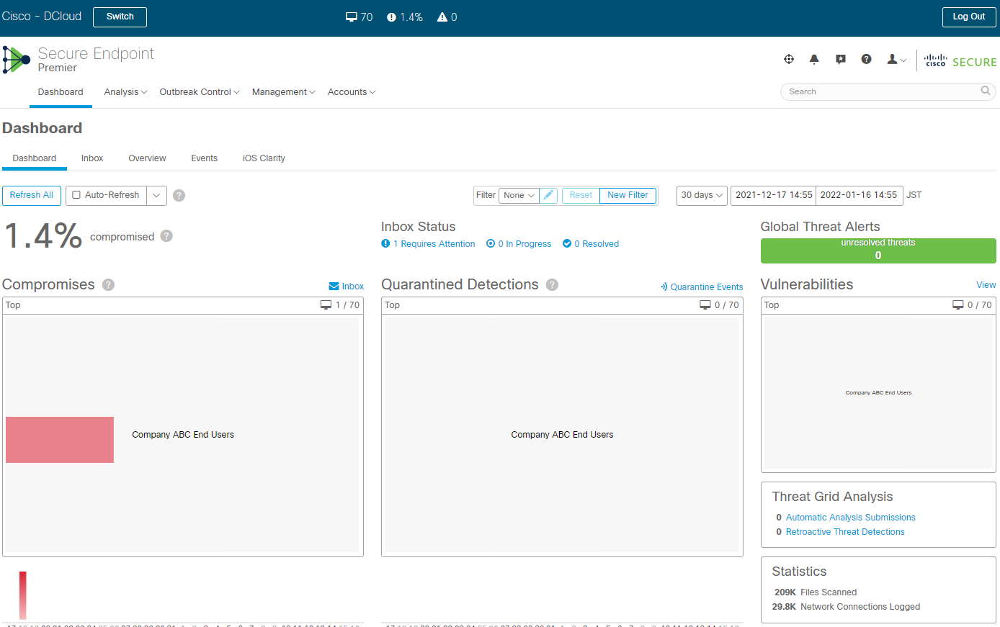

# 42. Understand and Configure AMP for Endpoints

Trainer: Knox Hutchinson

## Introducing Endpoint Security

- Learning goals
  - endpoint protection
  - advanced malware protection (AMP)
  - outbreak control
  - groups and policies

## The Types of Endpoint Protection

- Types of encpoint protection
  - endpoint prevention platforms (EPPs) 
    - stop file from entering the environment
    - anti-virus
    - anti-malware
    - action: quarantine, fix, delete
  - endpoint detection and response platforms (EDRs)
    - maintaining the security about the environment in an on-going monitoring way
    - point-in-time malicious
    - anomalous behavior
    - continuous monitoring
    - analytics ML and AI
    - centralized solution
    - focusing on protecting the endpoints
  - extended detection and response (XDR): integrating security across endpoints, cloud computing, email, and other solutions
  - Solution: Cisco AMP

## Introducing Advanced Malware Protection (AMP) for Endpoints

- Advanced Malware Protection (AMP)
  - AMP existed in network solutions, e.g., firewall, ESA, etc.
  - scanning file entering the system
  - endpoint solution
    - prevention: 
      - constantly updated
      - sanboxing: quarantine files
      - ML & AI 
    - detection
      - continuously monitoring
      - anomalous behavior
      - entering point and trajectory
    - response
      - contain/quarantine
      - telemetry: dashboard on threat overview on the whole network

## Configuring Simple Outbreak Controls in AMP

- Demo: config outbreak control in AMP
  - AMP - Secure Endpoint: tabs: Dashboard, Analysis, Outbreak Control, Management, Accounts
  - Dashboard tab: subtabs - Dashboard, Inbox, Overview, Events, IOS Clarity
  - Dashboard subtab: charts for Compromises, Quarantined Detections, Vulnerabilities; event list for Significant Compromise Artifacts, Compromise Event Types
  - Outbreak Control tab > CUSTOM DETECTION, APPLICATION CONTROL, NETWORK, ENDPOINT IOC
    - CUSTOM DETECTION (mostly commonly used): Simple, Advanced, Android
    - Application  CONTROL: Blocked Applications, Allowed Applications
    - NETWORK: IP Block and Allow Lists
    - ENDPOINT IOC: Scan Summary
    - CUSTOM DETECTION: using hash signature of a file to identify malicious file
  - Outbreak Control tab > CUSTOM DETECTION > Simple > 'Create' button > Name = cbtdemo > 'Save' button
    - entry - cbtdemo > 'Edit' button > tabs - Add SHA-256, Upload File, Upload Set of SHA-256s
    - Upload File > File = nuclearvirus.xlsx, Note = CBT Knox stop nuke 
    - entry - cbtdemo: 1 file, Not associated with any policy or group
    - action: Bob created the file and report hash that time, then we detect malicious now and report to AMP. AMP checks db and find Bob report it. AMP infos Bob to quarantine the file.
  - [dCloud Demo](https://dcloud2-sjc.cisco.com/content/instantdemo/amp-demonow-instant)

  <figure style="margin: 0.5em; display: flex; justify-content: center; align-items: center;">
    
  </figure>

## Explore Other Outbreak Controls

- Demo: config other outbreak controls
  - Outbreak Control tab > APPLICATION CONTROL > Blocked Applications > Applications Control - Blocked Applications: entries - Blocked Applications (4 files), putty (1 file), appblocktest (2 files), etc.
    - entry - putty (1 file) > 'Edit' button > Upload File tab: File Included = 567efd7a...8a31 > click on 'down arrow' icon > Filename = putty.exe; File Analysis, File Trajectory; Simple Detection, Blocked Applications, Allowed Applications; Threat Grid, Umbrella
    - File Analysis, File Trajectory: analyze the file and trace its trajectory
    - Simple Detection, Blocked Applications, Allowed Applications: associate the item to item of different outbreak controls
    - Threat Grid, Umbrella: view or browse the ite does from the global aspect
  - Outbreak Control tab > NETWORK > IP Block & Allow Lists > entries - IP blacklist, IP Whitelist, ABC - Example IP Black List, etc.
    - entry - IP blacklist > 'down arrow' icon > IP blacklist: IPs and CIDR Blocks = 20.20.20.20; Used in Groups = None; Used in Policies = Adult mode, Domain Controller Policy 
    - entry - IP Whitlist > 'down arrow' icon > IP Whitelist: IPs and CIDR Blocks = 10.10.10.0/24, 184.94.241.96/31, 184.94.241.98, 208.67.220.220, 208.67.222.222; Used in Groups = None; Used in Policies = Adult mode, Domain Controller Policy 

## Understand Groups and Policies

- Demo: config groups and polices
  - Management tab > subtabs - Computers, Groups, Exclusives, Download Connector, Deploy Clarity for iOS, Deployment Summary, AV Definition Summary
  - Computers subtab: entries for various OSes for policies to push down to
    - entry - Demo_AMP in group Triage: Hostname = Demo_AMP, Group = Triage, OS = Windows 10, Policy = Triage Policy, Connector Version = 7.2.5.11663, Internal IP = 222.83.73.197, Install Date = 2020-04-09, External IP = 51.180.107.196, Connector GUID = a90f...60ce, Last Seen = 202-04-11, Processor ID = f978...20a3
  - Groups subtab: grouping users
    - entry - Company ABC End Users (7 Child Groups) > subentries - DMZ, Triage, Server, Domain Controller, Management Users, Engineer Users, Marketing Users > 'Marking Users' link
    - Marketing Users: Create by = Caleb O.; Windows Policy = info-policy, applied from Company ABC End Users; Android Policy = Default FireAMP Android, Applied from Company ABC End Users; Mac Policy = Linux Policy = Adult Policy for Fire, applied from Company ABC End Users; Network Policy = ESA; iOS Policy = test-1; Computers = Demo_Oakbot_3, Demo_Ramnit, Demo_TeslaCrypt
    - Computers: 3 computers belong Marketing Users, policies applied to the group pushing down to these computers
  - Policies subtab: ('down arrow' icon) fields - Modes and Engines, Exclusions, Proxy, Groups > entry - info-policy; Ourbreak Control - Customer Detections - Simple, Custom Detections - Advanced, Application Control, Network
    - Groups: Management Users (11), Company ABD End Users (10), Marketing Users (3), Engineering Users (2)
    - Customer Detections - Simple: Quarantine List
    - Custom Detections - Advance: ADV_Custom_Detection
    - Application Control: putty = Blocked, ABC Corp Whitelist = Allowed
    - Network: BC - Example IP Block List = cucm = IP Block List, SecureIP = IP Allow List
    - 'Edit' button > Edit Policy: Name = info-policy; Outbreak Control - Custom Detection - Simple = cbtdemo > 'Save' button
    - Customer Detections - Simple: cbtdemo

