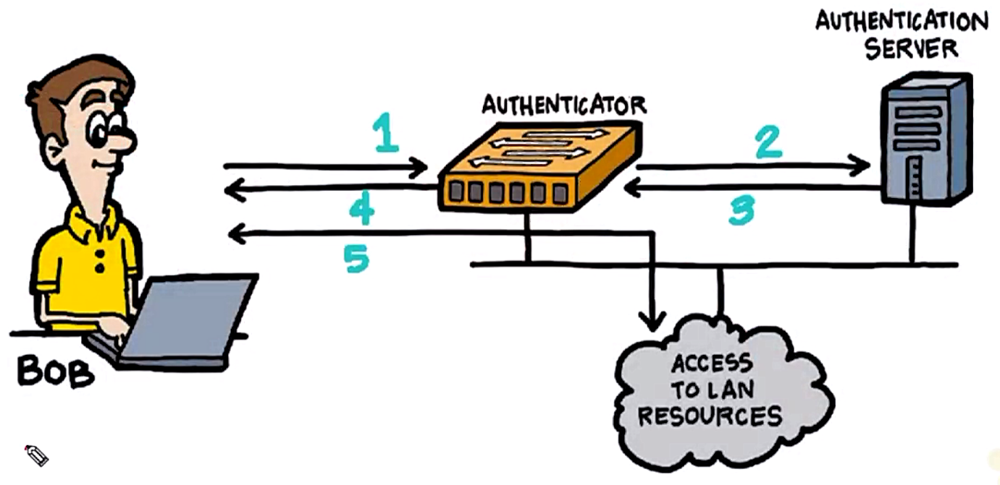

# 46. 802.1X Fundamentals

Trainer: Keith Barker


## Introduction to 802.1x Fundamentals

- Learning goals
  - authentication and authorization w/ 802.1X
  - authentication options
  - authorization options


## Network Authentication and Authorization

- 802.1X protocol
  - providing an authentication mechanism to devices wishing to attach to a LAN or WLAN
  - define the encapsulation of the Extensible Authentication Protocol (EAP) over IEEE 802.11
  - wired or wireless btw supplicant and authenticator
  - wireless AP wired connected to switch (WLC)
  - goal: authenticate user before attached to the network
  - authenticator:
    - a device request credentials from users
    - layer 2/3 switch and wireless LAN controller (WLC)
  - supplicant:
    - a piece of software (built-in or 3rd-party) interacting w/ authenticator
    - able to prompt to ask for username and password
  - authentication server:
    - identity server to validate identities
    - using Radius protocol
    - Radius server, AAA server, or ISE
  - once authenticated, able to authorize the user via downloadable ACL or TrustSec
    - specifying VLAN used
    - specifying port used
    - specifying user's security group
  - supplicant w/o 802.1x
    - MAC authn bypass (MAB): authn w/ MAC address
    - examples: IP camera, printer

  <div style="margin: 0.5em; display: flex; justify-content: center; align-items: center; flex-flow: row wrap;">
    <a href="url" ismap target="_blank">
      
    </a>
    <a href="https://en.wikipedia.org/wiki/IEEE_802.1X" ismap target="_blank">
      
    </a>
  </div>


## Options for Authentication

- EAP options
  - extensible authentication protocol (EAP)
  - Windows wireless network adapter > Properties
  - Authentication tab
    - Enable IEEE 802.1X authentication = On
    - Authentication method: PEAP, EAP-SIM, EAP-TTLS, EAP-AKA, EAP-AKA*, EAP-TEAP
  - EAP-TTLS (extensible authentication protocol - tunnel TLS): encrypted tunnel
  - PEAP (Protected EAP): developed by MS, Cisco and RSA


- Demo: config 802.1X
  - supplicant: Windows PEAP
    - wireless network adapter > Properties
    - settings: (*)Secured password (EAP-MSCHAPv2), smart card or other certificate
    - credential Advanced settings: Specify authentication mode = User Authentication > 'Replace credentials' button > Replace credentials: username & password > 'OK' buttone
    - verify: enable the network adapter to check the connection
  - authenticator: Cisco Sw 3750x

    ```text
    SW# show authentication sessions
    Interface    MAC Address     Method   Domain   Status   Fg    Session ID
    Gi2/0/2      8cae.4cfd.b87f  dot1x    DATA     Auth           0A1E0001000000150066BFA0
    Session count = 1

    SW# show authentication sessions mac 8cae.4cfd.b87f details
          Interface: GigabitEthernet2/0/2
        MAC Address: 8cae.4cfd.b87f
       IPv6 Address: unknown
       IPv4 Address: 10.80.0.12
          User-Name: bob
             Status: Authorized
             Donaim: DATA
      <...truncated...>
    Server policies:
         vlan group: vlan: 80
          SGT value: 17
    Method status list:
          Method    State
          dot1x     Authc Success
    ```

  - verify logs on ISE
    - log in ISE w/ username and password
    - OPeration tab > RADIUS > Live Logs
    - entry - Identity = bob, Endpoint ID = 8C:AE:4C:FD:B8:7F > icon in Details field
    - Report for bob authentication
      - Overview: Event = 5200 Authentication Succeeded, Username = bob
      - Authentication Details: Policy Server = ISE-02, Event = 5200 Authentication Succeeded, Username = bob
      - Steps: Extracted EAP-Response/Identity; Prepared EAP-Request proposing EAP-TLS with challenge, ...
  - ISE settings
    - Work Centers tab > Network Access > Policy Elements > Results > Allowed Protocols subfolder > Allowed Protocols Services > entry - Service Name  = Default Network Access > 'Default Network Access' link
    - Allowed Protocols: 
      - Authentication Bypass: Process Host Lookup = On
      - Authentication Protocols: PAP/ASCII, EAP-MD5, EAP-TLS, PEAP, EAP-FAST, EAP-TTLS, TEAP; LEAP (cisco, light-weight)
      - PEAP > Inner Methods: EAP-MS-CHAPv2, EAP-GTC, EAP-TLS
      - EAP-FAST > Inner Methods: EAP-MS-CHAPv2, EAP-GTC, EAP-TLS, PACs
      - EAP-TTLS > Inner Methods: PAP/ASCII, CHAP. MS-CHAPv1, MS-CHAPv2, EAP-MD5, EAP-MS-CHAPv2


## Options after Authentication

- Authorization options
  - Radius response w/ successful authn
  - possible components in response
    - VLAN: best practice to used a void VLAN before assigning
    - dACL (downloadbale): filtering or permitting certain types of traffic
    - SGT: TrustSec enabled to control the access


- Demo: authorization options on ISE
  - Work Centers tab > Network Access > Policy Elements > Results > Authorization Policies subfolder
  - Standard Authorization Profiles: fields - Name, Profile 
  - create new one: 'Add' icon > Authorization Profile: Name = abc
    - Common Task: DACL Name, Ipv6 DACL Name, ACL (Filter-ID), ACL IPv6 (Filter-ID), Security Group, VLAN, Voice Domain Permission, Web Redirection (CWA, MDM, NSP, CPP), Auto Smart Port, Assess Vulnerabilities, Reauthentication, MacSec Policy, Interface Template, Web Authentication (Local Web Auth), Airspace ACL Name, Airspace Ipv6 ACL Name, ASA VPN, AVC Profile Name, UPN Lookup
    - Advanced Attribute Settings: many options based on company and products


