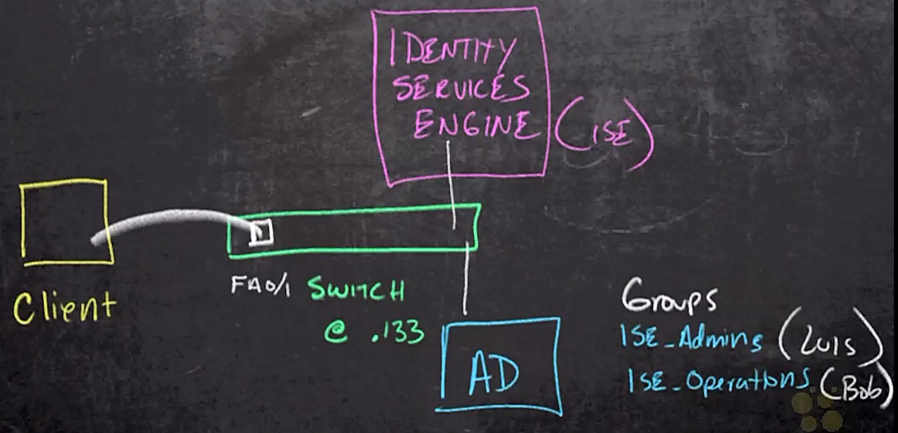

# 47. Configure ISE for 802.1X

Trainer: Keith Barker


## Introduction to Configuring ISE

- Learning goals
  - identity stores
  - integrateing w/ AD
  - network devices
  - policy sets
  - authz policies


## Identity Stores

- Demo: identity store on ISE
  - add new user: Work Centers tab > Network Access > Indentities: folders - Endpoints, Network Access Uses, Identity Source Sequences
    - Network Access Users: fields - Status, Name
    - entry - Name = bob, Status = Enabled > 'Remove' icon
    - 'Add' icon > Network Access Users List > New Network Access User: Name = Sample-Local-User, Status = Enabled; Passwords: Login Password = `****` > 'Submit' button
    - new entry - Name = Sample-Local-User, Status = Enabled
  - add new users from external server: Work Centers tab > Network Access > External Identity Sources (Ext Id Sources): folders - Certificate AuthenticationProfile, Activity Directory, LDAP, ODBC, RADIUS Token, RSA SecureID, SMAL Id Providers, Social Login


## Configure ISE to use AD

- Demo: integrating AD w/ ISE
  - Work Centers tab > Network Access > Ext Id Sources
  - Work Centers tab > Device Administration > Ext Id Sources
  - Active Directory > 'Add' icon: add AD server to import users
  - Connection tab: Join Point Name = Our-DC, Active Directory Domain = ogit.com > 'Sumbit' button > Would you like to join all ISE Nodes to this Active Directory Domain? > 'Yes' button
    - Join Domain: AD User Name = administrator, Password = `****`, Specify Organizational Unit = 'CN=COMPUTERS,DC=OGIT,DC=COM' = Disable (uncheck) > 'OK' button > Join Status: ISE Node = ISE-02.ogit.com, Node Status = Completed > 'Close' button
    - new entry - ISE Node = ISE-02.ogit.com, ISE Node Role = STANDALONE, Status = Operational, Domain Controller = DC.ogit.com, Site = Deafult-First-Site-Name
  - Groups tab > 'Add' icon
    - AD serever: Users - Bob, Luis; Groups - ISE-Admin (Luis), ISE-Operations (Bob)
    - Select Directory Groups: Domain = ogit.com > 'Retrieve Groups' button > Name = ogit.com/ISE-Admin, ogit.com/IS-Operations = On > 'Ok' button
    - 2 new entries - Name = ogit.vom/ISE-Admin, SID = S1-5-21-6813...4-1107; Name = ogit.com/ISE-Operations, SID = S1-5-21-6813...4-1108
    - Select Directory Groups: Domain = ogit.com, Name Filter = domain* > 'Retrieve Groups' > Name = ogit.com/Users/Domain Admins, ogit.com/Users/Domain Users = On > 'Ok' button
    - 2 new entries - Name = ogit.vom/Users/Domain Admins, SID = S1-5-21-6813...4-512; Name = ogit.com/Users/Domain Users, SID = S1-5-21-6813...4-513
    - 'Save' button


## Adding Network Devices to ISE

- Demo: add network device on ISE
  - Work Centers tab > Network Access > Network Resources: folders - Network Devices, Device Groups, Default Device, External RADIUS Servers, RADIUS Server Sequences, External MDM Servers
  - Network Devices: fields - Name, IP/Mask, Profile Name, Location, Type > 'Add' icon
  - Network Devices: Name = switch1, IP Address = 192.168.1.133; RADIUS Authentication Settings = On -> RADIUS UDP Settings: Protocol = RADIUS, Shared Secret = `****` (same as switch1) > 'Submit' button
    - new entry - Name = switch1, IP/Mask = 192.168.1.133. Profile Name = Cisco, Local = All Locations, Type = All Device Types
  - Device Groups > Network Device Group: fields - Name, No. of Network Devices > 3 entries > 'Add' icon
    - Add Group: Name = site 1, Parent Group = All Locations > 'Save' button
    - same prodcure to create switch and router w/ 'All Device TTypes' and 'site 2' w/ 'All Locations'
    - Name = All Device Types: 2 subentries - Name = switch, router
    - Name = All Locations: 2 subentries - Name = site1, site 2 
  - Network Devices: entry - Name = switch1 > Network Devices > network Device Group: Location = site 1, Device Type = switch
    - new entry - Name = switch1, IP/Mask = 192.168.1.133. Profile Name = Cisco, Local = site 1, Type = switch


## Policy Set Overview

- Policy set overview
  - topology
    - switch as authenticator
    - client as supplicant
    - ISE as authentication server
  - switch request sent to ISe regarding to client's connection
  - two policies involved once request received on authn server
    - authentication: the resources able to access
    - authorization: fully or partially access resources

  <figure style="margin: 0.5em; display: flex; justify-content: center; align-items: center;">
    
  </figure>


- Demo: config policies on ISE
  - Policy tab: subtabs - Policy Sets, Posture, Policy Elements (Dictionaries, Conditions, Results), Profiling, Client Provisioning
  - Policy Sets: fields - Status, Policy Set Name, Conditions, Allowed Protocols / Server Sequence, Hits, Actions, View
    - alternatives: Work Centers tab > TrustSec > Policy Sets, Work Centers tab > Network Access > Policy Sets, Work Centers tab > Guest Access > Policy Sets, Work Centers tab > BYOD > Policy Sets, or Work Centers tab > Posture > Policy Sets
    - entry - Name = Default policy set, Conditions = (empty), Allowed Protocols / Server Sequence = Default Network Access *, Hits = 15, Actions = gear icon, View = right arrow (`>`) icon
      - Conditions = (empty): wide open, not specific to any groups
      - Allowed Protocols / Server Sequence = Default Network Access *: all EAP methods enabled
      - `>` icon: viewing details
        - fields - Status, Rule Name, Conditins, Use, Hits, Actions (gear icon)
        - entries - Authentication Policy (3), Authorization Policy - Local Exceptions, Authorization Policy - Global Expectations, Authorization Policy (12)
      - Authentication Policy (3): Rule Name = Dot1X, MAB , Default (top-down order)
        - Dot1X: Conditions = Wired_802.1X OR Wireless_802.1X, Use = ALL_User_ID_Store
        - MAB: Conditions = Wired_MAB OR Wireless_MAB, Use = ALL_User_ID_Store
        - Default: Conditions = (empty), Use = ALL_User_ID_Store
      - Authorization Policy (12): Wireless Black List Default, Profiled Cisco IP Phones, Profile Non Cisco Phones, Unknown_Compliance_Redirect, ..., Base_Authenticated_Access, Default (top-down order)
        - not configured items just using 'Base_Authenticated_Access'
  - two main components in policy sets
    - authentication policy
    - authorization ploicy


- Demo: verify policy sets on ISE
  - client on windows
    - Network adapter > disable and enable again > Status = Authentication Failed > Properties
    - Ethernet 2 Properties > Authentication tab: Network authentication method = PEAP
      - 'Settings' button > Protected EAP Properties: Verify the server's security by validating the certificate = On, Trusted Root Certification Authorities = ISE-02.ogit.com; Select Authentication Method = EAP-MSCHAPv2 > 'OK' button
      - 'Advanced Settings' button > Specify authentication mode = User Authentication > 'Save credentials' button > Windows Security: username = bob & passoword = `****` > 'Ok' button
    - Network adapter > Status = Unidentified network
  - verify on ISE
    - Operations tab > RADIUS > Live Logs > entry - Identity = bob > 'detail' icon
      - Overview: Authentication Policy = Default >> Dot1X, Authorization Policy = Default > Basic_Authenticated_Access
    - Policy tab > Policy Sets > entry - Policy Set Name = Defult > '>' icon on view
      - Authentication Policy: entry - Rule Name = Dot1X
      - Authorization Policy: entry - Rule Name = Basic_Authenticated_Access
    - log each single events: Work Centers tab > Network Access > Settings > Protocol folder > RADIUS > Suppression & Report tab: Suppress Repeated Failed Clients = Supress repeated successful authentications = Off


## Creating a Policy Set

- Plan for authentication policy
  - site 1
  - switch
  - use AD


- Demo: config a new policy set on ISE
  - verify network devices
    - WorkCenters > Network Resources > Network Devices > entry - Name = switch1 > 'switch1' link
      - Network Devices: Name = switch1, Location = site 1, Device Type = switch
    - WorkCenters > Network Access > Active Directory - Our-DC
      - Groups tab: 4 entries - ogit.com/ISE-Admins, ogit.com/ISE-Operations, ogit.com/Users/Domain Admins, ogit.com/Users/Domain Users
  - create a policy
    - Policy tab > Policy Sets > '+' icon
      - new entry - Rule Name = Our-Site1-Switch-Policy-Set > '+' icon under Conditions
      - Conditions Studio:
        - Select attribute for condition: Dictionary = DEVICE Location = All Locations#site 1 > 'New' button
        - Select attribute for condition: Dictionary = DEVICE Device Type = ALL Device Types#switch > 'AND' label for both > 'Use' button
      - new entry - Name = Our-Site1-Switch-Policy-Set, Conditions = DEVICE Location = ... AND DEVICE Device Type = ... > 'Save' button
      - '>' under view to review the details
    - Authentication Policy > '+' icon
      - new entry - Rule Name = Our-authn-dot1x > '+' icon under Conditions
      - Conditions Studio: drag Wired_801.1X from template > 'Use' button
      - new entry - Use = Our-DC
    - Authorization Policy  > '+' icon
      - new -entry - New Rule = If-You-Authenticated-good-enough > '+' icon under Conditions
      - Conditions Studio: drag Network_Access_Authentication_Passed > 'Use' button
      - new entry - Profiles = PermitAccess > 'Save' button


- Demo: verify new policy set
  - Wired Network Adapter > Disable * Enable again > Enabled
  - ISE log: Operations tab > RADIUS > Live Logs > top entry - Identity = bob, Status = 'Session' icon > 'detail' icon
    - Overview: Authentication Policy = Default>>Dot1X, Authorization Policy = Default>>Basic_Authenticated_Access, Authorization Result = permitAccess -> not using created policy set
  - verify the created policy set and retry
  - ISE log: Operations tab > RADIUS > Live Logs > top entry - Identity = bob, Status = 'Session' icon > 'detail' icon
    - Overview: Authentication Policy = Our-Site1-Switch-Policy-Set>>Our-authen-dot1x, Authorization Policy = Our-Site1-Switch-Policy-Set>>if-You-Authenticated-good-enough, Authorization Result = permitAccess -> as expected, last time action too quick and the log not refreshed


## Authorization Policies

- Demo: config authorization policies
  - Work Centers > Network Access > Policy Elements: folders - Conditions, Results
  - Results: subfolders - Allowed Protocols, Authorization Profiles, Downloadable ACL
  - create new DACL: Downloadable ACL > 'Add' icon 
    - Downloadable ACL: Name = NoICMP-Telnet; IP version = IPv4; DACL Content = 'deny icmp any any; deny tcp any any eq 23'
    - validate w/ 'Check DACL Syntax' button -> DACL is valid
    - 'Submit' button
  - Authorization Profiles > Standard Authorization Profiles > 'Add' icon
    - Authorization Profile: Name = ise-admins, Access Type = ACCESS_ACCEPT; Common Tasks: VLAN = On, Edit Tag ID/Name = 30 > 'Submit' button
    - Authorization Profile: Name = ISE-Operations, Access Type = ACCESS_ACCEPT; Common Tasks: DACL = NiICMP-Telnet, VLAN = On, Edit Tag ID/Name = 80 > 'Submit' button
    - Standard Authorization Profiles: 2 new entry - Name = ise-admins, Profile = Cisco; Name = ISE-Operations, Profile = Cisco
  - Policy tab > Policy Sets > entry - Policy Set Name = Our-Site1-Switch-Policy-Set > '>' icon under Vew
    - Authorization Policy > entry - Rule Name = if-You-Authenticated-good-enough > 'gear' icon under Actions > 'Delete' label
    - '+' icon > new entry - Rule Name = admins > '+' button under Conditions
    - Consitions Studio: Select attribute for condition > Dictionaries = Our-DC, Attribute = ExternalGroups > Our-DC ExternalGroups = ogit.com/ISE-Admins > 'Use' icon
    - new entry - Rule Name =  Admins, Conditions = Our-DC ExternalGroups Equals ogit.com/ISE-Admins, Results - Profiles = ise-admins
    - new entry - Rule Name = ISE-OPS, Conditions = Our-DC ExternalGroups Equals ogit.com/ISE-Operations, Results - Profiles = ISE-Operations
    - 'Save' button


- Demo: verify authorization policies
  - verify w/ bob on PC
    - Client > Network Adapter > Properties > Authentication tab > 'Advanced Settings' button > Replace Credentials: usernam e= bob, password = `****` > 'OK' button
    - Network adapter > Status = Unidentified network
    - ping from PC w/ 10.30.0.1 -> -> failed
  - verify switch

    ```text
    SW# show vlan brief
    VLAN Name           Status    Ports
    ---- -------------- --------- -----------------------------
    1    default        active    
    10   VLAN0010       active    
    20   VLAN0020       active
    30   VLAN0030       active
    80   VLAN0040       active    Fa0/1
    999  VLAN0999       active    Fa0/2. ...
    <...truncated...>

    SW# show run int f0/1
    interface FastEthernet0/1
      switchport access vlan 999
      <...truncated...>

    SW# show access-lists
    Extended IP access list Auth-Default-ACL-OPEN
        10 permit ip any any (80 matches)
    Extended IP access list xACSACLx-IP-NOICMP-TELNET-5f152814 (per-user)
        10 deny icmp any any
        20 deny tcp any any eq telnet

    SW# show authentication sessions interface f0/1
                Interface:  FastEthernet0/1
              MAC Address:  5882.a899.5c81
               IP Address:  10.80.0.12
                User-Name:  bob
                   Status:  Authz Success
                   Domain:  DATA
          Security Policy:  Should Secure
          Security Status:  Unsecure
           Oper host mode:  multi-domain
         Oper control dir:  both
            Authorized By:  Authentication Server
              Vlan Policy:  80
                  ACS ACL:  xACSACLx-IP-NOICMP-TELNET-5f152814
          Session timeout:  N/A
             Idle timeout:  N/A
        Common Session ID:  C0A8...A84B
          Acct Session ID:  0x0000008E
                   Handle:  0x2F000064
        
    Runnable method list:
            Method    State
            dot1x     Authc Success
            mab       Not run
    ```

  - verify w/ Luis on PC
    - Client > Network Adapter > Properties > Authentication tab > 'Advanced Settings' button > Replace Credentials: usernam e= luis, password = `****` > 'OK' button
    - Network adapter > Status = Unidentified network
    - ping from PC w/ 10.30.0.1 -> succeed
  - verify switch

    ```text
    %LINEPROTO-5-UPDOWN: Line protocol on interface Vlan 80 change status to down
    %LINEPROTO-5-UPDOWN: Line protocol on interface Vlan 30 change status to up
    %AUTHMGR-5-SUCCESS: Authorization succeeded for client (5882.a899.5c81) on 
      Interface Fa0/1 AuditSessionID C0A8...A84B

    SW# show int status
    Port      Name      Status        VLan    Duplex  Speed  Type
    FA0/1               connected     30      a-full  a-100  10/100BaseT
    <...truncated...>
    ```


## Summary


