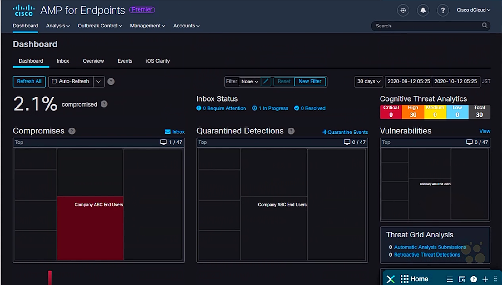

# 50. Explaining the Benefits of Streaming Telemetry

Trainer: Knox Hutchinson

## Introducing Streaming Telemetry

- Learning goals
  - telemetry
  - network telemetry
  - endpoint telemetry

## What is Telemetry?

- Streaming telemetry overview
  - analyzing the status and healthy of the entire network environment
  - solution: AMP for Endpoints
  - collecting data w/ AMP client on clients and network devices
  - data including syslog, SNMP trap, debug, file downloaded, programming executed
  - telemetry characteristics
    - model: pull/push/both
    - update intervals
    - on-change events

## Network Telemetry

- Network telemetry overview
  - pull model
    - achieved via syslogs or SNMP
    - network monitoring system (NMS) sending requests periodically to gather data
  - push model
    - achieved via Netconf/Restconf protocol
    - network devices subscribing and periodically push data to MNS
  - Netconf/Restconf protocol
    - subscribing using YAML data model
    - network devices delivering data to NMS periodically or on-change events
  - gRPC protocol
    - popular in service provider, used in enterprise as well

- Demo: DNA Center
  - [dCloud demo](https://dcloud2-sjc.cisco.com/content/instantdemo/cisco-dna-center-express-install-instant-demo)
    - DNA center: tabs - DESIGN, POLICY, PROVISION, ASSURANCE
    - Dashboard page: Assurance Summary
    - ASSURANCE tab: subtabs - Dashboard, Trends And Insight, Manage
    - ASSURANCE > Dashboard subtab
      - Overall Health: charts - Network Devices (Wired Clients, Wireless Clients)
      - Health > Network Health: chart - device types and errors
  - DevNet Sandbox Lab - Cisco FMC and Splunk

## Endpoint Telemetry

- Advanced Malware Protection (AMP)
  - firepower threat defence
  - scanning files entering or existing the devices
  - leveraging Talos database w/ constantly updating

- Endpoint telemetry
  - Firepower Management Center (FMC): tabs - Overview, Analysis, Policies, Devices, Objects, AMP, Intelligence
  - AMP for Endpoints
    - agent installed in endpoints
    - accessing data from HQ via VPN
    - constantly monitoring and sending to NMS
    - integrated into AnyConnect or ISE

    <figure style="margin: 0.5em; display: flex; justify-content: center; align-items: center;">
      
    </figure>

