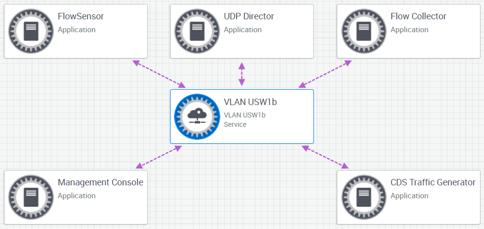
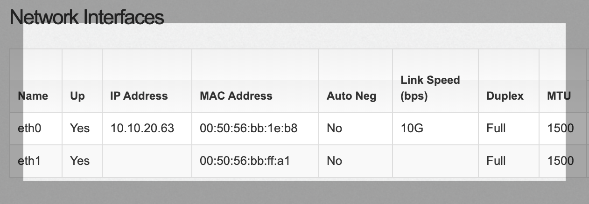
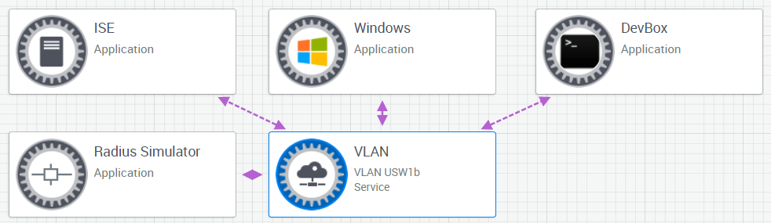

# 51. Describing the Features of Various Cisco Security Offerings

Trainer: Knox Hutchinson


## Introducing Cisco Security Platforms

- Learning goals
  - StealthWatch
  - pxGrid
  - Umbrella
  - threat analytics
  - AnyConnect

## Stealthwatch

- Stealthwatch overview
  - characteristics
    - receiving streaming telemetry
    - using ML to detect malware
    - a major part of DNA Center
  - components for cloud solution
    - network devices
    - servers
    - endpoints
    - remote workers
  - working mechanism
    - streaming telemetry to centralized database
    - threat intelligence: using ML/AI analytics to detect abnormal occurs
    - encrypted traffic analysis: identify where attacks carry out, e.g., same user sending traffic from differe geolocations
    - microsegmentation policy: built w/ the analysis result learned from normal traffic types w/ SD-Access fabric
  - DevNet Sandbox Lab - [Cisco StealthWatch](https://bit.ly/3mSrAjU)
    - Stealthwatch overview

      <span style="font-weight=bold; text-decoration: underline">Overview:</span>

      Cisco Stealthwatch is the most comprehensive visibility and network traffic security analytics solution that uses enterprise telemetry from the existing network infrastructure. It provides advanced threat detection, accelerated threat response, and simplified network segmentation using multilayer machine learning and entity modeling. With advanced behavioral analytics, you will always know who is on your network and what they are doing.

      This Sandbox contains a Stealthwatch Enterprise Environment for developer API testing. The CDS traffic generator populates the SMC with usable data for reporting and API calls. Traffic is started by users at the beginning of an actve reservation. Also, a number of postman collections are available on GIT to download and play with, against this environment.

      This sandbox contains the following:
      - StealthWatch Management Center (SMC): front-end GUI
      - Flow Collector
      - Flow Sensor
      - UDP Director
      - CDS Traffic Generator

      NOTE:
      - StealthWatch Management Center, Flow Collector, Flow Sensor, and UDP Director must be deployed either in the same or different boxes.  Separated boxes are recommended.
      - Alternatively, the streaming telemetry cab be routed to Stealthwatch Cloud to provide centralized and scaling solution.

      <span style="font-weight=bold; text-decoration: underline">Server Access Credentials</span>

      - SMC - admin/C1sco12345
      - Flow Collector (10.10.20.61) - admin/C1sco12345
      - Flow Sensor(10.10.20.62) - admin/C1sco12345
      - UDP Director (10.10.20.63) - admin/C1sco12345
      - CDS (10.10.20.64) - root/lan1cope

      <figure style="margin: 0.5em; display: flex; justify-content: center; align-items: center;">
        
      </figure>

      NOTE: root access for the above servers is also enabled. Password is the same

      <span style="font-weight=bold; text-decoration: underline">More information:</span>

      - [Stealthwatch on Cisco DevNet](https://developer.cisco.com/stealthwatch/)
      - [Stealthwatch APIs](https://developer.cisco.com/docs/stealthwatch/#!why-use-these-apis/why-use-these-apis)
      - [Postman Collection - Enterprise](https://developer.cisco.com/codeexchange/github/repo/CiscoDevNet/stealthwatch-enterprise-sample-postman)

      <span style="font-weight=bold; text-decoration: underline">Additional Information:</span>
      
      - [Sandbox Support](https://communities.cisco.com/community/developer/sandbox)

    - Start traffic

      <span style="font-weight=bold; text-decoration: underline">Starting CDS Traffic Flow</span>

      Once a reservation has setup and reached "Active" state, users can start the CDS traffic flow towards the UDP director. This is then picked up and displayed my th e Stealthwatch Management Center monitoring.

      This sandbox contains the following:
      - Once the Sandbox reservation has become Active connect to the VPN as instructed in the output window or the email
      - Browser to the [UPD Director](https://10.10.20.63/) and login with admin/C1sco12345
      - Scroll down on the main page to the interfaces. Note the MAC address of the Eth0 interface.

      <figure style="margin: 0.5em; display: flex; justify-content: center; align-items: center;">
        
      </figure>

      - We now need to start the traffic from the CDS Traffic generator. Ssh root@10.10.20.64 (password is lan1cope)
      - Once connected, the firstrun script will trigger
      - Hit n to the configuration XML question
      - Accept the default hostname for the box
      - Set domain to lab.devnetsandbox.local
      - IP address of DNS server is 10.17.248.11
      - IP address of NTP server is 10.17.251.250
      - The MAC address for the UDP director is then requested. Enter the MAC from step 3 above in xx:xx:xx:xx:xx:xx notation
      - The IP address of UDP Director should be set to 10.10.20.63
      - The IP address of Flow Sensor should be set to 10.10.20.62
      - The IP address of the Flow Collector should be set to 10.10.20.61
      - Enter y to accept the setting. A script will run to rewrite the .pcap files, taking just a moment.
      - Browse to [Stealthwatch Management Center GUI](https://10.10.20.60/) and check the flows on the main page. It may take 10 minutes or so to register the traffic flow
    - API Info

      <span style="font-weight=bold; text-decoration: underline">REST API Overview</span>

      Sandbox provides a simple StealthWatch environment within which, users can experiment, play and develop with the Stealthwatch REST API.

      The Stealthwatch System REST APIs consists of a collection of resources for developers, administrators, or partners that enable the functionality of Stealthwatch to be accessed programmatically. Since Stealthwatch REST APIs are based on open standards, you can use any programming or scripting language you wish as long as it supports HTTP.

      DevNet has an abundance of API documentation, code samples, tools and postman collections for StealthWatch. These are linked below to help you get started.

      - [Stealthwatch Enterprise Sample Scripts](https://developer.cisco.com/codeexchange/github/repo/CiscoDevNet/stealthwatch-enterprise-sample-scripts)
      - [Stealthwatch CSV Tools](https://developer.cisco.com/codeexchange/github/repo/CiscoDevNet/stealthwatch-enterprise-csv-tools)
      - [Postman Collection - Enterprise](https://developer.cisco.com/codeexchange/github/repo/CiscoDevNet/stealthwatch-enterprise-sample-postman)

      When you have downloaded and imported the postman collections, it's important to set the environment variables to that of the Stealthwatch Sandbox:

      - STEALTHWATCH-SMC = 10.10.20.60
      - username = admin
      - password = C1sco12345
    - VPN Access

      <span style="font-weight=bold; text-decoration: underline">Software VPN Access to this Lab:</span><br>
      This tab will explain everything you need to know about how to establish a secure software [VPN connection](http://en.wikipedia.org/wiki/Virtual_private_network) to this lab.  A VPN connection is required for you to interact with the systems and devices in this Lab.  You'll also need to have an active reservation for this Lab.

      <span style="font-weight=bold; text-decoration: underline">Stuff You Can (and Should) Do Prior to Your Reservation:
      In order to establish a software VPN connection to this Lab, you must download and install Cisco's AnyConnect VPN Client software on any system you plan to use to connect to your Lab.  (And it's ok if you don't do  this until after your reservation has started.  It's all good!)  Here's how you download and install AnyConnect:
      - [Download the Cisco AnyConnect VPN Client software.](https://developer.cisco.com/site/devnet/sandbox/anyconnect/)
      - [Installation Guide for Cisco AnyConnect VPN Client software.](https://devnetsandbox.cisco.com/Docs/VPN_Access/AnyConnect_Installation_Guide.pdf)

      <span style="font-weight=bold; text-decoration: underline">Emails You'll Receive:</span><br>
      When your Lab reservation begins, you will receive several emails communicating important information about the status of your Lab.
      - 1\. The first email is sent to you from the Lab provisioning automation engine, and indicates that resources in your Lab are in the process of being provisioned and tested.  Your Lab is NOT READY yet, but this email will give an estimate of when your Lab will be available.
      - 2\. The second email will be sent to you when your Lab is fully provisioned, tested and READY for you to connect.  In this email you'll find the  information required by AnyConnect to establish a VPN connection to your Lab (Network IP Address, VPN Username, VPN Password).
      
      <span style="font-weight=bold; text-decoration: underline">Connecting to Your Lab:</span><br>
      Once you receive the email that says your Lab is ready, you can begin the VPN connection process.  Here's how you establish a VPN connection to your Lab.
      - [AnyConnect VPN Connection Guide.](https://devnetsandbox.cisco.com/Docs/VPN_Access/AnyConnect_Connection_Guide.pdf)

## pXGrid

- pXGrid overview
  - an API-based solution to allow identity service engine or other threat response platforms to understand the status of the whole network environment
  - used in DNA Center to integrated w/ ISE
  - DevNet Sandbox Lab - [PxGrid 2.0 on ISE 3.0](https://bit.ly/3nAPiSj)
    - Overview

      <span style="font-weight=bold; text-decoration: underline">Cisco Platform Exchange Grid 2.0</span>

      The Cisco Platform Exchange Grid (pxGrid) allows you to integrate your application into the pxGrid, a multivendor, cross-platform network system that pulls together different parts of an IT infrastructure such as security monitoring and detection systems, network policy platforms, asset and configuration management, identity and access management platforms, to name a few.

      Cisco Platform Exchange Grid (pxGrid) 2.0 no longer uses the C or Java SDK as in pxGrid 1.0. Instead pxGrid 2.0 uses WebSocket and REST API over the STOMP messaging protocol for querying and subscribing to topics.

      This Sandbox focuses on seeing what context is available on ISE via pxGrid subscribing to the Session Directory and RADIUS failure topics.

      <span style="font-weight=bold; text-decoration: underline">UPDATE!!!!</span>

      This sandbox has been upgraded to include ISE 3.0 and a new CentOS 7 server hosting the "Pez" Radius simulator. More informtion on this software can be found in the "Simulator" tab.

      This sandbox contains the following:
      - Identity Services Engine 3.0 (10.10.20.70)
      - Radius Simulator (10.10.20.32)
      - Cent OS 7 DevBox (10.10.20.50)
      - Windows 2012 DNS Server (10.10.20.100)

      <figure style="margin: 0.5em; display: flex; justify-content: center; align-items: center;">
        
      </figure>

      <span style="font-weight=bold; text-decoration: underline">Server Access Credentails</span>

      - Identity Services Engine 3.0 (admin/C1sco12345!)
      - Radius Simulator (developer/C1sco12345)
      - Cent OS DevBox (developer/C1sco12345)
      - Windows 2012 (ABC\developer - sandbox12345!)

      The attributes tab of each resource also shows credential information. Resources can also be opened using the Gwac interface. Connect to the VPN, hover over the resource and select the connection type.

      <span style="font-weight=bold; text-decoration: underline">More information:</span>
      - [pxGrid 2.0 on DevNet](https://developer.cisco.com/site/pxgrid/)
      - [pxGrid 2.0 Overview](https://developer.cisco.com/docs/pxgrid/#!learning-pxgrid/welcome-to-learning-cisco-platform-exchange-grid-pxgrid)

      <span style="font-weight=bold; text-decoration: underline">Additional Information:</span>
      - [Sandbox Support](https://communities.cisco.com/community/developer/sandbox)

    - Documentation

      <span style="font-weight=bold; text-decoration: underline">Using this Sandbox</span>

      This document is for users accessing the Cisco Platform Exchange Grid (pxGrid) 2.0 sandbox environment. Eclipse is used in this document as the development platform and uses the pxGrid 2.0 java coding examples from [here](https://developer.cisco.com/site/pxgrid/).

      This sandbox focuses on seeing what context is available on ISE via pxGrid subscribing to the Session Directory and RADIUS failure topics. Topics such as Adaptive Network Control (ANC) mitigation actions, and pxGrid Context-In, dynamic topics, and subscription to other TrustSec topics is not available in this release. To learn more about these topics please visit [here](https://developer.cisco.com/site/pxgrid/) to learn more information on these topics. These topics will be added in a later release.

      Security solutions that are going down the pxgrid certification path, they still would need to download the ISE 3.0 code and use RADIUS Simulator if there is no Cisco Catalyst Switch that supporting IEEE-802.1X and Change of Authorization (CoA) for ANC mitigation actions. First, you must register and login to Cisco Devnet

      To start using this sandbox and exploring pxGrid, see the [Sandbox User Guide](https://devnetsandbox.cisco.com/sandbox-instructions/PxGrid_Revn/pxgrid_sandbox20_updated2.pdf)

    - Simulator

      Radius Simulator Overview

      The pxGrid Sandbox has been updated to include a radius simulator running on a dedicated Cent OS7 server. This python software uses various configuration files to generate radius authentication against the internal ISE server

      In the following examples, sandbox has provided four configuration files for PAP and PEAP authentication. Please follow the instructions below to access the simulator and run the code.

      - SSH to the Radius Simulator VM. Access details on the Overview tab)
      - Goto `/home/developer/Downloads/Pez`
      - Set the below environmental variables at the command prompt

        ```bash
        export PYTHONPATH=./lib:$PYTHONPATH
        export LD_LIBRARY_PATH=./lib:$LD_LIBRARY_PATH
        export LD_PRELOAD=./lib/libssl.so.10:./lib/libcrypto.so.10
        ```

      - The below commands run various authentication methods

        ```bash
        python pez.py -c ./cfg/final_cfg/pap-pavan.cfg --host 10.10.20.70
        (simulating PAP ascii 4 RADIUS sessions)
        python pez.py -c ./cfg/final_cfg/pap-pavan-vpn.cfg --host 10.10.20.70
        (for simulating PAP ascii 4 RADIUS vpn sessions)
        python pez.py -c ./cfg/final_cfg/pap-pavan-vpn.cfg --host 10.10.20.70
        (for simulating peap(MS-CHAPv2) 4 radius sessions)
        python pez.py-c ./cfg/final_cfg/peap_ms_chap_pavan_vpn.cfg --host 10.10.20.70
        (for simulating peap(MS_CHAPv2) 4 vpn radius Session)
        ```

      - Login to the ISE server (details on the Overview Tab)
      - Goto Operations - Live Sessions. The authentications will be listed here

    - DevBox

      <span style="font-weight=bold; text-decoration: underline">DevBox Overview:</span>

      The sandbox also comes with an Cent OS 7 server, named devbox, that comes with a ready-to-use Node.js development environment, including: the Node.js v6+ runtime and npm package, a git client, and the ngrok tunnelling client. This can be handy to use if you are willing to experiment with the jsxapi and do not have a Node.js environment on your laptop.

      <span style="font-weight=bold; text-decoration: underline">DevBox Credentials</span>

      - IP Address: 10.10.20.50
      - Username: developer
      - Password: C1sco12345

  - Demo: pxGrid on Lab
    - login ISE
      - Administration > pxGrid Service: entries listing devices allowed to access ISE programmatically - automation capability
      - entry w/ Status = Online (XMPP):
        - older way to connect to ISE
        - Extensible Messageing and Presence Protocol (XMPP) used to exchange info btw ISE and network devices, e.g., Stealthwatch, NMS, asset mgmt, etc.
      - currently using REST API instead


## Umbrella Investigate


## Cognitive Threat Analytics


## AnyConnect Network Visibility Module


## Summarizing Cisco Security Platforms


