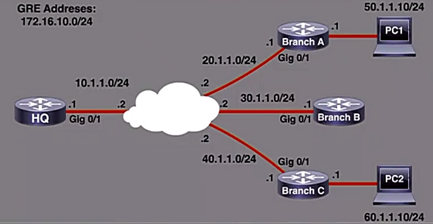
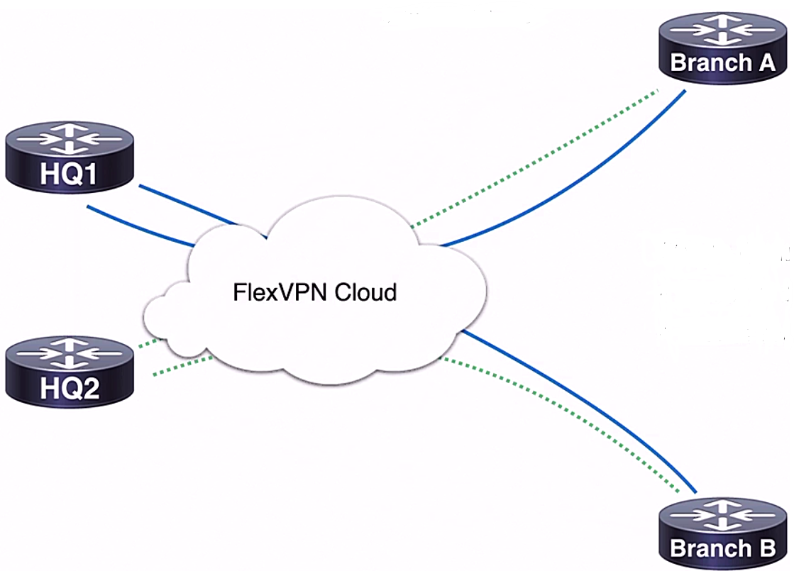
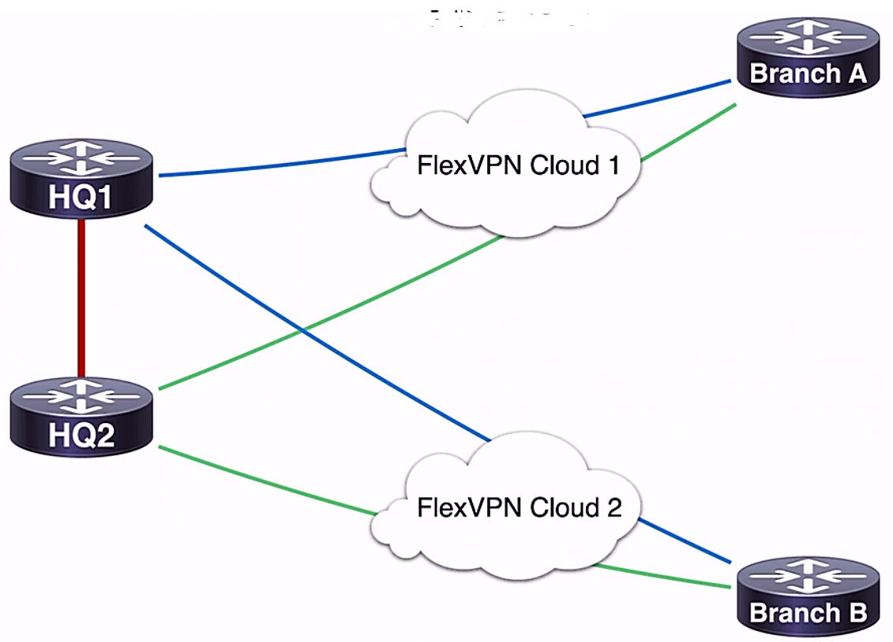

# Fundamentals Security Concepts


## On-premises threats

- Categories of threats
  - on-premise threats
  - cloud-based threats

- Termonologies for on-premise threats
  - **on-premise network:** network environment physically present on the premise of the business
  - **malware:**
    - catch-all term for malicious software
    - not an interchangeable term for "virus"
    - computer virus as a category of malware
    - categories: spyware, adware, ransomeware, etc.
  - **virus:**
    - human intervention required for spreading
    - contain search and infection routines
      - search routine: locating new things to infect
      - infection routing: multiplying  the virus
    - contain malicious payloads
    - actions probably including file alteration or deletion
    - advanced versions containing anti-detection routines to 
      - suppress warning messages
      - modify the underlying code for stealth
  - **trojan**
    - threats disguided as legitimate terms
    - execution to download or install harmful malware
    - not self-duplicated as a virus does
    - goal: providing system access for broader attack
    - often installing malware, obtaining remote access, disabling security systems, steal sensitive information, etc.
  - **DoS and DDoS Attacks**
    - designed to disrupt or disable a network
    - example: ICMP Ping Flood attack
    - DoS: single attacking system
    - DDoS: Botnet attacks (most common)
  - **Phishing**
    - used to steal sensitive user data
    - most commonly achieved through email
    - email links or attachments redirect to malicious websites under the attacker's control
  - **Rootkit**
    - designed to obtain privilege system access
    - goal: remain quietly in the background
    - especially hard to remove w/o drastic actions
    - common delivery methods including trojans and phishing campaigns
  - **Main-in-the-Middle Attacks**
    - attackers positioned logically btw a user and destination resource for data interception
    - example: rouge access points, DNS spoofing, etc.
    - main characteristic: communication interception
  - **SQL Injection Attacks**
    - SQL: standard language used for databases
    - target database resources such as we applications
    - partial SQL commands able to return unexpected actions or access to a database
    - **In-Band SQL Injection Attacks**: data directly visible in the web app or web page
    - **Out-of-Band SQL Injection Attacks**: data transmitted over a different channel
    - **Blind SQL Injection Attacks**: information learned through trial and error interaction
  - **Cross-Site Scripting (XSS)**
    - malicious scripts injected into trusted websites
    - harmful script executed to perform actions
  - **Reflected XSS Attack**
    - delivered through physing or search engines
    - malicious links redirect to a vulnerable server which injects harmful code into browser
  - **Persistent (Stored) XSS Attack**
    - malicious code permanently stored in database
    - malicious link not required for delivery


## Cloud-based threats

- Termonologies for cloud-based threats
  - **Public Cloud Deployment**
    - most common method of cloud computing
    - example: Microsoft Azure
    - cloud resources owned and operated by a 3rd-party service provider
    - lower cost, less maintenance
    - higher reliability, easier to scale
  - **Private Cloud Deployment**
    - resources owned ad operated by the organization
    - common w/ government agencies and banks
    - hosted locally or w/ 3rd-party provider
    - imporved security and control
    - more flexible to a business specific needs
  - **Hybrid Cloud Deployment**
    - combining public and private cloud features
    - balance of cost-effectiveness, control, and flexibility
  - **Data Breaches**
    - ensuring cloud providers equiped to prevent and contain a data breach
    - checking data policy thoroughly
    - inquiring about incident response procedures
    - considering industry-specific reqgulatory requirements, e.g., HIPAA in Heath industry
    - encryption implementation
  - **User Misconfiguration**
    - attributed to over 21% of breaches in 2019
    - customer w/ the responsibility in the public cloud
    - importance: thorough understanding of cloud security deployment
  - **Insecure Application Programming Interface (API)**
    - API security: one of the most frequent attack vectors
    - critical: authentication, access control, activity monitoting, and encryption
    - Open Cloud Computing Interface (OCCI)
    - Cloud Infrastructure Management Interface (CIMI)
  - **DoS and DDoS**
    - designed to disrupt or disable a network
    - cloud provider Service Level Agreement (SLA)
    - SLA varying btw providers
  - **Compromised Credentials**
    - credential management control depending on how cloud resources are used
    - compromise detection becoming commonplace
    - leaked credential monitoring


## Software vulnerabilities

- Resources for software vulnerability
  - [Common Weakness Enumeration](https://cwe.mitre.org/) (CWE)
    - list of common software and hardware weakness types
    - members including companies, institutes and individual developers
    - goal: help to stop vulnerabilities by brining awareness of software designers, programmers, and architectures
    - [top 25 most dangerous software weakness](https://cwe.mitre.org/top25/archive/2021/2021_cwe_top25.html)
  - [National Vulnerability Database](https://nvd.nist.gov/) (NVD)
    - public repository for vulnerability disclosure
    - able to subscribe feeds for latest info
    - searchable database
  - [Common Vulnerability and Exposures](https://cve.mitre.org/) (CVE)
    - another public list of security flaws


## SQL injection

- SQL injection
  - a technique used to attack web server
  - valid SQL statements entered into a form field
  - vulnerability from errors in code
  - not validating entry values before execution in vulnerability website or web application
  - demo: running an instance of DVWA in Kali Linux
    - DVWA Security > Security level (Low/Medium/High) > Low
    - SQL Injection > User ID: 
      - `1` > First name: admin; Surname: admin
      - `1'` > error in your SQL syntax:
        - good for syntax but bad for security, no message be shown
        - `'` for SQL delimetor
      - `1' or 1=1#`: valid syntax, `1=1` always a true statement, shown all users in database
      - `1' and 1=1 union select database(),user()#`: a list of user names
      - using the result and append to the command to retrieve more info
    - command w/ `table_name` able to see schema of the tables
    - 'Viw Source' button to check the source code


## Buffer overflow

- Buffer overflow
  - **Buffer**
    - area of temporary storage in physical memory
    - increasing efficiency and improving performance
    - example: streaming video buffering
  - **Buffer Overflow**
    - buffer filled to capacity and continuing to receive data
    - additional data written to adjacent memory
    - caused by errors in code or insufficient buffer size
    - resulting in unexpected bahavior, crashes, or specific undersired actions
    - one of the most common security vulnerability
    - example: WhatsApp vulnerability from 2019
    - C and C++ w/ high vulnerability rate
    - Linux, Windows, and Mac OS containing C and/or C++ code

  <figure style="margin: 0.5em; display: flex; justify-content: center; align-items: center;">
    
  </figure>

- Types of buffer overflow attacks
  - **Stack-Based Buffer Overflow**
    - more common type of attack
    - last-in, first-out memory allocation
    - more predictable memory patterns
  - **Heap-Based Buffer Overflow**
    - unordered pool of memory for allocation
    - harder attack type to carry out
    - more difficult to invoke deliberate actions

- Buffer over mitigation
  - up-to-date patching and monitoring
  - secure software code development
    - Address Space Layout Randomization (ASLR)
    - Data Execution Prevention


## Cross-site request forgery

- Cross-site request forgery (CSRF)
  - a way for attacker to force a trust user to perform an unauthorized and unintended action
  - also called "Session Riding" attacks
  - legitimate user w/ trusted session fooled into performing unwanted actions
  - examples: changing email, password, or bank transfer
  - typically affecting apps or web sites where HTTP requests sent to a target
  - example:
    - legitimate transfer request: `GET http://bank.com/transfer.do?acct=JohnDoe&amount=$100 HTTP/1.1`
    - unauthorized transfer request: `GET http://bank.com/transfer.do?acct=Attacker&amount=$100 HTTP/1.1`
    - the request sent within established secure session
    - commonly embedding a code in the web site controlled by attacker
    - or sending email or social link in message
    - or embedding a request in hyperlink: `<a href="http://bank.com/transfer.do?acct=Attacker&amount=$100">Click to Unsubscribe</a>`


- Requirements for CSRF
  - relevant and reproducible action
  - cookie-based session handling
  - no unknown request parameters required


- Web application CSRF prevention
  - using REST-ful (Representational State Transfer) design for web applications
    - an architecture outlines good design for the web applications
    - implementing GET request only allows for viewing the resources
  - generation of random, unique tokens for every session request


- End-user mitigation od CSRF attacks
  - not staying logged in to idle web application
  - not storing usernames and passwords in browser
  - not browsing while logged into a sensitive app
  - secure username and passwords


## Hashing

- Hashing
  - generating an output value from a known input value using a mathematical function
  - unchanging input value producing a predictable, repeatable output value
  - strong algorithms not easily reversed
  - demo: input value = 4,986
    - hash algorithm: input value * 6,563
    - hash value: 4986 * 6563 = 32,723,118
    - difficult to determine which two values were multiplied together to get the has value 32,723,118
  - in general, the larger the hash output value is, the more secure the hash function considers to be
  - larger output value resulting from a more complex and secure cryptographic algorithm


- **Message Digest 5** (MD5)
  - considered a legacy algorithm
  - not preferable for modern encryption
  - common for file verification
  - producing a 128-bit hash value output


- **Secure Hash Algorithm 1** (SHA-1)
  - considered a legacy algorithm
  - newer iteration preferred when possible
  - creating a 160-bit (20-byte) hash value output


- **Secure Hash Algorithm 2** (SHA-2)
  - designed by the NSA
  - significant improvements over SHA-1
  - 224-bit, 256-bit, 384-bit, or 512-bit
  - SHA-256 or higher preferred


- **Keyed-Hashed Message Authentication Code** (HMAC)
  - secure file transfer, e.g. SFTP and HTTPS
  - adding a shared secret key to the input value
  - cryptographic hash function computed after secret key is added
  - demo:
    - input value = 4,986
    - secrete key: 17,692
    - hash algorithm: (input value + secret key) * 6563
    - hash value: (4,968 + 17,692) * 6,563


- Cisco usage
  - IKE and IPsec protocols: verifying packet integrity and authenticity
  - routing protocol update: using HMAC to add on authentication info
  - IOS image integrity: using MD5 & SHA-512 to verify file integrity
    - Verifying image downloaded in [Software Download](https://software.cisco.com/download/home)
    - MD5 & SHA512 checksum available


## Encryption

- THE CIA Triad
  - asset: anything of value to an organization

  <figure style="margin: 0.5em; display: flex; justify-content: center; align-items: center;">
    
  </figure>

  - confidentiality: implementing measures that are designed to stop unauthorized individuals accessing sensitive data, whilst ensuring authorized individuals can still access it
  - integrity: maintaining the accuracy, consistency and trustworthiness of data
  - availability: authorized individuals are able to access their data whenever they want
  

- Confidentiality
  - only authorized individual able to view data
  - consideration on both data at rest and data in motion
  - encryption important for both data states


- Symmetric encryption
  - simplest form of encryption
  - involving only one secret key for encryption/decryption
  - more lightweight due to smaller key lengths
  - secret key security as the weak point


- Common symmetric encryption
  - DES: 45-bit hash value output
  - 3DES:
    - 112-bit and 168-bit hash value outputs
    - applying DES 3 times w/ different secrete keys
  - AES:
    - 128-bit, 192-bit, and 256-bit hash value output
    - more secure and fast computation


- Asymmetric encryption
  - using a pair of keys to encrypt/decrypt
  - more complex and secure than symmetric encryption
  - more resource-intensive due to complex algorithms
  - public and private keys
    - publick key:
      - available to any party who encrypting data to exchange as desired
      - decrypting encrypted data w/ private key
      - possibly shared through Internet
    - private key:
      - only accessed by the key-pair creator
      - able to decrypt data encrypted w/ public key
      - unable to decrypted data geneted by private key


- Common asymmetric encryption
  - Diffie-Hellman: 512, 1024, 2048, 3072, and 4096-bit output
  - RSA and DSA: 512-bit to 1024-bit output
  - ECC: 160-bit hash value output


- Common asymmetric encryption
  - Internet Key Exchange (IKE)
  - Secure Sockets Layer (SSL)
  - Secure Shell (SSH)
  - Pretty Good Privacy (PGP)


## Public key infrastructure (PKI)

- Public Key Infrastructure (PKI)
  - umbrella term for establishing and managing public key encryption
  - asymmetric encryption method
  - helping authenticate communication btw parties
  - IPsec VPN tunnel establishment
  - preferred to as RSA signatures
  - used for authentication in IKE phase 1


- PKI workflow

  <figure style="margin: 0.5em; display: flex; justify-content: center; align-items: center;">
    
  </figure>


## IPsec

- Virtual private networks (VPN)
  - using IPsec protocols
  - providing secure services to traffic btw two trusted systems or networks
  - usually connected to public networks
  - cofferring cost saving and simplifying scalability
  - compitable to wide ranged WAN options
  - types of VPN covered in SCOR
    - site-to-site IPsec VPN
    - remote-access IPsec VPN


- Site-to-site IPsec VPN
  - an extension of classical WAN model
  - commonly used to connect to multiple sites geographically separated
  - example: headquater and branch offices in other cities
  - TCP/IP traffic passed through VPN tunnel over public Internet
  - VON gateways providing secure service at border, e.g. Cisco ASA firwalls


- Remote-access IPsec VPN
  - involving dialog connection technologies
  - supporting the needs of external clients
  - usually requiring VPN client software 
    - authenticate user
    - establish IPsec VPN connection
  - IPsec used to authenticate and encrypt traffic over the Internet
  - clientless SSL VPN
    - implemented w/ SSL
    - client software not required
    - allowing uses to connect to public addresses via VPN gateway
    - most commonly seen on web browser via HTTPS protocol
  

- IPsec main protocols
  - Encapsulating Security Palyload (ESP)
  - Authenticaton Header (AH)


- Authentication Header (AH)
  - authenticating IP traffic
  - verifying traffic source
  - no encryption
  - key has function using HMAC (keyed hash message authentication code)
  - MD5 and SHA supported
  - creating a message digest output used for authentication


- Encrypting Security Payload (ESP)
  - adding confidentiality through encryption
  - optionally providing authentication
  - supporting symmetric encryption, including DES, 3DES, and AES
  - adding ESP header and trailer to packets
  - modes supported
    - transport mode: playload encrypted
    - tunnel mode: entire packet encrypted
  - authentication used w/ encryption $\to$ the encryption step performed first


- ESP and AH modes
  - tunnel mode
  - transport mode

  <figure style="margin: 0.5em; display: flex; justify-content: center; align-items: center;">
    
  </figure>


- Internet Key Exchange (IKE)
  - framework provided by the Internet Security Association and Key Management Protocol (ISAKMP)
  - two phases
    - phase 1:
      - main mode (6 steps) or aggressive mode (3 steps)
      - a security tunnel established
    - phase 2:
      - quick mode (2 steps)
      - IPsec tunnel established

- IKEv1 Phase 1 main mode
  - 1\. negotiate security policy (step 1 & 2)
    - policy used for ISAKMP Security Association (SA)
    - SSA: a key used btw peers how they communicate each other
    - 5 parameres to match: <span style="color: red; font-weight: bold;">HAGLE</span>
      - H = Hash algorithm
      - A = Authentication method
      - G = Group number
      - L = Lifetime value
      - E = Encryption algorithm
  - 2\. Diffie-Hellman Key Exchange (step 3 & 4)
    - establishing a public key (nonces) over insecure public Internet
    - Nonces: random prime integers exchanged for identity proof
  - 3\. Peer Identity Validation (step 5 & 6)
    - done by pre-shared key or digital certificate


- IKEv1 Phase 1 aggressive mode
  - 1\. SA data
    - send by client
    - passing data required for security association w/ clear text message
    - info incliding identity info, IKE policy, etc.
  - 2\. proposal
    - responder authenticate the packet
    - sending back proposal
  - 3\. session authentication
  - agressive mode using clear-text exchanges


- IKEv1 Phase 2 quick mode
  - negotiateing IPsec security association
  - IPsec SA negotiation: IPsec transforma set
    - data encryption
    - data authentication
    - encryption mode
  - IPsec trunnel established


<figure style="margin: 0.5em; display: flex; justify-content: center; align-items: center;">
  
</figure>


<div style="margin: 0.5em; display: flex; justify-content: center; align-items: center; flex-flow: row wrap;">
  <a href="https://yurmagccie.wordpress.com/2019/01/02/ipsec-part-1-ikev1-main-mode-basics/" ismap target="_blank">
    
    
  </a>
</div>


## NAT-T for IPsec

- Network address translation
  - **Network Address Translation (NAT):** converting private IP to public IP
  - **NAT Transversal (NAT-T):** used to d VPN connections across NAT devices


- Port Address Translation
  - resided at firwall btw two routers w/ site-to-site VPN btw routers
  - happening at a type of network to map multiple private IP addresses to a single public IP
  - assigning different port for private IP addresses
  - issue w/ VPN security protocols
    - protocols such as AH & ESP as L3 protocols
    - not conntaining any L4 port info
    - any NAT or PAT devices btw these router $\to$ AH & ESP packets dropped
  - NAT-T as one of the solutions


- NAT Transversal (NAT-T)
  - default feature starting in IOS 12.2(13)
  - NAT-D packets used to discover translation
  - NAT-D packets containing hashed of known source and destination IP addressing
    - matched hashes: no NAT device btw peers
    - mismatched hashes: NAT device btw peers 
  - mismatched hashes: performing NAT-T to form a IPsec tunnel
    - IPsec packets re-encapsulated within UDP
    - UDP port 4500 assigned as both source and destination
    - peer understanding NAT-T packets over port 4500 means communication is from IPsec peer
  - maintaining NTA-T
    - typical NAT translations age out quickly
    - NAT-T requiring assignments to remain in place
    - keepalive packets used to maintain assignment
    - keepalive: un-encrypted UDP packet w/ 1 byte payload
  - NAT-T keepalive timer
    - by default most NAT mapping expired in 60 seconds or less
    - the timer for keepalive able to be configured depending on the scenarios
    - cmd: `R1(config)# crypto isakmp nat keepalive <seconds>`
    - `<seconds>`:
      - range: 5 ~ 3600
      - recommendation: less than the NAT mapping expiration time


## Pre-shared key authentication

- Pre-shared key (PSK) theory
  - mostly used for wireless connection via WiFi protected access, known as WPA
  - Wi-Fi Protected Access (WPA)
    - a suite of wireless protocols
    - replacing duplicated WEP (Wire Equivalent Privacy)
    - 3 protocols: WPA, WPA2, and WPA3
    - commonly seen in home wireless deployments
    - all WPA versions supporting personal mode (PSK) and enterprise mode (802.1x)
  - personal mode:
    - a PSK string configured on controller, APs, and clients
    - easier to configure
    - no special client software required
    - some legacy devices not supporting 802.1x, special supplicant software required in client
  - demo: guest user (computer) ->wireless-> access point (AP) ->wireline-> wireless LAN controller (WLC)
    - a key string configured on WLC for a specific wireless network
    - the key string configured or shared on all clients and/or APs connected to the network
    - the key string never passed over the air
    - 4-way handshaking process to build encryption key which cab be openly exchanged w/o intercepted
  - **Temporary Key Integrity Protocol (TKIP)**
    - used by original WPA standard
    - combining key string and SSID to generate unique encryption keys
  - **Advanced Encryption Standard (AES)**
    - used by WPA2 and WPA3 as a more advanced encryption algorithm than TKIP
    - protecting against password attacks

    <div style="margin: 0.5em; display: flex; justify-content: center; align-items: center; flex-flow: row wrap;">
      <a href="https://bit.ly/3FYCOdR" ismap target="_blank">
        
      </a>
      <a href="https://bit.ly/3xzwTZG" ismap target="_blank">
        
      </a>
    </div>


- Pres-shared key (PSK)
  - benefits
    - less complex than 802.1x deployments (RADIUS server required)
    - legacy client support
  - limitations
    - less secure
    - more administration burden
    - requiring complex key creation


- Common configuration for PSK
  - device: Cisco WLC
  - login the configuration page
  - WLANs tab: shown all configured networks
  - recommendation: separated keys for corrprate and guess networks
  - corproate network > editing page
  - security tab: 
    - Layer 2 Security = WPA + WPA2
    - WPA + WPA2 Parameters: WPA Policy = False (not recommended); WPA2 Encryption = AES
    - Authentication Key Management: PSK = True; PSK Format = ASCII & entering the key string
    - click on Apply button

  <figure style="margin: 0.5em; display: flex; justify-content: center; align-items: center;">
    
  </figure>


## Site-to-site VPN

- Site-to-site VPN 
  - topology: two cisco firewall router
  - IP address subnet: 10.10.10.0/30
  - R1 interface: G0/0 w/ .1
  - R2 interface: G0/0 2/ .2

- Router 1 (R1) ISAKMP policy config
  - displaying interface info: `R1# sh ip int br` $\to$ IP-addr 10.10.10.1
  - entering global configuration: `R1# conf t`
  - config ISAKMP policy no. 1: `R1(config)# crypto isakmp policy ?` $\to$ `crypto isakmp policy 1`
  - show commands in ISAKMP config (HAGLE): `R1(config-isakmp)# ?` $\to$ `hash`, `authentication`, `group`, `lifetime`, `encryption`, `default`, `exit`, `no`
  - config authentication w/ pre-shared key: `R1(config-isakmp)# authentication pre-share`
    - `rsa-sig`: RAS-signature requiring a certificate authority connected
    - `rsa-encr`: RSA encryption for RAS public key exchange
  - config encryption w/ AES: `R1(config-isakmp)# encryption aes 256` (DES & 3DES legacy)
  - config group w/ Diffie-Hellman group 14 (2048 bit): `R1(config-isakmp)# group 14`
  - config hash w/ SHA512: `R1(config-isakmp)# hash sha512`
  - config lieftime w/ 3600 seconds: `R1(config-isakmp)# lifetime 3600`
  - exit ISAKMP config: `R1(config-isakmp)# end`
  - verify configuration: `R1# sh crypto isakmp policy`

    ```bash
    Global IKE policy
    Protection suite of priority 1
        encryption algorithm:   AES - Advanced Encryption Standard (256 bite keys).
        hash algorithm:         Secure Hash Standard 2 (512 bit)
        authentication method:  Pre-Shared key
        Diffie-Hellman group:   #14 (2048 bit)
        lifetime:               3600 seconds, no volume limit
    ```

  - R1 ISAKMP Key config
    - enter global config: `R1# config t`
    - config key for IPsec: `R1(config)# crypto isakmp key 6 cisco address 10.10.10.2`
      - `0`: unencrypted password
      - `6`: encrypted password
      - `WORD`: unencrypted (clear-text) user password
      - `cisco`: password
      - `address x.x.x.x`: the IP addr of the other party
  - R1 IPsec transform set config
    - config IPsec transform set: `R1(config)# crypto ipsec transform-set REMOTE esp-aes 256 esp-sha512-hmac`
      - `esp-aes`: encapsulation method, AH/ESP options, ESP recommended
      - `256`: bits for ESP-AES option
      - `esp-sha512-hmac`: authentication method
    - enter transform set config mode: `R1(cfg-crypto-trans)# ?` $\to$ `mode`, `default`, `exit`, `no`
    - config w/ transfor mode: `R1(cfg-crypto-trans)# mode transport` (or `trunnel`)
    - end config: `R1(cfg-crypto-trans)# exit`
    - verify: `R1# sh crypto ipsec transform-set`

      ```bash
      Transform set default: { esp-aes esp-sha-hmac  }
        will negotiate = { Transport, },
      
      Transform set REMOTE: { esp-256-aes esp-sha512-hmac }
        will negotiate = { Transport, },
      ```

  - R1 IPsec map config
    - display access list: `R1# sh access-list`

      ```bash
      Extended IP access-list 101
          10 permit ip host 10.10.10.10.1.2
      ```
    
    - config crypto map: `R1(config)# crypto map MAP 1 ipsec-isakmp`
      - `MAP`: name of the map
      - `1`: sequence number
      - Note: The new crypto map will remain disable until a peer and a valid access list has been configured
    - apply access list: `R1(config-crypto-map)# match address 101`
    - apply transform set: `R1(config-crypto-map)# set transform-set REMOTE`
    - config peer addr: `R1(config-crypto-map)# set peer 10.10.10.2`
    - change to designated intf: `R1(config-crypto-map)# int gig 0/0`
    - apply setting to intf: `R1(config-if)# crypto map MAP`
    - exit config: `R1(config-if)# end`
    - verify setting: `R1# sh crypto map`

      ```bash
      Crypto Map IPv4 "MAP" 1 ipsec-isakmp
        Peer = 10.10.10.2
        Extended IP access list 101
          access-list 101 permit ip host 10.10.10.1 host 10.10.10.2
        Current peer: 10.10.10.2
        Security association lifetime 4608000 kilobytes/3600 seconds
        Responder-Only: (Y/N): N
        RFS (Y?N): N
        Mixed-mode: Disabled
        Transform sets={
          REMOTE: { esp-256-aes esp-sha512-hmac } ,
        }
        Interface using crypto map MAP:
          GigabitEthernet0/0

        Interfaces using crypto map NiStTeSt1
      ```


  - router 2 (R2) IPsec config

    ```bash
    R2# sh ip int br
    R2# conf t
    
    ! config isakmp policy - Phase 1
    R2(config)# crypto isakmp policy 1
    R2(config-isakmp)# hash sha2
    R2(config-isakmp)# authentication pre-share
    R2(config-isakmp)# group 14
    R2(config-isakmp)# lieftime 3600
    R2(config-isakmp)# encryption aes 256
    R2(config-isakmp)# end
    R2# sh crypto isakmp policy

    Global IKE policy
    Protection suite of priority 1
        encryption algorithm:   AES - Advanced Encryption Standard (256 bite keys).
        hash algorithm:         Secure Hash Standard 2 (512 bit)
        authentication method:  Pre-Shared key
        Diffie-Hellman group:   #14 (2048 bit)
        lifetime:               3600 seconds, no volume limit

    ```

    ```bash
    ! config isakmp key - pre-shared key: cisco
    R2# conf t
    R2(config)# crypto isakmp key cisco address 10.10.10.1

    ! config IPsec transform set - Phase 2
    R2(config)# crypto ipsec transfor-set REMOTE esp-aes 256 esp-sha512-hmac
    R2(cfg-crypto-trans)# mode transport
    R2(cfg-crypto-trans)# end
    R2# sh crypto ipsec transform-set
    Transform set default: { esp-aes esp-sha-hmac  }
      will negotiate = { Transport, },    
    Transform set REMOTE: { esp-256-aes esp-sha512-hmac }
      will negotiate = { Transport, },
    
    ! config map
    R2# conf t
    R2(config)# crypto map MAP 1 ipsec-isakmp
    % NOTE: The new crypto map will remain disable until a peer 
            and a valid access list has been configured
    R2(config-crypto-map)# match address 101
    R2(config-crypto-map)# set transform-set REMOTE
    R2(config-crypto-map)# set peer 10.10.10.1
    R2(config-crypto-map)# int gig 0/0
    R2(config-if)# crypto map MAP
    R2(config-if)# end
    *Nov 17 16:23:49.954: %CRYPTO-6-ISAKMP_ON_OFF: ISAKMP is ON
    ...
    
    R2# ping 10.10.10.1
    R2# pint 10.10.10.1
    R2# sh crypto isakmp SA
    IPv4 Crypto ISAKMP SA
    dst         src         state     conn-id status
    10.10.10.1  10.10.10.2  QM_IDLE      1001 ACTIVE

    IPv6 Crypto ISAKMP SA

    R2# sh crypto ipsec sa
    interface: GigabitEthernet0/0
        Crypto map tag: MAP, local addr 10.10.10.2

      protected vrf: (none)
      local ident ...
      remote ident ...
      current_peer 10.10.10.1 port 500
        PERMIT, flags={origin_is_acl,}
       #pkts encaps: 10,  #pkts encrypt: 10, #pkts digest: 10
       #pkts decaps: 10,  #pkts encrypt: 10, #pkts digest: 10
       ...
    ```


## Remote access VPN

- Types of remote access VPNs
  - clientless
    - achieved w/ web browser portal
    - typically use SSL protocol
  - client-based
    - additional software client required
    - software installed in client device


- Demo: Cisco AnyConnect VPN client
  - working w/ ASA firewall and ASDM (Adaptive Secure Device Manager)
  - working on GUI on ASDM for firewall
  - Wizards on to menu: 
    - Site-to-site VPN Wizard
    - AnyConnect VPN Wizard
    - Clientless SSL Wizard
    - IPsec (IKEv1) Remote Access VPN Wizard

  <figure style="margin: 0.5em; display: flex; justify-content: center; align-items: center;">
    
  </figure>


- Demo: AnyConnect VPn Wizard
  - 1.\ Introduction: click on Next button
  - 2.\ Connection Profile Identification
    - Connection Profile Name: AnyConnect
    - VPN Access Interface: outside
  - 3\. VPN Protocols:
    - protocol: SSL
    - Device Certificate (existed one): ASDM_TrustPoint0:hostname=ciscoasa, cn=...
    - Manage button to create a new certificate: Add > Add Identity Certificate
      - Add a new identity certificate
      - Key pair > New: go through all steps
  - 4\. Client Images
    - add the software the client will be used to connect to the VPN
    - Add > select from existing in flash memory or browse any new images
  - 5.\ Authentication Methods
    - ASA Server Group: Local; New > New Authentication Server Group: 
      - Authentication Protocols (optional) = RADIUS / TACACS+ / SDI / NT / Kerberos / LDAP
    - Local user Database Details: user to be Added
      - Username: charles
      - Password: cisco
  - 6\. Client Address Assignment
    - IPv4 Address Pool: seclect existing or create new
    - Add Ipv4 Pool: Name=VPNPOOL; Starting IP Address=192.168.50.10; Ending IP Address=192.168.50.20; Subnet Mask= 255.255.255.0
  - 7\. Network Name Resolution Servers
    - depending on the network design
  - 8\. NAT Exempt:
    - Exempt VPN traffic from network address translation: True
    - Inside interface: inside
    - local network: any4
  - 9\. AnyConnect Client Deployment
    - AnyConnect client program installed to a client device
    - two methods: 1) web launch (easier); 2) pre-deployment
  - 10\. Summary - summary of the configuration
  - a preview of CLI command to be sent to firewall shown on screen for review > Send


- Demo: config split tunneling
  - purpose: split specific traffic over a designated tunnel, e.g. streaming video
  - ASDM > Configuration > AnyConnection Profile > Connection Profile=AnyConnect > Edit
  - Default Group Policy > Group Policy = GroupPolicy_AnyConnect > Manage
  - Configure Group Policy > Name=GroupPolicy_AnyConnect > Edit
  - Configure GroupPolicy_AnyConnect: Name=GroupPolicy_AnyConnect > Advanced > Split Tunneling
    - Policy: Inherit = False; Tunnel Network List Below
    - Network List: Inherit=False; Split > Add
    - ACL Manager > Add ACE: Address=outside-network/24 (10.1.1.0/24)
  - apply the change > Preview CLI Commands > Send
  - Verify: on Windows VM > Browser w/ ASA Firewall IP address (10.1.1.10)
    - Login page: Group=AnyConnect; Username=charles; Password=cisco
    - download and install client software > launch Cisco AnyConnect Secure Mobility Client
    - VPN=10.1.1.10 > Login window: Group=AnyConnect; Username=charles; Password=cisco
    - AnyConnect Secure Mobility Client 
      - Statistics: Tunnel Mode=Split Include; Client (IPv4)=192.168.50.10
      - Route Details: Secure Routes (IPv4) = 10.1.1.0/24 (the traffic tunneled over VPN); Non-secured Routes=0.0.0.0/0 (all other traffic handle by the interface of the local machine)


## sVTI-based VPN

- Demo: config static virtual tunnel interfaces (sVTI) VPN
  - no crypto or acl list required
  - topology: R1 <-> R2
    - IP addr subnet: 10.10.10.0/30
    - R1 intf: G0/0 w/ .1
    - R2 intf: G0/0 w/ .2
  - UDP port 500 used by IPsec based VPNs for establishing secure tunnels


- R1 config for ISAKMP Phase 1
  
  ```bash
  R1# ! config ISAKMP Phase 1
  R1# conf t
  R1(config)# crypto isakmp policy 1
  R1(config-isakmp)# hash sha512
  R1(config-isakmp)# auth pre-share
  R1(config-isakmp)# group 14
  R1(config-isakmp)# lifetime 3600
  R1(config-isakmp)# encr aes 256
  R1(config-isakmp)# crypto isakmp key cisco address 10.10.10.2
  R1(config)# do sh crypto isakmp policy
  ```

- R1 config for ISAKMP Phase 2
  - config ipsec transform set: `R1(config)# crypto ipsec transform-set REMOTE esp-aes 256 esp-sha512-hmac`
  - config tunnel mode: `R1(cfg-crypto-trans)# mode tunnel`
  - select IPsec profile: `R1(cfg-crypto-trans)# crypto ipsec profile IPSEC`
  - apply transform set: `R1(ipsec_profile)# set transform-set REMOTE`


- R1 applying profile to tunnel interface
  - tasks
    - creating a tunnel interface
    - adding IPsec profile to the tunnel interface
  - similar to creating a GRE tunnel where src & dst addr set
  - create tunnel intf: `R1(config)# int tunnel 0`
  - config IP addr for tunnel intf: `R1(config-if)# ip address 50.50.50.1 255.255.255.0`
  - config src addr: `R1(config-if)# tunnel source 10.10.10.1`
  - config dst addr: `R1(config-if)$ tunnel destination 10.10.10.2`
  - specify the Ipsec tunnel mode w/ IPv4: `R1(config-if)$ tunnel mode ipsec ipv4`
  - config tunnel protection w/ IPSEC profile: `R1(config-if)$ tunnel protection profile IPSEC`


- R2 IPsec tunnel config

  ```bash
  R2# ! config ISAKMP Phase 1
  R2# conf t
  R2(config)# crypto isakmp policy 1
  R2(config-isakmp)# hash sha512
  R2(config-isakmp)# auth pre-share
  R2(config-isakmp)# group 14
  R2(config-isakmp)# lifetime 3600
  R2(config-isakmp)# encr aes 256
  R2(config-isakmp)# crypto isakmp key cisco address 10.10.10.1
  R2(config)# do sh crypto isakmp policy
  ```
  
  ```bash
  ! config ISAKMP Phase w/ IPsec tunnel
  R2(config)# crypto ipsec transform-set REMOTE esp-aes 256 esp-sha512-hmac
  R2(cfg-crypto-trans)# mode tunnel
  R2(cfg-crypto-trans)# crypto ipsec profile IPSEC
  R2(ipsec_profile)# set transform-set REMOTE

  ! config virtual tunnel w/ secure profile
  R2(config)# int tunnel 0
  R2(config-if)# ip address 50.50.50.2 255.255.255.0
  R2(config-if)# tun source 10.10.10.2
  R2(config-if)# tun dest 10.10.10.1
  R2(config-if)$ tun mode ipsec ipv4
  R2(config-if)$ tun protection profile IPSEC
  R2(config-if)# end
  R2# sh ip int br
  Interface   IP-Address  OK? Method  Status  Protocol
  ...
  Tunnel0     50.50.50.2  YES manual  up      up
  R2# sh int tun 0
  Tunnel0 is up, line protocol is up
    Hardware is Tunnel
    Internet adddress is 50.50.50.2/24
    ...
    Encapsulation TUNNEL, loopback not set
    ...
    Tunnel source 10.10.10.2 destination 10.10.10.1
    Tunnel protocol/transport IPSEC/IP
  R2# sh crypto session
  Crypto session current status
  Interface: Tunnel0
  Session status: UP-ACTIVE
  peer: 10.10.10.1 port 500
    Session ID: 0
    IKEv1 SA: local 1.10.10.2/500 remote 10.10.10.1/500 Active
    IPSEC FLOW: permit ip 0.0.0.0/0.0.0.0 0.0.0.0/0.0.0.0
        Active SAs: 4, original: crypto map
  ```


## DMVPN

- Demo: DMVPN
  - topology: 

    <figure style="margin: 0.5em; display: flex; justify-content: center; align-items: center;">
      
    </figure>

  - HQ router: DMVPN hub connected to Internet to 3 branches
  - Branches A, B & C: DMVPN spokes
  - ISP: acting as a public Internet
  - EIGRP: hub router (HQ) and 3 branch routers (A, B, C)
  - hub-and-spoke adding GRE address space (172.16.10.0/24)
  - private network and EIGRP added to connect to PCs
  
- Demo: ISP configuration as a public Internet

  ```bash
  ISP# sh run  begin interface
  interface GigbitEthernet0/0
    ip address 10.255.2.23 255.255.0.0
  interface GigbitEthernet0/1
    description ISP to HQ
    ip address 10.1.1.2 255.255.255.0
  interface GigbitEthernet0/2
    description ISP to Branch-A
    ip address 20.1.1.2 255.255.255.0
  interface GigbitEthernet0/3
    description ISP to Branch-B
    ip address 30.1.1.2 255.255.255.0
  interface GigbitEthernet0/1
    description ISP to Branch-C
    ip address 40.1.1.2 255.255.255.0
  ```

- Demo: config HQ router as DMVPN hub
  - HQ default route: `HQ# sh ip route static` $\to$ `S* 0.0.0.0/0 [1/0] via 10.1.1.2`
  - using GRE encapsulation
  - create tunnel intf: `HQ(config)# int tunnel 0`
  - set tunnel source: `HQ(config-if)# tunnel source gig 0/1` $\gets$ not IP address to prevent from changing
  - set intf a multipoint tunnel: `HQ(config-if)# tunnel gre multipoint`
  - set tunnel IP addr: `HQ(config-if)# ip addr 172.16.10.1 255.255.255.0`
  - bring up intf: `HQ(config-if)# no shut`
  - enable next-hop protocol on tunnel : `HQ(config-if)# ip nhrp network-id 1`
    - allowing spokes to query info of other spoke via HQ router
    - DMVPN connection able to be initiated btw spokes themselves
    - `nhrp`: originally designed for NBMA network, such as Frame Relay or ATM
    - `network-id`:
      - NBMA (Non-Broadcast Multiple Access) network identifier
      - matching the network identifier on hub and spokes
  - config tunnel key: `HQ(config-if)# tunnel key 123`
    - defined both on hub and spokes
    - used to correctly identify DMVPN virtual tunnel if if multiple tunnel ifs existed
  - config password string for authentication: `HQ(config-if)# ip nhrp authentication cisco`
  - (optional) config multicast support: `HQ(config-if)# ip nhrp map multicast dynamic`
  - (optional) config mtu size: `HQ(config-if)# ip mtu 1400`
  - (optional) config max segment size: `HQ(config-if)# ip tcp adjust-mss 1360` $\gets$ rule of thumb: no less than 40 bytes
  - ensure EIGRP to correctly advertise routes over the GRE tunnel: `HQ(config-if)# no ip next-hop-self eigrp 1`
    - `1`: autonomous system (AS)
  - config to remain original IP addr: `HQ(config-if)# no ip split-horizon eigrp 1`
    - HQ learning route from Branch-C and advertised to Branch-A
    - ensuring HQ router no replacing next hop addr w/ its own IP address
    - using tunnel IP address of Branch-C as the next hop
    - ensuring EIGRP advertisement back out of them same if on where received
  - end config: `HQ(config-if)# end`


- Demo: config Branch-A DMVPN spoke
  - check ifs on Branch-A router: 

    ```bash
    Branch-A# sh int | begin
    interface GigbitEthernet0/0
      ip address 10.255.2.24 255.255.0.0
    interface GigbitEthernet0/1
      description Branch-A to ISP
      ip address 20.1.1.1 255.255.0.01
    interface GigbitEthernet0/2
      description Branch-A to ISP
      ip address 50.1.1.1 255.255.0.0
    ! defult route
    ip route 0.0.0.0 0.0.0.0 20.1.1.1
    ```
      
  - config tunnel if: `Branch-A(config)# int tun 0`
  - config the source if: `Branch-A(config-if)# tun source gig 0/1`
  - config the tunnel mode w/ multipoint GRE: `Branch-A(config-if)# tunnel mode grep multipoint`
  - set IP addr: `Branch-A(config-if)# ip addr 172.16.10.2 255.255.255.0`
  - bring up if: `Branch-A(config-if)# no shut`
  - match HQ router for NBMA: `Branch-A(config-if)# ip nhrp network-id 1`
  - set tunnel key: `Branch-A(config-if)# tunnel key 123`
  - set tunnel authentication: `Branch-A(config-if)# tunnel nhrp authentication cisco`
  - (optional) config to support multicast w/ designated IP address: `Branch-A(config-if)# ip nhrp map multicast 10.1.1.1`
    - different from HQ w/ `dynamic` option
    - using the physical IP addr that pointing to the globally routable addr of the HQ router itself, i.e. NBMA addr of HQ router
  - config to map the GRE tunnel w/ NBMA addr: `Branch-A(config-if)# ip nhrp map 172.16.10.1 10.1.1.1`
    - a manual mapping to reach the GRE tunnel if of the HQ router, 172.16.10.1
    - static addr associated w/ the NBMA addr of the HQ router at 10.1.1.1.1
  - specify the next hop server for spoke: `Branch-A(config-if)# ip nhrp nhs 172.16.10.1`
  - (optional) config mtu size: `Branch-A(config-if)# ip mtu 1400`
  - (optional) config max segment size: `Branch-A(config-if)# ip tcp adjust-mss 1360`
  - end config: `Branch-A(config-if)# end`
  - EIGRP adjacency and new runnel established


- Demo: config Branch-B spoke

  ```bash
  Branch-B(config)# int tun 0
  Branch-B(config-if)# tun source gig 0/1
  Branch-B(config-if)# tunnel mode grep multipoint
  Branch-B(config-if)# ip addr 172.16.10.3 255.255.255.0
  Branch-B(config-if)# no shut
  Branch-B(config-if)# tunnel key 123
  Branch-B(config-if)# tunnel nhrp authentication cisco
  Branch-B(config-if)# ip nhrp network-id 1
  Branch-B(config-if)# ip nhrp map multicast 10.1.1.1
  Branch-B(config-if)# ip nhrp map 172.16.10.1 10.1.1.1
  Branch-B(config-if)# ip nhrp nhs 172.16.10.1
  Branch-B(config-if)# ip mtu 1400
  Branch-B(config-if)# ip tcp adjust-mss 1360
  ```


- Demo: config Branch-C spoke

  ```bash
  Branch-B(config)# int tun 0
  Branch-B(config-if)# tun source gig 0/1
  Branch-B(config-if)# tunnel mode grep multipoint
  Branch-B(config-if)# ip addr 172.16.10.3 255.255.255.0
  Branch-B(config-if)# no shut
  Branch-B(config-if)# tunnel key 123
  Branch-B(config-if)# tunnel nhrp authentication cisco
  Branch-B(config-if)# ip nhrp network-id 1
  Branch-B(config-if)# ip nhrp map multicast 10.1.1.1
  Branch-B(config-if)# ip nhrp map 172.16.10.1 10.1.1.1
  Branch-B(config-if)# ip nhrp nhs 172.16.10.1
  Branch-B(config-if)# ip mtu 1400
  Branch-B(config-if)# ip tcp adjust-mss 1360
  Branch-B(config-if)# end
  ```

- Demo: verification on DMVPN configuration

  ```bash
  ! verification
  Branch-C# sh dmvpn
  Interface: Tunnel0, IPv4 NHRP Details
  Type: Spoke, NHRP Peers: 1

  # Ent  Peer NBMA Addr Peer Tunnel Add State IpDn Tm Attrb
  ----- --------------- --------------- ----- ------- -----
      1 10.1.1.1            172.16.10.1    UP 00:00:38    
  
  Branch-C# sh ip nhrp
  172.16.10.1/32 via 172.16.10.1
    Tunnel0 created 00:01:18, never expire
    Type: static, Flags: used
    NBMA address: 10.1.1.1
  ```

  ```bash
  !---- PC2 ------
  PC2# traceroute 50.1.1.10
  Type escape sequence to abort.
  Tracing the route to 50.1.1.10
  VRF info: (vrf in name/id, vrf out name/id)
    1 60.1.1.1 6 msec 20 msec 9 msec
    2 172.16.10.1 31 msec
      172.16.10.2 14 msec 13 msec
    3 50.1.1.10 12 msec 14 msec
  
  PC2# traceroute 50.1.1.10
  Type escape sequence to abort.
  Tracing the route to 50.1.1.10
  VRF info: (vrf in name/id, vrf out name/id)
    1 60.1.1.1 6 msec 20 msec 9 msec
    2 172.16.10.2 14 msec 13 msec   <-- dynamic route created
    3 50.1.1.10 12 msec 14 msec
  ```

  ```bash
  ! ---- Branch-C -----
  Branch-C# sh ip 
  172.16.10.1/32 via 172.16.10.1  <-- original tunnel, static config
    Tunnel0 created 00:04:44, never expire
    Type: static, Flags: used
    NBMA address: 10.1.1.1
  172.16.10.1/32 via 172.16.10.2  <-- dynamic route established, expired
    Tunnel0 created 00:02:27, expire 00:07:31
    Type: dynamic, Flags: router nhop
    NBMA address: 20.1.1.1    <-- DMVPN established
  ```


## FlexVPN

- FlexVPN
  - new version of IPsec tunnel w/ IKEv2 protocol
  - goal: simplify the deployment of various VPN peers, includeing site-to-site VPN and DMVPN
  - creating a unified set of command for setup
  - funcationally identical to DMVPN
    - all pieces found in DMVPN config still available
    - inclding point-to-point GRE tunnels btw devices and dynamic tunels btw spoke sites via NHRP (Next Hop Resolution Protocol)

- DMVPN vs FlexVPN
  
  <table style="font-family: Arial,Helvetica,Sans-Serif; margin: 0 auto; width: 700px;" cellspacing=0 cellpadding=5 border=1 align="center">
    <colgroup>
      <col style="width: 20%">
      <col style="width: 30%">
    </colgroup>
    <thead>
    <tr style="font-size: 1.2em; vertical-align:middle;">
      <th scope=row style="text-align: center; background-color: #3d64ff; color: #ffffff;">DMVPN</th>
      <th scope=row style="text-align: center; background-color: #3d64ff; color: #ffffff;">FexVPN</th>
    </tr>
    </thead>
    <tbody>
    <tr style="vertical-align:middle">
      <td style="text-align: center;">IKEv1</td>
      <td style="text-align: center;">IKEv2</td>
    </tr>
    <tr style="vertical-align:middle">
      <td style="text-align: center;">Single Static mGRE Interface @ hub</td>
      <td style="text-align: center;">Static & Dynamic P2P Interface<br>allowing for the flexibility of different per spoke or per hub behavior</td>
    </tr>
    <tr style="vertical-align:middle">
      <td style="text-align: center;">Spokes must register w/ the hub</td>
      <td style="text-align: center;">No need for hub registration<br>NHRP used to establish spoke to spoke communication<br>bypassing the need for hub registration</td>
    </tr>
    </tbody>
  </table><br/>

  - IKEv2 offering many enhancements, including
    - EAP authentication
    - less bandwidth consumption
    - built-in NAT-T
    - etc.


- Tunnel types of FlexVPN
  - Static virtual Tunnel Interface (sVTI)
    - configured same as any GRE tunnel
    - configured on spoke router, pointing to hub
  - Dynamic Virtual-Template
    - template configuration on hub router
      - a copy of an existing interface used
      - not futher config required
    - allowing for dynamic interface creation on spoke
      - spoke side requesting a tunnel connection to the hub
      - a virtual tunnel dynamically created based on the settings in the virtual template
    - able to accommodate all types of VPN connection
    - terminating when no longer needed
    - allowing to configure virtual template on spokes
      - dynamic spoke to spoke tunnel creation allowed
    - able to add AAA and authorization policy info to template
      - customized the virtual tunnel session based on identity of the spoke peer


- Dual-hub high availability deployment of FlexVPN
  - achieved w/ two hub routers $\to$ redundancy
  - spoke router able to use IP SLA to detect change
    - tracking objects to detect an event where the main hub unavailable
    - allowing to change over to the other hub
  - common solution in data center environment
    - remote access w/ a high availability rate and a minimal downtime
  - allowing for redundancy and network recovery
    - once main router down due to an unexpected power issue, a reload, or service

- Types of FlexVPN deployment
  - single cloud deployment
    - easier to configure
    - slower recover time based on an object tracking or dead peer detection
    - only one active tunnel to the hub at any given time
    - failover to the other hub in the event of failure
    - HQ2 as backup hub $\to$ dotted green lines as redundant connection and not active at the moment
    - HQ1 failure $\to$ failover to HQ2 as the backup hub
  - dural cloud deployment
    - allowing for load sharing
    - faster failure recovery depending on routing protocol timers

  <div style="margin: 0.5em; display: flex; justify-content: center; align-items: center; flex-flow: row wrap;">
    <a href="url" ismap target="_blank">
      
      
    </a>
  </div>


## Cisco DNA center overview

- Cisco DNA center
  - command line and graphical interface
  - design, configuration, provisioning, and monitoring
  - DNA = Digital Network Architecture
  - physical appliance or cloud deployment


- Main sections of DNA center
  - design
  - policy
  - provision
  - assurance

- Design session
  - logical topologies and physical network maps
  - ability to import existing topologies and maps
    - Cisco Prime Infrastructure
    - Cisco APIC-EM (end of product)
  - ability to leverage CDP for automatic topology mapping


- Policy section
  - user and device policy creation
  - translating policies to device-specific configurations
  - automated device configuration


- Provision section
  - policies associated to users, devices, and apps
  - policies tied to identity groups
  - policies follow the identity, requiring less administration
  - zero-touch provissioning capabilities

- Assurance section
  - network monitoring and troubleshooting
  - proactive and predictive tools by use of AI
  - ability to predict issues before the happen
  - troubleshooting assistance w/ suggested remediation steps


- Demo: DNA center GUI
  - main page:
    - summary of network devices
    - network profiles
    - etc.
  - design section
    - geographical map to create own sites
    - able to import existing topologies
  - policy section
    - shown existing policies
    - config new policies
  - provision secton
    - list of devices
    - device detail info
  - assurance section
    - network and device health
    - statistics of devices


## Cisco DNA center and vManage APIs

- Application Programming Interface (API)
  - building block for inter-application communication
  - blocks of code that create software
  - pre-build APIs saving time during development


- Intent (Northbound) APIs
  - architecture
    - Representational State Transfer (REST) APIs
    - common in web services
    - use HTTP requests for data transfer
    - `GET`, `PUT`, `POST`, and `DELETE` requests
  - features
    - creating and managing sites
    - retrieving network health info
    - device onboarding and provisioning
    - troubleshooting commands
    - policy creation

- Integration (Westbound) APIs
  - interating Cisco DNA Center w/ other platforms
  - communicating w/ 3rd-party IT serice management solutions, e.g., ticket tracking system
  - ticket and request automation


- Multivendor Support (Southbound) APIs
  - Multivendor Software Development Kit (SDK)
    - API as a much simple software than an SDK
    - SDK w/ debugging features
  - SDK able to include multiple APIs
  - SDKs allowing for management of non-Cisco devices


- Events and Notification (Eastbound) APIs
  - allowing external systems to take action against notification
  - especially useful for security compliance


- vManage API resource collections
  - administrative APIs
  - certificate management APIs
  - configuration APIs
  - device inventory APIs
  - monitoring APIs
  - real-time monitoring APIs
  - troubleshooting APIs


- Reference: [Cisco SD-WAN Product Documentation](https://sdwan-docs.cisco.com/Product_Documentation)


## Python scripts

- Software-defined networking (SDN)
  - intelligently and centrally control the network
  - software-based controllers or APIs
  - python as one of the most valuable language for SDN


- Learning Python
  - [The Python Tutorial](https://docs.python.org/3/tutorial/) - https://docs.python.org/3/tutorial/
  - [W3 Schools](https://www.w3schools.com/python/) - https://w3schools.com/python/
  - [Learn Python](https://www.learnpython.org/) - https://www.learnpython.org/


- Demo: using Python to automate Cisco network
  - topology: Ubuntu Docker <--> Switch <--> Router
    - Docker container: a way ti run applications within a virtual environment such as GNS3, Eng
  - Ubuntu telnet and config snippet

    ```python
    # filename: R1script.py
    import sys
    import getpass
    import telnetlib

    HOST = '192.168.122.252'
    user = input("Telnet username: ")
    password = getpass.getpass()

    tn = telnetlib.Telnet(HOST)
    tn.read_until("Username: ")
    tn.write(user + '\n')
    if password:
        tn.read_until('Password: ')
        tn.write(password + '\n')

    tn.write('enable\n')
    tn.write('cisco\n')
    tn.write('conf t')
    tn.write('int lo0/0')
    tn.write('ip addr 1.1.1.1 255.255.255.255\n')
    tn.write('end\n')
    tn.write('exit\n')

    print(tn.read_all())
    ```

  - R1 infterface current config

    ```bash
    R1# sh ip int br
    Interfaces        IP-Address      OK? Method  Status  Protocol
    GigbitEthernet0/0 192.168.122.252 YES DHCP    up      up
    ...
    ```

  - execute script on Ubuntu PC
    - enter username and password
    - the execution messages and results shown
  - R1 infterface config after automation

    ```bash
    R1# sh ip int br
    Interfaces        IP-Address      OK? Method  Status  Protocol
    GigbitEthernet0/0 192.168.122.252 YES DHCP    up      up
    ...
    Loopback0         1.1.1.1         YES manual  up      up
    ```


