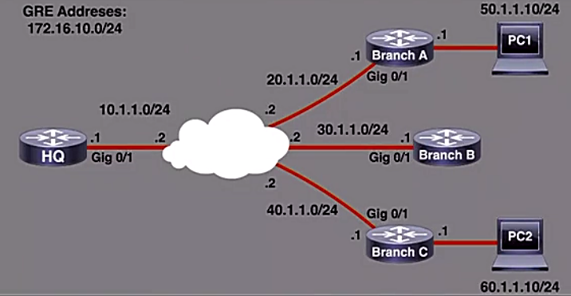

# DMVPN

Trainer: Charles Judd


- Demo: DMVPN
  - topology: 

    <figure style="margin: 0.5em; display: flex; justify-content: center; align-items: center;">
      
    </figure>

  - HQ router: DMVPN hub connected to Internet to 3 branches
  - Branches A, B & C: DMVPN spokes
  - ISP: acting as a public Internet
  - EIGRP: hub router (HQ) and 3 branch routers (A, B, C)
  - hub-and-spoke adding GRE address space (172.16.10.0/24)
  - private network and EIGRP added to connect to PCs
  
- Demo: ISP configuration as a public Internet

  ```cisco
  ISP# sh run  begin interface
  interface GigbitEthernet0/0
    ip address 10.255.2.23 255.255.0.0
  interface GigbitEthernet0/1
    description ISP to HQ
    ip address 10.1.1.2 255.255.255.0
  interface GigbitEthernet0/2
    description ISP to Branch-A
    ip address 20.1.1.2 255.255.255.0
  interface GigbitEthernet0/3
    description ISP to Branch-B
    ip address 30.1.1.2 255.255.255.0
  interface GigbitEthernet0/1
    description ISP to Branch-C
    ip address 40.1.1.2 255.255.255.0
  ```

- Demo: config HQ router as DMVPN hub
  - HQ default route: `HQ# sh ip route static` $\to$ `S* 0.0.0.0/0 [1/0] via 10.1.1.2`
  - using GRE encapsulation
  - create tunnel intf: `HQ(config)# int tunnel 0`
  - set tunnel source: `HQ(config-if)# tunnel source gig 0/1` $\gets$ not IP address to prevent from changing
  - set intf a multipoint tunnel: `HQ(config-if)# tunnel gre multipoint`
  - set tunnel IP addr: `HQ(config-if)# ip addr 172.16.10.1 255.255.255.0`
  - bring up intf: `HQ(config-if)# no shut`
  - enable next-hop protocol on tunnel : `HQ(config-if)# ip nhrp network-id 1`
    - allowing spokes to query info of other spoke via HQ router
    - DMVPN connection able to be initiated btw spokes themselves
    - `nhrp`: originally designed for NBMA network, such as Frame Relay or ATM
    - `network-id`:
      - NBMA (Non-Broadcast Multiple Access) network identifier
      - matching the network identifier on hub and spokes
  - config tunnel key: `HQ(config-if)# tunnel key 123`
    - defined both on hub and spokes
    - used to correctly identify DMVPN virtual tunnel if if multiple tunnel ifs existed
  - config password string for authentication: `HQ(config-if)# ip nhrp authentication cisco`
  - (optional) config multicast support: `HQ(config-if)# ip nhrp map multicast dynamic`
  - (optional) config mtu size: `HQ(config-if)# ip mtu 1400`
  - (optional) config max segment size: `HQ(config-if)# ip tcp adjust-mss 1360` $\get$ rule of thumb: no less than 40 bytes
  - ensure EIGRP to correctly advertise routes over the GRE tunnel: `HQ(config-if)# no ip next-hop-self eigrp 1`
    - `1`: autonomous system (AS)
  - config to remain original IP addr: `HQ(config-if)# no ip split-horizon eigrp 1`
    - HQ learning route from Branch-C and advertised to Branch-A
    - ensuring HQ router no replacing next hop addr w/ its own IP address
    - using tunnel IP address of Branch-C as the next hop
    - ensuring EIGRP advertisement back out of them same if on where received
  - end config: `HQ(config-if)# end`


- Demo: config Branch-A DMVPN spoke
  - check ifs on Branch-A router: 

    ```cisco
    Branch-A# sh int | begin
    interface GigbitEthernet0/0
      ip address 10.255.2.24 255.255.0.0
    interface GigbitEthernet0/1
      description Branch-A to ISP
      ip address 20.1.1.1 255.255.0.01
    interface GigbitEthernet0/2
      description Branch-A to ISP
      ip address 50.1.1.1 255.255.0.0
    ! defult route
    ip route 0.0.0.0 0.0.0.0 20.1.1.1
    ```
      
  - config tunnel if: `Branch-A(config)# int tun 0`
  - config the source if: `Branch-A(config-if)# tun source gig 0/1`
  - config the tunnel mode w/ multipoint GRE: `Branch-A(config-if)# tunnel mode grep multipoint`
  - set IP addr: `Branch-A(config-if)# ip addr 172.16.10.2 255.255.255.0`
  - bring up if: `Branch-A(config-if)# no shut`
  - match HQ router for NBMA: `Branch-A(config-if)# ip nhrp network-id 1`
  - set tunnel key: `Branch-A(config-if)# tunnel key 123`
  - set tunnel authentication: `Branch-A(config-if)# tunnel nhrp authentication cisco`
  - (optional) config to support multicast w/ designated IP address: `Branch-A(config-if)# ip nhrp map multicast 10.1.1.1`
    - different from HQ w/ `dynamic` option
    - using the physical IP addr that pointing to the globally routable addr of the HQ router itself, i.e. NBMA addr of HQ router
  - config to map the GRE tunnel w/ NBMA addr: `Branch-A(config-if)# ip nhrp map 172.16.10.1 10.1.1.1`
    - a manual mapping to reach the GRE tunnel if of the HQ router, 172.16.10.1
    - static addr associated w/ the NBMA addr of the HQ router at 10.1.1.1.1
  - specify the next hop server for spoke: `Branch-A(config-if)# ip nhrp nhs 172.16.10.1`
  - (optional) config mtu size: `Branch-A(config-if)# ip mtu 1400`
  - (optional) config max segment size: `Branch-A(config-if)# ip tcp adjust-mss 1360`
  - end config: `Branch-A(config-if)# end`
  - EIGRP adjacency and new runnel established


- Demo: config Branch-B spoke

  ```cisco
  Branch-B(config)# int tun 0
  Branch-B(config-if)# tun source gig 0/1
  Branch-B(config-if)# tunnel mode grep multipoint
  Branch-B(config-if)# ip addr 172.16.10.3 255.255.255.0
  Branch-B(config-if)# no shut
  Branch-B(config-if)# tunnel key 123
  Branch-B(config-if)# tunnel nhrp authentication cisco
  Branch-B(config-if)# ip nhrp network-id 1
  Branch-B(config-if)# ip nhrp map multicast 10.1.1.1
  Branch-B(config-if)# ip nhrp map 172.16.10.1 10.1.1.1
  Branch-B(config-if)# ip nhrp nhs 172.16.10.1
  Branch-B(config-if)# ip mtu 1400
  Branch-B(config-if)# ip tcp adjust-mss 1360
  ```


- Demo: config Branch-C spoke

  ```cisco
  Branch-B(config)# int tun 0
  Branch-B(config-if)# tun source gig 0/1
  Branch-B(config-if)# tunnel mode grep multipoint
  Branch-B(config-if)# ip addr 172.16.10.3 255.255.255.0
  Branch-B(config-if)# no shut
  Branch-B(config-if)# tunnel key 123
  Branch-B(config-if)# tunnel nhrp authentication cisco
  Branch-B(config-if)# ip nhrp network-id 1
  Branch-B(config-if)# ip nhrp map multicast 10.1.1.1
  Branch-B(config-if)# ip nhrp map 172.16.10.1 10.1.1.1
  Branch-B(config-if)# ip nhrp nhs 172.16.10.1
  Branch-B(config-if)# ip mtu 1400
  Branch-B(config-if)# ip tcp adjust-mss 1360
  Branch-B(config-if)# end
  ```

- Demo: verification on DMVPN configuration

  ```cisco
  ! verification
  Branch-C# sh dmvpn
  Interface: Tunnel0, IPv4 NHRP Details
  Type: Spoke, NHRP Peers: 1

  # Ent  Peer NBMA Addr Peer Tunnel Add State IpDn Tm Attrb
  ----- --------------- --------------- ----- ------- -----
      1 10.1.1.1            172.16.10.1    UP 00:00:38    
  
  Branch-C# sh ip nhrp
  172.16.10.1/32 via 172.16.10.1
    Tunnel0 created 00:01:18, never expire
    Type: static, Flags: used
    NBMA address: 10.1.1.1

  !---- PC2 ------
  PC2# traceroute 50.1.1.10
  Type escape sequence to abort.
  Tracing the route to 50.1.1.10
  VRF info: (vrf in name/id, vrf out name/id)
    1 60.1.1.1 6 msec 20 msec 9 msec
    2 172.16.10.1 31 msec
      172.16.10.2 14 msec 13 msec
    3 50.1.1.10 12 msec 14 msec
  
  PC2# traceroute 50.1.1.10
  Type escape sequence to abort.
  Tracing the route to 50.1.1.10
  VRF info: (vrf in name/id, vrf out name/id)
    1 60.1.1.1 6 msec 20 msec 9 msec
    2 172.16.10.2 14 msec 13 msec   <-- dynamic route created
    3 50.1.1.10 12 msec 14 msec

  ! ---- Branch-C -----
  Branch-C# sh ip 
  172.16.10.1/32 via 172.16.10.1  <-- original tunnel, static config
    Tunnel0 created 00:04:44, never expire
    Type: static, Flags: used
    NBMA address: 10.1.1.1
  172.16.10.1/32 via 172.16.10.2  <-- dynamic route established, expired
    Tunnel0 created 00:02:27, expire 00:07:31
    Type: dynamic, Flags: router nhop
    NBMA address: 20.1.1.1    <-- DMVPN established
  ```


