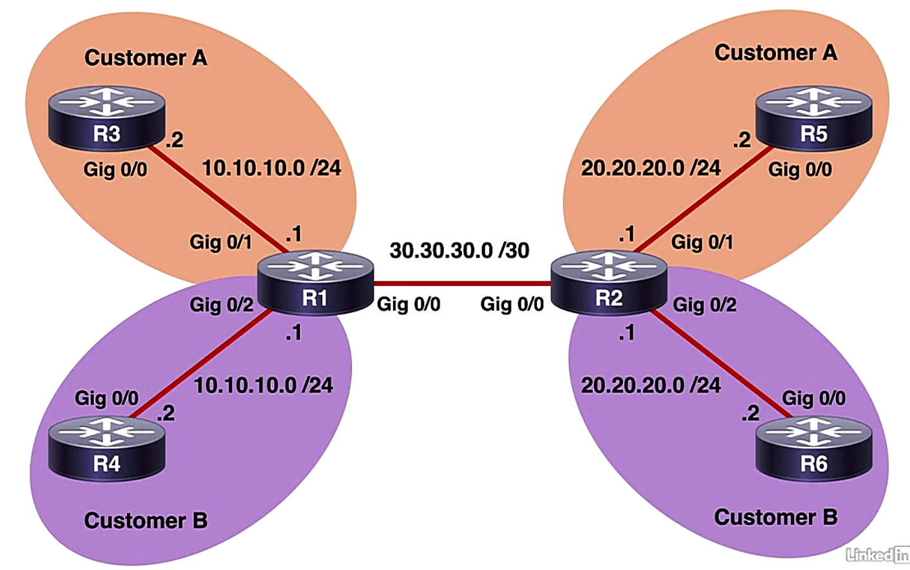
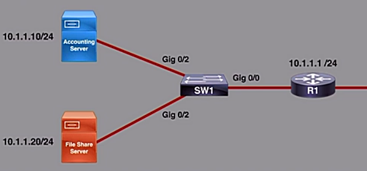

# Network Security

## IPS and firewall solutions


- Next Generation Firewall (NGFW)
  - Cisco ASA (Adaptive Secure Appliance) family
    - Traditional Layer 3 firewall
    - VPN termination point
  - FirePOWER module
    - ASA 5500-X Models w/ FirePOWER
      - FirePOWER module introduced in 2013
      - FirePOWER available in many high end firewall, used in service providers and data centers
      - standalone FirePOWER appliances, such as the FirePOWER 1000 series
    - brining "next-generation" features to the ASA
    - features including IDS/IPS, appliance control, URL filtering, access control, Cisco AMP (Advanced Malware Protection), etc.
  - Cisco FirePOWER Threat Defence (FTD)
    - unified software solution for ASA and FirePOWER, such as Cisco ASA 5500-X models
    - dedicated appliances, such as the 1000, 2100, 41200, and 9000 series FirePOWER
    - designed use cases for various models
    - including Snort IPS, an open source IPS and capable of real-time traffic analysis and logging features


- Traditional IPS issues
  - requiring more management than NGIPS
  - creating large amount of data that can be difficult to correlate
  - no perspective into the existence of vulnerabilities, simply monitor for attempts to exploit a vulnerability


- Nex Generation IPS (NGIPS)
  - layer 7 visibility
  - automated tuning and recommendations
  - more thorough perspective into network traffic, e.g. file passing btw two hosts
  - better user identify management


- Cisco FirePOWER Management Center (FMC)
  - central management of multiple solutions
    - application control
    - intrustion prevention
    - URL filtering
    - malware protection
  - complete visibility into the network
    - network
    - applications
    - hots, mobile devices
    - files
    - threats
    - vulnerabilities


## Deployment models and architectures


- Baasic deployment modes
  - routed firewall mode
  - transparent firewall mode


- Routed firewall mode
  - firewall seen as a hop in the network
  - deafult mode w/ Cisco ASA firewall
  - each interface connecting to a different subnet
  - allowing for separation and protection of subnets
  - commonly using Network Address Translation (NAT)


- Transparent firewall mode
  - firewall not seen as a hop in the network
  - siting btw LAN and next-hop device (router)
  - inspecting L2 traffic

- Routed mode ASA firewall (left diagram)
  - Inside network: connected to internal users
  - DMZ: containing some outside facing services or web servers
  - outside zone: connected to public Internet
  - firewall acting as a next-hop device btw these subnets
  - demo: internal user going to reach public internet
    - ASA allowing traffic based on the security policies
    - translating internet IP addr (110.1.1.40) to outside addr (209.165.201.50)
    - internal traffic forwarded to outside public Internet
    - response likewise allowed to back through the ASA since the session established
    - ASA reversing the NAT and forwarding back to inside user


- Transparent mode ASA firewall (right diagram)
  - ASA connected to internal LNA
  - intrfaces bridged to transparent forward traffic btw connected devices
  - working completely at layer 2
  - bridge firewall


<div style="margin: 0.5em; display: flex; justify-content: center; align-items: center; flex-flow: row wrap;">
  <a href="url" ismap target="_blank">
    
    
  </a>
</div>


- **Bridge Group** in transparent mode
  - virtual intf grouping one ore more intfs
  - Bridge Virtual intf (BVI)
    - each group conaining a BVI
    - IP address assigned used as the source for packets orginating from the bridge group
  - BVI sharing w/ local subnet
  - multiple groups providing traffic isolation


- Security context
  - partitioning a physical firewall into multiple virtual instances
  - separaring functionality of all firewall and IPS featrues
  - contexts able to use mixed modes


- Cisco FirePOWER Threat Defence (FTD)
  - routed and transparent modes
  - six different interface modes
  - firewall and IPS able to operate on different interfaces


- Cisco FirePOWER Interface Modes

  <table style="font-family: Arial,Helvetica,Sans-Serif; margin: 0 auto; width: 750px;" cellspacing=0 cellpadding=5 border=1 align="center">
    <colgroup>
      <col style="width: 5%">
      <col style="width: 5%">
      <col style="width: 5%">
      <col style="width: 30%">
    </colgroup>
    <thead>
    <tr style="font-size: 1.1em; vertical-align: middle;">
      <th scope=row style="text-align: center;">FTD Interface Mode</th>
      <th scope=row style="text-align: center;">FTD Deployment Mode</th>
      <th scope=row style="text-align: center;">Traffic Drop</th>
      <th scope=row style="text-align: center;">Notes</th>
    </tr>
    </thead>
    <tbody>
    <tr style="vertical-align:middle">
      <td style="text-align: center;">Routed</td>
      <td style="text-align: center;">Routed</td>
      <td style="text-align: center;">Yes</td>
      <td style="padding-left: 5px;"><ul><li>inherited from ASA</li></ul></td>
    </tr>
    <tr style="vertical-align:middle">
      <td style="text-align: center;">Switched (BVI)</td>
      <td style="text-align: center;">Transparent</td>
      <td style="text-align: center;">Yes</td>
      <td style="padding-left: 5px;"><ul><li>inherited from ASA</li></ul></td>
    </tr>
    <tr style="vertical-align:middle">
      <td style="text-align: center;">Inline Pair</td>
      <td style="text-align: center;">Routed or Transparent</td>
      <td style="text-align: center;">Yes</td>
      <td style="padding-left: 5px;"><ul><li>binding incoming and outgoing interfaces</li><li>traffic inspected wither transmitted to dropped based on the policy</li><li>only to drop packet actively</li></ul></td>
    </tr>
    <tr style="vertical-align:middle">
      <td style="text-align: center;">Inline Pair w/ Tap</td>
      <td style="text-align: center;">Routed or Transparent</td>
      <td style="text-align: center;">No</td>
      <td style="padding-left: 5px;"><ul><li>two physical interfaces bridged internally</li><li>a copy of each packet made for inspection</li><li>traffic flow undisturbed</li><li>ability to significantly impact FTD performacne</li></ul></td>
    </tr>
    <tr style="vertical-align:middle">
      <td style="text-align: center;">Passive</td>
      <td style="text-align: center;">Routed or Transparent</td>
      <td style="text-align: center;">No</td>
      <td style="padding-left: 5px;"><ul><li>not prevent attacks</li><li>passively listening to the traffic</li></li>typically connected to switch span port</li><li>span port mirroring traffic to the IPS device</li></ul></td>
    </tr>
    <tr style="vertical-align:middle">
      <td style="text-align: center;">Passive (ERSPAN)</td>
      <td style="text-align: center;">Routed</td>
      <td style="text-align: center;">No</td>
      <td style="padding-left: 5px;"><ul><li>newer implementation of span feature</li><li>using GRE encapsulation</li><li>GRE tunnel established btw capture point and Cisco FTD</li></ul></td>
    </tr>
    </tbody>
  </table><br/>


- High Availability (Failover) Deployment
  - active-active failover: ASA
  - active-standby failover: ASA and FTD


- Failover Deployment Requirements
  - identical firewall mode
  - identical software version
  - identical NTP configuration and synchronization
  - no DHCP configuration on interface
  - Cisco FTD devices sharing same group in FirePower Management Center


- Clustering
  - multiple standalone devices acting as a single, logical unit
  - only supported on specific ASA and FTD models


## Device hardening


- Physical security
  - locked areas w/ controlled access
  - logging of access to the physical room
  - temperature and humidity control
  - redundant power sources (UPS)


- Cisco guide to harden devices
  - document: [Cisco Guide to Harden Cisco IOS Devices](https://www.cisco.com/c/en/us/support/docs/ip/access-lists/13608-21.html)
  - document id: 13608
  - main contents
    - management plane
    - control plane
    - data plane


- Network zones
  - define network zones w/ access considerations
  - traffic security policies: allowing specific traffic w/ given segment(s)
  - least privilege principles: minimal access


- Routing protocol authentication
  - protect from traffic redirection and DoS attacks
    - OSPF: most widely used interior gateway protocol
    - RIPv2 & EIGRP also used
  - implement protocols to support authentication


- Authentication, Authorization, and Accounting (AAA)
  - tracing access to network
  - determining allowed actions
  - NTP synchronization
  - standardized methods such as RADIUS and TACACS+


- Security policy
  - outlining rules for network access
  - determining security policies and how they are enforced
  - architecture and security considerations
  - employee usage policies, web-browsering usage, password standards, email policies, etc.
  - keep regularly updated


## Device management security


- Device management security
  - protecting the management plane of a device
  - system configuration and acccess policies
  - considerations for any messages to or from the device, such as OS and system status


- Strong passwords
  - implementing strong password standards
  - remove default password configurations


- Authentication, Authorization, and Accounting (AAA)
  - control authentication through login credentials
  - creating audit trials of network activity
  - login password retry lockout


- Role-Based Access Control (RBCA)
  - custom privileges through AAA
  - least privilege principle


- Management protocols
  - using encrypted methods for management
  - common methods including SSH and HTTPS
  - plan-text methods should employ VPN technology


- Logging and monitoring
  - viewing configuration changes for each user
  - historically viewing systems problems or failures
  - SNMPv3 providing authentication and encryption
  - NTP synchronization across devices (v3 or v4)
  - NTPv4 supporting IPv4 and IPv6 w/ faster sync time


- Device system files
  - protect startup configuration and IOS image
  - Cisco IOS resilient configuration
    - primary boot set: a secure copy of working and startup configuration
    - unable to be removed by remote user but physically disabled via console session


## NetFlow


- NetFlow overview
  - Cisco propriety
  - collecting IP traffic info
  - identifying 
    - network bottleneck areas
    - effects of policy changes and new applications
    - unauthorized / problematic traffic, such as media streaming, WAN traffic
    - security vulnerabilities and anomalies
  - capturing traffic fingerprint on ingress and/or egress
    - traffic w/ common traffic attributes grouped int a flow
    - placing Netflow cache into database


- IP flow
  - unidirectional traffic
  - packet 'fingerprint' collected by Netflow
  - similar packets grouped together into a flow record


- Attributes of Netflow cache
  - IP source and destination address
  - source and destination port
  - Layer 3 protocol type
  - router or switch interface
  - Type of Service (ToS)


- Records in Netflow cache
  - traffic attributes condensed and placed into database on the router
  - statistics of packets: number of packets, total number of bytes


- Accessing Netflow cache
  - CLI w/ show command
    - immediate info for troubleshooting
    - limited info not for long-term observation
  - Netflow collector: primary way to view info


- Netflow collector:
  - receive, intercept, and store flow records
  - data analaysis and correlation features


- Device and Netflow collector
  - exportor bundling 30-50 similar flows
  - flow data transported ove UDP to collector
  - providing real-time and historical data


- Variation and versions of Netflow
  - version 5
    - most popular version due to wide compatibility
    - using a fixed data format
  - version 9
    - most recent version w/ added security and analysis
    - using a dynamic data format w/ templates
  - Flexible Netflow
    - Cisco enhancement for more focused collection
    - using multiple flow monitors on the same traffic
      - flow monitor: a module actually examines the traffic and what to collect
      - exportter: used to export the collected data to Netflow collector
      - example: a security team to monitor anomalies and an infrastructure team to observe bandwidth utilization
    - multiple flow policies sseparating data output


## SNMPv3


- Simple Network Management Protocol (SNMP)
  - allowing for monitoring of managed devices
  - featrues
    - detecting issues and fault early $\gets$ alerts or notifications
    - monitoring device throughput: inbound and outbound
    - remote configuration and control
  - components
    - SNMP manager
    - SNMP agent


- SNMP manager
  - polling devices to obtain info and alerts
  - typically a central software application
  - option for email/SMS alerts to administrators
  - polling over UDP port 161 by default


- SNMP agent
  - process running on a monitored device
  - info sent as a response to polling
  - able to send unsolicited message (traps) in case of emergency
  - info sent over UDP port 162 by default


- Management Information Base (MIB)
  - hierarchical database structure
  - containing object identifier (OID)
    - each OID representing a variable able to be read or set via SNMP
    - e.g. an OID in the MIB relayted a number of frames transited a particular interface
  - OIDs help identify relevant SNMP info


- Types of SNMP manager polling
  - get-request: requesting a specific IOD
  - get-next-request: requesting subsequent info after the initial request
  - get-bulk-request: requesting entire from MIB
  - set-request: used for remote configuration


- Type of SNMP agent responses
  - get-response: responses to SNMP manager pools
  - trap: data sent w/o receipt requirement
  - inform-request: acknowledgement of data receipt required from the SNMP manager by echoing the request


- SNMP version 3
  - most current version
  - addition of unique EngineID for SNMP devices
  - adding authentication based on MD5 or SHA
  - adding encryption through DES, 3DES, or AES


- SNMPv3 security levels
  - `noAuthNoPriv`: no security features of v3, same as the previous versions (`noauth`)
  - `authNoPriv`: authentication but no encryption (`auth`)
  - `authPriv`: authentication and encryption (`priv`)


- Demo: config SNMPv3
  - topology: SNMP Manager (IP = 50.1.1.5) <-> R1 as SNMP agents (IP = 10.1.1.5, 20.1.1.5)
  - defining SNMP server group:
    - creating security policies to apply to various users
    - any user assigned to a particular server group by attaching the security policy
  - config and verify R1 ACL:

    ```bash
    R1(config)#ip access-list standard 1
    R1(config-std-nacl)#permit 10.1.1.5
    R1(config-std-nacl)#permit 20.1.1.5

    R1# sh ip access-list
    Standard IP access list 1
      10 permit 10.1.1.5
      20 permit 20.1.1.5
    ```

  - dispaly MIB of SNMP manager: `R1# sh snmp mib` $\to$ a long list, e.g. `ifInErrors` for intf input errors
    - unable to display MIB prior to any SNMP config
  - define SNMP MIB view for user: `R1(config)# snmp-server view helpdesk ifInErrors included`
    - specify what to collect
    - `ifInErrors`: MIB OID
    - `included`: MIB family is included in the view
    - no `view <WORD>` in `snmp-server` cmd $\to$ all users able to see
  - define a user security model group: `R1(config)# snmp-server group admin v3 priv read helpdesk access 1`
    - `admin`: group name `<WORD>`
    - `priv`: `authPriv` security level
    - `read`: specifying a read view for the group
    - `access 1`: specifying an access-list associated to the group
  - define a user who can access the SNMP engine: `R1(config)# snmp-server user charles admin v3 auth sha cisco priv aes 256 security access 1`
    - `auth aes 256 security`: authentication parameters for the user and using 256 bit AES algorithm for encryption w/ `security` as privacy password
    - `priv sha cisco`: encryption parameters for the user and using `sha` encryption method w/ `cisco` as authentication password
    - `access 1`: specifying an access-list associated w/ this group
  - specify hosts to receive SNMP notification: `R1(config)# snmp-server host 50.1.1.5 informs version 3 priv charles`
    - `infoms`: send Inform messages to this host, both inform & traps
    - `traps`: send trap messages to this host, older option
    - options able to be specified what traps to observe; none $\to$ all the traps
  - verify SNMP settings

    ```bash
    R1# sh snmp eng
    Local SNMP engineId: 8000000903005000000010000
    Remote Engine ID          IP-Addr     Port

    R1# sh snmp user
    User name: charles
    Engine ID: 8000000903005000000010000
    storage-type: nonvolatile     active access-list: 1
    Authentication Protocol: SHA
    Privacy Protocol: AES256
    Group-name: admin
    ```

    ```bash
    R1# sh snmp group
    ...
    groupname: admin                      security model: v3 priv
    contextname: <no context specified>   storage-type: nonvolatile
    readview: helpdesk                    writeview: <no writeview specified>
    notifyview: *tv.FFFFFFF.FFFFFFFF.FFFFFFFFF.F
    row status: active      access-list: 1
    ```


## Role-based CLI access


- Role-based CLI access
  - define different IOS view on a per-user bassis
  - define available commands on a per-user basis
  - a.k.a. 'CLI views' or 'parser views'


- Root parser view
  - default view
  - no restriction on viewing or configuring
  - other view configure from root view


- Demo: config role-based cli access on a router
  - verify AAA enabled in router device: `R1# enable view root` $\to$ `%AAA must be configured`
  - enable AAA: `R1(config)# aaa new-model`
  - ensure password set before change out root view, otherwise, admin lockouts the device
  - create a new parser view: `R1(config)# parser view helpdesk`
    - `superview` (optiona): a combination of multiple views, used if several views set up
  - config secret key for current view: `R1(config-view)# secret cisco`
  - config commands allowed for the view: `R1(config-view)# command <cmd> <opt1> <opt2>`
    - `<cmd>`: all command available in IOS
    - `<opt1>`: 3 options  - `exclude`, `include`, `include-exclusive` - include in this view but exclude from others
    - `<opt2>`: specifying the command options of `<cmd>`
    - e.g., `R1(config-view)# command exec include configure terminal` $\gets$ only `configure terminal` option in `exec` command including in the view `helpdesk`
  - verify the setting

    ```bash
    R1# enable view helpdesk
    Password: <cisco>

    R1# sh parser view
    Current view is 'helpdesk'

    R1# conf t
    R1(config)# int gig 0/0
                ^
    % Invalid input detected at '^' marker.

    R1(config)# end
    ```

  - add the cabability of the view `helpdesk`

    ```bash
    R1# enable view root
    Password: *******

    R1# sh parser view
    Current view is 'root'

    R1# conf t
    R1(config)# parser view helpdesk
    R1(config-view)# commands configure terminal include all interface
    R1(config-view)# end
    R1# enable view helpdesk
    Password: <cisco>

    R1# sh parser view
    Current view is 'root'

    R1# config t
    R1(config)# int gig 0/0
    R1(config-if)# ip addr 10.1.1.1
                   ^
    % Invalid input detected at '^' marker.
    R1(config-if)# shut
                   ^
    % Invalid input detected at '^' marker.

    R1(config-if)# end
    ```

  - create a view and assign a user to the view

    ```bash
    R1# enable view root
    Password: *******

    R1# sh parser view
    Current view is 'root'

    R1# conf t
    R1(config)# parser view helpdesk2
    R1(config-view)# secrete cisco
    R1(config-view)# command exec include show version
    R1(config-view)# exit
    R1(config)# username charles view helpdesk2 secret scor
    R1(config)# end
    R1# logout

    Username: charles
    Password: <scor>
    ```

    ```bash
    R1> en
    Password: <scor>
    R1# sh parser view
    Current view is 'charles'
    ```


## NTP with authentication


- Demo: config NTP authentication
  - topology: R1 <-> NTP
    - subnet: 10.1.1.0/24
    - R1: G0/0 w/ .1
    - NTP server: .50
  - NTP server settings: NTP Service = On; Authentication = Enable; Key = 1; Password = cisco
  - display current time on R1: `R1# sh clock`
    - result: `*0:5:58.613 UTC Mon Mar 1 1993`
    - `*`: indicating time is not authoritative
  - display more time info: `R1# sh clock detail` $\to$ Time source is hardware calendar (local clock)
  - manually set clock: `R1# clock set 12:00:00 1 jan 2020`
  - verify time setting: `R1# sh clock` $\to$ `12:0:7:578 UTC Wed Jan 1 2020`
  - display more time info: `R1# sh clock detail` $\to$ Time source is user configuration
  - config NTP server: `R1(config)# ntp server 10.1.1.50`
  - verify NTP info:
    - `stratum`: higher value means less trusted

    ```bash
    R1(config)# do sh ntp status
    Clock is unsynchronized , stratum 16, no reference clock
    ...
    interval is 4, never expire
    ```

  - verify time w/ NTP server relation

    ```bash
    R1(config)# do sh ntp association
    address       ref clock     st  when  pool  reach   delay     offset
    disp  
     ~10.1.1.50   0.0.0.5       16  -     64    0       0.00      0.00
    16000.00
     * system peer, # selected, + candidate, - outlyer, x falseticker, ~ configured
    ```

  - config authentication key (multiple keys allowed): `R1(config)# ntp authentication-key 1 md5 cisco`
  - specify which key using for the NTP server: `R1(config)# ntp trusted-key 1`
  - end config: `R1(config)# end`
  - wait for time synchronization
  - verify time synchronization
    - R1 w/ stratum = 2; NTP w/ stratum = 1

    ```bash
    R1# sh ntp status
    Clock is synchronized , stratum 2, reference is 10.1.1.50
    ...
    interval is 4, last update was 12 sec ago

    R1# sh clock
    8:41:29.970 UTC Wed Nov 25 2020

    R1# sh ntp association
    address       ref clock     st  when  pool  reach   delay     offset
    disp  
    *~10.1.1.50   127.127.1.1   1   7     16    3       0.00      0.00
    0.12
     * system peer, # selected, + candidate, - outlyer, x falseticker, ~ configured
    ```


## VLANs


- Virtual Local Area Network (VLAN)
  - logically group devices into broadacast domains
  - adding flexibility and security in a network design
  - ability to span multiple switches


- Types of VLAN connections
  - access mode interface
    - belonging to a single VLAN
    - end device connections using access mode
    - default mode, also called 'untagged port'
  - trunk mode interface
    - not assigned to a specific VLAN
    - carrying traffic from multiple designated VLANs
    - tagged port
    - tagged by ISL or 802.1q


- Native VLAN
  - used exclusively w/ 802.1q
  - set to VLAN 1 by default
  - native VLAN traffic untagged
  - best security pratice: change Native VLAN value
    - VLAN 1 as a well known security hole
    - e.g., exploited w/ VLAN hopping attacks


- Dynamic Trunking Protocol (DTP)
  - allowing switches to negotiate trunks
  - default mode: _dynamic auto_
    - intf willing to become a trunk
    - not actively initiating the formation of trunk
    - not actively sending DTP frames to the other side of a trunk to create a trunk
    - once receiving a DTP msg from peer $\to$ willing to negotiate a trunk
  - _dynamic desirable_ mode: working actively to initate a trunk

  <figure style="margin: 0.5em; display: flex; justify-content: center; align-items: center;">
    
  </figure>


- Demo: VLAN config
  - topology and settings: 

    <figure style="margin: 0.5em; display: flex; justify-content: center; align-items: center;">
      
    </figure>


- Demo: config access port VLAN on SW2/SW3
  - `name <WORD>`: identify VLAN w/ name
  - `switchport mode access`: access port, only one VLAN allowed
  - `switchport access vlan NO`: assign VLAN `NO` to the interface

    ```bash
    SW2(config)# vlan 10
    SW2(config-vlan)# name SCOR10
    SW2(config-vlan)# vlan 20
    SW2(config-vlan)# name SCOR20 
    SW2(config-vlan)# vlan 30
    SW2(config-vlan)# name SCOR30
    SW2(config-vlan)# int gig 0/1
    SW2(config-if)# switchport mode access      
    SW2(config-if)# switchport access vlan 10
    SW2(config-if)# int gig 0/2
    SW2(config-if)# switchport mode access
    SW2(config-if)# switchport access vlan 20
    SW2(config-if)# int gig 0/3
    SW2(config-if)# switchport mode access
    SW2(config-if)# switchport access vlan 30
    SW2(config-if)# end
    ```

    ```bash
    ! verify VLAN settings
    SW2# sh vlan br
    VLAN name         Status    Ports
    ---- -----------  --------- ---------------------------------
    1    default      active    Gi0/0, Gi1/0, Gi1/1, Gi1/2, Gi1/3
    10   SCOR10       active    Gi0/1
    20   SCOR20       active    Gi0/2
    30   SCOR30       active    Gi0/3
    ...
    ```

  - apply same config to SW3


- Demo: config trunk ports VLAN on SW1
  - `switchport trunk encapsulation dot1q`: 802.1Q encapsulation, other option `isl`
  - `switchport mode dynamic desirable`: interface initiate trunk formation

    ```bash
    SW1(config)# vlan 10
    SW1(config-vlan)# name SCOR10
    SW1(config-vlan)# vlan 20
    SW1(config-vlan)# name SCOR20
    SW1(config-vlan)# vlan 30
    SW1(config-vlan)# name SCOR30
    SW1(config-vlan)# end
    ```

    ```bash
    ! show the initial setting on the interface
    SW1# sh int gig 0/0 switchport
    Name: Gig0/0
    Switchport: Enabled
    Administrative Mode: dynamic auto
    Operation Mode: static access
    Administrative Trunking Encapsulation: negotiate
    Operational Trunking Encapsulation: native
    ...
    ```

    ```bash
    ! config the intfs as trunk intfs
    SW1# conf t
    SW1(config)# int range gig 0/0-1
    SW1(config-if-range)# switchport trunk encapsulation dot1q
    SW1(config-if-range)# switchport mode dynamic desirable
    SW1(config-if-range)# end
    ```

    ```bash
    ! verify settings
    SW1# sh int gig 0/0 switchport
    Name: Gig0/0
    Switchport: Enabled
    Administrative Mode: dynamic desire
    Operation Mode: trunk
    Administrative Trunking Encapsulation: dot1q
    Operational Trunking Encapsulation: dot1q
    ...
    ```

    ```bash
    !SW1# sh int trunk
    port    Mode        Encapsulation   Status    Native vlan
    Gi0/0   desirable   802.1q          trunking  1
    Gi0/1   desirable   802.1q          trunking  1

    Port    Vlans allowed on trunk
    Gi0/0   1-4094
    Gi0/1   1-4094
    
    Port    Vlans allowed and active in management domain
    Gi0/0   1,10,20,30
    Gi0/1   1,10,20,30
    
    Port    Vlans in spanning tree forwarding state and not pruned
    Gi0/0   1,10,20,30
    Gi0/1   1,10,20,30
    ```


- Demo: changing native vlan for security purpose
  - config native vlan on SW1
    
    ```bash
    SW(config)# vlan 100
    SW1(config-vlan)# int range gig 0/0-1
    SW1(config-if-range)# switchport trunk native vlan 100
    ! Mismatch messages shown
    ```

  - config native vlan on SW2

    ```bash
    SW2# sh vlan br
    VLAN name         Status    Ports
    ---- -----------  --------- ---------------------------------
    1    default      active    Gi0/0, Gi1/0, Gi1/1, Gi1/2, Gi1/3
    10   SCOR10       active    Gi0/1
    20   SCOR20       active    Gi0/2
    30   SCOR30       active    Gi0/3
    ...

    SW2# conf t
    SW2(config)# vlan 100
    SW2(config-vlan)# int gig 0/0
    SW2(config-if)# switchport trunk native 100
    SW2(config-if)# end

    SW2# sh vlan br
    SW2# sh vlan br
    VLAN name         Status    Ports
    ---- -----------  --------- ---------------------------------
    1    default      active    Gi0/0, Gi1/0, Gi1/1, Gi1/2, Gi1/3
    10   SCOR10       active    Gi0/1
    20   SCOR20       active    Gi0/2
    30   SCOR30       active    Gi0/3
    ...
    ```

  - apply same config for SW3 as SW2
  - verify on SW1 for the settings on SW2 & SW3

    ```bash
    SW1# sh int trunk
    port    Mode        Encapsulation   Status    Native vlan
    Gi0/0   desirable   802.1q          trunking  100
    Gi0/1   desirable   802.1q          trunking  100

    Port    Vlans allowed on trunk
    Gi0/0   1-4094
    Gi0/1   1-4094
    
    Port    Vlans allowed and active in management domain
    Gi0/0   1,10,20,30,100
    Gi0/1   1,10,20,30,100
    
    Port    Vlans in spanning tree forwarding state and not pruned
    Gi0/0   1,10,20,30,100
    Gi0/1   10,20,30
    ```


## VRF-lite


- Virtual Routing and Forwarding (VRF)
  - typically used by service providers
  - used in conjunction w/ Multiprotocol BGP (MP-BGP) and Multiprotocol Label Switching (MPLS)
  - VRF-lite: VRF w/o MP-BGP or MPLS
  - used in small enterprise or data center environments
  - allowing to create multiple routing tables in a single router
  - able to have overlapping IP address schemes


- Demo: simple VRF-lite
  - topology
    - R3 & R5 for Customer A while R4 & R6 for Customer B
    - each customer w/ its own IP address scheme but overlapped
    - R3 ~ R6 IP addressing configured as topology indicated

    <figure style="margin: 0.5em; display: flex; justify-content: center; align-items: center;">
      
    </figure>

  - display R3 intf settings

    ```bash
    R3# sh ip int br
    Interface           IP-Address    OK? Method  Status                Protocol
    GigabitEthernet0/0  10.10.10.2    YES manual  up                    down
    GigabitEthernet0/1  unassigned    YES NVRAM   administratively down down
    ...
    ```

- Demo: define VRF instance on R1 & R2
  - procedure:
    - 1\. create vrf instances: `R(config)# ip vrf VRF_NAME`
    - 2\. enter interface config mode: `R(config)# int g0/1` 
    - 3\. associate vrf w/ interface: `R(config-if)# ip vrf forwarding VRF_NAMR`
    - 4\. assign ip address for the intf: `R(config-if)# ip address <IP_addr> <net_mask>`
    - 5\. bring up interface: `R(config-if)# no shutdown`
  - create VRF instance for Customer A: `R1(config)# ip vrf CUST-A`
  - create VRF instance for Customer B: `R1(config-vrf)# ip vrf CUST-B`
  - verify global routing table: `R1# sh ip route` $\to$ empty
  - verify routing table for CUST-A: `R1# sh ip vrf CUST-A` $\to$ empty
  - verify routing table for CUST-B: `R1# sh ip vrf CUST-B` $\to$ empty
  - enter intf Gi0/1: `R1(config)# int gig 0/1`
  - assign Gi0/1 for CUST-A: `R1(config-if)# ip vrf forwarding CUST-A`
  - assign IP addr: `R1(config-if)# ip addr 10.10.10.1 255.255.255.0`
  - bring up Gi0/1: `R1(config-if)# no shut`
  - enter intf Gi0/2: `R1(config-if)# int gig 0/2`
  - assign Gi0/2 for CUST-B: `R1(config-if)# ip vrf forwarding CUST-B`
  - assign IP addr: `R1(config-if)# ip addr 10.10.10.1 255.255.255.0`
  - bring up Gi0/2: `R1(config-if)# no shut`
  - no error message shown w/ the same IP addresses on both interfaces
  - verify connectivity w/ global routing table: `R1# ping 10.10.10.1` $\to$ `..... Success rate is 0 percentage (0/5)`
  - verify connectivity w/ vrf CUST-A: `R1# ping vrf CUST-A 10.10.10.1` $\to$ `.!!!! Success rate is 80 percentag (4/5)`
  - verify connectivity w/ vrf CUST-B: `R1# ping vrf CUST-B 10.10.10.1` $\to$ `.!!!! Success rate is 80 percentag (4/5)`
  - apply similar config on R2

    ```bash
    R2# config t
    R2(config)# ip vrf CUST-A
    R2(config-vrf)# ip vrf CUST-B
    R2(config-vrf)# do sh ip route
    R2(config-vrf)# do sh ip vrf CUST-A
    R2(config-vrf)# do sh ip vrf CUST-B
    R2(config-vrf)# int gig 0/1
    R2(config-if)# ip vrf forwarding CUST-A
    R2(config-if)# ip addr 20.20.20.1 255.255.255.0
    R2(config-if)# no shut
    R2(config-if)# int gig 0/2
    R2(config-if)# ip vrf forwarding CUST-B
    R2(config-if)# ip addr 20.20.20.1 255.255.255.0
    R2(config-if)# no shut
    ```

- Demo: using sub-intf to setup connectivity btw R1 & R2
  - tasks
    - using sub-intfs to separate traffic
    - each sub-intf w/ its own VLAN ID
    - trunk VLAN w/ 802.1Q encapsulation
  - procedure
    - 1\. create sub-interface: R(config)# int f0/0.1`
    - 2\. enable VLAN trunk w/ encapsulation: `R(config-subif)# encapsulation dot1q VLAN_NO`
    - 3\. associate w/ vrf: `R(config-subif)# ip vrf forwarding VRF_NAME`
    - 4\. assign IP address: `R(config-subif)# ip address <IP_addr> <net_mask>`
    - 5\. bring up interface: `R(config-if)# no shutdown`
  - create and enter Gi0/0 sub-intf: `R1(config)# int gig 0/0.1`
  - config VLAN encapsulation w/ VLAN ID=2: `R1(config-subif)# encapsulation dot1q 2`
  - associate the sub-intf w/ CUST-A: `R1(config-subif)# ip vrf forwarding CUST-A`
  - config IP address: `R1(config-subif)# ip addr 30.30.30.1 255.255.255.252`
  - bring up sub-intf: `R1(config-subif)# no shut`
  - config another sub-intf for CUST-B:

    ```bash
    R1(config-subif)# int gig 0/0.2
    R1(config-subif)# encapsulation dot1q 3
    R1(config-subif)# ip vrf forwarding CUST-B
    R1(config-subif)# ip addr 30.30.30.1 255.255.255.252
    R1(config-subif)# no shut
    ```

  - verify settings

    ```bash
    R1# sh ip int br
    Interface             IP-Address    OK? Method  Status                Protocol
    GigabitEthernet0/0    unassigned    YES NVRAM   administratively down down
    GigabitEthernet0/0.1  30.30.30.1    YES manual  administratively down down
    GigabitEthernet0/0.1  30.30.30.1    YES manual  administratively down down
    GigabitEthernet0/1    30.30.30.1    YES manual  up                    up
    GigabitEthernet0/2    30.30.30.1    YES manual  up                    up
    GigabitEthernet0/3    unassigned    YES NVRAM   administratively down down
    ```

  - enter Gi0/0: `R1(config)# int gig 0/0`
  - bring up intf: `R1(config-if)$ no shut`
  - verify settings again

    ```bash
    R1# sh ip int br
    Interface             IP-Address    OK? Method  Status                Protocol
    GigabitEthernet0/0    unassigned    YES NVRAM   up                    up
    GigabitEthernet0/0.1  30.30.30.1    YES manual  up                    up
    GigabitEthernet0/0.1  30.30.30.1    YES manual  up                    up
    GigabitEthernet0/1    30.30.30.1    YES manual  up                    up
    GigabitEthernet0/2    30.30.30.1    YES manual  up                    up
    GigabitEthernet0/3    unassigned    YES NVRAM   administratively down down
    ```

  - config R2 for sub-intf

    ```bash
    R2(config-subif)# int gig 0/0.1
    R2(config-subif)# encapsulation dot1q 2
    R2(config-subif)# ip vrf forwarding CUST-A
    R2(config-subif)# ip addr 30.30.30.2 255.255.255.252
    R2(config-subif)# no shut
    R2(config-subif)# int gig 0/0.2
    R2(config-subif)# encapsulation dot1q 3
    R2(config-subif)# ip vrf forwarding CUST-B
    R2(config-subif)# ip addr 30.30.30.2 255.255.255.252
    R2(config-subif)# no shut
    R2(config-subif)# int gig 0/0
    R2(config-if)# no shut
    R2(config-if)# end
    ```

  - verification on R2
  
    ```bash
    R2# sh ip int br
    Interface             IP-Address    OK? Method  Status                Protocol
    GigabitEthernet0/0    unassigned    YES NVRAM   up                    up
    GigabitEthernet0/0.1  30.30.30.1    YES manual  up                    up
    GigabitEthernet0/0.1  30.30.30.1    YES manual  up                    up
    GigabitEthernet0/1    30.30.30.1    YES manual  up                    up
    GigabitEthernet0/2    30.30.30.1    YES manual  up                    up
    GigabitEthernet0/3    unassigned    YES NVRAM   administratively down down
    ```


- Demo: verify the routing on R1 w/ VRF settings

  ```bash
  R1# sh ip route
  ! empty

  R1# sh ip route vrf CUST-A

        10.0.0.0/8 is variably subnetted, 2 subnets, 2 masks
  C       10.10.10.0/24 is directly connected, GigabitEthernet 0/1
  L       10.10.10.1/32 is directly connected, GigabitEthernet 0/1
        30.0.0.0/8 is variably subnetted, 2 subnets, 2 masks
  C       30.30.30.0/30 is directly connected, GigabitEthernet 0/0.1
  L       30.30.30.1/32 is directly connected, GigabitEthernet 0/0.1
  ```

  ```bash
  R1# sh ip route vrf CUST-B

        10.0.0.0/8 is variably subnetted, 2 subnets, 2 masks
  C       10.10.10.0/24 is directly connected, GigabitEthernet 0/2
  L       10.10.10.1/32 is directly connected, GigabitEthernet 0/2
        30.0.0.0/8 is variably subnetted, 2 subnets, 2 masks
  C       30.30.30.0/30 is directly connected, GigabitEthernet 0/0.2
  L       30.30.30.1/32 is directly connected, GigabitEthernet 0/0.2
  ```


- Demo: config routing protocol
  - route to R5 of CUST-A unknown (20.20.20.0/24)

    ```bash
    R3# sh ip route

          10.0.0.0/8 is variably subnetted, 2 subnets, 2 masks
    C       10.10.10.0/24 is directly connected, GigabitEthernet 0/0
    L       10.10.10.2/32 is directly connected, GigabitEthernet 0/1
    ```

  - routing protocol required for R3, OSPF used to advertise the route

    ```bash
    R3(config)# router ospf 1
    R3(config-router)# network 10.10.10.0 0.0.0.255 area 1
    ```
  
  - OSPF routing protocol required for other routers
    - all routers: `R?(config)# router ospf 1`
    - R5 advertise network into area 1: `R5(config-router)# network 20.20.20.0 0.0.0.255 area 1`
    - R4 advertise network into area 1: `R4(config-router)# network 10.10.10.0 0.0.0.255 area 1`
    - R5 advertise network into area 1: `R6(config-router)# network 20.20.20.0 0.0.0.255 area 1`

  - config OSPF on R1 on both VRF instances
    - different ospf instances w/ different vrf instances

    ```bash
    R1(config)# router ospf 1 vrf CUST-A
    R1(config-router)# network 10.10.10.0 0.0.0.255 area 1
    R1(config-router)# network 30.30.30.0 0.0.0.3 area 1
    R1(config-touter)# router ospf 2 vrf CUST-B
    R1(config-router)# network 10.10.10.0 0.0.0.255 area 1
    R1(config-router)# network 30.30.30.0 0.0.0.3 area 1
    R1(config-router)# end

    ! verify ospf routing config
    R1# sh run
    ...
    router ospf 1 vrf CUST-A
     network 10.10.10.0 0.0.0.255 area 1
     network 30.30.30.0 0.0.0.3 area 1
    !
    router ospf 2 vrf CUST-B
     network 10.10.10.0 0.0.0.255 area 1
     network 30.30.30.0 0.0.0.3 area 1
    ```

  - config OSPF on R2  w/ similar config

    ```bash
    R2(config)# router ospf 1 vrf CUST-A
    R2(config-router)# network 20.20.20.0 0.0.0.255 area 1
    R2(config-router)# network 30.30.30.0 0.0.0.3 area 1
    R2(config-touter)# router ospf 2 vrf CUST-B
    R2(config-router)# network 20.20.20.0 0.0.0.255 area 1
    R2(config-router)# network 30.30.30.0 0.0.0.3 area 1
    ```

- Demo: verify routing settings w/ OSPF settings
  - display routing table on R1
    
    ```bash
    R1# sh ip route
    ! empty

    R1# sh ip route vrf CUST-A

          10.0.0.0/8 is variably subnetted, 2 subnets, 2 masks
    C       10.10.10.0/24 is directly connected, GigabitEthernet 0/1
    L       10.10.10.1/32 is directly connected, GigabitEthernet 0/1
          20.0.0.0/24 is subnetted, 1 subnets
    O       20.20.20.0 [110/2] via 30.30.30.2, 00:01:46, GigabitEthernet 0/0.1
          30.0.0.0/8 is variably subnetted, 2 subnets, 2 masks
    C       30.30.30.0/30 is directly connected, GigabitEthernet 0/0.1
    L       30.30.30.1/32 is directly connected, GigabitEthernet 0/0.1
    ```

    ```bash
    R1# sh ip route vrf CUST-B

          10.0.0.0/8 is variably subnetted, 2 subnets, 2 masks
    C       10.10.10.0/24 is directly connected, GigabitEthernet 0/2
    L       10.10.10.1/32 is directly connected, GigabitEthernet 0/2
          20.0.0.0/24 is subnetted, 1 subnets
    O       20.20.20.0 [110/2] via 30.30.30.2, 00:02:04, GigabitEthernet 0/0.2
          30.0.0.0/8 is variably subnetted, 2 subnets, 2 masks
    C       30.30.30.0/30 is directly connected, GigabitEthernet 0/0.2
    L       30.30.30.1/32 is directly connected, GigabitEthernet 0/0.2
    ```

  - verify routing table on R3
    - knowing all 3 subnets
    - no knowledge of those VRF instances

    ```bash
    R3# sh ip route

          10.0.0.0/8 is variably subnetted, 2 subnets, 2 masks
    C       10.10.10.0/24 is directly connected, GigabitEthernet 0/0
    L       10.10.10.1/32 is directly connected, GigabitEthernet 0/0
          20.0.0.0/24 is subnetted, 1 subnets
    O       20.20.20.0 [110/3] via 10.10.10.1, 00:03:02, GigabitEthernet 0/0
          30.0.0.0/8 is subnetted, 1 subnets
    O       30.30.30.0/32 [110/2] via 10.10.10.1, 00:0:06, GigabitEthernet 0/0
    ```

  - verify connectivity for CUST-A on R3: `R3# ping 20.20.20.2` $\to$ `!!!!!`


## Port security


- Port security
  - designated max number of MAC addresses allowed on a port
  - static or dynamic MAC assignment
  - protection against attacks (e.g. CAM table overflow)
  - unapproved MAC addresses causing port error


- Security violation modes
  - shutdown (default): port disabled, SNMP tap and syslog messages generated
  - restrict: frame dropped, SNMP trap and syslog msgs generated
  - protect: frame dropped w/o notification


- Demo: config port security
  - topology: PC <-> SW1 (gig 0/0)
  - tasks:
    - dynamic learn address
    - 2 addresses allowed
    - auto recover after 30 secs
  - enter intf: `SW1(config)# int gig 0/0`
  - ensure as an access port: `SW1(config-if)# switchport mode access`
  - enable port security: `SW1(config-if)# switchport port-security`
  - specify max number of allowed MAC addresses: `SW1(config-if)# switchport port-security maximum 2`
  - config dynamic learning MAC addresses (sticky learning): `SW1(config-if)# switchport port-security mac-address sticky`
  - config to shut down port if violated: `SW1(config-if)# switchport port-security violation shutdown`
  - verify config:

    ```bash
    SW1# sh port-security
    Security Port MaxSecureAddr CurrentAddr   SecurityViolation   Security Action
                     (Count)      (Count)           (Count)
    -----------------------------------------------------------------------------
            Gi0/0             2           0                   0          Shutdown
    -----------------------------------------------------------------------------
    Total Addresses in System (excluding one mac per port)     : 0
    Max Addresses limit in System (excluding one mac per port) : 4096
    ```

  - display learned MAC addresses
  
    ```bash
    SW1# sh port-security address

    Vlan  Mac Address  Type                         Ports  Remaining Age
                                                              (mins)
    ----  -----------  ---------------------------- -----  --------------
    ---------------------------------------------------------------------
    Total Addresses in System (excluding one mac per port)     : 0
    Max Addresses limit in System (excluding one mac per port) : 4096
    ```
  
  - display intf enabling port-security

    ```bash
    SW1# sh port-security int gig 0/0
    Port Security              : Enabled
    Port Status                : Secure-up
    Violation Mode             : Shutdown
    Aging Time                 : 0 mins
    Aging Type                 : Absolute
    SecureStatic Address Aging : Disabled
    Maximum MAC Addresses      : 2
    Total MAC Addresses        : 0
    Configured MAC Addresses   : 0
    Sticky MAC Addresses       : 0
    Last Source Address:VLAN   : 0000.0000.0000:0
    Security Violation Count   : 0
    ```


## DHCP snooping


- DHCP snooping
  - layer 2 protection from unauthorized DHCP server
  - trusted and untrusted ports designated
  - DHCP snooping binding database
  - used for Dynamic ARP Inspection (DIA)


- Demo: pre-config for DHCP snooping
  - topology

    <figure style="margin: 0.5em; display: flex; justify-content: center; align-items: center;">
      
    </figure>

  - task: only allow Gi0/0 intf to carry traffic w/ DHCP info
  - DHCP-server: a router to handle DHCP info

    ```bash
    DHCP-Server# sh ip dhcp pool

    Pool DHCP :
     Utilization mark (high/low)    : 100/0
     Subnet size (first/next)       : 0 / 0
     Total addresses                : 254
     Leased addresses               : 0
     Pending event                  : none
     1 subnet is currently in the pool :
     Current index    IP address range            Leased addresses
     10.1.1.1         10.1.1.1     - 10.1.1.254    0
    ```

  - client PC discover DHCP server to obtain IP addr: `VPCS> ip dhcp` $\to$ `DDORA IP 10.1.1.51/24` 
  - display IP address info on client PC

    ```bash
    VPCS> sh ip

    NAME        : VPCS[1]
    IP/MASK     : 10.1.1.51/24
    GATEWAY     : 0.0.0.0
    DNS         : 
    DHCP SERVER : 10.1.1.1
    ...
    ```
  
  - verify DHCP server

    ```bash
    DHCP-Server# sh ip dhcp pool

    Pool DHCP :
     Utilization mark (high/low)    : 100/0
     Subnet size (first/next)       : 0 / 0
     Total addresses                : 254
     Leased addresses               : 1
     Pending event                  : none
     1 subnet is currently in the pool :
     Current index    IP address range            Leased addresses
     10.1.1.52        10.1.1.1     - 10.1.1.254    0
    ```
  
- Demo: config DHCP snooping
  - enable dhcp snooping on SW: `SW(config)# ip dhcp snooping`
  - enable dhcp on a vlan (multiple & range allowed): `SW(config)# ip dhcp snooping vlan 1` $\to$ all intfs untrusted
  - verify untrust status by requesting IP addr again: `VPCS> ip dhcp` $\to$ `DDD\n Can't find dhcp server`
  - enter Gi0/0 config mode: `SW(config)# int gig 0/0`
  - config intf as a trusted port: `SW(config-if)# ip dhcp snooping trust`
    - `trust`: DHCP snooping trust config
  - verify config

    ```bash
    SW# sh ip dhcp snooping
    Switch DHCP snooping is enabled
    Switch DHCP gleaning is disabled
    DHCP snooping is configured on following VLANs:
    1
    ...
    Interface           Trusted   Allow option    Rate limit (pps)
    ------------------- -------   ------------    ----------------
    GigabitEthernet0/0  yes       yes             unlimited
      Custom circuit-ids:
    ```
  
  - verify trust status w/ PC: `VPCS> ip dhcp` $\to$  `DORA IP 10.1.1.51/24`


- Dmo: limit DHCP traffic allowed on ports
  - enter ranged intf config mode: `SW(config)# int range fif 0/1-3`
  - config these intfs: `SW(config-if-range)# ip dhcp snooping limit rate 100`
    - `limit`: DHCP snooping limit
    - `100`: DHCP snooping rate limit, <1-2048>
  - verify dncp snooping config: 

    ```bash
    SW# sh ip dhcp snooping
    Switch DHCP snooping is enabled
    Switch DHCP gleaning is disabled
    DHCP snooping is configured on following VLANs:
    1
    ...
    Interface           Trusted   Allow option    Rate limit (pps)
    ------------------- -------   ------------    ----------------
    GigabitEthernet0/0  yes       yes             unlimited
      Custom circuit-ids:
    GigabitEthernet0/1  no        no              100
      Custom circuit-ids:
    GigabitEthernet0/2  no        no              100
      Custom circuit-ids:
    GigabitEthernet0/3  no        no              100
      Custom circuit-ids:
    ```

  - verify dhcp binding table

    ```bash
    SW# sh ip dhcp snooping binding
    MacAddress          IpAddress       Lease(sec)  Type          VLAN  Interface
    ------------------  --------------  ----------  ------------- ----  --------------------
    00:50:79:66:68:04   10.1.1.51       68238       dhcp-snooping  1     GigabitEthernet0/1
    Total number of bindings: 1
    ```


## Dynamic ARP inspection


- Demo: config DAI
  - topology
    - same as DHCP snooping but adding another client
    - config of DHCP server and SW1 DHCP snooping in place

    <figure style="margin: 0.5em; display: flex; justify-content: center; align-items: center;">
      
    </figure>

  - verify the dhcp snooping binding
  
    ```bash
    SW# sh ip dhcp snooping binding
    MacAddress          IpAddress       Lease(sec)  Type          VLAN  Interface
    ------------------  --------------  ----------  ------------- ----  --------------------
    00:50:79:66:68:04   10.1.1.51       68238       dhcp-snooping  1     GigabitEthernet0/1
    Total number of bindings: 1
    ```

  - DAI preventing from man-in-the-middle attacks and ARP cache poisoning
    - the dhcp snooping db built w/o the 2nd host connected
    - the 2nd host consider having invalid requests as trying to get IP addr
    - Client 1 obtaining IP addr 10.1.1.51 from DHCP server
    - Client 2 w/o IP address now
  - enter SW Gi0/0 port: `SW(config)# int gig 0/0`
  - config the port as DAI trusted port: `SW(config-if)# ip arp inspection trust`
    - already a dhcp snooping trust port
    - the intf potentially sending ARP message w/o corresponding dhcp entry
  - config DAI on vlan 1: `SW(config)# ip arp inspection vlan 1`
  - verify DAI config

    ```bash
    SW# sh ip arp inspection

    Source Mac Validation      : Disabled
    Destination Mac Validation : Disabled
    IP Address Validation      : Disabled

    VLAN    Configuration   Operation   ACL Match   Static ACL
    ----    -------------   ---------   ---------   ----------
       1    Enabled         Active
    
    VLAN    ACl Logging   DHCP logging   Probe logging
    ----    -----------   ------------   -------------
       1    Deny          Deny           Off
         
    VLAN    Forwarded   Dropped  DHCP Drops   ACL Drops
    ----    ---------   -------  ----------   ---------
       1            0         0           0           0
    ...
    ```

  - config Client 2 w/ an IP addr: `VPCS> ip 10.1.1.55` $\to$ `Checking for duplicate address...` & `PC1 : 10.1.1.55 255.255.255.0`
  - SW console messages shown dynamic ARP inspection detected invalid ARP: `...%SW_DAI-4-DHCP_SNOOPING_DENY: 1 Invalid ARPs (Req) on Gi0/2, vlan 1...`
  - verify DAI info again
    - 3 ARP pkts dropped
    - network protected from this unauthorized device (Client 2)
    - no Mac to IP address binding in DHCP Snooping binding DB

    ```bash
    SW# sh ip arp inspection

    Source Mac Validation      : Disabled
    Destination Mac Validation : Disabled
    IP Address Validation      : Disabled

    ...
         
    VLAN    Forwarded   Dropped  DHCP Drops   ACL Drops
    ----    ---------   -------  ----------   ---------
       1            0         3           3           0
    ...
    ```


## Storm control


- Traffic storm
  - excessive packets flooding a network
  - unicast, multicast, broadcast storm
  - most common: broadcast storm


- Storm control
  - L2 security feature
  - monitoring in 1-sec intervals
  - acceptable levels designated in BPS, PPS, or intf bandwidth percentage
  - threshold value determing storm conditions, including rising threshold and failling threshold


- Storm control thresholds
  - rising threshold
    - upper acceptable limit
    - exceeding threshold: storm control taking a designated action
  - failing threshold (optional)
    - indicating when the storm is over
    - no configured $\to$ set to the same value as the rising threshold


- Storm control actions
  - shutdown (error-disable)
  - SNMP trap alert
  - both shutdown and alert


- Storm control mitigation
  - Denial of Service (DoS) protection
  - spanning tree protocol (STP) failure protection


- Demo: config storm control
  - config on per intf basis
  - enter intf eth 1/1: `SW(config)# int eth 1/1`
  - options of all storm control in Nexus SW: `SW(config-if)# storm-control ?`
    - `action`: action on storm control
    - `broadcast`: broadcast addr storm control
    - `multicast`: multicast addr storm control
    - `unicast`: unitcast addr storm control
  - config storm control for broadcast: `SW(config-if)# storm-control broadcast level 30 (10)`
    - `level`: set allowed broadcast traffic level on the interface
    - `30`: storm supression level for rising threshold, `<whole>.<decimal>` as percentage
    - `(10)`: storm supression level for failing threshold, not set here
    - `pps`: storm control  level is specified in packets per second
  - config storm control action as shutdown: `SW(config-if)# storm-control action shutdown`
  - config storm control action as trap: `SW(config-if)# storm-control action trap`
  - verify intf storm control settings

    ```bash
    SW# sh int eth 1/1 counters storm-control

    Port    UcastSupp %   McastSupp %   BcastSupp %   TotalSuppDiscards  Action
              or pps        or pps        or pps
    -------------------------------------------------------------------------------
    Eth1/1       100.00         100.0         30.00                   0     [ST]
    ```

  - verify running config for intf
  
    ```bash
    SW# sh run int
    ...
    interface Ethernet1/1
      storm-control broadcast level 30.00
      storm-control action shutdown
      storm-control action trap
    ...
    ```


## PVLANs


- Private VLANs (PVLANs) overview
  - Layer 2 isolation btw ports in same VLAN
  - example:
    - two servers, accounting and file storeage, in enterprise
    - only whom required to access them based on job duties
    - the servers sharing the same first hop router
    - PVLAN implementation
      - preventing from these servers communicating each other via router in the same IP subnet
      - still isolating traffic btw servers


- Private VLANs (PVLAN) features
  - primary and secondary vlan designation
  - primary vlan: acting as normal vlan
  - secondary vlan modes: isolated or community
    - isolated PVLAN: no communication w/ one another
    - community PVLAN: communicating w/ other community ports inside the PVLAN


- Modes of PVLAN access ports
  - promiscuous mode:
    - able to communicate w/ any other PVLAN port in the same primary VLAN
    - associated w/ primary VLAN
  - host mode
    - behavior inherited from the type of PVLAN where the port associated w/
    - associated w/ secondary VLAN

  <div style="margin: 0.5em; display: flex; justify-content: center; align-items: center; flex-flow: row wrap;">
    <a href="https://www.omnisecu.com/ccna-security/how-to-configure-pvlans-private-vlans.php" ismap target="_blank">
      
    </a>
    <a href="url" ismap target="_blank">
      
    </a>
  </div>


- Demo: config PVLAN
  - topology: seen the above right diagram
  - verify connectivity on acct server w/ R1: `Acct# ping 10.1.1.1` $\to$ `!!!!!`
  - verify connectivity on acct server w/ file server: `Acct# 10.1.1.20` $\to$ `!!!!!`
  - enable VTP transparent mode: `SW(config)# vtp mode transparent` $\to$ `Setting device to VTP Transparent mode for VLANS`
  - create vlan for secondary vlan: `SW(config)# vlan 200`
  - config as a private vlan: `SW(config-vlan)# private-vlan isolate`
  - create primary vlan: `SW(config-vlan)# vlan 100`
  - config as a primary vlan: `SW(config-vlan)# private-vlan primary`
  - associate primary vlan w/ secondary vlan: `SW(config-vlan)# private-vlan association 200`
  - enter intf gig 0/0 (to acct server): `SW(config-vlan)# int gig 0/0`
  - assign port to pvlan w/ a designated host: `SW(config-if)# switchport mode private-vlan host`
  - config port to associate primary and secondary vlans: `SW(config-if)# private-vlan host-association 100 200`
  - config port to file server

    ```bash
    SW(config-if)# int gig 0/2
    SW(config-if)# switchport mode private-vlan host
    SW(config-if)# private-vlan host-association 100 200
    ```

  - enter port to router: `SW(config-if)# int gig 0/0`
  - config as a promiscuous port to communicate w/ all pvlans: `SW(config-if)# switchport mode private-vlan promiscuous`
  - config to map vlans on port: `SW(config-if)# switchport private-vlan 100 200`
  - verify pvlan settings

    ```bash
    SW# sh vlan private-vlan 

    Primary Secondary Type        Port
    ------- --------- ----------- -----------------------
    100     200       isolated    Gi0/0, Gi0/1, Gi0/2
    ```

  - verify intf status

    ```bash
    SW# sh int status

    Port    Name      Status    Vlan      Duples   Speed  Type
    Gi0/0             connected 100       a-full    auto  RK45
    Gi0/1             connected 100,200   a-full    auto  RK45
    Gi0/2             connected 100,200   a-full    auto  RK45
    Gi0/3             connected 1         a-full    auto  RK45
    ...
    ```


- Demo: verify connectivity
  - R1 to acct server: `R1# pint 10.1.1.10` $\to$ `!!!!!`
  - R1 to file server: `R1# pint 10.1.1.20` $\to$ `!!!!!`
  - acct server to R1: `Acct# ping 10.1.1.1` $\to$ `!!!!!`
  - acct server to file server: `Acct# pint 10.1.1.20`  $\to$ `.....`


## TACACS+ and RADIUS


- The AAA architecture
  - a framework for admin to control user access to network devices
  - 3 security functions
    - authentication
      - proof of identity
      - username/password
    - authorization
      - privileges and restrictions
      - authentication not ensuring authorization
    - accounting
      - record of user actions
      - log files, include time, actions, etc.
  - methods: external and internal


- External AAA devices
  - RADIUS
    - IETF open standard
    - UDP port 1812/1813
    - encrypting password field only
    - purpose: network access
    - 3 functions combined
  - TACACS+
    - Cisco-proprietary
    - encrypting entire payload
    - TCP port 49
    - purpose: device adminstration
    - 3 functions separated


- Cisco Identity Service Engine (ICE)
  - mid to large environment
  - both Radius and TACACS+


- Config external AAA device
  - routers
  - AAA server


- Demo: config AAA w/ local fallback
  - enter aaa config mode (global mode): `R1(config)# aaa new-model`
  - config a user as a fallback method: `R1(config)# username charles privilege 15 secret cisco`
  - config to access tacacs+ server: `R1(config)# tacacs-serverhost` or `R1(config)# tacacs server TACACS`
    - command varied on different IOS version
    - first command used prior to IOS 15.x
    - second command used after
  - set server by host name or IP addr: `R1(config-server-tacacs)# address ipv4 10.1.1.5`
  - config the key used for auth (pre-shared key): `R1(config-server-tacacs)# key security`
  - back to global config mode: `R1(config-server-tacacs)# exit`
  - create server group for multiple tacacs servers: `R1(config)# aaa group server tacacs+ T-GROUP`
  - assign a server to the group: `R1(config-sg-tacacs+)# server name TACACS`
  - return to global config mode: `R1(config-sg-tacacs+)# exit`
  - enable AAA authentication log in: `R1(config)# aaa authentication login default group T-GROUP local enable`
    - `default`: the default authentication list
    - `group`: use server group
    - `local`: use local username authentication
    - `enable`: use enable password for authentication
  - enable authorization by starting an exec shell: `R1(config)# aaa authorization exec default group T-GROUP local`
  - verify by logout of the system and then login the system w/ global config


## Downloadable ACL (dACL)


- Downloadable ACL (dACL)
  - an option for deploying ACL
  - using policy and profile in Identity Service Engine (ISE)
  - able to apply a user based on its authorization
  - defult dACL profile availabel in ISE


- Demo: create/custom dACL profile w/ ISE
  - ISE dashboard > Policy tab > Results
  - Authorization (left panel) > Downloadable ACL > Name = DENY_ALL_TRAFFIC
    - IP version = Agnostic
    - DACL Content = 'deny ip any any'
  - Authorization (left panel) > Downloadable ACL > Name = ACL_LIMITED_ACCESS
    - DACL Content:

      ```bash
      remark DHCP
      permit udp any eq bootpc any eq bootps
      remark DNS
      permit udp any any eq domain
      remark NTP
      permit udp any any ewq ntp
      remark Easy Connect AD login
      remark ISE WebAuth
      permit tcp any host 192.168.132.27 eq 80
      ```
    
    - `Check DACL Syntax` button to validate the syntax typed
  - Authorization (left panel) > Downloadable ACL > 'Edit', 'Add', 'Duplicate', and 'Delete' select item


- Demo: config a user or a group of users w/ a particular dACL
  - options: user created in ISE or existing Active Directory user account
  - task: create a user and assign an ACl to the user
  - Dashboard > Administration tab > Identity Management > Settings
  - User Custom Attributes: Attribute Name = ACL; Description = Attribute for ACL per user; Data Type = string; Parameters = String Max length
  - Dashboard > Administration tab > Identity Management > Identity > Network Access Users > 'Add' button
    - User Custom Attribute: ACL = ACL_LIMITED_ACCESS
  

- Demo: using users in AD
  - AD server > user properties > Attribute = ACSPolicyName; Value = xxx, xxx as the name of dACL to be used
  - importing the configured attribute into ISE
  - Dashboard > Administration tab > Identity Management > External Identity Sources > Active Directory > 'ActiveDirectory' label
  - system starting to import info from the AD server


