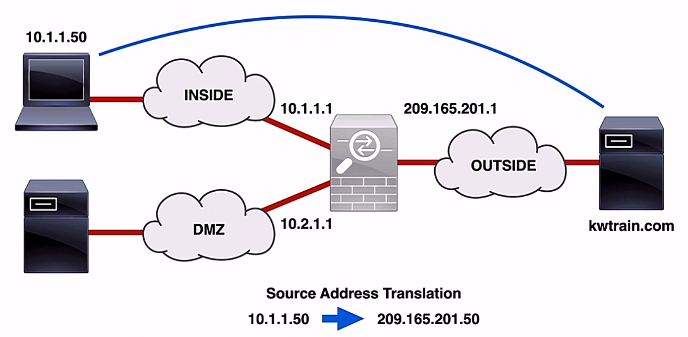
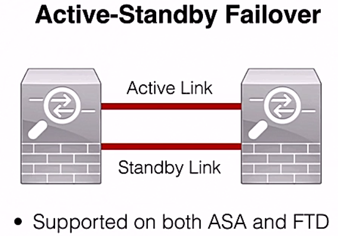

# Deployment models and architectures

Trainer: Charles Judd

- Baasic deployment modes
  - routed firewall mode
  - transparent firewall mode

- Routed firewall mode
  - firewall seen as a hop in the network
  - deafult mode w/ Cisco ASA firewall
  - each interface connecting to a different subnet
  - allowing for separation and protection of subnets
  - commonly using Network Address Translation (NAT)

- Transparent firewall mode
  - firewall not seen as a hop in the network
  - siting btw LAn and next-hop device (router)
  - inspecting L2 traffic

- Routed firewall ASA firewall (left diagram)
  - Inside network: connected to internal users
  - DMZ: containing some outside facing services or web servers
  - outside zone: connected to public Internet
  - firewall acting as a next-hop device btw these subnets
  - demo: internal user going to reach public internet
    - ASA allowing traffic based on the security policies
    - translating internet IP addr (110.1.1.40) to outside addr (209.165.201.50)
    - internal traffic forwarded to outside public Internet
    - response likewise allowed to back through the ASA since the session established
    - ASA reversing the NAT and forwarding back to inside user

- Transparent models ASA firewall (right diagram)
  - ASA connected to internal LNA
  - intrfaces bridged to transparent forward traffic btw connected devices
  - working completely at layer 2
  - **Bridge Group**
    - group if interfaces bridged together
    - Bridge Virtual Interface (BVI)
      - each group conaining a BVI
      - IP address assigned used as the source for packets orginating from the bridge group
    - BVI sharing w/ local subnet
    - multiple groups providing traffic isolation

  

- Security context
  - partitioning a physical firewall into multiple virtual instances
  - separaring functionality of all firewall and IPS featrues
  - contexts able to use mixed modes

- Cisco FirePOWER Threat Defence (FTD)
  - routed and transparent modes
  - six different interface modes
  - firewall and IPS able to operate on different interfaces

- Cisco FirePOWER INterface Modes

  <table style="font-family: Arial,Helvetica,Sans-Serif; margin: 0 auto; width: 50vw;" cellspacing=0 cellpadding=5 border=1 align="center">
    <colgroup>
      <col style="width: 10%">
      <col style="width: 10%">
      <col style="width: 10%">
      <col style="width: 30%">
    </colgroup>
    <thead>
    <tr style="font-size: 1.1em; vertical-align: middle;">
      <th scope=row style="text-align: center; background-color: #3d64ff; color: #ffffff;">FTD Interface Mode</th>
      <th scope=row style="text-align: center; background-color: #3d64ff; color: #ffffff;">FTD Deployment Mode</th>
      <th scope=row style="text-align: center; background-color: #3d64ff; color: #ffffff;">Traffic Drop</th>
      <th scope=row style="text-align: center; background-color: #3d64ff; color: #ffffff;">Notes</th>
    </tr>
    </thead>
    <tbody>
    <tr style="vertical-align:middle">
      <td style="text-align: center;">Routed</td>
      <td style="text-align: center;">Routed</td>
      <td style="text-align: center;">Yes</td>
      <td style="padding-left: 0;"><ul><li>inherited from ASA</li></ul></td>
    </tr>
    <tr style="vertical-align:middle">
      <td style="text-align: center;">Switched (BVI)</td>
      <td style="text-align: center;">Transparent</td>
      <td style="text-align: center;">Yes</td>
      <td style="padding-left: 0;"><ul><li>inherited from ASA</li></ul></td>
    </tr>
    <tr style="vertical-align:middle">
      <td style="text-align: center;">Inline Pair</td>
      <td style="text-align: center;">Routed or Transparent</td>
      <td style="text-align: center;">Yes</td>
      <td style="padding-left: 0;"><ul><li>binding incoming and outgoing interfaces</li><li>traffic inspected wither transmitted to dropped based on the policy</li><li>only to drop packet actively</li></ul></td>
    </tr>
    <tr style="vertical-align:middle">
      <td style="text-align: center;">Inline TPair w/ Tap</td>
      <td style="text-align: center;">Routed or Transparent</td>
      <td style="text-align: center;">No</td>
      <td style="padding-left: 0;"><ul><li>two physical interfaces bridged internally</li><li>a copy of each packet made for inspection</li><li>traffic flow undisturbed</li><li>ability to significantly impact FTD performacne</li></ul></td>
    </tr>
    <tr style="vertical-align:middle">
      <td style="text-align: center;">Passive</td>
      <td style="text-align: center;">Routed or Transparent</td>
      <td style="text-align: center;">No</td>
      <td style="padding-left: 0;"><ul><li>not prevent attacks</li><li>passively listening to the traffic</li></li>typically connected to switch span port</li><li>span port mirroring traffic to the IPS device</li></ul></td>
    </tr>
    <tr style="vertical-align:middle">
      <td style="text-align: center;">Passive (ERSPAN)</td>
      <td style="text-align: center;">Routed</td>
      <td style="text-align: center;">No</td>
      <td style="padding-left: 0;"><ul><li>newer implementation of span feature</li><li>using GRE encapsulation</li><li>GRE tunnel established btw capture point and Cisco FTD</li></ul></td>
    </tr>
    </tbody>
  </table> 

- High Availability (Failover) Deployment

  

    
  

- Failover Deployment Requirements
  - identical firewall mode
  - identical software version
  - identical NTP configuration and synchronization
  - no DHCP configuration on interface
  - Cisco FTD devices sharing same group in FirePower Management Center

- Clustering
  - multiple standalone devices acting as a single, logical unit
  - only supported on specific ASA and FTD models

