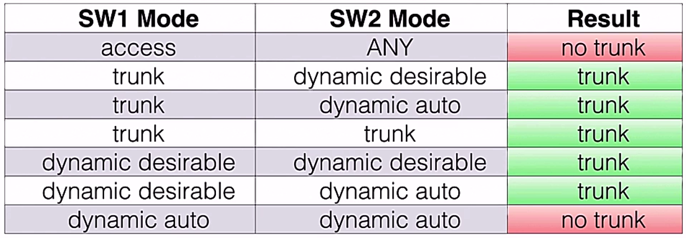
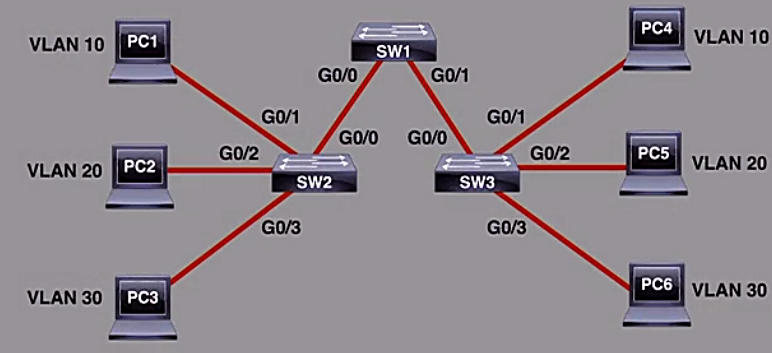

# VLANs

Trainer: Charles Judd


- Virtual Local Area Network (VLAN)
  - logically group devices into broadacast domains
  - adding flexibility and security in a network design
  - ability to span multiple switches


- Types of VLAN connections
  - access mode interface
    - belonging to a single VLAN
    - end device connections using access mode
    - default mode, also called 'untagged port'
  - trunk mode interface
    - not assigned to a specific VLAN
    - carrying traffic from multiple designated VLANs
    - tagged port
    - tagged by ISL or 802.1q


- Native VLAN
  - used exclusively w/ 802.1q
  - set to VLAN 1 by default
  - native VLAN traffic untagged
  - best security pratice: change Native VLAN value
    - VLAN 1 as a well known security hole
    - e.g., exploited w/ VLAN hopping attacks


- Dynamic Trunking Protocol (DTP)
  - allowing switches to negotiate trunks
  - default mode: _dynamic auto_
    - intf willing to become a trunk
    - not actively initiating the formation of trunk
    - not actively sending DTP frames to the other side of a trunk to create a trunk
    - once receiving a DTP msg from peer $\to$ willing to negotiate a trunk
  - _dynamic desirable_ mode: working actively to initate a trunk

  <figure style="margin: 0.5em; display: flex; justify-content: center; align-items: center;">
    
  </figure>


- Demo: VLAN config
  - topology and settings: 

    <figure style="margin: 0.5em; display: flex; justify-content: center; align-items: center;">
      
    </figure>


- Demo: config access port VLAN on SW2/SW3
  - `name <WORD>`: identify VLAN w/ name
  - `switchport mode access`: access port, only one VLAN allowed
  - `switchport access vlan NO`: assign VLAN `NO` to the interface

    ```bash
    SW2(config)# vlan 10
    SW2(config-vlan)# name SCOR10
    SW2(config-vlan)# vlan 20
    SW2(config-vlan)# name SCOR20
    SW2(config-vlan)# vlan 30
    SW2(config-vlan)# name SCOR30
    SW2(config-vlan)# int gig 0/1
    SW2(config-if)# switchport mode access
    SW2(config-if)# switchport access vlan 10
    SW2(config-if)# int gig 0/2
    SW2(config-if)# switchport mode access
    SW2(config-if)# switchport access vlan 20
    SW2(config-if)# int gig 0/3
    SW2(config-if)# switchport mode access
    SW2(config-if)# switchport access vlan 30
    SW2(config-if)# end
    ```

    ```bash
    ! verify VLAN settings
    SW2# sh vlan br
    VLAN name         Status    Ports
    ---- -----------  --------- ---------------------------------
    1    default      active    Gi0/0, Gi1/0, Gi1/1, Gi1/2, Gi1/3
    10   SCOR10       active    Gi0/1
    20   SCOR20       active    Gi0/2
    30   SCOR30       active    Gi0/3
    ...
    ```

  - apply same config to SW3


- Demo: config trunk ports VLAN on SW1
  - `switchport trunk encapsulation dot1q`: 802.1Q encapsulation, other option `isl`
  - `switchport mode dynamic desirable`: interface initiate trunk formation

    ```bash
    SW1(config)# vlan 10
    SW1(config-vlan)# name SCOR10
    SW1(config-vlan)# vlan 20
    SW1(config-vlan)# name SCOR20
    SW1(config-vlan)# vlan 30
    SW1(config-vlan)# name SCOR30
    SW1(config-vlan)# end
    ```

    ```bash
    ! show the initial setting on the interface
    SW1# sh int gig 0/0 switchport
    Name: Gig0/0
    Switchport: Enabled
    Administrative Mode: dynamic auto
    Operation Mode: static access
    Administrative Trunking Encapsulation: negotiate
    Operational Trunking Encapsulation: native
    ...
    ```

    ```bash
    ! config the intfs as trunk intfs
    SW1# conf t
    SW1(config)# int range gig 0/0-1
    SW1(config-if-range)# switchport trunk encapsulation dot1q
    SW1(config-if-range)# switchport mode dynamic desirable
    SW1(config-if-range)# end
    ```

    ```bash
    ! verify settings
    SW1# sh int gig 0/0 switchport
    Name: Gig0/0
    Switchport: Enabled
    Administrative Mode: dynamic desire
    Operation Mode: trunk
    Administrative Trunking Encapsulation: dot1q
    Operational Trunking Encapsulation: dot1q
    ...
    ```

    ```bash
    !SW1# sh int trunk
    port    Mode        Encapsulation   Status    Native vlan
    Gi0/0   desirable   802.1q          trunking  1
    Gi0/1   desirable   802.1q          trunking  1

    Port    Vlans allowed on trunk
    Gi0/0   1-4094
    Gi0/1   1-4094
    
    Port    Vlans allowed and active in management domain
    Gi0/0   1,10,20,30
    Gi0/1   1,10,20,30
    
    Port    Vlans in spanning tree forwarding state and not pruned
    Gi0/0   1,10,20,30
    Gi0/1   1,10,20,30
    ```


- Demo: changing native vlan for security purpose
  - config native vlan on SW1
    
    ```bash
    SW(config)# vlan 100
    SW1(config-vlan)# int range gig 0/0-1
    SW1(config-if-range)# switchport trunk native vlan 100
    ! Mismatch messages shown
    ```

  - config native vlan on SW2

    ```bash
    SW2# sh vlan br
    VLAN name         Status    Ports
    ---- -----------  --------- ---------------------------------
    1    default      active    Gi0/0, Gi1/0, Gi1/1, Gi1/2, Gi1/3
    10   SCOR10       active    Gi0/1
    20   SCOR20       active    Gi0/2
    30   SCOR30       active    Gi0/3
    ...

    SW2# conf t
    SW2(config)# vlan 100
    SW2(config-vlan)# int gig 0/0
    SW2(config-if)# switchport trunk native 100
    SW2(config-if)# end

    SW2# sh vlan br
    SW2# sh vlan br
    VLAN name         Status    Ports
    ---- -----------  --------- ---------------------------------
    1    default      active    Gi0/0, Gi1/0, Gi1/1, Gi1/2, Gi1/3
    10   SCOR10       active    Gi0/1
    20   SCOR20       active    Gi0/2
    30   SCOR30       active    Gi0/3
    ...
    ```

  - apply same config for SW3 as SW2
  - verify on SW1 for the settings on SW2 & SW3

    ```bash
    !SW1# sh int trunk
    port    Mode        Encapsulation   Status    Native vlan
    Gi0/0   desirable   802.1q          trunking  100
    Gi0/1   desirable   802.1q          trunking  100

    Port    Vlans allowed on trunk
    Gi0/0   1-4094
    Gi0/1   1-4094
    
    Port    Vlans allowed and active in management domain
    Gi0/0   1,10,20,30,100
    Gi0/1   1,10,20,30,100
    
    Port    Vlans in spanning tree forwarding state and not pruned
    Gi0/0   1,10,20,30,100
    Gi0/1   10,20,30
    ```


