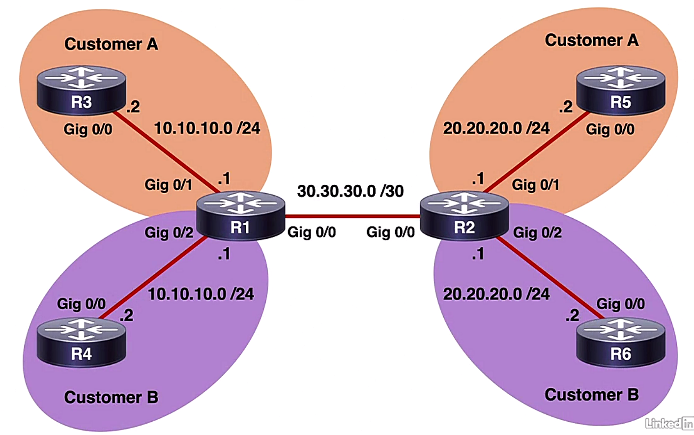

# VRF-lite

Trainer: Charles Judd


- Virtual Routing and Forwarding (VRF)
  - typically used by service providers
  - used in conjunction w/ Multiprotocol BGP (MP-BGP) and Multiprotocol Label Switching (MPLS)
  - VRF-lite: VRF w/o MP-BGP or MPLS
  - used in small enterprise or data center environments
  - allowing to create multiple routing tables n a single router
  - able to have overlapping IP address schemes


- Demo: simple VRF-lite
  - topology
    - R3 & R5 for Customer A while R4 & R6 for Customer B
    - each customer w/ its own IP address scheme but overlapped
    - R3 ~ R6 IP addressing configured as topology indicated

    <figure style="margin: 0.5em; display: flex; justify-content: center; align-items: center;">
      
    </figure>

  - display R3 intf settings

    ```bash
    R3# sh ip int br
    Interface           IP-Address    OK? Method  Status                Protocol
    GigabitEthernet0/0  10.10.10.2    YES manual  up                    down
    GigabitEthernet0/1  unassigned    YES NVRAM   administratively down down
    ...
    ```

- Demo: define VRF instance on R1 & R2
  - procedure:
    - 1\. create vrf instances: `R(config)# ip vrf VRF_NAME`
    - 2\. enter interface config mode: `R(config)# int g0/1` 
    - 3\. associate vrf w/ interface: `R(config-if)# ip vrf forwarding VRF_NAMR`
    - 4\. assign ip address for the intf: `R(config-if)# ip address <IP_addr> <net_mask>`
    - 5\. bring up interface: `R(config-if)# no shutdown`
  - create VRF instance for Customer A: `R1(config)# ip vrf CUST-A`
  - create VRF instance for Customer B: `R1(config-vrf)# ip vrf CUST-B`
  - verify global routing table: `R1# sh ip route` $\to$ empty
  - verify routing table for CUST-A: `R1# sh ip vrf CUST-A` $\to$ empty
  - verify routing table for CUST-B: `R1# sh ip vrf CUST-B` $\to$ empty
  - enter intf Gi0/1: `R1(config)# int gig 0/1`
  - assign Gi0/1 for CUST-A: `R1(config-if)# ip vrf forwarding CUST-A`
  - assign IP addr: `R1(config-if)# ip addr 10.10.10.1 255.255.255.0`
  - bring up Gi0/1: `R1(config-if)# no shut`
  - enter intf Gi0/2: `R1(config-if)# int gig 0/2`
  - assign Gi0/2 for CUST-B: `R1(config-if)# ip vrf forwarding CUST-B`
  - assign IP addr: `R1(config-if)# ip addr 10.10.10.1 255.255.255.0`
  - bring up Gi0/2: `R1(config-if)# no shut`
  - no error message shown w/ the same IP addresses on both interfaces
  - verify connectivity w/ global routing table: `R1# ping 10.10.10.1` $\to$ `..... Success rate is 0 percentage (0/5)`
  - verify connectivity w/ vrf CUST-A: `R1# ping vrf CUST-A 10.10.10.1` $\to$ `.!!!! Success rate is 80 percentag (4/5)`
  - verify connectivity w/ vrf CUST-B: `R1# ping vrf CUST-B 10.10.10.1` $\to$ `.!!!! Success rate is 80 percentag (4/5)`
  - apply similar config on R2

    ```bash
    R2# config t
    R2(config)# ip vrf CUST-A
    R2(config-vrf)# ip vrf CUST-B
    R2(config-vrf)# do sh ip route
    R2(config-vrf)# do sh ip vrf CUST-A
    R2(config-vrf)# do sh ip vrf CUST-B
    R2(config-vrf)# int gig 0/1
    R2(config-if)# ip vrf forwarding CUST-A
    R2(config-if)# ip addr 20.20.20.1 255.255.255.0
    R2(config-if)# no shut
    R2(config-if)# int gig 0/2
    R2(config-if)# ip vrf forwarding CUST-B
    R2(config-if)# ip addr 20.20.20.1 255.255.255.0
    R2(config-if)# no shut
    ```

- Demo: using sub-intf to setup connectivity btw R1 & R2
  - tasks
    - using sub-intfs to separate traffic
    - each sub-intf w/ its own VLAN ID
    - trunk VLAN w/ 802.1Q encapsulation
  - procedure
    - 1\. create sub-interface: R(config)# int f0/0.1`
    - 2\. enable VLAN trunk w/ encapsulation: `R(config-subif)# encapsulation dot1q VLAN_NO`
    - 3\. associate w/ vrf: `R(config-subif)# ip vrf forwarding VRF_NAME`
    - 4\. assign IP address: `R(config-subif)# ip address <IP_addr> <net_mask>`
    - 5\. bring up interface: `R(config-if)# no shutdown`
  - create and enter Gi0/0 sub-intf: `R1(config)# int gig 0/0.1`
  - config VLAN encapsulation w/ VLAN ID=2: `R1(config-subif)# encapsulation dot1q 2`
  - associate the sub-intf w/ CUST-A: `R1(config-subif)# ip vrf forwarding CUST-A`
  - config IP address: `R1(config-subif)# ip addr 30.30.30.1 255.255.255.252`
  - bring up sub-intf: `R1(config-subif)# no shut`
  - config another sub-intf for CUST-B:

    ```bash
    R1(config-subif)# int gig 0/0.2
    R1(config-subif)# encapsulation dot1q 3
    R1(config-subif)# ip vrf forwarding CUST-B
    R1(config-subif)# ip addr 30.30.30.1 255.255.255.252
    R1(config-subif)# no shut
    ```

  - verify settings

    ```bash
    R1# sh ip int br
    Interface             IP-Address    OK? Method  Status                Protocol
    GigabitEthernet0/0    unassigned    YES NVRAM   administratively down down
    GigabitEthernet0/0.1  30.30.30.1    YES manual  administratively down down
    GigabitEthernet0/0.1  30.30.30.1    YES manual  administratively down down
    GigabitEthernet0/1    30.30.30.1    YES manual  up                    up
    GigabitEthernet0/2    30.30.30.1    YES manual  up                    up
    GigabitEthernet0/3    unassigned    YES NVRAM   administratively down down
    ```

  - enter Gi0/0: `R1(config)# int gig 0/0`
  - bring up intf: `R1(config-if)$ no shut`
  - verify settings again

    ```bash
    R1# sh ip int br
    Interface             IP-Address    OK? Method  Status                Protocol
    GigabitEthernet0/0    unassigned    YES NVRAM   up                    up
    GigabitEthernet0/0.1  30.30.30.1    YES manual  up                    up
    GigabitEthernet0/0.1  30.30.30.1    YES manual  up                    up
    GigabitEthernet0/1    30.30.30.1    YES manual  up                    up
    GigabitEthernet0/2    30.30.30.1    YES manual  up                    up
    GigabitEthernet0/3    unassigned    YES NVRAM   administratively down down
    ```

  - config R2 for sub-intf

    ```bash
    R2(config-subif)# int gig 0/0.1
    R2(config-subif)# encapsulation dot1q 2
    R2(config-subif)# ip vrf forwarding CUST-A
    R2(config-subif)# ip addr 30.30.30.2 255.255.255.252
    R2(config-subif)# no shut
    R2(config-subif)# int gig 0/0.2
    R2(config-subif)# encapsulation dot1q 3
    R2(config-subif)# ip vrf forwarding CUST-B
    R2(config-subif)# ip addr 30.30.30.2 255.255.255.252
    R2(config-subif)# no shut
    R2(config-subif)# int gig 0/0
    R2(config-if)# no shut
    R2(config-if)# end
    ```

  - verification on R2
  
    ```bash
    R2# sh ip int br
    Interface             IP-Address    OK? Method  Status                Protocol
    GigabitEthernet0/0    unassigned    YES NVRAM   up                    up
    GigabitEthernet0/0.1  30.30.30.1    YES manual  up                    up
    GigabitEthernet0/0.1  30.30.30.1    YES manual  up                    up
    GigabitEthernet0/1    30.30.30.1    YES manual  up                    up
    GigabitEthernet0/2    30.30.30.1    YES manual  up                    up
    GigabitEthernet0/3    unassigned    YES NVRAM   administratively down down
    ```


- Demo: verify the routing on R1 w/ VRF settings

  ```bash
  R1# sh ip route
  ! empty

  R1# sh ip route vrf CUST-A

        10.0.0.0/8 is variably subnetted, 2 subnets, 2 masks
  C       10.10.10.0/24 is directly connected, GigabitEthernet 0/1
  L       10.10.10.1/32 is directly connected, GigabitEthernet 0/1
        30.0.0.0/8 is variably subnetted, 2 subnets, 2 masks
  C       30.30.30.0/30 is directly connected, GigabitEthernet 0/0.1
  L       30.30.30.1/32 is directly connected, GigabitEthernet 0/0.1
  ```

  ```bash
  R1# sh ip route vrf CUST-B

        10.0.0.0/8 is variably subnetted, 2 subnets, 2 masks
  C       10.10.10.0/24 is directly connected, GigabitEthernet 0/2
  L       10.10.10.1/32 is directly connected, GigabitEthernet 0/2
        30.0.0.0/8 is variably subnetted, 2 subnets, 2 masks
  C       30.30.30.0/30 is directly connected, GigabitEthernet 0/0.2
  L       30.30.30.1/32 is directly connected, GigabitEthernet 0/0.2
  ```


- Demo: config routing protocol
  - route to R5 of CUST-A unknown (20.20.20.0/24)

    ```bash
    R3# sh ip route

          10.0.0.0/8 is variably subnetted, 2 subnets, 2 masks
    C       10.10.10.0/24 is directly connected, GigabitEthernet 0/0
    L       10.10.10.2/32 is directly connected, GigabitEthernet 0/1
    ```

  - routing protocol required for R3, OSPF used to advertise the route

    ```bash
    R3(config)# router ospf 1
    R3(config-router)# network 10.10.10.0 0.0.0.255 area 1
    ```
  
  - OSPF routing protocol required for other routers
    - all routers: `R?(config)# router ospf 1`
    - R5 advertise network into area 1: `R5(config-router)# network 20.20.20.0 0.0.0.255 area 1`
    - R4 advertise network into area 1: `R4(config-router)# network 10.10.10.0 0.0.0.255 area 1`
    - R5 advertise network into area 1: `R6(config-router)# network 20.20.20.0 0.0.0.255 area 1`

  - config OSPF on R1 on both VRF instances
    - different ospf instances w/ different vrf instances

    ```bash
    R1(config)# router ospf 1 vrf CUST-A
    R1(config-router)# network 10.10.10.0 0.0.0.255 area 1
    R1(config-router)# network 30.30.30.0 0.0.0.3 area 1
    R1(config-touter)# router ospf 2 vrf CUST-B
    R1(config-router)# network 10.10.10.0 0.0.0.255 area 1
    R1(config-router)# network 30.30.30.0 0.0.0.3 area 1
    R1(config-router)# end

    ! verify ospf routing config
    R1# sh run
    ...
    router ospf 1 vrf CUST-A
     network 10.10.10.0 0.0.0.255 area 1
     network 30.30.30.0 0.0.0.3 area 1
    !
    router ospf 2 vrf CUST-B
     network 10.10.10.0 0.0.0.255 area 1
     network 30.30.30.0 0.0.0.3 area 1
    ```

  - config OSPF on R2  w/ similar config

    ```bash
    R2(config)# router ospf 1 vrf CUST-A
    R2(config-router)# network 20.20.20.0 0.0.0.255 area 1
    R2(config-router)# network 30.30.30.0 0.0.0.3 area 1
    R2(config-touter)# router ospf 2 vrf CUST-B
    R2(config-router)# network 20.20.20.0 0.0.0.255 area 1
    R2(config-router)# network 30.30.30.0 0.0.0.3 area 1
    ```

- Demo: verify routing settings w/ OSPF settings
  - display routing table on R1
    
    ```bash
    R1# sh ip route
    ! empty

    R1# sh ip route vrf CUST-A

          10.0.0.0/8 is variably subnetted, 2 subnets, 2 masks
    C       10.10.10.0/24 is directly connected, GigabitEthernet 0/1
    L       10.10.10.1/32 is directly connected, GigabitEthernet 0/1
          20.0.0.0/24 is subnetted, 1 subnets
    O       20.20.20.0 [110/2] via 30.30.30.2, 00:01:46, GigabitEthernet 0/0.1
          30.0.0.0/8 is variably subnetted, 2 subnets, 2 masks
    C       30.30.30.0/30 is directly connected, GigabitEthernet 0/0.1
    L       30.30.30.1/32 is directly connected, GigabitEthernet 0/0.1
    ```

    ```bash
    R1# sh ip route vrf CUST-B

          10.0.0.0/8 is variably subnetted, 2 subnets, 2 masks
    C       10.10.10.0/24 is directly connected, GigabitEthernet 0/2
    L       10.10.10.1/32 is directly connected, GigabitEthernet 0/2
          20.0.0.0/24 is subnetted, 1 subnets
    O       20.20.20.0 [110/2] via 30.30.30.2, 00:02:04, GigabitEthernet 0/0.2
          30.0.0.0/8 is variably subnetted, 2 subnets, 2 masks
    C       30.30.30.0/30 is directly connected, GigabitEthernet 0/0.2
    L       30.30.30.1/32 is directly connected, GigabitEthernet 0/0.2
    ```

  - verify routing table on R3
    - knowing all 3 subnets
    - no knowledge of those VRF instances

    ```bash
    R3# sh ip route

          10.0.0.0/8 is variably subnetted, 2 subnets, 2 masks
    C       10.10.10.0/24 is directly connected, GigabitEthernet 0/0
    L       10.10.10.1/32 is directly connected, GigabitEthernet 0/0
          20.0.0.0/24 is subnetted, 1 subnets
    O       20.20.20.0 [110/3] via 10.10.10.1, 00:03:02, GigabitEthernet 0/0
          30.0.0.0/8 is subnetted, 1 subnets
    O       30.30.30.0/32 [110/2] via 10.10.10.1, 00:0:06, GigabitEthernet 0/0
    ```

  - verify connectivity for CUST-A on R3: `R3# ping 20.20.20.2` $\to$ `!!!!!`


  

