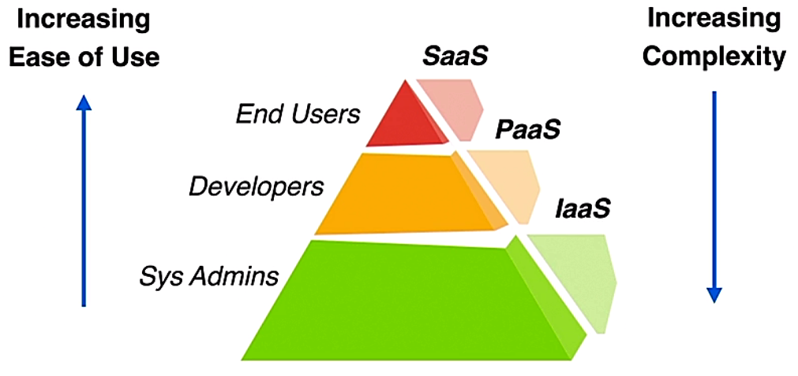
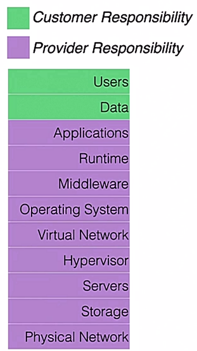
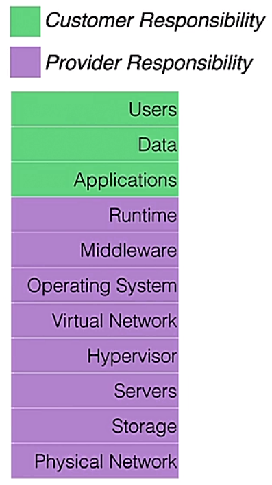
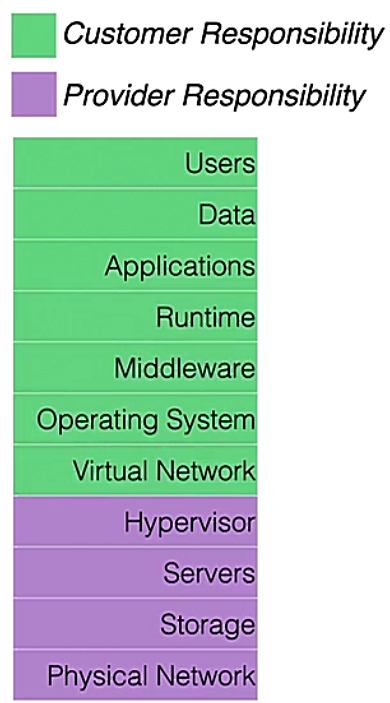
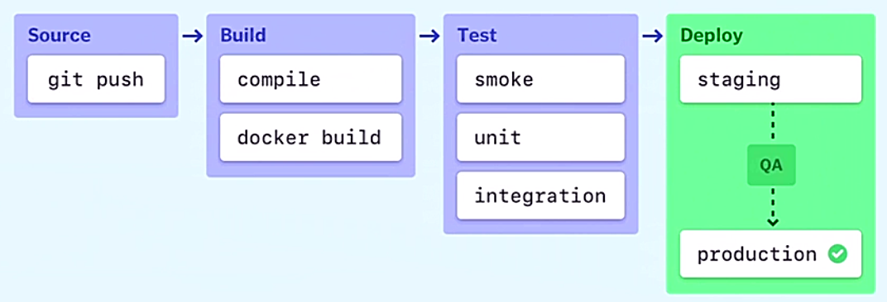

# Cloud Security

## Public, private, hybrid, and community clouds

- NIST SP 500-322
  - outlining cloud service modes
  - describing deployment strategies

- Factors for cloud popularity
  - distributed storage for data protection
  - easily scaled out
  - automated mgmt capabilities
  - accessing from any location
  - etc.

- Essential characteristics of NIST doc
  - on-demand self-service
  - broad network access
  - resource pooling
  - rapid elasticity
  - measured service

- On-demand self-service
  - requested resource automatically processed
  - no human intervention need
  - e.g. Amazon Web Services (AWS)
  - faster and more flexible than traditional deployment

- Broad network access
  - cloud resources available on a wide range of devices
  - such as PCs, Macs, tablets, smartphones, etc.

- Resource pooling
  - provider compute resource pooled together
  - resources: storage, processor, memory, and infastructure
  - offering cost saving vs. having dedicated per-customer hardware deployments

- Rapid elasticity
  - provisioning and tearing down resources quickly
  - ability to commision or decommision services as needed

- Measured service
  - cloud provider monitoring offered services
  - measuring usage-based plans
  - providing service performance assurance

- Cloud deployment models
  - private cloud
  - public cloud
  - community cloud
  - hybrid cloud

- Private cloud
  - resource used exclusively by one client
  - onsite datacenter or 3rd-party hosting
  - more privacy and security control
    - popular compliance models, such as SOX, PCI, and HIPAA
  - more expensive to deploy and maintain
  - common in sectors where security and privacy is valued, e.g. financial institutions

- Public cloud
  - provisoned for open use
  - resources owned by 3rd-party and shared over the Internet
  - examples: AWS, Azure, Dropbox, etc.
  - cost effective solution for users
  - security and privacy responsibility largely on CSP
  - compliance regulation issues, e.g. HIPAA w/ PCI DSS

- Community cloud
  - private cloud model variation
  - cloud providers catering to specific sectors
  - no concrete standards outlined for this model

- Hybrid cloud
  - combining two or more cloud models
  - able to combine benefits offered by different models
  - initial deployment costs higher than public model
  - implemention possible complex

## Cloud service models

- Service layers of NIST cloud computing reference architecture
  - SaaS
  - PaaS
  - IaaS

  <figure style="margin: 0.5em; display: flex; justify-content: center; align-items: center;">
    
  </figure>

- Infrastructure as a Service (IaaS)
  - virtual provisioning of resources available over the Internet
  - allowing for virtual infrastructure
  - resources including computing, networking, and storage
  - more economical than onsite data center
  - prociders including AWS, Google Compute Engine, Microsoft Azure, etc.

- Platform as a Service (PaaS)
  - typically used for app creation and testing
  - developers interacting w/ PaaS
  - supporting complete web application lifecycle
  - offering development tools for quick coding
  - able to be used for cross-platform development
  - developer collaboration as an upside to PaaS

- Software as a Service (SaaS)
  - quick access to cloud-based web applications
  - many different end users
  - proviers including Dropbox, Cisco WebEx, Office 365, etc.

- Analogy btw cloud service and car
  - IaaS - Car lease
  - PaaS - Car rental
  - SaaS - Taxi

## Customer vs. provider responsibility

- Shared security responsibility
  - varying depending on cloud service model
  - CSPs typically outlining models for customers
  - important to understand when choosing a service model
  - customers taking full responsibility for private clouds
  - examples:
    - [Shared Responsibility Model](https://aws.amazon.com/compliance/shared-responsibility-model/)
    - [Shared responsibility in the cloud](https://docs.microsoft.com/en-us/azure/security/fundamentals/shared-responsibility)

  
  
  

- Shared security responsibility - SaaS
  - customer w/ least amount of responsibility
  - provider responsible for infrastructure and software stack
  - customer managing users and access
  - provider responsible: data security within the SaaS
  - customer's security responsibility: anything downloaded locally from SaaS

- Shared security responsibility - PaaS
  - customer responsible for users, data, and applications
  - provider responsible for infrastructure and software stack
  - provider responsible for any built-in applications or modules
  - customer responsible for security of any software built w/ PaaS

- Shared security responsibility - IaaS
  - most clear-cut distinction of responsibility
  - provider responsible for infrastructure and software stack
  - customer responsible for any applications or data on the platform

## Patch management

- Patch management
  - process of applying software updates
  - creating vulnerabilities and/or bugs
  - general improvements to functionality
  - important for security and regulation compliance
  - responsibilities depending on the cloud model
  - inquiring w/ CSPs about patching cycles, potential downtime, and service scalability

- SaaS patch management
  - minimum customer responsibility
  - providers patching all software and hardware
  - lower mgmt load for customers vs. maintaining their own infrastructure

- PaaS patch management
  - most complex service model for patch mgmt
  - providers pacthing underlying software and hardware
  - customers patching application and environment components created
  - typical to see a security team work w/ developers for PaaS patch mgmt

- IaaS patch management
  - model w/ the least customer responsibility
  - provider patching underlying software and hardware
  - customers patching anything deployed on IaaS
  - customers responsible for VMs, applications, virtual network infrastructure, etc.

## Security assessments

- Security assessment overview:
  - using CSP guidelines if pentration testing
  - many CSps providing their own security tools

- Policies and procedures
  - updated to reflect cloud considerations
  - many existing local policies applied

- Access management
  - determining who has access to systems
  - applying the Principle of Least Privilege
  - access on as-needed bassis
  - Multi-factor authentication (MFA)

- Important questions for providers
  - what's your data recovery plan?
  - what are your patch management policies?
  - what are the periodic scanning schedules?

- Logging and monitoring
  - breaches able to go unnoticed for weeks/months
  - important for historical perspective into data
  - inquiring about CSP logging policies
  - becoming familiar w/ how to use provider logs

- Encryption
  - ensuring CSP encrypts data at rest and in motion
  - inquiring bout encryption strength, e.g. DES vs AES

## Cloud-delivered security solutions

- Cisco Umbrella overview
  - evolved from acquisition of OpenDNS
  - help preventing unintentional access to phising and malware sites
  - able to be used as Internet website filter

- Cisco Umbrella and DNS
  - DNS server queries able to be forwarded to Umbrella cloud
  - roaming client available for Windows and MacOS
  - ability to manually point to Anycast IP addresses 208.67.222.222 and 208.67.220.220 for DNS configuration

- Cisco Umbrella architecture
  - including dozens of worldwide data center
  - peered w/ name top ISP and CDNs

- Cisco Umbrella protection
  - leveraging machine learning to block domains
  - threat intelligent from Cisco Talos
    - uncovering malicious domain, IPS, URLs and files
    - threat intelligence community consisting of researchers, engineers, dan data scientists
    - creating dependenable intelligence about known and emerging threats

- Cisco Umbrella features
  - acting as Secure Internet Gateway (SIG)
  - whitelisted requests routed as usual
  - known malicious (blacklisted) requests blocked
  - 'risky' requests routed to proxy server, e.g. Reddit w/ mixed contents

- 'Risky' request handling
  - inspection engine examining the URL, based on
    - Cisco Talos threat intelligence
    - Cisco Web reputation system
    - other 3rd-party intelligence feeds
  - file: antivirus and malware engines performing an inspection
  - file/connection allowed or blocked based on results

- Cisco Umbrella investigate
  - live, up-to-date view of threat intelligence (file hashes, domain, and IP address)
  - ability to detect emerging threats early on
  - leveraging Cisco Talos community

- Cisco Cloudlock
  - a.k.a. Cloud Access Security Broker (CASB)
  - policy enforcement device for cloud users and service users
  - integrating w/ many cloud services (e.g. Slack, G Suite, Dropbox, Office 365, and more)
  - historical view of asset access and sharing
  - invoking compliance checks and protect against data exfiltration (the theft or unauthorized removal or movement of any data from a device)
  - malware threat protection

## DevSecOps

- Traditional software development
  - developers and operations team
  - waterfall method: early method
  - IoT created increased expectations

- DevOps
  - combining development and operations
  - leveraging 'Agile Methodology'
    - customer central approach
    - stages:
      - constant collaboration w/ the customers or the stackholders
      - continuous improvement
  - combination of many ideas from manufacturing and leadership methodologies
  - goal: better collaboration, faster deployment, improved productivity, and better customer satisfaction

- CI/CD pipline
  - continuous integration / continuous delivery
  - CI: a development practice of merging code changes into a central repository
  - CD: taking code changes and automating software release process

  <figure style="margin: 0.5em; display: flex; justify-content: center; align-items: center;">
    
  </figure>

- DevSecOps
  - security implemented earlier during the development cycle
  - security historically isolated to a separate team during final development stages
  - security integrated into the development process, and considered a shared responsibility
  - CI/CD pipeline platforms featuring security testing functions

## Application and data security

- Security testing
  - static application security testing (SAST)
  - dynamic application security testing (DAST)

- Static application security testing
  - 'white box' testing method
  - test from inside-out, w/ access to the underlying framework, design, and implementation
  - typical developer approach to testing
  - using analysis against source code to test for vulnerabilities w/o executing the application
  - generally help to find vulnerabilities earlier
  - unable to discover runtime and environment-related issues

- Dynamic application security testing
  - 'black box' testing method
  - test from the outside-in, w/ no knowledge of the technology or underlying framework
  - typical pentration tester approach
  - testing executed against the application itself
  - finding vulnerabilities after development cycle completed
  - issues corrected w/ vulnerability patches

- SAST and DAST
  - not an either/or situation
  - comprehensive security: both types of testing used
  - example tools:
    - 'Find Security Bugs': find bugs in applications w/ Java
    - 'snoarqube': find vulnerabilities in coding for many different languages

- Fuzzing testing (Fuzzing)
  - sending random data into an application or OS
  - able to detect potential program failures, buffer overflows, or other errors
  - example tool: munity fuzzer

## Policy management

- Cisco Cloudlock
  - Cloud Access Security Broker (CASB)
  - integrating w/ Office 365, Dropbox, G Suite, Slack, etc.
  - protecting against data misuse and exfiltration
  - protrection against attacks such as ransomeware
  - data loss prevention (DLP)

- Demo: policy management in Cloudlock
  - authorizing platform for monitoring: Platforms > Platform = Dropbox > Action = Authorize
  - Add Predefined Policy:
    - Narrow by Location
    - Narrow by Industry
    - Predefined Policies
    - Severity Level: info, warning, alert, or critical
    - Policy Name: predefined polices according to the previous settings

- Cloudlock response action flow
  - policy violation triggering configured response actions
  - a.k.a. response flow
  - able to be a series of actions, or a single action

- Cloudlock global response
  - no response actions added to a policy automatically
  - _Notify Admin by Email_ response
  - _Notify End User by Email_ response
  - _Incident Status Update_ response: `Dismissed`, `Resolved`, or `In Progress`

- Cloudlock Dropbox-related response
  - moving a file to quarantine
  - revoking file access to everyone except owner
  - disabling file share URL
  - demo: predefined incident for credit card number in file
    - Object type: MS Office Word
    - Policy: Credit Card Number
    - info including dates and time of detection, the platform (Dropbox), owner

## Cloud logging and monitoring

- Popular tools
  - splunk
  - solarwinds
  - logstash

- Best pratices for logging and monitoring
  - understanding what doesn't require logging and monitoring
  - verbose data making correlation more difficult
  - log storage and mgmt easier w/ smaller sets of collection data

- Best practices for production
  - production-based data critical
  - any data that helps w/ troubleshooting, auditing, or compliance purposes
  - useless specifically required, avoid logging sensitive personal info

- Best practices for retention
  - log retention policies
  - determining which logs can be kept short-term vs. long-term
  - help pare down (cut off) the log database and maximize storage

- Best practice for storage
  - planning log storage for overflow data
  - critical events in an environment able to create lots of data, quickly filling log storage
  - choosing scalable solutions

- Best proactice for central storage
  - using a centralized log storage solution
  - example: Security Information and Event Management (SIEM) system
  - ensuring log collection and monitoring happens in real-time, pointing to a central log database

- Best pratices for reviewing
  - inspecting and reviewing logs regularly
    - is this logging message useful?
    - does it include necessary info for troubleshooting?
    - are timestamps correct?
  - determining if the info being collected is useful for troubleshooting/auditing
  - ensuring you're getting info you want before a crucial event happens

- Best practice for cloud environment
  - cloud service provider providing built-in tools
  - example: Amazon CloudWatch Logs

## Cloud application and workload security

- Cloud workload
  - the amount of activity running on a cloud instance
  - cloud workload continues to increase w/ popularity
    - low cost and easy of use w/ cloud solutions
    - security challenges as oppose to in-house architecture

- Cisco solutions
  - Cisco AppDynamics (AppD)
  - Cisco Workload Optimization Manager (CWOM)

- Cisco AppDynamics
  - automatic discovery and dynamic mapping of every application in a topology
  - compatible w/ many platform, including AWS, Azure, Kubernetes, Citrix, and more
    - full stack visibility
    - visibility into physical, virtual, cloud, and container environments

- Cisco Workload Optimization Manager (CWOM)
  - deployed as a virtual machine on local network
  - agent-less technology monitoring managed hosts
  - visually mapping applications and infrastructure, including local, remote, private and public cloud assets

- AppD + CWOM
  - monitoring application performance and cloud workload
  - predictive modeling to forecast future needs
  - tracking CPU, memory, latency, and other metrics
  - automation features for scaling

- Cisco Secure Workload (formally Tetration)
  - software agents deployed on major OS distributions
  - agents acting as sensors to collect data for policy enforcement
  - able to collect info from Cisco infrastructure
  - gathered data used for analytics
    - monitoring and alerting by capturing real time forensic info
  - micro-segmentation for cloud environment
  - segmentation policies for each cloud application
  - reduced overall attack surface
  - improving breach containment capabilities

