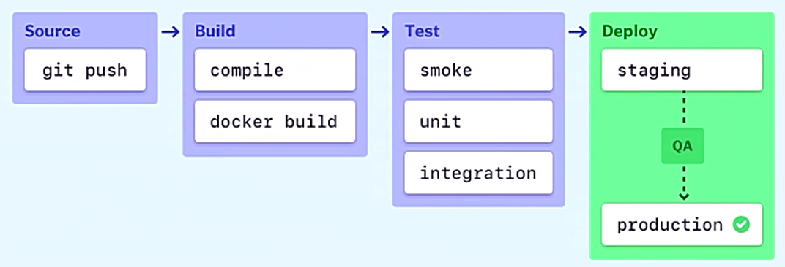

# DevSecOps

Trainer: Charles Judd

- Traditional software development
  - developers and operations team
  - waterfall method: early method
  - IoT created increased expectations

- DevOps
  - combining development and operations
  - leveraging 'Agile Methodology'
    - customer central approach
    - stages:
      - constant collaboration w/ the customers or the stackholders
      - continuous improvement
  - combination of many ideas from manufacturing and leadership methodologies
  - goal: better collaboration, faster deployment, improved productivity, and better customer satisfaction

- CI/CD pipline
  - continuous integration / continuous delivery
  - CI: a development practice of merging code changes into a central repository
  - CD: taking code changes and automating software release process

  <figure style="margin: 0.5em; display: flex; justify-content: center; align-items: center;">
    
  </figure>

- DevSecOps
  - security implemented earlier during the development cycle
  - security historically isolated to a separate team during final development stages
  - security integrated into the development process, and considered a shared responsibility
  - CI/CD pipeline platforms featuring security testing functions

