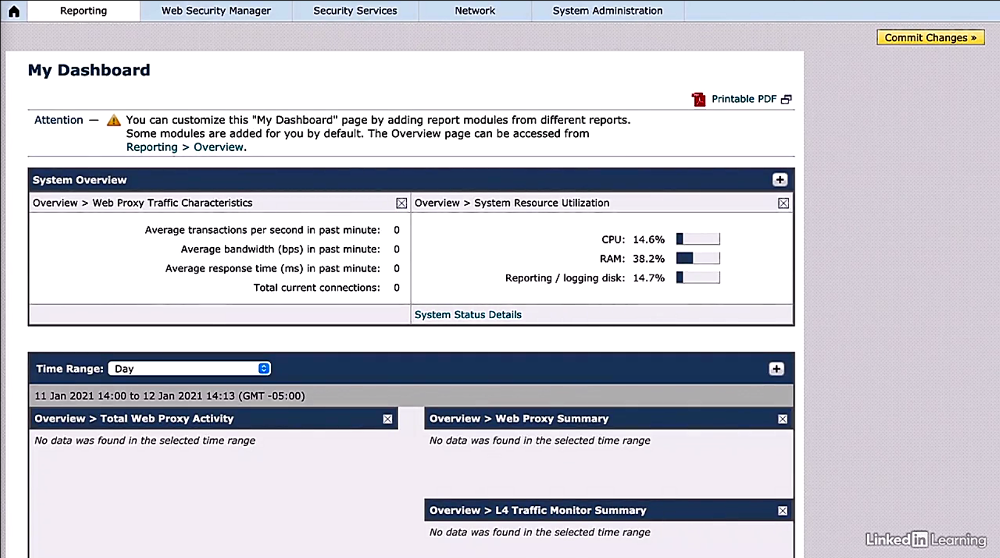
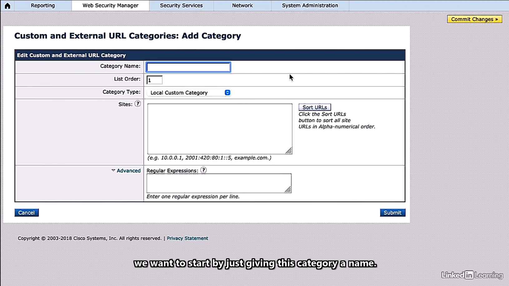
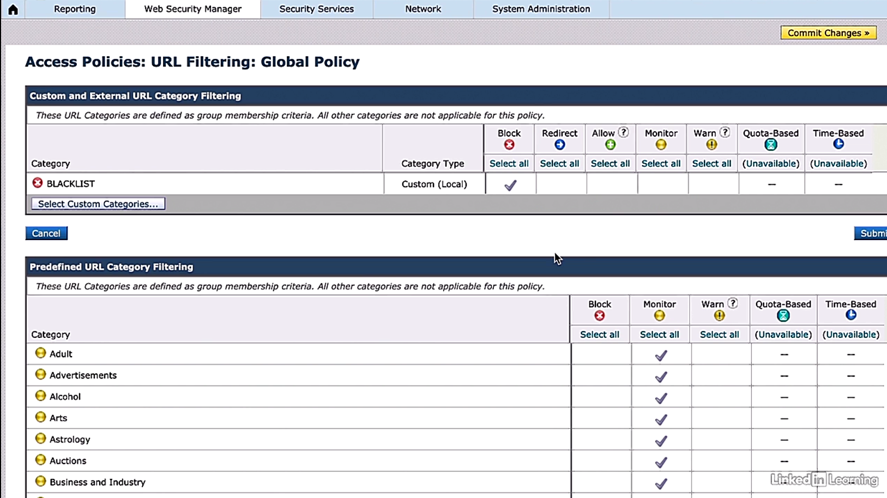

# Content Security


## Secure internet gateway


- Cisco Web Security Appliance (WSA)
  - main goal: protection from malicious websites and malware
  - acting as a proxy for web requests
  - virtual or physical appliance deployed inside edge firewall device
  - modes of deployment: explicit forward mode and transparent mode


- Cisco WSA explicit forward mode
  - clients explicitly pointed toward WSA proxy
  - WSA responsible for DNS resolution
  - requiring each individual client to configured to point to the proxy


- Cisco WSA transparent mode - preferred
  - clients unaware of a proxy in the network path
  - other infrastructure devices redirected to WSA
  - firewall redirecting client requests to WSA
  - WSA verifying URL request and determining risk
    - no violation: connection initiated to URL from the WSA
    - violation: WSA checking content against security policy, and forwarding to client or blocking based on results


- Web Cache Communication Protocol (WCCP)
  - Cisco propriety
  - available on Cisco ASAs, routers, and switches
  - allowing routing platforms to transparently redirect packets to the other destinations


- Demo: config firewall for transparent proxy using WCCP
  - topology:
    - firwall: 10.1.1.1
    - WSA addr: 10.1.1.100
  - config procedure
    - 1\. config ACL to allow traffic on the subnet and WSA host
    - 2\. config WCCP redirection
    - 3\. enter outgoing intf to config
    - 4\. enable WCCP to redirect traffic to WSA
  - config ACL for web traffic:
    - ACL named HTTP & HTTPS to allow HTTP & HTTPS traffic from the subnet to any outside network w/ traffic designatd port
    - WCCP redirect list: where to send the traffic if matched, named WSA, sending ant traffic on the host to any destination

    ```bash
    ASA(config)# access-list HTTP permit tcp 10.1.1.0 255.255.255.0 any eq http
    ASA(config)# access-list HTTPS permit tcp 10.1.1.0 255.255.255.0 any eq https
    ASA(config)# access-list WSA permit ip host 10.1.1.100 any
    ```
  
  - config WCCP redirection for HTTP: `ASA(config)# wccp 10 redirect-list HTTP group-list WSA`
    - `10`: service identifier
    - `redirect-list`: the access-list used to permit redirection
    - `group-list`: the access-list used to permit group membership
  - config WCCP redirection for HTTPS: `ASA(config)# wccp 20 redirect-list HTTPS group-list WSA`
  - enable the redirection for WCCP on the source intf of the firewall: `ASA(config)# int g0/0`
  - assign the intf name: `ASA(config-if)# nameif` $\to$ `Note: Security level for "inside" set to 100 by default`
    - `nameif`: giving a name and assign a security level
    - typically names: outside, inside, or DMZ
  - config the inside intf for WCCP redirection w/ HTTP: `ASA(config)# wccp interface inside 10 redirect in`
    - `inside`: nam eof the interface
    - `redirect`: packet redirection options for the service
    - `in`: redirect to a Cache  appropriate ingress packets
  - config the inside intf for WCCP redirection w/ HTTPS: `ASA(config)# wccp interface inside 20 redirect in`
  - configuration on different devices
    - routers: commands essentially identical
    - switches: config at interface VLAN level than a named interface


- Demo: config WSA appliance for transparent proxy
  - dashboard > Transparent Redirection
  - Transparent redirection > 'Edit Device...' button
  - Edit Transaprent Redirection Device > Type = WCCP v2 Router > 'Submit' button
  - Transparent Device > WCCP v2 Service > 'Add Service...' button
  - Add WCCP v2 Service: Service Profile Name = HTTP; Service: Dynamic service ID = 10, Port numbers = 80, Redirect based on destination port = On, Load balance based on server address = On; Routed IP Addresses = 10.1.1.1 > 'Submit' button
  - Add WCCP v2 Service: Service Profile Name = HTTPS; Service: Dynamic service ID = 20, Port numbers = 443, Redirect based on destination port = On, Load balance based on server address = On; Routed IP Addresses = 10.1.1.1 > 'Submit' button
  - Transparent Redirection: Transparenet Redirection Device > Type = WCCP v2 Router; WCCP v2 Serices > Service Profile Name = HTT & HTTPS, Service ID = 10 & 20, Router IP Address = 10.1.1.1 & 10.1.1.1, Port = 80 & 443


## Blacklisting and whitelisting


- Demo add blacklisting on WSA
  - WSA dashboard > Web Security Manager > Custom Policy Elements> Custom and External URL Categories
  - Custom and External URL Categories > 'Add Category...' button
  - (demo only) Custom and External URL Categories: Add Category: Category name = BLACKLIST; Category Type = External Live Feed Category; Feed File Location: Cisco Feed Format = On, Office 365 Feed Format = Off (eas XML format, but CSV and JSON format now)
  - Custom and External URL Categories: Add Category: Category name = BLACKLIST; Category Type = Local Custom Category; Sites = facebook.com; Advance = none > 'Submit' button


- Demo: add BLACKLIST to policy
  - WSA dashboard > Web Security Manager > Web Policies > Access Policies
  - Access Policies > Group = Global Policy; Url Filtering = Monitor: 87 > 'Monitor: 87' field
  - Access Policies: URL Filtering: Global Policy > 'Select Custom Categories...' button
  - Select Custom Categories for this policy > Category = BLACKLIST; Category Type = Custom (Local); Setting Selection = Include in policy > 'Apply' button
  - Access Policies: URL Filtering: Global Policy > Custom and External URL Category Filtering > Category = BLACKLIST; Action = Block


<div style="margin: 0.5em; display: flex; justify-content: center; align-items: center; flex-flow: row wrap;">
  <a href="url" ismap target="_blank">
    
  </a>
  <a href="url" ismap target="_blank">
    
  </a>
  <a href="url" ismap target="_blank">
    
  </a>
</div>


## URL filtering and categorization


- URL filtering on WSA
  - WSA dashboard > Web Security Manager > Web Policy > Access Policies
  - Access Policies > Policies > Group = Global Policy; URL Filtering = 'Monitor: 87' > 'Monitor: 87' field
  - Access Policies: URL Filtering: Global Policy > Predfined URL Category Filtering
    - many categories: Audit, Advertisement, Alcohol, ...
    - whitepaper regaring w/ these filtering categories
    - what each category means and included
    - informed by Cisco Talos Intelligence
    - Cisco dynamic content analysis engine:
      - a real-time categorization feature
      - analyzing the response content from destination server
      - sorting contents into category
      - determining what happends based on category settings
  - Access Policies: URL Filtering: Global Policy > Uncategorized URLS: Uncategorized URL = Block / Monitor / Warm; Default Action for Update Categories = Least/Most Restrictive (for merged categories - recommendation: Most Restrictive )
  - Access Policies: URL Filtering: Global Policy > Content Filtering
    - Enable safe search = True $\to$ Block = True
    - Enable Site Content Rating = False $\to$ Block = True; Warm = False


## Malware scanning


- Demo: malware scanning on WSA
  - WSA dashboard > Security Services > Policy Services > Anti-Malware and Reputation
  - Anti-Malware and Reputation > Anti-Malware and Reputation Settings
    - Reputation Services: Web Reputations Filtering = Enabled; Adaptive Scanning = Enabled
    - Advanced Malware Protection Services: license key required to enable
    - Ant-Malware Scanning Services: license key for Sophos, McAfee, or  might required to enable
    - 'Edit Global Settings' button > DVS Engine Object Scanning Limits: Max. Object Size = 32 MB
  
  
- Demo: add license key
  - WSA dashboard > System Adminstration > Feature Keys
  - Feature Keys > Feature Activation: Feature Key = [license key] > 'Submit Key' button


- Demo: config different anti-malware and reputation filter settings w/ policy group
  - WSA dashboard > Web Security Manager > Web Policies > Access Polices
  - Access Policies > Policies: Group = Global Policy; Anti-Malware and Reputation = 'Web Reputation: Enabled Anti-Malware Scaning: Disabled' > 'Web Reputation: Enabled Anti-Malware Scaning: Disabled' field
  - reports for the license keys


- Demo: license key report
  - WSA dashboard > Reporting > Security > Anti-Malware
  - Anti-Malware: display and able to add license here


## Web application filtering


- Demo: web application filtering
  - vulnerable web applications used to exploit end users through techniques, such as cross site scription and cross site request forgrey
  - WSA dashboard > Web Security Manager > Web Policies > Access Policies
  - Access Policies > Policies: Group = Global Policy; Applications = Monitor: 345 > 'Monitor: 345' field
  - Access Policies: Applications Visibility and Control: Global Policy > 
    - Default Actions for Application Types > Application Types, Default Action for Type
    - Edit Appplication Settings > Browse Application Type/Search for Applications; Applications, Settings
    - Edit Appplication Settings >Applications = Facebook, Settings > sub-categories to manipulate as desired


## TLS decryption


- TLS description
  - HTTPS: secure version of HTTP using TLS fro data encryption
  - monitoring HTTPS traffic issue
  - solution:
    - using decryption feature to decrypt HTTPS traffic
    - applying content-based access policies defined for the traffic
  - action options:
    - passing the encryption traffic through w/ inspection
    - dropping HTTPS connection
    - monitoring the request


- Demo: enable HTTPS detection on WSA
  - WSA dashboard > Security Services > Proxy Settings > HTTPS Proxy
  - HTTPS Proxy Settings > 'Enable and Setting...' button
  - Edit HTTPS Proxy Settings 
    - Enable HTTPS Setting = True: HTTPS Ports to Proxy = 443; Root Certificate for Signing = Use Generated Certificate and Key
    - Generate Certificate and Key > Common Name = Cisco; Organization = KWTrain; Organization Unit = Security Team; Country = US; Duration before expiration = 12 months > 'Generate' button
  - Edit HTTPS Proxy Settings: Success - Certificate and Key successfully generated. > Use Generate Certificate and Key = enabled & info  > 'Submit' button
  - Confirm Enable > 'Continue' button 
  - HTTPS Proxy > Success - Settings have been saved.


- Demo: performa HTTPS decryption
  - WSA dashboard > Web Security Manager > Web Policies > Decryption Policies
  - Decryption Policies > Policies > Fields: Group, URL Filtering, Web Reputation, Deafult Action, Delete
  - Group = Global Policy, URL Filtering = Minitor: 87 > `Monitor: 87' field
  - Description Policies: URL Filtering: Global Policy > Sections: Custom and External URL Category Filtering, Predefined URL Categories Filtering
  - Predefined URL Categories Filtering: Categories = Social Networking; Action = Decrypt


- Demo: end-user notification for decryption
  - task: alert user w/ social networking traffic encrypted, decrypted and blocked
  - WSA dashboard > Web Security Manager > Web Policies > Access Policies
  - Access Policies > Policies > fields: Group, Protocols and User Agents, URL Filtering, Applications, Objects, Anti=Malware and Reputation. Delete
  - Group = Global Policy, URL Filtering = 'Monitor: 87' > 'Monitor: 87' field
  - Access Policies: URL Filtering: Global Policy > sections: Common and External URL Category Filtering, Predefined URL Category Filtering
  - Predefined URL Category Filtering: Category = Social Networking, Action = Block


## Traffic redirection


- Demo: create a custom URL category
  - task: config to redirect traffic originally destined for a particular URL to a chosen location
  - WSA dashboard > Web Security Manager tab > Custom Policy Elements > Custom and External URL Categories
  - Custom and External URL Categories > Categories List > 'Add Category...' button
  - Custom and External URL Categories: Add Category > Edit Custom and External URL Category: Category Name = REDIRECT; List Order = 2; Sites = example1.com > 'Submit' button
  - Custom and External URL Categories > Categories List > fields: Order, Category, Category Type, Last Updated, Feed Content, Delete


- Demo: identify user traffic
  - WSA dashboard > Web Security Manager tab > Web Policies > Access Policies
  - Access Policies > Policies > Group = Global Policy, URL Filtering = 'Monitor: 87' > 'Monitor: 87' field
  - Access Policies: URL Filtering: Global Policy > Common and External URL Category Filtering > 'Select Custom Categories...' button
  - Select Custom Categories for the Policy > fields: Category, Category Type, Setting Selection
  - Category = REDIRECT, Category Type = Custom, Setting Selection = Include in policy > 'Apply' button
  - Access Policies: URL Filtering: Global Policy > Custom and External URL Category Filtering: Category = REDIRECT, Redirect to = 'http://example2.com', Action = Redirect > 'Submit' button
  - Access Policies > Success - Setting has been saved. > Group = Global Policy, URL Filtering = Monitor: 87; Redirect: 1 > 'Redirect: 1' field
  - Access Policies: URL Filtering: Global Policy > Custom and External URL Category Filtering: the entry shown
  - NB: HTTPS URLs must decrypting packets first, i.e., enablingHTTPS proxy on Cisco WSA first


## User authentication


- Authentication on WSA
  - tracking user activity
  - integrating w/ existing authentication infrastructure, e.g., AD instances
  - implementing policy-based on users and groups as oppose to IP address
  - checking user authentication before giving access privilege to the network


- Demo: setup authentication w/ existing AD
  - WSA dashboard > Network tab > Identification Services > Authentication
  - Authentication: sections - Authentication Realms, Global Authentication Settings > Authentication Realms > 'Add Realm...' button
  - Add Realm: sections - Authentication Realm, LDAP Authentication, User / Group Queries 
    - Authentication Realm: Realm Name = SCOR; Authentication Server Type and Scheme(s) = LDAP (Basic Authentication)
    - LDAP Authentication: LDAP Server = '10.1.1.50:389' (389 - normal LDAP, 636 - LDAP over SSL); Query Credentials: Use Bind DN = On, Bind DN = 'cisco\admin', Passphrase = 'xxxx';  Base DN = 'dc=cisco, dc=com'
    - 'Submit' button
    - Authentication > Success - The LDAP Realm "SCOR" was added.
  
  
- Demo: change global setting if needed
  - Authentication: 'Edit Global Settings' button
  - Edit Global Authentication Settings: sections - Global Authentication Settings, Authentication Settings
    - Global Authentication Settings: Action if Authentication Service Unavailable = Block all traffic if authentication fails; Log Guest User by = (*)IP address / User Name as Entered by End-User
    - Authentication Settings (if HTTPS): Use encrypted HTTPS connection for authentication = On; HTTPS Redirect Port = 443; 'Advanced' button to display certificate info


- Demo: add LDAP Realm as identity
  - WSA dashboard > Web Security Manager tab > Authentication > Identification Profiles
  - Identification Profiles: 'Add Identification Profile...' button
  - Identification Profile: Add Profile > sections - Client / User Identification Profile Settings, User Identification Method, Membership Definition
    - Client / User Identification Profile Settings: Name = SCOR
    - User Identification Method: Identification and Authentication = 'Exempt from authentication / identification' / ('*')'Authenticate Users'; Select a Realm or Sequence = SCOR; Authentication Surrogates = IP Address / Persistent Cookie / (`*`) Session Cookie
    - Membership Definition: Define Members by Protocol = HTTP/HTTPS
    - 'Submit' button > Warning - The policy group "SCOR Profile"  was added. (above Global Profile)
  - NB: order of profiles affects the priority of the execution


## Spam filtering


- Cisco Email Security Appliance (ESA)
  - placed btw edge device and mail server
  - ESA acting as a mail transfer agent
  - public AX records for the domain pointing to the ESA public IP address


- Typical ESA mail flow
  - external sender emails 'support@kwtrain.com'
  - sender's emails server performs MX record search
  - hostname of Cisco ESA is returned (e.g., 'mail.kwtrain.com')
  - sender's server also queries DNS server fro the IP address associated w/ 'mail.kwtrain.com'
  - sender's mail server opens SMTP connection w/ Cisco ESA
  - ESA helps incoming mail against policies and delivers to internal email server, if acceptable
  - internal user's email client will retrieve message from internal mail server using POP or IMAP


- Demo: spam filtering on ESA
  - ESA dashboard > Security Service tab > Anti-Spam > IronPort Anti-Spam
  - IronPort Anti-Spam > IronPort Anti-Spam Overview: disabled globally > 'Enable' button
  - IronPort Anti-Spam: Success - IronPort Anti-Spam scanning is nor available ... > sections: IronPort Anti-Spam Overview, Rules Updates
  - IronPort Anti-Spam Overview > 'Edit Global Setting...' button
  - Edit IronPort Anti-Spam Global Settings > IronPort Anti-Spam Global Settings: Messages Scanning Thresholds, Timeout for Scanning Single Message, Scanning Profile


- Demo: config incoming mail policy
  - ESA dashboard > Mail Policies tab > Email Security Manager > Incoming Mail Policies
  - Incoming Mail Policies: sections - Find Polices, Policies > Policies: Polices Nme, Anti-Spam, Anti-Virus, Advanced Malware Protection, Graymail, content Filters, Outbreak Filters, Advance Phising Protection, Delete
  - Policies: Policy Name = Default Policy, Anti-Spam = Disabled, Anti-Virus = Not Available, ... > Anti-Span = Disable: 'Disable' field
  - Mail Policies: Anti-Spam > AntiSpam Settings section: areas - Positively-Identified Settings, Suspected Spam Settings, Spam Thresholds
    - Enable Anti-Spam Scanning for this Policy = Use IronPort Anti-Spam service
    - Positively-Identified Settings: Apply This Action to Message = Deliver / Drop / Bounce (need quarantine available) --> quarantine feature
    - Positively-Identified Settings: Apply This Action to Message = Deliver / Drop / Spam Quarantine / Bounce 


- Demo: config quarantine feature
  - ESA dashboard > Monitor tab > System Capacity > Spam Quarantine
  - Spam Quarantine: Spam Quarantine (disabled) > 'Enable' button
  - Edit Spam Quarantine: section - Spam Quarantine Setting, Edit-User Quarantine Access, Spam Notification
    - Spam Quarantine Settings: Quarantine Size = When storage full, automatically delete oldest message first; Schedule Delete After = 14 days; Notify Cisco Upon Message Release = Send a copy of released messages to Cisco for analysis (recommended); Span Quarantine Appearance = user Current Logo
    - Edit-User Quarantine Access: Enable Edit-User Quarantine Access = On; End-User Authentication = None / Mailbox(IMAP/POP) / (`*`)LDAP; Hide Message Bodies = Do not display message bodies to end-users until message is released
    - Spam Notification: Enable Spam Notification = On > many options to set depending on requirements
      - enable spam summary spam email digest
      - alert users about any messags quarantined
      - commom practice, otherwise user probably missing important
      - easing admin load off the email admin, email released by users themselves
    - 'Submit' button > Span Quarantine: Success - Settings are saved. ...
  - NB: LDAP Query needed to be configured if LDAP Authentication enabled


## Data loss prevention (DLP)


- Procedures to config DLP on ESA
  - 1\. enable DLP globally from the Cisco ESA
  - 2\. config policy
  - 3\. apply policy to the designated mails


- Demo: enable DLP on ESA
  - ESA dashboard > Security Services tab > Data Loss Prevention
  - Data Loss Prevention Settings: Data Loss Prevention = Disabled > 'Enable...' button
  - 'Submit' button to accept the global settings


- Demo: config DLP policy for outgoing mail
  - Data Loss Prevention Settings: Success - DLP Policies are now available to this IronPort appliance. > areas - Data Loss Prevention Settings, Current DLP Files
    - Data Loss Prevention Settings: Data Loss Prevention = Enabled; Matched Coontent Logging = Disabled; Automatic Updates = Disabled
    - Current DLP Files: File Type = DLP Engine; Last Update = Never Update; Current Version = 1.0.17.b6c4119; New Update = No update available.
  - ESA dashboard > Mail Policies tab > Data Loss Prevention (DLP) > DLP Policy Customization or 'DLP Policy Manager' link in 'Data Loss Prevention Settings'
  - DLP Policy Manager: areas - Active DLP Policies for Outgoing Mail, Advanced Settings > Active DLP Policies for Outgoing Mail > 'Add DLP Policy...' button
  - DLP Policy Manager: Add DLP Policy > Add DLP Policy from templates > 'Add' PCI-DSS (Payment Card Industry Data Security Standard) > 'Add' link
  - Mail Policies: DLP: Policy: PCI-DSS: areas - Policy: PCI-DSS, Severity Settings
    - Policy: PCI-DSS: Filter Senders and Recipients = Only appy to a message if it 'is | is Not' sent to one of the following recipient(s): example.com
    - Policy: PCI-DSS: Filter Attachments = Only apply to a message if the attachment 'is | is Not' one of the following: doc. docx, ...
    - Policy: PCI-DSS: Filter Message Tags = Filter message if all of the following tags are 'present': 
    - Severity Settings: Severity Scale = 'Edit Scale...' button > Mail Policies: DLP: PCI-DSS: Severity Scale: sliding the scale > 'Done' button
    - Mail Policies: DLP: Policy: PCI-DSS: Error - Errors have occurred. > remove 'example.com' > 'Submit' button
  - DLP Policy Manager: Success - The DLP policy "PCI-DSS (Payment Card Industry Data Security Standard)" was added.


- Demo: enable DLP policy for outgoing mails
  - ESA dashboard > Mail Policies tab > Outgoing Mail Policies
  - Outgoing Mail Policies: areas - Find Policies, Policies > Policies: Policy Name = Default Policy; DLP = Disable > 'Disable' link
  - Mail Policies: DLP: areas - DLP Settings for Default Outgoing Mail Policy, DLP Policies > DLP Policy: PCT-DSS = Enable All > 'Submit' button
  - Outgoing Mail Policy > Policies: Policy Name = Default Policy; DLP = PCI-DSS


- Demo: define action for DLP violation
  - ESA dashboard > Mail Policies tab > DLP Policy Customizations
  - DLP Policy Customizations: areas - Message Actions, Custom Classifications > Messag Actions: Name = Default Action > 'Default Action' link
  - DLP Policy Manager: Edit Message Action > Message Action = Deliver | Quarantine | (*)Drop > 'Submit' button
  - DLP Policy Customizations


- Demo: notification for DLP violation
  - ESA dashboard > Mail Policy tab > Text Resources
  - Text Resources > 'Add Text Resources...' button
  - Add Text Resource: Name = abc; Type = DLP Notification Template; Text = '...' w/ 'Insert Variables' link


## Email encryption


- Email encryption w/ ESA
  - appliance
    - encrypting message 
    - stored the key on local server or a hosted key service
  - recipient open encrypted messages
    - recipient reqires to authenticate their identity w/ key service
    - display the decrypted message
  - encryption profile including
    - encryption server and how to connect
    - envelope settings for encryption
    - how to handle forwarding and reply w/ encryption
    - notification settings


- Demo: enable message encryption on ESA
  - Security Service tab > Cisco IronPort Email Encryption
  - Cisco IronPort Email Encryption Setting: 'Enable...' button
  - Cisco IronPort Email Encryption Settings: areas - Email Encryption Global Settings, Email Encryption Profiles, PXE Engine Updates > Email Encryption Global Settings > 'Edit Settings....' button
  - Edit Cisco IronPort Email Encryption Global Settings > Cisco IronPort Email Encryption Setting: Maximu Message Size to Encrypt = 10M; Email address of the encryption account administrator = (optional) > 'Cancel' button
  - Cisco IronPort Email Encryption Settings > Email Encryption Profiles > 'Add Encryption Profile...' button
  - Add Encryption Envelope Profile: Profile Name = ENCRYPT; areas - Key Server Settings, Envelope Settings, Message Settings
    - Key Server Settings: Key Service Type = (*)Cisco Registered Envelope Service | Cisco IronPort Envelope Appliance (in network); Cisco Registered Envelope Service URL = 'https://res.cisco.com'; 'Advanced' link -> External URL for Payload Transport = Use the Cisco Registered Envelope Service URL w/ HTTP. (Recommended)
    - Envelop Settings: Envelope Message Security = High Security; Log Link = No link; Read Recipients = Enable Read Recipients; 'Advanced' link -> Encryption Queue Timeout = 14400 seconds; Encryption Algorithm = AES-192 | AES-256; Message Attachment Decryption = Use Decryption Applet (allow attachment open in browser environment)
    - Message Settings: End-user Controls: Enable Secure Reply All = On; Enable Secure Message Forwarding = On
    - Notification Sertings: Encrypted Message Text Notification = System generated; 'Preview Message' link > display sample email
    -'Submit' button > Cisco IronPort Email Encryption Settings: Suuccess - A Cisco Registerd Envelope Service profile "ENCRYPT" was saved.


- Demo: creating an outgoing mail filter
  - task:
    - scan outgoing mails and encrypting | not encrypting based on the conditions set
    - send the generated key for encrypting message to key server
  - Mail Policies tab > Outgoing Content Filters
  - Outgoing Content Filters > Filters: 'Add Filter' button
  - Add Filter Settings: Name = EncryptedFilter; areas - Conditions, Actions
    - Conditions > 'Add Condition...' button > many options
      - Message Body and Attachment: Contents text = On; Contents smart identifier (not enabled) = ABR Routing Number | Credit Card Number | CUSIP | Social Security Number (SSN)
      - Subject Header: Subject Header = contains 'SECURE'
    - 'Ok' button > Add Outgoing Content Filter
    - Actions > 'Add Action...' button: many options: Encrypt and Deliver Now (Final Action): Encryption Rule = Always use message encryption | Only use message encryption if TLS fails.; Encryption Profile = ENCRYPT; Subject = $Subject (a variable) > 'Ok' button
    - Add Outgoing Content Filter > Content Filter Settings: Name = EncryptionFilter; Conditions: Condition = Subject Header, Rule == "SECURE"; Action: Order = Final, Action = Encrypt abd Deliver Now (Final Action), Rule = encrypt("ENCRYPT", "$Subject", 0) > 'Submit' button
  - Outgoing Content Filters: Filter Name = EncryptionFilter


- Demo: apply the filter to ESA outgoing mail policy
  - Mail Policies tab > Email Security Manager > Outgoing Mail Policies
  - Outgoing Mail Policies > Policies: Policy Name = Default Policy, Content Filters = Disabled > 'Disable' link
  - Mail Policies > Content Filters: areas - Content Filtering for: Default Policy = (`*`)Enable Content Filters (Customize settings) | Disable Content Filter; Content Filters: Filter Name = EncryptionFilter, Enable =  > 'Submit' button
  - Outgoing Mail Policies > Policies: Policy Name = Default Policy, Content Filters = EncryptionFilter


## Email blacklisting


- Demo: config blacklisting emails
  - Mail Policies tab > Host Access Table (HAT) > HAT Overview
  - HAT Overview: areas - Find Sensers, Sender Groups (Listener: mail 192.168.0.71:25)
    - Find Senders: Find Senders that Contain this Text = 
    - Sender Groups (Mail Flow Policy) = WHITELIST (TRUSTED), BLACKLIST (BLOCKED), SUSPECTLIST (THROTTLED), UNKNOWNLIST (ACCEPTED), ALL (ACCEPTED)
  - Mail Flow Policy = BLOCKED > 'BLOCKED' link > Mail Flow Policy: BLOCKED - mail 192.168.0.71:25 > Edit Policy Settings
  - Sender Groups = BLACKLIST > 'BLACKLIST' link > Sender Groups: BLACKLIST - mail 192.168.0.71:25 > areas - Sender Group Settings, Find Senders, Sender List: Display All Items in List
  - Sender Groups: BLACKLIST - mail 192.168.0.71:25 > Sender List: `Add Sender...' button > Add Sender to BLACKLIST - mail 192.168.0.71:25: Sender Type = (*)IP Address | Geolocation; Sender = example.com (IPv4 | IPv6 | Subnet | hostname name) > 'Submit' button > Sender Groups: BLACKLIST - mail 192.168.0.71:25 > Sender List: Display All Items in List: Sender = example.com


## Antimalware filtering


- Demo: enable anti-malware on ESA
  - one of the best solution: enable AMP within ESA
  - required to have a separate Cisco AMP feature
  - Security Service tab > Advanced Malware Protection > File Reputation and Analysis
  - File Reputation and Analysis > Advanced Malware Protection > 'Enable...' button > Success - AMP is now available to this Cisco IronPort appliance.
  - the feature required to apply per-policy basis
  - File Reputation and Analysis > 'Edit Global Settings...' button
  - Edit File Reputation and Analysis Settings > Advanced Malware Protection: File Reputation Filtering = Enabled; File Analysis =  Enable (a big list of file types); Advanced Settings for File Reputation Filtering; Advanced Settings for File Analysis
  - File Analysis selection: cisco recommended selecting all
  - Advanced settings for File Reputation and Analysis: config w/ well-known servers by default
  - 'Submit' button > File Reputation and Analysis: File Reputation = Enabled; File Analysis = Enabled


- Demo: config AMP in mail policies
  - Mail Policies tab > Email Security Manager  > Incoming Mail Policies
  - Incoming Mail Policies: areas - Find Policies, Policies > Policies: Policy Nmae = Default Policy, Advanced Malware Protection = Disabled > 'Disabled' link
  - Mail Policy: Advanced Malware Protection: Policy = DEFAULT; Enable Advanced Malware Protection for This Policy = Enable File Reputation; areas - Message Settings, Unscannable Actions on Message Errors, Unscannable Actions on Rate Limit, Unscannable Actions on AMP Service Not Available, Message with Malware Attachments, Messages with File Analysis Pending = Quarantine, Enable Mailbox About Remediation (MAR) = Enable (if using MS services)
  - best practice: using the default settings for actions and messages, except for the one w/ different value in the above list


## Cisco umbrella overview

Trainer: Charels Judd


- Cisco Umbrella dashboard - Overview
  - Deployment Health: Active NetworksActive Roaming Clients, Active Appliances, Active Network Tunnels
  - Network Breakdown: Total Requests, Total Blocks, Security Blocks
  - Firewall Breakdown: Total Firewall Sessions, Total Firewall Blocks
  - Security Categories: Malware Blocks, Phising Blocks, Commands & Control Blocks, Cryptomining Blocks
  - App Discovery and Control (last 90 days)
  - Flagged Apps
  - Security Requests: All Types, Computers, Users, Roaming Computers


- Cisco Umbrella dashboard - Deployments
  - Core Identities: Networks, Network Devices, Roaming Computers, Mobile Devices, Chromebook Users, Network Tunnels, Users and Groups
    - Roaming Computers > Roaming Client Download icon to download > Download Roaming Client: Cisco Umbrella Roaming Client, AnConnect Umbrella Roaming Security Module
  - Configurations: Domain Management, Sites and Active Directory, Internal Networks, Root Certificate, SAML Configuration, Service Account Exceptions


- Cisco Umbrella dashbopard - Reporting
  - Core Reports: Security Overviews, Security Activity, Activity Search, App Discovery, Threats
    - Security Activity: Time, Event Type, Response > expand to see more details
    - Activity Search: info about a security event or about an identity, 'View Full Details' to see details
  - Additional Reports: Total Requests, Activity CVolume, Top Destinations, Top Categories, Top Identities
  - Management: Exported Reports


- Cisco Umbrella dashboard - Investigate
  - Investigate > Search: field for hostname, URL, ASN, IP hash, or email address > Search = ... > 'INVESTIGATE' button
  - Investigate: Summary w/ 100 in scale > Ransomeware
  - details of the threats, including Timeline, DNS Resolution, WHOIS Record Data, Geographical distribution, Associated Samples, Features, Security Features, Subdomains, Co-occurrences
  - Co-occurrences: a site requested within seconds before or after a particular domain is accessed


## Cisco umbrella identities


- Identity incident in Umbrella
  - any entity forcing a policy against and report on
  - ranging from entire network to a user
  - protection on identity
    - create policies
    - add identities to these policies


- Demo: config identity
  - tasks:
    - register a fix network by adding this as a network identity
    - able to be config w/ public network address space
    - all traffic originanated from the address space identified to the particular network
  - Deployments > Core Identities > Networks > 'Add' button on top right
  - Add a new network: Network Name = MeaningfulName; IPv4 only | IPv6 only | Mixed Ipv4 & IPv6; Address Space w/ Subnet mask; Dynamic IP address might be applied
  - Dynamic IP address
    - IPv4 only
    - Umbrella Dynamic IP Updater Client: dynamically discover network IP address changes
  - network identity changing to 'active' once DNS traffic reaching Umbrella from the network
  - edge DNS equipment, typically a DNS or DNS server, pointing to the DNS of Cisco Umbrella
  - Verify by browsing welcome.umbrella.com
    - Oops... page indicating not reaching Umbrella's DNS
    - usually resolved by clearing the local DNS or browser cache, or reboot the system


## Cisco umbrella URL content settings


- Demo: config policies on Umbrella
  - Policies > Management > DNS Policies, Firewall Policies, Web Policies
  - DNS Policies: list existing policies > 'Add' button
  - DNS Policies: sections - Select Your Protection, Advanced Settings
  - Select Your Protection > 'Next' button
    - Access Control: Content Category Blocking, Apply Destination Lists, Application Control
    - Block Threats: Security Category Blocking, File Analysis, IP-Layer Enforcement
  - What you would like to protect?: select identities from the list > 'Next' button
  - Security Settings: Select Setting, Categories to Block - list of categories > 'Edit' button > [Enable | Disable] the items > 'Next' button
  - Limit Content Access: [High | Moderate | Low | Custom] -> Custom Setting shown to select > 'Next' button
  - Control Applications: Application to Control --> enable | disable on items --> Allow | Block > 'Next' button
  - Apply Destination Lists > All Destination Lists > 'ADD NEW LIST' button
  - New Destination List: List Name = FACEBOOK; This destination list is appplied for 'xxx'(select menu); Destination in this list should be [Blocked | Allowed] = facebook.com > 'Cancel' button
  - Apply Destination Lists > All Destination Lists > 'Next' button
  - File Analysis: File Inspection = On > 'Next' Button
  - Set Block Page Settings: Use Umbrella's Default Appearnance = On | Use a Custom Appearnace = Off; BYPASS USERS; BYPASS CODE > 'Next' button


- Demo: manage URL connect settings
  - Policies > Policy Components > Content Categories
  - Content Categories > Default Settings: Name = Default Settings; Categories to Block -> select from list


## Cisco umbrella destination lists


- Destination list
  - allowing to customize block policy in flexible way
  - able to block or allow any domain specifically
  - applying the list to policies
  - supporting wildcard usage
  - any allow destination list taking precedence over block destination list
  - allow list entry taking precedence over security-related blocks


- Demo: destination list
  - Policies > Policy Components > Destination Lists
  - Destination Lists: list of configured on this appliance > 'Bandwidth Hogs' & 'Marketing Allow List' links
  - Destination Lists: List Name = Bandwidth Hogs; Destination on this list will be BLOCKED > 'ADD' button to add new entry
  - Destination Lists: List Name = Marketing Allow List; Destination on this list will be ALLOWED > 'ADD' button to add new entry
  - NB: preventing from adding 'www.' prior to the domain name


## Cisco umbrella reporting


- Reporting in Umbrella - 3 sets of reporting
  - Core Reports
  - Additional Reports
  - Management


- Demo: Security Activity
  - Reporting > Core Reports > Security Activity
  - Security Activity: Time, Event Type -> many visual diagrams


- Demo: exporting report
  - Reporting > Core Reports > Activity Search
  - Activity Search: 'Export CSV' button
  - Export Report to CSV: Report Title = REPORT; Results Row Limit (1000000 max) > 'EXPORT' button
  - Exported Reports: download icon to download csv file
  - verify w/ 'Reporting > Management > Exported Reports'


- Demo: Activity Search
  - Reporting > Core Reports > Activity Search
  - Activity Search: FILTER w/ selection items
    - Response: Allowed. Blocked, Proxied
    - Protocol: HTTP, HTTPS
    - Event Type: Antivirus, Applications, Cisco AMP, Content Category, Destination List, Integration, Security Category, Tenant Controls
    - Identity Type: Customers, Users, Roaming Computers, Network Devices, Networks, Sites, Apple Devices, etc.
  - Blocked = On, Roaming Computers = On > 'APPLY' button
  - Activity Search; filtered report on left column


- Demo: scheduling report
  - Reporting > Core Reports > Activity Search > 'Schedule' button
  - Schedule Report > Filters Applied: Response = Blocked, Identity Type = Roaming Computers > 'CONTINUE' button
  - Select a Delivery Schedule: Daily | Weekly | Monthly > 'CONTINUE' button
  - Choose recipients: Report Title = ; Email = > 'SAVE' | 'CANCEL' button
  - verify w/ 'Reporting > Management > Scheduled Reports'


