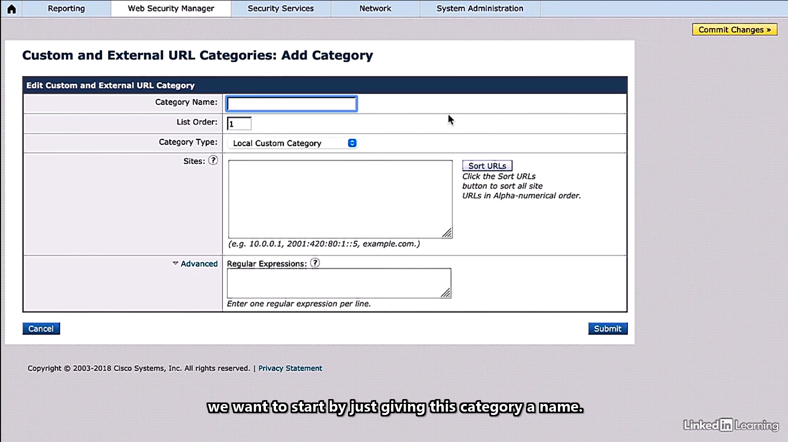
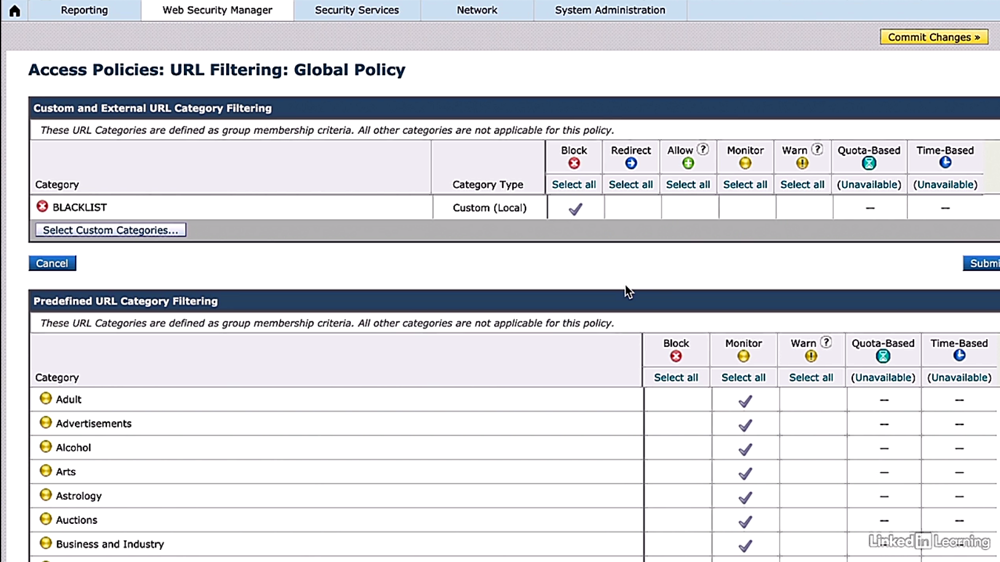

# Blacklisting and whitelisting

Trainer: Charles Judd

- Demo add blacklisting on WSA
  - WSA dashboard > Web Security Manager > Custom and External URL Categories
  - Custom and External URL Categories > 'Add Category...' button
  - (demo only) Custom and External URL Categories: Add Category: Category name = BLACKLIST; Category Type = External Live Feed Category; Feed File Location: Cisco Feed Format = On, Office 365 Feed Format = Off (eas XML format, but CSV and JSON format now)
  - Custom and External URL Categories: Add Category: Category name = BLACKLIST; Category Type = Local Custom Category; Sites = facebook.com; Advance = none > 'Submit' button

- Demo: add BLACKLIST to policy
  - WSA dashboard > Web Security Manager > Access Policies
  - Access Policies > Group = Global Policy; Url Filtering = Monitor: 87 > 'Monitor: 87' field
  - Access Policies: URL Filtering: Global Policy > 'Select Custom Categories...' button
  - Select Custom Categories for this policy > Category = BLACKLIST; Category Type = Custom (Local); Setting Selection = Include in policy > 'Apply' button
  - Access Policies: URL Filtering: Global Policy > Custom and External URL Category Filtering > Category = BLACKLIST; Action = Block

  
  
  

